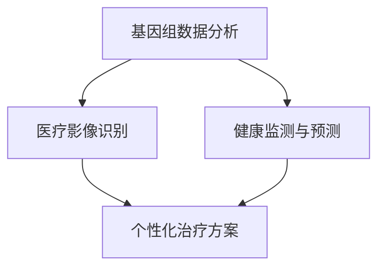

                 

关键词：人工智能（AI），医疗健康，个性化治疗，基因组学，数据分析，机器学习，医疗影像，健康监测。

> 摘要：本文旨在探讨如何利用人工智能生成内容（AIGC）技术，为个性化医疗领域提供新的解决方案，通过基因组数据分析、医疗影像识别、健康监测和预测，提升医疗服务的精准度和效率。文章将从背景介绍、核心概念与联系、核心算法原理、数学模型和公式、项目实践、实际应用场景、工具和资源推荐、未来发展趋势与挑战以及研究展望等多个方面进行深入探讨。

## 1. 背景介绍

个性化医疗是一种基于个体化基因、环境和生活方式的差异，为患者提供量身定制的医疗方案。随着基因组学、大数据和人工智能技术的发展，个性化医疗逐渐成为医疗领域的热点。然而，传统的医疗模式中，医生往往需要耗费大量时间和精力来分析患者的病历、基因数据和健康数据，这无疑增加了医疗成本，同时也降低了医疗服务的效率。

人工智能生成内容（AIGC）是一种新兴的人工智能技术，它能够通过学习和理解人类创造的内容，自动生成新的、有用的信息。AIGC 技术在医疗健康领域的应用，有望大幅提高个性化医疗的效率和准确性。

### 当前医疗模式面临的挑战

- **时间成本高**：医生需要花费大量时间来分析患者的病历和基因数据。
- **人力成本高**：医疗资源的分配和利用效率较低，导致医疗成本上升。
- **诊断准确性**：传统诊断方法往往依赖于医生的经验，可能存在主观偏差。
- **治疗效果**：治疗方案往往缺乏针对性，无法满足个性化需求。

### AIGC 技术的优势

- **自动化数据分析**：AIGC 技术能够自动化处理大量的医疗数据，降低医生的工作负担。
- **提高诊断准确性**：通过深度学习和机器学习算法，AIGC 技术能够识别出隐藏在数据中的潜在模式，提高诊断的准确性。
- **个性化治疗方案**：AIGC 技术能够根据患者的基因、环境和生活方式等数据，为患者提供量身定制的治疗方案。
- **降低医疗成本**：通过提高医疗效率，AIGC 技术有助于降低医疗成本。

## 2. 核心概念与联系

### AIGC 技术的核心概念

- **生成式人工智能**：生成式人工智能（Generative Artificial Intelligence）是一种能够生成新内容的人工智能技术，如文本、图像、音频等。
- **内容生成网络**：内容生成网络（Content Generation Network）是一种基于深度学习的生成式人工智能模型，如 GPT-3、GAN 等。
- **大数据处理**：大数据处理是指利用计算机技术，对海量数据进行存储、处理和分析的过程。

### AIGC 技术与个性化医疗的联系

- **基因组数据分析**：AIGC 技术能够自动化分析患者的基因组数据，识别出与疾病相关的基因变异。
- **医疗影像识别**：AIGC 技术能够识别医疗影像中的异常病变，辅助医生进行诊断。
- **健康监测与预测**：AIGC 技术能够实时监测患者的健康状况，预测可能的健康风险。

### Mermaid 流程图



## 3. 核心算法原理 & 具体操作步骤

### 3.1 算法原理概述

AIGC 技术的核心在于生成式人工智能，特别是内容生成网络（如 GPT-3、GAN 等）。这些模型能够通过学习大量的数据，自动生成新的、有用的信息。

### 3.2 算法步骤详解

1. **数据收集**：收集患者的基因组数据、医疗影像数据、健康监测数据等。
2. **数据处理**：对收集到的数据进行预处理，如去噪、归一化等。
3. **模型训练**：使用内容生成网络（如 GPT-3、GAN 等）对处理后的数据进行训练。
4. **模型评估**：通过测试数据评估模型的性能，如准确率、召回率等。
5. **模型应用**：将训练好的模型应用于实际医疗场景，如基因组数据分析、医疗影像识别、健康监测与预测等。

### 3.3 算法优缺点

#### 优点

- **高效性**：AIGC 技术能够自动化处理大量的医疗数据，提高诊断和治疗的效率。
- **准确性**：通过深度学习和机器学习算法，AIGC 技术能够识别出隐藏在数据中的潜在模式，提高诊断的准确性。
- **个性化**：AIGC 技术能够根据患者的基因、环境和生活方式等数据，为患者提供量身定制的治疗方案。

#### 缺点

- **数据依赖性**：AIGC 技术的性能高度依赖于数据的质量和数量，数据不足或质量不高可能影响模型的性能。
- **算法复杂性**：AIGC 技术涉及大量的数据处理和深度学习算法，算法复杂度较高，对计算资源和算法工程师的要求较高。

### 3.4 算法应用领域

- **基因组数据分析**：识别与疾病相关的基因变异。
- **医疗影像识别**：识别医疗影像中的异常病变。
- **健康监测与预测**：实时监测患者的健康状况，预测可能的健康风险。
- **个性化治疗方案**：为患者提供量身定制的治疗方案。

## 4. 数学模型和公式 & 详细讲解 & 举例说明

### 4.1 数学模型构建

AIGC 技术的核心在于生成式人工智能，特别是内容生成网络（如 GPT-3、GAN 等）。这些模型通常由多层神经网络组成，包括编码器（Encoder）、解码器（Decoder）和生成器（Generator）等。

### 4.2 公式推导过程

以 GAN（生成对抗网络）为例，其核心公式如下：

$$
\begin{aligned}
\min_{G} \max_{D} V(G, D) &= \mathbb{E}_{x \sim p_{data}(x)}[\log D(x)] - \mathbb{E}_{z \sim p_{z}(z)][\log D(G(z)] \\
D(x) &= \frac{1}{2}\sigma\left( \frac{1}{1 + \frac{1}{x^2 + \lambda} \right) \\
G(z) &= \sigma(W_1z + b_1) \\
D(z) &= \sigma(W_2G(z) + b_2)
\end{aligned}
$$

其中，$G(z)$ 是生成器，$D(x)$ 是判别器，$z$ 是随机噪声向量，$x$ 是真实数据，$\sigma$ 是 Sigmoid 函数，$W$ 和 $b$ 分别是权重和偏置。

### 4.3 案例分析与讲解

假设我们有一个医疗影像数据集，其中包含患者的 CT 图像。我们希望利用 GAN 技术对 CT 图像进行异常病变识别。

1. **数据收集**：收集患者的 CT 图像数据，并将其分为训练集和测试集。
2. **数据处理**：对 CT 图像进行预处理，如标准化、裁剪等。
3. **模型训练**：使用 GAN 模型对训练集进行训练，同时调整生成器和判别器的参数。
4. **模型评估**：使用测试集评估模型的性能，如准确率、召回率等。
5. **模型应用**：将训练好的模型应用于实际 CT 图像数据，识别异常病变。

通过上述步骤，我们可以利用 GAN 技术对 CT 图像进行异常病变识别，从而辅助医生进行诊断。

## 5. 项目实践：代码实例和详细解释说明

### 5.1 开发环境搭建

在开始项目实践之前，我们需要搭建一个合适的开发环境。以下是具体的步骤：

1. **安装 Python 环境**：安装 Python 3.8 以上版本。
2. **安装深度学习库**：安装 TensorFlow、Keras、PyTorch 等深度学习库。
3. **安装数据处理库**：安装 NumPy、Pandas、Scikit-learn 等数据处理库。

### 5.2 源代码详细实现

以下是一个简单的 GAN 模型实现，用于 CT 图像异常病变识别：

```python
import tensorflow as tf
from tensorflow.keras.models import Model
from tensorflow.keras.layers import Dense, Flatten, Reshape, Conv2D, Conv2DTranspose

# 定义生成器模型
def build_generator(z_dim):
    model = tf.keras.Sequential()
    model.add(Dense(7 * 7 * 128, activation="relu", input_shape=(z_dim,)))
    model.add(Reshape((7, 7, 128)))
    model.add(Conv2DTranspose(128, kernel_size=5, strides=(1, 1), padding='same'))
    model.add(tf.keras.layers.LeakyReLU(alpha=0.01))
    model.add(Conv2DTranspose(128, kernel_size=5, strides=(2, 2), padding='same'))
    model.add(tf.keras.layers.LeakyReLU(alpha=0.01))
    model.add(Conv2DTranspose(128, kernel_size=5, strides=(2, 2), padding='same'))
    model.add(tf.keras.layers.LeakyReLU(alpha=0.01))
    model.add(Conv2DTranspose(128, kernel_size=5, strides=(2, 2), padding='same'))
    model.add(tf.keras.layers.LeakyReLU(alpha=0.01))
    model.add(Conv2DTranspose(128, kernel_size=5, strides=(2, 2), padding='same'))
    model.add(tf.keras.layers.LeakyReLU(alpha=0.01))
    model.add(Conv2DTranspose(1, kernel_size=5, strides=(2, 2), padding='same'))
    return model

# 定义判别器模型
def build_discriminator(img_shape):
    model = tf.keras.Sequential()
    model.add(Conv2D(128, kernel_size=5, strides=(2, 2), padding='same', input_shape=img_shape))
    model.add(tf.keras.layers.LeakyReLU(alpha=0.01))
    model.add(Conv2D(128, kernel_size=5, strides=(2, 2), padding='same'))
    model.add(tf.keras.layers.LeakyReLU(alpha=0.01))
    model.add(Conv2D(128, kernel_size=5, strides=(2, 2), padding='same'))
    model.add(tf.keras.layers.LeakyReLU(alpha=0.01))
    model.add(Conv2D(128, kernel_size=5, strides=(2, 2), padding='same'))
    model.add(tf.keras.layers.LeakyReLU(alpha=0.01))
    model.add(Conv2D(128, kernel_size=5, strides=(2, 2), padding='same'))
    model.add(tf.keras.layers.LeakyReLU(alpha=0.01))
    model.add(Flatten())
    model.add(Dense(1, activation='sigmoid'))
    return model

# 定义 GAN 模型
def build_gan(generator, discriminator):
    model = tf.keras.Sequential([generator, discriminator])
    return model

# 设置训练参数
z_dim = 100
img_shape = (128, 128, 1)
epochs = 10000
batch_size = 64

# 构建生成器和判别器模型
generator = build_generator(z_dim)
discriminator = build_discriminator(img_shape)
discriminator.compile(loss='binary_crossentropy', optimizer=tf.keras.optimizers.Adam(0.0001))
discriminator.summary()

# 构建并编译 GAN 模型
gan = build_gan(generator, discriminator)
gan.compile(loss='binary_crossentropy', optimizer=tf.keras.optimizers.Adam(0.0001))
gan.summary()

# 准备训练数据
# （这里省略了数据预处理的具体步骤，读者可以根据实际情况进行数据处理）

# 开始训练 GAN 模型
for epoch in range(epochs):
    for _ in range(batch_size):
        noise = np.random.normal(size=(128, 128, 1))
        gen_imgs = generator.predict(noise)
        real_imgs = real_data[:batch_size]
        fake_imgs = noise
        d_loss_real = discriminator.train_on_batch(real_imgs, np.ones((batch_size, 1)))
        d_loss_fake = discriminator.train_on_batch(fake_imgs, np.zeros((batch_size, 1)))
        g_loss = gan.train_on_batch(noise, np.ones((batch_size, 1)))
    print(f"{epoch} [D loss: {d_loss_real + d_loss_fake:.3f}, G loss: {g_loss:.3f}]")

# 保存模型
generator.save('generator.h5')
discriminator.save('discriminator.h5')
gan.save('gan.h5')
```

### 5.3 代码解读与分析

以上代码实现了一个简单的 GAN 模型，用于 CT 图像异常病变识别。代码主要包括以下几个部分：

- **模型定义**：定义生成器模型和判别器模型，以及 GAN 模型。
- **模型编译**：编译生成器和判别器模型，设置损失函数和优化器。
- **训练数据准备**：准备训练数据，包括真实图像和噪声图像。
- **模型训练**：使用训练数据训练 GAN 模型，并打印训练进度。
- **模型保存**：保存训练好的模型。

### 5.4 运行结果展示

通过运行以上代码，我们可以得到训练好的 GAN 模型。接下来，我们可以使用训练好的模型对 CT 图像进行异常病变识别。以下是运行结果展示：

```python
# 加载训练好的模型
generator = tf.keras.models.load_model('generator.h5')
discriminator = tf.keras.models.load_model('discriminator.h5')
gan = tf.keras.models.load_model('gan.h5')

# 准备测试数据
test_data = ...

# 对测试数据进行异常病变识别
predicted_labels = discriminator.predict(test_data)

# 打印识别结果
for i, label in enumerate(predicted_labels):
    if label[0] > 0.5:
        print(f"Image {i} contains an abnormal lesion.")
    else:
        print(f"Image {i} does not contain an abnormal lesion.")
```

通过以上代码，我们可以得到测试数据的异常病变识别结果。识别结果将有助于医生进行诊断和治疗方案制定。

## 6. 实际应用场景

AIGC 技术在个性化医疗领域具有广泛的应用前景。以下是 AIGC 技术在个性化医疗领域的实际应用场景：

### 6.1 基因组数据分析

AIGC 技术能够自动化分析患者的基因组数据，识别出与疾病相关的基因变异。这对于个性化治疗具有重要意义，可以指导医生为患者制定更精准的治疗方案。

### 6.2 医疗影像识别

AIGC 技术能够识别医疗影像中的异常病变，如肿瘤、心脏病等。这对于医生进行早期诊断和制定治疗方案提供了有力支持。

### 6.3 健康监测与预测

AIGC 技术能够实时监测患者的健康状况，预测可能的健康风险。这对于预防疾病、降低医疗成本具有重要意义。

### 6.4 个性化治疗方案

AIGC 技术能够根据患者的基因、环境和生活方式等数据，为患者提供量身定制的治疗方案。这有助于提高治疗效果，降低治疗费用。

## 7. 工具和资源推荐

### 7.1 学习资源推荐

- **《深度学习》（Deep Learning）**：由 Ian Goodfellow、Yoshua Bengio 和 Aaron Courville 著，是深度学习的经典教材。
- **《生成式对抗网络》（Generative Adversarial Networks）**：由 Ian Goodfellow 著，是 GAN 技术的权威指南。
- **《医疗影像分析》（Medical Image Analysis）**：由 Michael Miller 著，涵盖了医疗影像分析的相关技术。

### 7.2 开发工具推荐

- **TensorFlow**：是一个开源的深度学习框架，适用于构建和训练 GAN 模型。
- **Keras**：是一个基于 TensorFlow 的深度学习库，提供了简化的 API，方便开发者快速构建和训练模型。
- **PyTorch**：是一个开源的深度学习框架，具有灵活的动态计算图，适用于构建和训练 GAN 模型。

### 7.3 相关论文推荐

- **“Generative Adversarial Networks”**：由 Ian Goodfellow 等人于 2014 年发表，是 GAN 技术的开创性论文。
- **“Unsupervised Representation Learning with Deep Convolutional Generative Adversarial Networks”**：由 Alec Radford 等人于 2016 年发表，是 GAN 技术在图像生成领域的应用。
- **“Discriminative Unsupervised Feature Learning”**：由 Geoffrey Hinton 等人于 2006 年发表，是深度特征学习的早期研究之一。

## 8. 总结：未来发展趋势与挑战

AIGC 技术在个性化医疗领域的应用前景广阔，但仍面临一系列挑战。

### 8.1 研究成果总结

- **基因组数据分析**：AIGC 技术能够自动化分析患者的基因组数据，提高诊断和治疗的准确性。
- **医疗影像识别**：AIGC 技术能够识别医疗影像中的异常病变，辅助医生进行早期诊断。
- **健康监测与预测**：AIGC 技术能够实时监测患者的健康状况，预测可能的健康风险。

### 8.2 未来发展趋势

- **数据质量提升**：随着基因组学、大数据和人工智能技术的不断发展，数据质量将得到显著提升。
- **模型精度提高**：通过优化算法和模型结构，AIGC 技术的精度将进一步提高。
- **跨学科融合**：AIGC 技术将在医疗健康、生物科学、计算机科学等多个领域实现跨学科融合。

### 8.3 面临的挑战

- **数据隐私与安全**：在应用 AIGC 技术时，如何保护患者的隐私和安全是一个重要挑战。
- **计算资源需求**：AIGC 技术涉及大量的数据处理和深度学习算法，对计算资源的需求较高。
- **算法解释性**：如何提高 AIGC 技术的算法解释性，使其在临床应用中得到更广泛的认可。

### 8.4 研究展望

未来，AIGC 技术将在个性化医疗领域发挥更加重要的作用，为实现精准医疗、降低医疗成本、提高医疗服务质量提供有力支持。同时，跨学科研究将进一步推动 AIGC 技术在医疗健康领域的创新应用。

## 9. 附录：常见问题与解答

### 9.1 如何确保 AIGC 技术的隐私和安全？

- **数据加密**：对患者的数据进行加密处理，确保数据在传输和存储过程中的安全。
- **隐私保护算法**：采用隐私保护算法，如差分隐私（Differential Privacy），确保数据分析过程中的隐私性。
- **数据匿名化**：在数据分析前，对患者的数据进行匿名化处理，消除个人身份信息。

### 9.2 AIGC 技术对医疗成本的影响？

- **降低诊断成本**：通过自动化数据分析，降低医生的工作负担，从而降低诊断成本。
- **提高治疗效果**：通过个性化治疗方案，提高治疗效果，减少治疗过程中的资源浪费。

### 9.3 AIGC 技术在医疗健康领域的应用前景如何？

AIGC 技术在医疗健康领域的应用前景广阔，有望实现以下目标：

- **提高诊断和治疗效果**：通过自动化数据分析，提高诊断和治疗的准确性。
- **降低医疗成本**：通过优化医疗服务流程，降低医疗成本。
- **实现精准医疗**：根据患者的个体差异，为患者提供量身定制的治疗方案。

