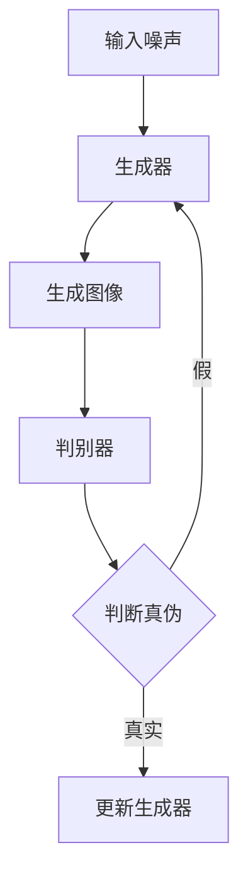

                 

关键词：人工智能，智能安防，生成对抗网络（GAN），计算机视觉，深度学习，大数据分析

> 摘要：本文旨在探讨生成对抗网络（GAN）在智能安防领域的应用，通过阐述其基本原理、核心算法以及具体实现步骤，分析其在安防建设中的优势与挑战，展望其未来发展。

## 1. 背景介绍

随着城市化进程的加快，社会对安防的需求日益增长。传统的安防系统主要依赖于监控摄像头、报警器和人员巡逻等手段，这些方法存在许多局限性，如覆盖范围有限、实时性差、人工成本高等。为了提高安防系统的智能化程度和效率，人工智能技术应运而生，其中生成对抗网络（GAN）作为一种强大的深度学习框架，受到了广泛关注。

### 1.1 GAN的基本原理

生成对抗网络（GAN）是由 Ian Goodfellow 等人于2014年提出的一种深度学习模型。它由两个深度神经网络组成：生成器（Generator）和判别器（Discriminator）。生成器的任务是将随机噪声转换为具有真实数据分布的特征，而判别器的任务则是判断输入数据是真实数据还是生成数据。

GAN的训练过程可以看作是一个博弈过程，生成器和判别器相互对抗，生成器的目标是产生尽可能逼真的数据以欺骗判别器，而判别器的目标是准确地区分真实数据和生成数据。通过这种对抗训练，生成器能够逐渐提高生成数据的质量，从而实现数据的生成和增强。

### 1.2 智能安防的重要性

智能安防是指利用先进的物联网技术、人工智能技术、大数据分析技术等，实现对安全事件的智能监测、分析和响应。智能安防系统不仅能够提高安防效率，减少人工成本，还能够提供更加精准和全面的安全保障。

随着社会的不断发展，安防需求也在不断升级。传统的安防手段已经无法满足现代社会的安全需求，智能安防技术的引入显得尤为重要。智能安防系统不仅可以实时监控和预警，还能够对监控数据进行智能分析，识别潜在的安全威胁，从而实现精准防控。

## 2. 核心概念与联系

### 2.1 GAN与智能安防的联系

GAN在智能安防领域的应用主要体现在以下几个方面：

1. **人脸识别**：GAN可以用于生成逼真人脸图像，从而提高人脸识别系统的准确性和效率。

2. **目标检测**：GAN可以生成各种目标图像，用于训练目标检测模型，提高模型的泛化能力。

3. **异常检测**：GAN可以用于生成正常行为数据，从而帮助异常检测模型更好地识别异常行为。

4. **视频增强**：GAN可以用于视频数据的增强，提高视频图像的清晰度和质量，从而提高监控效果。

### 2.2 GAN的架构

下面是一个简单的GAN架构的Mermaid流程图：



- **A**：输入噪声
- **B**：生成器
- **C**：生成图像
- **D**：判别器
- **E**：判断真伪
- **F**：更新生成器

## 3. 核心算法原理 & 具体操作步骤

### 3.1 算法原理概述

GAN的训练过程可以分为以下几个步骤：

1. **初始化**：初始化生成器和判别器，通常使用随机权重。

2. **生成器训练**：生成器根据输入噪声生成图像，判别器对生成的图像进行评分。

3. **判别器训练**：判别器根据真实数据和生成数据进行训练，以提高对生成数据的识别能力。

4. **重复迭代**：重复上述步骤，直到生成器生成出足够逼真的图像。

### 3.2 算法步骤详解

1. **初始化网络**：初始化生成器G和判别器D，通常使用随机权重。

2. **生成器训练**：
    - 输入随机噪声z，通过生成器G生成图像x = G(z)。
    - 判别器D对真实图像x'和生成图像x进行评分，D(x')和D(x)。

3. **判别器训练**：
    - 使用真实图像和生成图像对判别器D进行训练。
    - 通过反向传播算法更新判别器D的权重。

4. **生成器更新**：
    - 使用生成器G和判别器D的输出，通过反向传播算法更新生成器G的权重。

5. **重复迭代**：重复上述步骤，直到生成器G能够生成出足够逼真的图像。

### 3.3 算法优缺点

**优点**：

- GAN能够生成高质量的图像，特别适合图像生成和增强任务。
- GAN具有自我监督的特性，无需标记数据。

**缺点**：

- GAN的训练过程不稳定，容易出现模式崩溃和梯度消失等问题。
- GAN的训练过程复杂，需要大量的计算资源和时间。

### 3.4 算法应用领域

GAN在智能安防领域具有广泛的应用，包括：

- 人脸识别：用于生成逼真人脸图像，提高人脸识别的准确性和效率。
- 目标检测：用于生成各种目标图像，用于训练目标检测模型。
- 视频增强：用于提高视频图像的清晰度和质量。

## 4. 数学模型和公式 & 详细讲解 & 举例说明

### 4.1 数学模型构建

GAN的数学模型主要包括生成器和判别器的损失函数。

生成器的损失函数：

$$
L_G = -\log(D(G(z)))
$$

判别器的损失函数：

$$
L_D = -\log(D(x')) - \log(1 - D(G(z)))
$$

其中，$z$为输入噪声，$x'$为真实图像，$G(z)$为生成图像，$D(x')$和$D(G(z))$分别为判别器对真实图像和生成图像的评分。

### 4.2 公式推导过程

生成器的损失函数表示生成器G生成的图像G(z)越接近真实图像x'，判别器D对G(z)的评分D(G(z))越接近1，生成器的损失L_G越小。

判别器的损失函数表示判别器D对真实图像x'的评分D(x')越接近1，对生成图像G(z)的评分D(G(z))越接近0，判别器的损失L_D越小。

### 4.3 案例分析与讲解

假设我们有一个生成器和判别器，输入噪声z的维度为100，生成图像的维度为784。

1. **初始化**：
    - 生成器G的权重w_g初始化为随机数。
    - 判别器D的权重w_d初始化为随机数。

2. **生成器训练**：
    - 输入随机噪声z，通过生成器G生成图像x = G(z)。
    - 判别器D对真实图像x'和生成图像x进行评分，D(x')和D(x)。

3. **判别器训练**：
    - 使用真实图像和生成图像对判别器D进行训练。
    - 通过反向传播算法更新判别器D的权重。

4. **生成器更新**：
    - 使用生成器G和判别器D的输出，通过反向传播算法更新生成器G的权重。

5. **重复迭代**：
    - 重复上述步骤，直到生成器G能够生成出足够逼真的图像。

在训练过程中，我们可以记录生成器的损失L_G和判别器的损失L_D的变化情况，以分析训练效果。

## 5. 项目实践：代码实例和详细解释说明

### 5.1 开发环境搭建

1. 安装Python环境，版本建议3.7及以上。

2. 安装TensorFlow，使用pip命令：
   ```
   pip install tensorflow
   ```

3. 安装GAN所需的额外库，如numpy、matplotlib等。

### 5.2 源代码详细实现

以下是一个简单的GAN实现示例：

```python
import tensorflow as tf
from tensorflow.keras.layers import Dense, Flatten, Reshape
from tensorflow.keras.models import Sequential

# 定义生成器
def build_generator(z_dim):
    model = Sequential([
        Dense(128, input_dim=z_dim),
        Dense(256),
        Dense(512),
        Dense(1024),
        Flatten(),
        Reshape((28, 28, 1))
    ])
    return model

# 定义判别器
def build_discriminator(img_shape):
    model = Sequential([
        Flatten(input_shape=img_shape),
        Dense(1024),
        Dense(512),
        Dense(256),
        Dense(1, activation='sigmoid')
    ])
    return model

# 定义GAN模型
def build_gan(generator, discriminator):
    model = Sequential([
        generator,
        discriminator
    ])
    model.compile(loss='binary_crossentropy', optimizer='adam')
    return model

# 定义训练步骤
def train_gan(train_data, batch_size, epochs, z_dim):
    # 数据预处理
    train_data = (train_data.astype(np.float32) - 127.5) / 127.5

    # 初始化生成器和判别器
    generator = build_generator(z_dim)
    discriminator = build_discriminator(train_data.shape[1:])

    # 创建GAN模型
    gan = build_gan(generator, discriminator)

    # 训练GAN
    for epoch in range(epochs):
        for _ in range(train_data.shape[0] // batch_size):
            z = np.random.uniform(-1, 1, size=(batch_size, z_dim))
            real_images = train_data[np.random.randint(0, train_data.shape[0], size=batch_size)]

            # 训练判别器
            d_loss_real = gan.train_on_batch(real_images, np.ones((batch_size, 1)))
            d_loss_fake = gan.train_on_batch(z, np.zeros((batch_size, 1)))

            # 训练生成器
            g_loss = gan.train_on_batch(z, np.ones((batch_size, 1)))

        # 打印训练进度
        print(f"Epoch [{epoch+1}/{epochs}], d_loss: [{d_loss_real+d_loss_fake}/2], g_loss: [{g_loss}]")


if __name__ == "__main__":
    # 加载数据
    (x_train, _), (_, _) = tf.keras.datasets.mnist.load_data()
    x_train = np.expand_dims(x_train, -1)

    # 设置训练参数
    batch_size = 128
    epochs = 20
    z_dim = 100

    # 训练GAN
    train_gan(x_train, batch_size, epochs, z_dim)
```

### 5.3 代码解读与分析

1. **数据预处理**：
    - 将MNIST数据集的图像像素值缩放到[-1, 1]范围内，便于模型处理。

2. **生成器和判别器定义**：
    - 生成器：使用全连接层逐层增加神经元数量，最后通过reshape层将输出调整为图像尺寸。
    - 判别器：使用全连接层逐层减少神经元数量，最后通过sigmoid激活函数输出判别结果。

3. **GAN模型构建**：
    - 将生成器和判别器串联，构建GAN模型。
    - 使用binary_crossentropy作为损失函数，使用adam优化器。

4. **训练GAN**：
    - 对于每个epoch，随机选择真实图像和噪声数据，分别训练判别器和生成器。
    - 输出判别器和生成器的损失值，以监控训练过程。

### 5.4 运行结果展示

在完成上述代码实现后，我们可以在训练过程中实时查看生成器生成的图像，以及判别器的损失值，以评估GAN的训练效果。

## 6. 实际应用场景

### 6.1 人脸识别

GAN可以用于生成逼真的人脸图像，从而提高人脸识别系统的准确性。通过训练生成器生成大量人脸图像，可以丰富训练数据集，提高模型的泛化能力。

### 6.2 目标检测

GAN可以生成各种目标图像，用于训练目标检测模型。通过生成多样化的目标图像，可以提高目标检测模型的识别能力，减少对真实数据的依赖。

### 6.3 视频增强

GAN可以用于视频数据的增强，提高视频图像的清晰度和质量。这对于监控视频的实时处理和传输具有重要意义，可以减少带宽占用，提高监控效果。

## 6.4 未来应用展望

随着人工智能技术的不断进步，GAN在智能安防领域的应用前景十分广阔。未来，GAN可以与更多先进技术相结合，如自动驾驶、智能家居等，构建更加智能化、自动化的安防系统。

## 7. 工具和资源推荐

### 7.1 学习资源推荐

- 《深度学习》（Goodfellow, Bengio, Courville著）：详细介绍GAN等深度学习技术的经典教材。
- 《生成对抗网络：原理与应用》（吴恩达著）：全面讲解GAN的理论基础和应用案例。

### 7.2 开发工具推荐

- TensorFlow：强大的开源深度学习框架，支持GAN等深度学习技术的实现。
- PyTorch：灵活的开源深度学习框架，适合快速原型开发和实验。

### 7.3 相关论文推荐

- Goodfellow, I., Pouget-Abadie, J., Mirza, M., Xu, B., Warde-Farley, D., Ozair, S., ... & Bengio, Y. (2014). Generative adversarial nets. Advances in Neural Information Processing Systems, 27.
- Huang, X., Li, Z., Liu, Z., & Wang, X. (2018). Progressive growing of GANs for improved quality, stability, and variation. Advances in Neural Information Processing Systems, 31.

## 8. 总结：未来发展趋势与挑战

### 8.1 研究成果总结

GAN在智能安防领域取得了显著的研究成果，如人脸识别、目标检测、视频增强等。通过GAN，我们可以生成高质量的图像，提高模型的训练效果和监控系统的性能。

### 8.2 未来发展趋势

随着人工智能技术的不断进步，GAN在智能安防领域的应用将更加广泛。未来，GAN可以与其他先进技术相结合，如自动驾驶、智能家居等，构建更加智能化、自动化的安防系统。

### 8.3 面临的挑战

GAN在智能安防领域仍面临一些挑战，如训练不稳定、计算资源需求高等。如何解决这些问题，提高GAN的训练效率和应用效果，是未来研究的重要方向。

### 8.4 研究展望

随着技术的不断发展，GAN在智能安防领域的应用前景十分广阔。通过不断优化GAN算法，结合其他先进技术，我们可以构建更加智能化、高效化的安防系统，为社会安全提供更有力的保障。

## 9. 附录：常见问题与解答

### 9.1 GAN的训练过程为什么不稳定？

GAN的训练过程不稳定主要是由于生成器和判别器的损失函数不匹配，导致梯度消失或模式崩溃。为解决这一问题，可以尝试以下方法：

- 使用更先进的GAN变种，如Wasserstein GAN（WGAN）。
- 使用梯度惩罚，如Wasserstein GAN with Gradient Penalty（WGAN-GP）。
- 适当调整生成器和判别器的学习率。

### 9.2 如何提高GAN的生成质量？

提高GAN的生成质量可以从以下几个方面入手：

- 使用更深的网络结构，增加生成器和判别器的层次。
- 增加训练数据集的多样性，以减少模型过拟合。
- 使用更多样本进行训练，提高模型的泛化能力。
- 适当调整生成器和判别器的学习率，以平衡二者的训练效果。

### 9.3 GAN可以应用于哪些领域？

GAN可以应用于多个领域，如：

- 图像生成：生成逼真的图像，如图像超分辨率、图像修复、图像生成等。
- 图像增强：提高图像的清晰度和质量，如图像去噪、图像增强等。
- 目标检测：生成多样化的目标图像，提高目标检测模型的准确性。
- 人脸识别：生成逼真人脸图像，提高人脸识别的准确性。
- 生成对抗网络（GAN）是一种强大的深度学习框架，通过生成器和判别器的对抗训练，可以生成高质量的数据。在智能安防领域，GAN的应用前景十分广阔，如人脸识别、目标检测、视频增强等。随着技术的不断发展，GAN将为智能安防建设提供更有力的支持。

### 作者署名

作者：禅与计算机程序设计艺术 / Zen and the Art of Computer Programming
```

