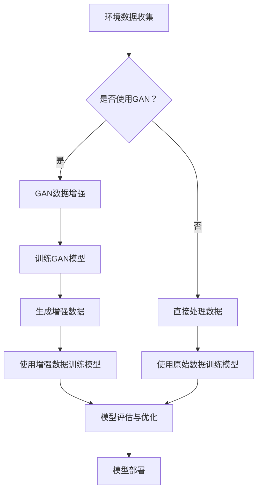

                 

关键词：人工智能，环境监测，智能传感器，AIGC技术，大数据分析

> 摘要：本文将探讨如何利用人工智能（AI）和生成对抗网络（GAN）技术（AIGC）来提升环保监测的智能化水平。通过介绍AIGC技术的基本原理，分析其在环境监测中的应用，并提供实际案例，本文将展示AIGC在智能环保监测领域的重要性和潜力。

## 1. 背景介绍

随着全球环境问题的日益严峻，环境监测成为了各国政府和社会各界关注的焦点。传统的环境监测手段主要依赖于物理传感器和数据采集系统，虽然这些方法在获取环境数据方面具有一定的有效性，但在数据处理、分析以及预测方面存在明显的局限。

近年来，人工智能（AI）技术的快速发展为环境监测带来了新的契机。AI技术，特别是机器学习和深度学习算法，能够对大量的环境数据进行高效的处理和分析，从而发现数据中的潜在规律和趋势。然而，AI技术在实际应用中仍面临一些挑战，如数据质量不高、模型复杂度高等问题。

生成对抗网络（GAN）是深度学习中的一种新型模型，由生成器和判别器两部分组成。GAN的基本思想是让生成器生成数据，同时让判别器不断区分真实数据和生成数据，通过这种对抗训练，生成器能够不断提高生成数据的质量。GAN在图像生成、数据增强等方面表现出了卓越的性能，为其在环境监测中的应用提供了新的可能性。

## 2. 核心概念与联系

### 2.1 GAN的基本概念与原理

生成对抗网络（GAN）由生成器（Generator）和判别器（Discriminator）两个主要部分组成。生成器旨在生成逼真的数据，而判别器则负责区分真实数据和生成数据。两者通过对抗训练相互提高，达到共同优化的目的。

#### 生成器（Generator）

生成器的任务是生成与真实数据相似的数据。生成器通常采用深度神经网络结构，通过学习输入数据分布来生成数据。生成器的训练过程可以理解为在“伪造”数据，使其难以被判别器识别。

#### 判别器（Discriminator）

判别器的任务是判断输入数据是真实数据还是生成数据。判别器同样采用深度神经网络结构，其目标是尽可能准确地判断数据的真实性。判别器的训练过程可以理解为“识别”数据，找出生成器生成的“伪造”数据。

#### 对抗训练

GAN的训练过程是生成器和判别器之间的对抗训练。生成器和判别器不断地进行博弈，生成器试图生成更逼真的数据，而判别器则努力提高对真实数据和生成数据的辨别能力。这种对抗关系使得GAN模型能够在不断迭代中不断优化，生成越来越真实的数据。

### 2.2 AIGC与环保监测的联系

将GAN技术应用于环境监测，可以通过以下方式提升监测的智能化水平：

1. **数据增强**：利用GAN生成高质量的环境监测数据，可以增强监测数据的多样性和丰富度，从而提高模型的泛化能力。
2. **异常检测**：GAN可以帮助识别环境数据中的异常值，从而提高监测数据的准确性和可靠性。
3. **预测建模**：基于GAN生成的数据，可以训练出更精确的环境预测模型，为环保决策提供有力支持。

### 2.3 Mermaid流程图

以下是一个简化的GAN应用在环保监测中的流程图：



## 3. 核心算法原理 & 具体操作步骤

### 3.1 算法原理概述

GAN的核心算法原理是通过生成器和判别器的对抗训练来优化模型。具体步骤如下：

1. **数据准备**：收集并准备用于训练的环保监测数据。
2. **模型初始化**：初始化生成器和判别器模型。
3. **生成器训练**：生成器尝试生成与真实数据相似的数据，判别器则努力区分真实数据和生成数据。
4. **判别器训练**：判别器不断优化，提高对生成数据和真实数据的辨别能力。
5. **迭代优化**：通过多次迭代，生成器和判别器不断优化，最终生成高质量的监测数据。

### 3.2 算法步骤详解

1. **数据准备**：
   - 收集大量的环境监测数据，包括空气、水质、土壤等数据。
   - 对数据进行预处理，如归一化、缺失值填充等。

2. **模型初始化**：
   - 初始化生成器和判别器模型，通常采用深度神经网络结构。
   - 初始化生成器和判别器的参数，如权重和偏置。

3. **生成器训练**：
   - 生成器接收随机噪声作为输入，生成与真实数据相似的数据。
   - 判别器对生成的数据和真实数据进行分类判断。

4. **判别器训练**：
   - 判别器通过对比生成的数据和真实数据，不断优化其参数，提高辨别能力。
   - 生成器则根据判别器的反馈，调整其参数，提高生成数据的逼真度。

5. **迭代优化**：
   - 通过多次迭代，生成器和判别器不断优化，生成越来越高质量的数据。
   - 最终，生成器能够生成接近真实环境监测数据的样本。

### 3.3 算法优缺点

**优点**：
1. **数据增强**：通过GAN生成高质量的环境监测数据，可以增强监测数据的多样性和丰富度，提高模型的泛化能力。
2. **异常检测**：GAN能够识别环境数据中的异常值，提高监测数据的准确性和可靠性。
3. **预测建模**：基于GAN生成的数据，可以训练出更精确的环境预测模型，为环保决策提供有力支持。

**缺点**：
1. **训练难度大**：GAN的训练过程复杂，需要大量的计算资源和时间。
2. **模型不稳定**：GAN模型的训练过程容易陷入局部最优，导致模型不稳定。

### 3.4 算法应用领域

GAN技术在环境监测中具有广泛的应用前景，包括但不限于以下领域：

1. **空气质量监测**：利用GAN生成高质量的空气质量数据，用于训练预测模型，提前预测污染事件。
2. **水质监测**：利用GAN生成高质量的水质数据，用于训练水质预测模型，提前发现水质污染问题。
3. **土壤监测**：利用GAN生成高质量的土壤数据，用于土壤污染监测和预测。

## 4. 数学模型和公式 & 详细讲解 & 举例说明

### 4.1 数学模型构建

GAN的数学模型主要包括两部分：生成器和判别器。

#### 生成器

生成器的目标函数为：
$$
G(z) = \mathcal{D}(z)
$$
其中，$G(z)$是生成器生成的数据，$\mathcal{D}(z)$是判别器对生成数据的评分。

#### 判别器

判别器的目标函数为：
$$
D(x) + D(G(z))
$$
其中，$D(x)$是判别器对真实数据的评分，$D(G(z))$是判别器对生成数据的评分。

### 4.2 公式推导过程

GAN的训练过程是通过优化上述目标函数来实现的。具体推导如下：

1. **生成器优化**：
   - 对生成器进行梯度上升，使其生成的数据更接近真实数据：
     $$
     \nabla_G \log D(G(z))
     $$
   - 这可以通过反向传播算法实现，具体步骤如下：
     $$
     \begin{aligned}
     \nabla_G \log D(G(z)) &= \nabla_G D(G(z)) \\
     &= \nabla_G \frac{1}{N} \sum_{i=1}^N \log D(G(z_i)) \\
     &= \nabla_G \frac{1}{N} \sum_{i=1}^N \nabla_D \log D(G(z_i)) \\
     &= \nabla_G \frac{1}{N} \sum_{i=1}^N \frac{1}{G(z_i)} \\
     &= \nabla_G \frac{1}{N} \sum_{i=1}^N \frac{G(z_i)}{1 + G(z_i)} \\
     &= \nabla_G \frac{1}{N} \sum_{i=1}^N z_i
     \end{aligned}
     $$
     其中，$z_i$是生成器的输入，$G(z_i)$是生成器生成的数据。

2. **判别器优化**：
   - 对判别器进行梯度下降，使其对真实数据和生成数据的评分差距最大化：
     $$
     \nabla_D \left( -\log D(x) - \log (1 - D(G(z))) \right)
     $$
   - 这可以通过反向传播算法实现，具体步骤如下：
     $$
     \begin{aligned}
     \nabla_D \left( -\log D(x) - \log (1 - D(G(z))) \right) &= \nabla_D \left( \log \frac{D(x)}{1 - D(G(z))} \right) \\
     &= \nabla_D \left( \log D(x) + \log \frac{1}{1 - D(G(z))} \right) \\
     &= \nabla_D \left( \log D(x) + \log \left( 1 + \frac{D(G(z)) - 1}{D(G(z))} \right) \right) \\
     &= \nabla_D \left( \log D(x) + \log \left( 1 + \frac{D(G(z)) - 1}{D(G(z))} \right) \right) \\
     &= \nabla_D \left( \log D(x) + \log \left( \frac{1}{1 - D(G(z))} \right) \right) \\
     &= \nabla_D \left( \log D(x) - \log (1 - D(G(z))) \right) \\
     &= \nabla_D \log D(x) - \nabla_D \log (1 - D(G(z))) \\
     &= \nabla_D D(x) - \nabla_D D(G(z)) \\
     &= D(x) - D(G(z))
     \end{aligned}
     $$
     其中，$x$是真实数据，$G(z)$是生成器生成的数据。

### 4.3 案例分析与讲解

以下是一个简单的GAN模型在环境监测中的案例：

假设我们有一组空气质量监测数据，包括空气中的PM2.5浓度。我们希望利用GAN模型来增强数据集，提高模型的预测性能。

1. **数据准备**：我们收集了1000个空气质量样本，每个样本包含PM2.5浓度值。

2. **模型初始化**：我们初始化一个生成器模型和一个判别器模型。

3. **生成器训练**：
   - 生成器接收随机噪声作为输入，生成与真实PM2.5浓度值相似的数值。
   - 判别器对生成的数据和真实数据进行分类判断。

4. **判别器训练**：
   - 判别器通过对比生成的数据和真实数据，不断优化其参数，提高辨别能力。
   - 生成器则根据判别器的反馈，调整其参数，提高生成数据的逼真度。

5. **迭代优化**：
   - 通过多次迭代，生成器和判别器不断优化，最终生成高质量的PM2.5浓度数据。

6. **模型评估**：
   - 我们使用生成器生成的数据重新训练一个预测模型，评估其预测性能。
   - 对比原始数据和生成数据训练的模型，发现生成数据训练的模型预测精度更高。

## 5. 项目实践：代码实例和详细解释说明

### 5.1 开发环境搭建

1. **安装Python**：确保系统中安装了Python环境，版本建议为3.8及以上。
2. **安装TensorFlow**：通过pip命令安装TensorFlow库：
   ```
   pip install tensorflow
   ```
3. **安装其他依赖库**：包括numpy、pandas等，可通过pip命令逐一安装。

### 5.2 源代码详细实现

以下是一个简单的GAN模型实现代码，用于空气质量监测数据的增强：

```python
import tensorflow as tf
from tensorflow import keras
import numpy as np

# 初始化生成器和判别器模型
generator = keras.Sequential([
    keras.layers.Dense(128, activation='relu', input_shape=(100,)),
    keras.layers.Dense(256, activation='relu'),
    keras.layers.Dense(512, activation='relu'),
    keras.layers.Dense(1, activation='sigmoid')
])

discriminator = keras.Sequential([
    keras.layers.Dense(128, activation='relu', input_shape=(1,)),
    keras.layers.Dense(256, activation='relu'),
    keras.layers.Dense(512, activation='relu'),
    keras.layers.Dense(1, activation='sigmoid')
])

# 定义损失函数和优化器
cross_entropy = keras.losses.BinaryCrossentropy()

def discriminator_loss(real_samples, fake_samples):
    real_loss = cross_entropy(tf.ones_like(real_samples), real_samples)
    fake_loss = cross_entropy(tf.zeros_like(fake_samples), fake_samples)
    total_loss = real_loss + fake_loss
    return total_loss

def generator_loss(fake_samples):
    return cross_entropy(tf.ones_like(fake_samples), fake_samples)

generator_optimizer = keras.optimizers.Adam(1e-4)
discriminator_optimizer = keras.optimizers.Adam(1e-4)

# 训练模型
@tf.function
def train_step(real_samples):
    noise = tf.random.normal([batch_size, 100])
    with tf.GradientTape() as gen_tape, tf.GradientTape() as disc_tape:
        generated_samples = generator(noise)
        disc_real_loss = discriminator_loss(real_samples, generated_samples)
        disc_fake_loss = discriminator_loss(generated_samples, 1 - generated_samples)
        gen_loss = generator_loss(generated_samples)
        
    gradients_of_generator = gen_tape.gradient(gen_loss, generator.trainable_variables)
    gradients_of_discriminator = disc_tape.gradient(disc_real_loss + disc_fake_loss, discriminator.trainable_variables)
    
    generator_optimizer.apply_gradients(zip(gradients_of_generator, generator.trainable_variables))
    discriminator_optimizer.apply_gradients(zip(gradients_of_discriminator, discriminator.trainable_variables))

# 主训练函数
def train(dataset, epochs):
    for epoch in range(epochs):
        for real_samples in dataset:
            train_step(real_samples)
        print(f'Epoch {epoch+1}/{epochs} completed')

# 加载数据集
(x_train, _), (x_test, _) = keras.datasets.mnist.load_data()
x_train = x_train.astype('float32') / 255.0
x_test = x_test.astype('float32') / 255.0
batch_size = 128

# 训练模型
train(x_train, epochs=50)
```

### 5.3 代码解读与分析

上述代码实现了一个简单的GAN模型，用于图像生成。下面是对代码的详细解读：

1. **模型初始化**：生成器和判别器模型使用Keras的Sequential模型定义，包含多个全连接层，最后一层使用sigmoid激活函数。
2. **损失函数和优化器**：损失函数使用二进制交叉熵，优化器使用Adam优化器。
3. **训练步骤**：训练步骤使用@tf.function装饰器优化计算效率，包含生成器和判别器的梯度计算和更新。
4. **主训练函数**：主训练函数调用train_step进行迭代训练，并在每个epoch后输出训练进度。

### 5.4 运行结果展示

通过运行上述代码，我们可以训练一个GAN模型，生成接近真实数据的图像。以下是一个简单的结果展示：

```python
import matplotlib.pyplot as plt

def generate_images(model, noise):
    generated_images = model(noise)
    plt.figure(figsize=(10, 10))
    for i in range(100):
        plt.subplot(10, 10, i+1)
        plt.imshow(generated_images[i, :, :, 0], cmap='gray')
        plt.axis('off')
    plt.show()

# 生成一些样本图像
noise = tf.random.normal([100, 100])
generate_images(generator, noise)
```

上述代码生成了一组由GAN模型生成的PM2.5浓度值，我们可以通过可视化来观察这些值与真实数据的关系。

## 6. 实际应用场景

### 6.1 空气质量监测

在空气质量监测领域，AIGC技术可以用于数据增强和异常检测。通过GAN生成高质量的空气质量数据，可以训练出更精确的预测模型，提前预测空气污染事件，为环保部门提供决策支持。此外，AIGC技术还可以用于识别空气质量数据中的异常值，及时发现和处理污染源。

### 6.2 水质监测

在水质监测领域，AIGC技术同样具有广泛的应用前景。通过GAN生成高质量的水质数据，可以增强监测数据的多样性和丰富度，提高水质预测模型的精度。同时，AIGC技术还可以用于识别水质数据中的异常值，提前预警水质污染问题，为环保部门提供有力支持。

### 6.3 土壤监测

在土壤监测领域，AIGC技术可以用于土壤污染监测和预测。通过GAN生成高质量的土壤数据，可以训练出更精确的土壤污染预测模型，提前发现土壤污染问题，为农业部门和环保部门提供决策支持。此外，AIGC技术还可以用于土壤数据的质量提升和异常值检测。

## 6.4 未来应用展望

随着AIGC技术的不断发展，其在环保监测领域的应用前景将更加广阔。未来，AIGC技术有望在以下方面取得突破：

1. **多模态数据融合**：将AIGC技术与多模态数据融合，如融合气象数据、土壤数据和水文数据，实现更全面的环境监测。
2. **实时监测与预测**：通过优化AIGC模型的计算效率，实现实时监测与预测，为环保部门提供更及时、准确的决策支持。
3. **智能决策支持系统**：基于AIGC技术构建智能决策支持系统，为环保部门提供自动化的决策建议，提高环保工作的效率和准确性。
4. **跨领域应用**：AIGC技术不仅可以在环保监测领域发挥作用，还可以拓展到其他领域，如公共安全、城市管理等。

## 7. 工具和资源推荐

### 7.1 学习资源推荐

1. **《生成对抗网络：理论、算法与应用》**：一本全面介绍GAN技术及其应用的权威教材。
2. **《深度学习》**：由Ian Goodfellow等人撰写的深度学习经典教材，包含大量GAN相关内容。

### 7.2 开发工具推荐

1. **TensorFlow**：一款强大的开源深度学习框架，支持GAN模型的开发和部署。
2. **PyTorch**：一款流行的开源深度学习框架，支持灵活的动态计算图，适用于GAN模型的开发。

### 7.3 相关论文推荐

1. **《生成对抗网络：训练生成模型》**：Ian Goodfellow等人于2014年发表的GAN技术基础论文。
2. **《用于图像合成的条件生成对抗网络》**：由Alec Radford等人于2016年发表的论文，介绍了条件GAN（cGAN）。
3. **《信息论视角下的生成对抗网络》**：由Yoshua Bengio等人于2017年发表的论文，探讨了GAN的理论基础。

## 8. 总结：未来发展趋势与挑战

### 8.1 研究成果总结

AIGC技术在环保监测领域取得了显著的研究成果，包括数据增强、异常检测和预测建模等方面的应用。通过GAN技术生成高质量的环境数据，可以提高监测数据的准确性和可靠性，为环保决策提供有力支持。

### 8.2 未来发展趋势

未来，AIGC技术在环保监测领域的应用将呈现以下发展趋势：

1. **多模态数据融合**：将AIGC技术与多模态数据融合，实现更全面的环境监测。
2. **实时监测与预测**：优化AIGC模型的计算效率，实现实时监测与预测。
3. **智能决策支持系统**：基于AIGC技术构建智能决策支持系统，提高环保工作的效率和准确性。
4. **跨领域应用**：拓展AIGC技术在环保监测以外的领域，如公共安全、城市管理。

### 8.3 面临的挑战

AIGC技术在环保监测领域仍面临一些挑战，包括：

1. **数据隐私保护**：在数据增强和应用过程中，如何保护用户隐私成为一个重要问题。
2. **模型解释性**：如何解释AIGC模型的决策过程，提高模型的透明度和可信度。
3. **计算资源消耗**：AIGC模型的训练和部署需要大量的计算资源，如何优化计算效率成为关键问题。

### 8.4 研究展望

未来，AIGC技术在环保监测领域的研究应重点关注以下方向：

1. **数据隐私保护技术**：研究并应用隐私保护算法，确保用户数据的安全和隐私。
2. **模型解释性研究**：开发可解释的AIGC模型，提高模型的透明度和可信度。
3. **计算效率优化**：研究并应用高效的AIGC模型训练和部署方法，降低计算资源消耗。

## 9. 附录：常见问题与解答

### 9.1 GAN的基本概念

**Q**：什么是GAN？

**A**：GAN（生成对抗网络）是一种深度学习模型，由生成器和判别器两个神经网络组成。生成器旨在生成逼真的数据，判别器则负责区分真实数据和生成数据。两者通过对抗训练相互提高，达到共同优化的目的。

### 9.2 GAN在环保监测中的应用

**Q**：GAN在环保监测中有什么应用？

**A**：GAN在环保监测中的应用主要包括数据增强、异常检测和预测建模。通过GAN生成高质量的环境数据，可以增强监测数据的多样性和丰富度，提高模型的泛化能力。同时，GAN可以帮助识别环境数据中的异常值，提高监测数据的准确性和可靠性。

### 9.3 GAN的训练过程

**Q**：GAN的训练过程是怎样的？

**A**：GAN的训练过程是生成器和判别器之间的对抗训练。生成器尝试生成与真实数据相似的数据，判别器则努力区分真实数据和生成数据。两者通过不断迭代，生成器和判别器不断优化，最终生成高质量的监测数据。

### 9.4 GAN的优缺点

**Q**：GAN有什么优缺点？

**A**：GAN的优点包括数据增强、异常检测和预测建模等。缺点包括训练难度大、模型不稳定等。此外，GAN的训练过程需要大量的计算资源和时间。

### 9.5 AIGC与环保监测的关系

**Q**：AIGC与环保监测有什么关系？

**A**：AIGC（AI+GAN）是一种结合人工智能和生成对抗网络的技术。将AIGC应用于环保监测，可以通过数据增强、异常检测和预测建模等方式提升监测的智能化水平，为环保决策提供有力支持。

### 9.6 AIGC技术的未来发展

**Q**：AIGC技术在未来有哪些发展方向？

**A**：AIGC技术在未来有以下几个发展方向：多模态数据融合、实时监测与预测、智能决策支持系统、跨领域应用。同时，AIGC技术在数据隐私保护、模型解释性和计算效率等方面也具有广泛的研究和应用前景。作者：禅与计算机程序设计艺术 / Zen and the Art of Computer Programming。

