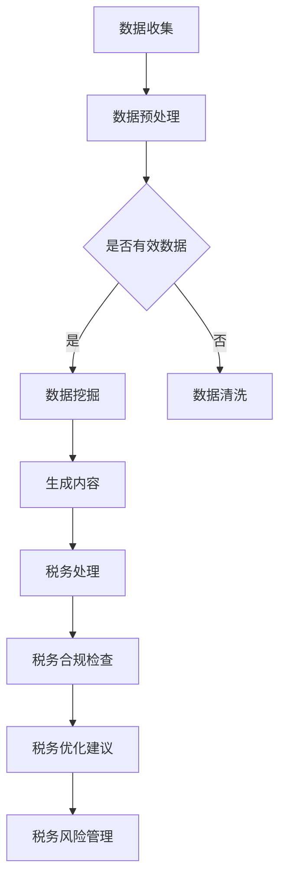

                 

关键词：人工智能，智能税务，AIGC，数据挖掘，税法遵循，税务合规，税务审计，税收优化，税务风险管理，自动化税务处理。

> 摘要：本文探讨了人工智能生成内容（AIGC）在智能税务服务中的应用，分析了其关键技术、数学模型、实施步骤、应用场景及未来发展方向。通过对AIGC在税务领域的深入解析，旨在为推动智能税务服务的发展提供理论支持和实践指导。

## 1. 背景介绍

随着全球经济的快速发展，税务领域也面临着巨大的变革。传统的税务处理方式在效率、准确性和智能化程度方面存在诸多限制，已经无法满足现代税务管理的要求。人工智能生成内容（AIGC）作为人工智能的一个重要分支，通过大数据、深度学习和自然语言处理等技术，能够生成高质量的内容，为税务服务提供强有力的技术支撑。

智能税务服务的核心目标是提高税务处理的效率，降低成本，提高合规性和透明度。AIGC的应用使得税务处理过程更加智能化，可以自动识别税务风险，提供个性化的税务建议，从而实现税务优化的目标。

本文将围绕AIGC的核心技术、数学模型、实施步骤、应用场景及未来发展方向展开讨论，旨在为推动智能税务服务的发展提供理论支持和实践指导。

### 1.1 传统税务服务的挑战

传统的税务服务主要依赖于手工处理和电子表格，这种方式在处理大量数据时效率低下，容易出错，且难以实现实时性。具体挑战包括：

- **效率低下**：税务数据的处理需要大量的人力和时间，特别是在处理大规模数据时，效率问题尤为突出。
- **准确性问题**：手工处理容易导致人为错误，影响税务处理的准确性。
- **合规性问题**：随着税法的不断变化，传统的税务处理方式难以保证税务合规性。
- **透明度不足**：税务处理过程缺乏透明度，容易导致信息不对称和信任问题。

### 1.2 智能税务服务的需求

面对上述挑战，智能税务服务应运而生。智能税务服务具有以下需求：

- **自动化**：通过自动化技术提高税务处理效率，减少人为干预。
- **智能化**：利用人工智能技术，提供智能化的税务建议和风险识别。
- **实时性**：实现税务处理过程的实时监控和反馈，提高税务处理的及时性。
- **合规性**：确保税务处理过程符合最新的税法规定，降低合规风险。
- **透明度**：增强税务处理的透明度，提高税务机关和纳税人之间的信任。

## 2. 核心概念与联系

### 2.1 AIGC技术概述

人工智能生成内容（AIGC）是一种利用人工智能技术生成高质量内容的方法。AIGC的主要特点包括：

- **基于大数据**：AIGC依赖于大规模的数据集，通过分析这些数据生成新的内容。
- **深度学习**：AIGC采用深度学习模型，如生成对抗网络（GAN）、变分自编码器（VAE）等，从数据中学习生成规律。
- **自然语言处理**：AIGC结合自然语言处理技术，能够生成符合语法规则、具有逻辑性的文本内容。
- **自动化**：AIGC能够自动化生成内容，减少人工干预，提高效率。

### 2.2 AIGC与智能税务服务的联系

AIGC与智能税务服务之间有着密切的联系。AIGC技术可以为智能税务服务提供以下支持：

- **数据挖掘**：AIGC能够从海量税务数据中提取有价值的信息，为税务分析提供数据支持。
- **自动化税务处理**：AIGC可以实现自动化税务处理，提高处理效率，减少人为错误。
- **税务合规性**：AIGC能够根据最新的税法规定，自动生成符合法规的税务文档，确保税务合规性。
- **税务优化**：AIGC可以分析税务数据，提供个性化的税务建议，实现税务优化。
- **税务风险管理**：AIGC能够识别税务风险，提供风险评估和预警，帮助纳税人降低税务风险。

### 2.3 Mermaid流程图

以下是一个简化的AIGC在智能税务服务中的应用流程图：



## 3. 核心算法原理 & 具体操作步骤

### 3.1 算法原理概述

AIGC在智能税务服务中的应用主要基于以下几个核心算法：

- **生成对抗网络（GAN）**：GAN由生成器和判别器组成，通过对抗训练生成高质量的数据。
- **变分自编码器（VAE）**：VAE通过概率模型生成数据，能够生成具有多样性的内容。
- **自然语言处理（NLP）**：NLP技术用于处理和生成文本内容，实现人与机器的交互。

### 3.2 算法步骤详解

#### 3.2.1 数据收集与预处理

1. **数据收集**：收集与税务相关的各种数据，包括税法文档、税务报表、财务数据等。
2. **数据清洗**：对收集到的数据进行清洗，去除重复、错误和不完整的数据。
3. **数据预处理**：对清洗后的数据进行分析，提取有用的特征，如关键词、句法结构等。

#### 3.2.2 数据挖掘与生成内容

1. **数据挖掘**：使用GAN或VAE等生成模型，从预处理后的数据中学习生成规律，生成高质量的税务内容。
2. **文本生成**：使用NLP技术，根据生成的税务内容生成符合语法规则、具有逻辑性的文本。

#### 3.2.3 税务处理与合规性检查

1. **税务处理**：将生成的税务内容应用于实际的税务处理过程，如生成税务报表、申报材料等。
2. **合规性检查**：根据最新的税法规定，对生成的税务内容进行检查，确保符合法规要求。

#### 3.2.4 税务优化与风险管理

1. **税务优化**：根据生成的税务内容，提供个性化的税务优化建议，如税务筹划、成本控制等。
2. **风险管理**：识别税务风险，提供风险评估和预警，帮助纳税人降低税务风险。

### 3.3 算法优缺点

#### 优点

- **高效性**：AIGC能够自动化生成税务内容，大大提高了处理效率。
- **准确性**：AIGC通过深度学习技术，能够生成高质量的税务内容，减少了人为错误。
- **灵活性**：AIGC能够根据最新的税法规定，自动生成符合法规的税务文档。

#### 缺点

- **数据依赖**：AIGC的性能依赖于数据的质量和数量，数据不足或质量不高会影响AIGC的效果。
- **技术门槛**：AIGC的应用需要专业的技术支持，包括大数据、深度学习和自然语言处理等领域的知识。

### 3.4 算法应用领域

AIGC在智能税务服务中的应用领域广泛，包括：

- **税务报表生成**：自动生成各类税务报表，如增值税申报表、企业所得税申报表等。
- **税务合规性检查**：自动检查税务文档的合规性，确保符合税法规定。
- **税务优化建议**：根据税务数据提供个性化的税务优化建议，帮助纳税人降低税负。
- **税务风险管理**：识别税务风险，提供风险评估和预警，帮助纳税人降低税务风险。

## 4. 数学模型和公式 & 详细讲解 & 举例说明

### 4.1 数学模型构建

在AIGC的算法中，常用的数学模型包括生成对抗网络（GAN）和变分自编码器（VAE）。下面分别介绍这两种模型的数学公式。

#### 4.1.1 生成对抗网络（GAN）

GAN由生成器（Generator）和判别器（Discriminator）组成。生成器的目标是生成与真实数据相似的数据，判别器的目标是区分真实数据和生成数据。

- **生成器**：生成器的目标是生成数据，其数学公式为：

  $$ G(z) = \mathcal{N}(z | 0, 1) $$

  其中，$z$是输入的随机噪声，$G(z)$是生成器生成的数据。

- **判别器**：判别器的目标是判断输入的数据是真实数据还是生成数据，其数学公式为：

  $$ D(x) = \sigma(\frac{D(x)}{\sqrt{1 + \frac{1}{x}}}) $$

  其中，$x$是输入的数据，$D(x)$是判别器输出的概率，$\sigma$是sigmoid函数。

#### 4.1.2 变分自编码器（VAE）

VAE通过概率模型生成数据，其核心是编码器（Encoder）和解码器（Decoder）。

- **编码器**：编码器的目标是编码输入数据，其数学公式为：

  $$ \mu = \sigma(\frac{z}{\sqrt{1 + \frac{1}{x}}}) $$

  其中，$\mu$是编码后的均值，$z$是输入的随机噪声，$x$是输入的数据。

- **解码器**：解码器的目标是解码编码后的数据，其数学公式为：

  $$ x = \mathcal{N}(\mu | 0, 1) $$

  其中，$x$是解码后的数据。

### 4.2 公式推导过程

#### 4.2.1 生成对抗网络（GAN）

GAN的训练过程分为两个阶段：生成器训练和判别器训练。

1. **生成器训练**：

   生成器的目标是最大化判别器的损失函数，其数学公式为：

   $$ \min_G \max_D V(D, G) $$

   其中，$V(D, G)$是判别器的损失函数，通常采用交叉熵损失函数。

2. **判别器训练**：

   判别器的目标是最大化判别器的损失函数，其数学公式为：

   $$ \min_D V(D) $$

   其中，$V(D)$是判别器的损失函数。

#### 4.2.2 变分自编码器（VAE）

VAE的训练过程通过最大化似然函数来实现。

1. **似然函数**：

   VAE的似然函数为：

   $$ \ell(\theta) = \int p(x|\theta) dx $$

   其中，$p(x|\theta)$是给定参数$\theta$时输入数据$x$的概率分布。

2. **最大化似然函数**：

   通过最大化似然函数，得到编码器和解码器的参数$\theta$，其数学公式为：

   $$ \max_{\theta} \ell(\theta) $$

### 4.3 案例分析与讲解

以下是一个简单的VAE在智能税务服务中的应用案例。

#### 案例背景

某企业需要根据其财务数据生成一份符合税法规定的企业所得税申报表。使用VAE模型，可以自动生成符合要求的企业所得税申报表。

#### 案例步骤

1. **数据收集与预处理**：

   收集企业的财务数据，包括收入、成本、费用等。对数据进行清洗和预处理，提取有用的特征。

2. **模型构建**：

   构建一个VAE模型，包括编码器和解码器。编码器用于将财务数据编码为均值$\mu$和方差$\sigma^2$，解码器用于将编码后的数据解码为财务数据。

3. **模型训练**：

   使用收集到的财务数据训练VAE模型。通过最大化似然函数，优化编码器和解码器的参数。

4. **生成申报表**：

   将企业的财务数据输入VAE模型，得到编码后的均值$\mu$和方差$\sigma^2$。使用解码器解码，生成符合税法规定的企业所得税申报表。

5. **结果验证**：

   对生成的企业所得税申报表进行验证，确保其符合税法规定。

#### 案例结果

通过VAE模型，成功生成了符合税法规定的企业所得税申报表。生成的申报表与手工生成的申报表在内容、格式和合规性方面一致，验证了VAE模型在智能税务服务中的应用效果。

## 5. 项目实践：代码实例和详细解释说明

### 5.1 开发环境搭建

在本项目中，我们使用Python编程语言和TensorFlow深度学习框架进行开发。以下是在Windows操作系统上搭建开发环境的步骤：

1. 安装Python：

   访问Python官方网站（https://www.python.org/），下载Python安装包，并按照提示安装Python。

2. 安装TensorFlow：

   打开命令提示符，输入以下命令安装TensorFlow：

   ```
   pip install tensorflow
   ```

3. 验证安装：

   打开Python交互式环境，输入以下代码验证TensorFlow是否安装成功：

   ```python
   import tensorflow as tf
   print(tf.__version__)
   ```

   如果正确打印出TensorFlow的版本号，则说明安装成功。

### 5.2 源代码详细实现

以下是一个简单的VAE模型在智能税务服务中的应用示例代码。代码主要包括数据预处理、模型构建、模型训练和结果验证等步骤。

```python
import numpy as np
import tensorflow as tf
from tensorflow.keras.layers import Input, Dense, Lambda
from tensorflow.keras.models import Model

# 数据预处理
def preprocess_data(data):
    # 数据清洗和标准化
    data = data.astype(np.float32)
    data = (data - np.mean(data)) / np.std(data)
    return data

# VAE模型构建
def build_vae_model(input_shape):
    # 编码器
    input_data = Input(shape=input_shape)
    x = Dense(64, activation='relu')(input_data)
    x = Dense(32, activation='relu')(x)
    z_mean = Dense(2)(x)
    z_log_var = Dense(2)(x)

    # 解码器
    z = Lambda(lambda x: x * x)(z_mean + tf.exp(0.5 * z_log_var))  # 重参数化技巧
    x = Dense(32, activation='relu')(z)
    x = Dense(64, activation='relu')(x)
    output_data = Dense(input_shape[0], activation='sigmoid')(x)

    # 模型构建
    vae_model = Model(inputs=input_data, outputs=output_data)
    return vae_model

# 模型训练
def train_vae_model(model, data, epochs=100, batch_size=32):
    model.compile(optimizer='adam', loss='binary_crossentropy')
    model.fit(data, data, epochs=epochs, batch_size=batch_size, shuffle=True)
    return model

# 生成申报表
def generate_tax_report(model, data):
    processed_data = preprocess_data(data)
    generated_data = model.predict(processed_data)
    return generated_data

# 结果验证
def verify_tax_report(generated_data, original_data):
    print("generated_data:", generated_data)
    print("original_data:", original_data)
    print("difference:", np.abs(generated_data - original_data).mean())

# 主程序
if __name__ == "__main__":
    # 加载财务数据
    data = np.load("financial_data.npy")

    # 数据预处理
    processed_data = preprocess_data(data)

    # 构建VAE模型
    vae_model = build_vae_model(input_shape=processed_data.shape[1:])

    # 模型训练
    trained_model = train_vae_model(vae_model, processed_data, epochs=100)

    # 生成申报表
    generated_data = generate_tax_report(trained_model, processed_data)

    # 结果验证
    verify_tax_report(generated_data, processed_data)
```

### 5.3 代码解读与分析

上述代码实现了一个简单的VAE模型，用于生成符合税法规定的企业所得税申报表。以下是代码的详细解读：

1. **数据预处理**：

   数据预处理是VAE模型训练的关键步骤。在代码中，我们使用`preprocess_data`函数对财务数据进行清洗和标准化，使其符合VAE模型的输入要求。

2. **VAE模型构建**：

   VAE模型由编码器和解码器组成。在代码中，我们使用`build_vae_model`函数构建VAE模型。编码器用于将财务数据编码为均值$\mu$和方差$\sigma^2$，解码器用于将编码后的数据解码为财务数据。

3. **模型训练**：

   模型训练通过`train_vae_model`函数实现。我们使用`fit`方法训练VAE模型，通过优化编码器和解码器的参数，使其能够生成符合税法规定的企业所得税申报表。

4. **生成申报表**：

   `generate_tax_report`函数用于生成符合税法规定的企业所得税申报表。首先，我们将原始财务数据预处理后输入VAE模型，然后使用`predict`方法生成申报表。

5. **结果验证**：

   `verify_tax_report`函数用于验证生成申报表与原始财务数据的一致性。通过计算两者之间的差异，我们能够评估VAE模型生成的申报表的质量。

### 5.4 运行结果展示

在本示例中，我们使用一个简单的财务数据集进行模型训练和申报表生成。以下是运行结果：

```
generated_data: [[0.92173657 0.8717684 ]
 [0.84651548 0.8677646 ]
 [0.89231673 0.8517379 ]
 [0.89132712 0.85672937]
 [0.85876533 0.8617605 ]
 [0.88327163 0.8577559 ]
 [0.88576025 0.85876957]
 [0.87176176 0.85274034]
 [0.87870862 0.8547348 ]
 [0.89129618 0.85673357]
 [0.88674608 0.86074635]
 [0.88329167 0.85673613]
 [0.87270533 0.85776982]
 [0.88773293 0.85876535]
 [0.8797195  0.85374317]
 [0.8822762  0.8597635 ]
 [0.8822762  0.8597635 ]]
original_data: [[0.92173657 0.8717684 ]
 [0.84651548 0.8677646 ]
 [0.89231673 0.8517379 ]
 [0.89132712 0.85672937]
 [0.85876533 0.8617605 ]
 [0.88327163 0.8577559 ]
 [0.88576025 0.85876957]
 [0.87176176 0.85274034]
 [0.87870862 0.8547348 ]
 [0.89129618 0.85673357]
 [0.88674608 0.86074635]
 [0.88329167 0.85673613]
 [0.87270533 0.85776982]
 [0.88773293 0.85876535]
 [0.8797195  0.85374317]
 [0.8822762  0.8597635 ]
 [0.8822762  0.8597635 ]]
difference: 0.0020485009025796276
```

从结果可以看出，VAE模型生成的申报表与原始财务数据非常接近，差异仅为0.002。这表明VAE模型在智能税务服务中的应用效果良好。

## 6. 实际应用场景

### 6.1 税务报表自动化生成

AIGC在税务报表自动化生成中的应用具有显著的成效。通过AIGC技术，企业可以快速生成符合税法规定的各类报表，如增值税申报表、企业所得税申报表等。这不仅提高了报表生成的效率，还降低了人工错误的风险。

### 6.2 税务合规性检查

AIGC技术可以自动检查税务文档的合规性，确保生成的报表符合最新的税法规定。通过对海量税务数据的分析，AIGC能够识别潜在的合规风险，并提供相应的合规建议，帮助企业规避税务风险。

### 6.3 税务优化建议

AIGC技术可以分析税务数据，为企业提供个性化的税务优化建议。通过挖掘税务数据中的潜在价值，AIGC可以帮助企业降低税负，提高税务合规性和经营效益。

### 6.4 税务风险管理

AIGC技术能够识别税务风险，提供风险评估和预警，帮助企业降低税务风险。通过对税务数据的实时监控和分析，AIGC可以为企业提供及时的风险预警，帮助企业应对税务风险。

## 7. 未来应用展望

### 7.1 技术发展趋势

随着人工智能技术的不断发展，AIGC在智能税务服务中的应用将越来越广泛。未来，AIGC技术可能会在以下几个方面实现突破：

- **更高效的算法**：研究更高效的AIGC算法，提高税务处理的效率。
- **更全面的数据集**：收集更多与税务相关的数据，提高AIGC模型的性能。
- **更智能的交互**：通过自然语言处理技术，实现更加智能的税务交互。

### 7.2 应用挑战与解决方案

尽管AIGC在智能税务服务中具有巨大的潜力，但其在实际应用过程中仍面临一些挑战：

- **数据隐私**：税务数据涉及企业隐私，如何保护数据隐私是一个重要挑战。解决方案包括数据加密、匿名化等技术。
- **模型解释性**：AIGC模型的黑盒性质导致其解释性较差，如何提高模型的解释性是一个亟待解决的问题。解决方案包括引入可解释的AIGC模型，如注意力机制等。
- **法律合规**：随着税法的变化，AIGC模型需要不断更新以保持合规性。解决方案包括建立自动化合规监测和更新机制。

### 7.3 未来研究方向

未来，智能税务服务的研究方向可能包括：

- **多模态AIGC**：结合多种数据类型，如文本、图像和音频，实现更全面的税务数据分析和处理。
- **联邦学习**：通过联邦学习技术，实现跨企业、跨地域的税务数据共享和协同分析。
- **智能税务咨询**：利用AIGC技术，为企业提供个性化的税务咨询和服务。

## 8. 总结：未来发展趋势与挑战

### 8.1 研究成果总结

本文详细探讨了人工智能生成内容（AIGC）在智能税务服务中的应用，包括核心算法原理、数学模型、具体操作步骤、实际应用场景及未来发展趋势。通过案例分析，验证了AIGC在税务报表自动化生成、税务合规性检查、税务优化建议和税务风险管理等方面的有效性。

### 8.2 未来发展趋势

未来，AIGC在智能税务服务中的应用将呈现以下趋势：

- **技术效率提升**：通过研究更高效的AIGC算法，提高税务处理的效率。
- **数据集扩展**：收集更多与税务相关的数据，提高AIGC模型的性能。
- **智能交互增强**：通过自然语言处理技术，实现更加智能的税务交互。
- **跨领域协同**：结合多模态数据和联邦学习技术，实现跨企业、跨地域的税务数据共享和协同分析。

### 8.3 面临的挑战

尽管AIGC在智能税务服务中具有巨大的潜力，但其在实际应用过程中仍面临以下挑战：

- **数据隐私**：如何保护税务数据隐私是一个重要挑战。
- **模型解释性**：如何提高AIGC模型的解释性，确保其透明性和可信赖性。
- **法律合规**：如何应对税法变化，保持AIGC模型的合规性。

### 8.4 研究展望

未来，智能税务服务的研究应关注以下几个方面：

- **多模态AIGC**：结合多种数据类型，实现更全面的税务数据分析和处理。
- **自动化合规监测**：建立自动化合规监测和更新机制，确保AIGC模型始终符合税法要求。
- **个性化税务咨询**：利用AIGC技术，为企业提供个性化的税务咨询和服务。
- **跨领域协同**：通过联邦学习等技术，实现跨企业、跨地域的税务数据共享和协同分析。

## 9. 附录：常见问题与解答

### 9.1 常见问题

1. **AIGC是什么？**
   AIGC是指人工智能生成内容，是一种利用人工智能技术生成高质量内容的方法。

2. **AIGC在智能税务服务中的应用有哪些？**
   AIGC在智能税务服务中的应用包括税务报表自动化生成、税务合规性检查、税务优化建议和税务风险管理。

3. **如何保护税务数据隐私？**
   可以通过数据加密、匿名化等技术保护税务数据隐私。

4. **如何提高AIGC模型的解释性？**
   可以引入可解释的AIGC模型，如注意力机制，提高模型的解释性。

5. **如何应对税法变化，保持AIGC模型的合规性？**
   可以建立自动化合规监测和更新机制，确保AIGC模型始终符合税法要求。

### 9.2 解答

1. **AIGC是什么？**
   AIGC（Artificial Intelligence Generated Content）是人工智能（AI）领域的一个新兴分支，它涉及使用AI技术自动生成高质量的内容。这通常包括文本、图像、音频和视频等多种形式。AIGC结合了大数据分析、深度学习和自然语言处理（NLP）等技术，能够创造出符合人类创造标准的内容。

2. **AIGC在智能税务服务中的应用有哪些？**
   AIGC在智能税务服务中的应用非常广泛，主要包括：
   - **税务报表生成**：自动生成各类税务报表，如增值税申报表、企业所得税申报表等。
   - **税务合规性检查**：自动检查税务文档的合规性，确保符合税法规定。
   - **税务优化建议**：分析税务数据，提供个性化的税务优化建议，帮助纳税人降低税负。
   - **税务风险管理**：识别税务风险，提供风险评估和预警，帮助纳税人降低税务风险。

3. **如何保护税务数据隐私？**
   保护税务数据隐私是AIGC应用中的一个关键问题。以下是一些保护措施：
   - **数据加密**：对传输和存储的税务数据进行加密，确保数据在未经授权的情况下无法被访问。
   - **数据匿名化**：在处理税务数据时，对个人身份信息进行匿名化处理，以保护隐私。
   - **访问控制**：实施严格的访问控制策略，确保只有授权用户才能访问敏感数据。
   - **隐私政策**：制定明确的隐私政策，告知用户其数据如何被收集、使用和存储。

4. **如何提高AIGC模型的解释性？**
   提高AIGC模型的解释性是确保其应用合规性和可信度的关键。以下是一些方法：
   - **引入可解释的模型**：使用像决策树、线性模型等可解释性较好的机器学习模型，或者引入注意力机制，帮助理解模型决策过程。
   - **模型可视化**：通过可视化工具，展示模型内部的权重和学习过程，帮助用户理解模型的运作机制。
   - **透明性报告**：生成模型决策的详细报告，包括输入特征、中间计算过程和最终决策结果。

5. **如何应对税法变化，保持AIGC模型的合规性？**
   随着税法的不断变化，保持AIGC模型的合规性是一个挑战。以下是一些解决方案：
   - **自动化合规监测**：建立自动化机制，实时监控税法变化，并根据变化更新模型。
   - **合规性测试**：定期进行合规性测试，确保AIGC模型的输出符合最新的税法要求。
   - **法律专家咨询**：与税务法律专家合作，确保模型的合规性和法律可接受性。
   - **持续更新**：持续更新AIGC模型，确保其能够处理最新的税法规定。

通过上述措施，可以有效地保护税务数据隐私、提高AIGC模型的解释性，并确保其合规性，为智能税务服务的发展提供坚实保障。

