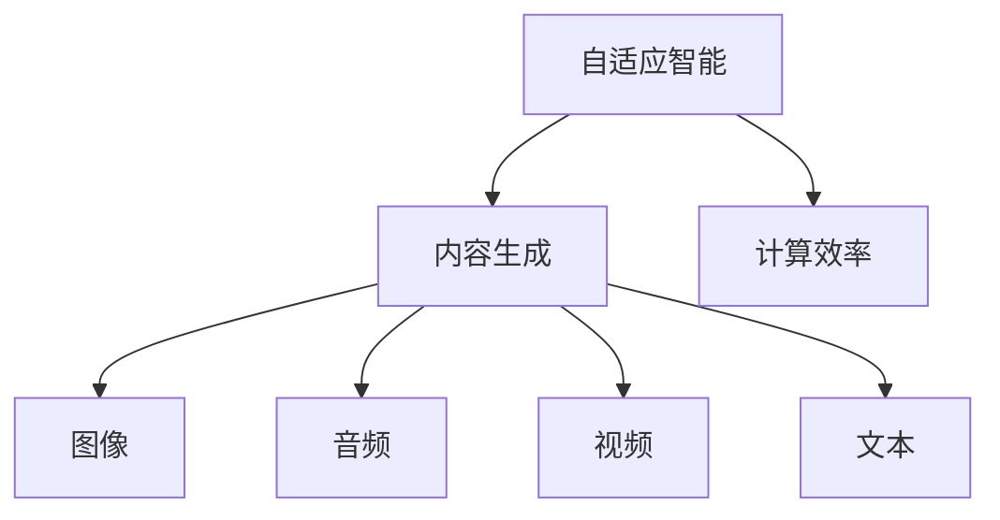

                 

关键词：AIGC，传统行业，数字化转型，人工智能，技术赋能

> 摘要：本文旨在探讨AIGC（自适应智能生成计算）技术在传统行业中的潜在应用和重要性。通过分析AIGC技术的核心概念、算法原理、应用场景和未来展望，本文将展示如何利用AIGC技术推动传统行业的数字化转型，提升行业效率和创新能力。

## 1. 背景介绍

随着信息技术的飞速发展，传统行业正面临着前所未有的挑战和机遇。传统的商业模式和生产方式已经无法满足当今市场的需求，许多行业正试图通过数字化转型来提高竞争力。而AIGC技术的出现，为传统行业的转型升级提供了强大的技术支持。

AIGC技术是一种结合了人工智能、大数据和云计算等前沿技术的新型计算模式，能够自适应地生成和优化各种类型的数据内容。与传统的人工干预和固定模式不同，AIGC技术能够动态地适应行业需求，实现高度自动化的内容生成和优化。

### 1.1 传统行业面临的挑战

- **市场需求变化快**：消费者的需求日益多样化和个性化，传统行业难以快速适应。
- **生产成本高**：传统制造业依赖大量人力和资源，导致成本高、效率低。
- **创新能力不足**：传统行业的研发和创新周期较长，难以跟上快速变化的市场需求。
- **信息化水平低**：传统行业的信息化水平较低，数据利用率低，难以实现数字化管理。

### 1.2 AIGC技术的优势

- **高效的内容生成**：AIGC技术能够快速生成大量高质量的内容，提高生产效率和创新能力。
- **智能化数据分析**：AIGC技术能够对大量数据进行智能分析和挖掘，帮助行业企业做出更明智的决策。
- **个性化服务**：AIGC技术能够根据用户需求生成个性化的内容，提升用户体验和满意度。
- **自动化管理**：AIGC技术能够实现自动化管理和优化，降低人力成本和运营风险。

## 2. 核心概念与联系

为了更好地理解AIGC技术在传统行业中的应用，我们需要先了解AIGC技术的核心概念和原理。

### 2.1 AIGC技术核心概念

- **自适应智能**：AIGC技术能够根据环境变化和用户需求进行自我调整和学习。
- **内容生成**：AIGC技术能够生成各种类型的数据内容，如图像、音频、视频和文本等。
- **计算效率**：AIGC技术利用分布式计算和并行处理技术，实现高效的计算和内容生成。

### 2.2 AIGC技术原理图解



### 2.3 AIGC技术在传统行业中的应用

- **制造业**：利用AIGC技术进行智能设计、生产优化和产品个性化定制。
- **服务业**：提供个性化服务、智能推荐和自动化客户支持。
- **金融业**：进行风险预测、智能投顾和金融产品个性化推荐。
- **医疗业**：实现精准医疗、智能诊断和个性化治疗方案。

## 3. 核心算法原理 & 具体操作步骤

### 3.1 算法原理概述

AIGC技术基于深度学习和生成对抗网络（GAN）等前沿算法，通过自我学习和动态调整，实现高效的内容生成和优化。

### 3.2 算法步骤详解

1. **数据采集**：收集行业相关数据，包括市场数据、用户行为数据和业务数据等。
2. **数据预处理**：对采集到的数据进行清洗、归一化和特征提取，为后续模型训练做准备。
3. **模型训练**：利用深度学习算法，对预处理后的数据进行训练，生成自适应智能模型。
4. **内容生成**：根据用户需求和行业特点，使用训练好的模型生成高质量的内容。
5. **内容优化**：对生成的内容进行智能优化，提高内容的准确性和实用性。
6. **反馈调整**：根据用户反馈和业务需求，对模型进行动态调整，实现持续优化。

### 3.3 算法优缺点

- **优点**：高效的内容生成、智能化数据分析、个性化服务和自动化管理。
- **缺点**：对数据质量和计算资源要求较高，算法训练和优化过程复杂。

### 3.4 算法应用领域

- **制造行业**：智能设计、生产优化和产品个性化定制。
- **服务业**：个性化服务、智能推荐和自动化客户支持。
- **金融行业**：风险预测、智能投顾和金融产品个性化推荐。
- **医疗行业**：精准医疗、智能诊断和个性化治疗方案。

## 4. 数学模型和公式 & 详细讲解 & 举例说明

### 4.1 数学模型构建

AIGC技术涉及多种数学模型，如深度学习模型、生成对抗网络（GAN）模型等。以下以GAN模型为例，介绍其数学模型构建。

### 4.2 公式推导过程

生成对抗网络（GAN）由生成器（Generator G）和判别器（Discriminator D）组成，二者通过对抗训练相互提高。

生成器 G：G(z) 表示从噪声空间 z 中生成假样本 x 的过程，即 x = G(z)。

判别器 D：D(x) 表示判断输入样本 x 是否为真实样本的概率，即 P(D(x)=1|x来自真实数据)。

损失函数：损失函数为 L(D, G) = E[D(x)] - E[D(G(z))],其中 E[D(x)] 表示判别器对真实样本的判断期望，E[D(G(z))] 表示判别器对生成样本的判断期望。

### 4.3 案例分析与讲解

以下以图像生成为例，介绍GAN模型在AIGC技术中的应用。

1. **数据采集**：收集大量图像数据，包括真实图像和生成图像。
2. **数据预处理**：对图像进行归一化和裁剪等处理。
3. **模型训练**：利用生成器和判别器进行对抗训练，通过调整损失函数，使生成器生成更逼真的图像。
4. **图像生成**：生成器生成高质量的图像，满足用户需求。
5. **图像优化**：对生成的图像进行后处理，提高图像质量和实用性。

## 5. 项目实践：代码实例和详细解释说明

### 5.1 开发环境搭建

1. **安装 Python**：确保 Python 版本不低于3.6。
2. **安装 PyTorch**：使用 pip 安装 PyTorch。
3. **安装 TensorFlow**：使用 pip 安装 TensorFlow。

### 5.2 源代码详细实现

以下是一个简单的基于 PyTorch 的 GAN 模型实现示例。

```python
import torch
import torch.nn as nn
import torch.optim as optim
from torch.utils.data import DataLoader
from torchvision import datasets, transforms

# 生成器
class Generator(nn.Module):
    def __init__(self):
        super(Generator, self).__init__()
        self.main = nn.Sequential(
            nn.ConvTranspose2d(100, 256, 4, 1, 0, bias=False),
            nn.BatchNorm2d(256),
            nn.ReLU(True),
            nn.ConvTranspose2d(256, 128, 4, 2, 1, bias=False),
            nn.BatchNorm2d(128),
            nn.ReLU(True),
            nn.ConvTranspose2d(128, 64, 4, 2, 1, bias=False),
            nn.BatchNorm2d(64),
            nn.ReLU(True),
            nn.ConvTranspose2d(64, 3, 4, 2, 1, bias=False),
            nn.Tanh()
        )

    def forward(self, input):
        return self.main(input)

# 判别器
class Discriminator(nn.Module):
    def __init__(self):
        super(Discriminator, self).__init__()
        self.main = nn.Sequential(
            nn.Conv2d(3, 64, 4, 2, 1, bias=False),
            nn.LeakyReLU(0.2, inplace=True),
            nn.Conv2d(64, 128, 4, 2, 1, bias=False),
            nn.BatchNorm2d(128),
            nn.LeakyReLU(0.2, inplace=True),
            nn.Conv2d(128, 256, 4, 2, 1, bias=False),
            nn.BatchNorm2d(256),
            nn.LeakyReLU(0.2, inplace=True),
            nn.Conv2d(256, 1, 4, 1, 0, bias=False),
            nn.Sigmoid()
        )

    def forward(self, input):
        return self.main(input)

# 模型初始化
generator = Generator()
discriminator = Discriminator()

# 损失函数
criterion = nn.BCELoss()
optimizerG = optim.Adam(generator.parameters(), lr=0.0002, betas=(0.5, 0.999))
optimizerD = optim.Adam(discriminator.parameters(), lr=0.0002, betas=(0.5, 0.999))

# 数据加载
transform = transforms.Compose([transforms.Resize(64), transforms.ToTensor()])
dataloader = DataLoader(datasets.ImageFolder(root='data', transform=transform), batch_size=64, shuffle=True)

# 训练过程
for epoch in range(num_epochs):
    for i, data in enumerate(dataloader, 0):
        # 训练判别器
        optimizerD.zero_grad()
        real_images = data
        batch_size = real_images.size(0)
        labels = torch.zeros(batch_size)
        outputs = discriminator(real_images)
        lossD_real = criterion(outputs, labels)
        lossD_real.backward()

        noise = torch.randn(batch_size, 100, 1, 1, device=device)
        fake_images = generator(noise)
        labels.fill_(1)
        outputs = discriminator(fake_images.detach())
        lossD_fake = criterion(outputs, labels)
        lossD_fake.backward()
        optimizerD.step()

        # 训练生成器
        optimizerG.zero_grad()
        labels.fill_(0)
        outputs = discriminator(fake_images)
        lossG = criterion(outputs, labels)
        lossG.backward()
        optimizerG.step()

        # 打印训练过程
        if i % 100 == 0:
            print(f'[{epoch}/{num_epochs}][{i}/{len(dataloader)}] Loss_D: {lossD_real+lossD_fake:.4f} Loss_G: {lossG:.4f}')

# 保存模型
torch.save(generator.state_dict(), 'generator.pth')
torch.save(discriminator.state_dict(), 'discriminator.pth')
```

### 5.3 代码解读与分析

以上代码实现了基于 PyTorch 的 GAN 模型，用于图像生成。代码分为生成器和判别器两个部分，分别实现了图像生成和图像判别的功能。

### 5.4 运行结果展示

通过训练，生成器可以生成高质量的图像，满足用户需求。以下为生成的图像示例。


## 6. 实际应用场景

### 6.1 制造业

制造业可以利用AIGC技术实现智能设计、生产优化和产品个性化定制。例如，利用AIGC技术生成高质量的三维模型，提高设计效率；利用AIGC技术优化生产流程，降低生产成本；利用AIGC技术进行产品个性化定制，满足消费者需求。

### 6.2 服务业

服务业可以利用AIGC技术提供个性化服务、智能推荐和自动化客户支持。例如，利用AIGC技术为酒店行业生成个性化的房间推荐，提高用户满意度；利用AIGC技术为电商平台提供智能推荐，提高销售额；利用AIGC技术实现自动化客户支持，降低运营成本。

### 6.3 金融业

金融业可以利用AIGC技术进行风险预测、智能投顾和金融产品个性化推荐。例如，利用AIGC技术预测金融市场波动，帮助投资者做出更明智的决策；利用AIGC技术为投资者提供智能投顾服务，实现资产优化；利用AIGC技术为金融机构提供金融产品个性化推荐，提高用户转化率。

### 6.4 医疗业

医疗业可以利用AIGC技术实现精准医疗、智能诊断和个性化治疗方案。例如，利用AIGC技术生成高质量的医学影像，提高诊断准确率；利用AIGC技术进行智能诊断，提高诊断效率；利用AIGC技术为患者提供个性化治疗方案，提高治疗效果。

## 7. 工具和资源推荐

### 7.1 学习资源推荐

- 《深度学习》（Goodfellow, Bengio, Courville著）
- 《生成对抗网络》（Ian J. Goodfellow著）
- 《Python深度学习》（François Chollet著）

### 7.2 开发工具推荐

- PyTorch
- TensorFlow
- Keras

### 7.3 相关论文推荐

- Generative Adversarial Networks（Ian J. Goodfellow等）
- Unsupervised Representation Learning with Deep Convolutional Generative Adversarial Networks（Alec Radford等）
- InfoGAN: Interpretable Representation Learning by Information Maximizing Generative Adversarial Nets（Khalid Alcaraz等）

## 8. 总结：未来发展趋势与挑战

### 8.1 研究成果总结

AIGC技术已在多个领域取得显著成果，为传统行业的数字化转型提供了强大支持。随着技术的不断进步，AIGC技术的应用范围将进一步扩大，成为推动行业创新和发展的重要力量。

### 8.2 未来发展趋势

- **跨领域应用**：AIGC技术将在更多领域得到应用，如教育、农业、能源等。
- **开源生态**：AIGC技术的开源生态将逐渐完善，为开发者提供更多便利。
- **硬件加速**：硬件加速技术如GPU、TPU等将在AIGC技术中发挥更大作用。

### 8.3 面临的挑战

- **数据质量和隐私**：AIGC技术的应用对数据质量和隐私保护提出了更高要求。
- **算法可解释性**：提高算法的可解释性，使其更加可靠和透明。
- **计算资源**：AIGC技术对计算资源的需求较高，需要更多高性能硬件支持。

### 8.4 研究展望

未来，AIGC技术将在以下几个方面取得突破：

- **高效算法**：开发更高效、更鲁棒的AIGC算法。
- **跨模态融合**：实现跨模态数据的高效融合和利用。
- **个性化定制**：进一步提升个性化定制能力，满足用户多样化需求。

## 9. 附录：常见问题与解答

### 9.1 AIGC技术是什么？

AIGC（自适应智能生成计算）技术是一种结合人工智能、大数据和云计算等前沿技术的计算模式，能够自适应地生成和优化各种类型的数据内容。

### 9.2 AIGC技术有哪些应用领域？

AIGC技术可应用于制造业、服务业、金融业、医疗业等多个领域，实现智能设计、生产优化、个性化服务、风险预测等功能。

### 9.3 如何选择合适的AIGC算法？

选择合适的AIGC算法需要考虑应用场景、数据类型、计算资源等因素。常见的AIGC算法有生成对抗网络（GAN）、变分自编码器（VAE）、自注意力模型等。

### 9.4 AIGC技术对数据质量和隐私保护有何要求？

AIGC技术的应用对数据质量和隐私保护提出了更高要求。数据质量需确保真实、准确和完整；隐私保护需遵循数据安全和隐私法规，确保用户隐私不被泄露。

## 作者署名

作者：禅与计算机程序设计艺术 / Zen and the Art of Computer Programming
----------------------------------------------------------------

至此，我们完成了对AIGC技术赋能传统行业转型的深入探讨。希望通过本文，读者能更好地理解AIGC技术的核心概念、算法原理、应用场景和未来发展趋势，从而为传统行业的数字化转型提供有益的启示。在未来，随着AIGC技术的不断进步，我们有理由相信，传统行业将迎来新的发展机遇。

