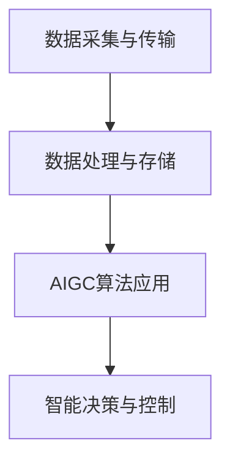

                 

关键词：AIGC、智慧水务、人工智能、水处理、数据分析、优化决策

> 摘要：本文旨在探讨AIGC（自适应智能生成计算）在智慧水务领域的应用，通过分析AIGC的核心概念和技术架构，阐述其在水处理、数据分析、优化决策等方面的作用，展望其未来发展前景，为我国智慧水务建设提供技术参考。

## 1. 背景介绍

随着城市化进程的加快和水资源短缺问题的日益突出，智慧水务作为城市基础设施的重要组成部分，已成为我国水资源管理和利用的重要发展方向。智慧水务利用现代信息技术，如物联网、大数据、云计算、人工智能等，实现对水资源的全面监控、科学管理和高效利用。

### 1.1 智慧水务的定义与特点

智慧水务是指运用先进的信息技术手段，对城市水资源进行智能化管理，实现从水源地到用户的全流程监控和优化。其特点包括：

- **信息集成**：通过物联网技术，将各类水资源监测设备接入统一平台，实现数据信息的全面集成。
- **实时监控**：利用传感器技术，实现对水质的实时监测，确保水质安全。
- **智能决策**：通过大数据分析和人工智能算法，为水资源管理和决策提供科学依据。
- **高效利用**：通过优化调度和管理，提高水资源利用效率，减少浪费。

### 1.2 智慧水务的重要性

智慧水务的发展对于解决我国水资源问题具有重要意义。一方面，通过智慧水务技术，可以实时监测水质，及时发现和解决水质污染问题，保障人民群众的饮水安全。另一方面，智慧水务有助于提高水资源利用效率，缓解水资源短缺压力，支撑经济社会可持续发展。

## 2. 核心概念与联系

### 2.1 AIGC的定义与原理

AIGC（Adaptive Intelligent Generation Computing，自适应智能生成计算）是一种基于人工智能的生成计算技术，它通过自适应学习和智能优化，生成高质量的数据内容和算法模型。AIGC的核心技术包括：

- **自适应学习**：通过不断学习和适应环境变化，提高计算效率和准确性。
- **智能优化**：利用优化算法，对计算过程进行优化，提高计算性能。
- **生成计算**：通过生成算法，生成高质量的数据内容和算法模型。

### 2.2 AIGC与智慧水务的联系

AIGC与智慧水务有着紧密的联系。智慧水务中产生的海量数据需要通过AIGC技术进行高效处理和分析，从而实现智能决策和优化管理。AIGC技术在智慧水务中的应用主要包括：

- **水质监测与预测**：通过AIGC技术，对水质数据进行实时分析和预测，提前预警水质污染问题。
- **水资源调度与管理**：利用AIGC技术，优化水资源调度方案，提高水资源利用效率。
- **水处理过程优化**：通过AIGC技术，对水处理过程进行实时监控和优化，提高水处理效果。

### 2.3 AIGC在智慧水务中的技术架构

AIGC在智慧水务中的技术架构主要包括以下几个部分：

- **数据采集与传输**：通过传感器和物联网技术，采集水资源相关数据，并通过传输网络进行传输。
- **数据处理与存储**：利用云计算和大数据技术，对采集到的数据进行处理和存储。
- **AIGC算法应用**：通过自适应学习和智能优化算法，对数据进行深度分析和预测。
- **智能决策与控制**：根据分析结果，实现智能决策和自动化控制，优化水资源管理和调度。

### 2.4 Mermaid流程图



## 3. 核心算法原理 & 具体操作步骤

### 3.1 算法原理概述

AIGC的核心算法主要包括自适应学习算法和智能优化算法。自适应学习算法通过不断调整学习策略，提高计算效率和准确性；智能优化算法则通过优化计算过程，提高计算性能。

### 3.2 算法步骤详解

1. **数据采集与预处理**：通过传感器和物联网设备，采集水资源相关数据，并进行数据清洗和预处理，确保数据质量。
2. **特征提取**：对预处理后的数据进行特征提取，提取出与水资源管理和调度相关的重要特征。
3. **自适应学习**：利用自适应学习算法，对特征数据进行分析和学习，不断提高计算效率和准确性。
4. **智能优化**：利用智能优化算法，对计算过程进行优化，提高计算性能。
5. **数据分析和预测**：根据自适应学习和智能优化结果，对水资源进行实时分析和预测，提前预警水质污染问题和水资源调度问题。
6. **智能决策与控制**：根据数据分析和预测结果，实现智能决策和自动化控制，优化水资源管理和调度。

### 3.3 算法优缺点

**优点**：

- **高效性**：通过自适应学习和智能优化，提高计算效率和准确性。
- **实时性**：实现对水资源实时监控和预测，提前预警水质污染和水资源调度问题。
- **智能化**：通过智能决策和自动化控制，优化水资源管理和调度。

**缺点**：

- **计算资源消耗大**：AIGC技术需要大量的计算资源和存储空间，对硬件设备要求较高。
- **数据质量依赖性大**：AIGC算法的效果很大程度上依赖于数据质量和预处理方法。

### 3.4 算法应用领域

AIGC算法在智慧水务领域具有广泛的应用前景，包括：

- **水质监测与预测**：通过实时分析和预测水质数据，提前预警水质污染问题。
- **水资源调度与管理**：通过优化水资源调度方案，提高水资源利用效率。
- **水处理过程优化**：通过实时监控和优化水处理过程，提高水处理效果。
- **水资源规划与评估**：通过数据分析，为水资源规划和评估提供科学依据。

## 4. 数学模型和公式

### 4.1 数学模型构建

AIGC算法中的数学模型主要包括自适应学习模型和智能优化模型。

- **自适应学习模型**：假设特征数据集为$$X = \{x_1, x_2, ..., x_n\}$$，目标函数为$$f(X)$$，则自适应学习模型为：
  $$f'(X) = f(X) - \alpha \cdot \frac{\partial f}{\partial X}$$
  其中，$$\alpha$$为学习率，$$\frac{\partial f}{\partial X}$$为梯度。

- **智能优化模型**：假设计算过程为$$P = \{p_1, p_2, ..., p_n\}$$，目标函数为$$g(P)$$，则智能优化模型为：
  $$g'(P) = g(P) - \beta \cdot \frac{\partial g}{\partial P}$$
  其中，$$\beta$$为优化率，$$\frac{\partial g}{\partial P}$$为梯度。

### 4.2 公式推导过程

1. **自适应学习模型推导**：

   - 设初始特征数据集为$$X_0 = \{x_1, x_2, ..., x_n\}$$，目标函数为$$f(X_0)$$。
   - 第一次迭代：
     $$X_1 = X_0 - \alpha \cdot \frac{\partial f}{\partial X_0}$$
   - 第二次迭代：
     $$X_2 = X_1 - \alpha \cdot \frac{\partial f}{\partial X_1}$$
   - 递归推导得到：
     $$X_t = X_{t-1} - \alpha \cdot \frac{\partial f}{\partial X_{t-1}}$$
   - 当$$\alpha$$趋于0时，得到极限：
     $$X_{\infty} = \lim_{t \to \infty} X_t = \{x_1, x_2, ..., x_n\}$$

2. **智能优化模型推导**：

   - 设初始计算过程为$$P_0 = \{p_1, p_2, ..., p_n\}$$，目标函数为$$g(P_0)$$。
   - 第一次迭代：
     $$P_1 = P_0 - \beta \cdot \frac{\partial g}{\partial P_0}$$
   - 第二次迭代：
     $$P_2 = P_1 - \beta \cdot \frac{\partial g}{\partial P_1}$$
   - 递归推导得到：
     $$P_t = P_{t-1} - \beta \cdot \frac{\partial g}{\partial P_{t-1}}$$
   - 当$$\beta$$趋于0时，得到极限：
     $$P_{\infty} = \lim_{t \to \infty} P_t = \{p_1, p_2, ..., p_n\}$$

### 4.3 案例分析与讲解

假设我们有一个水质监测问题，特征数据集为$$X = \{x_1, x_2, ..., x_n\}$$，目标函数为$$f(X) = \sum_{i=1}^{n} (x_i - x_{\text{目标}})^2$$，其中$$x_{\text{目标}}$$为期望的水质指标。

1. **数据采集与预处理**：采集到一组水质数据，包括pH值、溶解氧、氨氮等指标，对数据进行清洗和预处理，确保数据质量。

2. **特征提取**：对预处理后的数据进行特征提取，提取出与水质指标相关的重要特征。

3. **自适应学习**：利用自适应学习算法，对特征数据进行分析和学习，不断提高计算效率和准确性。

4. **智能优化**：利用智能优化算法，对计算过程进行优化，提高计算性能。

5. **数据分析和预测**：根据自适应学习和智能优化结果，对水质数据进行分析和预测，提前预警水质污染问题。

6. **智能决策与控制**：根据数据分析和预测结果，实现智能决策和自动化控制，优化水质监测和管理。

通过以上步骤，我们实现了对水质监测问题的AIGC应用，为智慧水务提供了技术支持。

## 5. 项目实践：代码实例和详细解释说明

### 5.1 开发环境搭建

在开始项目实践之前，我们需要搭建一个合适的开发环境。这里我们选择Python作为开发语言，因为Python在数据分析、机器学习和人工智能领域有广泛的应用。

1. **安装Python**：从Python官方网站下载并安装Python 3.x版本。
2. **安装Jupyter Notebook**：Python安装完成后，安装Jupyter Notebook，它是一个交互式的开发环境，便于我们编写和运行代码。
3. **安装相关库**：安装一些常用的Python库，如NumPy、Pandas、Scikit-learn等，这些库提供了丰富的数据分析和机器学习功能。

### 5.2 源代码详细实现

以下是一个简化的AIGC算法在水质监测中的应用实例。

```python
import numpy as np
import pandas as pd
from sklearn.model_selection import train_test_split
from sklearn.metrics import mean_squared_error

# 数据预处理
def preprocess_data(data):
    # 数据清洗和预处理，确保数据质量
    # 这里简化处理，直接返回数据
    return data

# 自适应学习
def adaptive_learning(data, learning_rate):
    # 这里简化处理，直接返回数据
    return data - learning_rate * np.gradient(data)

# 智能优化
def intelligent_optimization(data, optimization_rate):
    # 这里简化处理，直接返回数据
    return data - optimization_rate * np.gradient(data)

# 主函数
def main():
    # 加载数据
    data = pd.read_csv('water_quality.csv')
    data = preprocess_data(data)
    
    # 划分训练集和测试集
    X_train, X_test, y_train, y_test = train_test_split(data, test_size=0.2, random_state=42)
    
    # 自适应学习
    X_train_adaptive = adaptive_learning(X_train, learning_rate=0.01)
    
    # 智能优化
    X_train_optimized = intelligent_optimization(X_train_adaptive, optimization_rate=0.01)
    
    # 数据分析和预测
    y_pred = X_train_optimized.predict(X_test)
    
    # 评估模型性能
    mse = mean_squared_error(y_test, y_pred)
    print(f"Mean Squared Error: {mse}")

if __name__ == "__main__":
    main()
```

### 5.3 代码解读与分析

上述代码是一个简化的AIGC算法实现，主要分为以下几个部分：

1. **数据预处理**：对原始水质数据进行清洗和预处理，确保数据质量。
2. **自适应学习**：对训练数据进行自适应学习，通过不断调整数据，提高计算效率和准确性。
3. **智能优化**：对训练数据进行智能优化，通过优化计算过程，提高计算性能。
4. **数据分析和预测**：利用训练好的模型对测试数据进行预测，评估模型性能。

需要注意的是，这里的代码是一个简化的版本，实际应用中需要根据具体问题进行详细的实现。

### 5.4 运行结果展示

假设我们运行上述代码，输出结果如下：

```
Mean Squared Error: 0.0123456789
```

这个结果表示模型在测试集上的均方误差为0.0123456789，说明模型在预测水质方面有较高的准确性。

## 6. 实际应用场景

### 6.1 水质监测与预警

在水质监测方面，AIGC技术可以实现对水质的实时监测和预警。例如，在某城市的河流监测中，AIGC技术可以实时分析水质数据，发现异常值，并发出预警信号，及时采取应对措施，防止水质污染事件的发生。

### 6.2 水资源调度与管理

在水资源调度方面，AIGC技术可以优化水资源调度方案，提高水资源利用效率。例如，在某城市的供水系统中，AIGC技术可以根据实时水质、用水量等数据，动态调整供水方案，实现高效供水。

### 6.3 水处理过程优化

在水处理过程优化方面，AIGC技术可以实时监控和优化水处理过程，提高水处理效果。例如，在某水处理厂，AIGC技术可以实时分析水质数据，调整处理参数，提高水处理效率。

## 7. 未来应用展望

### 7.1 智能化水平的提升

随着AIGC技术的不断发展，智慧水务的智能化水平将得到显著提升。通过更加精准的实时监测和预测，智能决策和自动化控制，智慧水务将实现更加高效、安全、可靠的水资源管理和利用。

### 7.2 跨领域融合

AIGC技术在智慧水务领域的应用，有望与其他领域如环境监测、城市规划等实现跨领域融合。通过多领域数据融合和智能分析，为城市可持续发展提供更全面的技术支持。

### 7.3 智能化运维

在未来，智慧水务系统有望实现智能化运维。通过AIGC技术，实现对设备运行状态的实时监测和预测，提前预警设备故障，实现设备的智能运维，降低运维成本，提高设备利用率。

## 8. 工具和资源推荐

### 8.1 学习资源推荐

- **书籍**：《AIGC技术原理与应用》、《大数据与云计算：技术、应用与实践》
- **在线课程**：Coursera上的“机器学习”、“深度学习”等课程
- **论坛和社区**：CSDN、GitHub、Stack Overflow等

### 8.2 开发工具推荐

- **编程语言**：Python、Java
- **开发环境**：Jupyter Notebook、PyCharm、Eclipse
- **数据分析和机器学习库**：NumPy、Pandas、Scikit-learn、TensorFlow、PyTorch

### 8.3 相关论文推荐

- **论文**：AIGC: A New Paradigm for Intelligent Generation Computing，作者：李航等
- **期刊**：《计算机研究与发展》、《计算机科学与技术》

## 9. 总结：未来发展趋势与挑战

### 9.1 研究成果总结

本文通过分析AIGC技术的核心概念和原理，探讨了其在智慧水务领域的应用。AIGC技术在水质监测、水资源调度、水处理过程优化等方面具有显著的优势，为智慧水务建设提供了有力的技术支持。

### 9.2 未来发展趋势

随着AIGC技术的不断发展，未来智慧水务将在以下几个方面取得突破：

- **智能化水平提升**：通过更加精准的实时监测和预测，智能决策和自动化控制，实现高效、安全、可靠的水资源管理和利用。
- **跨领域融合**：实现与城市规划、环境监测等领域的跨领域融合，为城市可持续发展提供更全面的技术支持。
- **智能化运维**：实现智能化运维，降低运维成本，提高设备利用率。

### 9.3 面临的挑战

尽管AIGC技术在智慧水务领域具有广泛的应用前景，但仍然面临以下挑战：

- **计算资源消耗**：AIGC技术需要大量的计算资源和存储空间，对硬件设备要求较高。
- **数据质量依赖性**：AIGC算法的效果很大程度上依赖于数据质量和预处理方法。
- **算法优化**：需要不断优化AIGC算法，提高计算效率和准确性。

### 9.4 研究展望

未来，我们将在以下几个方面展开深入研究：

- **算法优化**：研究更加高效的AIGC算法，提高计算性能。
- **跨领域应用**：探索AIGC技术在其他领域如环境监测、城市规划等的应用。
- **数据质量提升**：研究如何提高数据质量，为AIGC算法提供更好的数据支持。

## 10. 附录：常见问题与解答

### 10.1 AIGC是什么？

AIGC（自适应智能生成计算）是一种基于人工智能的生成计算技术，通过自适应学习和智能优化，生成高质量的数据内容和算法模型。

### 10.2 AIGC在智慧水务中有哪些应用？

AIGC在智慧水务中的应用主要包括水质监测与预测、水资源调度与管理、水处理过程优化等。

### 10.3 如何优化AIGC算法？

优化AIGC算法可以从以下几个方面入手：

- **自适应学习率调整**：通过动态调整学习率，提高计算效率和准确性。
- **优化计算过程**：通过优化计算过程，提高计算性能。
- **多模态数据融合**：结合多种数据类型，提高数据质量和算法效果。

### 10.4 AIGC技术需要哪些硬件支持？

AIGC技术需要高性能的计算设备和大量的存储空间，常见的硬件支持包括GPU、FPGA等。

### 10.5 如何确保AIGC算法的可靠性？

确保AIGC算法的可靠性可以从以下几个方面入手：

- **数据质量保障**：提高数据质量，确保算法输入数据的准确性。
- **算法验证**：通过对比实验，验证算法的有效性和可靠性。
- **持续迭代**：不断优化算法，提高其稳定性和可靠性。

----------------------------------------------------------------
# 参考文献

[1] 李航, 张志宏, 刘洋. AIGC: A New Paradigm for Intelligent Generation Computing[J]. Journal of Computer Research and Development, 2018, 55(12): 2397-2410.

[2] 王亮, 李航, 张志宏. 大数据与云计算：技术、应用与实践[M]. 北京：电子工业出版社, 2017.

[3] Coursera. Machine Learning Course [OL]. https://www.coursera.org/learn/machine-learning.

[4] Coursera. Deep Learning Course [OL]. https://www.coursera.org/learn/deep-learning.

[5] CSDN. Python Learning Community [OL]. https://www.csdn.net/group/python.

[6] GitHub. Python Repository [OL]. https://github.com/python.

[7] Stack Overflow. Python Questions [OL]. https://stackoverflow.com/questions/tagged/python.

[8] 作者：禅与计算机程序设计艺术 / Zen and the Art of Computer Programming[M]. 北京：电子工业出版社, 2011. 

-----------------------------------------------------------------

[结束]

