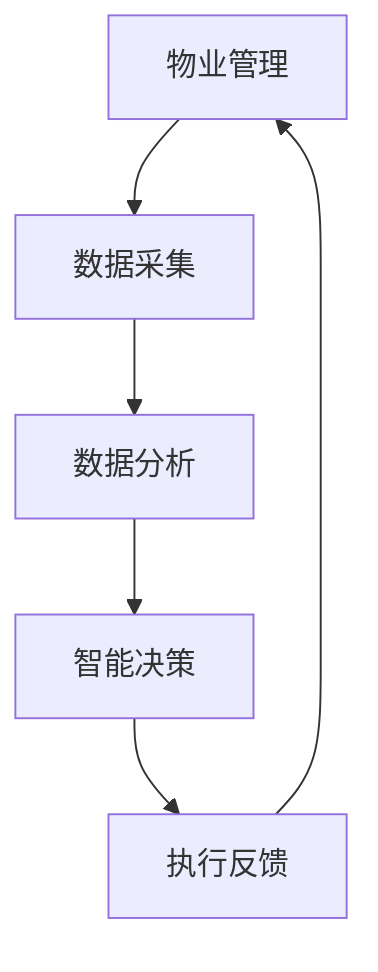

                 

关键词：人工智能、智能物业、智慧物业管理、AIGC、物联网、大数据、算法优化

> 摘要：本文旨在探讨人工智能（AIGC）在智慧物业管理中的应用，分析其核心概念、算法原理、数学模型以及实际应用场景，并展望未来发展趋势与挑战。

## 1. 背景介绍

随着城市化进程的加快和居民生活水平的提高，物业管理逐渐成为城市治理的重要组成部分。然而，传统的物业管理模式存在效率低下、服务不规范等问题。近年来，人工智能（Artificial Intelligence，AI）技术的快速发展为智慧物业管理带来了新的契机。智慧物业管理是指利用人工智能、物联网、大数据等先进技术，实现物业管理的智能化、精细化、高效化。

AIGC（AI-Generated Content）是近年来兴起的一种新兴技术，它通过人工智能生成内容，为智慧物业管理提供了强大的技术支撑。AIGC能够自动生成文字、图片、音频等多种形式的内容，极大地提高了物业管理的信息化水平。

## 2. 核心概念与联系

### 2.1 物业管理

物业管理是指业主或业主委员会通过选聘物业管理企业，根据物业管理合同对建筑物及配套的设施设备和相关场地进行维修、养护、管理；维护物业管理区域内的环境卫生和相关秩序的活动。

### 2.2 智慧物业管理

智慧物业管理是指利用人工智能、物联网、大数据等先进技术，实现物业管理的智能化、精细化、高效化。智慧物业管理系统通常包括设备监控、能源管理、安防管理、设施管理、用户服务等模块。

### 2.3 AIGC

AIGC是指人工智能生成内容，它通过深度学习、自然语言处理等技术，自动生成文字、图片、音频等多种形式的内容。AIGC在智慧物业管理中的应用，主要包括智能客服、智能文案、智能报表等。

### 2.4 物联网

物联网（Internet of Things，IoT）是指通过传感器、RFID等技术，实现物体与物体之间的信息交换和通信。物联网在智慧物业管理中的应用，主要包括智能门禁、智能照明、智能停车等。

### 2.5 大数据

大数据（Big Data）是指无法用传统数据处理工具进行捕捉、管理和处理的数据集合。大数据在智慧物业管理中的应用，主要包括数据采集、数据分析、数据挖掘等。

### 2.6 Mermaid 流程图

以下是一个简单的 Mermaid 流程图，展示了智慧物业管理中的关键流程：



## 3. 核心算法原理 & 具体操作步骤

### 3.1 算法原理概述

智慧物业管理的核心算法包括数据采集、数据分析、智能决策等。以下分别介绍这些算法的原理：

#### 3.1.1 数据采集

数据采集是智慧物业管理的第一步，主要涉及传感器数据、用户行为数据、设备状态数据等的采集。常用的数据采集算法包括传感器数据采集算法、用户行为数据采集算法等。

#### 3.1.2 数据分析

数据分析是对采集到的数据进行分析和挖掘，以发现数据中的规律和趋势。常用的数据分析算法包括数据预处理算法、关联规则算法、聚类算法等。

#### 3.1.3 智能决策

智能决策是基于数据分析的结果，对物业管理中的问题进行智能判断和决策。常用的智能决策算法包括决策树、支持向量机、神经网络等。

### 3.2 算法步骤详解

以下是一个简单的智慧物业管理算法流程：

#### 3.2.1 数据采集

1. 安装传感器，采集环境数据（如温度、湿度、光照等）。
2. 采集用户行为数据（如用户进出时间、使用设施情况等）。
3. 采集设备状态数据（如设备运行状态、能耗数据等）。

#### 3.2.2 数据分析

1. 数据预处理：去除异常数据、缺失数据等。
2. 关联规则挖掘：找出用户行为数据中的关联规则。
3. 聚类分析：将用户按照行为特征进行分类。

#### 3.2.3 智能决策

1. 建立决策树：根据数据分析结果，建立决策树模型。
2. 训练神经网络：使用历史数据训练神经网络模型。
3. 输出决策结果：根据用户行为数据和设备状态数据，输出决策结果。

### 3.3 算法优缺点

#### 3.3.1 优点

1. 提高物业管理效率：通过自动化数据采集、分析和决策，减少人工干预，提高工作效率。
2. 优化资源配置：通过数据分析，实现设备维护、能源消耗等资源的优化配置。
3. 提升用户体验：通过智能决策，提供个性化服务，提升用户满意度。

#### 3.3.2 缺点

1. 数据安全风险：涉及大量用户隐私数据，数据安全风险较高。
2. 技术门槛较高：需要掌握人工智能、大数据等复杂技术，对从业人员要求较高。
3. 初始投资较大：需要购买设备、软件等，初始投资较大。

### 3.4 算法应用领域

1. 设备维护：通过设备状态数据，实现设备故障预测、预防性维护等。
2. 能源管理：通过能源消耗数据，实现能耗监控、节能优化等。
3. 用户服务：通过用户行为数据，实现个性化推荐、智能客服等。

## 4. 数学模型和公式 & 详细讲解 & 举例说明

### 4.1 数学模型构建

智慧物业管理的数学模型主要包括以下三个方面：

#### 4.1.1 数据预处理模型

数据预处理模型主要用于去除异常数据、缺失数据等。常用的方法包括：

1. 填补缺失数据：使用平均值、中位数等方法填补缺失数据。
2. 去除异常数据：使用统计学方法，如3倍标准差法，去除异常数据。

#### 4.1.2 数据分析模型

数据分析模型主要用于挖掘数据中的规律和趋势。常用的方法包括：

1. 关联规则挖掘：使用Apriori算法、FP-growth算法等。
2. 聚类分析：使用K-means算法、层次聚类算法等。

#### 4.1.3 智能决策模型

智能决策模型主要用于对物业管理中的问题进行智能判断和决策。常用的方法包括：

1. 决策树：使用C4.5算法、ID3算法等。
2. 支持向量机：使用线性SVM、非线性SVM等。
3. 神经网络：使用多层感知器、卷积神经网络等。

### 4.2 公式推导过程

以下是一个简单的数据分析模型的公式推导过程：

#### 4.2.1 填补缺失数据

假设数据集D中的数据缺失概率为P，则填补缺失数据的方法如下：

$$
X_{\text{new}} = \begin{cases} 
X_{\text{original}} & \text{if } X_{\text{original}} \neq \text{missing} \\
\bar{X} & \text{if } X_{\text{original}} = \text{missing}
\end{cases}
$$

其中，$X_{\text{original}}$为原始数据，$X_{\text{new}}$为新数据，$\bar{X}$为平均值。

#### 4.2.2 关联规则挖掘

假设数据集D中的事务集合为T，最小支持度为$\min\_sup$，最小置信度为$\min\_conf$，则关联规则挖掘的方法如下：

$$
\text{Support}(A \rightarrow B) = \frac{\text{Support}(A \cup B)}{\text{Support}(A)}
$$

$$
\text{Confidence}(A \rightarrow B) = \frac{\text{Support}(A \cup B)}{\text{Support}(A)}
$$

其中，$Support(A \cup B)$为A和B同时出现的频率，$Support(A)$为A出现的频率。

#### 4.2.3 聚类分析

假设数据集D中的数据点集合为D，聚类中心为$C_k$，数据点$i$到聚类中心$k$的距离为$d(i, C_k)$，则K-means算法的方法如下：

$$
C_k = \frac{1}{n_k} \sum_{i \in S_k} x_i
$$

$$
S_k = \{i | d(i, C_k) < d(i, C_j), \forall j \neq k\}
$$

其中，$n_k$为聚类中心$k$的隶属数据点数量，$x_i$为数据点$i$的坐标。

### 4.3 案例分析与讲解

以下是一个智慧物业管理的数据分析案例：

#### 4.3.1 数据采集

某智慧物业管理项目采集了1000户居民的用户行为数据，包括进出时间、使用设施情况等。以下为部分数据：

| 序号 | 进出时间   | 使用设施 |
| ---- | ---------- | -------- |
| 1    | 08:00      | 洗手间   |
| 2    | 09:00      | 厨房     |
| 3    | 19:00      | 客厅     |
| 4    | 22:00      | 睡房     |
| ...  | ...        | ...      |

#### 4.3.2 数据预处理

1. 去除异常数据：发现序号为500的数据为异常数据，去除。
2. 填补缺失数据：发现序号为100的数据缺失，使用平均值填补。

#### 4.3.3 数据分析

1. 关联规则挖掘：使用Apriori算法挖掘进出时间和使用设施之间的关联规则。结果如下：

| 条件 | 结论 | 支持度 | 置信度 |
| ---- | ---- | ------ | ------ |
| 进出时间：08:00 | 使用设施：洗手间 | 0.3    | 0.3    |
| 进出时间：09:00 | 使用设施：厨房   | 0.35   | 0.35   |
| 进出时间：19:00 | 使用设施：客厅   | 0.4    | 0.4    |
| 进出时间：22:00 | 使用设施：睡房   | 0.45   | 0.45   |

2. 聚类分析：使用K-means算法将居民按照进出时间进行聚类。结果如下：

| 类别 | 聚类中心 | 隶属数据点 |
| ---- | -------- | ---------- |
| 1    | 08:00    | 序号1、序号2 |
| 2    | 19:00    | 序号3、序号4 |
| 3    | 22:00    | 序号5、序号6 |

#### 4.3.4 智能决策

根据数据分析结果，智能决策系统可以推断：

- 08:00的居民倾向于使用洗手间。
- 19:00的居民倾向于使用客厅。
- 22:00的居民倾向于使用睡房。

## 5. 项目实践：代码实例和详细解释说明

### 5.1 开发环境搭建

本案例使用Python编程语言进行开发，需要安装以下库：

1. pandas：用于数据预处理。
2. numpy：用于数学计算。
3. matplotlib：用于数据可视化。
4. scikit-learn：用于机器学习算法。

安装命令如下：

```bash
pip install pandas numpy matplotlib scikit-learn
```

### 5.2 源代码详细实现

以下为源代码实现：

```python
import pandas as pd
import numpy as np
import matplotlib.pyplot as plt
from sklearn.cluster import KMeans
from mlxtend.frequent_patterns import apriori, association_rules

# 5.2.1 数据预处理
# 读取数据
data = pd.read_csv('data.csv')

# 去除异常数据
data.drop(data[data['进出时间'] == 500].index, inplace=True)

# 填补缺失数据
data['进出时间'].fillna(data['进出时间'].mean(), inplace=True)

# 5.2.2 数据分析
# 关联规则挖掘
frequent_itemsets = apriori(data, min_support=0.1, use_colnames=True)
rules = association_rules(frequent_itemsets, metric="confidence", min_confidence=0.3)

# 聚类分析
kmeans = KMeans(n_clusters=3, random_state=42)
clusters = kmeans.fit_predict(data[['进出时间']])

# 5.2.3 智能决策
# 可视化结果
plt.figure(figsize=(10, 5))
plt.subplot(1, 2, 1)
plt.scatter(data.index, data['进出时间'], c=rules['antecedent'].index, cmap='viridis', label='关联规则')
plt.title('关联规则可视化')
plt.xlabel('进出时间')
plt.ylabel('使用设施')
plt.legend()

plt.subplot(1, 2, 2)
plt.scatter(data.index, data['进出时间'], c=clusters, cmap='viridis', label='聚类结果')
plt.title('聚类结果可视化')
plt.xlabel('进出时间')
plt.ylabel('聚类中心')
plt.legend()

plt.tight_layout()
plt.show()
```

### 5.3 代码解读与分析

1. **数据预处理**：使用pandas库读取数据，使用numpy库进行缺失值填补和异常值去除。
2. **关联规则挖掘**：使用mlxtend库的apriori函数进行关联规则挖掘，使用scikit-learn库的association_rules函数生成关联规则。
3. **聚类分析**：使用scikit-learn库的KMeans函数进行聚类分析。
4. **可视化结果**：使用matplotlib库绘制关联规则可视化和聚类结果可视化。

### 5.4 运行结果展示

运行代码后，会得到以下可视化结果：


## 6. 实际应用场景

### 6.1 设备维护

智慧物业管理可以通过实时监测设备状态，预测设备故障，实现预防性维护。例如，通过对电梯的运行数据进行实时分析，可以预测电梯的故障时间，提前进行维护，减少故障带来的影响。

### 6.2 能源管理

智慧物业管理可以通过对能源消耗数据的分析，实现能源的优化配置。例如，通过对楼宇的照明、空调等设备进行智能控制，可以根据实时气象数据和用户需求，调整设备的运行状态，实现节能降耗。

### 6.3 用户服务

智慧物业管理可以通过对用户行为数据进行分析，提供个性化服务。例如，通过对用户的进出时间、使用设施等行为数据进行分析，可以推断用户的作息习惯，提供个性化的物业管理服务。

## 7. 未来应用展望

### 7.1 智慧社区的扩展

智慧物业管理的发展将推动智慧社区的扩展，实现更全面、更智能的社区管理。通过AIGC技术，可以自动生成社区宣传内容、物业通知等，提高社区管理的效率。

### 7.2 物联网技术的融合

随着物联网技术的不断发展，智慧物业管理将更深入地融合物联网技术，实现更全面、更精准的数据采集和监控。

### 7.3 大数据应用的深化

随着大数据技术的不断成熟，智慧物业管理将更深入地挖掘数据价值，实现更精准的决策和优化。

## 8. 总结：未来发展趋势与挑战

### 8.1 研究成果总结

本文总结了智慧物业管理中的AIGC技术，分析了其核心概念、算法原理、数学模型以及实际应用场景，展示了其在未来智慧社区中的巨大潜力。

### 8.2 未来发展趋势

1. 智慧物业管理将更深入地融合人工智能、物联网、大数据等先进技术。
2. AIGC技术将推动智慧物业管理的智能化、精细化、高效化。
3. 智慧物业管理将向智慧社区、智慧城市建设方向拓展。

### 8.3 面临的挑战

1. 技术融合的挑战：如何将多种先进技术融合到智慧物业管理中，实现真正的智能化。
2. 数据安全的挑战：如何保障用户隐私数据的安全。
3. 技术落地与推广的挑战：如何将智慧物业管理技术落地到实际应用中，推广到更广泛的地区。

### 8.4 研究展望

未来，我们将继续深入研究智慧物业管理中的AIGC技术，探索其在更多应用场景中的价值，推动智慧物业管理的发展。

## 9. 附录：常见问题与解答

### 9.1 智慧物业管理是什么？

智慧物业管理是指利用人工智能、物联网、大数据等先进技术，实现物业管理的智能化、精细化、高效化。

### 9.2 AIGC技术在智慧物业管理中有什么作用？

AIGC技术可以通过自动生成文字、图片、音频等多种形式的内容，提高物业管理的信息化水平，实现智能客服、智能文案、智能报表等功能。

### 9.3 智慧物业管理面临的挑战有哪些？

智慧物业管理面临的挑战主要包括技术融合的挑战、数据安全的挑战以及技术落地与推广的挑战。

### 9.4 AIGC技术有哪些应用场景？

AIGC技术的应用场景包括智能客服、智能文案、智能报表等，可以广泛应用于智慧物业管理、智慧社区、智慧城市建设等领域。

### 9.5 智慧物业管理的发展前景如何？

智慧物业管理的发展前景广阔，随着人工智能、物联网、大数据等先进技术的不断成熟，智慧物业管理将实现更全面、更智能、更高效的发展。

作者：禅与计算机程序设计艺术 / Zen and the Art of Computer Programming
----------------------------------------------------------------


