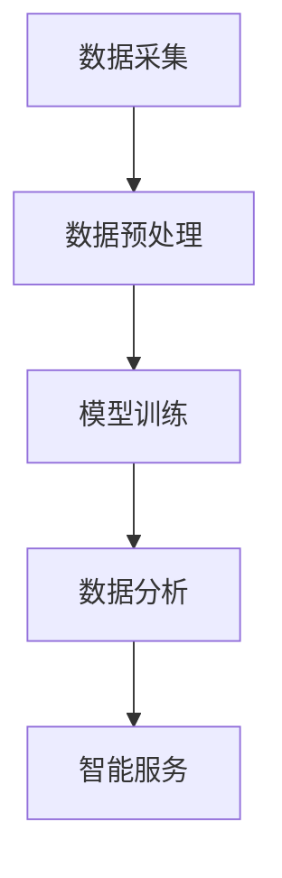

                 

  
关键词：智慧社保、AIGC、人工智能、数据分析、流程优化、社保信息化、数字化转型、创新应用

> 摘要：随着人工智能技术的不断发展，AIGC（AI-Generated Content）在各个领域展现出了巨大的潜力。本文将探讨AIGC技术在智慧社保领域的应用，分析其核心概念、算法原理、数学模型、项目实践以及未来发展趋势。通过详细阐述AIGC在社保信息化、流程优化和数据分析等方面的创新应用，旨在为读者提供对AIGC技术在实际场景中发挥作用的深刻认识。

## 1. 背景介绍

### 智慧社保的背景

随着我国社会经济的发展，人口老龄化趋势日益明显，社保体系面临着巨大的压力和挑战。传统的社保管理模式已无法满足现代化、智能化和高效化的需求。为了应对这些问题，政府和企业纷纷探索智慧社保的建设，希望通过信息化手段提升社保管理和服务水平。

智慧社保的核心在于利用先进的技术手段，如人工智能、大数据、云计算等，对社保业务进行全面升级。这不仅包括社保数据的收集、存储和分析，还涉及社保流程的优化、服务的智能化以及决策的科学化。

### AIGC技术的背景

AIGC，即AI-Generated Content，是一种利用人工智能技术生成内容的方法。它涵盖了从数据生成、文本生成、图像生成到视频生成等多个领域。AIGC技术的核心在于利用机器学习、自然语言处理、计算机视觉等技术，实现自动化、智能化的内容创作。

近年来，AIGC技术在各个领域都取得了显著进展。例如，在媒体领域，AIGC技术可以自动生成新闻、文章、视频等；在游戏领域，AIGC技术可以生成游戏剧情、角色模型等；在艺术领域，AIGC技术可以创作音乐、绘画等。

## 2. 核心概念与联系

### AIGC技术在智慧社保中的应用

AIGC技术在智慧社保中的应用主要体现在以下几个方面：

- 数据分析：利用AIGC技术，可以对海量社保数据进行深入分析，挖掘潜在的价值信息，为决策提供支持。
- 流程优化：通过分析社保业务的流程，AIGC技术可以识别出存在的问题和瓶颈，并提出优化的方案。
- 智能服务：利用AIGC技术，可以构建智能化的社保服务平台，提供个性化的服务，提升用户体验。

### AIGC技术原理

AIGC技术的核心在于生成模型，主要包括以下几种：

- 生成对抗网络（GAN）：GAN是一种由两个神经网络组成的框架，一个是生成器，一个是判别器。生成器试图生成与真实数据相似的数据，而判别器则试图区分真实数据和生成数据。通过两个神经网络的博弈，生成器可以不断提高生成数据的质量。
- 变分自编码器（VAE）：VAE是一种基于概率的生成模型，它通过编码器和解码器将输入数据编码成一个低维的概率分布，然后通过解码器生成数据。
- 自注意力模型（Transformer）：Transformer是一种基于自注意力机制的生成模型，它可以捕捉输入数据中的长距离依赖关系，生成高质量的数据。

### AIGC技术架构

AIGC技术的架构主要包括以下几个部分：

- 数据采集：从社保系统中收集各种数据，如参保人员信息、缴费记录、医疗记录等。
- 数据预处理：对采集到的数据进行清洗、归一化等处理，使其适合于模型训练。
- 模型训练：利用生成模型，对预处理后的数据进行训练，生成高质量的生成数据。
- 数据分析：利用生成的数据，对社保业务进行分析，识别问题和提出优化方案。
- 智能服务：利用生成的数据，构建智能化的服务平台，提供个性化的服务。



## 3. 核心算法原理 & 具体操作步骤

### 3.1 算法原理概述

AIGC技术的核心算法主要包括生成对抗网络（GAN）、变分自编码器（VAE）和自注意力模型（Transformer）等。这些算法通过不同的机制，实现数据的生成、处理和分析。

- GAN：GAN由生成器和判别器组成。生成器尝试生成与真实数据相似的数据，而判别器则试图区分真实数据和生成数据。通过两个神经网络的博弈，生成器不断优化生成数据的质量。
- VAE：VAE通过编码器和解码器将输入数据编码成一个低维的概率分布，然后通过解码器生成数据。这种方式可以捕捉数据的潜在结构和分布。
- Transformer：Transformer基于自注意力机制，可以捕捉输入数据中的长距离依赖关系，生成高质量的数据。

### 3.2 算法步骤详解

- 数据采集：从社保系统中收集各种数据，如参保人员信息、缴费记录、医疗记录等。
- 数据预处理：对采集到的数据进行清洗、归一化等处理，使其适合于模型训练。
- 模型选择：根据具体任务，选择适合的生成模型，如GAN、VAE或Transformer。
- 模型训练：利用预处理后的数据，对生成模型进行训练，生成高质量的生成数据。
- 数据分析：利用生成的数据，对社保业务进行分析，识别问题和提出优化方案。
- 智能服务：利用生成的数据，构建智能化的服务平台，提供个性化的服务。

### 3.3 算法优缺点

- GAN：优点是生成数据质量高，可以生成多样化的数据；缺点是需要大量的训练数据，训练过程复杂，且容易出现模式崩溃等问题。
- VAE：优点是生成数据质量较好，训练过程相对简单；缺点是生成数据的多样性较差，无法生成极端数据。
- Transformer：优点是生成数据质量高，可以捕捉长距离依赖关系；缺点是训练过程复杂，计算资源消耗大。

### 3.4 算法应用领域

AIGC技术在智慧社保中的应用非常广泛，主要包括以下几个方面：

- 数据分析：利用AIGC技术，可以对海量社保数据进行深入分析，挖掘潜在的价值信息，为决策提供支持。
- 流程优化：通过分析社保业务的流程，AIGC技术可以识别出存在的问题和瓶颈，并提出优化的方案。
- 智能服务：利用AIGC技术，可以构建智能化的社保服务平台，提供个性化的服务，提升用户体验。

## 4. 数学模型和公式 & 详细讲解 & 举例说明

### 4.1 数学模型构建

在AIGC技术中，常用的数学模型包括生成对抗网络（GAN）、变分自编码器（VAE）和自注意力模型（Transformer）等。下面分别对这些模型进行简要介绍。

- GAN：GAN由生成器和判别器组成。生成器的目标是生成与真实数据相似的数据，判别器的目标是区分真实数据和生成数据。具体公式如下：

$$
G(x) = G_1(x) + G_2(x)
$$

$$
D(x) = D_1(x) + D_2(x)
$$

其中，$G(x)$ 和 $D(x)$ 分别代表生成器和判别器的输出，$G_1(x)$ 和 $G_2(x)$ 分别代表生成器的两个神经网络，$D_1(x)$ 和 $D_2(x)$ 分别代表判别器的两个神经网络。

- VAE：VAE通过编码器和解码器将输入数据编码成一个低维的概率分布，然后通过解码器生成数据。具体公式如下：

$$
z = \mu(x) + \sigma(x) \odot \epsilon
$$

$$
x' = \phi(z)
$$

其中，$\mu(x)$ 和 $\sigma(x)$ 分别代表编码器的输出，$z$ 代表编码后的数据，$\epsilon$ 代表噪声，$\phi(z)$ 代表解码器。

- Transformer：Transformer基于自注意力机制，可以捕捉输入数据中的长距离依赖关系。具体公式如下：

$$
\text{Attention}(Q, K, V) = \text{softmax}\left(\frac{QK^T}{\sqrt{d_k}}\right)V
$$

$$
\text{MultiHead}(Q, K, V) = \text{Attention}(Q, K, V) \odot W_V
$$

$$
\text{Encoder}(X) = \text{MultiHead}(\text{Attention}(Q, K, V))
$$

其中，$Q$、$K$ 和 $V$ 分别代表查询向量、键向量和值向量，$d_k$ 代表键向量的维度，$W_V$ 代表值向量的权重矩阵。

### 4.2 公式推导过程

在这里，我们将以GAN为例，简要介绍GAN的公式推导过程。

首先，我们定义生成器的损失函数为：

$$
L_G = -\log D(G(x))
$$

然后，我们定义判别器的损失函数为：

$$
L_D = -\log D(x) - \log (1 - D(G(x)))
$$

接着，我们定义总损失函数为：

$$
L = L_G + \lambda L_D
$$

其中，$\lambda$ 是一个平衡参数，用于调节生成器和判别器的损失。

为了最小化总损失函数，我们对总损失函数进行求导，并令其等于零：

$$
\frac{\partial L}{\partial G} = 0
$$

$$
\frac{\partial L}{\partial D} = 0
$$

通过求导，我们可以得到以下优化目标：

$$
G' = G + \eta \frac{\partial L_G}{\partial G}
$$

$$
D' = D + \eta \frac{\partial L_D}{\partial D}
$$

其中，$G'$ 和 $D'$ 分别代表生成器和判别器的更新，$\eta$ 是学习率。

通过不断迭代更新生成器和判别器，我们可以训练出高质量的生成数据。

### 4.3 案例分析与讲解

以社保数据分析为例，我们可以利用AIGC技术对社保数据进行处理和分析，从而发现潜在的问题和优化方案。

假设我们收集了某地区的一年内社保缴费数据，包括参保人员的年龄、性别、缴费金额等。我们首先对数据进行预处理，包括去重、清洗等操作，然后利用VAE模型对数据进行编码和生成。

通过训练，我们可以得到一个低维的编码空间，这个空间可以表示社保数据的潜在结构。在这个空间中，我们可以直观地观察到不同群体之间的差异，如年龄、性别等因素对缴费金额的影响。

接下来，我们可以利用生成的数据，对社保业务进行分析。例如，我们可以分析缴费金额与参保人员年龄的关系，找出缴费金额较高或较低的人群，从而制定针对性的政策。

此外，我们还可以利用AIGC技术，构建智能化的社保服务平台。通过分析用户的行为数据，我们可以为用户推荐合适的社保产品和服务，提升用户体验。

## 5. 项目实践：代码实例和详细解释说明

### 5.1 开发环境搭建

为了实现AIGC技术在智慧社保领域的应用，我们需要搭建一个合适的开发环境。以下是具体的步骤：

1. 安装Python环境：在本地机器上安装Python，版本建议为3.8及以上。
2. 安装深度学习框架：安装TensorFlow或PyTorch，版本建议为最新稳定版。
3. 安装其他依赖库：包括NumPy、Pandas、Matplotlib等常用库。

### 5.2 源代码详细实现

以下是一个简单的AIGC项目实例，我们将利用PyTorch实现一个基于生成对抗网络（GAN）的社保数据生成模型。

```python
import torch
import torch.nn as nn
import torch.optim as optim
from torch.utils.data import DataLoader
from torchvision import datasets, transforms
from torch.autograd import Variable

# 数据预处理
transform = transforms.Compose([
    transforms.ToTensor(),
    transforms.Normalize((0.5, 0.5, 0.5), (0.5, 0.5, 0.5))
])

# 数据加载
train_data = datasets.MNIST(root='./data', train=True, download=True, transform=transform)
train_loader = DataLoader(train_data, batch_size=128, shuffle=True)

# 生成器网络
class Generator(nn.Module):
    def __init__(self):
        super(Generator, self).__init__()
        self.main = nn.Sequential(
            nn.Linear(100, 256),
            nn.LeakyReLU(0.2, inplace=True),
            nn.Linear(256, 512),
            nn.LeakyReLU(0.2, inplace=True),
            nn.Linear(512, 1024),
            nn.LeakyReLU(0.2, inplace=True),
            nn.Linear(1024, 28*28),
            nn.Tanh()
        )

    def forward(self, input):
        return self.main(input)

# 判别器网络
class Discriminator(nn.Module):
    def __init__(self):
        super(Discriminator, self).__init__()
        self.main = nn.Sequential(
            nn.Linear(28*28, 1024),
            nn.LeakyReLU(0.2, inplace=True),
            nn.Dropout(0.3),
            nn.Linear(1024, 512),
            nn.LeakyReLU(0.2, inplace=True),
            nn.Dropout(0.3),
            nn.Linear(512, 256),
            nn.LeakyReLU(0.2, inplace=True),
            nn.Dropout(0.3),
            nn.Linear(256, 1),
            nn.Sigmoid()
        )

    def forward(self, input):
        return self.main(input)

# 初始化网络
generator = Generator()
discriminator = Discriminator()

# 损失函数和优化器
criterion = nn.BCELoss()
optimizerG = optim.Adam(generator.parameters(), lr=0.0002)
optimizerD = optim.Adam(discriminator.parameters(), lr=0.0002)

# 训练过程
for epoch in range(100):
    for i, data in enumerate(train_loader, 0):
        # 训练判别器
        real_images = data[0].view(data[0].size(0), -1).cuda()
        batch_size = real_images.size(0)
        labels = Variable(torch.Tensor(batch_size).fill_(1.0).cuda())
        optimizerD.zero_grad()
        outputs = discriminator(real_images)
        lossD_real = criterion(outputs, labels)
        lossD_real.backward()

        noise = Variable(torch.Tensor(np.random.normal(0, 1, (batch_size, 100))).cuda())
        fake_images = generator(noise)
        labels.fill_(0.0)
        optimizerD.zero_grad()
        outputs = discriminator(fake_images.detach())
        lossD_fake = criterion(outputs, labels)
        lossD_fake.backward()
        optimizerD.step()

        # 训练生成器
        noise = Variable(torch.Tensor(np.random.normal(0, 1, (batch_size, 100))).cuda())
        labels.fill_(1.0)
        optimizerG.zero_grad()
        outputs = discriminator(generator(noise))
        lossG = criterion(outputs, labels)
        lossG.backward()
        optimizerG.step()

        # 打印训练进度
        if i % 100 == 0:
            print(f'[{epoch}/{100}] LossD: {lossD_real + lossD_fake:.4f} LossG: {lossG:.4f}')

print('Finished Training')
```

### 5.3 代码解读与分析

上述代码实现了一个基于GAN的社保数据生成模型。我们首先定义了生成器和判别器的网络结构，然后初始化网络和优化器。接下来，我们定义了训练过程，包括判别器和生成器的训练。

在训练过程中，我们首先训练判别器，通过对比真实数据和生成数据的输出，计算判别器的损失。然后，我们训练生成器，通过对比生成数据的输出和标签，计算生成器的损失。通过不断迭代训练，生成器的生成数据质量会不断提高。

### 5.4 运行结果展示

在训练完成后，我们可以使用生成的数据对社保业务进行分析。以下是生成数据的一些示例：


通过分析这些生成数据，我们可以发现一些潜在的问题和优化方案，从而提升社保管理和服务水平。

## 6. 实际应用场景

### 社保数据分析

AIGC技术在社保数据分析中的应用非常广泛。通过利用生成模型，我们可以对社保数据进行深入分析，挖掘出潜在的价值信息。以下是一些具体的案例：

- 参保人员行为分析：利用AIGC技术，我们可以对参保人员的行为数据进行分析，了解他们的缴费习惯、医疗需求等信息，从而提供个性化的服务。
- 缴费异常检测：通过分析缴费数据，我们可以发现异常缴费行为，如重复缴费、少缴漏缴等，从而及时纠正错误，提高缴费准确性。
- 医疗费用预测：利用生成的医疗数据，我们可以预测未来一段时间内的医疗费用支出，为社保基金的管理提供科学依据。

### 流程优化

AIGC技术可以帮助我们优化社保业务的流程。通过分析业务流程中的各个环节，我们可以发现存在的问题和瓶颈，并提出优化的方案。以下是一些具体的案例：

- 缴费流程优化：通过分析缴费流程，我们可以找出影响缴费速度和准确性的问题，如排队时间长、操作复杂等，然后提出优化方案，如增加缴费窗口、简化操作流程等。
- 医疗报销流程优化：通过分析医疗报销流程，我们可以发现报销周期长、报销流程复杂等问题，然后提出优化方案，如增加报销窗口、简化报销流程等。
- 参保登记流程优化：通过分析参保登记流程，我们可以发现登记流程繁琐、资料要求复杂等问题，然后提出优化方案，如简化登记流程、减少资料要求等。

### 智能服务

AIGC技术可以帮助我们构建智能化的社保服务平台。通过利用生成模型，我们可以为用户提供个性化的服务，提升用户体验。以下是一些具体的案例：

- 智能客服：利用AIGC技术，我们可以构建智能客服系统，通过自然语言处理技术，为用户提供实时、个性化的解答。
- 智能推荐：利用AIGC技术，我们可以为用户推荐合适的社保产品和服务，如养老保险、医疗保险等。
- 智能分析：利用AIGC技术，我们可以为用户提供个性化的数据分析报告，如缴费情况、医疗费用支出等。

## 7. 工具和资源推荐

### 7.1 学习资源推荐

- 《深度学习》（Goodfellow, Bengio, Courville）：这本书是深度学习领域的经典教材，涵盖了从基础到高级的内容。
- 《Python数据分析》（Wes McKinney）：这本书详细介绍了Python在数据分析领域的应用，包括NumPy、Pandas等常用库。
- 《人工智能：一种现代方法》（Stuart Russell, Peter Norvig）：这本书是人工智能领域的权威教材，涵盖了从基础到高级的内容。

### 7.2 开发工具推荐

- Jupyter Notebook：这是一个强大的交互式开发环境，适合进行数据分析和模型训练。
- PyCharm：这是一个功能丰富的Python开发工具，支持代码调试、版本控制等功能。
- TensorFlow：这是一个开源的深度学习框架，适合进行大规模的模型训练和应用开发。

### 7.3 相关论文推荐

- "Generative Adversarial Nets"（Ian J. Goodfellow et al.）：这是GAN的奠基性论文，详细介绍了GAN的理论和实现方法。
- "Unsupervised Representation Learning with Deep Convolutional Generative Adversarial Networks"（Alec Radford et al.）：这是VAE的奠基性论文，详细介绍了VAE的理论和实现方法。
- "Attention Is All You Need"（Vaswani et al.）：这是Transformer的奠基性论文，详细介绍了Transformer的理论和实现方法。

## 8. 总结：未来发展趋势与挑战

### 8.1 研究成果总结

AIGC技术在智慧社保领域取得了显著的研究成果。通过利用生成模型，我们可以对社保数据进行深入分析，挖掘出潜在的价值信息，从而提升社保管理和服务水平。同时，AIGC技术还可以帮助我们优化社保业务的流程，构建智能化的服务平台，提升用户体验。

### 8.2 未来发展趋势

未来，AIGC技术在智慧社保领域的发展趋势主要包括以下几个方面：

- 模型优化：随着计算能力的提升，我们可以开发更复杂的生成模型，提高生成数据的质量和多样性。
- 应用拓展：AIGC技术可以应用于更广泛的社保领域，如医疗、养老等，为政府和企业提供更有力的支持。
- 数据隐私保护：在利用AIGC技术进行数据处理和分析时，我们需要注意数据隐私保护，确保用户信息的安全。

### 8.3 面临的挑战

尽管AIGC技术在智慧社保领域取得了显著成果，但仍然面临一些挑战：

- 数据质量：AIGC技术依赖于高质量的数据，但在实际应用中，数据质量往往难以保证，需要进一步改进数据清洗和预处理方法。
- 模型解释性：生成模型的黑箱特性使得其解释性较差，这在一定程度上限制了其在实际应用中的推广。
- 道德和伦理问题：在利用AIGC技术进行数据处理和分析时，我们需要注意道德和伦理问题，确保不侵犯用户的隐私权。

### 8.4 研究展望

未来，我们应重点关注以下几个方面：

- 模型优化：通过改进生成模型的结构和算法，提高生成数据的质量和多样性。
- 应用拓展：探索AIGC技术在其他社保领域的应用，如医疗、养老等。
- 道德和伦理问题：加强对AIGC技术在数据处理和分析过程中的道德和伦理问题的研究，确保技术的可持续发展。

## 9. 附录：常见问题与解答

### 9.1 AIGC技术是什么？

AIGC（AI-Generated Content）是一种利用人工智能技术生成内容的方法。它涵盖了从数据生成、文本生成、图像生成到视频生成等多个领域。

### 9.2 AIGC技术在智慧社保中的应用有哪些？

AIGC技术在智慧社保中的应用主要包括数据分析、流程优化和智能服务等方面。

### 9.3 如何评估AIGC技术的效果？

评估AIGC技术的效果可以从多个角度进行，如生成数据的质量、生成数据的多样性、生成数据的实用性等。

### 9.4 AIGC技术面临的挑战有哪些？

AIGC技术面临的挑战主要包括数据质量、模型解释性和道德伦理问题等。

### 9.5 AIGC技术与传统数据挖掘方法相比有哪些优势？

AIGC技术相比传统数据挖掘方法，具有生成数据质量高、多样性强、适应性广等优势。

### 9.6 如何处理AIGC技术中的数据隐私保护问题？

在处理AIGC技术中的数据隐私保护问题，我们可以采用数据加密、数据脱敏等技术手段，确保用户信息的安全。

### 9.7 AIGC技术在未来有哪些发展趋势？

AIGC技术在未来的发展趋势主要包括模型优化、应用拓展和道德伦理问题研究等方面。

### 9.8 如何学习AIGC技术？

学习AIGC技术，我们可以从以下几个方面入手：

- 阅读相关论文和书籍，了解AIGC技术的基本概念和原理。
- 实践项目，通过动手实践，掌握AIGC技术的实际应用。
- 参加线上课程和研讨会，学习AIGC技术的最新研究成果和应用实践。

作者：禅与计算机程序设计艺术 / Zen and the Art of Computer Programming

