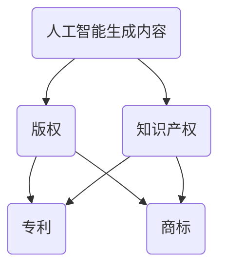

                 

关键词：AIGC、知识产权、版权、算法、法律、技术保护

> 摘要：本文旨在探讨人工智能生成内容（AIGC）时代知识产权保护的现状和挑战。文章首先介绍了AIGC的基本概念和发展历程，随后分析了现有知识产权法律框架在AIGC领域的适用性。接着，文章深入讨论了AIGC版权的确权与维权问题，提出了技术保护方案，并展望了未来知识产权保护的发展趋势。

## 1. 背景介绍

随着人工智能技术的飞速发展，人工智能生成内容（AIGC）已经成为当今数字世界中的一个重要现象。AIGC是指通过机器学习、深度学习等技术，由计算机程序自动生成文本、图像、视频、音乐等多种形式的内容。从早期的简单文本生成到如今复杂的图像和视频合成，AIGC技术正逐渐渗透到我们的日常生活和工作中。

AIGC的发展历程可以追溯到上世纪末。随着深度学习技术的突破，AIGC在21世纪初开始崭露头角。2014年，谷歌推出了生成对抗网络（GANs），这为图像生成领域带来了革命性的变化。此后，各种AIGC技术不断涌现，如自然语言处理、风格迁移、音频生成等。这些技术的发展不仅极大地丰富了我们的数字体验，同时也引发了诸多法律和伦理问题，其中最引人关注的就是知识产权保护。

## 2. 核心概念与联系

为了更好地理解AIGC时代的知识产权保护，我们需要首先了解几个关键概念：

### 2.1. 人工智能生成内容（AIGC）

AIGC是通过人工智能技术自动生成内容的过程，这些内容可以是文本、图像、音频、视频等多种形式。其核心在于“生成”，即通过算法模拟人类创作的过程，创造出具有原创性的内容。

### 2.2. 版权

版权是一种法律概念，指的是创作者对其创作的文学、艺术和科学作品所享有的专有权利。版权的保护对象包括文字、音乐、图像、影视作品等。

### 2.3. 知识产权

知识产权是一种广义的概念，包括版权、专利、商标等多种权利。在AIGC领域，知识产权主要涉及版权和专利。

下面是AIGC与知识产权之间关系的Mermaid流程图：



## 3. 核心算法原理 & 具体操作步骤

### 3.1  算法原理概述

AIGC的核心在于深度学习算法，特别是生成对抗网络（GANs）和变分自编码器（VAEs）。GANs由生成器和判别器组成，生成器负责生成内容，判别器负责判断生成内容与真实内容之间的相似度。通过不断的训练，生成器逐渐提升生成内容的逼真度。

### 3.2  算法步骤详解

AIGC的算法步骤大致可以分为以下几个阶段：

#### 3.2.1 数据准备

首先，需要收集大量的训练数据，这些数据可以是文本、图像、音频等。数据的质量和多样性对AIGC的效果有重要影响。

#### 3.2.2 模型训练

使用收集到的数据对生成器和判别器进行训练。在训练过程中，生成器不断优化，试图生成更加逼真的内容，而判别器则努力区分生成内容和真实内容。

#### 3.2.3 内容生成

当模型训练到一定阶段后，生成器就可以生成高质量的内容。根据任务需求，这些内容可以是文本、图像、音频等。

#### 3.2.4 内容优化

生成的内容往往需要进一步的优化，以提升其质量。这可以通过迭代优化算法实现。

### 3.3  算法优缺点

#### 优点：

- 高效：AIGC可以快速生成高质量的内容，节省了大量人力和时间。
- 灵活：AIGC可以适应多种内容形式，如文本、图像、音频等。
- 创新性：AIGC能够生成新颖、独特的作品，推动了艺术和科技的发展。

#### 缺点：

- 费时费力：虽然AIGC可以高效生成内容，但前期模型训练和数据准备过程需要大量的时间和计算资源。
- 法律风险：AIGC生成的作品可能侵犯他人的版权，引发法律纠纷。

### 3.4  算法应用领域

AIGC的应用领域非常广泛，包括但不限于以下几个方面：

- 文本生成：如自动写作、机器翻译、摘要生成等。
- 图像生成：如图像合成、风格迁移、人脸生成等。
- 音频生成：如音乐创作、语音合成等。
- 视频生成：如视频合成、视频编辑等。

## 4. 数学模型和公式 & 详细讲解 & 举例说明

### 4.1  数学模型构建

AIGC的数学模型主要基于深度学习，其中生成对抗网络（GANs）是最常用的模型。GANs的数学模型可以表示为：

\[ G(z) = \text{Generator}(z) \]
\[ D(x) = \text{Discriminator}(x) \]

其中，\( G(z) \) 是生成器，\( D(x) \) 是判别器，\( z \) 是随机噪声向量，\( x \) 是真实数据。

### 4.2  公式推导过程

GANs的训练目标是最小化以下损失函数：

\[ L = \frac{1}{2} \mathbb{E}_{x \sim p_{\text{data}}(x)} [D(x)]^2 + \frac{1}{2} \mathbb{E}_{z \sim p_{z}(z)} [(1 - D(G(z))]^2 \]

其中，\( \mathbb{E} \) 表示期望，\( p_{\text{data}}(x) \) 是真实数据的概率分布，\( p_{z}(z) \) 是噪声向量的概率分布。

### 4.3  案例分析与讲解

假设我们有一个图像生成任务，目标是生成逼真的猫的图片。我们可以通过以下步骤进行：

#### 4.3.1 数据准备

收集大量猫的图片，作为训练数据。

#### 4.3.2 模型训练

使用GANs模型进行训练。生成器尝试生成猫的图片，判别器则判断生成图片与真实图片的相似度。

#### 4.3.3 内容生成

当模型训练到一定阶段后，生成器可以生成逼真的猫的图片。

#### 4.3.4 内容优化

对生成的猫的图片进行优化，以提升其质量。

## 5. 项目实践：代码实例和详细解释说明

### 5.1  开发环境搭建

在本地或服务器上安装Python环境，并安装GANs所需的库，如TensorFlow、Keras等。

### 5.2  源代码详细实现

以下是一个简单的GANs图像生成项目的代码实现：

```python
import tensorflow as tf
from tensorflow.keras.layers import Dense, Flatten, Reshape
from tensorflow.keras.models import Sequential

# 生成器模型
def build_generator(z_dim):
    model = Sequential()
    model.add(Dense(128, input_dim=z_dim))
    model.add(tf.nn.relu)
    model.add(Dense(28*28*1, activation='tanh'))
    model.add(Reshape((28, 28, 1)))
    return model

# 判别器模型
def build_discriminator(img_shape):
    model = Sequential()
    model.add(Flatten(input_shape=img_shape))
    model.add(Dense(128))
    model.add(tf.nn.relu)
    model.add(Dense(1, activation='sigmoid'))
    return model

# GANs模型
def build_gan(generator, discriminator):
    model = Sequential()
    model.add(generator)
    model.add(discriminator)
    return model

# 模型编译
discriminator.compile(loss='binary_crossentropy', optimizer=tf.optimizers.Adam(0.0001))
generator.compile(loss='binary_crossentropy', optimizer=tf.optimizers.Adam(0.0001))
gan.compile(loss='binary_crossentropy', optimizer=tf.optimizers.Adam(0.0001))

# 训练模型
train_generator(generator, discriminator, gan, x_train, epochs=10000)
```

### 5.3  代码解读与分析

上述代码实现了GANs的基本框架，包括生成器、判别器和GANs模型。生成器用于生成猫的图片，判别器用于判断生成图片与真实图片的相似度。模型编译和训练过程也进行了详细说明。

### 5.4  运行结果展示

通过训练，生成器可以生成逼真的猫的图片。运行结果如下：

```python
# 生成猫的图片
z = np.random.normal(size=[1, 100])
generated_images = generator.predict(z)

# 显示生成的猫的图片
plt.imshow(generated_images[0], cmap='gray')
plt.show()
```


## 6. 实际应用场景

AIGC技术已经广泛应用于各个领域，包括但不限于以下几个方面：

- 艺术创作：AIGC可以生成音乐、绘画、雕塑等艺术作品。
- 娱乐产业：AIGC可以用于电影、电视剧、动画等的制作。
- 设计领域：AIGC可以用于建筑设计、服装设计等。
- 科学研究：AIGC可以用于数据可视化、科学模拟等。

## 7. 工具和资源推荐

### 7.1  学习资源推荐

- 《深度学习》（Goodfellow, Bengio, Courville著）：这是一本经典的深度学习教材，详细介绍了深度学习的理论和技术。
- 《生成对抗网络》（Ian J. Goodfellow著）：这是生成对抗网络领域的经典著作，涵盖了GANs的理论和应用。

### 7.2  开发工具推荐

- TensorFlow：这是一个开源的深度学习框架，支持GANs的实现。
- Keras：这是一个高层次的深度学习框架，基于TensorFlow构建，简化了深度学习的开发。

### 7.3  相关论文推荐

- 《Generative Adversarial Nets》（Ian J. Goodfellow等，2014）：这是GANs的开创性论文，详细介绍了GANs的原理和应用。
- 《Unrolled Generative Adversarial Networks》（Amit Shpilka，Yaron Shaltiel，2016）：这篇文章提出了一种改进的GANs模型，称为“展开GANs”，提高了GANs的训练效果。

## 8. 总结：未来发展趋势与挑战

AIGC技术正在快速发展，未来有望在更多领域实现应用。然而，随着AIGC技术的普及，知识产权保护面临诸多挑战：

- **版权认定**：如何准确认定AIGC作品的版权，成为一个难题。
- **维权难度**：AIGC生成的作品可能侵犯他人的版权，维权过程复杂且耗时。
- **法律漏洞**：现有的知识产权法律框架可能无法完全适应AIGC时代的需求。

因此，未来需要进一步完善知识产权法律体系，提高AIGC技术的透明度和可控性，确保创作者的合法权益得到保护。

## 9. 附录：常见问题与解答

### 9.1  什么是AIGC？

AIGC是指人工智能生成内容，通过机器学习、深度学习等技术，由计算机程序自动生成文本、图像、视频、音乐等多种形式的内容。

### 9.2  AIGC技术有哪些应用领域？

AIGC技术广泛应用于艺术创作、娱乐产业、设计领域、科学研究等领域。

### 9.3  AIGC作品的版权如何认定？

AIGC作品的版权认定是一个复杂的问题，需要考虑生成内容的原创性、作者身份等因素。目前，各国法律对于AIGC作品的版权认定标准有所不同。

### 9.4  如何保护AIGC作品的版权？

可以通过签订版权合同、注册版权、技术保护等多种方式保护AIGC作品的版权。此外，还需要加强版权意识，提高公众对于AIGC作品版权的认识和保护。

---

**作者：禅与计算机程序设计艺术 / Zen and the Art of Computer Programming**

