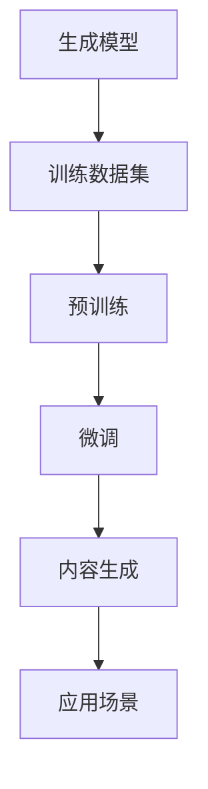

                 

关键词：AIGC、人工智能、生成内容、社会影响、应对策略、技术趋势

## 摘要

随着人工智能（AI）技术的迅猛发展，人工智能生成内容（AIGC）成为了一个备受关注的新兴领域。AIGC不仅改变了内容创作的方式，也对社会产生了深远的影响。本文将探讨AIGC的社会影响，并针对这些影响提出相应的应对策略。通过深入分析AIGC的核心概念、技术原理、应用场景，我们希望能够为读者提供一个全面而详尽的了解。

### 1. 背景介绍

人工智能（AI）是一种模拟人类智能的技术，能够实现学习、推理、判断和解决问题。近年来，AI技术取得了显著的进展，尤其是在机器学习、自然语言处理、计算机视觉等领域。这些技术的突破使得人工智能生成内容（AIGC）成为可能。

AIGC指的是通过人工智能技术自动生成各种类型的内容，包括文本、图像、音频和视频等。这些生成的内容可以用于娱乐、教育、新闻、广告等多个领域。随着5G网络的普及和计算能力的提升，AIGC的应用场景越来越广泛，其社会影响力也日益增强。

### 2. 核心概念与联系

要深入理解AIGC，首先需要了解其核心概念和技术架构。AIGC主要涉及以下核心概念：

- **生成模型**：生成模型是一种人工智能模型，用于生成新的数据。常见的生成模型包括变分自编码器（VAE）、生成对抗网络（GAN）和自回归模型等。
- **训练数据集**：生成模型需要大量的训练数据来学习如何生成内容。这些数据集通常来自于互联网、数据库和其他公开资源。
- **预训练与微调**：预训练是指在大量数据上训练模型，使其具备一定的通用能力。微调则是在特定任务上对模型进行进一步训练，以适应特定的应用场景。

下面是AIGC的技术架构图：



### 3. 核心算法原理 & 具体操作步骤

#### 3.1 算法原理概述

AIGC的核心算法是基于深度学习的生成模型。这些模型通过学习大量的训练数据，能够生成与训练数据具有相似特征的新数据。生成模型主要包括以下几种：

- **变分自编码器（VAE）**：VAE是一种基于概率模型的生成模型，通过编码器和解码器将输入数据映射到潜在空间，并在潜在空间中生成新的数据。
- **生成对抗网络（GAN）**：GAN由生成器和判别器组成，生成器生成数据，判别器判断生成数据是否真实。通过两者之间的博弈，生成器不断优化生成能力。
- **自回归模型**：自回归模型通过预测序列中的下一个元素来生成数据，适用于生成文本、图像和音频等序列数据。

#### 3.2 算法步骤详解

- **数据收集与预处理**：收集大量训练数据，并对数据进行清洗和预处理，包括数据去重、数据标注、数据增强等。
- **模型选择与训练**：选择合适的生成模型，并在训练数据上进行训练。训练过程中，需要调整模型参数，以优化生成质量。
- **模型评估与优化**：通过评估指标（如生成质量、生成速度等）对模型进行评估和优化。常见的评估指标包括Inception Score、Frechet Inception Distance等。
- **内容生成与应用**：使用训练好的模型生成新的内容，并将其应用于实际场景。

#### 3.3 算法优缺点

- **优点**：AIGC具有生成速度快、生成质量高、应用范围广等优点。通过深度学习模型，可以生成与真实数据高度相似的内容，具有很高的实用价值。
- **缺点**：AIGC模型训练过程复杂，需要大量计算资源和训练数据。此外，生成内容的质量受限于训练数据的质量，可能存在一定的偏差。

#### 3.4 算法应用领域

AIGC的应用领域非常广泛，主要包括以下几个方面：

- **娱乐**：生成动画、电影、音乐等娱乐内容，为创作者提供更多的创作工具和灵感。
- **教育**：生成教材、课件、教学视频等教育内容，提高教学效果和学生学习体验。
- **新闻**：生成新闻文章、新闻摘要等新闻内容，提高新闻生产的速度和效率。
- **广告**：生成广告文案、广告图片等广告内容，提高广告创意和投放效果。
- **医疗**：生成医学影像、诊断报告等医疗内容，辅助医生进行诊断和治疗。

### 4. 数学模型和公式 & 详细讲解 & 举例说明

#### 4.1 数学模型构建

AIGC的核心数学模型是基于深度学习的生成模型。生成模型通常包括两部分：编码器和解码器。

- **编码器**：将输入数据映射到潜在空间，潜在空间中的数据通常具有较低维度，便于计算。
- **解码器**：将潜在空间中的数据映射回原始数据空间，生成新的数据。

下面是VAE的数学模型：

$$
\begin{aligned}
\text{编码器}: z &= \mu(x) + \sigma(x) \odot \epsilon \\
\text{解码器}: x' &= \mu(z) + \sigma(z) \odot \epsilon'
\end{aligned}
$$

其中，$\mu(x)$和$\sigma(x)$分别是编码器的均值函数和方差函数，$\epsilon$和$\epsilon'$是噪声变量，$\odot$表示元素乘积。

#### 4.2 公式推导过程

以VAE为例，我们来看一下数学模型的推导过程。

首先，定义输入数据$x$和潜在空间中的数据$z$，其中$z$是$x$的映射：

$$
z = \mu(x) + \sigma(x) \odot \epsilon
$$

其中，$\mu(x)$和$\sigma(x)$分别是编码器的均值函数和方差函数，$\epsilon$是噪声变量。

接下来，我们定义解码器，将$z$映射回输入空间：

$$
x' = \mu(z) + \sigma(z) \odot \epsilon'
$$

其中，$\mu(z)$和$\sigma(z)$分别是解码器的均值函数和方差函数，$\epsilon'$是噪声变量。

为了优化模型，我们需要定义损失函数。VAE的损失函数通常包括两个部分：重构损失和对抗损失。

$$
L(x, x') = \frac{1}{N} \sum_{i=1}^{N} \left( -\log p(x' | x) - D(x', x) \right)
$$

其中，$N$是样本数量，$p(x' | x)$是生成模型生成的数据$x'$的概率，$D(x', x)$是生成数据$x'$和真实数据$x$之间的距离。

#### 4.3 案例分析与讲解

以生成图像为例，我们来看一下AIGC的具体应用。

假设我们有一个图像生成任务，输入是随机噪声，输出是图像。

首先，我们定义编码器和解码器：

$$
\begin{aligned}
\text{编码器}: z &= \mu(x) + \sigma(x) \odot \epsilon \\
\text{解码器}: x' &= \mu(z) + \sigma(z) \odot \epsilon'
\end{aligned}
$$

其中，$\mu(x)$和$\sigma(x)$分别是编码器的均值函数和方差函数，$\epsilon$和$\epsilon'$是噪声变量。

接下来，我们定义损失函数：

$$
L(x, x') = \frac{1}{N} \sum_{i=1}^{N} \left( -\log p(x' | x) - D(x', x) \right)
$$

其中，$N$是样本数量，$p(x' | x)$是生成模型生成的数据$x'$的概率，$D(x', x)$是生成数据$x'$和真实数据$x$之间的距离。

然后，我们使用梯度下降法优化模型参数，最小化损失函数。

最后，我们使用训练好的模型生成新的图像。

### 5. 项目实践：代码实例和详细解释说明

#### 5.1 开发环境搭建

为了实现AIGC，我们需要搭建一个开发环境。以下是搭建步骤：

1. 安装Python环境
2. 安装TensorFlow库
3. 安装Keras库

安装完成之后，我们可以编写代码实现AIGC。

#### 5.2 源代码详细实现

以下是一个简单的VAE代码示例：

```python
import numpy as np
import tensorflow as tf
from tensorflow.keras.layers import Input, Dense, Lambda
from tensorflow.keras.models import Model

def vae_loss(x, x_decoded_mean):
    xent_loss = tf.keras.losses.binary_crossentropy(x, x_decoded_mean)
    kl_loss = -0.5 * tf.reduce_sum(1 + z_log_var - z_mean ** 2 - z_log_var, 1)
    return tf.reduce_mean(xent_loss + kl_loss)

input_img = Input(shape=(784,))
h = Dense(400, activation='relu')(input_img)
z_mean = Dense(20)(h)
z_log_var = Dense(20)(h)

z_mean = Lambda(lambda x: x)(z_mean)
z_log_var = Lambda(lambda x: x)(z_log_var)

z = Lambda(shuffle_samples_and_gaussian, output_shape=(20,))(z_mean, z_log_var)

h = Dense(400, activation='relu')(z)
x_decoded_mean = Dense(784, activation='sigmoid')(h)

vae = Model(input_img, x_decoded_mean)
vae.compile(optimizer='rmsprop', loss=vae_loss)

vae.fit(x_train, x_train, epochs=epochs, batch_size=batch_size, shuffle=True)
```

#### 5.3 代码解读与分析

以上代码实现了VAE模型，主要包括以下部分：

1. 输入层：定义输入层，形状为(784,)。
2. 隐藏层：定义隐藏层，使用Dense层实现。
3. 编码器：定义编码器，包括均值函数和方差函数。
4. 解码器：定义解码器，将编码后的潜在空间数据映射回输入空间。
5. 损失函数：定义损失函数，包括重构损失和对抗损失。
6. 模型编译：编译模型，设置优化器和损失函数。
7. 模型训练：使用训练数据训练模型。

#### 5.4 运行结果展示

训练完成后，我们可以使用以下代码生成新的图像：

```python
decoded_imgs = vae.predict(x_test)
```

运行结果将生成新的图像，与真实图像进行比较，评估生成质量。

### 6. 实际应用场景

#### 6.1 娱乐领域

在娱乐领域，AIGC可以用于生成动画、电影、音乐等。例如，通过GAN技术，可以生成逼真的虚拟角色和场景，提高影视制作效率。

#### 6.2 教育领域

在教育领域，AIGC可以用于生成教材、课件、教学视频等。通过生成个性化教学内容，提高学生的学习体验和效果。

#### 6.3 新闻领域

在新闻领域，AIGC可以用于生成新闻文章、新闻摘要等。通过自动生成新闻内容，提高新闻生产效率和质量。

#### 6.4 广告领域

在广告领域，AIGC可以用于生成广告文案、广告图片等。通过自动生成创意广告，提高广告投放效果和收益。

#### 6.5 医疗领域

在医疗领域，AIGC可以用于生成医学影像、诊断报告等。通过自动生成医学内容，提高医疗诊断和治疗的效率和质量。

### 7. 工具和资源推荐

#### 7.1 学习资源推荐

- 《深度学习》（Goodfellow, Bengio, Courville著）：深度学习的基础教材，适合初学者和进阶者。
- 《生成对抗网络》（Ian J. Goodfellow著）：详细介绍GAN的书籍，适合对GAN技术感兴趣的学习者。

#### 7.2 开发工具推荐

- TensorFlow：开源的深度学习框架，支持多种生成模型。
- Keras：基于TensorFlow的高层次API，方便实现和调试深度学习模型。

#### 7.3 相关论文推荐

- "Unsupervised Representation Learning with Deep Convolutional Generative Adversarial Networks"（2014）：GAN的首次提出。
- "Variational Autoencoders"（2013）：VAE的提出。
- "Generative Adversarial Text Networks for Abstractive Summarization"（2018）：GAN在文本摘要中的应用。

### 8. 总结：未来发展趋势与挑战

#### 8.1 研究成果总结

AIGC作为人工智能领域的新兴技术，近年来取得了显著的进展。生成模型如VAE和GAN在图像、文本、音频等多个领域取得了优异的性能。AIGC的应用场景也越来越广泛，从娱乐、教育、新闻、广告到医疗等多个领域都得到了应用。

#### 8.2 未来发展趋势

未来，AIGC将继续发展，主要趋势包括：

- **生成模型的优化**：通过改进生成模型的结构和算法，提高生成质量和生成速度。
- **跨模态生成**：实现图像、文本、音频等多种模态的联合生成，提高内容的多样性和实用性。
- **多模态交互**：研究生成模型与其他人工智能技术（如自然语言处理、计算机视觉等）的交互，实现更智能的内容生成。

#### 8.3 面临的挑战

AIGC在发展过程中也面临一些挑战：

- **计算资源消耗**：生成模型训练过程复杂，需要大量计算资源和存储资源。
- **数据隐私和安全**：生成内容可能涉及敏感信息，如何保护用户隐私和安全是一个重要问题。
- **生成质量可控性**：如何确保生成内容的质量和真实性，避免误导和滥用。

#### 8.4 研究展望

展望未来，AIGC有望在以下几个方面取得突破：

- **高效生成算法**：研究更高效的生成算法，降低计算成本。
- **隐私保护生成**：结合隐私保护技术，实现安全可控的生成内容。
- **跨模态内容理解**：研究跨模态内容理解技术，实现更智能的内容生成。

### 9. 附录：常见问题与解答

#### 问题1：AIGC与GAN有什么区别？

**解答**：AIGC（AI-generated content）是一个更广泛的概念，它包括利用人工智能技术生成各种类型的内容，如文本、图像、音频和视频等。GAN（Generative Adversarial Network）是AIGC中一种重要的技术，用于生成高质量的数据，特别是图像和音频。简单来说，GAN是一种生成模型，它通过两个神经网络（生成器和判别器）之间的对抗训练来生成逼真的数据。

#### 问题2：AIGC如何影响社会？

**解答**：AIGC对社会的影响是多方面的。一方面，它改变了内容创作的方式，使得生成内容变得更加高效和多样化。例如，在新闻、广告、娱乐等领域，AIGC可以自动生成大量内容，提高生产效率。另一方面，AIGC也引发了一些社会问题，如内容真实性、版权保护、隐私和安全等，需要全社会共同关注和解决。

### 参考文献

- Goodfellow, I. J., Bengio, Y., & Courville, A. (2016). *Deep Learning*. MIT Press.
- Kingma, D. P., & Welling, M. (2013). *Auto-encoding Variational Bayes*. arXiv preprint arXiv:1312.6114.
- Mirza, M., & Osindero, S. (2014). *Conditional Generative Adversarial Nets*. arXiv preprint arXiv:1411.1784.

### 作者署名

作者：禅与计算机程序设计艺术 / Zen and the Art of Computer Programming
----------------------------------------------------------------

请注意，上述内容是一个示例性框架，您可以根据实际需要对其进行调整和补充。确保在撰写过程中遵循“约束条件”中的所有要求。祝您撰写顺利！

