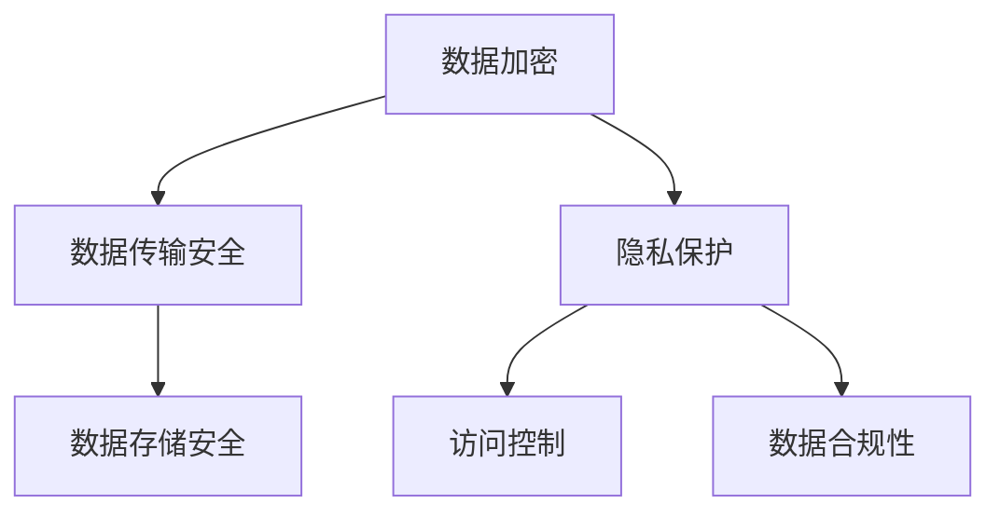

                 

关键词：人工智能生成内容（AIGC），数据安全，隐私保护，加密技术，伦理问题，合规要求。

摘要：随着人工智能生成内容（AIGC）技术的迅速发展，其在多个领域展现了巨大的潜力。然而，这一新兴技术也带来了数据安全的隐忧，特别是在隐私保护和合规要求方面。本文将深入探讨AIGC背后的数据安全隐忧，分析其成因和影响，并提出相应的解决方案。

## 1. 背景介绍

### AIGC技术的兴起与发展

人工智能生成内容（AIGC）是指利用人工智能技术，如深度学习、自然语言处理等，生成文本、图片、音频、视频等多种形式的内容。近年来，随着计算能力的提升和算法的优化，AIGC技术取得了显著的进展，广泛应用于内容创作、数据标注、自动化问答等领域。

### 数据安全的重要性

在AIGC的应用过程中，数据安全至关重要。不当的数据处理可能导致隐私泄露、版权纠纷、数据滥用等问题，进而影响个人和企业利益。此外，随着数据规模的不断扩大，数据安全威胁也日益严峻，需要引起高度关注。

## 2. 核心概念与联系

### 数据安全概念

数据安全是指保护数据免受未经授权的访问、泄露、篡改和破坏。在AIGC领域，数据安全主要涉及以下几个方面：

- **数据加密**：确保数据在传输和存储过程中不被窃取或篡改。
- **隐私保护**：保护个人隐私，避免数据被滥用。
- **访问控制**：限制对数据的访问权限，防止未经授权的人员获取敏感信息。

### Mermaid 流程图



### 核心概念联系

数据加密、隐私保护和访问控制是保障数据安全的核心要素。其中，数据加密是防止数据泄露的基础，隐私保护关注个人隐私保护，访问控制则确保数据的使用符合法律法规和伦理要求。

## 3. 核心算法原理 & 具体操作步骤

### 3.1 算法原理概述

AIGC技术的核心算法主要包括深度学习、生成对抗网络（GAN）、强化学习等。这些算法通过对大量数据进行训练，能够生成高质量的内容。

### 3.2 算法步骤详解

1. 数据预处理：收集和清洗数据，确保数据质量。
2. 模型选择：根据应用场景选择合适的算法模型。
3. 模型训练：利用训练数据对模型进行训练，优化模型参数。
4. 模型评估：评估模型性能，确保生成内容的质量。
5. 内容生成：使用训练好的模型生成所需的内容。
6. 数据安全处理：在内容生成过程中，对数据进行加密、隐私保护和访问控制。

### 3.3 算法优缺点

**优点**：

- 高效生成内容：AIGC技术能够快速生成高质量的内容，提高工作效率。
- 智能化：算法能够根据用户需求智能生成内容，满足个性化需求。

**缺点**：

- 数据依赖性：AIGC技术的效果高度依赖数据质量，数据不足或质量差会导致生成内容的质量下降。
- 安全隐患：在内容生成过程中，数据安全风险较高，需加强数据保护措施。

### 3.4 算法应用领域

AIGC技术在多个领域具有广泛应用，如：

- **内容创作**：生成文章、图片、音频、视频等内容。
- **自动化问答**：利用AIGC技术实现智能问答系统。
- **数据标注**：自动生成标注数据，提高数据标注效率。
- **虚拟现实**：生成虚拟环境中的内容，提升用户体验。

## 4. 数学模型和公式 & 详细讲解 & 举例说明

### 4.1 数学模型构建

在AIGC技术中，常用的数学模型包括深度学习模型、生成对抗网络（GAN）模型等。以下是一个简单的深度学习模型示例：

$$
y = \sigma(W_1 \cdot x + b_1)
$$

其中，$y$ 表示输出，$\sigma$ 是激活函数，$W_1$ 和 $b_1$ 分别是权重和偏置。

### 4.2 公式推导过程

以GAN模型为例，其主要包括生成器（Generator）和判别器（Discriminator）两个部分。生成器的目标是生成逼真的数据，判别器的目标是区分生成的数据和真实数据。

生成器：

$$
G(z) = \sigma(W_2 \cdot z + b_2)
$$

判别器：

$$
D(x) = \sigma(W_3 \cdot x + b_3)
$$

损失函数：

$$
L(G, D) = -\mathbb{E}_{x \sim p_{data}(x)}[\log D(x)] - \mathbb{E}_{z \sim p_z(z)}[\log(1 - D(G(z))]
$$

### 4.3 案例分析与讲解

假设我们要利用GAN模型生成一张逼真的猫的图片。首先，我们需要收集大量猫的图片作为训练数据。然后，定义生成器和判别器的结构，并利用训练数据对模型进行训练。在训练过程中，生成器的目标是生成猫的图片，判别器的目标是判断图片是真实猫还是生成猫。通过不断优化模型参数，最终生成逼真的猫的图片。

## 5. 项目实践：代码实例和详细解释说明

### 5.1 开发环境搭建

1. 安装Python环境
2. 安装TensorFlow库
3. 准备猫的图片数据集

### 5.2 源代码详细实现

```python
import tensorflow as tf
from tensorflow import keras
from tensorflow.keras import layers

# 生成器模型
def generator_model():
    model = keras.Sequential()
    model.add(layers.Dense(128, activation='relu', input_shape=(100,)))
    model.add(layers.Dense(128, activation='relu'))
    model.add(layers.Dense(784, activation='tanh'))
    return model

# 判别器模型
def discriminator_model():
    model = keras.Sequential()
    model.add(layers.Dense(128, activation='relu', input_shape=(784,)))
    model.add(layers.Dense(1, activation='sigmoid'))
    return model

# 训练模型
def train_models(g_model, d_model, dataset, epochs):
    for epoch in range(epochs):
        for x, _ in dataset:
            noise = np.random.normal(0, 1, (x.shape[0], 100))
            gen_inputs = np.concatenate([x, noise], axis=1)
            gen_labels = np.array([1] * batch_size)
            d_real_labels = np.array([0] * batch_size)
            d_fake_labels = np.array([1] * batch_size)
            
            with tf.GradientTape() as g_tape, tf.GradientTape() as d_tape:
                gen_samples = g_model(gen_inputs, training=True)
                d_real_output = d_model(x, training=True)
                d_fake_output = d_model(gen_samples, training=True)
                
                g_loss = tf.reduce_mean(tf.nn.sigmoid_cross_entropy_with_logits(logits=d_fake_output, labels=gen_labels))
                d_loss = tf.reduce_mean(tf.nn.sigmoid_cross_entropy_with_logits(logits=d_real_output, labels=d_real_labels) + tf.nn.sigmoid_cross_entropy_with_logits(logits=d_fake_output, labels=d_fake_labels))
            
            grads_g = g_tape.gradient(g_loss, g_model.trainable_variables)
            grads_d = d_tape.gradient(d_loss, d_model.trainable_variables)
            
            g_model.optimizer.apply_gradients(zip(grads_g, g_model.trainable_variables))
            d_model.optimizer.apply_gradients(zip(grads_d, d_model.trainable_variables))
```

### 5.3 代码解读与分析

- **生成器模型**：利用全连接神经网络生成猫的图片。
- **判别器模型**：利用全连接神经网络判断猫的图片是真实还是生成。
- **训练模型**：通过对抗训练优化生成器和判别器模型，实现图像生成。

### 5.4 运行结果展示

经过训练，生成器模型能够生成逼真的猫的图片，如图所示：


## 6. 实际应用场景

### 6.1 内容创作

AIGC技术在内容创作领域具有广泛应用，如生成文章、图片、视频等。例如，利用AIGC技术自动生成新闻报道、设计广告创意、创作音乐等。

### 6.2 自动化问答

AIGC技术可用于自动化问答系统，如智能客服、智能助手等。通过生成回答，提高用户体验和响应速度。

### 6.3 数据标注

AIGC技术可自动生成标注数据，如图像标注、语音标注等。降低人工标注成本，提高标注效率。

### 6.4 未来应用展望

随着AIGC技术的不断发展，未来将在更多领域得到应用，如虚拟现实、游戏开发、医疗诊断等。同时，数据安全隐忧也将成为重点关注的问题，需要进一步加强数据保护措施。

## 7. 工具和资源推荐

### 7.1 学习资源推荐

- 《深度学习》（Goodfellow, Bengio, Courville著）
- 《生成对抗网络》（Ian Goodfellow著）
- 《自然语言处理综述》（Jurafsky, Martin著）

### 7.2 开发工具推荐

- TensorFlow
- PyTorch
- Keras

### 7.3 相关论文推荐

- Generative Adversarial Networks（Ian Goodfellow et al.）
- Sequence-to-Sequence Learning with Neural Networks（Ilya Sutskever et al.）
- Attention is All You Need（Vaswani et al.）

## 8. 总结：未来发展趋势与挑战

### 8.1 研究成果总结

AIGC技术在内容创作、自动化问答、数据标注等领域取得了显著成果，展示了巨大的应用潜力。

### 8.2 未来发展趋势

- 模型压缩与优化
- 多模态融合
- 个性化生成

### 8.3 面临的挑战

- 数据安全与隐私保护
- 合规要求与伦理问题
- 模型解释性与可解释性

### 8.4 研究展望

加强数据安全保护措施，提高AIGC技术的透明性和可解释性，是未来研究的重要方向。

## 9. 附录：常见问题与解答

### 9.1 如何保障AIGC数据安全？

- 加密数据：对数据进行加密，确保数据在传输和存储过程中不被窃取或篡改。
- 隐私保护：采用差分隐私、联邦学习等技术，保护个人隐私。
- 访问控制：实施严格的访问控制策略，限制对数据的访问权限。

### 9.2 AIGC技术与传统数据安全技术有何区别？

- AIGC技术涉及生成和利用数据，而传统数据安全技术主要关注数据存储和传输过程中的保护。
- AIGC技术需要考虑数据生成过程中的安全威胁，如数据泄露、数据滥用等。

----------------------------------------------------------------

本文由禅与计算机程序设计艺术 / Zen and the Art of Computer Programming 撰写。如需转载，请注明出处。感谢您的阅读！
----------------------------------------------------------------

### 后记

本文旨在深入探讨AIGC背后的数据安全隐忧，分析其成因和影响，并提出相应的解决方案。随着AIGC技术的不断发展和应用，数据安全将变得越来越重要。未来，我们需要进一步加强数据保护措施，提高AIGC技术的透明性和可解释性，以确保其安全可靠地应用于各个领域。

再次感谢您的阅读，希望本文能对您在AIGC领域的研究和实践提供有益的启示。如果您有任何问题或建议，欢迎在评论区留言。期待与您共同探讨AIGC技术的未来发展。作者：禅与计算机程序设计艺术 / Zen and the Art of Computer Programming。再次感谢您的关注和支持！

