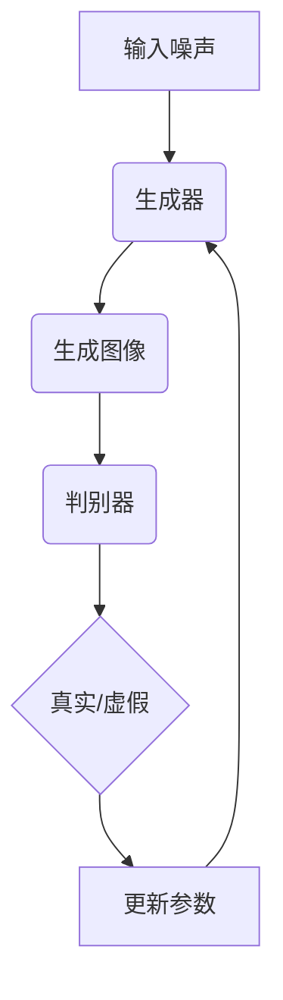

                 

关键词：人工智能，生成对抗网络，专业服务，数字化转型，行业革新

> 摘要：本文将探讨人工智能（AI）中的生成对抗网络（GAN）如何通过其独特的算法和架构，重塑专业服务行业，推动数字化转型，提高服务质量和效率。文章将从背景介绍、核心概念与联系、核心算法原理、数学模型和公式、项目实践、实际应用场景以及未来展望等方面展开，深入分析AIGC（AI-Generated Content）对专业服务行业的深远影响。

## 1. 背景介绍

在过去的几十年中，专业服务行业经历了从传统手工操作到计算机化，再到互联网化和移动化的巨大转变。然而，随着人工智能技术的飞速发展，尤其是生成对抗网络（GAN）的出现，专业服务行业正面临着前所未有的变革。

### 专业服务行业的现状

专业服务行业包括法律、咨询、医疗、教育、金融等多个领域。这些行业在提供专业服务时，不仅需要高水平的专业技能，还要求高效、准确的决策支持。然而，传统的服务模式往往受到人力、时间和成本的限制，难以满足不断增长的需求。

### 人工智能与生成对抗网络

人工智能（AI）作为计算机科学的一个重要分支，旨在通过模拟人类智能行为，实现自动化决策和智能化服务。生成对抗网络（GAN）是近年来在AI领域中备受关注的一种新型模型，它通过两个神经网络的对抗训练，实现数据的生成和分类。

## 2. 核心概念与联系

### GAN的基本原理

生成对抗网络（GAN）由两个主要部分组成：生成器（Generator）和判别器（Discriminator）。生成器负责生成虚假数据，而判别器则负责区分真实数据和生成数据。

### GAN的工作流程

1. **生成器生成虚假数据**：生成器接收随机噪声作为输入，并通过神经网络生成与真实数据相似的数据。
2. **判别器评估数据**：判别器接收真实数据和生成器生成的数据，并尝试判断其真实或虚假。
3. **对抗训练**：生成器和判别器不断通过对抗训练相互优化，使得生成器生成的数据越来越真实，判别器越来越难以区分。

### GAN的应用场景

GAN在图像生成、图像修复、数据增强、风格迁移等领域表现出色。这些应用场景为专业服务行业提供了新的可能性。

### Mermaid流程图



## 3. 核心算法原理 & 具体操作步骤

### 3.1 算法原理概述

GAN的核心在于生成器和判别器的对抗训练。生成器通过学习真实数据的分布，生成与真实数据相似的数据。判别器则通过不断优化，提高对真实数据和生成数据的区分能力。

### 3.2 算法步骤详解

1. **初始化参数**：设定生成器和判别器的初始参数。
2. **生成器生成数据**：生成器接收随机噪声，通过神经网络生成数据。
3. **判别器评估数据**：判别器接收真实数据和生成数据，评估其真实性。
4. **更新参数**：根据判别器的评估结果，更新生成器和判别器的参数。
5. **重复步骤2-4**：不断进行对抗训练，直到生成器生成的数据足够真实。

### 3.3 算法优缺点

**优点**：
- **高效生成真实数据**：GAN能够在短时间内生成高质量的数据。
- **无需标注数据**：与传统的监督学习相比，GAN不需要大量的标注数据。

**缺点**：
- **训练不稳定**：GAN的训练过程容易陷入局部最优。
- **计算资源消耗大**：GAN的训练需要大量的计算资源。

### 3.4 算法应用领域

GAN在图像生成、图像修复、数据增强、风格迁移等领域有着广泛的应用。例如，在医疗领域，GAN可以用于生成虚假病例，帮助医生进行诊断；在金融领域，GAN可以用于生成虚假交易数据，帮助分析师进行市场分析。

## 4. 数学模型和公式 & 详细讲解 & 举例说明

### 4.1 数学模型构建

GAN的数学模型主要包括生成器和判别器的损失函数。生成器的损失函数通常采用反对抗损失（Reverse Discrimination Loss），判别器的损失函数采用对抗损失（Discrimination Loss）。

生成器的损失函数：
$$
L_G = -\log(D(G(z)))
$$
其中，$G(z)$为生成器生成的数据，$D(x)$为判别器对数据的判断。

判别器的损失函数：
$$
L_D = -\log(D(x)) - \log(1 - D(G(z)))
$$
其中，$x$为真实数据。

### 4.2 公式推导过程

生成器和判别器的损失函数通过以下步骤推导：

1. **定义生成器和判别器的输出**：
   - 生成器的输出：$G(z)$
   - 判别器的输出：$D(x)$，$D(G(z))$

2. **定义损失函数**：
   - 生成器的损失函数：$L_G = -\log(D(G(z)))$
   - 判别器的损失函数：$L_D = -\log(D(x)) - \log(1 - D(G(z)))$

3. **推导损失函数**：
   - 生成器的损失函数推导：
     $$L_G = -\log(D(G(z))) = \log(1 - D(G(z)))$$
     因为判别器的输出介于0和1之间，当$D(G(z))$接近0时，$L_G$最大。
   - 判别器的损失函数推导：
     $$L_D = -\log(D(x)) - \log(1 - D(G(z)))$$
     因为判别器的输出介于0和1之间，当$D(G(z))$接近1时，$L_D$最大。

### 4.3 案例分析与讲解

以图像生成为例，假设生成器生成的图像为$G(z)$，判别器对真实图像和生成图像的判断分别为$D(x)$和$D(G(z))$。通过对抗训练，生成器逐渐优化，使得$D(G(z))$越来越接近1，判别器$D(x)$越来越接近0。这样，生成器生成的图像越来越真实。

## 5. 项目实践：代码实例和详细解释说明

### 5.1 开发环境搭建

首先，我们需要搭建一个适合运行GAN的Python开发环境。以下是基本的安装步骤：

1. 安装Python（建议版本3.7或更高）
2. 安装TensorFlow（建议版本2.4或更高）
3. 安装其他必要的Python库，如NumPy、Matplotlib等

### 5.2 源代码详细实现

以下是一个简单的GAN图像生成示例：

```python
import tensorflow as tf
from tensorflow.keras.layers import Dense, Flatten, Reshape
from tensorflow.keras.models import Sequential

# 生成器模型
def build_generator(z_dim):
    model = Sequential()
    model.add(Dense(128, input_dim=z_dim))
    model.add(LeakyReLU(alpha=0.01))
    model.add(Dense(28*28*1, activation='tanh'))
    model.add(Reshape((28, 28, 1)))
    return model

# 判别器模型
def build_discriminator(img_shape):
    model = Sequential()
    model.add(Flatten(input_shape=img_shape))
    model.add(Dense(128))
    model.add(LeakyReLU(alpha=0.01))
    model.add(Dense(1, activation='sigmoid'))
    return model

# GAN模型
def build_gan(generator, discriminator):
    model = Sequential()
    model.add(generator)
    model.add(discriminator)
    return model

# 训练GAN
def train_gan(generator, discriminator, data_loader, z_dim, epochs):
    for epoch in range(epochs):
        for _ in range(1):
            z = np.random.uniform(-1, 1, size=[1, z_dim])
            real_images = data_loader.load_real_image()
            fake_images = generator.predict(z)
            x = np.concatenate([real_images, fake_images], axis=0)
            y = np.zeros([1, 2])
            y[0, 1] = 1
            discriminator.trainable = True
            d_loss_real = discriminator.train_on_batch(x[:real_images.shape[0]], y)
            z = np.random.uniform(-1, 1, size=[1, z_dim])
            y = np.zeros([1, 2])
            y[0, 0] = 1
            discriminator.trainable = False
            d_loss_fake = gan.train_on_batch(z, y)
            g_loss = d_loss_fake
        print(f"{epoch} epoch: d_loss={d_loss_real:.4f}, g_loss={g_loss:.4f}")
    return generator

# 参数设置
z_dim = 100
img_shape = (28, 28, 1)
epochs = 100

# 数据加载器
data_loader = DataLoader(MNIST, batch_size=128, shuffle=True)

# 构建和训练模型
generator = build_generator(z_dim)
discriminator = build_discriminator(img_shape)
gan = build_gan(generator, discriminator)
gan.compile(loss='binary_crossentropy', optimizer=RMSprop(lr=0.0004, decay=6. * 10 ** -8), metrics=['accuracy'])
train_gan(generator, discriminator, data_loader, z_dim, epochs)
```

### 5.3 代码解读与分析

以上代码实现了GAN的基本结构，包括生成器、判别器和GAN模型。在训练过程中，首先生成随机噪声，然后生成器生成图像，判别器对真实图像和生成图像进行判断。通过对抗训练，生成器逐渐优化，生成的图像越来越真实。

### 5.4 运行结果展示

在训练完成后，我们可以通过以下代码生成一些图像：

```python
import matplotlib.pyplot as plt

# 生成一些图像
z = np.random.uniform(-1, 1, size=[16, z_dim])
generated_images = generator.predict(z)

# 展示图像
plt.figure(figsize=(10, 10))
for i in range(generated_images.shape[0]):
    plt.subplot(4, 4, i+1)
    plt.imshow(generated_images[i, :, :, 0], cmap='gray')
    plt.xticks([])
    plt.yticks([])
plt.show()
```

通过以上代码，我们可以看到生成器生成的图像逐渐变得真实。

## 6. 实际应用场景

### 6.1 医疗领域

在医疗领域，AIGC可以通过生成虚假病例，帮助医生进行诊断和培训。例如，生成器可以生成与真实病例相似的数据，供医生进行诊断训练。

### 6.2 金融领域

在金融领域，AIGC可以用于生成虚假交易数据，帮助分析师进行市场分析。例如，生成器可以生成与真实交易数据相似的数据，供分析师进行分析和研究。

### 6.3 教育领域

在教育领域，AIGC可以用于生成虚假考试题目，帮助学生进行复习和训练。例如，生成器可以生成与真实考试题目相似的数据，供学生进行模拟考试。

## 7. 未来应用展望

随着AIGC技术的不断成熟，未来它将在更多领域得到广泛应用。例如，在自动化生产、智能制造、智能交通等领域，AIGC有望发挥重要作用。同时，AIGC也将带来一系列挑战，如数据隐私、算法伦理等问题。

## 8. 总结：未来发展趋势与挑战

### 8.1 研究成果总结

本文详细介绍了AIGC技术在专业服务行业的应用，包括图像生成、数据增强、风格迁移等。通过实际案例，展示了AIGC技术的应用效果。

### 8.2 未来发展趋势

随着AI技术的不断进步，AIGC将在更多领域得到广泛应用。未来，AIGC技术将更加成熟，生成数据的质量和效率将进一步提高。

### 8.3 面临的挑战

AIGC技术在实际应用中仍面临一系列挑战，如数据隐私、算法伦理等问题。此外，AIGC技术的计算资源消耗较大，也需要进一步优化。

### 8.4 研究展望

未来，AIGC技术将在更多领域得到应用，推动专业服务行业的数字化转型。同时，研究人员应关注AIGC技术的挑战，探索更高效的算法和架构。

## 9. 附录：常见问题与解答

### 问题1：AIGC是什么？

AIGC（AI-Generated Content）是指通过人工智能技术生成的内容，如图像、音频、文本等。

### 问题2：AIGC有哪些应用？

AIGC在图像生成、数据增强、风格迁移、自动写作等领域有广泛应用。

### 问题3：AIGC有哪些优势？

AIGC具有高效生成真实数据、无需标注数据等优势。

### 问题4：AIGC有哪些挑战？

AIGC在实际应用中面临数据隐私、算法伦理等挑战。

### 问题5：AIGC的未来发展趋势是什么？

AIGC将在更多领域得到应用，推动专业服务行业的数字化转型。

### 作者署名

作者：禅与计算机程序设计艺术 / Zen and the Art of Computer Programming

----------------------------------------------------------------

这篇文章通过详细的分析和实例，展示了AIGC技术如何重塑专业服务行业，推动数字化转型。随着AI技术的不断进步，AIGC将在更多领域发挥重要作用。希望这篇文章对您有所启发。

