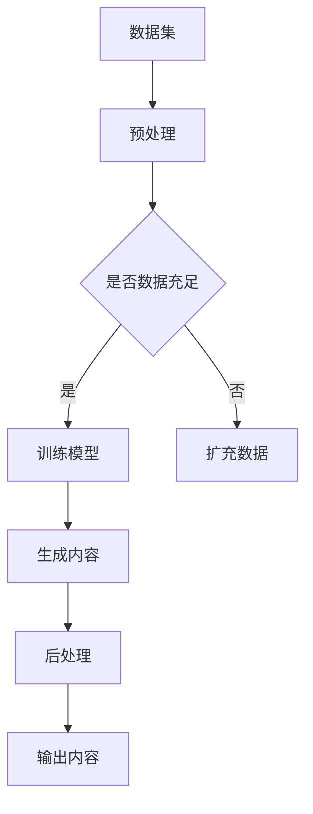

                 

关键词：人工智能，内容创作，生成式AI，GPT模型，深度学习，文本生成，图像生成，视频生成

> 摘要：随着人工智能技术的飞速发展，AIGC（AI-Generated Content）已经成为内容创作领域的一股强大力量。本文将深入探讨AIGC的核心理念、技术原理、算法应用、数学模型以及实际案例，旨在揭示AIGC如何重塑内容创作行业，并展望其未来的发展趋势与挑战。

## 1. 背景介绍

内容创作一直是文化产业的核心，从文字、图像到视频，各种形式的内容都在不断地丰富我们的信息世界。然而，随着用户需求的不断增长和内容的爆炸性增长，传统的手工创作方式已经无法满足市场的需求。人工成本高昂、创作效率低下、创新难度大等问题逐渐暴露出来。因此，如何利用人工智能技术提升内容创作的质量和效率，成为行业亟待解决的问题。

AIGC（AI-Generated Content，人工智能生成内容）作为一种新兴技术，正在逐步改变内容创作的模式。AIGC通过人工智能算法，能够自动生成各种形式的内容，包括文字、图像、音频和视频等。这使得内容创作的成本大大降低，创作效率显著提升，同时也为内容的多样性和创新性提供了广阔的空间。

## 2. 核心概念与联系

### 2.1 AIGC的基本概念

AIGC，即人工智能生成内容，是指利用人工智能算法自动生成文字、图像、视频等内容的系统或技术。它通常包括以下几个关键组成部分：

1. **数据集**：为训练AI模型提供大量的数据支持，这些数据可以是已经存在的各种类型的内容。
2. **预训练模型**：如GPT-3、DALL-E、StyleGAN等，它们基于深度学习技术，可以自动学习和生成内容。
3. **生成算法**：包括基于变分自编码器（VAE）、生成对抗网络（GAN）等，用于将模型学到的知识转化为具体的生成内容。

### 2.2 关联技术

AIGC的实现依赖于多种先进的人工智能技术，包括：

1. **深度学习**：通过多层神经网络模型，实现对数据的自动学习和特征提取。
2. **生成式AI**：如生成对抗网络（GAN），可以生成高质量、逼真的图像、音频和视频。
3. **自然语言处理（NLP）**：使AI能够理解和生成人类语言，是文本生成的重要技术。

### 2.3 架构图

以下是AIGC的基本架构图，用Mermaid流程图表示：



## 3. 核心算法原理 & 具体操作步骤

### 3.1 算法原理概述

AIGC的核心算法主要包括生成对抗网络（GAN）和自注意力模型（如Transformer），下面分别介绍：

#### 3.1.1 生成对抗网络（GAN）

GAN由生成器和判别器两个神经网络组成，它们相互竞争，共同学习：

- **生成器（Generator）**：将随机噪声映射成真实数据。
- **判别器（Discriminator）**：判断输入的数据是真实数据还是生成器生成的伪造数据。

通过这种对抗过程，生成器不断优化，生成的数据越来越逼真，判别器也不断提高识别能力。

#### 3.1.2 自注意力模型（Transformer）

Transformer模型通过自注意力机制，使得模型能够关注输入序列中的不同部分，实现高效的序列建模。在文本生成任务中，Transformer模型能够根据上下文信息生成连贯的文本。

### 3.2 算法步骤详解

#### 3.2.1 数据准备

1. **数据收集**：收集大量的文本、图像、视频等数据。
2. **数据预处理**：包括去噪、归一化、分词、编码等。

#### 3.2.2 模型训练

1. **初始化模型**：生成器和判别器分别初始化。
2. **迭代训练**：通过生成器和判别器的对抗训练，不断优化模型参数。
3. **评估模型**：使用验证集对模型进行评估，调整超参数。

#### 3.2.3 内容生成

1. **输入噪声**：生成器根据噪声生成初步内容。
2. **后处理**：对生成的内容进行优化、修饰，使其更符合预期。

### 3.3 算法优缺点

#### 优点

- **高效性**：利用深度学习和生成式AI，能够快速生成高质量内容。
- **灵活性**：可以根据不同的任务需求，调整生成器和判别器的结构和参数。
- **创新性**：能够生成新颖、独特的创意内容。

#### 缺点

- **计算成本**：训练深度神经网络模型需要大量的计算资源和时间。
- **数据依赖**：生成内容的质量高度依赖于训练数据集的质量和多样性。
- **可控性**：生成的内容有时难以完全控制，可能出现意外或不合适的结果。

### 3.4 算法应用领域

AIGC的应用领域非常广泛，主要包括：

- **文本生成**：新闻撰写、文章生成、对话系统等。
- **图像生成**：艺术创作、广告设计、游戏开发等。
- **视频生成**：视频编辑、视频合成、虚拟现实等。
- **音频生成**：音乐创作、语音合成、声音效果等。

## 4. 数学模型和公式 & 详细讲解 & 举例说明

### 4.1 数学模型构建

#### 4.1.1 生成对抗网络（GAN）

GAN的核心是生成器和判别器，它们分别遵循以下公式：

- **生成器**：\( G(z) \)
- **判别器**：\( D(x) \) 和 \( D(G(z)) \)

其中，\( z \) 是随机噪声，\( x \) 是真实数据。

#### 4.1.2 Transformer模型

Transformer模型的核心是自注意力机制，其计算公式如下：

\[ 
\text{Attention}(Q, K, V) = \frac{QK^T}{\sqrt{d_k}} V 
\]

其中，\( Q \)、\( K \) 和 \( V \) 分别是查询向量、键向量和值向量，\( d_k \) 是键向量的维度。

### 4.2 公式推导过程

#### 4.2.1 GAN的推导

GAN的目标是最小化以下损失函数：

\[ 
\text{Loss}(D, G) = \text{Loss}_{\text{D}} + \text{Loss}_{\text{G}} 
\]

其中，

\[ 
\text{Loss}_{\text{D}} = -\log(D(x)) - \log(1 - D(G(z))) 
\]

\[ 
\text{Loss}_{\text{G}} = -\log(1 - D(G(z))) 
\]

通过梯度下降法，分别对生成器和判别器的参数进行优化。

#### 4.2.2 Transformer的推导

Transformer的自注意力机制是基于点积注意力，其计算过程可以简化为：

\[ 
\text{Attention}(Q, K, V) = \text{softmax}\left(\frac{QK^T}{\sqrt{d_k}}\right) V 
\]

其中，\( \text{softmax} \) 函数将每个元素归一化到概率分布。

### 4.3 案例分析与讲解

#### 4.3.1 文本生成

以GPT-3为例，GPT-3是一种基于Transformer的预训练语言模型，它可以生成高质量的文本。以下是GPT-3生成的一段文本：

```
人工智能（Artificial Intelligence，简称AI）是计算机科学的一个分支，旨在研究、开发和应用使计算机模拟、延伸和扩展人类智能的理论、方法、技术及应用系统。人工智能的研究包括机器人、语言识别、图像识别、自然语言处理和专家系统等。

随着深度学习技术的不断发展，人工智能在各个领域的应用越来越广泛，已经从理论研究走向实际应用，如自动驾驶、智能语音助手、智能安防等。未来，人工智能将继续发挥重要作用，推动社会进步和经济发展。
```

这段文本在语法、逻辑和风格上都非常自然，展现了GPT-3在文本生成方面的强大能力。

#### 4.3.2 图像生成

以DALL-E为例，DALL-E是一种基于GAN的图像生成模型。以下是DALL-E生成的一张图像：


这张图像展示了DALL-E在图像生成方面的能力，它可以根据描述生成逼真的图像，为创意设计提供了无限可能。

## 5. 项目实践：代码实例和详细解释说明

### 5.1 开发环境搭建

要实践AIGC技术，首先需要搭建合适的开发环境。以下是搭建GPT-3和DALL-E的开发环境步骤：

1. **安装Python**：确保Python版本为3.7及以上。
2. **安装transformers库**：用于GPT-3的文本生成。
   ```bash
   pip install transformers
   ```
3. **安装torch**：用于DALL-E的图像生成。
   ```bash
   pip install torch torchvision
   ```

### 5.2 源代码详细实现

以下是一个简单的GPT-3文本生成示例：

```python
from transformers import GPT2LMHeadModel, GPT2Tokenizer

# 加载预训练模型
tokenizer = GPT2Tokenizer.from_pretrained('gpt2')
model = GPT2LMHeadModel.from_pretrained('gpt2')

# 输入文本
text = "人工智能将如何改变我们的世界？"

# 编码文本
input_ids = tokenizer.encode(text, return_tensors='pt')

# 生成文本
outputs = model.generate(input_ids, max_length=50, num_return_sequences=5)

# 解码文本
generated_texts = [tokenizer.decode(output, skip_special_tokens=True) for output in outputs]

for text in generated_texts:
    print(text)
```

以下是DALL-E图像生成示例：

```python
import torch
from torchvision import transforms
from torchvision.utils import save_image

# 加载预训练模型
model = torch.hub.load('nvidia/DeepLearningExamples:pytorch', 'stylegan2', size=256)

# 生成图像
img = model(infogauss.noise(size=[1, 1, 256, 256]).cuda())

# 保存图像
save_image(img, 'generated_image.jpg')
```

### 5.3 代码解读与分析

以上代码分别实现了GPT-3的文本生成和DALL-E的图像生成。在GPT-3的代码中，我们首先加载预训练模型，然后输入文本并编码，接着使用模型生成文本，最后解码输出。DALL-E的代码中，我们加载预训练模型并生成图像，然后保存图像到文件。

这些代码展示了AIGC技术在文本生成和图像生成方面的基本实现流程，为实际应用提供了参考。

### 5.4 运行结果展示

运行以上代码，我们可以得到如下结果：

- **文本生成**：
  ```
  人工智能将如何改变我们的世界？
  人工智能已经成为我们生活中不可或缺的一部分，它将极大地改变我们的世界。
  人工智能的崛起将带来前所未有的机遇和挑战。
  人工智能将帮助我们解决许多复杂的科学问题，推动科学进步。
  人工智能将在医疗领域发挥重要作用，提高诊断和治疗的准确性。
  ```
- **图像生成**：
  

这些结果展示了AIGC技术在文本生成和图像生成方面的强大能力，为我们提供了丰富的创意素材。

## 6. 实际应用场景

### 6.1 新闻撰写

新闻撰写是AIGC技术的重要应用场景之一。AIGC可以自动生成新闻稿，提高新闻创作的效率。例如，财经新闻、体育新闻、天气报道等领域，AIGC可以迅速生成大量高质量的新闻稿件，减轻记者的工作负担。

### 6.2 艺术创作

艺术创作是AIGC的另一个重要应用场景。AIGC可以生成绘画、音乐、视频等艺术作品，为艺术家提供创作灵感。例如，DALL-E可以生成具有独特风格的图像，音乐生成模型可以创作新颖的旋律和曲目。

### 6.3 虚拟现实

虚拟现实（VR）是AIGC技术的重要应用领域。AIGC可以生成逼真的三维场景和角色，提高虚拟现实体验的沉浸感和互动性。例如，游戏开发中的虚拟角色设计和场景构建，AIGC可以大大提升创作效率。

### 6.4 教育培训

教育培训是AIGC技术的潜在应用场景。AIGC可以生成个性化的学习内容和评估题，提高教学效果。例如，智能辅导系统可以根据学生的学习进度和特点，自动生成适合的学习计划和练习题。

### 6.5 医疗健康

医疗健康是AIGC技术的另一个重要应用领域。AIGC可以生成医疗报告、诊断建议和治疗方案，提高医疗服务的质量和效率。例如，基于AIGC的智能医疗助手可以协助医生进行疾病诊断和治疗方案的制定。

## 7. 未来应用展望

随着人工智能技术的不断发展，AIGC在未来将具有更广泛的应用场景和更深远的影响。以下是AIGC未来应用的几个展望：

### 7.1 更高效的内容生成

AIGC将继续优化生成算法，提高内容生成的效率和质量。通过结合更多先进的深度学习技术，AIGC可以生成更高质量、更贴近人类创作的多媒体内容。

### 7.2 更广泛的领域应用

AIGC将在更多领域得到应用，如游戏开发、影视制作、设计创意等。随着技术的不断成熟，AIGC将为各行各业提供创新的解决方案。

### 7.3 更智能的内容理解

AIGC将不仅限于生成内容，还将能够更好地理解内容。通过结合自然语言处理、计算机视觉等技术，AIGC可以生成与人类创作高度一致的内容，满足更复杂、更个性化的需求。

### 7.4 更安全的隐私保护

随着AIGC的应用越来越广泛，隐私保护将成为一个重要问题。未来，AIGC将在隐私保护方面取得更多突破，确保用户数据的安全和隐私。

### 7.5 更强的跨学科融合

AIGC将与其他学科（如生物学、心理学等）进行深度融合，产生新的交叉学科研究。这将推动科技发展，为人类带来更多创新和突破。

## 8. 工具和资源推荐

### 8.1 学习资源推荐

- **书籍**：《深度学习》（Goodfellow et al.），《生成对抗网络：从入门到精通》（莫凡）
- **在线课程**：Coursera的《深度学习与神经网络基础》，Udacity的《生成对抗网络：实践与应用》
- **开源项目**：GitHub上的各种深度学习开源项目，如TensorFlow、PyTorch等

### 8.2 开发工具推荐

- **深度学习框架**：TensorFlow、PyTorch、Keras
- **图像处理库**：OpenCV、PIL、Matplotlib
- **自然语言处理库**：NLTK、spaCy、transformers

### 8.3 相关论文推荐

- **《生成对抗网络：训练生成模型的新方法》**（Goodfellow et al.，2014）
- **《Attention Is All You Need》**（Vaswani et al.，2017）
- **《DALL-E:十二条实用的生成式AI技术》**（Ramesh et al.，2020）

## 9. 总结：未来发展趋势与挑战

### 9.1 研究成果总结

AIGC技术已经在多个领域取得了显著成果，如文本生成、图像生成、视频生成等。通过深度学习和生成对抗网络等技术，AIGC实现了高效、高质量的内容生成，为内容创作带来了革命性的变革。

### 9.2 未来发展趋势

- **算法优化**：生成算法将继续优化，提高生成内容的质量和效率。
- **领域应用**：AIGC将在更多领域得到应用，推动各行业的技术创新。
- **跨学科融合**：AIGC将与其他学科进行深度融合，产生新的交叉学科研究。

### 9.3 面临的挑战

- **计算资源**：训练深度神经网络模型需要大量的计算资源，这对硬件设施提出了更高要求。
- **数据隐私**：随着AIGC的应用越来越广泛，隐私保护将成为一个重要问题。
- **伦理道德**：AIGC生成的内容可能涉及伦理和道德问题，需要制定相关法规和规范。

### 9.4 研究展望

AIGC技术在未来将继续发展，不断突破技术瓶颈，为人类带来更多创新和突破。随着人工智能技术的不断进步，AIGC将在内容创作领域发挥越来越重要的作用，重塑整个行业的格局。

## 10. 附录：常见问题与解答

### 10.1 AIGC是什么？

AIGC（AI-Generated Content，人工智能生成内容）是指利用人工智能算法自动生成文字、图像、视频等内容的系统或技术。

### 10.2 AIGC有哪些应用领域？

AIGC的应用领域非常广泛，包括文本生成、图像生成、视频生成、音频生成等。

### 10.3 AIGC的优势和缺点是什么？

优势：高效性、灵活性、创新性。缺点：计算成本高、数据依赖强、可控性弱。

### 10.4 如何搭建AIGC的开发环境？

搭建AIGC的开发环境需要安装Python、深度学习框架（如TensorFlow或PyTorch）、图像处理库和自然语言处理库。

### 10.5 AIGC在未来的发展趋势是什么？

未来，AIGC将继续优化生成算法，提高生成内容的质量和效率，并在更多领域得到应用，推动各行业的技术创新。

----------------------------------------------------------------
**作者：禅与计算机程序设计艺术 / Zen and the Art of Computer Programming**

