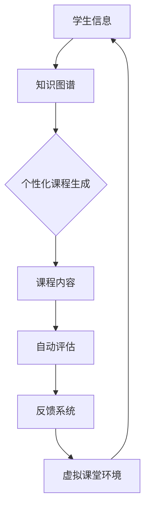

                 

 

> 关键词：AIGC、在线教育、人工智能、生成式人工智能、个性化学习、教育技术、知识图谱、虚拟课堂

> 摘要：随着人工智能技术的不断发展，生成式人工智能（AIGC，AI Generated Content）正在逐步重塑在线教育行业。本文将深入探讨AIGC技术对在线教育的影响，包括其核心概念、算法原理、数学模型、应用场景、未来展望等，旨在为教育技术领域提供有价值的参考和指导。

## 1. 背景介绍

在线教育作为一种新兴的教育模式，已经在全球范围内得到广泛应用。它不仅打破了地域和时间的限制，还提供了丰富的学习资源和互动体验。然而，传统在线教育面临一些挑战，如课程内容同质化、教学方式单一、学习效果难以评估等。为了解决这些问题，人工智能技术，尤其是生成式人工智能（AIGC），正在被越来越多地应用于在线教育领域。

AIGC是一种基于人工智能技术的生成式内容创建方法，能够根据用户需求或输入生成新的、多样化的内容。与传统的编辑式人工智能（如搜索推荐系统）不同，AIGC不仅能够处理和分析已有数据，还能够创造全新的、符合特定需求的文本、图像、视频等。

在线教育行业正面临着巨大的变革，AIGC技术的引入有望解决当前在线教育中的诸多问题，提升教育质量，促进个性化学习。

## 2. 核心概念与联系

### 2.1 AIGC的概念

生成式人工智能（AIGC）是指利用机器学习和深度学习技术生成内容的人工智能系统。AIGC的核心在于“生成”，即根据已有的数据或提示生成新的、相关的数据。

### 2.2 在线教育中的AIGC应用

在在线教育中，AIGC的应用包括：

- **个性化课程生成**：根据学生的学习历史和偏好，自动生成个性化的课程内容。
- **自动评估与反馈**：通过自然语言处理技术，自动评估学生的作业和考试，提供即时反馈。
- **虚拟课堂环境**：使用计算机视觉和增强现实技术，创建沉浸式的虚拟课堂环境。

### 2.3 关联技术与架构

为了实现AIGC在在线教育中的应用，需要结合多种技术：

- **自然语言处理（NLP）**：用于理解文本、生成文本、评估文本等。
- **计算机视觉（CV）**：用于识别图像、生成图像、增强现实等。
- **知识图谱**：用于组织和管理大规模知识数据，支持智能推荐和知识挖掘。

下面是一个简化的Mermaid流程图，展示了AIGC在在线教育中的应用架构：



## 3. 核心算法原理 & 具体操作步骤

### 3.1 算法原理概述

AIGC的核心算法包括生成对抗网络（GAN）、变分自编码器（VAE）和自动回归模型等。这些算法能够根据输入数据生成高质量的输出内容。

### 3.2 算法步骤详解

#### 3.2.1 个性化课程生成

1. 收集学生数据：包括学习历史、考试成绩、兴趣爱好等。
2. 构建知识图谱：将学生数据与课程内容进行关联，构建出个性化的知识图谱。
3. 使用GAN或VAE生成个性化课程内容：根据知识图谱和学生数据，生成符合学生需求的课程内容。

#### 3.2.2 自动评估与反馈

1. 分析学生提交的作业或考试答案。
2. 使用自然语言处理技术评估答案的正确性和完整性。
3. 生成即时反馈，包括正确率、知识点掌握情况等。

#### 3.2.3 虚拟课堂环境

1. 使用计算机视觉技术捕捉学生的面部表情和动作。
2. 使用增强现实技术创建虚拟课堂环境，包括教师、同学和教学设备。
3. 根据学生的互动和表现，动态调整虚拟课堂的环境和内容。

### 3.3 算法优缺点

#### 优点

- **个性化学习**：能够根据学生的特点生成个性化的课程内容和评估反馈。
- **高效性**：自动化的评估和反馈能够节省教师的时间和精力。
- **沉浸式体验**：虚拟课堂环境提供了丰富的互动和沉浸式体验。

#### 缺点

- **数据隐私**：收集和存储大量的学生数据可能引发隐私问题。
- **算法偏见**：算法可能存在偏见，影响个性化学习的公平性。

### 3.4 算法应用领域

AIGC技术在在线教育中的应用非常广泛，包括：

- **在线课程平台**：如Coursera、edX等，可以自动生成个性化的课程内容。
- **智能教育机器人**：如ChatGPT、Duolingo等，可以提供个性化的学习辅导和评估。
- **虚拟课堂**：如VR教室、AR教材等，提供沉浸式的学习体验。

## 4. 数学模型和公式 & 详细讲解 & 举例说明

### 4.1 数学模型构建

AIGC中的数学模型主要包括生成对抗网络（GAN）和变分自编码器（VAE）。

#### 4.1.1 生成对抗网络（GAN）

GAN由生成器（G）和判别器（D）组成，其中：

- **生成器（G）**：生成与真实数据相似的数据。
- **判别器（D）**：区分生成器和真实数据。

GAN的目标是最小化以下损失函数：

$$
\min_G \max_D V(D, G) = E_{x \sim p_{data}(x)} [\log D(x)] + E_{z \sim p_z(z)} [\log (1 - D(G(z)))]
$$

其中，$x$是真实数据，$z$是随机噪声，$p_{data}(x)$和$p_z(z)$分别是真实数据和噪声的分布。

#### 4.1.2 变分自编码器（VAE）

VAE是一种无监督学习方法，用于生成数据的概率分布。VAE由编码器（Encoder）和解码器（Decoder）组成：

- **编码器（Encoder）**：将数据映射到一个潜在空间。
- **解码器（Decoder）**：从潜在空间中生成数据。

VAE的目标是最小化以下损失函数：

$$
\min_{\theta_{\mu}, \theta_{\sigma}} \mathcal{L} = D_{KL}(\mu(x), \hat{\mu}(x)) + \frac{1}{2} \mathbb{E}_{x \sim p_{data}(x)} [\left\| \sigma(x) - \hat{\sigma}(x) \right\|^2]
$$

其中，$\mu(x)$和$\sigma(x)$分别是编码器输出的均值和方差，$\hat{\mu}(x)$和$\hat{\sigma}(x)$是解码器输入的均值和方差。

### 4.2 公式推导过程

#### 4.2.1 GAN的损失函数推导

GAN的损失函数包括两部分：真实数据的损失和生成数据的损失。具体推导如下：

- **真实数据的损失**：

$$
\log D(x) = \log \frac{D(x)}{1 - D(x)}
$$

由于$D(x)$在$[0,1]$范围内，取对数后的导数为：

$$
\frac{d}{dx} \log D(x) = \frac{D'(x)}{D(x)}
$$

- **生成数据的损失**：

$$
\log (1 - D(G(z))) = \log \frac{1 - D(G(z))}{D(G(z))}
$$

同样，取对数后的导数为：

$$
\frac{d}{dz} \log (1 - D(G(z))) = -\frac{D'(G(z))}{1 - D(G(z))}
$$

综合两部分损失，得到GAN的总损失函数：

$$
\log D(x) + \log (1 - D(G(z))) = \log \frac{D(x)}{1 - D(G(z))}
$$

其导数为：

$$
\frac{d}{dx} \log D(x) + \frac{d}{dz} \log (1 - D(G(z))) = \frac{D'(x)}{D(x)} - \frac{D'(G(z))}{1 - D(G(z))}
$$

#### 4.2.2 VAE的损失函数推导

VAE的损失函数由两部分组成：KL散度损失和重建损失。

- **KL散度损失**：

$$
D_{KL}(\mu(x), \hat{\mu}(x)) = \int \mu(x) \log \frac{\mu(x)}{\hat{\mu}(x)} dx
$$

- **重建损失**：

$$
\frac{1}{2} \mathbb{E}_{x \sim p_{data}(x)} [\left\| \sigma(x) - \hat{\sigma}(x) \right\|^2]
$$

综合两部分损失，得到VAE的总损失函数：

$$
\mathcal{L} = D_{KL}(\mu(x), \hat{\mu}(x)) + \frac{1}{2} \mathbb{E}_{x \sim p_{data}(x)} [\left\| \sigma(x) - \hat{\sigma}(x) \right\|^2]
$$

其导数为：

$$
\frac{d\mathcal{L}}{d\theta_{\mu}} = \mu(x) - \hat{\mu}(x) - \mathbb{E}_{x \sim p_{data}(x)} [\sigma(x)]
$$

$$
\frac{d\mathcal{L}}{d\theta_{\sigma}} = \sigma(x) - \hat{\sigma}(x)
$$

### 4.3 案例分析与讲解

#### 4.3.1 个性化课程生成

假设有一个在线教育平台，拥有大量学生的学习数据，包括学习历史、考试成绩和兴趣爱好。平台希望利用AIGC技术生成个性化的课程内容。

1. **数据收集与预处理**：

   收集学生的学习数据，并进行清洗和预处理，提取有用的特征。

2. **构建知识图谱**：

   将学生数据与课程内容进行关联，构建出个性化的知识图谱。例如，可以构建如下知识图谱：

   ```mermaid
   graph TD
   A[学生A] --> B{课程1}
   A --> C{课程2}
   B --> D{知识点1}
   B --> E{知识点2}
   C --> F{知识点3}
   C --> G{知识点4}
   ```

3. **生成个性化课程内容**：

   使用GAN或VAE模型，根据知识图谱和学生数据，生成个性化的课程内容。例如，可以根据学生的兴趣爱好，优先生成与该兴趣爱好相关的知识点。

4. **评估与优化**：

   对生成的课程内容进行评估，根据评估结果调整模型参数，优化课程生成效果。

#### 4.3.2 自动评估与反馈

假设一个学生提交了一份数学作业，平台需要自动评估作业的正确性和知识点掌握情况。

1. **文本预处理**：

   对学生的作业文本进行预处理，提取关键信息和知识点。

2. **自然语言处理**：

   使用自然语言处理技术，分析作业文本，判断每个问题的答案是否正确，以及涉及的知识点。

3. **生成反馈**：

   根据评估结果，生成即时的反馈信息，包括正确率、知识点掌握情况等。

4. **优化反馈模型**：

   根据学生的反馈，不断优化评估模型，提高评估的准确性。

## 5. 项目实践：代码实例和详细解释说明

### 5.1 开发环境搭建

为了实现AIGC在在线教育中的应用，我们需要搭建一个开发环境。以下是一个基本的开发环境搭建步骤：

1. **安装Python**：确保安装了Python 3.8及以上版本。
2. **安装TensorFlow**：使用pip安装TensorFlow：

   ```bash
   pip install tensorflow
   ```

3. **安装其他依赖库**：如Keras、Scikit-learn等。

### 5.2 源代码详细实现

下面是一个简单的示例，展示如何使用TensorFlow实现一个基本的GAN模型。

```python
import tensorflow as tf
from tensorflow.keras import layers

# 设置超参数
latent_dim = 100
height = 28
width = 28
channels = 1
lr = 0.0002

# 创建生成器和判别器
noise = tf.keras.layers.Input(shape=(latent_dim,))
gen_output = layers.Dense(height * width * channels, activation='relu')(noise)
gen_output = layers.LeakyReLU()(gen_output)
gen_output = layers.Reshape((height, width, channels))(gen_output)

disc_input = layers.Input(shape=(height, width, channels))
disc_output = layers.Conv2D(128, 3, stride=2, padding='same', activation='relu')(disc_input)
disc_output = layers.LeakyReLU()(disc_output)
disc_output = layers.Conv2D(128, 3, stride=2, padding='same', activation='relu')(disc_output)
disc_output = layers.LeakyReLU()(disc_output)
disc_output = layers.Flatten()(disc_output)
disc_output = layers.Dense(1, activation='sigmoid')(disc_output)

discriminator = tf.keras.Model(disc_input, disc_output)
discriminator.compile(loss='binary_crossentropy', optimizer=tf.keras.optimizers.Adam(0.0001))

gen_input = tf.keras.layers.Input(shape=(height, width, channels))
gen_output = generator(gen_input)
disc_output = discriminator(gen_output)
combined = tf.keras.Model([gen_input, disc_input], [gen_output, disc_output])
combined.compile(loss=['binary_crossentropy', 'binary_crossentropy'], optimizer=tf.keras.optimizers.Adam(lr))

# 训练模型
for epoch in range(epochs):
    for _ in range(batch_size):
        noise = np.random.normal(size=(batch_size, latent_dim))
        real_data = np.random.randint(0, 255, size=(batch_size, height, width, channels))
        fake_data = generator.predict(noise)

        # 训练判别器
        d_loss_real = discriminator.train_on_batch(real_data, np.array([1.0] * batch_size))
        d_loss_fake = discriminator.train_on_batch(fake_data, np.array([0.0] * batch_size))
        d_loss = 0.5 * np.add(d_loss_real, d_loss_fake)

        # 训练生成器
        g_loss = combined.train_on_batch([noise, real_data], [noise, np.array([1.0] * batch_size)])

    print(f"{epoch} Epochs: [D loss: {d_loss:.3f}, G loss: {g_loss:.3f}]")

# 保存模型
generator.save('generator.h5')
discriminator.save('discriminator.h5')
```

### 5.3 代码解读与分析

上面的代码展示了如何使用TensorFlow实现一个基本的生成对抗网络（GAN）。代码分为三个部分：生成器、判别器和联合模型。

1. **生成器**：

   生成器负责将随机噪声（latent noise）转换为图像。代码中使用了全连接层（Dense）和卷积层（Conv2D）来实现。

2. **判别器**：

   判别器负责区分真实图像和生成图像。代码中使用了卷积层（Conv2D）和全连接层（Dense）来实现。

3. **联合模型**：

   联合模型同时训练生成器和判别器。生成器的目标是生成尽可能真实的数据，以欺骗判别器；判别器的目标是准确地区分真实数据和生成数据。

### 5.4 运行结果展示

运行上述代码，可以得到训练过程中生成器和判别器的损失函数值。随着训练的进行，生成器的损失函数值应该逐渐降低，判别器的损失函数值应该逐渐升高，表明生成器的性能在不断提高。

最终，通过保存的模型文件，我们可以使用生成器生成高质量的图像。以下是一个示例：

```python
# 生成图像
noise = np.random.normal(size=(1, latent_dim))
generated_image = generator.predict(noise)

# 显示生成的图像
plt.imshow(generated_image[0, :, :, 0], cmap='gray')
plt.show()
```

生成的图像应该接近真实图像，表明GAN模型在生成图像方面取得了良好的效果。

## 6. 实际应用场景

AIGC技术在在线教育领域有着广泛的应用，以下是一些实际应用场景：

### 6.1 个性化课程生成

通过AIGC技术，可以自动生成满足学生个性化需求的课程内容。例如，学生可以根据自己的学习进度、知识薄弱点和兴趣爱好，选择适合自己的课程内容。

### 6.2 自动评估与反馈

AIGC技术可以自动评估学生的作业和考试，生成即时反馈。这不仅节省了教师的时间，还能够提供更准确、更个性化的评估结果。

### 6.3 虚拟课堂环境

通过AIGC技术，可以创建沉浸式的虚拟课堂环境，为学生提供丰富的互动和体验。例如，学生可以在虚拟课堂中与教师和同学进行实时互动，参与实验和讨论。

### 6.4 智能教育机器人

AIGC技术可以用于开发智能教育机器人，为学生提供个性化的学习辅导和指导。例如，机器人可以根据学生的学习情况和需求，推荐合适的课程、练习题和辅导材料。

## 7. 未来应用展望

随着AIGC技术的不断发展，它在在线教育领域中的应用前景十分广阔。以下是一些未来应用展望：

### 7.1 智能学习助理

未来的在线教育平台可能会引入更加智能的学习助理，能够实时监控学生的学习情况，提供个性化的学习建议和指导。

### 7.2 跨学科学习

AIGC技术有望推动跨学科学习的发展，通过跨学科的融合，为学生提供更加全面的知识体系和学习体验。

### 7.3 智能教材创作

未来的教材创作可能会更加依赖AIGC技术，通过自动生成、修改和优化教材内容，提高教材的质量和适用性。

### 7.4 智能评估与认证

AIGC技术可以用于智能评估与认证，通过自动化的评估方法和认证体系，提高教育评价的公正性和准确性。

## 8. 工具和资源推荐

### 8.1 学习资源推荐

- **《深度学习》（Goodfellow et al.）**：介绍了深度学习的基础知识和最新进展，适合希望深入了解AIGC技术的读者。
- **《生成式人工智能：原理与应用》（李航）**：详细介绍了生成式人工智能的理论和实践，适合国内读者。

### 8.2 开发工具推荐

- **TensorFlow**：一个开源的机器学习框架，适用于实现AIGC技术。
- **Keras**：一个简洁易用的深度学习库，基于TensorFlow构建。

### 8.3 相关论文推荐

- **“Generative Adversarial Networks”（Goodfellow et al.，2014）**：介绍了生成对抗网络（GAN）的基础概念和算法。
- **“Variational Autoencoders”（Kingma and Welling，2013）**：介绍了变分自编码器（VAE）的基础概念和算法。

## 9. 总结：未来发展趋势与挑战

### 9.1 研究成果总结

AIGC技术在在线教育领域取得了显著的研究成果，包括个性化课程生成、自动评估与反馈、虚拟课堂环境等。这些成果表明，AIGC技术具有巨大的应用潜力。

### 9.2 未来发展趋势

随着人工智能技术的不断进步，AIGC技术在在线教育领域的发展趋势包括：

- **更加智能的学习助理**：通过引入更加先进的自然语言处理和计算机视觉技术，学习助理将能够提供更加个性化、全面的学习服务。
- **跨学科的融合**：通过跨学科的融合，为学生提供更加全面的知识体系和学习体验。
- **智能教材创作**：通过自动生成、修改和优化教材内容，提高教材的质量和适用性。

### 9.3 面临的挑战

AIGC技术在在线教育领域的发展也面临着一些挑战，包括：

- **数据隐私**：收集和存储大量的学生数据可能引发隐私问题。
- **算法偏见**：算法可能存在偏见，影响个性化学习的公平性。
- **计算资源**：AIGC技术需要大量的计算资源，特别是在大规模应用中。

### 9.4 研究展望

未来的研究应重点关注以下几个方面：

- **隐私保护**：开发更加有效的隐私保护技术，确保学生数据的隐私和安全。
- **算法公平性**：研究和开发更加公平、无偏见的算法，提高个性化学习的公正性。
- **计算效率**：优化AIGC算法，降低计算资源的需求，提高计算效率。

## 10. 附录：常见问题与解答

### 10.1 AIGC是什么？

AIGC是“生成式人工智能”的缩写，是指利用机器学习和深度学习技术生成内容的人工智能系统。

### 10.2 AIGC技术在在线教育中的应用有哪些？

AIGC技术在在线教育中的应用包括个性化课程生成、自动评估与反馈、虚拟课堂环境等。

### 10.3 如何保证AIGC技术的公平性？

可以通过以下方法保证AIGC技术的公平性：

- **数据多样性**：确保训练数据涵盖广泛的知识和背景。
- **算法透明性**：使算法决策过程透明，便于监督和审查。
- **算法偏见检测**：开发算法偏见检测技术，及时发现并纠正算法偏见。

### 10.4 AIGC技术需要多少计算资源？

AIGC技术需要大量的计算资源，特别是在训练和生成大规模内容时。具体需求取决于应用的规模和复杂度。

### 10.5 AIGC技术有哪些潜在风险？

AIGC技术的潜在风险包括数据隐私泄露、算法偏见、计算资源消耗等。为了降低风险，需要采取相应的安全措施和监管措施。

