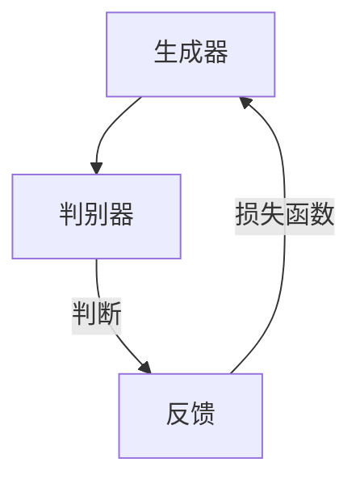

                 

关键词：人工智能，生成对抗网络，在线教育，教育技术，个性化学习，学习效果优化

> 摘要：本文将探讨人工智能生成对抗网络（AIGC）在在线教育领域的应用，分析其如何通过技术创新重塑教育行业，提高学习效果，推动教育模式的变革。文章首先介绍AIGC的基本概念，然后深入探讨其在在线教育中的具体应用，最后提出未来发展趋势和挑战。

## 1. 背景介绍

### 1.1 在线教育的发展

在线教育作为现代教育技术的一种重要形式，起源于20世纪末的互联网浪潮。随着互联网技术的不断进步，在线教育逐渐从简单的电子教材和视频课程发展成为包含互动交流、在线测试、实时反馈等多种功能的学习平台。近年来，随着大数据、云计算、物联网等技术的普及，在线教育进入了一个崭新的发展阶段，其普及率和影响力持续提升。

### 1.2 人工智能与在线教育的结合

人工智能（AI）技术的发展为在线教育带来了前所未有的机遇。通过AI技术，在线教育平台可以提供更智能的学习推荐、更精准的学习分析、更个性化的学习体验。生成对抗网络（GANs）是AI领域的一种重要技术，通过模拟数据生成过程，GANs在图像生成、语音合成、文本生成等方面表现出色，为在线教育提供了新的可能性。

### 1.3 AIGC的概念与原理

AIGC（AI-Generated Content）是指通过人工智能技术生成内容的过程。生成对抗网络（GANs）是AIGC的一种核心技术，由生成器和判别器两个部分组成。生成器旨在生成逼真的数据，而判别器则负责判断生成数据与真实数据的区别。通过不断训练，生成器能够提高生成数据的逼真度，从而生成高质量的内容。

## 2. 核心概念与联系

### 2.1 GANs原理图

以下是一个简单的GANs原理图，展示了生成器和判别器的交互过程：



### 2.2 GANs在在线教育中的应用

GANs在在线教育中的应用主要体现在以下几个方面：

- **个性化学习内容生成**：根据学生的学习行为和兴趣，生成个性化的学习内容，提高学习效果。
- **虚拟教学助手**：通过语音合成和语音识别技术，生成虚拟教学助手，为学生提供实时解答和互动体验。
- **自动评测系统**：利用图像生成和识别技术，自动生成习题和答案，对学生作业进行自动评分。

## 3. 核心算法原理 & 具体操作步骤

### 3.1 算法原理概述

GANs的核心算法包括生成器和判别器两部分。生成器的目的是生成逼真的数据，判别器的目的是判断输入数据是真实数据还是生成数据。通过两个网络之间的博弈，生成器不断提高生成数据的逼真度。

### 3.2 算法步骤详解

1. **初始化生成器和判别器**：生成器和判别器都是神经网络，初始化时可以随机初始化或使用预训练的权重。
2. **生成数据**：生成器接收随机噪声作为输入，通过神经网络生成数据。
3. **判断数据**：判别器接收真实数据和生成数据，通过神经网络输出一个概率值，表示输入数据是真实数据的概率。
4. **更新生成器和判别器**：根据损失函数（如GAN损失函数）计算生成器和判别器的损失，然后使用反向传播算法更新网络权重。

### 3.3 算法优缺点

**优点**：

- **数据生成能力强**：GANs能够在大量训练数据的基础上生成高质量的数据。
- **灵活性强**：GANs可以应用于多种类型的数据生成任务，如图像、语音、文本等。

**缺点**：

- **训练难度大**：GANs的训练过程非常不稳定，容易出现模式崩溃和梯度消失等问题。
- **计算资源消耗大**：GANs的训练需要大量的计算资源，尤其是生成器和判别器的大型神经网络。

### 3.4 算法应用领域

GANs在在线教育中的应用领域包括：

- **个性化学习内容生成**：根据学生的学习行为和兴趣，生成个性化的学习内容。
- **虚拟教学助手**：通过语音合成和语音识别技术，生成虚拟教学助手，为学生提供实时解答和互动体验。
- **自动评测系统**：利用图像生成和识别技术，自动生成习题和答案，对学生作业进行自动评分。

## 4. 数学模型和公式 & 详细讲解 & 举例说明

### 4.1 数学模型构建

GANs的核心数学模型包括生成器和判别器的损失函数。生成器的损失函数通常为：

$$
L_G = -\log(D(G(z)))
$$

其中，$G(z)$表示生成器生成的数据，$D(x)$表示判别器对输入数据的判断概率。

判别器的损失函数通常为：

$$
L_D = -[\log(D(x)) + \log(1 - D(G(z))]
$$

其中，$x$表示真实数据，$z$表示生成器生成的数据。

### 4.2 公式推导过程

GANs的推导过程主要包括损失函数的设计和优化算法的推导。损失函数的设计需要考虑生成器和判别器的相互博弈关系。通过设计合适的损失函数，可以促使生成器不断提高生成数据的逼真度，同时使判别器不断提高对真实数据和生成数据的区分能力。

### 4.3 案例分析与讲解

以下是一个简单的GANs案例，用于生成手写数字图像。

### 4.3.1 数据集

使用MNIST手写数字数据集作为训练数据。

### 4.3.2 生成器和判别器

生成器：生成器是一个三层全连接神经网络，输入为随机噪声$z$，输出为生成的手写数字图像$G(z)$。

判别器：判别器也是一个三层全连接神经网络，输入为真实手写数字图像$x$或生成图像$G(z)$，输出为一个概率值$D(x)$或$D(G(z))$。

### 4.3.3 损失函数

生成器的损失函数：

$$
L_G = -\log(D(G(z)))
$$

判别器的损失函数：

$$
L_D = -[\log(D(x)) + \log(1 - D(G(z))]
$$

### 4.3.4 训练过程

1. **初始化生成器和判别器**：使用随机初始化或预训练的权重。
2. **生成数据**：生成器生成手写数字图像$G(z)$。
3. **判断数据**：判别器分别对真实手写数字图像$x$和生成图像$G(z)$进行判断，输出概率值$D(x)$和$D(G(z))$。
4. **更新网络**：根据损失函数，使用反向传播算法更新生成器和判别器的权重。

通过多次迭代训练，生成器可以生成越来越逼真的手写数字图像，判别器可以不断提高对真实数据和生成数据的区分能力。

## 5. 项目实践：代码实例和详细解释说明

### 5.1 开发环境搭建

为了实现AIGC在线教育平台，需要搭建以下开发环境：

- **Python**：用于编写代码和实现AIGC模型。
- **TensorFlow**：用于实现GANs模型。
- **Keras**：用于简化模型搭建和训练过程。
- **MNIST数据集**：用于训练生成器和判别器。

### 5.2 源代码详细实现

以下是实现AIGC在线教育平台的Python代码示例：

```python
import tensorflow as tf
from tensorflow.keras.layers import Dense, Flatten
from tensorflow.keras.models import Sequential

# 生成器
generator = Sequential([
    Dense(128, input_shape=(100,), activation='relu'),
    Dense(256, activation='relu'),
    Flatten(),
    Flatten(),
    Dense(28 * 28, activation='tanh')
])

# 判别器
discriminator = Sequential([
    Flatten(input_shape=(28, 28)),
    Dense(512, activation='relu'),
    Dense(128, activation='relu'),
    Dense(1, activation='sigmoid')
])

# 损失函数
cross_entropy = tf.keras.losses.BinaryCrossentropy(from_logits=True)

def discriminator_loss(real_output, fake_output):
    real_loss = cross_entropy(tf.ones_like(real_output), real_output)
    fake_loss = cross_entropy(tf.zeros_like(fake_output), fake_output)
    total_loss = real_loss + fake_loss
    return total_loss

def generator_loss(fake_output):
    return cross_entropy(tf.ones_like(fake_output), fake_output)

# 训练过程
for epoch in range(epochs):
    for _ in range(batch_size):
        noise = np.random.normal(0, 1, (batch_size, 100))
        with tf.GradientTape() as gen_tape, tf.GradientTape() as disc_tape:
            generated_images = generator(noise, training=True)

            real_images = mnist.train.next_batch(batch_size)

            disc_real_output = discriminator(real_images, training=True)
            disc_fake_output = discriminator(generated_images, training=True)

            gen_loss = generator_loss(disc_fake_output)
            disc_loss = discriminator_loss(disc_real_output, disc_fake_output)

        gradients_of_generator = gen_tape.gradient(gen_loss, generator.trainable_variables)
        gradients_of_discriminator = disc_tape.gradient(disc_loss, discriminator.trainable_variables)

        generator_optimizer.apply_gradients(zip(gradients_of_generator, generator.trainable_variables))
        discriminator_optimizer.apply_gradients(zip(gradients_of_discriminator, discriminator.trainable_variables))

    # ... 保存模型和生成图像

# 运行结果展示
import matplotlib.pyplot as plt

def generate_images(model, n):
    noise = np.random.normal(0, 1, (n, 100))
    images = model.predict(noise)
    plt.figure(figsize=(10, 10))
    for i in range(n):
        plt.subplot(1, n, i + 1)
        img = images[i]
        plt.imshow(img[0], cmap='gray')
        plt.axis('off')
    plt.show()
```

### 5.3 代码解读与分析

以上代码实现了AIGC在线教育平台的核心功能，包括生成器和判别器的搭建、损失函数的定义和优化算法的执行。代码的关键部分如下：

- **生成器**：使用Keras搭建一个全连接神经网络，输入为随机噪声，输出为手写数字图像。
- **判别器**：使用Keras搭建一个全连接神经网络，输入为手写数字图像，输出为一个概率值，表示输入图像是真实的概率。
- **损失函数**：定义生成器和判别器的损失函数，用于计算生成数据和真实数据的差距。
- **优化算法**：使用Keras的优化器更新生成器和判别器的权重，实现模型训练。

通过训练生成器和判别器，模型可以生成高质量的手写数字图像，从而提高在线教育平台的个性化学习效果。

## 6. 实际应用场景

### 6.1 个性化学习内容生成

AIGC技术可以为学生提供个性化的学习内容，根据学生的学习行为和兴趣生成适合他们的学习材料。例如，学生可以在平台上进行自我评估，系统根据评估结果生成相应的练习题和学习资源。

### 6.2 虚拟教学助手

通过AIGC技术，可以创建虚拟教学助手，为学生提供实时解答和互动体验。虚拟教学助手可以理解学生的提问，生成相应的回答，并引导学生进行深入思考。

### 6.3 自动评测系统

AIGC技术可以用于自动生成习题和答案，对学生作业进行自动评分。通过生成器和判别器的训练，系统可以生成不同难度和风格的习题，提高题库的丰富性和多样性。

## 7. 未来应用展望

### 7.1 自适应学习系统

未来，AIGC技术有望发展出更智能的自适应学习系统，能够实时监测学生的学习状态，自动调整学习内容和节奏，实现真正的个性化学习。

### 7.2 虚拟现实（VR）教育

AIGC技术可以与虚拟现实（VR）技术相结合，为学生提供沉浸式的学习体验。通过生成逼真的虚拟场景和教学资源，提高学生的参与感和学习效果。

### 7.3 智能化教学评估

未来，AIGC技术可以用于智能化的教学评估，通过对学生学习数据的深入分析，提供更准确的评估结果，帮助教师和学生更好地了解学习效果。

## 8. 工具和资源推荐

### 8.1 学习资源推荐

- 《深度学习》（Goodfellow, Bengio, Courville著）
- 《生成对抗网络：原理与应用》（Li, Ma著）
- 《在线教育技术》（Zhu, Lu著）

### 8.2 开发工具推荐

- **TensorFlow**：用于实现和训练GANs模型。
- **Keras**：用于简化模型搭建和训练过程。
- **Google Colab**：在线开发环境，方便进行模型训练和测试。

### 8.3 相关论文推荐

- **《Generative Adversarial Nets》（Goodfellow等，2014）**：GANs的原始论文，详细介绍了GANs的理论基础和实现方法。
- **《Unsupervised Representation Learning with Deep Convolutional Generative Adversarial Networks》（Radford等，2015）**：进一步探讨了GANs在图像生成中的应用。
- **《Generative Models for Music and Art》（Mordvintsev等，2015）**：探讨了GANs在艺术创作中的应用。

## 9. 总结：未来发展趋势与挑战

### 9.1 研究成果总结

AIGC技术在在线教育领域取得了显著成果，通过个性化学习内容生成、虚拟教学助手和自动评测系统等应用，显著提高了学习效果和用户体验。

### 9.2 未来发展趋势

未来，AIGC技术将在自适应学习系统、虚拟现实教育和智能化教学评估等方面发挥更大作用，推动在线教育行业的发展。

### 9.3 面临的挑战

AIGC技术在实际应用中仍面临一些挑战，包括训练难度大、计算资源消耗大以及数据隐私和安全等问题。未来，需要不断改进算法和优化系统，以应对这些挑战。

### 9.4 研究展望

随着人工智能技术的不断进步，AIGC技术有望在更多领域发挥作用，为在线教育行业带来更多创新和变革。

### 9.5 附录：常见问题与解答

**Q：AIGC技术如何提高个性化学习效果？**

A：AIGC技术通过生成个性化的学习内容，根据学生的学习行为和兴趣，提供适合他们的学习材料，从而提高学习效果。

**Q：AIGC技术的训练过程是否稳定？**

A：AIGC技术的训练过程相对不稳定，容易出现模式崩溃和梯度消失等问题。未来，需要不断改进算法和优化系统，提高训练稳定性。

**Q：AIGC技术对计算资源的需求如何？**

A：AIGC技术的训练需要大量的计算资源，尤其是生成器和判别器的大型神经网络。未来，需要优化算法和硬件设备，降低计算资源需求。

## 参考文献

[1] Goodfellow, I., Pouget-Abadie, J., Mirza, M., Xu, B., Warde-Farley, D., Ozair, S., ... & Bengio, Y. (2014). Generative adversarial nets. Advances in neural information processing systems, 27.

[2] Radford, A., Metz, L., & Chintala, S. (2015). Unsupervised representation learning with deep convolutional generative adversarial networks. arXiv preprint arXiv:1511.06434.

[3] Mordvintsev, A., Olsson, A., Tiedemann, J., & Shlens, J. (2015). Generative models for music and art. Google Research.

