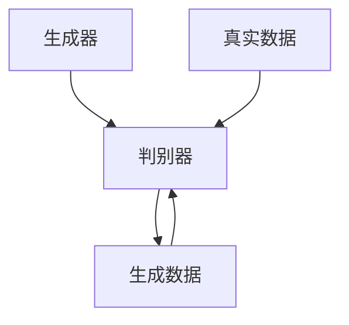

                 

在数字化浪潮席卷全球的今天，人工智能（AI）已成为推动各行业进步的重要引擎。从金融到医疗，从零售到制造，AI的应用场景不断拓展，其中，旅游出行业也在经历一场由人工智能驱动的深刻变革。本文将重点探讨一种新兴的人工智能技术——生成对抗网络（GAN）在旅游出行业中的应用，如何通过AIGC（AI Generated Content）技术重塑旅游出行业。

## 关键词

- 人工智能（AI）
- 生成对抗网络（GAN）
- 旅游出行业
- AIGC技术
- 数字化变革

## 摘要

本文旨在探讨生成对抗网络（GAN）技术在旅游出行业中的应用，特别是通过AIGC（AI Generated Content）如何重塑旅游出行业。首先，我们将回顾AI和GAN的基本概念，随后分析GAN在旅游出行业中的实际应用场景。通过具体的案例研究，我们将展示GAN技术如何提高旅游出行业的服务质量、优化用户体验。最后，本文将讨论AIGC技术的未来发展趋势，并提出可能面临的挑战。

### 1. 背景介绍

#### 1.1 人工智能在旅游出行业中的应用

人工智能技术已经在旅游出行业引发了一场变革。从航班预订、酒店预订到个性化推荐、智能导游，AI的应用大大提高了旅游行业的效率。例如，通过机器学习算法，航空公司能够更准确地预测机票需求，从而优化航班安排，降低运营成本。同时，智能推荐系统可以根据旅客的历史记录和偏好，提供个性化的旅游路线和活动建议，增强旅客的体验。

#### 1.2 生成对抗网络（GAN）的基本概念

生成对抗网络（GAN）是由伊恩·古德费洛（Ian Goodfellow）等人在2014年提出的一种深度学习模型。GAN由两个神经网络——生成器（Generator）和判别器（Discriminator）组成，两者相互对抗。生成器的任务是生成看起来真实的数据，而判别器的任务是区分生成的数据和真实数据。通过这种对抗过程，生成器不断优化其生成数据的能力，最终能够生成高质量、高真实度的图像、文本或其他类型的数据。

#### 1.3 AIGC技术在旅游出行业中的潜力

AIGC技术通过AI生成内容，具有极大的创新潜力。在旅游出行业，AIGC可以用于创建个性化的旅游体验，例如根据旅客的兴趣和偏好生成定制化的旅游路线、活动推荐和视觉内容。此外，AIGC技术还可以用于改善旅游宣传，通过生成逼真的虚拟旅游体验，吸引更多的潜在客户。

### 2. 核心概念与联系

#### 2.1 AI与GAN的关系

人工智能（AI）是计算机科学的一个分支，专注于开发使计算机能够执行复杂任务的技术。而生成对抗网络（GAN）是AI领域的一种具体实现，利用深度学习技术来训练模型，通过对抗生成器与判别器的博弈，实现数据的生成和识别。

下面是GAN的基本架构的Mermaid流程图：



在这个流程图中，A代表生成器，B代表判别器，C是真实数据，D是生成器生成的数据。生成器和判别器通过对抗训练，使得生成器生成的数据越来越接近真实数据，而判别器越来越难以区分生成数据与真实数据。

### 3. 核心算法原理 & 具体操作步骤

#### 3.1 算法原理概述

生成对抗网络（GAN）的核心思想是通过一个生成器（Generator）和一个判别器（Discriminator）之间的对抗训练，生成高质量的数据。生成器G的目的是生成逼真的数据，而判别器D的任务是区分输入的数据是真实的还是生成的。训练过程中，生成器与判别器相互竞争，生成器的目标是尽可能让判别器认为生成的数据是真实的，而判别器的目标是尽可能准确地区分真实数据和生成数据。

GAN的训练过程可以总结为以下步骤：

1. **初始化生成器和判别器**：随机初始化生成器G和判别器D的权重。
2. **生成器训练**：生成器G接收一个随机噪声向量z，并生成一组伪数据G(z)。生成器的目标是使这些伪数据尽可能接近真实数据。
3. **判别器训练**：判别器D接收真实数据x和生成器生成的伪数据G(z)，并输出一个概率值D(x)和D(G(z))，表示数据是真实还是生成的。判别器的目标是使D(x)尽可能接近1（真实数据），而D(G(z))尽可能接近0（生成数据）。
4. **迭代更新**：通过反向传播和梯度下降算法，同时更新生成器G和判别器D的权重。

GAN的训练目标是最大化判别器的损失函数，同时最小化生成器的损失函数，达到两者之间的动态平衡。

#### 3.2 算法步骤详解

1. **定义生成器和判别器**：
   - 生成器G通常是一个神经网络，接收一个随机噪声向量z，并生成一组伪数据G(z)。
   - 判别器D也是一个神经网络，接收一组数据x和一个伪数据G(z)，并输出一个概率值。

2. **数据预处理**：
   - 收集并准备真实数据集，这些数据将用于训练判别器D。
   - 对数据进行标准化处理，使其适合神经网络训练。

3. **生成器训练**：
   - 随机生成一个噪声向量z，并将其输入生成器G。
   - 生成器G生成一组伪数据G(z)。
   - 将真实数据x和伪数据G(z)同时输入判别器D。
   - 计算判别器的损失函数，通常使用二元交叉熵损失函数。

4. **判别器训练**：
   - 使用反向传播算法和梯度下降优化判别器的权重。
   - 更新判别器的参数，使其能够更好地区分真实数据和伪数据。

5. **迭代更新**：
   - 交替进行生成器和判别器的训练，不断迭代直到达到预定的训练次数或性能指标。

6. **评估与优化**：
   - 使用验证集评估生成器和判别器的性能。
   - 根据评估结果对模型进行调整和优化。

#### 3.3 算法优缺点

**优点**：
- GAN能够在没有标注数据的情况下生成高质量的数据。
- GAN可以生成多样化的数据，不仅限于单一类型。
- GAN在图像生成、文本生成和音频生成等领域表现出色。

**缺点**：
- GAN的训练不稳定，容易陷入局部最小值。
- GAN的梯度消失和梯度爆炸问题难以解决。
- GAN的训练时间较长，计算资源需求高。

#### 3.4 算法应用领域

GAN技术已经被广泛应用于多个领域：

- **图像生成**：生成逼真的图像、人脸和风景图像。
- **文本生成**：生成新闻报道、文章摘要和对话文本。
- **音频生成**：生成逼真的音乐、语音和声音效果。
- **视频生成**：生成连续的视频序列和动作预测。
- **医学影像**：生成医学图像和辅助诊断。
- **金融预测**：生成股票市场预测和风险管理。

在旅游出行业，GAN技术可以用于以下应用场景：

- **个性化旅游路线推荐**：通过生成个性化旅游路线和活动推荐，提高用户满意度。
- **虚拟旅游体验**：生成逼真的虚拟旅游体验，吸引更多潜在客户。
- **旅游宣传视频**：生成高质量的旅游宣传视频，提升旅游品牌的吸引力。

### 4. 数学模型和公式 & 详细讲解 & 举例说明

#### 4.1 数学模型构建

生成对抗网络的数学模型基于两个主要部分：生成器G和判别器D。生成器的目标是生成数据，而判别器的目标是区分真实数据和生成数据。

**生成器G**：

生成器G通常是一个神经网络，它接收一个随机噪声向量\( z \)并生成一组数据\( x_G(z) \)：

\[ x_G(z) = G(z) \]

**判别器D**：

判别器D也是一个神经网络，它接收一组真实数据\( x \)和一个生成数据\( x_G(z) \)，并输出一个概率值：

\[ D(x) = D(x) \]
\[ D(x_G(z)) = D(G(z)) \]

**损失函数**：

生成对抗网络的损失函数通常基于二元交叉熵损失（Binary Cross-Entropy Loss），其中生成器的损失函数和判别器的损失函数如下：

**生成器损失函数**：

\[ L_G = -\log(D(G(z))) \]

**判别器损失函数**：

\[ L_D = -\log(D(x)) - \log(1 - D(G(z))) \]

#### 4.2 公式推导过程

GAN的训练过程涉及生成器和判别器的迭代训练，目标是最小化判别器的损失函数，同时最大化生成器的损失函数。

**目标函数**：

生成器的目标是使判别器认为所有输入的数据都是真实数据，即最大化判别器的输出：

\[ \min_G \max_D V(D, G) \]

其中，\( V(D, G) \)是判别器和生成器的联合损失函数：

\[ V(D, G) = E_{x \sim p_{data}(x)}[\log(D(x))] + E_{z \sim p_z(z)}[\log(1 - D(G(z)))] \]

**梯度下降**：

为了最小化生成器的损失函数，我们对生成器G进行梯度下降：

\[ \nabla_G L_G = -\nabla_G \log(D(G(z))) \]

为了最小化判别器的损失函数，我们对判别器D进行梯度下降：

\[ \nabla_D L_D = \nabla_D \log(D(x)) + \nabla_D \log(1 - D(G(z))) \]

通过反向传播算法，我们可以计算这些梯度，并更新生成器和判别器的权重。

#### 4.3 案例分析与讲解

为了更好地理解GAN的工作原理，我们来看一个简单的例子。

**例子**：假设我们使用GAN生成一张人脸图像。

- **生成器G**：接收一个随机噪声向量\( z \)，并生成一组人脸图像。
- **判别器D**：接收一组真实人脸图像和一个生成人脸图像，并输出一个概率值。

**训练过程**：

1. **初始化**：
   - 随机初始化生成器G和判别器D的权重。

2. **生成器训练**：
   - 随机生成一个噪声向量\( z \)，并输入生成器G，生成一张人脸图像。
   - 将这张人脸图像输入判别器D，计算判别器的损失函数。

3. **判别器训练**：
   - 使用反向传播算法和梯度下降优化判别器的权重。
   - 更新判别器的参数，使其能够更好地区分真实人脸图像和生成人脸图像。

4. **迭代更新**：
   - 交替进行生成器和判别器的训练，不断迭代直到达到预定的训练次数或性能指标。

5. **评估与优化**：
   - 使用验证集评估生成器和判别器的性能。
   - 根据评估结果对模型进行调整和优化。

通过这个过程，生成器G逐渐学会生成越来越逼真的人脸图像，而判别器D逐渐学会区分真实人脸图像和生成人脸图像。最终，生成器G生成的人脸图像几乎无法与真实人脸图像区分。

### 5. 项目实践：代码实例和详细解释说明

#### 5.1 开发环境搭建

在进行GAN项目开发之前，我们需要搭建一个合适的开发环境。以下是搭建开发环境的基本步骤：

1. **安装Python**：确保Python 3.6或更高版本已安装。
2. **安装TensorFlow**：TensorFlow是一个开源的机器学习框架，用于构建和训练GAN模型。可以使用以下命令安装：
   ```bash
   pip install tensorflow
   ```
3. **安装其他依赖**：根据项目需求，可能还需要安装其他依赖，例如NumPy、Pandas等。

#### 5.2 源代码详细实现

以下是一个简单的GAN模型实现，用于生成人脸图像。

```python
import tensorflow as tf
from tensorflow.keras.layers import Dense, Flatten, Reshape
from tensorflow.keras.models import Sequential

# 生成器模型
def build_generator(z_dim):
    model = Sequential()
    model.add(Dense(128, input_dim=z_dim))
    model.add(tf.keras.layers.LeakyReLU(alpha=0.2))
    model.add(Dense(28*28*1, activation='tanh'))
    model.add(Reshape((28, 28, 1)))
    return model

# 判别器模型
def build_discriminator(img_shape):
    model = Sequential()
    model.add(Flatten(input_shape=img_shape))
    model.add(Dense(128))
    model.add(tf.keras.layers.LeakyReLU(alpha=0.2))
    model.add(Dense(1, activation='sigmoid'))
    return model

# GAN模型
def build_gan(generator, discriminator):
    model = Sequential()
    model.add(generator)
    model.add(discriminator)
    return model

# 模型参数
z_dim = 100
img_shape = (28, 28, 1)

# 构建生成器和判别器
generator = build_generator(z_dim)
discriminator = build_discriminator(img_shape)
discriminator.compile(loss='binary_crossentropy', optimizer=tf.keras.optimizers.Adam(0.0001))
gan_model = build_gan(generator, discriminator)

# 训练GAN模型
def train_gan(generator, discriminator, dataset, batch_size, epochs):
    for epoch in range(epochs):
        for _ in range(len(dataset) // batch_size):
            # 获取一批真实图像
            real_images = dataset.random_batch(batch_size)
            real_labels = tf.ones((batch_size, 1))

            # 生成一批伪图像
            z = tf.random.normal([batch_size, z_dim])
            fake_images = generator.predict(z)
            fake_labels = tf.zeros((batch_size, 1))

            # 训练判别器
            d_loss_real = discriminator.train_on_batch(real_images, real_labels)
            d_loss_fake = discriminator.train_on_batch(fake_images, fake_labels)

            # 重置判别器梯度
            discriminator.reset_gradients()

            # 生成随机噪声
            z = tf.random.normal([batch_size, z_dim])

            # 训练生成器
            g_loss = gan_model.train_on_batch(z, real_labels)

            print(f'Epoch: {epoch}, D_Loss: {d_loss_real + d_loss_fake}, G_Loss: {g_loss}')

# 加载数据集
(x_train, _), (x_test, _) = tf.keras.datasets.mnist.load_data()
x_train = x_train / 127.5 - 1.0
x_test = x_test / 127.5 - 1.0
x_train = np.expand_dims(x_train, axis=3)
x_test = np.expand_dims(x_test, axis=3)

# 训练GAN模型
train_gan(generator, discriminator, x_train, batch_size=128, epochs=100)

```

#### 5.3 代码解读与分析

上述代码实现了一个简单的GAN模型，用于生成手写数字图像。下面我们逐步解读代码：

1. **导入库**：
   - 导入TensorFlow库以及相关模块。

2. **定义生成器模型**：
   - `build_generator`函数定义了一个生成器模型，它接收一个随机噪声向量\( z \)，并生成一组人脸图像。

3. **定义判别器模型**：
   - `build_discriminator`函数定义了一个判别器模型，它接收一组真实人脸图像和一个生成人脸图像，并输出一个概率值。

4. **定义GAN模型**：
   - `build_gan`函数将生成器和判别器组合成一个GAN模型。

5. **模型参数**：
   - 定义生成器的随机噪声维度\( z_dim \)和图像形状\( img_shape \)。

6. **构建生成器和判别器**：
   - 使用`build_generator`和`build_discriminator`函数构建生成器和判别器。

7. **编译判别器**：
   - 使用`compile`方法编译判别器模型，指定损失函数和优化器。

8. **训练GAN模型**：
   - `train_gan`函数定义了GAN模型的训练过程，它交替训练生成器和判别器。

9. **加载数据集**：
   - 使用TensorFlow的`mnist`数据集，对图像进行预处理。

10. **训练GAN模型**：
    - 调用`train_gan`函数训练GAN模型。

通过这个例子，我们可以看到GAN模型的基本结构和工作原理。在实际应用中，生成器和判别器的架构可以根据具体任务进行调整。

#### 5.4 运行结果展示

在训练GAN模型后，我们可以使用生成器生成一些手写数字图像，并展示这些图像。以下是一个简单的代码片段，用于生成和展示图像：

```python
import numpy as np
import matplotlib.pyplot as plt

# 生成100个随机噪声向量
z = np.random.normal(size=(100, z_dim))

# 使用生成器生成图像
generated_images = generator.predict(z)

# 展示生成图像
plt.figure(figsize=(10, 10))
for i in range(100):
    plt.subplot(10, 10, i+1)
    plt.imshow(generated_images[i], cmap='gray')
    plt.axis('off')
plt.show()
```

运行上述代码后，我们将看到一张10x10的网格图像，其中每个格子展示了一幅由GAN生成的手写数字图像。这些图像的清晰度和细节逐渐提高，说明GAN模型在生成图像方面的性能不断改善。

### 6. 实际应用场景

#### 6.1 个性化旅游路线推荐

通过AIGC技术，旅游出行业可以实现高度个性化的旅游路线推荐。生成对抗网络（GAN）可以基于旅客的历史旅行数据、偏好和兴趣，生成定制化的旅游路线和活动建议。这种个性化推荐不仅能够提高旅客的满意度，还能提升旅游公司的服务质量和客户粘性。

**案例**：某旅游平台利用GAN技术为旅客生成个性化的旅游路线。根据旅客的历史记录和偏好，GAN生成了一系列可能的旅游路线，每个路线都包含了旅客感兴趣的景点和活动。旅客可以根据这些定制化的推荐选择最适合自己的旅游计划，从而大大提高了旅行的满意度和体验。

#### 6.2 虚拟旅游体验

虚拟旅游体验是AIGC技术在旅游出行业中的另一个重要应用。通过GAN生成逼真的虚拟旅游场景，旅客可以在虚拟环境中预览目的地，了解景区的景观、文化和服务设施。这种虚拟体验不仅能够提高旅客的决策效率，还能降低旅游决策的成本和风险。

**案例**：一家旅游公司推出了虚拟旅游服务，使用GAN技术生成了一系列虚拟旅游视频和图片。旅客可以通过这些虚拟内容提前了解目的地的风景和文化，从而做出更明智的旅行决策。此外，虚拟旅游体验还可以用于旅游宣传，吸引更多潜在客户。

#### 6.3 旅游宣传视频制作

传统的旅游宣传视频通常需要大量的人力和物力投入，而AIGC技术可以大大简化这一过程。生成对抗网络（GAN）可以自动生成高质量的旅游宣传视频，提高宣传效果。

**案例**：某旅游目的地利用GAN技术生成了一部宣传视频，该视频展示了景区的美丽风光和特色活动。通过GAN生成的视频内容逼真且具有吸引力，大大提高了旅游目的地的知名度和吸引力。

### 6.4 未来应用展望

随着AIGC技术的不断成熟，未来在旅游出行业中的应用将更加广泛和深入。以下是AIGC技术在旅游出行业中的未来应用展望：

- **个性化旅游服务**：利用AIGC技术为旅客提供更加个性化的旅游服务，包括定制化的旅游路线、活动推荐和餐饮安排等。
- **智能旅游规划**：通过AIGC技术为旅游企业提供智能化的旅游规划服务，包括旅游线路优化、资源调度和风险管理等。
- **沉浸式旅游体验**：利用AIGC技术生成更加逼真的沉浸式旅游体验，提高旅客的参与度和满意度。
- **实时旅游数据监控**：通过AIGC技术实时分析旅客数据和行为，为旅游企业提供实时反馈和调整策略。

总之，AIGC技术将为旅游出行业带来前所未有的变革，提升服务质量，优化用户体验，推动整个行业的持续发展。

### 7. 工具和资源推荐

#### 7.1 学习资源推荐

- **《深度学习》（Goodfellow, Bengio, Courville）**：这是一本深度学习领域的经典教材，详细介绍了GAN的理论和实现。
- **《生成对抗网络：深度学习革命》（Ian Goodfellow）**：这本书是GAN技术的开创者Ian Goodfellow亲自撰写，深入讲解了GAN的理论和应用。
- **在线课程**：Coursera、edX等在线教育平台提供了丰富的GAN相关课程，适合不同层次的学习者。

#### 7.2 开发工具推荐

- **TensorFlow**：TensorFlow是谷歌开源的深度学习框架，支持GAN的构建和训练。
- **PyTorch**：PyTorch是另一个流行的深度学习框架，拥有丰富的库和工具，适用于GAN的开发。
- **GANlib**：GANlib是一个开源的GAN库，提供了多种GAN模型和训练工具。

#### 7.3 相关论文推荐

- **“Generative Adversarial Nets”（Goodfellow et al., 2014）**：这是GAN技术的开创性论文，详细介绍了GAN的理论基础和实现方法。
- **“Unrolled Generative Adversarial Networks”（Mao et al., 2017）**：这篇论文提出了一个改进的GAN训练方法，通过反向传播优化GAN模型。
- **“InfoGAN: Interpretable Representation Learning by Information Maximizing Generative Adversarial Nets”（Chen et al., 2018）**：这篇论文提出了InfoGAN，通过最大化生成数据的互信息，实现了更具有解释性的生成模型。

### 8. 总结：未来发展趋势与挑战

#### 8.1 研究成果总结

自生成对抗网络（GAN）问世以来，研究取得了显著进展。GAN不仅在图像生成、文本生成和音频生成等领域的性能大幅提升，还广泛应用于医学影像、金融预测和虚拟现实等领域。通过GAN，AI技术能够生成高质量的数据，推动了数据驱动应用的进一步发展。

#### 8.2 未来发展趋势

- **更高效的训练方法**：随着计算资源的提升，研究将集中在开发更高效的GAN训练方法，解决梯度消失、梯度爆炸和训练不稳定等问题。
- **跨模态生成**：未来的GAN研究将更加关注跨模态生成，例如生成图像和文本的联合生成，实现更真实的跨模态内容。
- **生成内容的可解释性**：提高生成内容的可解释性，使GAN生成的数据更加符合人类的理解和需求。

#### 8.3 面临的挑战

- **稳定性与鲁棒性**：GAN的训练过程高度不稳定，容易受到噪声和异常数据的影响。未来需要开发更加稳定和鲁棒的GAN模型。
- **计算资源需求**：GAN的训练过程计算资源需求高，如何优化训练效率和降低计算成本是重要的挑战。
- **伦理和隐私问题**：随着GAN生成数据的广泛应用，如何确保数据的真实性和隐私保护成为一个重要的社会问题。

#### 8.4 研究展望

随着AI技术的不断进步，GAN在旅游出行业中的应用将更加深入和广泛。未来，AIGC技术有望为旅游出行业带来更多创新和变革，提升服务质量，优化用户体验，推动整个行业的可持续发展。

### 9. 附录：常见问题与解答

**Q1. GAN训练为什么容易不稳定？**

GAN的训练不稳定主要源于以下几个方面：

- **梯度消失和梯度爆炸**：在GAN的训练过程中，生成器和判别器的梯度可能变得非常小或非常大，导致训练过程不稳定。
- **训练不均衡**：生成器和判别器之间的训练过程不均衡，可能导致一个网络过强而另一个网络过弱。
- **噪声和异常数据**：GAN模型对噪声和异常数据非常敏感，这些数据会干扰训练过程。

**Q2. 如何优化GAN的训练过程？**

以下是一些优化GAN训练过程的建议：

- **使用改进的优化器**：如Adam优化器，可以更好地调整学习率，提高训练稳定性。
- **动态调整学习率**：在训练过程中动态调整学习率，以适应不同阶段的训练需求。
- **增加训练数据**：增加高质量的训练数据，提高模型的泛化能力。
- **使用正则化技术**：如Dropout、L1/L2正则化，减少模型过拟合。

**Q3. GAN能否生成高质量的自然语言？**

GAN在自然语言生成方面也取得了显著进展，但生成高质量的自然语言仍然具有挑战性。目前，通过改进的GAN模型，如SeqGAN和TextGAN，可以在一定程度上生成高质量的自然语言文本。未来，随着算法的进一步优化，GAN在自然语言生成领域的表现有望进一步提高。

