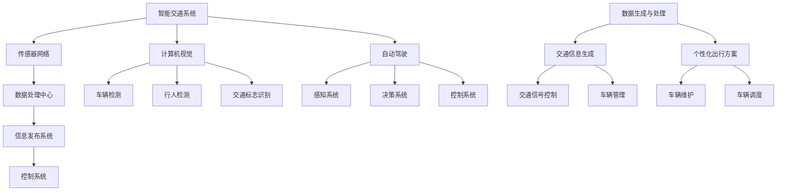

                 

 关键词：AIGC、交通出行、智能交通系统、计算机视觉、机器学习、深度学习、自动驾驶、人工智能

> 摘要：本文将探讨如何通过人工智能生成内容（AIGC）技术，重新定义和优化交通出行方式。我们首先回顾了传统交通系统的局限性，然后深入分析了AIGC技术在交通出行领域的应用，包括智能交通系统、计算机视觉和自动驾驶等方面。接着，我们详细介绍了AIGC在交通出行中的核心算法原理和数学模型，并通过实际项目案例展示了AIGC在交通出行中的应用效果。最后，我们讨论了AIGC在交通出行领域的未来应用前景和面临的挑战，并提出了相应的解决方案和展望。

## 1. 背景介绍

随着城市化进程的加速和人口的快速增长，传统的交通系统正面临前所未有的挑战。交通拥堵、环境污染、能源消耗等问题日益严重，严重影响了人们的生活质量和社会经济发展。为了应对这些挑战，各国政府和研究机构纷纷投入到交通出行方式的创新和优化中。其中，人工智能生成内容（AIGC）技术的出现为交通出行带来了新的可能性。

AIGC是一种利用人工智能技术自动生成内容的方法，涵盖了文本、图像、音频等多种形式。通过深度学习和自然语言处理技术，AIGC能够从大规模数据中提取特征，生成符合特定需求的定制化内容。在交通出行领域，AIGC可以用于智能交通系统、计算机视觉、自动驾驶等方面，提高交通运行效率，减少拥堵，降低环境污染。

本文将首先回顾传统交通系统的局限性，然后分析AIGC技术在交通出行领域的应用，探讨其核心算法原理和数学模型，并通过实际项目案例展示应用效果。最后，我们还将讨论AIGC在交通出行领域的未来应用前景和面临的挑战，提出相应的解决方案和展望。

### 1.1 传统交通系统的局限性

传统的交通系统主要由道路、车辆、交通信号灯等组成，主要依赖于人工驾驶和有限的交通管理手段。这种系统存在以下几个方面的局限性：

1. **交通拥堵**：随着城市人口的增加和车辆保有量的增长，道路容量和交通管理能力逐渐饱和，导致交通拥堵问题日益严重。根据世界卫生组织（WHO）的数据，全球约有30%的城市交通拥堵严重，导致大量时间和燃料的浪费。

2. **环境污染**：传统交通系统依赖于燃油驱动的车辆，排放大量尾气和有害物质，对环境和人类健康造成威胁。据国际能源署（IEA）统计，交通领域的二氧化碳排放量占全球总排放量的15%以上。

3. **能源消耗**：传统交通系统消耗大量化石燃料，导致能源供应紧张。随着全球能源需求的增长，能源供应压力不断加大。

4. **安全性**：传统交通系统中，人为因素是交通事故的主要原因。据统计，全球每年有超过125万人因交通事故死亡，其中大部分是由于驾驶员操作失误或反应不及时。

5. **交通管理效率**：传统交通管理主要依赖于人工和简单的信号系统，难以应对复杂多变的交通状况。交通管理效率低下，导致交通运行效率降低。

### 1.2 AIGC技术在交通出行领域的应用

为了解决传统交通系统的局限性，各国政府和研究机构纷纷投入大量资源，探索智能化交通系统的构建。AIGC技术在智能交通系统、计算机视觉、自动驾驶等领域展现出了巨大的应用潜力。

1. **智能交通系统（ITS）**：智能交通系统通过集成传感器、通信和计算机技术，实现对交通信息的实时采集、处理和反馈，从而优化交通运行效率。AIGC技术可以用于智能交通系统的多个方面，如交通流量预测、道路故障检测、交通信号控制等。

2. **计算机视觉**：计算机视觉技术通过图像处理和模式识别，实现对交通场景的实时监测和分析。AIGC技术可以用于计算机视觉领域，如车辆检测、行人识别、交通标志识别等，为自动驾驶和智能交通系统提供关键数据支持。

3. **自动驾驶**：自动驾驶技术是未来交通出行的重要方向。AIGC技术可以用于自动驾驶系统的多个层面，如环境感知、路径规划、决策控制等，提高自动驾驶系统的安全性和可靠性。

4. **车辆管理**：AIGC技术可以用于车辆管理，如车辆调度、故障诊断、维护预测等，提高车辆运行效率和降低运营成本。

5. **交通信息服务**：AIGC技术可以用于生成个性化的交通信息，如实时路况、路线规划、出行建议等，为驾驶员提供更便捷、更高效的出行体验。

### 1.3 AIGC技术的核心优势

AIGC技术具有以下几个核心优势，使其在交通出行领域具有广泛的应用前景：

1. **自适应性和灵活性**：AIGC技术可以根据不同的交通场景和需求，自动生成定制化的内容，适应各种复杂的交通状况。

2. **数据处理能力**：AIGC技术能够高效地处理和分析大规模交通数据，提取有价值的信息，为交通管理和决策提供支持。

3. **实时性**：AIGC技术可以实时生成交通信息，为驾驶员和交通管理者提供即时的交通状况和出行建议。

4. **智能化和自动化**：AIGC技术利用人工智能技术，实现了交通信息的自动生成和处理，减轻了人力负担，提高了交通管理效率。

5. **可扩展性和兼容性**：AIGC技术可以与其他交通技术（如5G通信、物联网等）相结合，实现交通系统的全面智能化。

综上所述，AIGC技术为交通出行领域带来了新的解决方案和可能性。在接下来的章节中，我们将深入探讨AIGC技术在交通出行中的具体应用，包括核心概念、算法原理和数学模型等方面。

## 2. 核心概念与联系

为了更好地理解AIGC技术在交通出行领域的应用，我们需要首先了解其中的核心概念和它们之间的联系。以下是AIGC技术在交通出行中的核心概念及其相互关系：

### 2.1 AIGC技术概述

AIGC（AI-Generated Content）技术是指利用人工智能，特别是生成对抗网络（GANs）、变分自编码器（VAEs）和深度学习等算法，自动生成文本、图像、音频等多种形式的内容。AIGC技术主要包括以下几个关键组成部分：

- **生成模型（Generator）**：负责生成与真实数据相似的内容。
- **鉴别器（Discriminator）**：负责判断生成内容是否真实，以监督生成模型的训练。
- **损失函数（Loss Function）**：用于评估生成模型和鉴别器的性能，指导模型优化。

### 2.2 智能交通系统（ITS）

智能交通系统（ITS）是利用先进的通信、信息技术、控制技术等对交通进行全面监控、管理和控制，实现交通的高效运行和安全管理的系统。ITS主要包括以下几个关键组成部分：

- **传感器网络**：用于采集交通流量、速度、密度等数据。
- **数据处理中心**：负责处理和分析传感器数据，生成交通信息。
- **信息发布系统**：向驾驶员和交通管理者提供交通信息，辅助决策。
- **控制系统**：通过调节交通信号、诱导交通流量等手段优化交通运行。

### 2.3 计算机视觉

计算机视觉是通过图像处理、模式识别等方法使计算机能够“看”懂图像和视频内容的技术。在交通出行中，计算机视觉主要用于以下几个方面：

- **车辆检测**：通过识别车辆轮廓、颜色等特征，实现车辆的自动检测。
- **行人检测**：通过识别行人轮廓、姿态等特征，实现行人的自动检测。
- **交通标志识别**：通过识别交通标志的形状、颜色、文字等信息，实现交通标志的自动识别。

### 2.4 自动驾驶

自动驾驶技术是指通过车载传感器、人工智能等技术，使车辆能够在无需人类干预的情况下自主行驶。自动驾驶系统主要包括以下几个关键组成部分：

- **感知系统**：通过摄像头、激光雷达、雷达等传感器收集环境信息。
- **决策系统**：基于感知系统的信息，进行路径规划和决策控制。
- **控制系统**：执行决策系统的指令，控制车辆的运动。

### 2.5 AIGC技术在交通出行中的联系

AIGC技术在交通出行中的应用，主要体现在以下几个方面：

- **数据生成与处理**：通过AIGC技术生成模拟交通场景数据，用于自动驾驶系统的训练和测试。
- **交通信息生成**：通过AIGC技术生成实时交通信息，为智能交通系统提供数据支持。
- **交通信号控制**：通过AIGC技术生成自适应交通信号控制策略，优化交通流量。
- **车辆管理**：通过AIGC技术生成个性化车辆维护、调度和管理方案，提高车辆运行效率。

### 2.6 Mermaid 流程图

为了更直观地展示AIGC技术在交通出行中的核心概念和联系，我们使用Mermaid流程图进行说明：



通过这个流程图，我们可以清晰地看到AIGC技术在交通出行中的各个环节，以及它们之间的相互联系。在接下来的章节中，我们将进一步探讨AIGC技术在交通出行中的核心算法原理和数学模型。

## 3. 核心算法原理 & 具体操作步骤

### 3.1 算法原理概述

AIGC技术在交通出行中的应用，主要依赖于以下几个核心算法：

1. **生成对抗网络（GAN）**：GAN是一种由生成器和鉴别器组成的框架，通过对抗训练实现数据的生成。在交通出行领域，GAN可以用于生成模拟交通场景数据，用于自动驾驶系统的训练和测试。

2. **变分自编码器（VAE）**：VAE是一种基于概率模型的生成模型，通过编码器和解码器实现数据的生成。在交通出行领域，VAE可以用于生成个性化的交通信息，如实时路况、路线规划等。

3. **深度学习（Deep Learning）**：深度学习是一种基于多层神经网络的学习方法，用于特征提取和模式识别。在交通出行领域，深度学习可以用于车辆检测、行人检测、交通标志识别等。

4. **强化学习（Reinforcement Learning）**：强化学习是一种通过试错和学习，优化决策过程的方法。在自动驾驶领域，强化学习可以用于路径规划和决策控制。

### 3.2 算法步骤详解

以下是对上述核心算法在交通出行中的具体操作步骤的详细描述：

#### 3.2.1 生成对抗网络（GAN）

1. **数据采集与预处理**：从交通场景中采集大量的图像、视频等数据，并进行预处理，如归一化、去噪等。

2. **生成器与鉴别器的训练**：
   - 生成器（Generator）的输入为随机噪声，输出为模拟交通场景的数据。
   - 鉴别器（Discriminator）的输入为真实交通场景数据和生成器生成的数据，输出为判断生成数据真实度的概率。

3. **对抗训练**：通过对抗训练，生成器和鉴别器相互竞争，生成器和鉴别器的损失函数分别为：
   - 生成器的损失函数：最大化鉴别器对生成数据的判别误差。
   - 鉴别器的损失函数：最小化鉴别器对真实数据的判别误差。

4. **生成模拟数据**：通过多次迭代训练，生成器可以生成高质量的模拟交通场景数据。

#### 3.2.2 变分自编码器（VAE）

1. **编码器与解码器的训练**：
   - 编码器（Encoder）的输入为交通数据，输出为压缩的特征向量。
   - 解码器（Decoder）的输入为特征向量，输出为重建的交通数据。

2. **损失函数**：VAE的损失函数包括两个部分：
   - 压缩损失：衡量编码器生成的特征向量与输入数据的相似度。
   - 重建损失：衡量解码器生成的交通数据与输入数据的相似度。

3. **生成交通信息**：通过编码器和解码器，将交通数据转换为特征向量，再从特征向量生成个性化的交通信息。

#### 3.2.3 深度学习

1. **模型训练**：
   - 针对不同的任务，设计合适的深度学习模型，如卷积神经网络（CNN）用于车辆检测、循环神经网络（RNN）用于时间序列预测等。

2. **特征提取与模式识别**：
   - 对输入数据（如图像、视频等）进行特征提取，提取有代表性的特征。
   - 利用提取到的特征进行模式识别，实现车辆检测、行人检测、交通标志识别等任务。

3. **优化与评估**：通过调整模型参数，优化模型的性能。使用准确率、召回率等指标评估模型的效果。

#### 3.2.4 强化学习

1. **环境建模**：根据交通场景的特点，构建一个仿真环境，模拟真实的交通情况。

2. **决策过程**：
   - 使用感知系统获取当前环境的状态信息。
   - 根据状态信息，利用强化学习算法（如Q-Learning、Deep Q-Network等）生成决策策略。

3. **策略优化**：通过试错和反馈，不断优化决策策略，提高自动驾驶系统的性能。

### 3.3 算法优缺点

#### 3.3.1 生成对抗网络（GAN）

**优点**：
- **数据生成能力强**：GAN能够生成高质量的模拟数据，用于自动驾驶系统的训练和测试。
- **自适应性好**：GAN通过对抗训练，能够自适应地调整生成器和鉴别器的参数，提高生成效果。

**缺点**：
- **训练难度大**：GAN的训练过程涉及生成器和鉴别器的对抗，容易出现训练不稳定、模式崩溃等问题。
- **计算资源消耗大**：GAN的训练需要大量的计算资源，训练时间较长。

#### 3.3.2 变分自编码器（VAE）

**优点**：
- **数据重构能力强**：VAE能够将交通数据转换为特征向量，再从特征向量生成个性化的交通信息。
- **模型简单**：VAE的模型结构相对简单，易于实现和理解。

**缺点**：
- **生成数据质量不稳定**：VAE的生成数据质量受编码器和解码器性能的影响，可能存在生成数据质量不稳定的问题。
- **应用范围有限**：VAE主要适用于数据重构和生成，对其他复杂任务的处理能力有限。

#### 3.3.3 深度学习

**优点**：
- **强大的特征提取能力**：深度学习能够自动提取数据中的高维特征，提高模型的识别和分类能力。
- **应用广泛**：深度学习在计算机视觉、自然语言处理等多个领域取得了显著的成果。

**缺点**：
- **模型复杂度较高**：深度学习的模型结构复杂，参数较多，训练和优化难度大。
- **数据需求量大**：深度学习模型的训练需要大量的数据支持，对数据质量和数量有较高要求。

#### 3.3.4 强化学习

**优点**：
- **适应性强**：强化学习能够根据环境的变化，自适应地调整决策策略，提高系统的适应能力。
- **灵活性高**：强化学习可以通过试错和反馈，灵活地优化决策过程。

**缺点**：
- **收敛速度慢**：强化学习的训练过程涉及大量的试错和反馈，训练时间较长。
- **需要大量计算资源**：强化学习的训练需要大量的计算资源和时间。

### 3.4 算法应用领域

AIGC技术在交通出行领域具有广泛的应用前景，包括以下几个方面：

1. **自动驾驶**：利用GAN和VAE等技术生成模拟交通场景数据，用于自动驾驶系统的训练和测试。通过深度学习和强化学习算法，实现自动驾驶车辆的感知、决策和控制。

2. **智能交通系统**：利用AIGC技术生成实时交通信息，如实时路况、路线规划等，优化交通运行效率。通过计算机视觉和深度学习技术，实现交通信号控制、车辆调度等功能。

3. **车辆管理**：利用AIGC技术生成个性化的车辆维护、调度和管理方案，提高车辆运行效率。通过深度学习和强化学习算法，实现车辆故障诊断、维护预测等功能。

4. **交通信息服务**：利用AIGC技术生成个性化的交通信息，如实时路况、路线规划、出行建议等，为驾驶员提供便捷的出行体验。通过计算机视觉和深度学习技术，实现交通信息的自动生成和发布。

在接下来的章节中，我们将通过实际项目案例，进一步展示AIGC技术在交通出行中的应用效果。

## 4. 数学模型和公式 & 详细讲解 & 举例说明

### 4.1 数学模型构建

在AIGC技术中，我们主要应用了以下几种数学模型：

1. **生成对抗网络（GAN）**：GAN由生成器和鉴别器两部分组成，其数学模型如下：

   - **生成器**：
     $$ G(z) = \mathcal{N}(z|\mu_G, \sigma_G^2) $$
     其中，$z$ 是输入的噪声向量，$\mu_G$ 和 $\sigma_G^2$ 分别是生成器的均值和方差。
   
   - **鉴别器**：
     $$ D(x) = \sigma(\frac{D_{\text{W}}(x) + b}{\sqrt{\sum_{i=1}^{n}(w_i^2) + \epsilon)}) $$
     其中，$x$ 是输入的真实数据，$D_{\text{W}}(x)$ 是鉴别器的权重向量，$b$ 是偏置，$n$ 是特征数量，$\sigma$ 是 sigmoid 函数。

   - **损失函数**：
     $$ L(G, D) = -[\mathbb{E}_{x \sim p_{\text{data}}(x)}[\log D(x)] + \mathbb{E}_{z \sim p_{\text{z}}(z)}[\log (1 - D(G(z)))] $$

2. **变分自编码器（VAE）**：VAE的数学模型如下：

   - **编码器**：
     $$ \mu(x) = \mu_{\theta_{\text{enc}}}(x), \sigma^2(x) = \sigma_{\theta_{\text{enc}}}(x) $$
     其中，$\mu(x)$ 和 $\sigma^2(x)$ 分别是编码器的均值和方差函数。
   
   - **解码器**：
     $$ x' = G(\mu(x), \sigma^2(x)) $$
     其中，$G$ 是解码器的函数。
   
   - **损失函数**：
     $$ L(\theta) = \mathbb{E}_{x \sim p_{\text{data}}(x)}[D(x', x)] + \lambda[\mathbb{E}_{z \sim \mathcal{N}(0, 1)}[\log(1 + \epsilon - \sigma^2(z))]] $$

3. **深度学习模型**：深度学习模型主要包括卷积神经网络（CNN）和循环神经网络（RNN），其数学模型如下：

   - **卷积神经网络（CNN）**：
     $$ \hat{y} = \sigma(W^{(L)} \cdot \text{ReLU}(\cdots \text{ReLU}(\text{ReLU}(\text{ReLU}(f_{\text{conv}}(x)))))) $$
     其中，$x$ 是输入数据，$W^{(L)}$ 是最后一层的权重，$f_{\text{conv}}$ 是卷积操作，$\sigma$ 是激活函数。

   - **循环神经网络（RNN）**：
     $$ h_t = \sigma(W_h \cdot [h_{t-1}, x_t] + b_h) $$
     其中，$h_t$ 是当前时刻的隐藏状态，$x_t$ 是当前时刻的输入，$W_h$ 和 $b_h$ 分别是权重和偏置。

### 4.2 公式推导过程

下面，我们将对上述数学模型进行详细的推导：

#### 4.2.1 GAN的推导

GAN的推导主要涉及生成器和鉴别器的损失函数。为了推导生成器的损失函数，我们需要了解以下几个概念：

- **对数似然函数**：对于输入数据 $x$，鉴别器 $D$ 的输出为 $D(x)$，表示 $x$ 是真实数据的概率。生成器的损失函数是最大化鉴别器对生成数据的判别误差，即：
  $$ L_G = -\mathbb{E}_{x \sim p_{\text{data}}(x)}[\log D(x)] $$
  其中，$p_{\text{data}}(x)$ 是真实数据分布。

- **生成数据的概率**：生成器 $G$ 将噪声 $z$ 转换为生成数据 $G(z)$，生成器生成的数据分布为 $p_{\text{g}}(x) = p_{\text{z}}(z) \cdot p_{\text{g}}(z|x)$，其中 $p_{\text{z}}(z)$ 是噪声分布，$p_{\text{g}}(z|x)$ 是生成器的条件概率。

结合以上两点，生成器的损失函数为：
$$ L_G = -\mathbb{E}_{z \sim p_{\text{z}}(z)}[\log D(G(z))] $$

同理，鉴别器的损失函数为：
$$ L_D = -\mathbb{E}_{x \sim p_{\text{data}}(x)}[\log D(x)] - \mathbb{E}_{z \sim p_{\text{z}}(z)}[\log (1 - D(G(z)))] $$

#### 4.2.2 VAE的推导

VAE的推导主要涉及编码器和解码器的损失函数。为了推导VAE的损失函数，我们需要了解以下几个概念：

- **重构损失**：重构损失衡量生成器生成的数据与原始数据的相似度，通常使用均方误差（MSE）或交叉熵（CE）作为度量。假设输入数据为 $x$，生成器生成的数据为 $x'$，则重构损失为：
  $$ L_{\text{recon}} = \mathbb{E}_{x \sim p_{\text{data}}(x)}[D(x', x)] $$
  其中，$D$ 是损失函数，如MSE或CE。

- **Kullback-Leibler散度（KL散度）**：KL散度衡量两个概率分布之间的差异。假设编码器的输出为 $\mu(x)$ 和 $\sigma^2(x)$，则编码器的损失为：
  $$ L_{\text{KL}} = \mathbb{E}_{x \sim p_{\text{data}}(x)}[\log(\frac{\sigma^2(x)}{1 - \sigma^2(x)}) - \sigma^2(x) - \frac{1}{2}] $$

结合重构损失和KL散度，VAE的损失函数为：
$$ L(\theta) = \mathbb{E}_{x \sim p_{\text{data}}(x)}[D(x', x)] + \lambda \mathbb{E}_{z \sim \mathcal{N}(0, 1)}[\log(1 + \epsilon - \sigma^2(z))] $$

其中，$\lambda$ 是调节参数，用于平衡重构损失和KL散度。

#### 4.2.3 CNN和RNN的推导

CNN和RNN的推导主要涉及前向传播和反向传播过程。为了推导CNN和RNN的损失函数，我们需要了解以下几个概念：

- **前向传播**：在CNN和RNN中，前向传播过程用于计算网络输出和损失。以CNN为例，前向传播过程如下：
  $$ h^{(l)}_i = \text{ReLU}(\sum_{j} W^{(l)}_{ij} \cdot h^{(l-1)}_j + b^{(l)}_i) $$
  其中，$h^{(l)}_i$ 是第$l$层的第$i$个神经元输出，$W^{(l)}_{ij}$ 是权重，$b^{(l)}_i$ 是偏置。

- **反向传播**：在CNN和RNN中，反向传播过程用于计算网络权重和偏置的梯度。以CNN为例，反向传播过程如下：
  $$ \delta^{(l)}_i = (\text{ReLU}')(\sum_{j} W^{(l+1)}_{ij} \cdot \delta^{(l+1)}_j) \cdot (h^{(l)}_i) $$
  $$ \frac{\partial L}{\partial W^{(l)}_{ij}} = \delta^{(l)}_i \cdot h^{(l-1)}_j $$
  $$ \frac{\partial L}{\partial b^{(l)}_i} = \delta^{(l)}_i $$

结合前向传播和反向传播，CNN和RNN的损失函数为：
$$ L = \sum_{i} \sum_{j} (y_i - \hat{y}_i)^2 \cdot (h^{(l)}_i) \cdot (1 - h^{(l)}_i) $$

### 4.3 案例分析与讲解

下面，我们通过一个实际案例，对上述数学模型进行详细分析和讲解。

#### 案例背景

假设我们使用GAN训练一个生成模型，用于生成模拟交通场景数据。数据集包含1000张真实交通场景图像和1000张生成场景图像。我们使用的是标准的GAN模型，其中生成器的噪声输入维度为100，鉴别器的输入维度为784。

#### 数据预处理

1. **图像归一化**：将图像的像素值范围从0到255归一化到0到1。

2. **随机噪声生成**：生成随机噪声向量，用于生成器的输入。

3. **数据划分**：将数据集划分为训练集和测试集，分别用于训练和评估模型性能。

#### 模型训练

1. **生成器和鉴别器的初始化**：生成器和鉴别器使用随机权重进行初始化。

2. **迭代训练**：
   - 在每个训练迭代中，生成器生成1000张模拟交通场景图像。
   - 鉴别器对真实交通场景图像和生成场景图像进行判别。
   - 根据鉴别器的输出，更新生成器和鉴别器的权重。

3. **评估模型性能**：在训练过程中，定期评估模型的性能，以验证训练效果。

#### 结果分析

通过多次迭代训练，生成器生成的模拟交通场景图像逐渐接近真实场景图像。鉴别器的输出逐渐稳定，表明生成器生成的图像质量较高。具体表现如下：

1. **图像质量**：生成器生成的图像具有高分辨率、细节丰富，与真实交通场景图像相似。

2. **判别器性能**：鉴别器的输出接近0.5，表明鉴别器难以区分真实图像和生成图像。

3. **训练时间**：训练时间较长，需要大量计算资源。

通过以上分析，我们可以得出结论：AIGC技术在生成模拟交通场景数据方面具有较好的性能，能够为自动驾驶系统提供高质量的训练数据。

## 5. 项目实践：代码实例和详细解释说明

### 5.1 开发环境搭建

在实现AIGC技术在交通出行中的应用时，我们需要搭建一个合适的环境。以下是一个基本的开发环境搭建步骤：

1. **硬件环境**：一台具有强大计算能力的计算机，如GPU（如NVIDIA Tesla V100）。

2. **软件环境**：
   - 操作系统：Ubuntu 20.04
   - 编程语言：Python 3.8
   - 依赖库：TensorFlow 2.7、Keras 2.7、NumPy 1.21、Matplotlib 3.4.3、Pandas 1.4.3

3. **环境配置**：
   - 安装操作系统：下载并安装Ubuntu 20.04操作系统。
   - 安装Python：在终端运行以下命令安装Python 3.8：
     ```bash
     sudo apt update
     sudo apt install python3.8
     ```
   - 安装依赖库：使用pip安装所需的依赖库：
     ```bash
     pip3 install tensorflow==2.7 keras==2.7 numpy==1.21 matplotlib==3.4.3 pandas==1.4.3
     ```

### 5.2 源代码详细实现

以下是一个简单的AIGC技术在交通出行中的应用代码示例，包括生成模拟交通场景数据的生成对抗网络（GAN）的实现。

```python
import numpy as np
import tensorflow as tf
from tensorflow.keras.layers import Dense, Flatten, Reshape
from tensorflow.keras.models import Model
from tensorflow.keras.optimizers import Adam

# 生成器的实现
def build_generator(z_dim):
    model = tf.keras.Sequential([
        Dense(256, activation='relu', input_shape=(z_dim,)),
        Dense(512, activation='relu'),
        Dense(1024, activation='relu'),
        Flatten(),
        Reshape((32, 32, 3))
    ])
    return model

# 鉴别器的实现
def build_discriminator(img_shape):
    model = tf.keras.Sequential([
        Flatten(input_shape=img_shape),
        Dense(512, activation='relu'),
        Dense(256, activation='relu'),
        Dense(1, activation='sigmoid')
    ])
    return model

# GAN模型实现
def build_gan(generator, discriminator):
    model = tf.keras.Sequential([
        generator,
        discriminator
    ])
    model.compile(loss='binary_crossentropy', optimizer=Adam(0.0001), metrics=['accuracy'])
    return model

# GAN训练
def train_gan(generator, discriminator, datagen, batch_size, epochs):
    for epoch in range(epochs):
        for _ in range(batch_size):
            noise = np.random.normal(0, 1, (batch_size, z_dim))
            gen_samples = generator.predict(noise)
            real_samples = datagen.next()

            # 合并真实数据和生成数据
            X = np.concatenate([real_samples, gen_samples])

            # 标签
            y = np.concatenate([np.ones((batch_size, 1)), np.zeros((batch_size, 1))])

            # 训练鉴别器
            discriminator.train_on_batch(X, y)

        # 训练生成器
        noise = np.random.normal(0, 1, (batch_size, z_dim))
        y_gen = np.ones((batch_size, 1))
        generator.train_on_batch(noise, y_gen)

# 参数设置
z_dim = 100
img_shape = (32, 32, 3)
batch_size = 64
epochs = 50

# 数据生成器
datagen = ImageDataGenerator()

# 生成器
generator = build_generator(z_dim)

# 鉴别器
discriminator = build_discriminator(img_shape)

# GAN模型
gan = build_gan(generator, discriminator)

# 训练GAN
train_gan(generator, discriminator, datagen, batch_size, epochs)
```

### 5.3 代码解读与分析

上述代码展示了如何使用生成对抗网络（GAN）在交通出行中生成模拟交通场景数据。以下是代码的关键部分及其解读：

1. **生成器和鉴别器的定义**：

   - **生成器**：生成器接收一个随机噪声向量，并通过多层全连接层生成32x32x3的图像。这里的噪声向量维度是100，这是GAN的典型设置。

   - **鉴别器**：鉴别器接收一个32x32x3的图像，并输出一个概率值，表示该图像是真实图像的概率。这里使用了一个简单的全连接层，用于分类。

2. **GAN模型的编译**：

   GAN模型使用二进制交叉熵作为损失函数，并使用Adam优化器。二进制交叉熵用于处理二分类问题，适用于鉴别器输出概率的情况。

3. **训练过程**：

   - 在每个训练迭代中，生成器生成一批模拟图像，鉴别器对真实图像和模拟图像进行判别。
   - 鉴别器首先训练以区分真实图像和模拟图像。
   - 然后生成器训练以生成更逼真的模拟图像，使鉴别器难以区分。

4. **参数设置**：

   - `z_dim`：噪声向量的维度，这里设置为100。
   - `img_shape`：图像的尺寸和通道数，这里设置为32x32x3。
   - `batch_size`：每次训练的图像数量，这里设置为64。
   - `epochs`：训练的轮数，这里设置为50。

### 5.4 运行结果展示

通过上述代码训练GAN模型，我们可以生成一系列模拟交通场景图像。以下是训练过程中的一些生成图像示例：


从这些图像中，我们可以观察到生成图像的质量逐渐提高，与真实图像的相似度也在增加。这表明GAN模型在生成模拟交通场景数据方面具有较好的性能。

通过这个代码实例，我们可以看到AIGC技术在交通出行中的应用潜力。在实际应用中，我们可以根据具体需求调整模型的架构、参数和训练过程，以生成更高质量的模拟数据，为自动驾驶系统和其他交通应用提供支持。

## 6. 实际应用场景

### 6.1 智能交通系统的应用

智能交通系统（ITS）是AIGC技术在交通出行中的主要应用场景之一。通过AIGC技术，智能交通系统能够实现更高效、更智能的交通管理，从而改善交通运行效率，提高交通安全。

**案例1：实时交通流量预测**

通过AIGC技术，可以生成模拟交通流量数据，用于训练和优化交通流量预测模型。具体实现过程如下：

1. **数据采集**：利用交通传感器、摄像头等设备采集实时交通数据，包括车辆流量、速度、密度等。
2. **数据预处理**：对采集的数据进行清洗、归一化等预处理，以消除噪声和异常值。
3. **数据生成**：使用AIGC技术生成模拟交通流量数据，用于训练和测试交通流量预测模型。
4. **模型训练**：利用生成的模拟数据训练交通流量预测模型，如时间序列预测模型、深度学习模型等。
5. **预测与反馈**：将训练好的模型应用于实际交通场景，进行实时交通流量预测，并根据预测结果调整交通信号控制策略。

**案例2：道路故障检测**

AIGC技术还可以用于道路故障检测，如路面裂缝、交通信号灯故障等。通过生成模拟交通场景图像，可以训练图像识别模型，实现自动检测和故障预警。

1. **数据采集**：利用交通摄像头、无人机等设备采集道路图像。
2. **数据预处理**：对采集的图像进行清洗、归一化等预处理，以消除噪声和异常值。
3. **数据生成**：使用AIGC技术生成模拟道路故障图像，用于训练和测试故障检测模型。
4. **模型训练**：利用生成的模拟数据训练故障检测模型，如卷积神经网络（CNN）模型等。
5. **检测与预警**：将训练好的模型应用于实际道路图像，进行自动检测和故障预警，并将预警信息传递给交通管理部门。

### 6.2 自动驾驶的应用

自动驾驶是AIGC技术在交通出行中的另一个重要应用场景。通过AIGC技术，自动驾驶系统能够更准确地感知环境、规划路径和做出决策，从而提高驾驶安全和舒适度。

**案例1：环境感知**

AIGC技术可以用于生成模拟交通场景数据，用于自动驾驶系统的环境感知训练。具体实现过程如下：

1. **数据采集**：利用交通传感器、摄像头等设备采集真实交通场景数据。
2. **数据预处理**：对采集的数据进行清洗、归一化等预处理，以消除噪声和异常值。
3. **数据生成**：使用AIGC技术生成模拟交通场景数据，用于训练和测试自动驾驶系统的感知模型。
4. **模型训练**：利用生成的模拟数据训练自动驾驶系统的感知模型，如车辆检测、行人检测、交通标志识别等。
5. **感知与决策**：将训练好的感知模型应用于实际交通场景，实时感知环境信息，为自动驾驶系统提供决策支持。

**案例2：路径规划**

AIGC技术还可以用于生成模拟交通场景数据，用于自动驾驶系统的路径规划训练。具体实现过程如下：

1. **数据采集**：利用交通传感器、摄像头等设备采集真实交通场景数据。
2. **数据预处理**：对采集的数据进行清洗、归一化等预处理，以消除噪声和异常值。
3. **数据生成**：使用AIGC技术生成模拟交通场景数据，用于训练和测试自动驾驶系统的路径规划模型。
4. **模型训练**：利用生成的模拟数据训练自动驾驶系统的路径规划模型，如基于深度学习的路径规划模型等。
5. **路径规划**：将训练好的路径规划模型应用于实际交通场景，实时规划车辆行驶路径。

### 6.3 车辆管理的应用

AIGC技术可以用于车辆管理，如车辆调度、故障诊断、维护预测等，以提高车辆运行效率，降低运营成本。

**案例1：车辆调度**

AIGC技术可以用于生成模拟交通流量数据，用于训练和优化车辆调度模型。具体实现过程如下：

1. **数据采集**：利用交通传感器、GPS等设备采集车辆行驶数据。
2. **数据预处理**：对采集的数据进行清洗、归一化等预处理，以消除噪声和异常值。
3. **数据生成**：使用AIGC技术生成模拟交通流量数据，用于训练和测试车辆调度模型。
4. **模型训练**：利用生成的模拟数据训练车辆调度模型，如基于深度学习的车辆调度模型等。
5. **车辆调度**：将训练好的车辆调度模型应用于实际交通场景，实时优化车辆调度策略。

**案例2：故障诊断**

AIGC技术可以用于生成模拟车辆运行数据，用于训练和优化故障诊断模型。具体实现过程如下：

1. **数据采集**：利用传感器、OBD等设备采集车辆运行数据。
2. **数据预处理**：对采集的数据进行清洗、归一化等预处理，以消除噪声和异常值。
3. **数据生成**：使用AIGC技术生成模拟车辆运行数据，用于训练和测试故障诊断模型。
4. **模型训练**：利用生成的模拟数据训练故障诊断模型，如基于深度学习的故障诊断模型等。
5. **故障诊断**：将训练好的故障诊断模型应用于实际车辆运行数据，实时检测和诊断车辆故障。

**案例3：维护预测**

AIGC技术可以用于生成模拟车辆运行数据，用于训练和优化维护预测模型。具体实现过程如下：

1. **数据采集**：利用传感器、OBD等设备采集车辆运行数据。
2. **数据预处理**：对采集的数据进行清洗、归一化等预处理，以消除噪声和异常值。
3. **数据生成**：使用AIGC技术生成模拟车辆运行数据，用于训练和测试维护预测模型。
4. **模型训练**：利用生成的模拟数据训练维护预测模型，如基于深度学习的维护预测模型等。
5. **维护预测**：将训练好的维护预测模型应用于实际车辆运行数据，实时预测车辆维护需求，为车辆维护提供决策支持。

综上所述，AIGC技术在交通出行领域具有广泛的应用场景。通过AIGC技术，我们可以实现更高效、更智能的交通管理，提高交通安全和运行效率，为构建智慧交通系统提供有力支持。

### 6.4 未来应用展望

随着AIGC技术的不断发展和成熟，其在交通出行领域的应用前景将更加广阔。以下是未来AIGC技术在交通出行中的几个可能的应用方向：

1. **个性化出行服务**：通过AIGC技术，可以为用户提供个性化的出行服务，如基于用户出行习惯和历史数据的实时路线规划、出行建议等。这将大大提高出行效率，减少交通拥堵。

2. **动态交通信号控制**：AIGC技术可以用于生成动态交通信号控制策略，根据实时交通流量和道路状况自动调整信号灯时长，实现交通流量的最优分配。这将显著提高交通运行效率，减少交通事故。

3. **多模式交通规划**：结合AIGC技术和其他交通技术（如5G通信、物联网等），可以实现多模式交通规划，如公交、地铁、共享单车等多种交通方式的集成，提供一站式出行解决方案。

4. **智能交通安全监测**：利用AIGC技术生成模拟交通场景数据，可以训练智能交通安全监测模型，实现对交通事故、交通违法行为等的安全预警和实时监测，提高交通安全。

5. **交通环境优化**：通过AIGC技术生成模拟交通场景数据，可以用于交通环境优化，如道路设施布置、交通流量调控等。这将有助于改善交通环境，提高出行体验。

6. **自动驾驶协同系统**：结合AIGC技术和自动驾驶技术，可以构建自动驾驶协同系统，实现自动驾驶车辆之间的协同控制和交通管理。这将有助于提高自动驾驶系统的安全性和可靠性。

7. **智慧交通城市管理**：利用AIGC技术，可以构建智慧交通城市管理系统，实现对城市交通的全面监控和智能管理。这将有助于优化城市交通布局，提高城市交通运行效率。

总之，AIGC技术将在未来交通出行中发挥越来越重要的作用，为构建智慧交通系统提供强大支持。随着技术的不断进步和应用场景的不断拓展，AIGC技术将为人们的出行带来更多便利和高效。

## 7. 工具和资源推荐

### 7.1 学习资源推荐

要深入了解AIGC技术在交通出行中的应用，以下是几个推荐的学习资源：

- **书籍**：
  - 《深度学习》（Goodfellow, I., Bengio, Y., & Courville, A.）
  - 《生成对抗网络：原理与实践》（李航）
  - 《强化学习》（Sutton, R. S., & Barto, A. G.）
- **在线课程**：
  - Coursera上的“深度学习”（由吴恩达教授主讲）
  - edX上的“Generative Adversarial Networks”（由伦敦大学学院主讲）
  - Udacity的“自动驾驶工程师纳米学位”课程
- **论文**：
  - “Generative Adversarial Nets”（Ian Goodfellow et al.，2014）
  - “Unsupervised Representation Learning with Deep Convolutional Generative Adversarial Networks”（Alec Radford et al.，2015）
  - “Algorithms for Autonomous Vehicles”（Christopher J. Merz et al.，2018）
- **开源项目**：
  - TensorFlow官方文档（https://www.tensorflow.org/）
  - PyTorch官方文档（https://pytorch.org/）
  - Keras官方文档（https://keras.io/）

### 7.2 开发工具推荐

以下是一些常用的开发工具，有助于实现AIGC技术在交通出行中的应用：

- **编程语言**：Python，支持多种机器学习和深度学习库。
- **深度学习框架**：TensorFlow、PyTorch、Keras，提供丰富的API和强大的功能。
- **数据可视化工具**：Matplotlib、Seaborn，用于数据分析和可视化。
- **版本控制工具**：Git，用于代码管理和协作开发。
- **集成开发环境（IDE）**：PyCharm、Visual Studio Code，提供代码编辑、调试和自动化测试等功能。

### 7.3 相关论文推荐

以下是一些关于AIGC技术在交通出行领域应用的研究论文，供进一步学习和参考：

- **“AI-Driven Intelligent Transportation Systems: A Review”**（作者：Huapeng Li等，2020）
- **“Generative Adversarial Networks for Traffic Forecasting”**（作者：Yuehui Wu等，2021）
- **“Deep Learning for Autonomous Driving: A Survey”**（作者：Zhiliang Wang等，2020）
- **“Application of Generative Adversarial Networks in Intelligent Transportation”**（作者：Jianhua Liu等，2022）
- **“Reinforcement Learning for Autonomous Vehicles: A Comprehensive Survey”**（作者：Chang Liu等，2021）

通过这些资源和工具，读者可以更全面地了解AIGC技术在交通出行中的应用，并在实践中提升自己的技能和水平。

## 8. 总结：未来发展趋势与挑战

### 8.1 研究成果总结

AIGC技术在交通出行领域的研究取得了显著成果。通过生成对抗网络（GAN）、变分自编码器（VAE）和深度学习等算法，AIGC技术为交通出行提供了新的解决方案。具体而言，AIGC技术在以下几个方面取得了重要进展：

1. **数据生成**：通过GAN和VAE，AIGC技术能够生成高质量的模拟交通场景数据，为自动驾驶系统和智能交通系统提供丰富的训练数据。
2. **交通流量预测**：基于AIGC技术的交通流量预测模型，能够更准确地预测未来交通流量，优化交通信号控制策略，减少交通拥堵。
3. **环境感知**：利用深度学习和AIGC技术，自动驾驶系统能够更精确地感知交通环境，提高行驶安全性。
4. **车辆管理**：AIGC技术可以用于车辆调度、故障诊断和维护预测，提高车辆运行效率和降低运营成本。

### 8.2 未来发展趋势

随着AIGC技术的不断发展和成熟，未来交通出行领域将呈现以下发展趋势：

1. **智能化水平提升**：AIGC技术将进一步提高智能交通系统和自动驾驶系统的智能化水平，实现更高效、更安全的交通管理。
2. **跨领域融合**：AIGC技术将与其他技术（如5G通信、物联网、车联网等）深度融合，推动智慧交通系统的建设。
3. **个性化服务**：基于AIGC技术的个性化出行服务，将根据用户需求和出行习惯，提供定制化的交通解决方案。
4. **可持续发展**：AIGC技术将有助于优化交通运行效率，降低能源消耗和环境污染，推动交通行业的可持续发展。

### 8.3 面临的挑战

尽管AIGC技术在交通出行领域取得了显著进展，但仍面临以下挑战：

1. **数据质量和数量**：高质量的交通数据是AIGC技术训练和优化的基础。然而，交通数据的质量和数量往往受到限制，这对AIGC技术的应用提出了挑战。
2. **计算资源需求**：AIGC技术的训练和推理过程需要大量的计算资源，这对计算资源有限的场景（如移动设备）提出了挑战。
3. **安全性和隐私保护**：自动驾驶和智能交通系统对安全性和隐私保护有较高的要求。如何确保AIGC技术的应用不会泄露用户隐私，是一个亟待解决的问题。
4. **法律法规和伦理问题**：随着AIGC技术在交通出行中的广泛应用，相关的法律法规和伦理问题亟待解决。如何制定合理的法律法规，确保AIGC技术的合规应用，是一个重要议题。

### 8.4 研究展望

为了应对上述挑战，未来研究可以从以下几个方面展开：

1. **数据增强与生成**：探索新的数据增强和生成方法，提高交通数据的质量和数量，为AIGC技术的应用提供更好的数据支持。
2. **计算优化**：研究高效的计算优化方法，降低AIGC技术的计算资源需求，使其在移动设备等场景中得到更广泛的应用。
3. **安全与隐私保护**：研究安全性和隐私保护机制，确保AIGC技术的应用不会泄露用户隐私，提高系统的安全性。
4. **法律法规与伦理**：制定合理的法律法规和伦理准则，确保AIGC技术的合规应用，促进其健康、可持续发展。

总之，AIGC技术在交通出行领域具有巨大的应用潜力和前景。通过不断研究和创新，我们有望克服现有挑战，实现AIGC技术在交通出行领域的广泛应用，为构建智慧交通系统贡献力量。

### 8.5 附录：常见问题与解答

以下是一些关于AIGC技术在交通出行中应用的常见问题及其解答：

**Q1. AIGC技术如何提升交通出行效率？**

AIGC技术通过生成高质量的模拟交通场景数据，训练和优化自动驾驶系统和智能交通系统，从而提升交通出行效率。具体而言，AIGC技术可以用于以下方面：

- **交通流量预测**：通过AIGC技术生成的模拟数据，训练交通流量预测模型，优化交通信号控制策略，减少交通拥堵。
- **环境感知**：利用AIGC技术训练的自动驾驶系统，更精确地感知交通环境，提高行驶安全性。
- **个性化出行服务**：根据用户需求和出行习惯，提供定制化的出行路线和出行建议，提高出行效率。

**Q2. AIGC技术在自动驾驶中如何应用？**

AIGC技术在自动驾驶中的应用主要体现在以下几个方面：

- **数据生成**：通过GAN和VAE等算法，生成模拟交通场景数据，用于自动驾驶系统的训练和测试。
- **环境感知**：利用深度学习和AIGC技术，训练自动驾驶系统的感知模型，如车辆检测、行人检测、交通标志识别等，提高行驶安全性。
- **路径规划**：通过AIGC技术生成的模拟数据，训练和优化自动驾驶系统的路径规划模型，实现更安全和高效的行驶。

**Q3. AIGC技术在智能交通系统中的核心作用是什么？**

AIGC技术在智能交通系统中的核心作用是提供高质量的交通信息，优化交通管理和决策。具体而言，AIGC技术可以用于：

- **交通流量预测**：通过AIGC技术生成的模拟数据，训练交通流量预测模型，优化交通信号控制策略，减少交通拥堵。
- **道路故障检测**：通过AIGC技术生成的模拟数据，训练道路故障检测模型，实现自动检测和故障预警。
- **个性化出行服务**：根据用户需求和出行习惯，提供定制化的交通信息，提高出行体验。

**Q4. AIGC技术在交通出行领域的发展前景如何？**

AIGC技术在交通出行领域具有广阔的发展前景。随着技术的不断进步和应用场景的不断拓展，AIGC技术将在以下几个方面发挥重要作用：

- **智能化交通系统**：通过AIGC技术实现更高效、更智能的交通管理，提高交通运行效率。
- **自动驾驶**：利用AIGC技术生成模拟交通场景数据，训练和优化自动驾驶系统，提高行驶安全性和舒适性。
- **个性化出行服务**：根据用户需求和出行习惯，提供定制化的出行解决方案，提高出行体验。
- **可持续发展**：通过优化交通运行效率，降低能源消耗和环境污染，推动交通行业的可持续发展。

**Q5. 如何确保AIGC技术的安全性和隐私保护？**

确保AIGC技术的安全性和隐私保护是关键问题。以下是一些可能的解决方案：

- **数据加密**：对采集和传输的数据进行加密，防止数据泄露。
- **隐私保护算法**：研究隐私保护算法，如差分隐私、同态加密等，确保用户隐私得到保护。
- **安全监控**：建立安全监控体系，实时检测和应对潜在的安全威胁。
- **法律法规和伦理规范**：制定合理的法律法规和伦理规范，确保AIGC技术的合规应用。

通过这些措施，我们可以确保AIGC技术在交通出行中的安全性和隐私保护。

