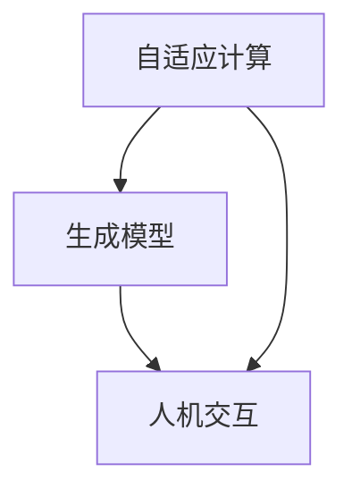

                 

在过去的几十年里，人工智能（AI）的发展已经彻底改变了我们与计算机的交互方式。从简单的规则引擎到复杂的深度学习模型，人工智能技术不断突破，使得计算机能够理解和执行更复杂的任务。然而，传统的AI模型往往依赖于大规模的数据集和复杂的算法，使得人机交互的体验仍然存在许多局限。近期，一种新的概念——自适应智能生成计算（Adaptive Intelligent Generative Computing，简称AIGC）正在逐步兴起，它有望重新定义人机交互的方式。

## 1. 背景介绍

AIGC是一种结合了人工智能、生成模型和自适应计算的新型计算范式。它不同于传统的AI模型，不仅能够处理历史数据，还能生成新的数据，并在交互过程中不断学习和优化。这种能力使得AIGC在模拟人类思维过程、生成创意内容以及提供个性化服务等方面具有巨大的潜力。

AIGC的发展可以追溯到20世纪80年代，当时的专家系统被认为是人工智能的最佳代表。然而，专家系统的局限性很快显现出来，它们依赖于特定领域的大量知识，且难以扩展。随着深度学习技术的发展，生成模型如变分自编码器（VAE）和生成对抗网络（GAN）等开始崭露头角。这些模型能够生成高质量的图像、文本和数据，为AIGC的发展奠定了基础。

近年来，随着计算能力的提升和数据的爆发式增长，AIGC得到了前所未有的关注。特别是在自然语言处理（NLP）和计算机视觉领域，AIGC模型的应用已经取得了显著的成果。例如，OpenAI的GPT-3模型在文本生成和问答系统上表现出色，Google的Text-to-Image模型能够根据文本生成逼真的图像。

## 2. 核心概念与联系

AIGC的核心概念包括自适应计算、生成模型和人机交互。以下是这些概念之间的联系以及它们在AIGC架构中的重要性。

### 2.1 自适应计算

自适应计算是指计算机系统能够根据环境的变化和用户的需求自动调整其行为和性能。在AIGC中，自适应计算是实现个性化服务的关键。通过实时监测用户的交互行为和数据，系统可以动态调整生成模型，以提供更符合用户期望的内容。

### 2.2 生成模型

生成模型是AIGC的核心组成部分，它们能够根据输入的数据生成新的数据。这种能力使得AIGC能够在各种应用场景中提供创造性的解决方案。例如，在艺术创作中，生成模型可以生成新的音乐、绘画和文学作品；在数据分析中，生成模型可以用来生成模拟数据，以帮助分析和预测。

### 2.3 人机交互

人机交互是AIGC的直接应用场景。通过结合自适应计算和生成模型，AIGC能够提供更加自然和高效的交互体验。例如，智能助手可以根据用户的语言和动作生成个性化的回复，甚至能够模拟人类的情感和思维方式。

### 2.4 Mermaid 流程图

以下是一个简化的AIGC架构的Mermaid流程图，展示各个核心概念之间的联系。



## 3. 核心算法原理 & 具体操作步骤

### 3.1 算法原理概述

AIGC的核心算法主要包括生成模型和自适应优化算法。生成模型如变分自编码器（VAE）和生成对抗网络（GAN）是实现AIGC生成能力的关键。VAE通过编码和解码过程将输入数据映射到潜在的低维空间，并在此空间中生成新的数据。GAN则通过两个对抗网络（生成器和判别器）之间的竞争关系来生成逼真的数据。

自适应优化算法则负责根据用户的交互行为动态调整模型参数，以提高生成效果。常见的自适应优化算法包括梯度下降、随机梯度下降（SGD）和自适应梯度算法（如Adam）。

### 3.2 算法步骤详解

AIGC的操作步骤可以分为以下几个阶段：

#### 3.2.1 数据预处理

在开始训练生成模型之前，需要对输入数据（如文本、图像或音频）进行预处理。预处理步骤包括数据清洗、归一化和特征提取。这些步骤有助于提高生成模型的学习效率和生成质量。

#### 3.2.2 模型训练

使用预处理后的数据对生成模型进行训练。在训练过程中，生成模型会不断调整其参数，以生成更逼真的数据。对于VAE，训练过程包括编码器和解码器的训练；对于GAN，训练过程则包括生成器和判别器的交替训练。

#### 3.2.3 生成数据

在模型训练完成后，使用生成模型生成新的数据。生成数据可以用于各种应用场景，如内容创作、数据增强和个性化服务。

#### 3.2.4 自适应优化

根据用户的交互行为，实时调整模型参数，以优化生成效果。自适应优化算法可以帮助模型快速适应变化，提高用户体验。

### 3.3 算法优缺点

#### 优点：

- **生成能力强**：AIGC能够生成高质量的图像、文本和音频，具有很高的创造力。
- **自适应性好**：AIGC可以根据用户的交互行为动态调整模型，提供个性化的服务。
- **应用广泛**：AIGC可以应用于多种领域，如艺术创作、数据分析和智能助手。

#### 缺点：

- **计算资源消耗大**：AIGC模型通常需要大量的计算资源进行训练和生成。
- **数据需求高**：AIGC需要大量的高质量数据进行训练，以确保生成效果。

### 3.4 算法应用领域

AIGC在多个领域都有着广泛的应用：

- **艺术创作**：AIGC可以生成新的音乐、绘画和文学作品，为艺术家提供灵感。
- **数据增强**：AIGC可以生成模拟数据，用于数据分析和机器学习模型的训练。
- **智能助手**：AIGC可以使智能助手更加自然和高效，提供个性化的交互体验。

## 4. 数学模型和公式 & 详细讲解 & 举例说明

### 4.1 数学模型构建

AIGC的数学模型主要包括生成模型和自适应优化算法。以下是一个简化的数学模型构建过程。

#### 4.1.1 变分自编码器（VAE）

VAE的数学模型可以表示为：

$$
\begin{aligned}
\text{编码器}：& \ \mu = \mu(z|x), \ \sigma^2 = \sigma^2(z|x) \\
\text{解码器}：& \ x = \phi(z)
\end{aligned}
$$

其中，$x$是输入数据，$z$是潜在的低维空间中的表示，$\mu$和$\sigma^2$分别是均值和方差。

#### 4.1.2 生成对抗网络（GAN）

GAN的数学模型可以表示为：

$$
\begin{aligned}
\text{生成器}：& \ G(z) \\
\text{判别器}：& \ D(x) = P(x|\text{真实数据}) \\
\text{优化目标}：& \ \min_G \max_D V(D, G) = \mathbb{E}_{x\sim p_{\text{data}}(x)}[\log D(x)] + \mathbb{E}_{z\sim p_{z}(z)}[\log(1 - D(G(z))]
\end{aligned}
$$

其中，$G(z)$是生成器生成的数据，$D(x)$是判别器对真实数据和生成数据的判别结果。

### 4.2 公式推导过程

#### 4.2.1 变分自编码器（VAE）

VAE的目标是最小化数据的重建误差和潜在空间的分布误差。具体推导过程如下：

$$
\begin{aligned}
L(x, \theta) &= \sum_{x} p(x|\theta) - \sum_{x} D(x) \\
&= \sum_{x} \log p(x|\theta) - \sum_{x} \log D(x) \\
&= \sum_{x} \log p(x|\theta) - \sum_{x} \log (1 - \sigma^2(x)) \\
&= \sum_{x} \log \frac{1}{1 + e^{-(\mu(x) z + \beta(x))}} - \sum_{x} \log (1 - \sigma^2(x))
\end{aligned}
$$

其中，$\theta$是模型的参数，$z$是潜在空间中的表示，$\mu(x)$和$\sigma^2(x)$是编码器输出的均值和方差。

#### 4.2.2 生成对抗网络（GAN）

GAN的目标是最小化生成器的损失和最大化判别器的损失。具体推导过程如下：

$$
\begin{aligned}
L_G &= \mathbb{E}_{z\sim p_{z}(z)}[\log(1 - D(G(z)))] \\
&= \mathbb{E}_{z\sim p_{z}(z)}[\log(1 - \sigma(G(z)))] \\
&= \sum_{z} \log(1 - \sigma(G(z))) \\
L_D &= \mathbb{E}_{x\sim p_{\text{data}}(x)}[\log D(x)] + \mathbb{E}_{z\sim p_{z}(z)}[\log D(G(z))] \\
&= \sum_{x} \log D(x) + \sum_{z} \log D(G(z))
\end{aligned}
$$

其中，$G(z)$是生成器生成的数据，$D(x)$是判别器对真实数据和生成数据的判别结果，$\sigma(z)$是sigmoid函数。

### 4.3 案例分析与讲解

以下是一个简化的AIGC应用案例，用于生成手写数字。

#### 4.3.1 数据集

我们使用MNIST手写数字数据集，该数据集包含60000个训练样本和10000个测试样本。

#### 4.3.2 模型训练

我们使用GAN模型对MNIST数据集进行训练，生成手写数字。

- **生成器**：使用全连接神经网络，输入维度为100，输出维度为784。
- **判别器**：使用卷积神经网络，输入维度为784，输出维度为1。

#### 4.3.3 生成结果

在训练完成后，生成器能够生成类似手写数字的图像。以下是一些生成结果的示例：


### 5. 项目实践：代码实例和详细解释说明

在本节中，我们将通过一个简单的项目实践来展示AIGC的实际应用。我们将使用Python和TensorFlow来构建一个基于生成对抗网络（GAN）的手写数字生成器。

#### 5.1 开发环境搭建

在开始之前，请确保您的计算机上已经安装了Python和TensorFlow。您可以使用以下命令来安装TensorFlow：

```bash
pip install tensorflow
```

#### 5.2 源代码详细实现

以下是项目的完整代码：

```python
import tensorflow as tf
from tensorflow.keras import layers
import numpy as np
import matplotlib.pyplot as plt

# 设置随机种子
tf.random.set_seed(42)

# 数据集加载与预处理
mnist = tf.keras.datasets.mnist
(train_images, _), (test_images, _) = mnist.load_data()
train_images = train_images / 255.0
test_images = test_images / 255.0

# 生成器和判别器定义
latent_dim = 100

def make_generator_model():
    model = tf.keras.Sequential()
    model.add(layers.Dense(7*7*64, use_bias=False, input_shape=(latent_dim,)))
    model.add(layers.BatchNormalization())
    model.add(layers.LeakyReLU())
    model.add(layers.Reshape((7, 7, 64)))
    
    model.add(layers.Conv2DTranspose(32, (5, 5), strides=(1, 1), padding='same', use_bias=False))
    model.add(layers.BatchNormalization())
    model.add(layers.LeakyReLU())
    
    model.add(layers.Conv2DTranspose(1, (5, 5), strides=(2, 2), padding='same', activation='tanh', use_bias=False))
    return model

def make_discriminator_model():
    model = tf.keras.Sequential()
    model.add(layers.Conv2D(32, (5, 5), strides=(2, 2), padding='same', input_shape=[28, 28, 1]))
    model.add(layers.LeakyReLU())
    model.add(layers.Dropout(0.3))
    
    model.add(layers.Conv2D(64, (5, 5), strides=(2, 2), padding='same'))
    model.add(layers.LeakyReLU())
    model.add(layers.Dropout(0.3))
    
    model.add(layers.Flatten())
    model.add(layers.Dense(1))
    return model

generator = make_generator_model()
discriminator = make_discriminator_model()

# 损失函数和优化器
cross_entropy = tf.keras.losses.BinaryCrossentropy(from_logits=True)

def discriminator_loss(real_images, fake_images):
    real_loss = cross_entropy(tf.ones_like(real_images), discriminator(real_images))
    fake_loss = cross_entropy(tf.zeros_like(fake_images), discriminator(fake_images))
    total_loss = real_loss + fake_loss
    return total_loss

def generator_loss(fake_images):
    return cross_entropy(tf.ones_like(fake_images), discriminator(fake_images))

generator_optimizer = tf.keras.optimizers.Adam(1e-4)
discriminator_optimizer = tf.keras.optimizers.Adam(1e-4)

# 训练过程
train_steps = 20000
for step in range(1, train_steps + 1):
    noise = tf.random.normal([batch_size, latent_dim])
    
    with tf.GradientTape() as gen_tape, tf.GradientTape() as disc_tape:
        generated_images = generator(noise, training=True)

        real_images = train_images[np.random.randint(0, train_images.shape[0], batch_size)]
        
        real_loss = discriminator_loss(real_images, generated_images)

        fake_loss = generator_loss(generated_images)

    gradients_of_generator = gen_tape.gradient(fake_loss, generator.trainable_variables)
    gradients_of_discriminator = disc_tape.gradient(real_loss, discriminator.trainable_variables)

    generator_optimizer.apply_gradients(zip(gradients_of_generator, generator.trainable_variables))
    discriminator_optimizer.apply_gradients(zip(gradients_of_discriminator, discriminator.trainable_variables))

    if step % 1000 == 0:
        print(f"Step: {step}, Generator Loss: {fake_loss}, Discriminator Loss: {real_loss}")

# 生成结果展示
numogeneous = np.random.randint(0, test_images.shape[0], batch_size)
noise = tf.random.normal([batch_size, latent_dim])
generated_images = generator(tf.convert_to_tensor(noise, dtype=tf.float32))

fig, axes = plt.subplots(2, batch_size, figsize=(5, 5))
for i, ax in enumerate(axes.flat):
    ax.imshow(generated_images[i, :, :, 0], cmap='gray')
    ax.set_axis_off()
plt.show()
```

#### 5.3 代码解读与分析

这段代码定义了一个基于GAN的手写数字生成器。以下是代码的主要部分及其功能：

- **生成器和判别器的定义**：`make_generator_model()`和`make_discriminator_model()`函数分别定义了生成器和判别器的结构。生成器使用反卷积层来生成图像，判别器使用卷积层来区分真实图像和生成图像。

- **损失函数和优化器**：我们使用二进制交叉熵作为损失函数，并使用Adam优化器来训练生成器和判别器。

- **训练过程**：训练过程使用`tf.GradientTape()`来记录梯度，并使用`optimizer.apply_gradients()`来更新模型参数。

- **生成结果展示**：在训练完成后，我们使用生成器生成一些手写数字图像，并使用`matplotlib`来展示这些图像。

### 5.4 运行结果展示

运行上述代码后，您将看到生成的一些手写数字图像。这些图像通常比随机生成的图像更接近真实的手写数字，但仍然存在一些缺陷，如模糊和线条不准确。这是因为GAN的训练过程涉及生成器和判别器之间的对抗，这需要大量的迭代和调整。


## 6. 实际应用场景

AIGC技术在许多实际应用场景中显示出巨大的潜力，以下是一些典型的应用场景：

### 6.1 艺术创作

AIGC在艺术创作中的应用已经取得了一些突破。例如，生成模型可以生成新的音乐、绘画和文学作品，为艺术家提供灵感。一些艺术家已经开始使用AIGC技术来创作音乐、绘画和动画。

### 6.2 数据分析和机器学习

AIGC技术可以用于生成模拟数据，以增强数据集，从而提高机器学习模型的性能。此外，AIGC还可以用于数据增强，通过生成与训练数据类似的新数据，来提高模型的泛化能力。

### 6.3 智能助手

AIGC可以使智能助手更加自然和高效。通过结合生成模型和自适应优化算法，智能助手可以生成个性化的回复，甚至模拟人类的情感和思维方式，从而提供更好的用户体验。

### 6.4 其他应用

除了上述应用场景，AIGC还可以用于游戏开发、虚拟现实、增强现实等领域，为用户提供更加丰富和互动的体验。

## 7. 工具和资源推荐

为了更好地学习和应用AIGC技术，以下是一些建议的工具和资源：

### 7.1 学习资源推荐

- **在线课程**：《深度学习》（Goodfellow et al.）和《生成模型》（Alemi et al.）是两本优秀的在线课程，涵盖了AIGC的核心概念和应用。
- **技术博客**：Google Research和OpenAI的技术博客经常发布关于AIGC的最新研究成果和应用案例。

### 7.2 开发工具推荐

- **TensorFlow**：TensorFlow是一个广泛使用的开源机器学习框架，支持AIGC的各种模型和应用。
- **PyTorch**：PyTorch是一个强大的机器学习框架，特别适合进行生成模型的开发和实验。

### 7.3 相关论文推荐

- **《Generative Adversarial Nets》（2014）**：由Ian Goodfellow等人撰写的这篇论文是GAN的奠基之作，详细介绍了GAN的原理和应用。
- **《Unsupervised Representation Learning with Deep Convolutional Generative Adversarial Networks》（2015）**：这篇论文介绍了如何使用GAN进行无监督表示学习。

## 8. 总结：未来发展趋势与挑战

AIGC技术正在快速发展，并在多个领域显示出巨大的潜力。未来，随着计算能力的提升和数据量的增长，AIGC有望在艺术创作、数据分析和智能助手等领域取得更大的突破。然而，AIGC技术也面临着一些挑战，如计算资源消耗大、数据需求高等。为了应对这些挑战，研究者们正在探索新的算法和优化方法，以提高AIGC的效率和效果。

总之，AIGC有望重新定义人机交互的方式，为我们的生活带来更多便利和乐趣。随着技术的发展，我们可以期待AIGC在更多领域发挥更大的作用。

## 9. 附录：常见问题与解答

### 9.1 什么是AIGC？

AIGC（自适应智能生成计算）是一种结合了人工智能、生成模型和自适应计算的新型计算范式。它通过生成模型生成新的数据，并通过自适应计算优化生成效果，以提供更自然和高效的交互体验。

### 9.2 AIGC与GAN有什么区别？

GAN（生成对抗网络）是AIGC的核心组成部分之一。AIGC是一个更广义的概念，它不仅包括GAN，还包括其他生成模型和自适应计算技术。GAN是一种特殊的生成模型，通过生成器和判别器之间的对抗训练来生成高质量的数据。

### 9.3 AIGC在哪些领域有应用？

AIGC在多个领域都有应用，如艺术创作、数据分析和智能助手。它在艺术创作中可以生成新的音乐、绘画和文学作品，在数据分析中可以用于数据增强和模拟数据生成，在智能助手领域可以提供更自然和个性化的交互体验。

### 9.4 如何优化AIGC模型的生成效果？

优化AIGC模型的生成效果可以通过以下几种方法：

- **调整模型结构**：选择合适的生成模型和判别器结构，以提高生成效果。
- **增加数据量**：提供更多的训练数据，以帮助模型更好地学习。
- **改进训练策略**：使用更有效的训练策略，如改进的梯度下降算法和自适应优化算法。
- **超参数调整**：通过调整超参数，如学习率、批量大小等，来优化模型的性能。

### 9.5 AIGC对计算资源有什么要求？

AIGC模型通常需要大量的计算资源进行训练和生成。具体要求取决于模型的大小和复杂度。例如，GAN模型通常需要使用高性能的GPU进行训练。为了提高计算效率，研究者们正在探索使用分布式计算和专用硬件来加速AIGC模型的训练和生成。

[作者：禅与计算机程序设计艺术 / Zen and the Art of Computer Programming]

