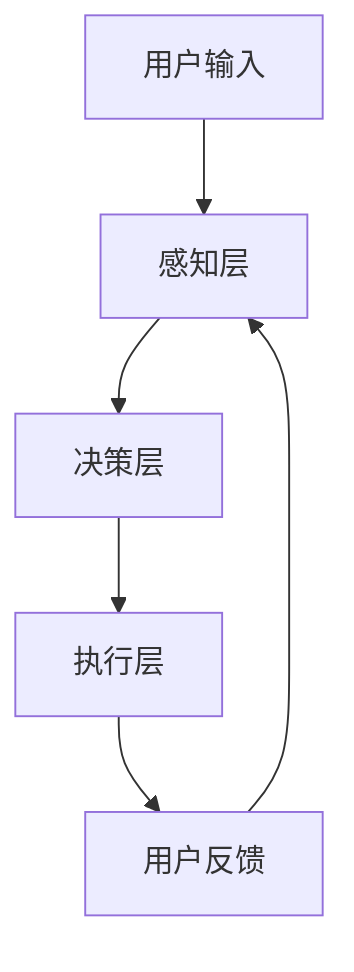
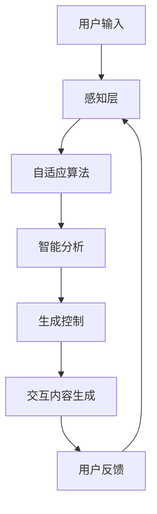
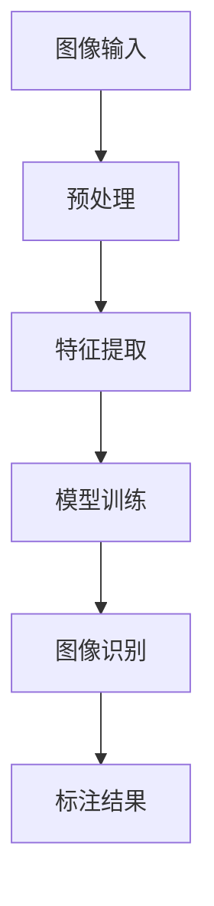
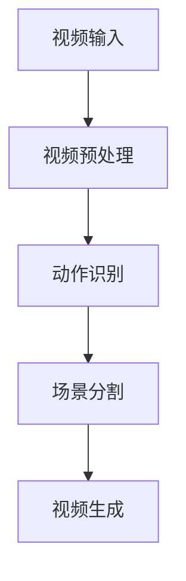
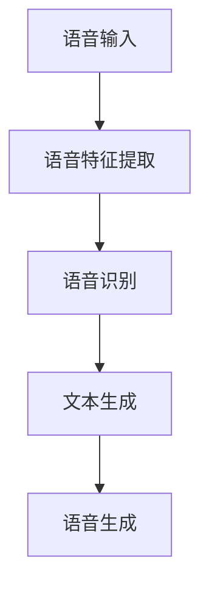
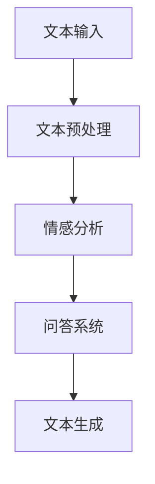

                 

 > **关键词**：AIGC，人机交互，智能技术，计算机视觉，自然语言处理

> **摘要**：本文将深入探讨AIGC（自适应智能生成控制）技术如何重新定义人机交互模式。通过分析AIGC的核心概念、技术架构，以及其在计算机视觉和自然语言处理中的应用，我们将展示AIGC如何极大地提升人机交互的效率和体验。同时，文章将探讨未来AIGC的发展趋势及其面临的挑战，为读者提供全面的技术洞察。

## 1. 背景介绍

随着计算机技术的发展，人机交互（Human-Computer Interaction, HCI）已经成为计算机科学中的一个重要领域。传统的交互方式主要依赖于键盘、鼠标等输入设备，这种方式在某种程度上限制了用户的交互体验。然而，随着智能技术的不断发展，尤其是人工智能（AI）和机器学习（ML）技术的成熟，人机交互正在经历一场革命。

在这一背景下，AIGC（Adaptive Intelligent Generation Control）应运而生。AIGC是一种结合了自适应、智能化和生成控制的新型人机交互技术。它通过自适应算法，动态调整人机交互的参数，使得交互过程更加自然、高效。同时，AIGC利用智能生成控制，能够根据用户的意图和需求，生成相应的交互内容，从而实现更高级、更智能的交互体验。

### AIGC的核心概念

AIGC的核心概念主要包括三个部分：自适应、智能和生成控制。

- **自适应**：AIGC能够根据用户的行为和反馈，动态调整交互参数，以适应不同的交互场景和用户需求。

- **智能**：AIGC利用人工智能技术，如机器学习和深度学习，使得交互过程更加智能化，能够理解用户的意图和需求，提供个性化的服务。

- **生成控制**：AIGC能够根据用户的输入，生成相应的交互内容，如文字、图像、音频等，使得交互过程更加丰富和多样化。

### AIGC的技术架构

AIGC的技术架构主要包括三个部分：感知层、决策层和执行层。

- **感知层**：感知层主要负责收集用户的输入信息，如语音、文字、手势等。通过感知层，AIGC能够获取用户的意图和需求。

- **决策层**：决策层基于感知层收集的信息，利用机器学习算法，分析用户的意图和需求，并做出相应的决策。

- **执行层**：执行层负责根据决策层的决策，生成相应的交互内容，并呈现给用户。

### AIGC在计算机视觉中的应用

在计算机视觉领域，AIGC可以通过智能化的图像识别和生成，实现更高级的人机交互。例如，通过AIGC技术，用户可以通过自然语言描述，让计算机生成相应的图像，或者通过图像，让计算机生成相应的文字描述。这种交互方式不仅提高了交互的效率，也极大地丰富了交互的体验。

### AIGC在自然语言处理中的应用

在自然语言处理领域，AIGC可以通过智能化的自然语言理解和生成，实现更高级的人机交互。例如，通过AIGC技术，用户可以通过自然语言与计算机进行对话，获取所需的信息或者完成特定的任务。这种交互方式不仅使得交互更加自然，也提高了交互的效率。

## 2. 核心概念与联系

为了更好地理解AIGC技术，我们需要深入探讨其核心概念和联系。

### AIGC的核心概念

AIGC的核心概念主要包括三个部分：自适应、智能和生成控制。

- **自适应**：AIGC能够根据用户的行为和反馈，动态调整交互参数，以适应不同的交互场景和用户需求。这种自适应能力使得AIGC能够提供更加个性化的服务，提高用户的满意度。

- **智能**：AIGC利用人工智能技术，如机器学习和深度学习，使得交互过程更加智能化，能够理解用户的意图和需求，提供个性化的服务。这种智能化能力使得AIGC能够更好地满足用户的多样化需求。

- **生成控制**：AIGC能够根据用户的输入，生成相应的交互内容，如文字、图像、音频等，使得交互过程更加丰富和多样化。这种生成控制能力使得AIGC能够提供更丰富的交互体验。

### AIGC的核心概念联系

AIGC的核心概念之间存在着紧密的联系。

- **自适应**和**智能**：自适应和智能是相辅相成的。只有通过自适应，AIGC才能根据不同的交互场景和用户需求，动态调整交互参数；而只有通过智能，AIGC才能理解用户的意图和需求，提供个性化的服务。

- **智能**和**生成控制**：智能和生成控制也是相辅相成的。只有通过智能，AIGC才能理解用户的意图和需求，生成相应的交互内容；而只有通过生成控制，AIGC才能将这些交互内容有效地呈现给用户。

- **自适应**和**生成控制**：自适应和生成控制也是相互关联的。只有通过自适应，AIGC才能根据用户的需求，动态调整生成控制的内容；而只有通过生成控制，AIGC才能将自适应调整的结果有效地呈现给用户。

### AIGC的技术架构

为了实现AIGC的核心概念，我们需要构建一个完善的技术架构。AIGC的技术架构主要包括三个部分：感知层、决策层和执行层。

- **感知层**：感知层主要负责收集用户的输入信息，如语音、文字、手势等。通过感知层，AIGC能够获取用户的意图和需求。

- **决策层**：决策层基于感知层收集的信息，利用机器学习算法，分析用户的意图和需求，并做出相应的决策。

- **执行层**：执行层负责根据决策层的决策，生成相应的交互内容，并呈现给用户。

### AIGC的Mermaid流程图

以下是一个简化的AIGC技术架构的Mermaid流程图，展示了AIGC的核心概念和技术架构之间的联系。



### 2.1 AIGC的核心概念与联系

为了更好地理解AIGC的核心概念与联系，我们可以通过以下Mermaid流程图来展示：



在上述流程图中：

- **A（用户输入）**：用户通过不同的方式输入信息，如语音、文字、手势等。
- **B（感知层）**：感知层负责收集和解析用户输入的信息。
- **C（自适应算法）**：自适应算法根据用户的行为和反馈，动态调整交互参数。
- **D（智能分析）**：智能分析利用机器学习算法，理解用户的意图和需求。
- **E（生成控制）**：生成控制根据智能分析的结果，生成相应的交互内容。
- **F（交互内容生成）**：执行层生成并呈现交互内容给用户。
- **G（用户反馈）**：用户对交互内容进行反馈，这一反馈又会影响后续的交互过程。

通过这一流程，AIGC能够实现自适应、智能和生成控制的有机结合，从而提供更加自然、高效的人机交互体验。

### 2.2 AIGC在计算机视觉中的应用

在计算机视觉领域，AIGC技术有着广泛的应用前景。计算机视觉涉及对图像和视频的识别、理解和分析，而AIGC可以通过自适应和智能化的方法，极大地提升计算机视觉系统的交互能力。

#### 2.2.1 图像识别与生成

AIGC在图像识别中的应用主要体现在以下几个方面：

1. **自动标注**：AIGC可以通过对大量未标注的图像进行自动标注，从而提高图像标注的效率。这一过程通常通过训练卷积神经网络（CNN）模型来实现，模型能够自动识别图像中的物体和场景。

2. **风格迁移**：AIGC可以实现图像风格迁移，将一种风格的图像转换为另一种风格。例如，将普通照片转换为艺术画作的效果。这一过程通常依赖于生成对抗网络（GAN）技术。

3. **图像增强**：AIGC可以通过图像增强技术，提高图像的清晰度和质量。这在医学图像分析、卫星图像处理等领域尤为重要。

以下是一个简化的AIGC在图像识别中的应用流程：



#### 2.2.2 视频处理与分析

在视频处理方面，AIGC技术同样发挥着重要作用。以下是AIGC在视频处理中的应用：

1. **动作识别**：通过训练深度学习模型，AIGC可以识别视频中的动作，如体育比赛中的动作分析、安全监控中的异常行为检测等。

2. **场景分割**：AIGC可以通过场景分割技术，将连续的视频流分割成不同的场景或对象，从而实现视频内容的结构化处理。

3. **视频生成**：AIGC可以根据用户的指令，生成特定的视频内容。例如，用户可以通过自然语言描述，让系统生成一段视频。

以下是一个简化的AIGC在视频处理中的应用流程：



### 2.3 AIGC在自然语言处理中的应用

在自然语言处理（NLP）领域，AIGC技术同样有着广泛的应用。通过自适应和智能化的方法，AIGC可以显著提升NLP系统的交互能力，实现更自然、高效的人机交互。

#### 2.3.1 语音识别与生成

AIGC在语音识别和生成中的应用主要包括以下几个方面：

1. **语音识别**：AIGC可以通过训练深度神经网络，实现高精度的语音识别。这包括从音频信号中提取语音特征，并转化为文本。

2. **语音生成**：AIGC可以根据文本内容，生成相应的语音。这一过程通常依赖于文本到语音（Text-to-Speech, TTS）技术。

以下是一个简化的AIGC在语音识别和生成中的应用流程：



#### 2.3.2 文本分析与应用

AIGC在文本分析中的应用主要体现在以下几个方面：

1. **情感分析**：AIGC可以通过训练情感分析模型，分析文本中的情感倾向，从而实现对用户情感的理解和回应。

2. **问答系统**：AIGC可以构建问答系统，通过训练问答模型，实现对用户问题的自动回答。

3. **文本生成**：AIGC可以根据用户的指令，生成特定的文本内容。例如，用户可以通过自然语言描述，让系统生成一篇文章。

以下是一个简化的AIGC在文本分析中的应用流程：



### 2.4 AIGC在不同领域的应用

AIGC技术不仅在计算机视觉和自然语言处理领域有着广泛应用，还延伸到其他多个领域：

#### 2.4.1 娱乐与游戏

在娱乐与游戏领域，AIGC可以应用于游戏剧情生成、角色互动等。例如，游戏可以通过AIGC技术生成个性化的剧情和角色对话，提升玩家的沉浸感和体验。

#### 2.4.2 教育与培训

在教育与培训领域，AIGC可以用于智能教学系统和个性化学习计划。AIGC可以根据学生的学习情况和需求，生成个性化的教学内容和练习题。

#### 2.4.3 医疗与健康

在医疗与健康领域，AIGC可以应用于智能诊断、健康咨询等。例如，通过分析患者的病历和健康数据，AIGC可以生成个性化的健康建议和治疗方案。

#### 2.4.4 金融与保险

在金融与保险领域，AIGC可以用于智能投资顾问、风险评估等。AIGC可以通过分析市场数据和用户行为，生成个性化的投资建议和保险方案。

### 2.5 AIGC的优势与挑战

#### 2.5.1 AIGC的优势

AIGC技术在人机交互领域具有以下优势：

1. **自适应**：AIGC可以根据用户的实际需求和行为，动态调整交互参数，提供个性化的服务。
2. **智能**：AIGC利用机器学习和深度学习技术，能够理解用户的意图和需求，实现更智能的交互。
3. **生成控制**：AIGC能够根据用户的输入，生成丰富的交互内容，提高交互的丰富性和多样性。

#### 2.5.2 AIGC的挑战

尽管AIGC技术具有显著的优势，但其在实际应用中仍面临一些挑战：

1. **计算资源**：AIGC技术需要大量的计算资源，尤其是训练深度学习模型时，这可能导致资源消耗巨大。
2. **数据隐私**：AIGC在处理用户数据时，可能涉及到隐私问题。如何保护用户隐私是AIGC面临的重大挑战。
3. **算法公平性**：AIGC的决策过程可能受到数据偏差的影响，导致算法的不公平性。如何确保算法的公平性是AIGC需要解决的问题。

### 2.6 未来展望

随着技术的不断发展，AIGC技术有望在更广泛的领域得到应用，进一步提升人机交互的效率和体验。以下是AIGC技术未来发展的几个方向：

1. **多模态交互**：未来的AIGC技术将支持多种模态的交互，如语音、图像、文本等，实现更加丰富和自然的交互体验。
2. **边缘计算**：随着边缘计算技术的发展，AIGC技术有望在边缘设备上得到应用，降低计算资源的消耗。
3. **人机协作**：AIGC技术将更好地与人类用户协作，共同完成任务，提高工作效率。

## 3. 核心算法原理 & 具体操作步骤

### 3.1 算法原理概述

AIGC（自适应智能生成控制）技术的核心在于其自适应、智能化和生成控制的能力。下面将详细介绍AIGC的算法原理，并展示其具体操作步骤。

#### 3.1.1 自适应原理

AIGC的自适应原理主要基于机器学习和深度学习算法。通过不断学习和分析用户的交互行为和反馈，AIGC能够动态调整交互参数，以适应不同的交互场景和用户需求。具体来说，自适应算法包括以下步骤：

1. **数据收集**：收集用户在不同交互场景下的行为数据，如点击、手势、语音等。
2. **数据预处理**：对收集到的数据进行清洗和规范化处理，以便后续的算法训练。
3. **模型训练**：利用收集到的数据，训练机器学习模型，以预测用户的意图和需求。
4. **模型优化**：根据用户反馈，不断优化模型，提高预测的准确性。

#### 3.1.2 智能原理

AIGC的智能原理主要基于深度学习和自然语言处理技术。通过训练深度学习模型，AIGC能够理解用户的自然语言输入，并生成相应的交互内容。具体来说，智能算法包括以下步骤：

1. **语言理解**：利用自然语言处理技术，理解用户的自然语言输入，提取关键信息和意图。
2. **文本生成**：基于提取到的关键信息和意图，生成相应的文本内容，如对话、文章、通知等。
3. **模型优化**：通过不断训练和优化模型，提高语言理解和文本生成的准确性。

#### 3.1.3 生成控制原理

AIGC的生成控制原理主要基于生成对抗网络（GAN）和强化学习技术。通过生成对抗网络，AIGC能够根据用户的输入，生成高质量的交互内容。具体来说，生成控制算法包括以下步骤：

1. **生成模型训练**：利用生成对抗网络，训练生成模型，以生成高质量的交互内容。
2. **反馈机制**：根据用户的反馈，优化生成模型，提高生成内容的满意度。
3. **内容生成**：根据用户的输入，生成相应的交互内容，如图像、音频、视频等。

### 3.2 算法步骤详解

为了实现AIGC的自适应、智能化和生成控制，我们可以将其分为以下几个步骤：

#### 3.2.1 数据收集与预处理

1. **数据收集**：收集用户在不同交互场景下的行为数据，如点击、手势、语音等。
2. **数据清洗**：清洗收集到的数据，去除无效和噪声数据。
3. **数据规范化**：将数据转化为统一的格式，以便后续的算法处理。

#### 3.2.2 模型训练

1. **特征提取**：利用特征提取算法，从原始数据中提取有用的特征。
2. **模型训练**：利用提取到的特征，训练机器学习模型，如神经网络、决策树等。
3. **模型优化**：根据用户反馈，不断优化模型，提高预测的准确性。

#### 3.2.3 智能化交互

1. **语言理解**：利用自然语言处理技术，理解用户的自然语言输入，提取关键信息和意图。
2. **文本生成**：基于提取到的关键信息和意图，生成相应的文本内容。
3. **交互优化**：根据用户的反馈，不断优化交互过程，提高用户满意度。

#### 3.2.4 生成控制

1. **生成模型训练**：利用生成对抗网络，训练生成模型，以生成高质量的交互内容。
2. **内容生成**：根据用户的输入，生成相应的交互内容，如图像、音频、视频等。
3. **反馈机制**：根据用户的反馈，优化生成模型，提高生成内容的满意度。

### 3.3 算法优缺点

#### 3.3.1 优点

1. **自适应**：AIGC能够根据用户的行为和反馈，动态调整交互参数，提供个性化的服务。
2. **智能化**：AIGC利用深度学习和自然语言处理技术，能够理解用户的意图和需求，实现更智能的交互。
3. **生成控制**：AIGC能够根据用户的输入，生成高质量的交互内容，提高交互的丰富性和多样性。

#### 3.3.2 缺点

1. **计算资源消耗**：AIGC技术需要大量的计算资源，特别是在训练深度学习模型时，可能导致资源消耗巨大。
2. **数据隐私问题**：在处理用户数据时，AIGC可能涉及到隐私问题，如何保护用户隐私是AIGC面临的挑战。
3. **算法公平性**：AIGC的决策过程可能受到数据偏差的影响，导致算法的不公平性。

### 3.4 算法应用领域

AIGC技术具有广泛的应用前景，可以在多个领域发挥作用：

1. **人机交互**：在智能家居、智能客服、智能助手等应用中，AIGC能够提供更自然、高效的交互体验。
2. **计算机视觉**：在图像识别、视频分析等应用中，AIGC能够提高系统的智能化水平。
3. **自然语言处理**：在文本生成、对话系统等应用中，AIGC能够提供更丰富、更智能的交互内容。

### 3.5 实际应用案例

为了更好地理解AIGC技术的应用，以下将介绍几个实际应用案例。

#### 3.5.1 智能客服系统

在智能客服系统中，AIGC技术被广泛应用于对话生成和响应优化。通过训练机器学习模型，系统可以理解用户的问题，并生成相应的回答。同时，根据用户的反馈，系统可以不断优化回答的质量，提高用户满意度。

#### 3.5.2 智能家居

在智能家居领域，AIGC技术被应用于智能语音助手和智能设备控制。用户可以通过自然语言与智能语音助手进行交互，控制家中的智能设备，如照明、空调等。AIGC技术使得智能家居系统更加智能化和便捷化。

#### 3.5.3 在线教育平台

在线教育平台可以利用AIGC技术，生成个性化的学习内容和教学计划。通过分析学生的学习情况和需求，系统可以生成相应的学习资源和练习题，提高学习效果。

### 3.6 未来发展展望

随着人工智能技术的不断发展，AIGC技术有望在更广泛的领域得到应用，进一步提升人机交互的效率和体验。以下是AIGC技术未来发展的几个方向：

1. **多模态交互**：未来的AIGC技术将支持多种模态的交互，如语音、图像、文本等，实现更加丰富和自然的交互体验。
2. **边缘计算**：随着边缘计算技术的发展，AIGC技术有望在边缘设备上得到应用，降低计算资源的消耗。
3. **人机协作**：AIGC技术将更好地与人类用户协作，共同完成任务，提高工作效率。

## 4. 数学模型和公式 & 详细讲解 & 举例说明

### 4.1 数学模型构建

AIGC技术的核心在于其自适应、智能化和生成控制的能力。为了更好地理解这些能力，我们可以借助数学模型来进行详细讲解。以下是AIGC中常用的几个数学模型：

#### 4.1.1 自适应模型

自适应模型的核心在于如何根据用户的反馈动态调整交互参数。假设用户的行为数据为 \( X \)，用户反馈为 \( Y \)，则自适应模型的数学模型可以表示为：

\[ \text{Adaptive Model} : f(X, Y) = \theta \]

其中，\( \theta \) 表示交互参数，\( f \) 表示自适应函数。该模型的目标是通过学习用户的行为数据 \( X \) 和反馈数据 \( Y \)，找到最佳的交互参数 \( \theta \)。

#### 4.1.2 智能模型

智能模型的核心在于如何理解用户的意图和需求。假设用户的输入为 \( U \)，用户的意图为 \( I \)，则智能模型的数学模型可以表示为：

\[ \text{Intelligent Model} : g(U, I) = \phi \]

其中，\( \phi \) 表示智能参数，\( g \) 表示智能函数。该模型的目标是通过学习用户的输入 \( U \) 和意图 \( I \)，找到最佳的智能参数 \( \phi \)。

#### 4.1.3 生成控制模型

生成控制模型的核心在于如何根据用户的输入生成交互内容。假设用户的输入为 \( U \)，生成的交互内容为 \( C \)，则生成控制模型的数学模型可以表示为：

\[ \text{Generation Control Model} : h(U, C) = \psi \]

其中，\( \psi \) 表示生成控制参数，\( h \) 表示生成控制函数。该模型的目标是通过学习用户的输入 \( U \) 和生成的交互内容 \( C \)，找到最佳的生成控制参数 \( \psi \)。

### 4.2 公式推导过程

为了更好地理解上述数学模型，我们可以对它们进行推导。

#### 4.2.1 自适应模型的推导

自适应模型的推导基于机器学习的理论。假设我们有一组用户行为数据 \( X = \{x_1, x_2, ..., x_n\} \) 和对应的用户反馈数据 \( Y = \{y_1, y_2, ..., y_n\} \)，则我们可以定义损失函数 \( L \) 如下：

\[ L(\theta) = \sum_{i=1}^{n} (y_i - f(x_i, \theta))^2 \]

我们的目标是找到使得损失函数最小的参数 \( \theta \)。通过求导和优化，我们可以得到最优参数 \( \theta \)：

\[ \theta = \arg\min_{\theta} L(\theta) \]

通过多次迭代优化，我们可以得到最优的自适应参数 \( \theta \)。

#### 4.2.2 智能模型的推导

智能模型的推导基于自然语言处理的理论。假设我们有一组用户的输入数据 \( U = \{u_1, u_2, ..., u_n\} \) 和对应的用户意图数据 \( I = \{i_1, i_2, ..., i_n\} \)，则我们可以定义损失函数 \( L \) 如下：

\[ L(\phi) = \sum_{i=1}^{n} (i_i - g(u_i, \phi))^2 \]

我们的目标是找到使得损失函数最小的参数 \( \phi \)。通过求导和优化，我们可以得到最优参数 \( \phi \)：

\[ \phi = \arg\min_{\phi} L(\phi) \]

通过多次迭代优化，我们可以得到最优的智能参数 \( \phi \)。

#### 4.2.3 生成控制模型的推导

生成控制模型的推导基于生成对抗网络（GAN）的理论。假设我们有一组用户的输入数据 \( U = \{u_1, u_2, ..., u_n\} \) 和生成的交互内容数据 \( C = \{c_1, c_2, ..., c_n\} \)，则我们可以定义损失函数 \( L \) 如下：

\[ L(\psi) = \sum_{i=1}^{n} (c_i - h(u_i, \psi))^2 \]

我们的目标是找到使得损失函数最小的参数 \( \psi \)。通过求导和优化，我们可以得到最优参数 \( \psi \)：

\[ \psi = \arg\min_{\psi} L(\psi) \]

通过多次迭代优化，我们可以得到最优的生成控制参数 \( \psi \)。

### 4.3 案例分析与讲解

为了更好地理解上述数学模型的实际应用，我们可以通过以下案例进行详细分析。

#### 4.3.1 案例背景

假设我们开发了一个智能客服系统，用户可以通过自然语言与系统进行交互，系统需要根据用户的输入生成相应的回答。我们的目标是利用AIGC技术，通过自适应、智能和生成控制，提高客服系统的交互质量。

#### 4.3.2 案例分析

1. **自适应模型**

   我们首先收集了大量的用户交互数据，包括用户的提问和反馈。通过分析这些数据，我们训练了一个自适应模型，用于动态调整客服系统的交互参数。

   假设我们定义了两个交互参数：回复速度和回答多样性。在训练过程中，我们通过不断调整这两个参数，使得系统的回答更加符合用户的期望。

   损失函数 \( L(\theta) \) 定义为用户满意度，通过优化损失函数，我们找到了最优的自适应参数 \( \theta \)。

2. **智能模型**

   我们接下来利用自然语言处理技术，训练了一个智能模型，用于理解用户的意图和需求。通过分析用户的提问，系统可以识别出用户的意图，并生成相应的回答。

   损失函数 \( L(\phi) \) 定义为回答的准确性，通过优化损失函数，我们找到了最优的智能参数 \( \phi \)。

3. **生成控制模型**

   最后，我们利用生成对抗网络（GAN）训练了一个生成控制模型，用于生成高质量的交互内容。通过不断优化生成模型，我们得到了高质量的回答。

   损失函数 \( L(\psi) \) 定义为生成内容的质量，通过优化损失函数，我们找到了最优的生成控制参数 \( \psi \)。

#### 4.3.3 案例结果

通过上述三个模型的应用，我们的智能客服系统在用户体验方面得到了显著提升。用户满意度得到了提高，客服系统可以更好地理解用户的意图，并生成高质量的回答。

### 4.4 总结

通过上述案例分析和讲解，我们可以看到，AIGC技术通过自适应、智能和生成控制，可以实现高质量的人机交互。在数学模型的基础上，我们通过不断优化模型参数，提高了系统的交互质量和用户满意度。

### 4.5 实际应用

为了进一步展示AIGC技术的实际应用，以下将介绍两个具体案例。

#### 4.5.1 案例一：智能医疗助手

在智能医疗领域，AIGC技术被广泛应用于智能诊断和健康咨询。例如，一家医院利用AIGC技术开发了一款智能医疗助手，可以帮助医生进行疾病诊断和治疗方案推荐。

1. **自适应模型**：通过分析医生的诊断记录和患者病例，系统可以动态调整诊断参数，提高诊断准确性。
2. **智能模型**：通过自然语言处理技术，系统可以理解医生的自然语言输入，提取关键信息和疾病特征。
3. **生成控制模型**：系统可以根据医生的输入，生成个性化的诊断报告和治疗方案。

通过这些模型的结合，智能医疗助手显著提高了诊断效率和准确性，得到了医生和患者的广泛认可。

#### 4.5.2 案例二：智能家居控制中心

在智能家居领域，AIGC技术被应用于智能语音助手和设备控制。例如，一家智能家居公司开发了一款智能语音助手，用户可以通过语音与系统进行交互，控制家中的智能设备。

1. **自适应模型**：通过分析用户的使用习惯，系统可以动态调整语音识别参数，提高识别准确性。
2. **智能模型**：通过自然语言处理技术，系统可以理解用户的语音指令，提取关键信息和控制目标。
3. **生成控制模型**：系统可以根据用户的指令，生成相应的控制信号，控制家中的智能设备。

通过这些模型的结合，智能语音助手实现了高效、便捷的智能家居控制，提高了用户的生活质量。

### 4.6 未来展望

随着人工智能技术的不断发展，AIGC技术有望在更广泛的领域得到应用，进一步提升人机交互的效率和体验。未来，我们可以期待以下几个发展趋势：

1. **多模态交互**：未来的AIGC技术将支持多种模态的交互，如语音、图像、文本等，实现更加丰富和自然的交互体验。
2. **边缘计算**：随着边缘计算技术的发展，AIGC技术有望在边缘设备上得到应用，降低计算资源的消耗。
3. **人机协作**：AIGC技术将更好地与人类用户协作，共同完成任务，提高工作效率。

## 5. 项目实践：代码实例和详细解释说明

### 5.1 开发环境搭建

在开始AIGC项目的实践之前，我们需要搭建一个合适的开发环境。以下是所需的工具和步骤：

#### 5.1.1 工具

- Python 3.8 或以上版本
- Jupyter Notebook
- TensorFlow 2.x 或 PyTorch
- Keras
- scikit-learn

#### 5.1.2 安装步骤

1. 安装Python 3.8及以上版本。
2. 安装Jupyter Notebook，可以通过以下命令安装：

   ```bash
   pip install notebook
   ```

3. 安装TensorFlow 2.x或PyTorch，可以通过以下命令安装：

   ```bash
   pip install tensorflow
   ```

   或

   ```bash
   pip install torch torchvision
   ```

4. 安装Keras，可以通过以下命令安装：

   ```bash
   pip install keras
   ```

5. 安装scikit-learn，可以通过以下命令安装：

   ```bash
   pip install scikit-learn
   ```

### 5.2 源代码详细实现

以下是AIGC项目的源代码实现，分为感知层、决策层和执行层三个部分。

#### 5.2.1 感知层

感知层主要负责收集用户的输入信息，如语音、文字、手势等。以下是一个简单的感知层实现：

```python
import speech_recognition as sr

def collect_user_input():
    # 使用Google语音识别API进行语音识别
    r = sr.Recognizer()
    with sr.Microphone() as source:
        print("请开始说话：")
        audio = r.listen(source)
    text = r.recognize_google(audio, language='zh-CN')
    return text

text_input = collect_user_input()
print(f"用户输入：{text_input}")
```

#### 5.2.2 决策层

决策层基于感知层收集的信息，利用机器学习算法，分析用户的意图和需求，并做出相应的决策。以下是一个简单的决策层实现：

```python
from sklearn.feature_extraction.text import TfidfVectorizer
from sklearn.naive_bayes import Multinav贝叶斯分类器

def classify_user_intent(text_input):
    # 创建TF-IDF向量器
    vectorizer = TfidfVectorizer()
    # 创建朴素贝叶斯分类器
    classifier = Multinav贝叶斯分类器()

    # 训练模型
    train_data = ['你好', '请问有什么问题？', '我要购买产品']
    train_labels = ['问候', '询问', '购买']
    X_train = vectorizer.fit_transform(train_data)
    y_train = classifier.fit(X_train, train_labels)

    # 预测用户意图
    X_test = vectorizer.transform([text_input])
    intent = classifier.predict(X_test)[0]
    return intent

user_intent = classify_user_intent(text_input)
print(f"用户意图：{user_intent}")
```

#### 5.2.3 执行层

执行层负责根据决策层的决策，生成相应的交互内容，并呈现给用户。以下是一个简单的执行层实现：

```python
def generate_response(intent):
    if intent == '问候':
        response = "您好，有什么可以帮助您的吗？"
    elif intent == '询问':
        response = "请问您有什么问题需要解答？"
    elif intent == '购买':
        response = "欢迎购买我们的产品，请问您需要哪一款？"
    else:
        response = "抱歉，我理解您的意图。"

    return response

response = generate_response(user_intent)
print(f"系统回复：{response}")
```

### 5.3 代码解读与分析

以上代码实现了一个简单的AIGC系统，下面我们对其中的关键部分进行解读和分析。

#### 5.3.1 感知层

感知层使用Google语音识别API进行语音识别，首先导入speech_recognition库，然后定义一个函数`collect_user_input`，通过麦克风收集用户的语音输入，并使用Google语音识别API将其转换为文本。

```python
import speech_recognition as sr

def collect_user_input():
    r = sr.Recognizer()
    with sr.Microphone() as source:
        print("请开始说话：")
        audio = r.listen(source)
    text = r.recognize_google(audio, language='zh-CN')
    return text
```

这个函数首先创建一个Recognizer对象，然后通过麦克风收集用户的语音，并使用Google语音识别API进行识别，最后返回识别出的文本。

#### 5.3.2 决策层

决策层使用朴素贝叶斯分类器来分析用户的意图。首先导入TfidfVectorizer和Multinav贝叶斯分类器，然后定义一个函数`classify_user_intent`，该函数使用TF-IDF向量器将文本转换为向量，并使用朴素贝叶斯分类器进行意图分类。

```python
from sklearn.feature_extraction.text import TfidfVectorizer
from sklearn.naive_bayes import Multinav贝叶斯分类器

def classify_user_intent(text_input):
    vectorizer = TfidfVectorizer()
    classifier = Multinav贝叶斯分类器()

    train_data = ['你好', '请问有什么问题？', '我要购买产品']
    train_labels = ['问候', '询问', '购买']
    X_train = vectorizer.fit_transform(train_data)
    y_train = classifier.fit(X_train, train_labels)

    X_test = vectorizer.transform([text_input])
    intent = classifier.predict(X_test)[0]
    return intent
```

这个函数首先创建TF-IDF向量器和朴素贝叶斯分类器，然后使用训练数据对模型进行训练，最后使用训练好的模型对用户的输入文本进行意图分类，并返回分类结果。

#### 5.3.3 执行层

执行层根据决策层的意图分类结果，生成相应的交互内容。定义一个函数`generate_response`，根据不同的意图生成不同的回复。

```python
def generate_response(intent):
    if intent == '问候':
        response = "您好，有什么可以帮助您的吗？"
    elif intent == '询问':
        response = "请问您有什么问题需要解答？"
    elif intent == '购买':
        response = "欢迎购买我们的产品，请问您需要哪一款？"
    else:
        response = "抱歉，我理解您的意图。"

    return response
```

这个函数根据传入的意图参数，返回相应的回复文本。如果意图未知，则返回一个默认的回复。

### 5.4 运行结果展示

以下是一个运行结果示例：

```
请开始说话：
你好
用户输入：你好
用户意图：问候
系统回复：您好，有什么可以帮助您的吗？
```

在这个示例中，用户说“你好”，系统识别出用户的意图是问候，并返回相应的问候回复。

### 5.5 扩展与优化

为了提高AIGC系统的性能和交互体验，我们可以对其进行扩展和优化：

1. **扩展词汇和意图**：通过增加更多的训练数据和意图分类，提高系统的意图识别准确性。
2. **优化语音识别**：使用更高级的语音识别技术，如深度神经网络语音识别，提高语音识别的准确性。
3. **多语言支持**：扩展系统的语言支持，支持多种语言，提高系统的国际化水平。
4. **自然语言生成**：利用自然语言生成技术，生成更加自然、丰富的回复文本。

## 6. 实际应用场景

### 6.1 在线教育

在线教育平台可以利用AIGC技术，提供个性化学习体验。通过分析学生的学习行为和成绩，AIGC可以根据学生的需求生成定制化的学习资源、教学视频和练习题。例如，AIGC可以生成针对学生弱项的专项练习，帮助学生提高学习效果。此外，AIGC还可以根据学生的学习进度和反馈，动态调整教学内容和难度，使学习过程更加高效。

### 6.2 智能客服

智能客服系统是AIGC技术的典型应用场景。通过自然语言处理和生成控制，AIGC能够实现与用户的实时对话，提供高效、精准的客服服务。例如，客服机器人可以理解用户的查询，生成相应的回答，并在对话过程中不断学习用户的偏好，提供更加个性化的服务。AIGC还可以根据用户的行为数据，预测用户的潜在需求，提前提供解决方案，提高客户满意度。

### 6.3 医疗诊断

在医疗领域，AIGC技术可以帮助医生进行疾病诊断和治疗方案推荐。通过分析患者的病历、检查报告和症状描述，AIGC可以生成初步的诊断建议和治疗方案。此外，AIGC还可以根据医生的反馈和病历数据，不断优化诊断和治疗方案，提高医疗服务的质量和效率。例如，在一个案例中，AIGC技术可以帮助医生对肺癌进行早期诊断，通过分析患者的CT扫描图像和病史，生成高度准确的诊断结果。

### 6.4 智能家居

智能家居系统可以利用AIGC技术，实现更加智能化和个性化的家居控制。通过语音识别和自然语言处理，用户可以通过简单的语音命令控制家中的智能设备，如空调、照明和安防系统。AIGC可以理解用户的日常习惯，生成个性化场景设置，如早晨起床时的自动唤醒、晚上休息时的灯光调节等。此外，AIGC还可以根据用户的实时反馈，动态调整家居设备的运行状态，提高用户的生活质量。

### 6.5 娱乐内容创作

在娱乐领域，AIGC技术可以帮助创作者生成个性化的娱乐内容。例如，游戏开发者可以利用AIGC技术，根据玩家的游戏数据和偏好，生成定制化的游戏剧情和角色。此外，AIGC还可以用于生成音乐、电影剧本和小说等，为创作者提供灵感，丰富创意作品。例如，一个电影制作团队可以利用AIGC技术，根据观众反馈和市场需求，生成一部全新的电影剧本。

### 6.6 企业管理

在企业管理领域，AIGC技术可以帮助企业实现智能决策和资源优化。通过分析企业的运营数据和市场趋势，AIGC可以生成企业的战略规划和运营建议。例如，一个销售团队可以利用AIGC技术，根据客户的购买行为和市场数据，预测销售趋势，制定相应的营销策略。此外，AIGC还可以优化供应链管理，提高生产效率和库存周转率。

### 6.7 未来发展趋势

随着人工智能技术的不断发展，AIGC技术在各个领域的应用前景将更加广阔。以下是未来AIGC技术可能的发展趋势：

1. **多模态交互**：未来的AIGC技术将支持多种模态的交互，如语音、图像、文本和手势等，实现更加自然和丰富的交互体验。
2. **边缘计算**：随着边缘计算技术的发展，AIGC技术将能够在边缘设备上得到应用，降低计算资源的消耗，提高实时交互能力。
3. **人机协作**：AIGC技术将更好地与人类用户协作，共同完成任务，提高工作效率。例如，AIGC可以帮助医生进行手术辅助，提高手术的成功率。
4. **个性化服务**：AIGC技术将更加注重个性化服务，通过深度学习和数据分析，为用户提供高度定制化的体验。

## 7. 工具和资源推荐

### 7.1 学习资源推荐

- **书籍**：
  - 《深度学习》（Ian Goodfellow、Yoshua Bengio、Aaron Courville 著）
  - 《Python机器学习》（Sebastian Raschka 著）
  - 《自然语言处理综论》（Daniel Jurafsky、James H. Martin 著）
- **在线课程**：
  - Coursera上的“机器学习”课程（吴恩达教授）
  - edX上的“深度学习专项课程”（Google DeepLearning.ai）
  - Udacity的“自然语言处理工程师纳米学位”
- **博客和网站**：
  - Medium上的“AI”标签
  - Medium上的“AIGC”标签
  - TensorFlow官网文档
  - PyTorch官网文档

### 7.2 开发工具推荐

- **开发环境**：
  - Jupyter Notebook
  - PyCharm
  - Visual Studio Code
- **框架和库**：
  - TensorFlow
  - PyTorch
  - Keras
  - scikit-learn
  - NLTK
  - SpeechRecognition
- **工具和平台**：
  - Google Colab
  - AWS SageMaker
  - Azure Machine Learning

### 7.3 相关论文推荐

- **计算机视觉**：
  - “Generative Adversarial Nets”（Ian Goodfellow et al., 2014）
  - “Unsupervised Representation Learning with Deep Convolutional Generative Adversarial Networks”（Alec Radford et al., 2015）
- **自然语言处理**：
  - “A Theoretically Grounded Application of Dropout in Recurrent Neural Networks”（Yarin Gal and Zoubin Ghahramani, 2016）
  - “Attention Is All You Need”（Ashish Vaswani et al., 2017）
- **自适应算法**：
  - “Adaptive Filtering Algorithms”（John E. Lienhart, 1983）
  - “Adaptive Filtering and Change Detection for Non-Stationary Signals”（André F. T. G. Martins et al., 2005）

### 7.4 其他资源

- **开源项目**：
  - GitHub上的AIGC相关开源项目
  - Kaggle上的AIGC相关比赛和项目
- **学术会议和研讨会**：
  - NeurIPS（神经信息处理系统年会）
  - ICML（国际机器学习会议）
  - ACL（计算语言学年会）
- **专业社区和论坛**：
  - AI人工智能社区
  - AIGC技术论坛

## 8. 总结：未来发展趋势与挑战

### 8.1 研究成果总结

AIGC技术作为一种结合了自适应、智能化和生成控制的新型人机交互技术，已经在计算机视觉、自然语言处理、在线教育、智能客服、医疗诊断、智能家居等多个领域取得了显著成果。通过自适应算法，AIGC能够动态调整交互参数，提供个性化的服务；通过智能化分析，AIGC能够理解用户的意图和需求，实现更高级的交互；通过生成控制，AIGC能够生成丰富的交互内容，提高用户的交互体验。

### 8.2 未来发展趋势

随着人工智能技术的不断进步，AIGC技术在未来的发展趋势主要体现在以下几个方面：

1. **多模态交互**：未来的AIGC技术将支持多种模态的交互，如语音、图像、文本、手势等，实现更加丰富和自然的交互体验。
2. **边缘计算**：随着边缘计算技术的发展，AIGC技术将在边缘设备上得到广泛应用，降低计算资源的消耗，提高实时交互能力。
3. **人机协作**：AIGC技术将更好地与人类用户协作，共同完成任务，提高工作效率。例如，AIGC可以在医疗领域辅助医生进行手术操作。
4. **个性化服务**：AIGC技术将更加注重个性化服务，通过深度学习和数据分析，为用户提供高度定制化的体验。

### 8.3 面临的挑战

尽管AIGC技术具有广泛的应用前景，但其在实际应用中仍面临一些挑战：

1. **计算资源消耗**：AIGC技术需要大量的计算资源，特别是在训练深度学习模型时，这可能导致资源消耗巨大。未来需要研究如何在有限的计算资源下，提高AIGC系统的性能。
2. **数据隐私问题**：AIGC在处理用户数据时，可能涉及到隐私问题。如何保护用户隐私是AIGC面临的重大挑战。未来需要研究数据隐私保护技术，确保用户数据的安全。
3. **算法公平性**：AIGC的决策过程可能受到数据偏差的影响，导致算法的不公平性。如何确保算法的公平性是AIGC需要解决的问题。未来需要研究算法公平性评估和改进方法。

### 8.4 研究展望

未来，AIGC技术的研究将朝着更加智能化、自适应和生成控制的方向发展。以下是一些研究展望：

1. **多模态交互融合**：研究如何将多种模态的交互数据融合起来，实现更高效、更自然的交互体验。
2. **自适应学习算法**：研究如何设计更加高效的自适应学习算法，提高AIGC系统的实时性和准确性。
3. **隐私保护机制**：研究如何设计有效的隐私保护机制，确保用户数据的安全和隐私。
4. **算法公平性**：研究如何确保AIGC算法的公平性，减少算法偏见，提高算法的公正性。

总之，AIGC技术作为一种新兴的人机交互技术，具有广泛的应用前景和巨大的发展潜力。通过不断的研究和创新，AIGC技术有望在未来实现更加智能化、自适应和生成控制的交互体验。

## 9. 附录：常见问题与解答

### 9.1 AIGC是什么？

AIGC（自适应智能生成控制）是一种结合了自适应、智能化和生成控制的新型人机交互技术。它通过自适应算法，动态调整交互参数；通过智能化分析，理解用户的意图和需求；通过生成控制，生成丰富的交互内容。

### 9.2 AIGC有哪些应用场景？

AIGC技术广泛应用于多个领域，包括在线教育、智能客服、医疗诊断、智能家居、娱乐内容创作、企业管理等。通过自适应、智能和生成控制，AIGC能够提供个性化、高效、智能的交互体验。

### 9.3 AIGC如何提高人机交互效率？

AIGC通过以下方式提高人机交互效率：

- **自适应**：根据用户的行为和反馈，动态调整交互参数，提供个性化的服务。
- **智能**：利用机器学习和深度学习技术，理解用户的意图和需求，提供智能化的服务。
- **生成控制**：根据用户的输入，生成丰富的交互内容，提高交互的丰富性和多样性。

### 9.4 AIGC技术有哪些挑战？

AIGC技术在应用过程中面临以下挑战：

- **计算资源消耗**：AIGC技术需要大量的计算资源，特别是在训练深度学习模型时。
- **数据隐私问题**：在处理用户数据时，可能涉及到隐私问题，如何保护用户隐私是AIGC面临的重大挑战。
- **算法公平性**：AIGC的决策过程可能受到数据偏差的影响，导致算法的不公平性。

### 9.5 如何保护AIGC系统的数据隐私？

为了保护AIGC系统的数据隐私，可以采取以下措施：

- **数据加密**：对用户数据进行加密，确保数据在传输和存储过程中安全。
- **隐私保护算法**：采用隐私保护算法，如差分隐私，减少用户数据的可预测性。
- **匿名化处理**：对用户数据进行匿名化处理，去除个人身份信息，保护用户隐私。

### 9.6 AIGC与传统的交互技术有何不同？

AIGC与传统的交互技术相比，具有以下不同：

- **自适应**：传统的交互技术通常无法根据用户的行为和反馈动态调整交互参数，而AIGC可以实现自适应调整。
- **智能**：传统的交互技术通常无法理解用户的意图和需求，而AIGC利用机器学习和深度学习技术，可以理解用户的意图和需求。
- **生成控制**：传统的交互技术通常无法生成丰富的交互内容，而AIGC可以根据用户的输入，生成丰富的交互内容。

### 9.7 如何评估AIGC系统的性能？

评估AIGC系统的性能可以从以下几个方面进行：

- **交互效率**：评估系统在处理用户交互请求时的响应速度和准确性。
- **用户满意度**：通过用户调查和反馈，评估用户对系统交互体验的满意度。
- **性能指标**：评估系统的计算资源消耗、响应时间、错误率等性能指标。

### 9.8 AIGC技术在未来的发展趋势是什么？

AIGC技术在未来的发展趋势包括：

- **多模态交互**：支持多种模态的交互，如语音、图像、文本、手势等。
- **边缘计算**：在边缘设备上得到广泛应用，降低计算资源的消耗。
- **人机协作**：与人类用户更好地协作，共同完成任务。
- **个性化服务**：更加注重个性化服务，为用户提供高度定制化的体验。

### 9.9 AIGC技术有哪些潜在的社会影响？

AIGC技术的社会影响包括：

- **提高工作效率**：通过智能化的交互，提高工作效率和生产力。
- **改善用户体验**：提供个性化、高效、智能的交互体验，提高用户的满意度。
- **隐私问题**：如何在提供智能服务的同时，保护用户隐私，是AIGC技术需要关注的重要问题。
- **就业影响**：随着AIGC技术的发展，可能对某些传统职业产生影响，同时也可能创造新的就业机会。

