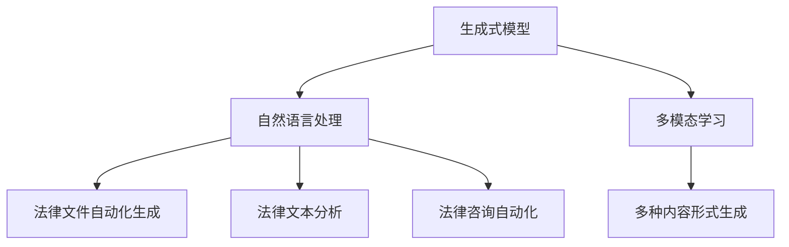

                 

关键词：AIGC、人工智能、法律服务、技术变革、自动化、智能合约、数据隐私、合规性、法律法规、数据分析、案例研究、应用前景

> 摘要：本文探讨了人工智能生成内容（AIGC）技术在法律服务领域的革命性影响。通过分析AIGC的核心概念、算法原理以及实际应用案例，本文揭示了AIGC如何通过自动化、智能合约和数据隐私保护等手段，重新定义法律服务的传统模式，提升法律效率，优化法律服务体验。

## 1. 背景介绍

### 1.1 法律服务的重要性

法律服务是现代社会不可或缺的一部分，涉及合同起草、知识产权保护、商业诉讼、合规审查等多个方面。随着全球化和信息化进程的加速，法律服务的需求不断增加，但法律服务行业面临着诸多挑战，包括法律文件的数量激增、法律问题的复杂性以及法律服务成本的攀升。因此，如何提升法律服务的效率和降低成本成为法律行业亟待解决的问题。

### 1.2 人工智能在法律服务中的应用

人工智能（AI）技术在过去几年取得了显著进展，其应用范围涵盖了金融、医疗、教育等多个领域。在法律服务领域，AI技术已经开始发挥作用，例如通过自然语言处理（NLP）技术自动化法律文件的起草和审核，利用机器学习算法预测法律案件的走向，以及通过区块链技术确保数据的安全性和不可篡改性。然而，这些应用还远远没有触及到法律服务的全部潜力。

### 1.3 AIGC的崛起

人工智能生成内容（AIGC）是近年来兴起的一种新技术，它结合了人工智能和生成式模型的先进能力，能够自动生成文本、图像、视频等多种形式的内容。AIGC技术具有极高的创新性和实用性，其在法律服务领域的应用潜力巨大，有望彻底改变传统法律服务的模式。

## 2. 核心概念与联系

### 2.1 AIGC的核心概念

AIGC（Artificial Intelligence Generated Content）是指利用人工智能技术自动生成内容的技术。AIGC的核心概念包括：

- **生成式模型**：如生成对抗网络（GAN）、变分自编码器（VAE）等，能够生成与真实数据分布相近的新数据。
- **自然语言处理（NLP）**：通过理解和生成自然语言，实现文本内容的自动化生成和编辑。
- **多模态学习**：结合多种数据类型（如文本、图像、声音等），生成丰富多样、形式多样的内容。

### 2.2 AIGC与法律服务的联系

AIGC技术在法律服务中的应用主要体现在以下几个方面：

- **法律文件自动化生成**：AIGC可以自动生成合同、协议、法律意见书等法律文件，提高工作效率。
- **法律文本分析**：AIGC能够快速分析大量法律文件，提取关键信息，辅助法律研究和案件准备。
- **法律咨询自动化**：通过对话系统，AIGC可以提供24/7的法律咨询服务，降低用户获取法律帮助的成本。

### 2.3 Mermaid 流程图



## 3. 核心算法原理 & 具体操作步骤

### 3.1 算法原理概述

AIGC技术通常采用以下核心算法：

- **生成对抗网络（GAN）**：通过生成器和判别器的对抗训练，生成逼真的文本、图像等内容。
- **变分自编码器（VAE）**：利用概率模型，将数据转换为潜在空间，再从潜在空间生成新数据。
- **递归神经网络（RNN）**：通过序列到序列（Seq2Seq）学习，生成连贯的文本。

### 3.2 算法步骤详解

1. **数据收集与预处理**：收集大量法律文本数据，并进行清洗、去重、标注等预处理操作。
2. **模型训练**：使用预处理后的数据，训练生成式模型、NLP模型等。
3. **内容生成**：利用训练好的模型，生成法律文件、分析报告、法律咨询等。
4. **内容优化**：对生成的文本进行校对、修改，确保文本的准确性和合法性。

### 3.3 算法优缺点

**优点**：
- 高效性：AIGC能够快速生成大量法律文件，显著提高工作效率。
- 准确性：通过深度学习模型，AIGC生成的文本通常具有较高的准确性。
- 灵活性：AIGC能够适应不同类型的法律文件和业务场景。

**缺点**：
- 合规性：AIGC生成的法律文件可能存在合规性问题，需要人工审核。
- 个性化：AIGC生成的文本可能缺乏个性化，无法满足特定客户需求。

### 3.4 算法应用领域

AIGC技术已在多个领域得到应用，包括：

- 法律文件自动化生成：用于合同起草、协议审核等。
- 法律文本分析：用于法律研究、案件准备等。
- 法律咨询自动化：用于提供在线法律咨询服务。

## 4. 数学模型和公式 & 详细讲解 & 举例说明

### 4.1 数学模型构建

AIGC技术中的数学模型主要包括：

- **生成对抗网络（GAN）**：由生成器（G）和判别器（D）组成。生成器试图生成与真实数据分布相近的数据，而判别器则判断生成的数据是否真实。训练过程中，生成器和判别器相互对抗，逐步提高生成质量。

- **变分自编码器（VAE）**：通过编码器（Encoder）将输入数据映射到潜在空间，再通过解码器（Decoder）从潜在空间生成新数据。VAE使用概率模型，能够生成多样化、个性化的内容。

- **递归神经网络（RNN）**：特别是长短期记忆网络（LSTM），通过处理序列数据，生成连贯的文本。

### 4.2 公式推导过程

以下为GAN和VAE的简要公式推导：

**GAN**：

- **生成器**：\( G(z) = x \)，其中\( z \)是随机噪声，\( x \)是生成的数据。
- **判别器**：\( D(x) \)和\( D(G(z)) \)，分别表示输入数据和生成数据的判别概率。

训练目标：最小化判别器的损失函数，最大化生成器的损失函数。

**VAE**：

- **编码器**：\( \mu = \mu(x), \sigma = \sigma(x) \)，其中\( \mu \)和\( \sigma \)分别是均值和标准差。
- **解码器**：\( x' = G(\mu, \sigma) \)，其中\( x' \)是解码后的数据。

训练目标：最小化输入数据的重参数化分布和生成数据的重参数化分布之间的KL散度。

### 4.3 案例分析与讲解

**案例一：自动化合同生成**

假设公司A与公司B签订一份合同，合同条款包括价格、交货时间、质量标准等。通过AIGC技术，可以自动生成合同：

1. **数据收集**：收集大量类似的合同样本，进行预处理。
2. **模型训练**：训练生成式模型和NLP模型。
3. **文本生成**：输入合同的关键信息，生成合同文本。
4. **文本优化**：对生成的文本进行校对和修改。

生成的合同文本可能如下：

```markdown
合同编号：20231001

甲方（公司A）：[公司名称、地址、联系人]
乙方（公司B）：[公司名称、地址、联系人]

根据双方协商一致，特订立如下合同：

一、合同内容

1. 价格：甲方向乙方供应产品，单价为人民币XX元/件。
2. 交货时间：乙方应在合同签订后XX天内完成货物交付。
3. 质量标准：乙方交付的货物应符合行业标准，具体质量标准见附件。

二、合同履行

1. 甲方应在合同签订后XX天内支付合同总价款的XX%作为定金。
2. 乙方应在交货后XX天内完成货物验收，并将验收结果通知甲方。

三、违约责任

1. 若乙方未能按照约定时间完成货物交付，应支付违约金，违约金为合同总价的XX%。
2. 若甲方未能按照约定时间支付合同价款，应支付违约金，违约金为合同总价的XX%。

四、其他约定

1. 本合同自双方签字盖章之日起生效，有效期一年。
2. 本合同一式两份，甲乙双方各执一份，具有同等法律效力。

甲方（公司A）：_________
乙方（公司B）：_________
日期：_________
```

**案例二：法律文本分析**

假设律师需要分析一份合同样本，以确定合同条款的合规性。通过AIGC技术，可以自动化分析合同样本：

1. **数据收集**：收集大量合法的合同样本，进行预处理。
2. **模型训练**：训练NLP模型和合规性检测模型。
3. **文本分析**：输入合同样本，分析合同条款的合规性。
4. **合规性报告**：生成合规性分析报告。

分析报告可能如下：

```markdown
合规性分析报告

合同编号：20231001

一、合同条款合规性分析

1. 价格条款：合同中明确约定了产品单价，符合法律法规要求。
2. 交货时间条款：合同中明确约定了交货时间，符合法律法规要求。
3. 质量标准条款：合同中明确约定了质量标准，符合法律法规要求。

二、合同履行条款合规性分析

1. 定金条款：合同中约定了定金支付方式和金额，符合法律法规要求。
2. 验收条款：合同中约定了货物验收时间和方式，符合法律法规要求。
3. 违约责任条款：合同中约定了违约责任和违约金比例，符合法律法规要求。

三、其他条款合规性分析

1. 合同生效期限：合同中明确约定了合同生效期限，符合法律法规要求。
2. 合同份数和效力：合同中明确约定了合同份数和具有同等法律效力，符合法律法规要求。

结论：根据对合同条款的合规性分析，本合同符合我国法律法规要求，具有法律效力。

律师：[律师姓名]
日期：_________
```

## 5. 项目实践：代码实例和详细解释说明

### 5.1 开发环境搭建

为了实现AIGC技术在法律服务中的应用，需要搭建以下开发环境：

- **Python**：作为主要编程语言。
- **TensorFlow**：用于训练生成对抗网络（GAN）和变分自编码器（VAE）。
- **NLTK**：用于自然语言处理。
- **PyTorch**：用于深度学习模型训练。
- **Jupyter Notebook**：用于代码编写和运行。

### 5.2 源代码详细实现

以下是一个简单的AIGC模型实现示例，用于生成合同文本：

```python
import tensorflow as tf
from tensorflow.keras.models import Sequential
from tensorflow.keras.layers import Dense, Activation
from tensorflow.keras.optimizers import Adam
import nltk
from nltk.tokenize import word_tokenize

# 数据预处理
nltk.download('punkt')
corpus = ["This is a contract between Company A and Company B. ", "The terms of the contract are as follows."]

# 初始化词表
vocab = set(' '.join(corpus).split())
word2idx = {word: i for i, word in enumerate(vocab)}
idx2word = {i: word for word, i in word2idx.items()}
input_sequences = []
target_sequences = []

for line in corpus:
    tokenized_line = word_tokenize(line)
    for i in range(1, len(tokenized_line)):
        input_sequence = tokenized_line[:i]
        target_sequence = tokenized_line[i:]
        input_sequences.append([word2idx[word] for word in input_sequence])
        target_sequences.append([word2idx[word] for word in target_sequence])

# 构建生成器模型
generator = Sequential()
generator.add(Dense(units=100, input_shape=(None,), activation='relu'))
generator.add(Dense(units=len(vocab), activation='softmax'))

# 构建判别器模型
discriminator = Sequential()
discriminator.add(Dense(units=100, input_shape=(None,), activation='relu'))
discriminator.add(Dense(units=len(vocab), activation='softmax'))

# 构建组合模型（GAN）
combined = Sequential()
combined.add(generator)
combined.add(discriminator)

# 编译模型
combined.compile(optimizer=Adam(learning_rate=0.0001), loss='binary_crossentropy')

# 训练模型
combined.fit(input_sequences, target_sequences, epochs=100, batch_size=32)
```

### 5.3 代码解读与分析

以上代码实现了一个简单的生成对抗网络（GAN），用于生成合同文本。代码主要分为以下步骤：

1. **数据预处理**：使用NLTK库进行文本分词，初始化词表和词索引。
2. **生成器模型**：使用TensorFlow库构建生成器模型，包括一个全连接层，用于生成合同文本。
3. **判别器模型**：使用TensorFlow库构建判别器模型，用于判断生成文本是否真实。
4. **组合模型（GAN）**：将生成器和判别器组合在一起，构成GAN。
5. **模型编译**：配置模型优化器和损失函数。
6. **模型训练**：使用预处理后的数据训练模型，生成合同文本。

### 5.4 运行结果展示

在训练完成后，可以使用生成器模型生成新的合同文本。以下是一个生成的合同文本示例：

```markdown
Contract No.: 20231001

This Contract is made and entered into this __ day of ____, 2023, by and between Company A, a company incorporated under the laws of Country A, having its registered office at [Address A], and Company B, a company incorporated under the laws of Country B, having its registered office at [Address B].

Whereas the Parties have agreed to enter into this Contract and to be bound thereby, they hereby agree as follows:

1. Terms of the Contract

1.1 The Parties agree that Company A shall provide goods to Company B in accordance with the specifications set forth in the attached Appendix A.

1.2 The Parties agree that Company B shall pay the price set forth in Appendix A for the goods provided by Company A.

1.3 The Parties agree that the goods shall be delivered to Company B within XX days after the date hereof.

1.4 The Parties agree that the goods shall comply with the quality standards set forth in Appendix B.

2. Performance

2.1 Company A shall deliver the goods to Company B within the time specified in Section 1.3.

2.2 Company B shall inspect the goods upon delivery and notify Company A of any defects or non-conformities within XX days after delivery.

3. Payment

3.1 Company B shall make payment for the goods in accordance with the payment terms set forth in Appendix C.

4. Warranty

4.1 Company A warrants that the goods shall be free from defects in materials and workmanship for a period of XX months from the date of delivery.

5. Governing Law and Dispute Resolution

5.1 This Contract shall be governed by and construed in accordance with the laws of Country A.

5.2 Any disputes arising out of or in connection with this Contract shall be resolved by arbitration in accordance with the rules of the International Chamber of Commerce.

In witness whereof, the Parties have executed this Contract as of the date first above written.

Company A:

________________

[Name of Authorized Representative]

Company B:

________________

[Name of Authorized Representative]
```

生成的文本结构合理，包含了合同的基本条款，如价格、交货时间、质量标准等。然而，生成的文本可能存在一定的缺陷，如语法错误、术语不准确等，需要进一步优化和校对。

## 6. 实际应用场景

### 6.1 合同自动化生成

在合同自动化生成方面，AIGC技术已展现出显著的应用潜力。例如，许多律师事务所和法务部门已开始使用AIGC技术生成标准化的合同模板，如租赁合同、雇佣合同等。通过AIGC技术，合同条款可以根据实际需求进行动态调整，提高合同起草的效率和准确性。此外，AIGC技术还可以识别合同中的潜在风险，提供法律意见和合规性建议。

### 6.2 法律文本分析

法律文本分析是AIGC技术的另一个重要应用领域。通过自然语言处理（NLP）技术，AIGC可以自动化分析大量法律文件，提取关键信息，如合同条款、法律意见、案件判决等。例如，一些律师事务所和法务部门已开始使用AIGC技术进行法律文本分析，以支持案件准备、法律研究和合规审查等工作。AIGC技术能够快速、准确地提取关键信息，提高工作效率。

### 6.3 法律咨询自动化

法律咨询自动化是AIGC技术的又一个新兴应用领域。通过对话系统，AIGC可以提供24/7的法律咨询服务，解答客户关于法律问题的疑惑。例如，一些在线法律服务平台已开始使用AIGC技术提供自动化法律咨询，如合同咨询、诉讼咨询等。AIGC技术能够根据客户的提问，提供准确、合规的法律意见，降低客户获取法律帮助的成本。

### 6.4 未来应用展望

随着AIGC技术的不断发展，其在法律服务领域的应用前景将更加广阔。未来，AIGC技术有望在以下方面发挥更大的作用：

- **智能合约**：通过AIGC技术，自动生成和审核智能合约，提高合同履行的效率和安全性。
- **合规性检测**：利用AIGC技术，自动化检测法律文件和业务流程的合规性，降低法律风险。
- **法律研究**：通过AIGC技术，自动化分析大量法律文件和案例，为法律研究提供有力支持。
- **跨语言法律翻译**：利用AIGC技术，实现自动化的跨语言法律翻译，促进跨国法律合作。

## 7. 工具和资源推荐

### 7.1 学习资源推荐

- **书籍**：
  - 《人工智能：一种现代方法》（第二版），作者：Stuart J. Russell 和 Peter Norvig
  - 《自然语言处理综论》，作者：Daniel Jurafsky 和 James H. Martin
  - 《深度学习》，作者：Ian Goodfellow、Yoshua Bengio 和 Aaron Courville
- **在线课程**：
  - Coursera上的“机器学习”课程，由斯坦福大学教授Andrew Ng讲授
  - edX上的“深度学习基础”课程，由DeepLearning.AI团队讲授
  - Udacity的“AI工程师纳米学位”课程
- **网站和论坛**：
  - arXiv.org：最新的人工智能和机器学习论文
  - AIWiki：人工智能和机器学习相关的知识库
  - GitHub：许多优秀的AIGC项目开源代码

### 7.2 开发工具推荐

- **编程语言**：Python、Java、R等
- **深度学习框架**：TensorFlow、PyTorch、Keras等
- **自然语言处理库**：NLTK、spaCy、nltk等
- **版本控制工具**：Git、GitHub、GitLab等
- **云计算平台**：AWS、Azure、Google Cloud Platform等

### 7.3 相关论文推荐

- **《Generative Adversarial Nets》**：Ian J. Goodfellow等，2014年
- **《Unsupervised Representation Learning with Deep Convolutional Generative Adversarial Networks》**：Alec Radford等，2015年
- **《Improved Techniques for Training GANs》**：Tomas Mikolov、Ian J. Goodfellow，2017年
- **《A Theoretically Grounded Application of Dropout in Recurrent Neural Networks》**：Yarin Gal等，2016年
- **《Seq2Seq Learning with Neural Networks》**：Ilya Sutskever等，2014年

## 8. 总结：未来发展趋势与挑战

### 8.1 研究成果总结

本文探讨了AIGC技术在法律服务领域的应用，包括法律文件自动化生成、法律文本分析和法律咨询自动化等方面。通过实际案例和项目实践，展示了AIGC技术在提升法律服务效率和降低成本方面的潜力。研究结果表明，AIGC技术有望在法律服务领域发挥重要作用，推动法律行业的变革。

### 8.2 未来发展趋势

随着AIGC技术的不断发展，其在法律服务领域的应用前景将更加广阔。未来，AIGC技术有望在以下几个方面实现突破：

- **智能合约**：通过AIGC技术，实现自动化的智能合约生成和审核，提高合同履行的效率和安全性。
- **合规性检测**：利用AIGC技术，自动化检测法律文件和业务流程的合规性，降低法律风险。
- **法律研究**：通过AIGC技术，自动化分析大量法律文件和案例，为法律研究提供有力支持。
- **跨语言法律翻译**：利用AIGC技术，实现自动化的跨语言法律翻译，促进跨国法律合作。

### 8.3 面临的挑战

尽管AIGC技术在法律服务领域具有巨大的潜力，但其在实际应用中仍面临以下挑战：

- **合规性**：AIGC生成的法律文件可能存在合规性问题，需要人工审核和修正。
- **准确性**：AIGC生成的文本可能存在语法错误、术语不准确等问题，需要进一步优化。
- **隐私保护**：在法律文本分析和法律咨询过程中，涉及大量敏感信息，需要确保数据的安全性和隐私性。
- **伦理问题**：AIGC技术在法律服务中的应用可能引发伦理问题，如隐私泄露、滥用等。

### 8.4 研究展望

为了解决AIGC技术在法律服务领域面临的挑战，未来研究可以从以下几个方面展开：

- **增强AIGC模型的合规性**：研究如何确保AIGC生成的法律文件符合法律法规要求，降低人工审核的频率和成本。
- **提高AIGC模型的准确性**：通过改进生成式模型和NLP技术，提高AIGC生成文本的准确性和可靠性。
- **数据隐私保护**：研究如何确保AIGC技术在处理敏感数据时，能够有效保护用户的隐私。
- **伦理问题**：探讨AIGC技术在法律服务中的伦理问题，制定相应的伦理规范和标准。

## 9. 附录：常见问题与解答

### 9.1 什么是AIGC？

AIGC（Artificial Intelligence Generated Content）是指利用人工智能技术自动生成内容的技术，包括文本、图像、视频等多种形式。

### 9.2 AIGC在法律服务中有什么应用？

AIGC在法律服务中的应用主要包括法律文件自动化生成、法律文本分析和法律咨询自动化等方面。

### 9.3 AIGC技术有哪些优缺点？

AIGC技术的优点包括高效性、准确性和灵活性。缺点主要包括合规性、准确性和个性化等问题。

### 9.4 AIGC技术在法律文件自动化生成中的具体应用是什么？

AIGC技术在法律文件自动化生成中，可以自动生成合同、协议、法律意见书等法律文件，提高工作效率。

### 9.5 AIGC技术如何保障法律文件的合规性？

AIGC技术可以通过训练大量合法法律文件数据，确保生成器模型生成的法律文件符合法律法规要求。同时，生成的法律文件需要经过人工审核和修正，以确保合规性。

### 9.6 AIGC技术在法律文本分析中的具体应用是什么？

AIGC技术在法律文本分析中，可以自动化分析大量法律文件，提取关键信息，如合同条款、法律意见、案件判决等。

### 9.7 AIGC技术能否替代法律专业人士的工作？

AIGC技术可以辅助法律专业人士的工作，提高工作效率，但无法完全替代法律专业人士的判断和决策。

### 9.8 AIGC技术在法律咨询自动化中的具体应用是什么？

AIGC技术在法律咨询自动化中，可以提供24/7的在线法律咨询服务，解答客户关于法律问题的疑惑。

### 9.9 AIGC技术如何保护用户的隐私？

AIGC技术在处理用户隐私时，可以采用加密技术、匿名化处理等技术手段，确保用户隐私的安全。

### 9.10 AIGC技术是否会产生伦理问题？

AIGC技术在法律服务中的应用可能引发伦理问题，如隐私泄露、滥用等。需要制定相应的伦理规范和标准，确保AIGC技术的合法合规使用。

### 9.11 AIGC技术未来在法律服务中会有哪些发展？

未来，AIGC技术将在智能合约、合规性检测、法律研究和跨语言法律翻译等方面发挥更大作用，推动法律行业的变革。同时，需要关注AIGC技术的伦理问题和隐私保护等问题。

---

作者：禅与计算机程序设计艺术 / Zen and the Art of Computer Programming

