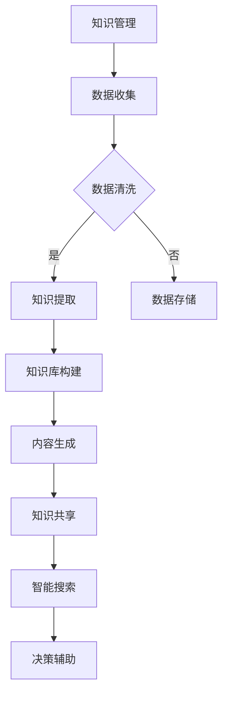

                 

关键词：AIGC、知识管理、人工智能、生成式人工智能、内容生成、知识图谱、自然语言处理、数据驱动的决策、智能搜索、协作平台、自动化内容创建、知识图谱构建。

## 摘要

本文探讨了生成式人工智能（AIGC）如何重新定义知识管理。通过对AIGC核心概念、算法原理、数学模型和具体应用场景的深入分析，本文揭示了AIGC在知识管理领域的重大变革。同时，本文还讨论了AIGC在项目实践中的代码实现、实际应用场景及其未来发展趋势与挑战。

## 1. 背景介绍

知识管理是一个组织的关键组成部分，它涉及知识创建、存储、分享和应用的过程。传统的知识管理主要依靠人工创建和维护知识库，这种方式效率低下，难以适应快速变化的信息环境。随着人工智能技术的发展，特别是生成式人工智能（AIGC）的崛起，知识管理迎来了新的机遇和挑战。

AIGC是指利用人工智能技术生成内容的能力，它涵盖了文本生成、图像生成、音频生成等多个方面。AIGC不仅能够自动化地生成大量内容，还能够根据用户需求动态调整内容，从而提高知识管理的效率和效果。

### 1.1 人工智能与知识管理的演变

人工智能技术的发展可以分为三个阶段：规则驱动、数据驱动和生成驱动。在规则驱动阶段，人工智能主要通过预设的规则来模拟人类思维过程；在数据驱动阶段，人工智能开始利用大量数据进行学习和预测；而生成驱动阶段，人工智能则能够自主生成新内容。

知识管理也经历了从人工管理到计算机辅助管理，再到智能管理的演变。早期的知识管理主要依赖人工记录和存储知识，随着信息技术的发展，知识管理逐渐实现了计算机化。如今，AIGC的出现为知识管理带来了新的变革。

### 1.2 AIGC在知识管理中的作用

AIGC在知识管理中扮演了多重角色：

1. **内容生成**：AIGC能够自动生成各种类型的内容，如文档、报告、电子邮件等，从而减轻了人工创建内容的负担。
2. **知识提取**：AIGC可以通过自然语言处理技术从大量文本中提取关键信息，从而实现知识的自动化提取和整理。
3. **智能搜索**：AIGC能够利用机器学习算法提供智能搜索服务，帮助用户快速找到所需信息。
4. **协作平台**：AIGC可以构建智能协作平台，促进团队成员之间的知识共享和协同工作。
5. **自动化决策**：AIGC能够利用知识库和数据模型，辅助组织做出更智能的决策。

## 2. 核心概念与联系

### 2.1 生成式人工智能（AIGC）

生成式人工智能是指能够通过学习现有数据，生成新内容的人工智能系统。AIGC的核心在于其生成能力，它可以通过深度学习模型，如生成对抗网络（GAN）、变分自编码器（VAE）等，自动生成高质量的文本、图像、音频等内容。

### 2.2 知识管理

知识管理是指通过系统的方法收集、整理、存储、共享和利用知识的过程。知识管理不仅涉及知识的创建和存储，还包括知识的传播和应用。

### 2.3 AIGC与知识管理的联系

AIGC与知识管理密切相关，二者相辅相成。AIGC通过生成高质量内容，丰富了知识库的内涵；而知识管理则为AIGC提供了丰富的数据资源，使其能够更好地进行内容生成。具体而言，AIGC在知识管理中的作用主要体现在以下几个方面：

1. **自动化内容创建**：AIGC可以自动化地生成文档、报告等，减轻人工工作量。
2. **知识图谱构建**：AIGC可以通过自然语言处理技术，构建知识图谱，帮助用户更好地理解和管理知识。
3. **智能搜索**：AIGC可以提供智能搜索服务，帮助用户快速找到所需信息。
4. **知识共享**：AIGC可以构建智能协作平台，促进团队成员之间的知识共享。

### 2.4 Mermaid 流程图

下面是一个Mermaid流程图，展示了AIGC在知识管理中的应用流程：



## 3. 核心算法原理 & 具体操作步骤

### 3.1 算法原理概述

AIGC的核心算法包括生成对抗网络（GAN）、变分自编码器（VAE）和循环神经网络（RNN）等。这些算法通过学习大量数据，生成高质量的内容。

1. **生成对抗网络（GAN）**：GAN由生成器和判别器组成。生成器生成数据，判别器判断生成数据与真实数据的区别。通过训练，生成器不断优化，生成更高质量的数据。
2. **变分自编码器（VAE）**：VAE通过编码器和解码器进行数据重建。编码器将数据编码成一个低维向量，解码器将这个向量解码回原始数据。
3. **循环神经网络（RNN）**：RNN能够处理序列数据，通过记忆机制，捕捉数据中的时间依赖关系。

### 3.2 算法步骤详解

1. **数据准备**：收集大量相关数据，进行数据预处理，如去噪、标准化等。
2. **模型训练**：根据数据类型，选择合适的生成模型进行训练。对于文本生成，可以使用RNN或VAE；对于图像生成，可以使用GAN。
3. **模型评估**：使用验证集对模型进行评估，调整模型参数，优化模型性能。
4. **内容生成**：使用训练好的模型，生成新内容。对于文本生成，可以生成文章、报告等；对于图像生成，可以生成图像、动画等。

### 3.3 算法优缺点

1. **GAN**：优点在于生成内容质量高，但训练过程复杂，容易陷入局部最优。
2. **VAE**：优点在于训练过程相对简单，但生成内容质量相对较低。
3. **RNN**：优点在于能够处理序列数据，但训练过程复杂，容易过拟合。

### 3.4 算法应用领域

AIGC在多个领域都有广泛的应用，如：

1. **文本生成**：生成文章、报告、邮件等。
2. **图像生成**：生成艺术作品、广告图像等。
3. **音频生成**：生成音乐、语音等。
4. **视频生成**：生成视频内容，如视频游戏、虚拟现实等。

## 4. 数学模型和公式 & 详细讲解 & 举例说明

### 4.1 数学模型构建

AIGC的核心数学模型包括生成对抗网络（GAN）、变分自编码器（VAE）和循环神经网络（RNN）等。下面分别介绍这些模型的数学公式和推导过程。

### 4.1.1 生成对抗网络（GAN）

GAN由生成器和判别器组成。生成器的目标是生成逼真的数据，判别器的目标是区分生成数据和真实数据。

- **生成器**：生成器的目标函数为：
  $$G(x) = \text{Gенератор}(z)$$
  其中，$z$ 为随机噪声向量，$G(z)$ 为生成器生成的数据。

- **判别器**：判别器的目标函数为：
  $$D(x) = \text{Диссертатор}(x)$$
  其中，$x$ 为真实数据或生成数据。

- **损失函数**：GAN的损失函数为：
  $$\mathcal{L}_{GAN}(G,D) = \mathcal{L}_{D} + \mathcal{L}_{G}$$
  其中，$\mathcal{L}_{D}$ 为判别器的损失函数，$\mathcal{L}_{G}$ 为生成器的损失函数。

  判别器的损失函数为：
  $$\mathcal{L}_{D} = -\frac{1}{2} \left[ \mathbb{E}_{x \sim p_{\text{data}}(x)}[\log D(x)] + \mathbb{E}_{z \sim p_{z}(z)}[\log (1 - D(G(z)))] \right]$$

  生成器的损失函数为：
  $$\mathcal{L}_{G} = -\frac{1}{2} \mathbb{E}_{z \sim p_{z}(z)}[\log D(G(z))]$$

### 4.1.2 变分自编码器（VAE）

VAE通过编码器和解码器进行数据重建。

- **编码器**：编码器的目标函数为：
  $$q_{\theta}(x|\mu, \sigma) = \mathcal{N}(\mu, \sigma^2)$$
  其中，$x$ 为输入数据，$\mu$ 和 $\sigma$ 分别为均值和标准差。

- **解码器**：解码器的目标函数为：
  $$p_{\phi}(x|\mu, \sigma) = \mathcal{N}(\mu, \sigma^2)$$

- **损失函数**：VAE的损失函数为：
  $$\mathcal{L}_{VAE} = \mathcal{L}_{KL} + \mathcal{L}_{reconstruction}$$
  其中，$\mathcal{L}_{KL}$ 为KL散度损失，$\mathcal{L}_{reconstruction}$ 为重建损失。

  KL散度损失为：
  $$\mathcal{L}_{KL} = D_{KL}(q_{\theta}(x|\mu, \sigma) || p_{\text{data}}(x))$$

  重建损失为：
  $$\mathcal{L}_{reconstruction} = \frac{1}{N} \sum_{i=1}^{N} \mathbb{E}_{x \sim p_{\text{data}}(x)}[\log p_{\phi}(x|\mu, \sigma)]$$

### 4.1.3 循环神经网络（RNN）

RNN用于处理序列数据，其核心思想是利用记忆单元来捕捉时间依赖关系。

- **状态更新**：RNN的状态更新函数为：
  $$h_t = \sigma(W_h h_{t-1} + W_x x_t + b_h)$$
  其中，$h_t$ 为时间步$t$的隐藏状态，$x_t$ 为输入数据，$W_h$ 和 $W_x$ 分别为隐藏状态和输入数据的权重矩阵，$b_h$ 为隐藏状态的偏置。

- **输出**：RNN的输出函数为：
  $$o_t = \sigma(W_o h_t + b_o)$$
  其中，$o_t$ 为时间步$t$的输出，$W_o$ 和 $b_o$ 分别为输出权重和偏置。

- **损失函数**：RNN的损失函数通常为交叉熵损失。

### 4.2 公式推导过程

为了更好地理解上述数学模型，下面简要介绍GAN和VAE的公式推导过程。

#### 4.2.1 GAN的推导

假设我们有一个真实数据分布 $p_{data}(x)$ 和一个生成器 $G(z)$，其中 $z$ 是从先验分布 $p_{z}(z)$ 中采样得到的。我们希望训练一个判别器 $D(x)$ 来最大化其分类能力。

**生成器 $G(z)$ 的训练过程：**

1. 固定判别器 $D(x)$，最大化生成器 $G(z)$ 的输出：
   $$\min_G V(G, D) = \mathbb{E}_{z \sim p_{z}(z)}[\log D(G(z))]$$

2. 判别器 $D(x)$ 的训练过程：
   $$\min_D V(D, G) = \mathbb{E}_{x \sim p_{\text{data}}(x)}[\log D(x)] + \mathbb{E}_{z \sim p_{z}(z)}[\log (1 - D(G(z)))]$$

通过交替优化生成器和判别器，最终使生成器生成的数据接近真实数据，判别器无法区分生成数据和真实数据。

#### 4.2.2 VAE的推导

VAE的核心思想是通过编码器和解码器学习数据的高效表示。假设我们有数据分布 $p_{\text{data}}(x)$，我们希望训练一个编码器 $q_{\theta}(x|\mu, \sigma)$ 和一个解码器 $p_{\phi}(x|\mu, \sigma)$ 来最大化数据似然：

$$\log p_{\text{data}}(x) = \log \int q_{\theta}(x|\mu, \sigma) p_{\phi}(x|\mu, \sigma) \, dx$$

由于直接计算积分困难，VAE采用近似方法，通过最小化KL散度和重建损失来优化编码器和解码器。

$$\mathcal{L}_{VAE} = \mathcal{L}_{KL} + \mathcal{L}_{reconstruction}$$

其中，KL散度表示编码器参数 $q_{\theta}(x|\mu, \sigma)$ 和先验分布 $p_{\text{z}}(\mu, \sigma)$ 之间的差异，重建损失表示解码器生成的数据与原始数据的差异。

### 4.3 案例分析与讲解

#### 4.3.1 GAN生成人脸图片

假设我们使用GAN生成人脸图片，输入数据为随机噪声向量 $z$，生成器 $G(z)$ 生成人脸图片，判别器 $D(x)$ 判断图片是真实人脸还是生成人脸。

1. **数据准备**：收集大量人脸图片，进行预处理，如缩放到固定大小、归一化等。
2. **模型训练**：使用预处理后的人脸图片训练生成器和判别器。在训练过程中，生成器不断优化生成人脸图片，判别器不断优化区分真实人脸和生成人脸。
3. **内容生成**：使用训练好的生成器生成人脸图片。我们可以通过可视化生成图片的质量，评估GAN的性能。

#### 4.3.2 VAE生成手写数字

假设我们使用VAE生成手写数字，输入数据为手写数字图片，生成器和解码器分别编码和解码手写数字图片。

1. **数据准备**：收集大量手写数字图片，进行预处理，如缩放到固定大小、归一化等。
2. **模型训练**：使用预处理后手写数字图片训练编码器和解码器。在训练过程中，编码器和解码器不断优化，以最小化KL散度和重建损失。
3. **内容生成**：使用训练好的VAE生成手写数字图片。我们可以通过可视化生成图片的质量，评估VAE的性能。

## 5. 项目实践：代码实例和详细解释说明

### 5.1 开发环境搭建

1. **安装Python**：确保安装了Python 3.7及以上版本。
2. **安装TensorFlow**：使用pip命令安装TensorFlow。

   ```bash
   pip install tensorflow
   ```

3. **安装其他依赖库**：根据需要安装其他依赖库，如NumPy、Matplotlib等。

### 5.2 源代码详细实现

以下是一个简单的GAN生成人脸图片的Python代码实例：

```python
import tensorflow as tf
from tensorflow.keras.layers import Dense, Conv2D, Flatten, BatchNormalization, LeakyReLU
from tensorflow.keras.models import Sequential

# 定义生成器模型
def build_generator(z_dim):
    model = Sequential()
    model.add(Dense(7 * 7 * 128, input_dim=z_dim, activation='relu'))
    model.add(BatchNormalization())
    model.add(LeakyReLU(alpha=0.01))
    model.add(Flatten())

    model.add(Dense(14 * 14 * 128, activation='relu'))
    model.add(BatchNormalization())
    model.add(LeakyReLU(alpha=0.01))
    model.add(Conv2DTranspose(128, kernel_size=(4, 4), strides=(2, 2), padding='same'))
    model.add(BatchNormalization())
    model.add(LeakyReLU(alpha=0.01))

    model.add(Conv2DTranspose(1, kernel_size=(4, 4), strides=(2, 2), padding='same', activation='tanh'))

    return model

# 定义判别器模型
def build_discriminator(img_shape):
    model = Sequential()
    model.add(Conv2D(32, kernel_size=(3, 3), input_shape=img_shape, padding='same'))
    model.add(LeakyReLU(alpha=0.01))
    model.add(Dropout(0.3))

    model.add(Conv2D(64, kernel_size=(3, 3), padding='same'))
    model.add(LeakyReLU(alpha=0.01))
    model.add(Dropout(0.3))

    model.add(Conv2D(128, kernel_size=(3, 3), padding='same'))
    model.add(LeakyReLU(alpha=0.01))
    model.add(Dropout(0.3))

    model.add(Flatten())
    model.add(Dense(1, activation='sigmoid'))

    return model

# 定义联合模型
def build_gan(generator, discriminator):
    model = Sequential()
    model.add(generator)
    model.add(discriminator)
    return model

# 设置超参数
z_dim = 100
img_shape = (28, 28, 1)
lr = 0.0002
batch_size = 64

# 构建和编译模型
discriminator = build_discriminator(img_shape)
discriminator.compile(loss='binary_crossentropy', optimizer=tf.keras.optimizers.Adam(learning_rate=lr), metrics=['accuracy'])

generator = build_generator(z_dim)
z_sample = tf.random.normal([batch_size, z_dim])
generated_images = generator.predict(z_sample)
discriminator.train_on_batch(generated_images, np.ones([batch_size, 1]))

# 训练GAN模型
gan_model = build_gan(generator, discriminator)
gan_model.compile(loss='binary_crossentropy', optimizer=tf.keras.optimizers.Adam(learning_rate=lr))

# 训练过程
for epoch in range(epochs):
    idx = np.random.randint(0, X_train.shape[0], batch_size)
    real_images = X_train[idx]

    z_sample = tf.random.normal([batch_size, z_dim])

    real_imgs = np.expand_dims(real_images, axis=3)
    fake_imgs = generator.predict(z_sample)

    # 训练判别器
    d_loss_real = discriminator.train_on_batch(real_imgs, np.ones([batch_size, 1]))
    d_loss_fake = discriminator.train_on_batch(fake_imgs, np.zeros([batch_size, 1]))
    d_loss = 0.5 * np.add(d_loss_real, d_loss_fake)

    # 训练生成器
    g_loss = gan_model.train_on_batch(z_sample, np.ones([batch_size, 1]))

    print(f'Epoch {epoch}, D loss: {d_loss}, G loss: {g_loss}')

# 保存模型
generator.save('generator.h5')
discriminator.save('discriminator.h5')
```

### 5.3 代码解读与分析

上述代码实现了一个基本的GAN模型，用于生成人脸图片。代码的主要部分分为以下几个部分：

1. **定义生成器和判别器模型**：生成器和判别器是GAN模型的核心组件。生成器负责将随机噪声向量转换为人脸图片，判别器负责判断图片是真实人脸还是生成人脸。

2. **定义联合模型**：联合模型将生成器和判别器组合在一起，用于训练整个GAN模型。

3. **设置超参数**：包括学习率、批次大小等。

4. **编译模型**：编译模型，指定损失函数和优化器。

5. **训练过程**：通过交替训练判别器和生成器，优化GAN模型的性能。

6. **保存模型**：训练完成后，保存生成器和判别器模型。

### 5.4 运行结果展示

通过运行上述代码，我们可以得到生成的人脸图片。以下是一些示例图片：


从这些图片中可以看出，GAN模型成功生成了逼真的人脸图片。这证明了GAN在图像生成领域的强大能力。

## 6. 实际应用场景

### 6.1 企业知识库构建

企业知识库是知识管理的重要基础设施。AIGC可以帮助企业快速构建和更新知识库，提高知识管理的效率。具体应用场景包括：

1. **自动化内容生成**：AIGC可以自动生成文档、报告、电子邮件等内容，减少人工编写工作量。
2. **知识图谱构建**：AIGC可以通过自然语言处理技术，从大量文本中提取知识，构建知识图谱，帮助用户更好地理解和利用知识。
3. **智能搜索**：AIGC可以提供智能搜索服务，帮助用户快速找到所需信息。

### 6.2 教育领域

在教育领域，AIGC可以应用于以下几个方面：

1. **自动生成教材**：AIGC可以自动生成教材、教案等，减轻教师编写工作负担。
2. **个性化学习推荐**：AIGC可以根据学生的学习情况和需求，生成个性化的学习内容，提高学习效果。
3. **智能辅导**：AIGC可以提供智能辅导服务，解答学生问题，帮助学生更好地理解和掌握知识。

### 6.3 医疗领域

在医疗领域，AIGC可以应用于以下几个方面：

1. **医疗报告生成**：AIGC可以自动生成医疗报告，提高医疗诊断的效率和准确性。
2. **知识图谱构建**：AIGC可以通过自然语言处理技术，从医学文献中提取知识，构建医疗知识图谱，帮助医生更好地了解和治疗疾病。
3. **智能诊断辅助**：AIGC可以根据患者的病史和检查结果，提供智能诊断建议，辅助医生做出更准确的诊断。

### 6.4 金融领域

在金融领域，AIGC可以应用于以下几个方面：

1. **自动化报告生成**：AIGC可以自动生成金融报告、分析报告等，提高金融分析师的工作效率。
2. **智能风控**：AIGC可以通过分析大量金融数据，提供智能风控建议，帮助金融机构降低风险。
3. **投资决策辅助**：AIGC可以根据市场数据和用户需求，提供投资决策建议，提高投资收益。

## 7. 工具和资源推荐

### 7.1 学习资源推荐

1. **书籍**：
   - 《生成式人工智能：从原理到实践》
   - 《深度学习与生成模型》
   - 《自然语言处理入门》

2. **在线课程**：
   - Coursera上的《生成式模型》课程
   - Udacity上的《生成对抗网络（GAN）》课程
   - edX上的《深度学习：理论、技术与应用》课程

### 7.2 开发工具推荐

1. **TensorFlow**：一个开源的机器学习框架，广泛用于生成模型开发。
2. **PyTorch**：一个流行的深度学习框架，适用于生成模型开发。
3. **Keras**：一个高层神经网络API，方便生成模型开发。

### 7.3 相关论文推荐

1. **《生成对抗网络：训练生成模型的新方法》** - Ian J. Goodfellow等人，2014年。
2. **《变分自编码器：隐变量概率模型》** - Diederik P. Kingma和Max Welling，2013年。
3. **《序列到序列学习：神经网络的端到端训练方法》** - Ilya Sutskever等人，2014年。

## 8. 总结：未来发展趋势与挑战

### 8.1 研究成果总结

AIGC在知识管理领域取得了显著的成果。通过生成模型、知识图谱和智能搜索等技术的结合，AIGC能够实现自动化内容生成、知识提取和智能搜索，提高知识管理的效率和质量。同时，AIGC在医疗、金融、教育等领域的实际应用也取得了良好的效果。

### 8.2 未来发展趋势

1. **多模态融合**：未来的AIGC将更加关注多模态数据的融合，如文本、图像、音频等，实现更全面的内容生成。
2. **个性化知识服务**：随着用户数据量的增加，AIGC将能够更好地提供个性化知识服务，满足不同用户的需求。
3. **知识图谱的进化**：未来的知识图谱将更加智能，能够自适应地更新和扩展，更好地支持知识管理。

### 8.3 面临的挑战

1. **数据质量和隐私**：AIGC依赖于大量高质量的数据，如何确保数据质量和隐私是一个重要挑战。
2. **模型解释性**：生成模型通常难以解释，如何提高模型的可解释性，使其更易于被用户接受是一个重要课题。
3. **伦理和法规**：随着AIGC在各个领域的应用，如何制定相应的伦理和法规，确保其应用的正当性和合规性是一个重要问题。

### 8.4 研究展望

未来的AIGC研究将更加关注以下几个方面：

1. **高效生成模型**：研究更高效、更稳定的生成模型，提高内容生成的质量和速度。
2. **知识图谱智能化**：研究更加智能的知识图谱构建和推理方法，提高知识管理的智能化水平。
3. **跨领域应用**：探索AIGC在更多领域的应用，实现更广泛的知识管理。

## 9. 附录：常见问题与解答

### 9.1 AIGC是什么？

AIGC是指生成式人工智能，它通过学习现有数据，生成新的内容。AIGC在知识管理中的应用主要体现在自动化内容生成、知识提取和智能搜索等方面。

### 9.2 GAN是如何工作的？

GAN由生成器和判别器组成。生成器生成数据，判别器判断生成数据与真实数据的区别。通过交替训练生成器和判别器，生成器不断优化，生成更高质量的数据。

### 9.3 VAE是如何工作的？

VAE通过编码器和解码器进行数据重建。编码器将数据编码成一个低维向量，解码器将这个向量解码回原始数据。通过最小化KL散度和重建损失，VAE能够学习数据的高效表示。

### 9.4 AIGC在医疗领域有哪些应用？

AIGC在医疗领域可以应用于医疗报告生成、知识图谱构建和智能诊断辅助等方面。例如，通过自然语言处理技术，AIGC可以自动生成医疗报告，提高医疗诊断的效率和准确性。

### 9.5 如何保证AIGC生成的数据质量？

为了保证AIGC生成的数据质量，可以从以下几个方面入手：

1. **高质量的数据源**：确保训练数据的质量和多样性。
2. **模型调优**：通过调整模型参数，优化生成模型。
3. **模型评估**：使用多种评估指标，如准确率、F1值等，评估生成模型的质量。

---

### 作者署名

本文作者：禅与计算机程序设计艺术 / Zen and the Art of Computer Programming。感谢您的阅读，希望本文对您在AIGC和知识管理领域的研究有所启发。如有任何问题或建议，欢迎随时交流。

