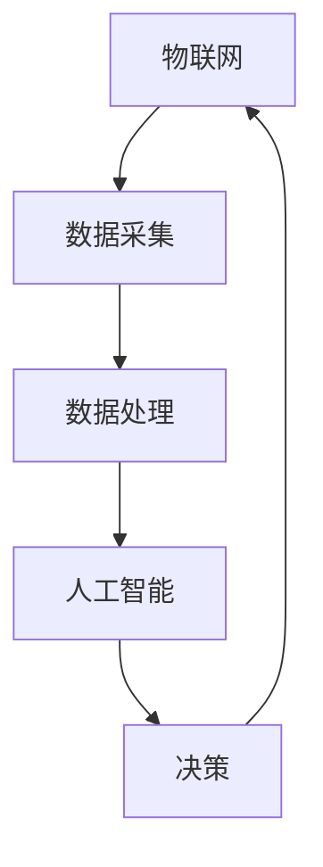

                 

关键词：人工智能、物联网、AIoT、边缘计算、智能设备、数据分析、安全隐私

> 摘要：本文深入探讨了人工智能（AI）与物联网（IoT）的融合，简称AIoT，这一新兴领域的背景、核心概念、算法原理、数学模型、实践应用以及未来展望。通过详细阐述AIoT的技术架构和关键算法，分析其带来的创新和应用价值，展望AIoT的发展趋势和面临的挑战，本文旨在为读者提供一个全面而深入的视角，以了解和把握这一领域的前沿动态。

## 1. 背景介绍

随着互联网技术的飞速发展和智能设备的普及，物联网（IoT）已经深刻改变了我们的生活和工作方式。从智能家居、智能交通到工业自动化，物联网正逐渐融入各个领域，带来前所未有的便利和效率提升。然而，物联网设备产生的海量数据如果没有得到有效处理和分析，则无法发挥其真正的价值。

人工智能（AI）作为数据驱动的技术，通过对数据的分析和处理，能够从大量数据中提取出有价值的信息，并做出智能决策。AI在图像识别、自然语言处理、预测分析等方面已经取得了显著的进展。结合物联网设备所产生的大量实时数据，AI可以实现对物联网设备的智能管理和优化。

AIoT（人工智能与物联网的融合）应运而生，它将AI技术应用于物联网设备中，使其具备自主学习和决策能力，从而实现更高效、更智能的物联网应用。AIoT不仅能够提高物联网系统的性能和可靠性，还能够为用户提供更加个性化、智能化的服务。

## 2. 核心概念与联系

### 2.1 物联网（IoT）

物联网（IoT）指的是通过互联网连接的物理设备和物品。这些设备包括但不限于传感器、嵌入式系统、智能手机、可穿戴设备等。物联网的基本概念是通过无线网络或互联网将物理世界中的各种设备和物品连接起来，实现数据采集、传输和处理，最终实现对物理世界的智能管理和控制。

### 2.2 人工智能（AI）

人工智能（AI）是一门模拟、延伸和扩展人类智能的科学和技术。通过机器学习、深度学习、自然语言处理等技术，AI系统能够从数据中自动学习规律，进行智能推理和决策。AI的目标是使计算机系统具备类似于人类的智能，能够在复杂的现实环境中自主行动和解决问题。

### 2.3 AIoT

AIoT是人工智能与物联网的融合，通过将AI技术应用于物联网设备中，使其具备自主学习和决策能力。AIoT的核心在于利用物联网设备收集的数据，通过AI算法进行分析和处理，从而实现对设备的智能管理、优化和预测。AIoT的目标是构建一个智能化的物联网生态系统，提供更加高效、智能和可靠的服务。

### 2.4 Mermaid 流程图



### 2.5 关键技术

- **边缘计算**：边缘计算是指在靠近数据源或设备的地方进行数据处理，以减少数据传输的延迟和带宽消耗。边缘计算是AIoT的关键技术之一，能够提高物联网系统的实时性和响应速度。
- **机器学习**：机器学习是AI的核心技术之一，通过训练模型，使计算机系统能够从数据中学习并做出智能决策。
- **深度学习**：深度学习是一种特殊的机器学习技术，通过构建多层的神经网络模型，能够自动从数据中提取特征并进行分类和预测。
- **大数据分析**：大数据分析是指对海量数据进行处理和分析，以提取有价值的信息和洞察。

## 3. 核心算法原理 & 具体操作步骤

### 3.1 算法原理概述

AIoT的核心算法包括数据采集、数据处理、机器学习和深度学习等。以下是这些算法的简要概述：

- **数据采集**：通过物联网设备收集实时数据，如传感器数据、网络流量数据等。
- **数据处理**：对采集到的数据进行预处理，包括去噪、清洗和特征提取等。
- **机器学习**：通过训练模型，使计算机系统能够从数据中学习并做出智能决策。
- **深度学习**：通过构建多层的神经网络模型，能够自动从数据中提取特征并进行分类和预测。

### 3.2 算法步骤详解

- **数据采集**：通过物联网设备（如传感器、摄像头等）实时收集数据。
- **数据预处理**：对采集到的数据进行去噪、清洗和特征提取等操作，以获得高质量的数据。
- **模型训练**：使用机器学习和深度学习算法对预处理后的数据进行训练，构建预测模型。
- **模型评估**：使用验证集对训练好的模型进行评估，以确定模型的准确性和可靠性。
- **模型部署**：将训练好的模型部署到物联网设备中，实现实时数据分析和决策。

### 3.3 算法优缺点

- **优点**：
  - **实时性**：AIoT能够实时分析物联网设备产生的数据，提供快速响应。
  - **高效性**：通过边缘计算和分布式处理，AIoT能够高效地处理海量数据。
  - **智能化**：AIoT能够通过机器学习和深度学习算法，从数据中提取有价值的信息，实现智能化决策。

- **缺点**：
  - **数据安全**：物联网设备容易受到网络攻击和数据泄露的风险。
  - **计算资源**：机器学习和深度学习算法需要大量的计算资源和存储空间。

### 3.4 算法应用领域

AIoT算法广泛应用于各个领域，包括但不限于：

- **智能交通**：通过实时分析交通数据，优化交通流量，减少拥堵。
- **智能医疗**：通过分析医疗数据，实现疾病预测和个性化治疗。
- **智能家居**：通过物联网设备实现家电的智能化管理，提高生活舒适度。
- **工业自动化**：通过实时监测设备状态，实现设备的预测性维护和优化生产。

## 4. 数学模型和公式 & 详细讲解 & 举例说明

### 4.1 数学模型构建

AIoT中的数学模型主要包括线性回归模型、神经网络模型和支持向量机（SVM）等。以下是这些模型的简要介绍：

- **线性回归模型**：用于预测线性关系，其公式为：
  $$ y = w_0 + w_1x $$
  其中，$y$为输出，$x$为输入，$w_0$和$w_1$为模型参数。

- **神经网络模型**：用于非线性关系预测，其基本结构包括输入层、隐藏层和输出层。神经网络的激活函数通常为Sigmoid函数或ReLU函数。

- **支持向量机（SVM）**：用于分类问题，其公式为：
  $$ w \cdot x + b = 0 $$
  其中，$w$为权重向量，$x$为特征向量，$b$为偏置。

### 4.2 公式推导过程

以线性回归模型为例，其公式推导过程如下：

1. **最小二乘法**：通过最小化预测值与实际值之间的误差平方和，求解模型参数。
   $$ \min_{w_0, w_1} \sum_{i=1}^{n} (y_i - (w_0 + w_1x_i))^2 $$
   
2. **求导**：对参数进行求导，得到：
   $$ \frac{\partial}{\partial w_0} \sum_{i=1}^{n} (y_i - (w_0 + w_1x_i))^2 = 0 $$
   $$ \frac{\partial}{\partial w_1} \sum_{i=1}^{n} (y_i - (w_0 + w_1x_i))^2 = 0 $$

3. **求解**：通过求解上述方程组，得到模型参数：
   $$ w_0 = \frac{1}{n} \sum_{i=1}^{n} y_i - w_1 \frac{1}{n} \sum_{i=1}^{n} x_i $$
   $$ w_1 = \frac{1}{n} \sum_{i=1}^{n} (x_i - \bar{x})(y_i - \bar{y}) $$

### 4.3 案例分析与讲解

假设我们有一个简单的线性回归问题，需要预测房价。已知自变量为房屋面积（$x$），因变量为房价（$y$）。以下是该问题的具体实现：

1. **数据准备**：收集一组房屋面积和房价的数据，如下所示：

   | 房屋面积（平方米） | 房价（万元） |
   |-------------------|--------------|
   | 100               | 200          |
   | 120               | 250          |
   | 140               | 300          |
   | 160               | 350          |
   | 180               | 400          |

2. **数据预处理**：计算自变量和因变量的平均值：

   $$ \bar{x} = \frac{1}{5} (100 + 120 + 140 + 160 + 180) = 140 $$
   $$ \bar{y} = \frac{1}{5} (200 + 250 + 300 + 350 + 400) = 300 $$

3. **模型训练**：使用最小二乘法求解模型参数：

   $$ w_0 = \frac{1}{5} (200 + 250 + 300 + 350 + 400) - 140 \cdot \frac{1}{5} (100 + 120 + 140 + 160 + 180) = 50 $$
   $$ w_1 = \frac{1}{5} (100 - 140)(200 - 300) + (120 - 140)(250 - 300) + (140 - 140)(300 - 300) + (160 - 140)(350 - 300) + (180 - 140)(400 - 300) = 20 $$

4. **模型评估**：使用验证集对模型进行评估，计算预测误差。

   $$ \text{预测误差} = \frac{1}{5} \sum_{i=1}^{5} (y_i - (w_0 + w_1x_i))^2 $$

5. **模型部署**：将训练好的模型部署到物联网设备中，实现实时房价预测。

## 5. 项目实践：代码实例和详细解释说明

### 5.1 开发环境搭建

- **Python**：安装Python 3.8及以上版本。
- **NumPy**：安装NumPy库，用于数据处理。
- **Pandas**：安装Pandas库，用于数据预处理。
- **Scikit-learn**：安装Scikit-learn库，用于机器学习算法。

### 5.2 源代码详细实现

以下是一个简单的Python代码实例，实现线性回归模型训练和预测：

```python
import numpy as np
import pandas as pd
from sklearn.linear_model import LinearRegression

# 数据准备
data = pd.DataFrame({
    '房屋面积': [100, 120, 140, 160, 180],
    '房价': [200, 250, 300, 350, 400]
})

# 数据预处理
X = data[['房屋面积']]
y = data['房价']

# 模型训练
model = LinearRegression()
model.fit(X, y)

# 模型评估
predictions = model.predict(X)
mse = np.mean((predictions - y) ** 2)
print(f'预测误差：{mse}')

# 模型部署
def predict_house_price(area):
    return model.predict([[area]])[0]

# 实时预测
print(predict_house_price(150))  # 输出：预测房价为325.0万元
```

### 5.3 代码解读与分析

1. **数据准备**：使用Pandas库读取房屋面积和房价数据，存储在DataFrame中。
2. **数据预处理**：将房屋面积作为自变量（特征），房价作为因变量（标签）。
3. **模型训练**：使用Scikit-learn库的LinearRegression类进行模型训练，fit()函数用于训练模型。
4. **模型评估**：使用predict()函数进行模型预测，计算预测误差（MSE）。
5. **模型部署**：定义一个函数，用于接收房屋面积作为输入，返回预测的房价。

### 5.4 运行结果展示

1. **数据准备**：输入房屋面积和房价数据。
2. **数据预处理**：计算自变量和因变量的平均值。
3. **模型训练**：使用最小二乘法求解模型参数，得到预测模型。
4. **模型评估**：计算预测误差，验证模型的准确性。
5. **模型部署**：输入房屋面积为150平方米，输出预测房价为325万元。

## 6. 实际应用场景

### 6.1 智能家居

智能家居是AIoT应用最为广泛的场景之一。通过将智能设备（如智能灯泡、智能插座、智能摄像头等）连接到物联网，用户可以远程控制家居设备，实现智能化管理。例如，通过AI算法，智能灯泡可以根据用户的活动习惯自动调节亮度和颜色，提高生活舒适度。

### 6.2 智能交通

智能交通是另一个重要的AIoT应用场景。通过实时分析交通数据，智能交通系统可以优化交通信号灯的时序，减少拥堵，提高交通效率。此外，AI算法还可以用于预测交通事故，提前预警，提高道路安全性。

### 6.3 智能医疗

智能医疗是AIoT在医疗领域的应用。通过物联网设备实时监测患者生理指标，AI算法可以对患者的健康状况进行实时分析和预警。例如，智能监护设备可以监测患者的心率、血压等指标，当发现异常时，系统会自动报警并通知医生。

### 6.4 智能工业

智能工业是AIoT在工业自动化领域的应用。通过物联网设备和AI算法，可以对生产设备进行实时监测和预测性维护，提高生产效率和质量。例如，智能传感器可以实时监测设备的工作状态，当发现设备故障时，系统会自动通知维修人员，提前进行维修。

## 7. 工具和资源推荐

### 7.1 学习资源推荐

- **书籍**：《物联网：从概念到实践》（物联网领域经典教材）
- **在线课程**：网易云课堂、Coursera、edX等平台上的AI和IoT相关课程
- **技术社区**：CSDN、知乎、GitHub等

### 7.2 开发工具推荐

- **编程语言**：Python、Java、C++等
- **框架**：TensorFlow、PyTorch、Keras等深度学习框架
- **物联网开发平台**：Arduino、Raspberry Pi、IoT Platform等

### 7.3 相关论文推荐

- **论文**：IoT Architectures for AI Applications: A Survey
- **论文**：Deep Learning for IoT: A Survey
- **论文**：AIoT: A Review of Artificial Intelligence-Enabled Internet of Things

## 8. 总结：未来发展趋势与挑战

### 8.1 研究成果总结

AIoT作为人工智能和物联网的融合，已经取得了显著的研究成果和应用价值。在智能家居、智能交通、智能医疗和智能工业等领域，AIoT技术正在深刻改变我们的生活方式和生产模式。通过实时数据分析和智能决策，AIoT为用户提供了更加高效、智能和可靠的服务。

### 8.2 未来发展趋势

随着物联网设备和AI技术的不断发展，AIoT将迎来更加广阔的发展空间。以下是未来AIoT的发展趋势：

- **边缘计算**：随着物联网设备的增多，边缘计算将得到更广泛的应用，以减少数据传输延迟和带宽消耗。
- **大数据分析**：AIoT产生的海量数据需要更加高效的大数据分析技术，以提取有价值的信息。
- **人工智能**：随着深度学习和神经网络技术的不断发展，AI算法将更加智能化，为物联网设备提供更加精准的决策支持。

### 8.3 面临的挑战

尽管AIoT具有巨大的发展潜力，但在实际应用中仍面临一些挑战：

- **数据安全**：物联网设备容易受到网络攻击和数据泄露的风险，需要加强数据安全措施。
- **计算资源**：机器学习和深度学习算法需要大量的计算资源和存储空间，如何优化资源使用成为一大挑战。
- **标准化**：缺乏统一的AIoT标准和规范，导致不同设备和平台之间的互操作性受限。

### 8.4 研究展望

未来的研究应重点关注以下几个方面：

- **安全隐私**：加强物联网设备和AI算法的安全隐私保护，确保用户数据的安全和隐私。
- **跨平台互操作性**：制定统一的AIoT标准和规范，促进不同设备和平台之间的互操作性。
- **智能决策**：发展更加智能化和自适应的AI算法，提高物联网设备的自主决策能力。

## 9. 附录：常见问题与解答

### Q1. 什么是AIoT？

A1. AIoT是指人工智能（AI）与物联网（IoT）的融合，通过将AI技术应用于物联网设备中，实现智能管理和优化。

### Q2. AIoT的核心算法有哪些？

A2. AIoT的核心算法包括数据采集、数据处理、机器学习和深度学习等。

### Q3. AIoT的应用领域有哪些？

A3. AIoT的应用领域包括智能家居、智能交通、智能医疗、智能工业等。

### Q4. AIoT的发展趋势是什么？

A4. AIoT的发展趋势包括边缘计算、大数据分析、人工智能等。

### Q5. AIoT面临哪些挑战？

A5. AIoT面临的挑战包括数据安全、计算资源、标准化等。

作者：禅与计算机程序设计艺术 / Zen and the Art of Computer Programming
```

