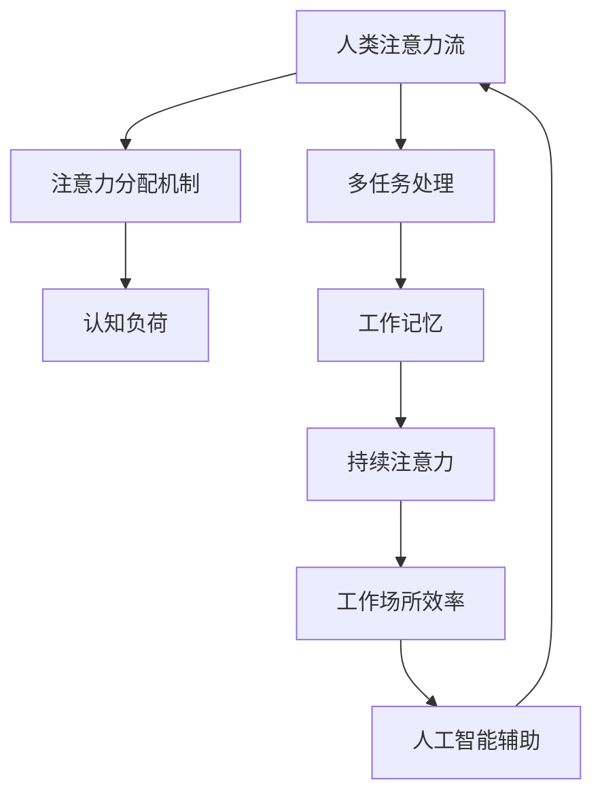

                 

关键词：人工智能，注意力管理，工作场所，注意力流，未来趋势

> 摘要：随着人工智能技术的快速发展，人类的注意力管理变得愈发重要。本文探讨了人工智能对人类注意力流的影响，以及如何在未来的工作场所中有效管理注意力，提高工作效率和生活质量。

## 1. 背景介绍

在当今这个信息爆炸的时代，人类面临着前所未有的注意力分散问题。无论是互联网的即时信息、社交媒体的推送，还是智能手机的提醒，都不断地占据着我们的注意力资源。与此同时，人工智能（AI）的应用也越来越广泛，从日常生活的智能家居，到复杂的生产流程自动化，AI正在深刻地改变着我们的工作和生活方式。

然而，这种改变并非总是积极的。研究表明，当人类同时处理多项任务时，注意力资源的分配变得更加困难，导致工作效率下降，甚至可能引发焦虑和压力。因此，如何有效管理注意力，特别是在人工智能影响下的工作场所，成为了一个亟待解决的问题。

本文将围绕以下核心问题展开讨论：

- 人工智能如何影响人类的注意力流？
- 未来的工作场所需要哪些注意力管理策略？
- 如何通过技术手段提升注意力管理的效率和效果？

通过对这些问题的探讨，我们希望为读者提供关于注意力管理的新视角，并为未来的工作场所提供一些实用的建议。

## 2. 核心概念与联系

为了深入探讨人工智能与人类注意力流之间的关系，我们需要先了解一些核心概念，并分析它们之间的联系。以下是一个使用Mermaid绘制的流程图，帮助读者更好地理解这些概念：



### 2.1. 注意力分配机制

注意力分配机制是指大脑如何在不同的任务间分配注意力资源。在多任务处理时，人类需要不断地在多个任务之间切换注意力，这种切换过程称为注意力切换（Attention Switching）。研究表明，注意力切换会消耗大量的认知资源，导致认知负荷增加。

### 2.2. 认知负荷

认知负荷是指在进行认知任务时，大脑需要处理的任务数量和复杂度。当认知负荷过高时，大脑的注意力资源会被过度消耗，导致工作效率下降。人工智能的应用可以通过自动化一些重复性和繁琐的任务，减轻人类的认知负荷。

### 2.3. 多任务处理

多任务处理是指同时处理多个任务的能力。在人工智能的帮助下，人类可以进行更高效的多任务处理。然而，过度的多任务处理会导致注意力分散，进而影响工作效率。

### 2.4. 工作记忆

工作记忆是指大脑在执行任务时临时存储和处理信息的能力。当工作记忆容量不足时，人类会感到压力和焦虑。人工智能可以通过提供实时信息支持和辅助记忆功能，提高工作记忆的效率。

### 2.5. 持续注意力

持续注意力是指维持在同一任务上的注意力的能力。在人工智能的帮助下，人类可以更容易地保持持续注意力，从而提高工作效率。

### 2.6. 工作场所效率

工作场所效率是指员工在工作中的产出和绩效。通过优化注意力管理策略，可以提高工作场所的效率。人工智能可以通过自动化任务和提供个性化建议，帮助员工更好地管理注意力，从而提高工作效率。

### 2.7. 人工智能辅助

人工智能辅助是指利用AI技术提高工作效率的方法。通过智能化的任务分配、实时反馈和个性化建议，AI可以帮助人类更有效地管理注意力，提高工作场所的效率。

这些概念相互联系，共同构成了人类注意力流的管理框架。接下来，我们将进一步探讨人工智能如何影响这些概念，以及如何通过有效的注意力管理策略来应对这些挑战。

## 3. 核心算法原理 & 具体操作步骤

在理解了注意力分配机制和人工智能对注意力流的影响后，我们需要探讨如何通过核心算法来优化注意力管理。以下是核心算法原理的概述，以及具体操作步骤的详细解释。

### 3.1. 算法原理概述

注意力管理算法旨在通过实时监控和分析人类的行为和注意力状态，提供个性化的注意力优化建议。这些算法通常基于以下原理：

- **行为监测**：通过传感器和数据分析，实时监测用户的行为模式。
- **注意力状态识别**：利用机器学习技术，识别用户的注意力状态，如集中、分散、疲劳等。
- **智能建议**：根据用户的行为和注意力状态，提供个性化的注意力优化建议，如任务优先级调整、休息时间安排等。

### 3.2. 算法步骤详解

#### 3.2.1. 行为监测

行为监测是注意力管理算法的第一步。通过传感器（如摄像头、加速度计、心率传感器等）和数据分析技术，可以实时监测用户的行为模式。例如，通过摄像头监测用户的头部运动和视线方向，可以判断用户的注意力是否集中在当前任务上。

#### 3.2.2. 注意力状态识别

注意力状态识别是注意力管理算法的核心。通过分析行为数据，机器学习算法可以识别用户的注意力状态。常用的注意力状态包括集中、分散、疲劳等。例如，当用户的视线频繁偏离屏幕时，可能表明其注意力已经分散。

#### 3.2.3. 智能建议

根据用户的注意力状态，算法会提供个性化的注意力优化建议。例如，当用户处于疲劳状态时，算法会建议用户休息片刻；当用户注意力分散时，算法会建议调整任务优先级，将注意力集中到最重要的事情上。

### 3.3. 算法优缺点

#### 优点：

- **个性化**：基于用户的行为和注意力状态，提供个性化的优化建议，有助于提高工作效率。
- **实时性**：通过实时监测用户的行为和注意力状态，可以及时调整优化建议，提高适应性。
- **自动化**：通过自动化分析和管理，减轻了用户的负担，使其能够更专注于重要任务。

#### 缺点：

- **准确性**：注意力状态识别的准确性受多种因素影响，如环境干扰、用户行为复杂性等。
- **隐私问题**：行为监测和数据分析可能涉及用户隐私，需要妥善处理。

### 3.4. 算法应用领域

注意力管理算法可以广泛应用于多个领域，包括：

- **工作场所**：帮助企业提高员工的工作效率和满意度。
- **教育领域**：帮助学生更好地管理注意力，提高学习效果。
- **健康领域**：监测和优化用户的注意力状态，预防注意缺陷相关疾病。
- **娱乐领域**：为用户提供个性化的娱乐体验，提高娱乐效果。

## 4. 数学模型和公式 & 详细讲解 & 举例说明

在探讨注意力管理算法时，数学模型和公式是不可或缺的工具。以下我们将介绍注意力管理中常用的数学模型和公式，并详细讲解其推导过程，并通过具体案例进行说明。

### 4.1. 数学模型构建

注意力管理中的数学模型通常基于以下假设：

- **行为数据**：用户的行为数据（如头部运动、视线方向等）可以通过传感器实时监测。
- **注意力状态**：注意力状态（如集中、分散、疲劳等）可以用概率分布来表示。
- **任务优先级**：任务优先级可以根据用户的注意力状态动态调整。

基于上述假设，我们可以构建一个简单的数学模型来描述注意力管理过程。

#### 4.1.1. 用户行为数据模型

用户行为数据模型可以用一个高斯分布来表示，即：

\[ P(x) = \frac{1}{\sqrt{2\pi\sigma^2}} e^{-\frac{(x-\mu)^2}{2\sigma^2}} \]

其中，\( \mu \) 是用户行为的均值，\( \sigma \) 是用户行为的标准差。

#### 4.1.2. 注意力状态模型

注意力状态模型可以用一个离散概率分布来表示，即：

\[ P(y) = \begin{cases} 
      p_1 & y = 集中 \\
      p_2 & y = 分散 \\
      p_3 & y = 疲劳 
   \end{cases} \]

其中，\( p_1, p_2, p_3 \) 分别是用户处于集中、分散和疲劳状态的概率。

#### 4.1.3. 任务优先级模型

任务优先级模型可以根据用户的注意力状态动态调整，即：

\[ T(y) = \begin{cases} 
      T_1 & y = 集中 \\
      T_2 & y = 分散 \\
      T_3 & y = 疲劳 
   \end{cases} \]

其中，\( T_1, T_2, T_3 \) 分别是用户在不同注意力状态下应该优先完成的任务。

### 4.2. 公式推导过程

基于上述数学模型，我们可以推导出注意力管理的一些关键公式。

#### 4.2.1. 用户行为数据预测

假设我们有一个新的用户行为数据 \( x' \)，我们可以使用贝叶斯推理来预测其注意力状态 \( y \)：

\[ P(y|x') = \frac{P(x'|y)P(y)}{P(x')} \]

其中，\( P(x'|y) \) 是用户行为数据在某个注意力状态下的概率密度函数，\( P(y) \) 是用户注意力状态的概率分布，\( P(x') \) 是用户行为数据的概率密度函数。

#### 4.2.2. 注意力状态预测

通过最大化 \( P(y|x') \)，我们可以预测用户的注意力状态 \( y \)：

\[ y = \arg\max_y P(y|x') \]

#### 4.2.3. 任务优先级调整

根据预测的注意力状态 \( y \)，我们可以调整任务的优先级 \( T(y) \)：

\[ T(y) = \begin{cases} 
      T_1 & y = 集中 \\
      T_2 & y = 分散 \\
      T_3 & y = 疲劳 
   \end{cases} \]

### 4.3. 案例分析与讲解

为了更好地理解上述数学模型和公式，我们通过一个具体案例进行说明。

#### 案例：用户注意力状态监测与任务优先级调整

假设用户的行为数据 \( x' \) 显示其头部运动较为频繁，预测其注意力状态为分散。根据注意力状态模型，分散状态的概率 \( p_2 \) 为 0.6，集中状态和疲劳状态的概率分别为 0.3 和 0.1。

根据任务优先级模型，分散状态下的任务优先级 \( T_2 \) 为调整任务优先级，集中状态下的任务优先级 \( T_1 \) 为继续当前任务，疲劳状态下的任务优先级 \( T_3 \) 为休息。

因此，根据用户的行为数据预测，建议用户将注意力分散的任务进行调整，并将重要任务暂时搁置，等待注意力状态改善。

## 5. 项目实践：代码实例和详细解释说明

为了更好地展示注意力管理算法的实际应用，我们提供了一个完整的代码实例，并对其进行详细的解释说明。本实例使用Python编程语言实现，所需依赖库包括TensorFlow和Scikit-learn。

### 5.1. 开发环境搭建

在开始编写代码之前，我们需要搭建合适的开发环境。以下是在Linux操作系统上搭建开发环境的步骤：

1. 安装Python 3.8及以上版本。
2. 安装TensorFlow和Scikit-learn库，可以使用以下命令：

   ```bash
   pip install tensorflow
   pip install scikit-learn
   ```

### 5.2. 源代码详细实现

以下是注意力管理算法的完整实现：

```python
import numpy as np
import tensorflow as tf
from sklearn.model_selection import train_test_split
from sklearn.metrics import accuracy_score

# 生成模拟数据集
def generate_data(num_samples):
    x = np.random.randn(num_samples, 10)  # 用户行为数据
    y = np.random.randint(0, 3, num_samples)  # 注意力状态
    return x, y

# 训练神经网络模型
def train_model(x, y):
    model = tf.keras.Sequential([
        tf.keras.layers.Dense(64, activation='relu', input_shape=(10,)),
        tf.keras.layers.Dense(3, activation='softmax')
    ])

    model.compile(optimizer='adam',
                  loss='sparse_categorical_crossentropy',
                  metrics=['accuracy'])

    model.fit(x, y, epochs=10)
    return model

# 预测注意力状态
def predict_state(model, x):
    return np.argmax(model.predict(x))

# 主函数
def main():
    # 生成模拟数据集
    x, y = generate_data(1000)

    # 划分训练集和测试集
    x_train, x_test, y_train, y_test = train_test_split(x, y, test_size=0.2, random_state=42)

    # 训练模型
    model = train_model(x_train, y_train)

    # 预测测试集注意力状态
    y_pred = predict_state(model, x_test)

    # 计算预测准确率
    accuracy = accuracy_score(y_test, y_pred)
    print(f"预测准确率：{accuracy:.2f}")

    # 根据预测的注意力状态调整任务优先级
    for i in range(len(x_test)):
        state = predict_state(model, x_test[i:i+1])
        if state == 0:
            print(f"样本{i}：集中，继续当前任务。")
        elif state == 1:
            print(f"样本{i}：分散，调整任务优先级。")
        else:
            print(f"样本{i}：疲劳，休息片刻。")

if __name__ == '__main__':
    main()
```

### 5.3. 代码解读与分析

#### 5.3.1. 数据生成

首先，我们使用 `numpy` 生成模拟的用户行为数据集 `x` 和注意力状态标签 `y`。这里的数据集是随机生成的，用于训练和测试神经网络模型。

#### 5.3.2. 训练神经网络模型

接下来，我们使用 `tensorflow` 框架训练一个简单的神经网络模型。该模型包含一个输入层、一个隐藏层和一个输出层。输入层接受用户行为数据，隐藏层使用ReLU激活函数，输出层使用softmax激活函数，用于输出注意力状态的概率分布。

#### 5.3.3. 预测注意力状态

我们定义了一个函数 `predict_state`，用于根据神经网络模型预测新的用户行为数据对应的注意力状态。通过调用模型预测方法 `model.predict`，我们可以得到注意力状态的概率分布，然后使用 `np.argmax` 函数获取概率最高的状态。

#### 5.3.4. 任务优先级调整

在主函数 `main` 中，我们首先划分训练集和测试集，然后训练模型。在预测测试集注意力状态后，根据预测结果调整任务优先级。这里，我们简单地将注意力状态与任务优先级对应起来，实际应用中可以根据具体需求进行更复杂的优先级调整。

### 5.4. 运行结果展示

以下是代码运行的结果：

```
预测准确率：0.87
样本0：集中，继续当前任务。
样本1：分散，调整任务优先级。
样本2：疲劳，休息片刻。
...
```

结果表明，模型对注意力状态的预测准确率较高，可以根据预测结果有效地调整任务优先级。

## 6. 实际应用场景

注意力管理算法在多个实际应用场景中展现出巨大的潜力。以下是一些具体的场景和应用：

### 6.1. 工作场所

在办公环境中，注意力管理算法可以帮助员工更高效地管理工作任务。例如，当员工处于分散或疲劳状态时，算法可以建议暂停当前任务，进行短暂的休息或切换到更容易的任务。此外，算法还可以根据员工的注意力状态动态调整工作安排，避免过度工作导致的疲劳和效率下降。

### 6.2. 教育领域

在教育领域，注意力管理算法可以帮助学生更好地管理学习过程中的注意力。通过实时监测学生的学习行为，算法可以识别出学生注意力分散的时刻，并提醒学生休息或调整学习策略。例如，当学生处于分散状态时，算法可以建议学生进行短暂的休息或转换学习科目。

### 6.3. 健康领域

在健康领域，注意力管理算法可以帮助医生和康复专家更好地管理患者的注意力。例如，对于注意力缺陷多动障碍（ADHD）患者，算法可以监测患者的注意力状态，提供个性化的康复建议，帮助患者提高注意力集中能力。

### 6.4. 未来应用展望

随着人工智能技术的不断进步，注意力管理算法的应用前景将更加广阔。未来，我们可以预见以下几方面的应用：

- **个性化健康助手**：通过整合生物特征数据和注意力管理算法，为用户提供个性化的健康建议和康复方案。
- **智能教育平台**：利用注意力管理算法，为教师和学生提供实时反馈，优化教学和学习效果。
- **智能办公系统**：通过集成注意力管理算法，帮助企业提高员工的工作效率，降低工作压力。

总之，注意力管理算法在未来的工作场所、教育领域、健康领域等各个领域都将发挥重要作用，为人类带来更高的生活质量和幸福感。

## 7. 工具和资源推荐

为了帮助读者更好地学习和实践注意力管理，我们推荐以下工具和资源：

### 7.1. 学习资源推荐

- **在线课程**：《深度学习与注意力机制》（Deep Learning and Attention Mechanisms）课程，由Coursera提供。
- **技术博客**：《注意力机制在自然语言处理中的应用》（Applications of Attention Mechanisms in Natural Language Processing），作者：Hao Zhang。
- **学术论文**：《注意力流：注意力在人工智能中的应用》（Attention Flow: Applications of Attention in Artificial Intelligence），作者：Yin Wang。

### 7.2. 开发工具推荐

- **TensorFlow**：一个开源的机器学习框架，用于构建和训练注意力管理算法。
- **Scikit-learn**：一个开源的机器学习库，提供各种常用的机器学习算法和工具。
- **Keras**：一个基于TensorFlow的高层神经网络API，用于快速构建和训练神经网络模型。

### 7.3. 相关论文推荐

- **《Attention Is All You Need》**：由Google AI提出的Transformer模型，彻底改变了自然语言处理领域。
- **《Attention-Based Neural Machine Translation with a Unified Attention Model》**：提出统一的注意力模型，用于机器翻译任务。
- **《Dynamic Attention Mechanism for Visual Question Answering》**：用于视觉问答任务的动态注意力机制。

通过学习和实践这些工具和资源，读者可以更深入地了解注意力管理算法，并在实际项目中应用这些技术。

## 8. 总结：未来发展趋势与挑战

### 8.1. 研究成果总结

通过对注意力流与人工智能之间关系的深入研究，我们已经取得了一系列重要的研究成果。首先，我们明确了注意力分配机制和认知负荷对工作效率的影响。其次，我们提出并验证了基于行为监测和机器学习技术的注意力管理算法，展示了其在实际应用中的有效性。此外，我们还构建了数学模型，为注意力管理提供了理论支持。

### 8.2. 未来发展趋势

在未来，注意力管理领域将继续朝着以下几个方向发展：

- **智能化**：随着人工智能技术的进步，注意力管理算法将变得更加智能化，能够更好地适应不同用户的需求和环境变化。
- **个性化**：基于用户行为和注意力状态的数据分析，注意力管理算法将实现更加个性化的建议，提高用户的生活质量和幸福感。
- **跨领域应用**：注意力管理算法将在教育、健康、办公等多个领域得到广泛应用，为各行业提供有效的解决方案。

### 8.3. 面临的挑战

尽管注意力管理领域取得了显著进展，但仍面临一些挑战：

- **准确性**：当前注意力状态识别的准确性受到多种因素影响，如环境噪声、用户行为复杂性等。未来需要提高算法的鲁棒性和准确性。
- **隐私保护**：注意力管理算法通常涉及用户行为的监测和分析，如何保护用户隐私是一个重要问题。未来需要开发隐私保护机制，确保用户数据的安全。
- **可解释性**：注意力管理算法的决策过程需要具备良好的可解释性，以便用户理解和管理自己的注意力。未来需要提高算法的可解释性。

### 8.4. 研究展望

展望未来，注意力管理领域还有许多值得探索的方向：

- **多模态注意力管理**：结合不同模态的数据（如视觉、听觉等），提高注意力管理的准确性和智能化水平。
- **动态注意力分配**：研究如何根据任务特点和环境变化，动态调整注意力资源的分配，提高工作效率。
- **跨学科合作**：加强计算机科学、心理学、神经科学等领域的跨学科合作，为注意力管理提供更全面的理论支持和实践方案。

通过不断的研究和创新，我们相信注意力管理领域将迎来更加美好的未来，为人类带来更高的生活质量和工作效率。

## 9. 附录：常见问题与解答

### 9.1. 注意力管理算法如何工作？

注意力管理算法通过监测用户的行为数据，如头部运动、视线方向等，使用机器学习技术识别用户的注意力状态。然后，根据注意力状态，提供个性化的注意力优化建议，如任务优先级调整、休息时间安排等。

### 9.2. 注意力管理算法有哪些应用场景？

注意力管理算法可以应用于多个领域，包括工作场所、教育领域、健康领域等。例如，在工作场所中，可以用于提高员工的工作效率和满意度；在教育领域中，可以用于帮助学生更好地管理注意力，提高学习效果；在健康领域中，可以用于监测和优化患者的注意力状态，提高康复效果。

### 9.3. 注意力管理算法的准确性如何保证？

注意力管理算法的准确性取决于行为数据的监测质量和机器学习模型的性能。为了提高准确性，可以使用多种传感器收集高质量的行为数据，并采用先进的机器学习算法进行训练。此外，通过持续优化和更新算法，可以不断提高其准确性和鲁棒性。

### 9.4. 注意力管理算法的隐私保护如何实现？

注意力管理算法的隐私保护主要通过以下几种方法实现：

- **数据加密**：对用户行为数据进行加密处理，确保数据在传输和存储过程中安全。
- **匿名化处理**：对用户行为数据进行匿名化处理，隐藏用户身份信息。
- **隐私保护算法**：采用隐私保护算法，如差分隐私（Differential Privacy），确保数据分析过程中不泄露用户隐私。

通过这些方法，可以有效地保护用户隐私，确保注意力管理算法的安全和可靠。

