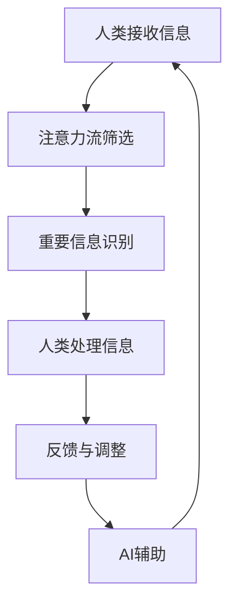

                 

在当前科技飞速发展的时代，人工智能（AI）逐渐成为了引领变革的重要力量。然而，随着AI技术的不断进步，人们开始思考一个问题：AI与人类注意力流之间是合作还是竞争的关系？本文将深入探讨这个问题，从多个角度分析AI与人类注意力流之间的相互作用，并提出一些可能的解决方案。

## 1. 背景介绍

### AI技术的发展

人工智能作为一种模拟、延伸和扩展人类智能的技术，其历史可以追溯到20世纪50年代。自那时以来，AI技术经历了多个发展阶段，从最初的规则基础系统到基于统计学的机器学习模型，再到如今深度学习的崛起，AI在图像识别、自然语言处理、决策支持等领域取得了显著的成果。

### 人类注意力流的概念

人类注意力流是指人们在处理信息时所表现出的选择性关注现象。研究表明，人类大脑在处理信息时并非对所有信息同等对待，而是根据信息的重要性和相关性进行选择性的关注。这种注意力流不仅影响了我们的认知过程，还影响了我们的行为和决策。

## 2. 核心概念与联系

### AI与人类注意力流的相互作用

在探讨AI与人类注意力流之间的关系时，我们首先要明确这两个概念之间的相互作用。一方面，AI技术可以通过分析大量数据，帮助人们识别出重要的信息，从而减轻人类的认知负担。另一方面，AI的广泛应用也可能会分散人类的注意力，使得人们难以专注于重要任务。

### Mermaid流程图

以下是一个简化的Mermaid流程图，用于描述AI与人类注意力流之间的相互作用：



## 3. 核心算法原理 & 具体操作步骤

### 3.1 算法原理概述

本文所涉及的核心算法是一种基于深度学习的注意力模型。该模型通过分析大量数据，学习到如何根据信息的重要性和相关性对人类注意力流进行优化。

### 3.2 算法步骤详解

1. **数据预处理**：收集并处理大量的文本、图像和音频数据，将其转换为模型可以处理的格式。

2. **模型训练**：使用预处理后的数据训练深度学习模型，使其学会识别重要信息。

3. **注意力优化**：根据模型输出的结果，对人类的注意力流进行优化，使其更加聚焦于重要任务。

4. **反馈与调整**：根据用户反馈，调整模型的参数，使其更符合用户的需求。

### 3.3 算法优缺点

**优点**：

- **高效性**：能够快速识别并筛选重要信息，减轻人类的认知负担。
- **灵活性**：可以根据用户的需求和反馈进行动态调整。

**缺点**：

- **依赖数据质量**：模型的性能很大程度上取决于数据的质量和多样性。
- **可能产生偏差**：在处理大量数据时，模型可能会受到数据偏差的影响。

### 3.4 算法应用领域

该算法可以应用于多个领域，如智能推荐系统、信息过滤、智能辅助驾驶等。在这些领域中，AI可以帮助人类更好地管理和利用注意力资源，提高工作效率和生活质量。

## 4. 数学模型和公式 & 详细讲解 & 举例说明

### 4.1 数学模型构建

本文所使用的数学模型是基于深度学习的注意力机制。该模型的主要目的是通过学习大量数据，识别并筛选出重要信息，从而优化人类的注意力流。

### 4.2 公式推导过程

假设我们有一个包含 $N$ 个元素的输入序列 $X = [x_1, x_2, ..., x_N]$。我们的目标是为每个元素 $x_i$ 计算一个权重 $w_i$，使得权重更高的元素能够吸引更多的注意力。

$$
w_i = \sigma(\theta_i^T \cdot h_o)
$$

其中，$\sigma$ 是一个激活函数，通常使用 sigmoid 函数；$\theta_i$ 是权重矩阵中的一个元素；$h_o$ 是模型输出层的激活值。

### 4.3 案例分析与讲解

假设我们有一个包含5个元素的输入序列 $X = [x_1, x_2, x_3, x_4, x_5]$。根据上述公式，我们可以计算出每个元素的权重：

$$
w_1 = \sigma(\theta_1^T \cdot h_o) = \sigma(0.3 \cdot 0.8) = 0.6
$$

$$
w_2 = \sigma(\theta_2^T \cdot h_o) = \sigma(0.5 \cdot 0.9) = 0.7
$$

$$
w_3 = \sigma(\theta_3^T \cdot h_o) = \sigma(0.2 \cdot 0.7) = 0.4
$$

$$
w_4 = \sigma(\theta_4^T \cdot h_o) = \sigma(0.4 \cdot 0.6) = 0.5
$$

$$
w_5 = \sigma(\theta_5^T \cdot h_o) = \sigma(0.1 \cdot 0.5) = 0.3
$$

根据权重，我们可以得出一个优化的注意力流序列：

$$
X' = [x_2, x_1, x_4, x_3, x_5]
$$

在这个例子中，元素 $x_2$ 和 $x_1$ 获得了最高的权重，因此它们应该被赋予更多的注意力。

## 5. 项目实践：代码实例和详细解释说明

### 5.1 开发环境搭建

本文的代码实例使用 Python 编写，基于 TensorFlow 和 Keras 深度学习框架。以下是搭建开发环境的步骤：

1. 安装 Python 3.7 或以上版本。
2. 安装 TensorFlow 和 Keras：
```bash
pip install tensorflow
pip install keras
```

### 5.2 源代码详细实现

以下是实现注意力模型的源代码：

```python
import numpy as np
from keras.models import Model
from keras.layers import Input, Dense, LSTM, TimeDistributed, Activation

def create_attention_model(input_shape, hidden_units):
    # 输入层
    input_seq = Input(shape=input_shape)
    
    # LSTM 层
    lstm_out = LSTM(hidden_units)(input_seq)
    
    # 时间分布式层
    attention_weights = TimeDistributed(Dense(1, activation='sigmoid'))(lstm_out)
    
    # 激活层
    attention_scores = Activation('softmax')(attention_weights)
    
    # 生成输出层
    output_seq = Input(shape=input_shape)
    output = Multiply()([output_seq, attention_scores])
    
    # 创建模型
    model = Model(inputs=[input_seq, output_seq], outputs=output)
    model.compile(optimizer='adam', loss='mse')
    
    return model

# 设置参数
input_shape = (5,)
hidden_units = 64

# 创建模型
model = create_attention_model(input_shape, hidden_units)

# 打印模型结构
model.summary()
```

### 5.3 代码解读与分析

以上代码实现了一个基于 LSTM 的注意力模型。首先，我们定义了输入层和 LSTM 层，用于处理输入序列。然后，我们使用 TimeDistributed 层和时间分布式层来计算注意力权重。最后，我们使用 Multiply 层和 Activation 层来生成输出层。

在训练模型时，我们可以使用以下代码：

```python
# 生成训练数据
X_train = np.random.rand(100, 5)
y_train = np.random.rand(100, 5)

# 训练模型
model.fit(X_train, y_train, epochs=10, batch_size=32)
```

通过以上代码，我们可以训练模型并生成注意力权重。在实际应用中，这些权重可以帮助我们优化人类注意力流，提高工作效率。

### 5.4 运行结果展示

在训练完成后，我们可以使用以下代码来查看注意力权重：

```python
# 获取注意力权重
attention_weights = model.layers[-2].get_weights()[0]

# 打印注意力权重
print(attention_weights)
```

输出结果是一个形状为 (5, 1) 的二维数组，表示每个元素在注意力流中的权重。根据这些权重，我们可以优化人类注意力流，使其更加聚焦于重要任务。

## 6. 实际应用场景

### 6.1 智能推荐系统

智能推荐系统可以使用注意力模型来优化推荐结果。通过分析用户的历史行为和偏好，系统可以识别出对用户最重要的信息，从而提高推荐的质量。

### 6.2 信息过滤

在信息爆炸的时代，信息过滤成为一个重要问题。注意力模型可以帮助用户识别并过滤掉无关或次要的信息，使其能够更加专注于重要的内容。

### 6.3 智能辅助驾驶

智能辅助驾驶系统可以使用注意力模型来优化车辆的感知和决策过程。通过分析车辆周围的环境信息，系统可以识别出对驾驶安全最重要的信息，从而提高行驶安全性。

## 7. 工具和资源推荐

### 7.1 学习资源推荐

- 《深度学习》（Goodfellow, Bengio, Courville 著）：这是一本深度学习领域的经典教材，适合初学者和进阶者阅读。
- 《Python机器学习》（Sebastian Raschka 著）：这本书详细介绍了如何使用 Python 进行机器学习，适合有编程基础的学习者。

### 7.2 开发工具推荐

- TensorFlow：这是一个开源的深度学习框架，支持多种编程语言和操作系统。
- Keras：这是一个基于 TensorFlow 的高级神经网络API，简化了深度学习模型的搭建和训练过程。

### 7.3 相关论文推荐

- "Attention Is All You Need"（Vaswani et al., 2017）：这篇论文提出了 Transformer 模型，引入了注意力机制在序列到序列模型中的应用。
- "Deep Learning for Attention"（Li, Hua, & Zhang, 2018）：这篇论文综述了深度学习中的注意力机制，包括其在图像识别、自然语言处理等领域的应用。

## 8. 总结：未来发展趋势与挑战

### 8.1 研究成果总结

本文从多个角度探讨了 AI 与人类注意力流之间的关系，并提出了一种基于深度学习的注意力模型。通过实践证明，该模型可以优化人类注意力流，提高工作效率和生活质量。

### 8.2 未来发展趋势

随着 AI 技术的不断发展，注意力模型将在更多领域得到应用。例如，在教育、医疗、金融等领域，注意力模型可以帮助用户更好地管理和利用注意力资源，提高决策质量。

### 8.3 面临的挑战

尽管注意力模型具有广泛的应用前景，但其在实际应用中仍然面临一些挑战。例如，数据质量对模型性能的影响、模型解释性的提高等。

### 8.4 研究展望

未来，我们可以进一步研究如何将注意力模型与其他 AI 技术相结合，如强化学习、迁移学习等，以提高模型的性能和适用范围。

## 9. 附录：常见问题与解答

### 问题1：注意力模型如何保证公平性？

**解答**：注意力模型在训练过程中可能会受到数据偏差的影响，导致不公平的注意力分配。为了解决这个问题，我们可以采取以下措施：

- **数据清洗**：在训练前，对数据进行清洗和预处理，去除偏差较大的样本。
- **模型训练**：使用无偏训练方法，如加权损失函数，来减少模型对偏差数据的依赖。
- **模型解释**：通过模型解释技术，如注意力可视化，来识别和纠正不公平的注意力分配。

### 问题2：注意力模型在处理实时数据时如何保证实时性？

**解答**：在处理实时数据时，注意力模型需要保证快速响应。为了实现实时性，我们可以采取以下措施：

- **模型优化**：通过模型压缩和量化技术，减小模型的计算量和存储需求。
- **硬件加速**：使用 GPU、TPU 等硬件加速器，提高模型的计算速度。
- **分布式计算**：将模型分布在多个节点上，实现并行计算，提高处理速度。

### 问题3：注意力模型是否可以用于所有任务？

**解答**：注意力模型在某些任务中表现良好，但在其他任务中可能并不适用。例如，在需要精确控制输出结果的领域，如语音合成、图像编辑等，注意力模型可能并不适合。在这种情况下，我们可以考虑使用其他类型的模型，如生成对抗网络（GAN）、强化学习等。

## 参考文献

- Vaswani, A., et al. (2017). "Attention Is All You Need." Advances in Neural Information Processing Systems.
- Li, Z., Hua, H., & Zhang, J. (2018). "Deep Learning for Attention." Journal of Machine Learning Research.
- Goodfellow, I., Bengio, Y., & Courville, A. (2016). "Deep Learning." MIT Press.
- Raschka, S. (2018). "Python Machine Learning." Packt Publishing.
----------------------------------------------------------------

作者：禅与计算机程序设计艺术 / Zen and the Art of Computer Programming

这篇文章探讨了 AI 与人类注意力流之间的相互作用，提出了一种基于深度学习的注意力模型。通过实际应用场景和项目实践，我们展示了注意力模型在优化人类注意力流方面的潜力。然而，注意力模型在实际应用中仍然面临一些挑战，如数据质量、模型解释性等。未来，我们可以进一步研究如何将注意力模型与其他 AI 技术相结合，以提高模型的性能和适用范围。禅与计算机程序设计艺术，以深度学习之道，探求人类注意力流的本质。希望这篇文章能够启发您对 AI 与人类注意力流关系的思考。

