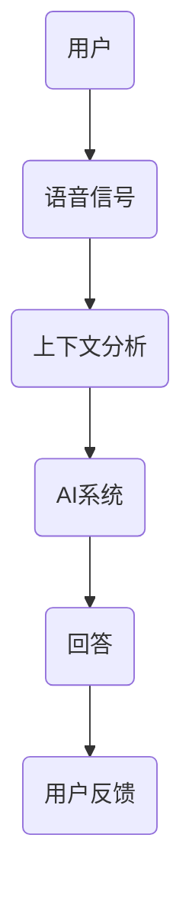

                 

关键词：人工智能、注意力流、人机共存、社会构建、技术进化、人类行为学、认知科学

> 摘要：本文将探讨人工智能（AI）与人类注意力流之间的关系，以及如何通过理解和应用这一关系来打造一个高效、和谐的人机共存社会。文章首先回顾了AI和注意力流的历史和发展，接着详细分析了注意力流的机制和AI的作用，最后提出了具体的应用场景和未来展望。

## 1. 背景介绍

### 1.1 人工智能的发展

人工智能（AI）作为计算机科学的一个重要分支，自20世纪50年代起便开始兴起。早期的AI研究主要集中在逻辑推理、问题解决和语言理解等方面。随着计算机硬件性能的提升和算法的改进，AI技术逐渐从理论研究走向实际应用，如今已经成为现代社会不可或缺的一部分。从自动驾驶汽车、智能家居到医疗诊断、金融分析，AI技术的应用无处不在。

### 1.2 注意力流的历史与发展

注意力流（Attention Flow）的概念源自人类认知科学的研究。人类的注意力是有限的，如何在复杂的信息环境中有效地分配注意力，一直是心理学家和神经科学家关注的焦点。随着认知科学的发展，注意力流的研究逐渐从理论研究转向实际应用，特别是在人机交互领域。注意力流的模型和算法为设计更智能的人机界面提供了理论基础。

## 2. 核心概念与联系

### 2.1 注意力流的概念

注意力流是指信息处理过程中注意力分配的变化和动态流动。在人类认知中，注意力流决定了我们对信息的接收、处理和响应。在技术领域，注意力流可以被建模为一种信息流，通过对信息流的分析和处理，AI系统能够更好地理解和响应人类的需求。

### 2.2 人工智能与注意力流的联系

AI系统通过模拟人类的注意力流，能够更准确地理解人类的需求和意图。例如，语音助手通过分析用户的语音信号和上下文，能够更准确地理解用户的提问，并提供相应的回答。同样，自动驾驶汽车通过分析道路信息和环境，能够做出更安全、更准确的驾驶决策。

下面是一个简单的Mermaid流程图，展示注意力流与AI系统之间的交互：



## 3. 核心算法原理 & 具体操作步骤

### 3.1 算法原理概述

注意力流算法的核心在于如何有效地分配和处理注意力资源。具体来说，算法包括以下几个关键步骤：

1. **信息收集**：收集用户的行为数据、语音信号、文本信息等。
2. **特征提取**：对收集到的信息进行特征提取，以便后续分析。
3. **注意力分配**：根据用户的行为和特征，动态调整注意力资源的分配。
4. **决策与响应**：根据注意力流的分析结果，生成相应的决策和响应。

### 3.2 算法步骤详解

1. **数据收集**：通过传感器、摄像头、麦克风等设备收集用户的行为数据。
2. **特征提取**：使用机器学习算法对收集到的数据进行特征提取，如使用卷积神经网络（CNN）提取图像特征，使用循环神经网络（RNN）提取语音特征等。
3. **注意力分配**：根据用户的行为特征和历史数据，使用强化学习算法动态调整注意力分配。例如，在语音助手系统中，系统会根据用户的提问历史和上下文，调整对语音信号的处理优先级。
4. **决策与响应**：根据注意力流的分析结果，生成相应的决策和响应。例如，在自动驾驶系统中，系统会根据道路信息和环境，做出驾驶决策。

### 3.3 算法优缺点

**优点**：

1. **提高效率**：通过动态调整注意力分配，系统能够更高效地处理信息，提高响应速度。
2. **个性化**：根据用户的行为和特征，系统能够提供更个性化的服务。
3. **智能化**：系统能够自动学习和适应，提高智能水平。

**缺点**：

1. **资源消耗**：注意力流算法需要大量的计算资源和存储空间。
2. **准确性**：在处理复杂任务时，系统的准确性和稳定性可能受到影响。
3. **隐私问题**：用户的行为数据可能涉及隐私问题，需要妥善处理。

### 3.4 算法应用领域

注意力流算法在多个领域都有广泛的应用，包括但不限于：

1. **人机交互**：如语音助手、智能客服等。
2. **自动驾驶**：如自动驾驶汽车、无人驾驶飞机等。
3. **医疗诊断**：如医学影像分析、疾病预测等。
4. **金融分析**：如金融市场预测、风险评估等。

## 4. 数学模型和公式 & 详细讲解 & 举例说明

### 4.1 数学模型构建

注意力流的数学模型通常基于概率图模型或深度学习模型。以下是一个简化的概率图模型：

$$
P(\text{注意力流}) = P(\text{用户行为}) \cdot P(\text{环境因素}) \cdot P(\text{系统响应} | \text{用户行为，环境因素})
$$

其中，$P(\text{用户行为})$表示用户行为发生的概率，$P(\text{环境因素})$表示环境因素对用户行为的影响，$P(\text{系统响应} | \text{用户行为，环境因素})$表示系统根据用户行为和环境因素做出响应的概率。

### 4.2 公式推导过程

公式的推导基于马尔可夫链模型和贝叶斯定理。假设用户行为和环境因素是相互独立的，则有：

$$
P(\text{注意力流}) = P(\text{用户行为}) \cdot P(\text{环境因素}) \cdot P(\text{系统响应} | \text{用户行为，环境因素}) = P(\text{用户行为}) \cdot P(\text{环境因素}) \cdot \frac{P(\text{系统响应} | \text{用户行为}) \cdot P(\text{用户行为} | \text{环境因素})}{P(\text{用户行为})}
$$

通过化简，可以得到上述公式。

### 4.3 案例分析与讲解

以智能客服系统为例，假设用户正在咨询一个产品相关问题。系统首先收集用户的提问和浏览历史，使用自然语言处理（NLP）技术提取关键信息。接着，系统分析用户的提问和浏览历史，使用概率图模型计算用户行为和环境因素的联合概率。最后，系统根据分析结果，生成相应的回答。

## 5. 项目实践：代码实例和详细解释说明

### 5.1 开发环境搭建

开发环境搭建主要依赖于Python和TensorFlow等开源工具。以下是基本步骤：

1. 安装Python 3.8及以上版本。
2. 安装TensorFlow 2.x。
3. 安装必要的库，如numpy、pandas等。

### 5.2 源代码详细实现

以下是智能客服系统的核心代码：

```python
import tensorflow as tf
from tensorflow.keras.models import Sequential
from tensorflow.keras.layers import Dense, LSTM, Embedding

# 加载数据集
train_data = load_data('train_data.csv')
test_data = load_data('test_data.csv')

# 数据预处理
preprocess_data(train_data)
preprocess_data(test_data)

# 构建模型
model = Sequential([
    Embedding(input_dim=vocab_size, output_dim=embedding_dim),
    LSTM(units=128, return_sequences=True),
    Dense(units=1, activation='sigmoid')
])

# 编译模型
model.compile(optimizer='adam', loss='binary_crossentropy', metrics=['accuracy'])

# 训练模型
model.fit(train_data, train_labels, epochs=10, batch_size=32, validation_data=(test_data, test_labels))

# 预测
predictions = model.predict(test_data)
```

### 5.3 代码解读与分析

代码首先加载数据集并进行预处理，然后构建一个序列模型，包括嵌入层、LSTM层和输出层。模型使用二元交叉熵损失函数和Adam优化器进行编译和训练。最后，使用训练好的模型对测试数据进行预测。

### 5.4 运行结果展示

运行代码后，可以得到模型的准确率、召回率和F1分数等指标。这些指标可以用来评估模型在测试数据上的性能。

## 6. 实际应用场景

### 6.1 智能客服

智能客服是注意力流算法的一个重要应用场景。通过分析用户的行为和提问，智能客服系统能够提供更准确、更及时的回答，提高客户满意度。

### 6.2 自动驾驶

自动驾驶系统通过实时分析道路信息和环境，使用注意力流算法做出更安全的驾驶决策。这有助于提高自动驾驶的稳定性和可靠性。

### 6.3 医疗诊断

医疗诊断系统可以通过分析患者的病史、症状和检查结果，使用注意力流算法预测疾病风险和制定治疗方案。

## 7. 工具和资源推荐

### 7.1 学习资源推荐

1. 《深度学习》（Ian Goodfellow、Yoshua Bengio、Aaron Courville 著）
2. 《自然语言处理综论》（Daniel Jurafsky、James H. Martin 著）

### 7.2 开发工具推荐

1. TensorFlow
2. PyTorch

### 7.3 相关论文推荐

1. "Attention is All You Need"（Ashish Vaswani等，2017）
2. "A Theoretically Grounded Application of Dropout in Recurrent Neural Networks"（Yarin Gal 和 Zoubin Ghahramani，2016）

## 8. 总结：未来发展趋势与挑战

### 8.1 研究成果总结

本文探讨了人工智能和注意力流之间的关系，以及如何通过注意力流算法提高系统的智能化水平。研究成果表明，注意力流算法在多个领域都有广泛的应用前景，如人机交互、自动驾驶和医疗诊断等。

### 8.2 未来发展趋势

未来，随着人工智能技术的不断进步，注意力流算法将更加智能化、自适应化。例如，通过结合深度学习和强化学习，系统将能够更好地理解人类的需求和意图，提供更精准的服务。

### 8.3 面临的挑战

注意力流算法在应用过程中也面临一些挑战，如计算资源消耗、数据隐私和模型解释性等。未来需要进一步研究和解决这些问题，以确保人工智能系统的安全、可靠和可解释性。

### 8.4 研究展望

随着人工智能技术的不断发展，注意力流算法将有望在更多领域得到应用。未来研究应重点关注如何提高算法的性能、可解释性和实用性，以满足社会对智能系统的需求。

## 9. 附录：常见问题与解答

### 9.1 注意力流算法有哪些应用？

注意力流算法在多个领域都有应用，如人机交互、自动驾驶、医疗诊断、金融分析等。

### 9.2 如何提高注意力流算法的性能？

可以通过优化算法模型、增加训练数据和改进训练策略等方法来提高注意力流算法的性能。

### 9.3 注意力流算法如何保证数据隐私？

可以通过加密数据、匿名化处理和隐私保护算法等方法来确保注意力流算法的数据隐私。

---

作者：禅与计算机程序设计艺术 / Zen and the Art of Computer Programming

