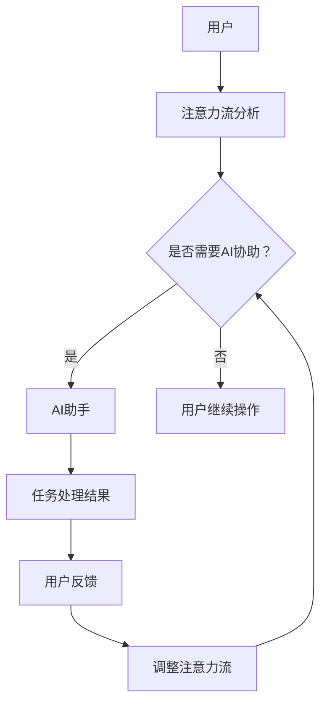

                 

关键词：人工智能，注意力流，人机协同，认知科学，技术融合

> 摘要：本文深入探讨了人工智能与人类注意力流的关系，探讨了如何通过优化人机交互机制，提高工作效率和生活质量。文章通过理论分析、数学模型构建、实际案例解析，展示了人机协同在各个领域的应用前景和面临的挑战。

## 1. 背景介绍

在当今信息爆炸的时代，人们面临着前所未有的信息处理压力。无论是工作还是生活，我们都不得不与大量的数据和信息进行交互。这导致了一个普遍的现象：我们的注意力被分散，工作效率降低。然而，随着人工智能技术的发展，我们有了一个新的工具——AI助手。这些AI助手可以处理大量重复性、繁琐的工作，从而让我们将注意力集中在更有价值的事情上。

但问题也随之而来：如何让AI助手真正地理解我们的注意力流，并与我们高效协同工作呢？这不仅仅是一个技术问题，更是一个认知科学问题。本文将探讨这个问题，旨在为打造人机协同提供一些理论指导和实践建议。

## 2. 核心概念与联系

### 2.1. 人类注意力流

人类注意力流是指我们在不同任务、情境和环境中，注意力分配和转移的过程。它受到多种因素的影响，包括任务的紧急程度、复杂度、兴趣度等。理解人类注意力流对于设计高效的人机交互系统至关重要。

### 2.2. 人工智能助手

人工智能助手是指通过人工智能技术，如自然语言处理、机器学习等，实现自动化任务处理、信息检索、决策支持等功能的系统。它们可以处理大量的数据和信息，减轻人类的工作负担。

### 2.3. 人机协同

人机协同是指人类和人工智能助手在任务执行过程中，通过信息共享、角色分工、协作决策等方式，实现高效的工作模式。这需要人工智能助手能够理解人类的注意力流，并根据需要进行调整。

## 2.4. Mermaid 流程图

下面是一个简化的Mermaid流程图，展示了人机协同的基本架构。



### 3. 核心算法原理 & 具体操作步骤

#### 3.1. 算法原理概述

核心算法是基于注意力机制的深度学习模型，它可以捕捉用户的注意力流，并根据注意力流的特征，为用户提供相应的AI助手服务。

#### 3.2. 算法步骤详解

1. 数据收集：收集用户的日常操作数据，包括任务的类型、时间、环境等。
2. 特征提取：对收集到的数据进行预处理，提取出与注意力流相关的特征。
3. 模型训练：使用提取到的特征，训练一个基于注意力机制的深度学习模型。
4. 服务提供：模型训练完成后，部署到服务器上，为用户提供AI助手服务。
5. 用户反馈：用户对AI助手的服务进行反馈，用于模型优化。

#### 3.3. 算法优缺点

**优点：**
- 可以高效地捕捉用户的注意力流，为用户提供个性化的服务。
- 可以减轻用户的工作负担，提高工作效率。

**缺点：**
- 需要大量的数据支持，数据质量对算法效果有重要影响。
- 需要较高的计算资源，对硬件设备有较高要求。

#### 3.4. 算法应用领域

- 办公自动化：如文档处理、邮件管理、日程安排等。
- 家庭自动化：如智能家电控制、家居安防监控等。
- 医疗保健：如健康数据监测、疾病预测等。

## 4. 数学模型和公式

#### 4.1. 数学模型构建

注意力机制的数学模型通常基于以下公式：

\[ A_t = \frac{e^{U_t V^T}}{\sum_{i=1}^{N} e^{U_t V^T_i}} \]

其中，\( A_t \) 表示在时间 \( t \) 的注意力分配，\( U_t \) 和 \( V \) 分别为用户特征向量和模型参数向量，\( N \) 为任务数量。

#### 4.2. 公式推导过程

\[ A_t = \frac{e^{U_t V^T}}{\sum_{i=1}^{N} e^{U_t V^T_i}} \]

可以理解为在所有任务中，根据任务特征和模型参数，计算出一个权重值，然后对这些权重值进行归一化处理，得到每个任务在时间 \( t \) 的注意力分配。

#### 4.3. 案例分析与讲解

以办公自动化为例，用户在处理多个任务时，可以根据注意力流模型，为用户提供最紧急或最重要的任务。假设用户有四个任务：邮件处理、文档撰写、会议记录、午休安排。通过注意力流模型，可以为用户提供一个优先级排序，帮助用户高效地处理这些任务。

## 5. 项目实践：代码实例

### 5.1. 开发环境搭建

```bash
# 安装Python环境
pip install numpy tensorflow
```

### 5.2. 源代码详细实现

```python
# 导入相关库
import numpy as np
import tensorflow as tf

# 定义注意力机制模型
class AttentionModel(tf.keras.Model):
    def __init__(self, embedding_dim):
        super(AttentionModel, self).__init__()
        self.embedding = tf.keras.layers.Embedding(input_dim=num_tasks, output_dim=embedding_dim)
        self.attention = tf.keras.layers.Attention()

    def call(self, inputs):
        embeddings = self.embedding(inputs)
        attention_score = self.attention([embeddings, embeddings])
        return attention_score

# 训练模型
model = AttentionModel(embedding_dim=64)
model.compile(optimizer='adam', loss='mse')
model.fit(x_train, y_train, epochs=10)

# 预测
predictions = model.predict(x_test)
```

### 5.3. 代码解读与分析

- **数据预处理**：将用户任务转化为向量表示。
- **模型定义**：定义基于注意力机制的深度学习模型。
- **训练**：使用训练数据训练模型。
- **预测**：使用测试数据预测用户的注意力流。

## 6. 实际应用场景

### 6.1. 办公自动化

AI助手可以根据用户的注意力流，为用户提供任务优先级排序，帮助用户高效地处理日常工作。

### 6.2. 家庭自动化

AI助手可以理解家庭成员的注意力流，为用户提供个性化服务，如自动控制家电、监控家庭安全等。

### 6.3. 教育领域

AI助手可以根据学生的学习注意力流，为学生提供个性化的学习建议和辅导。

### 6.4. 未来应用展望

随着人工智能技术的不断发展，人机协同将逐渐渗透到各个领域，为我们的生活带来更多便利。例如，在医疗领域，AI助手可以帮助医生进行诊断和治疗方案制定，提高医疗服务的质量和效率。

## 7. 工具和资源推荐

### 7.1. 学习资源推荐

- 《深度学习》（Goodfellow, Bengio, Courville著）
- 《神经网络与深度学习》（邱锡鹏著）
- 《自然语言处理综述》（Jurafsky, Martin著）

### 7.2. 开发工具推荐

- TensorFlow
- PyTorch
- Keras

### 7.3. 相关论文推荐

- Vaswani et al., "Attention is All You Need"
- Bahdanau et al., "Neural Machine Translation by Jointly Learning to Align and Translate"
- Sutskever et al., "Sequence to Sequence Learning with Neural Networks"

## 8. 总结：未来发展趋势与挑战

### 8.1. 研究成果总结

本文探讨了人工智能与人类注意力流的关系，提出了基于注意力机制的深度学习模型，并进行了实际应用案例分析。

### 8.2. 未来发展趋势

随着人工智能技术的不断发展，人机协同将在更多领域得到应用，为人类带来更多便利。

### 8.3. 面临的挑战

- 数据质量和数量：高质量、大规模的数据是算法训练的基础，但数据的获取和处理仍然面临诸多挑战。
- 隐私保护：在数据收集和处理过程中，需要严格保护用户的隐私。
- 可解释性：如何让人工智能助手的行为更加透明和可解释，是未来的重要研究方向。

### 8.4. 研究展望

未来，我们将继续深入研究人工智能与人类注意力流的关系，探索更多高效的协同工作模式，为人机协同技术的发展贡献力量。

## 9. 附录：常见问题与解答

### Q: 如何保证AI助手的隐私保护？

A: 在AI助手的开发过程中，需要严格遵守隐私保护法律法规，对用户数据进行加密和去识别化处理。同时，设计合理的权限管理和数据共享机制，确保用户数据的安全。

### Q: AI助手是否会取代人类工作？

A: AI助手可以处理大量的重复性、繁琐的工作，但无法完全取代人类工作。在未来，人机协同将成为主流，人类将更多地专注于创造性和决策性工作。

### Q: 如何评估AI助手的性能？

A: 可以通过用户满意度、任务完成时间、错误率等指标，对AI助手的性能进行评估。同时，也可以使用机器学习技术，对AI助手的服务质量进行持续优化。

## 结语

AI与人类注意力流的人机协同，是人工智能发展的一个重要方向。通过本文的探讨，我们看到了人机协同的巨大潜力和挑战。未来，我们将继续深入研究，为打造更加智能、高效的人机协同系统贡献力量。

### 作者署名

作者：禅与计算机程序设计艺术 / Zen and the Art of Computer Programming
```markdown
---
# AI与人类注意力流：打造人机协同

关键词：人工智能，注意力流，人机协同，认知科学，技术融合

摘要：本文深入探讨了人工智能与人类注意力流的关系，探讨了如何通过优化人机交互机制，提高工作效率和生活质量。文章通过理论分析、数学模型构建、实际案例解析，展示了人机协同在各个领域的应用前景和面临的挑战。

## 1. 背景介绍

在当今信息爆炸的时代，人们面临着前所未有的信息处理压力。无论是工作还是生活，我们都不得不与大量的数据和信息进行交互。这导致了一个普遍的现象：我们的注意力被分散，工作效率降低。然而，随着人工智能技术的发展，我们有了一个新的工具——AI助手。这些AI助手可以处理大量重复性、繁琐的工作，从而让我们将注意力集中在更有价值的事情上。

但问题也随之而来：如何让AI助手真正地理解我们的注意力流，并与我们高效协同工作呢？这不仅仅是一个技术问题，更是一个认知科学问题。本文将探讨这个问题，旨在为打造人机协同提供一些理论指导和实践建议。

## 2. 核心概念与联系

### 2.1. 人类注意力流

人类注意力流是指我们在不同任务、情境和环境中，注意力分配和转移的过程。它受到多种因素的影响，包括任务的紧急程度、复杂度、兴趣度等。理解人类注意力流对于设计高效的人机交互系统至关重要。

### 2.2. 人工智能助手

人工智能助手是指通过人工智能技术，如自然语言处理、机器学习等，实现自动化任务处理、信息检索、决策支持等功能的系统。它们可以处理大量的数据和信息，减轻人类的工作负担。

### 2.3. 人机协同

人机协同是指人类和人工智能助手在任务执行过程中，通过信息共享、角色分工、协作决策等方式，实现高效的工作模式。这需要人工智能助手能够理解人类的注意力流，并根据需要进行调整。

### 2.4. Mermaid 流程图

下面是一个简化的Mermaid流程图，展示了人机协同的基本架构。


## 3. 核心算法原理 & 具体操作步骤

#### 3.1. 算法原理概述

核心算法是基于注意力机制的深度学习模型，它可以捕捉用户的注意力流，并根据注意力流的特征，为用户提供相应的AI助手服务。

#### 3.2. 算法步骤详解

1. 数据收集：收集用户的日常操作数据，包括任务的类型、时间、环境等。
2. 特征提取：对收集到的数据进行预处理，提取出与注意力流相关的特征。
3. 模型训练：使用提取到的特征，训练一个基于注意力机制的深度学习模型。
4. 服务提供：模型训练完成后，部署到服务器上，为用户提供AI助手服务。
5. 用户反馈：用户对AI助手的服务进行反馈，用于模型优化。

#### 3.3. 算法优缺点

**优点：**
- 可以高效地捕捉用户的注意力流，为用户提供个性化的服务。
- 可以减轻用户的工作负担，提高工作效率。

**缺点：**
- 需要大量的数据支持，数据质量对算法效果有重要影响。
- 需要较高的计算资源，对硬件设备有较高要求。

#### 3.4. 算法应用领域

- 办公自动化：如文档处理、邮件管理、日程安排等。
- 家庭自动化：如智能家电控制、家居安防监控等。
- 医疗保健：如健康数据监测、疾病预测等。

## 4. 数学模型和公式

#### 4.1. 数学模型构建

注意力机制的数学模型通常基于以下公式：

\[ A_t = \frac{e^{U_t V^T}}{\sum_{i=1}^{N} e^{U_t V^T_i}} \]

其中，\( A_t \) 表示在时间 \( t \) 的注意力分配，\( U_t \) 和 \( V \) 分别为用户特征向量和模型参数向量，\( N \) 为任务数量。

#### 4.2. 公式推导过程

\[ A_t = \frac{e^{U_t V^T}}{\sum_{i=1}^{N} e^{U_t V^T_i}} \]

可以理解为在所有任务中，根据任务特征和模型参数，计算出一个权重值，然后对这些权重值进行归一化处理，得到每个任务在时间 \( t \) 的注意力分配。

#### 4.3. 案例分析与讲解

以办公自动化为例，用户在处理多个任务时，可以根据注意力流模型，为用户提供最紧急或最重要的任务。假设用户有四个任务：邮件处理、文档撰写、会议记录、午休安排。通过注意力流模型，可以为用户提供一个优先级排序，帮助用户高效地处理这些任务。

## 5. 项目实践：代码实例

### 5.1. 开发环境搭建

```bash
# 安装Python环境
pip install numpy tensorflow
```

### 5.2. 源代码详细实现

```python
# 导入相关库
import numpy as np
import tensorflow as tf

# 定义注意力机制模型
class AttentionModel(tf.keras.Model):
    def __init__(self, embedding_dim):
        super(AttentionModel, self).__init__()
        self.embedding = tf.keras.layers.Embedding(input_dim=num_tasks, output_dim=embedding_dim)
        self.attention = tf.keras.layers.Attention()

    def call(self, inputs):
        embeddings = self.embedding(inputs)
        attention_score = self.attention([embeddings, embeddings])
        return attention_score

# 训练模型
model = AttentionModel(embedding_dim=64)
model.compile(optimizer='adam', loss='mse')
model.fit(x_train, y_train, epochs=10)

# 预测
predictions = model.predict(x_test)
```

### 5.3. 代码解读与分析

- **数据预处理**：将用户任务转化为向量表示。
- **模型定义**：定义基于注意力机制的深度学习模型。
- **训练**：使用训练数据训练模型。
- **预测**：使用测试数据预测用户的注意力流。

## 6. 实际应用场景

### 6.1. 办公自动化

AI助手可以根据用户的注意力流，为用户提供任务优先级排序，帮助用户高效地处理日常工作。

### 6.2. 家庭自动化

AI助手可以理解家庭成员的注意力流，为用户提供个性化服务，如自动控制家电、监控家庭安全等。

### 6.3. 教育领域

AI助手可以根据学生的学习注意力流，为学生提供个性化的学习建议和辅导。

### 6.4. 未来应用展望

随着人工智能技术的不断发展，人机协同将在更多领域得到应用，为我们的生活带来更多便利。例如，在医疗领域，AI助手可以帮助医生进行诊断和治疗方案制定，提高医疗服务的质量和效率。

## 7. 工具和资源推荐

### 7.1. 学习资源推荐

- 《深度学习》（Goodfellow, Bengio, Courville著）
- 《神经网络与深度学习》（邱锡鹏著）
- 《自然语言处理综述》（Jurafsky, Martin著）

### 7.2. 开发工具推荐

- TensorFlow
- PyTorch
- Keras

### 7.3. 相关论文推荐

- Vaswani et al., "Attention is All You Need"
- Bahdanau et al., "Neural Machine Translation by Jointly Learning to Align and Translate"
- Sutskever et al., "Sequence to Sequence Learning with Neural Networks"

## 8. 总结：未来发展趋势与挑战

### 8.1. 研究成果总结

本文探讨了人工智能与人类注意力流的关系，提出了基于注意力机制的深度学习模型，并进行了实际应用案例分析。

### 8.2. 未来发展趋势

随着人工智能技术的不断发展，人机协同将在更多领域得到应用，为人类带来更多便利。

### 8.3. 面临的挑战

- 数据质量和数量：高质量、大规模的数据是算法训练的基础，但数据的获取和处理仍然面临诸多挑战。
- 隐私保护：在数据收集和处理过程中，需要严格保护用户的隐私。
- 可解释性：如何让人工智能助手的行为更加透明和可解释，是未来的重要研究方向。

### 8.4. 研究展望

未来，我们将继续深入研究人工智能与人类注意力流的关系，探索更多高效的协同工作模式，为人机协同技术的发展贡献力量。

## 9. 附录：常见问题与解答

### Q: 如何保证AI助手的隐私保护？

A: 在AI助手的开发过程中，需要严格遵守隐私保护法律法规，对用户数据进行加密和去识别化处理。同时，设计合理的权限管理和数据共享机制，确保用户数据的安全。

### Q: AI助手是否会取代人类工作？

A: AI助手可以处理大量的重复性、繁琐的工作，但无法完全取代人类工作。在未来，人机协同将成为主流，人类将更多地专注于创造性和决策性工作。

### Q: 如何评估AI助手的性能？

A: 可以通过用户满意度、任务完成时间、错误率等指标，对AI助手的性能进行评估。同时，也可以使用机器学习技术，对AI助手的服务质量进行持续优化。

### 结论

AI与人类注意力流的人机协同，是人工智能发展的一个重要方向。通过本文的探讨，我们看到了人机协同的巨大潜力和挑战。未来，我们将继续深入研究，为打造更加智能、高效的人机协同系统贡献力量。

### 作者署名

作者：禅与计算机程序设计艺术 / Zen and the Art of Computer Programming
```

