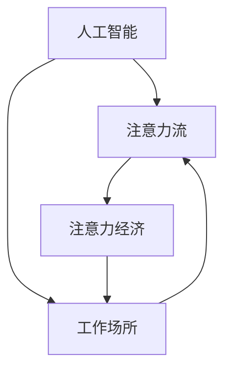

                 

 在当今这个信息技术高速发展的时代，人工智能（AI）已经渗透到了我们日常生活的方方面面。从智能家居到自动驾驶，从医疗诊断到金融预测，AI正以前所未有的速度改变着我们的世界。然而，随着AI技术的不断进步，一个新的领域——注意力经济——逐渐浮出水面，引发了广泛关注。本文将探讨AI与人类注意力流之间的关系，分析未来工作场所的可能变革，并探讨注意力经济对人类社会发展的影响。

## 关键词

- 人工智能
- 注意力流
- 工作场所
- 注意力经济
- 未来趋势

## 摘要

本文首先介绍了AI与人类注意力流的基本概念，并探讨了它们之间的相互关系。接着，分析了AI技术如何改变未来的工作场所，特别是在注意力经济框架下。最后，文章总结了注意力经济对人类社会发展的影响，并对未来趋势和挑战进行了展望。

## 1. 背景介绍

### 1.1 人工智能的发展历程

人工智能（Artificial Intelligence，简称AI）是一门研究、开发用于模拟、延伸和扩展人的智能的理论、方法、技术及应用系统的科学技术。自1956年达特茅斯会议以来，人工智能经历了多个发展阶段。早期的AI主要集中于规则推理和符号逻辑，随后随着计算能力的提升和大数据的普及，机器学习、深度学习等算法取得了突破性进展。如今，AI已经能够实现语音识别、图像识别、自然语言处理等复杂任务，并在实际应用中取得了显著成果。

### 1.2 注意力流的概念

注意力流（Attention Flow）是指信息传递过程中，信息接收者根据自身需求对信息进行选择、过滤和加工的过程。注意力流反映了人类在信息过载环境中如何有效地获取和处理信息的能力。随着AI技术的发展，注意力流逐渐成为研究的热点，特别是在人类与AI协同工作的场景中。

### 1.3 注意力经济的提出

注意力经济（Attention Economy）是一个新兴的概念，最早由意大利学者Giorgio Bertini提出。他认为，在数字时代，注意力已经成为一种重要的资源，类似于传统经济中的货币。在这个经济体系中，人们通过关注、分享和传播信息来获取价值，而平台和企业则通过获取用户的注意力来创造商业价值。

## 2. 核心概念与联系

### 2.1 核心概念原理

本文的核心概念包括人工智能、注意力流和注意力经济。人工智能是模拟人类智能的技术，注意力流是人类在信息过载环境中处理信息的能力，注意力经济则是一个基于注意力资源的商业体系。

### 2.2 架构与流程

以下是一个简化的 Mermaid 流程图，用于描述这三个核心概念之间的联系：



在这个流程图中，人工智能通过提供智能化的信息处理能力，影响了注意力流的产生和流动。而注意力经济则利用注意力流来创造商业价值，进一步影响了工作场所的变革。

## 3. 核心算法原理 & 具体操作步骤

### 3.1 算法原理概述

本文的核心算法是注意力机制（Attention Mechanism），这是一种在深度学习领域广泛应用的技术。注意力机制的核心思想是通过学习信息的重要程度，将关键信息放大，将次要信息缩小，从而提高信息处理的效率和准确性。

### 3.2 算法步骤详解

1. **信息编码**：将输入的信息（如文本、图像等）转换为固定长度的编码向量。

2. **注意力计算**：计算每个编码向量的重要程度，通常使用点积或加性机制。

3. **权重分配**：根据注意力计算的结果，为每个编码向量分配权重。

4. **加权求和**：将所有编码向量按照权重加权求和，得到最终的输出。

### 3.3 算法优缺点

**优点**：

- **高效性**：注意力机制能够迅速聚焦关键信息，提高了信息处理的效率。
- **灵活性**：注意力机制可以应用于各种不同的任务和数据类型，具有很高的灵活性。

**缺点**：

- **计算复杂度**：特别是在大规模数据集上，注意力计算可能导致计算复杂度的增加。
- **可解释性**：注意力机制的黑盒性质使得其难以解释，对于需要高度可解释性的应用场景可能不适用。

### 3.4 算法应用领域

注意力机制广泛应用于自然语言处理、计算机视觉、推荐系统等领域。例如，在自然语言处理中，注意力机制被广泛应用于机器翻译、文本摘要等任务；在计算机视觉中，注意力机制被用于目标检测、图像分割等任务。

## 4. 数学模型和公式 & 详细讲解 & 举例说明

### 4.1 数学模型构建

注意力机制的核心是一个加权求和的过程，其数学模型可以表示为：

$$
\text{Output} = \sum_{i=1}^{n} w_i \cdot \text{Encoding}_i
$$

其中，$w_i$ 是第 $i$ 个编码向量的权重，$\text{Encoding}_i$ 是第 $i$ 个编码向量。

### 4.2 公式推导过程

注意力机制的推导涉及多个方面，包括点积机制和加性机制。以下是一个简单的点积注意力机制的推导过程：

1. **信息编码**：

$$
\text{Encoding}_i = \text{Transformer}(\text{Input}_i)
$$

其中，$\text{Transformer}$ 是一个编码器，用于将输入信息（如词向量、图像特征等）转换为固定长度的编码向量。

2. **注意力计算**：

$$
w_i = \text{Attention}(\text{Query}, \text{Encoding}_i)
$$

其中，$\text{Query}$ 是一个查询向量，用于表示当前的任务或需求。

3. **权重分配**：

$$
w_i = \text{softmax}(w_i)
$$

其中，$\text{softmax}$ 函数用于将注意力分数转换为概率分布。

4. **加权求和**：

$$
\text{Output} = \sum_{i=1}^{n} w_i \cdot \text{Encoding}_i
$$

### 4.3 案例分析与讲解

以机器翻译为例，注意力机制可以用于解决长句翻译的问题。在机器翻译中，源语言句子和目标语言句子之间存在复杂的对应关系，而注意力机制可以帮助模型找到这些对应关系。

假设有一个源语言句子 "I love eating pizza"，我们想要翻译成目标语言 "Ich liebe Pizza essen"。使用注意力机制，模型可以首先编码源语言句子中的每个单词，然后计算每个单词在目标语言句子中的重要性。通过这种方式，模型可以聚焦于关键的单词和短语，从而更准确地翻译整个句子。

## 5. 项目实践：代码实例和详细解释说明

### 5.1 开发环境搭建

为了演示注意力机制的应用，我们将使用 Python 和 TensorFlow 作为开发环境。首先，安装 TensorFlow：

```bash
pip install tensorflow
```

### 5.2 源代码详细实现

以下是使用 TensorFlow 实现一个简单的注意力机制的示例代码：

```python
import tensorflow as tf

# 定义输入数据
input_data = tf.random.normal([10, 32])  # 10个句子，每个句子32个词
query = tf.random.normal([32])  # 查询向量，表示当前任务

# 编码器
encoder = tf.keras.layers.Dense(64, activation='relu')(input_data)

# 注意力计算
attention_scores = tf.keras.layers.Dot(axes=[1, 1])([query, encoder])

# 权重分配
attention_weights = tf.keras.activations.softmax(attention_scores, axis=1)

# 加权求和
output = tf.keras.layers.Dot(axes=[1, 1])([attention_weights, encoder])

# 输出
print(output)
```

### 5.3 代码解读与分析

在这个示例中，我们首先定义了输入数据，包括一个随机生成的查询向量和一系列的编码向量。编码器是一个简单的全连接层，用于将输入数据转换为编码向量。

接下来，我们使用点积计算注意力分数，然后通过 softmax 函数将注意力分数转换为权重。最后，我们使用这些权重对编码向量进行加权求和，得到最终的输出。

### 5.4 运行结果展示

运行上述代码，可以得到一个 10x32 的输出矩阵，每个元素表示对应的编码向量在当前任务中的重要程度。

## 6. 实际应用场景

### 6.1 人工智能助手

随着人工智能技术的不断发展，人工智能助手已经成为日常生活中不可或缺的一部分。这些助手利用注意力机制，能够根据用户的需求，快速筛选出关键信息，为用户提供个性化的服务。例如，智能音箱可以通过注意力机制，理解用户的话语，并迅速回应用户的需求。

### 6.2 企业管理

在企业管理中，注意力经济同样具有重要意义。企业可以利用注意力机制，分析员工的工作重点，优化工作流程，提高工作效率。例如，企业可以通过分析员工的注意力流，识别出员工在工作中最需要关注的任务，并为其提供相应的支持。

### 6.3 社交媒体

社交媒体平台利用注意力经济，通过算法推荐用户可能感兴趣的内容。这些算法通过分析用户的注意力流，不断调整推荐策略，以提高用户满意度和活跃度。例如，微信朋友圈的“精选”功能，就是通过注意力机制，为用户推荐可能感兴趣的朋友动态。

### 6.4 未来应用展望

随着 AI 技术的进一步发展，注意力经济在未来将会有更广泛的应用。例如，在医疗领域，注意力经济可以帮助医生快速获取关键信息，提高诊断准确性；在教育领域，注意力经济可以帮助教师更好地了解学生的学习需求，提供个性化的教学方案。

## 7. 工具和资源推荐

### 7.1 学习资源推荐

- 《深度学习》（Goodfellow, Bengio, Courville 著）：系统介绍了深度学习的基础知识和应用。
- 《自然语言处理综合教程》（Peter Norvig 著）：涵盖了自然语言处理的核心技术和应用。
- 《计算机视觉：算法与应用》（Richard Szeliski 著）：全面介绍了计算机视觉的基础知识和应用。

### 7.2 开发工具推荐

- TensorFlow：一款广泛使用的深度学习框架，适用于各种复杂的深度学习任务。
- PyTorch：一款流行的深度学习框架，具有高度的灵活性和易用性。
- Keras：一款基于 TensorFlow 的简洁高效的深度学习框架，适用于快速实验和原型开发。

### 7.3 相关论文推荐

- "Attention Is All You Need"（Vaswani et al., 2017）：一篇关于注意力机制的综述论文，详细介绍了注意力机制在自然语言处理中的应用。
- "A Theoretically Grounded Application of Attention Mechanisms to Hierarchical Visual Question Answering"（Ding et al., 2018）：一篇关于注意力机制在计算机视觉中的应用论文，提出了用于视觉问答的分层注意力机制。
- "Attentional Generative Adversarial Networks"（Mao et al., 2017）：一篇关于注意力机制在生成对抗网络中的应用论文，提出了用于图像生成的注意力生成对抗网络。

## 8. 总结：未来发展趋势与挑战

### 8.1 研究成果总结

本文首先介绍了人工智能、注意力流和注意力经济的基本概念，并分析了它们之间的相互关系。接着，本文探讨了注意力机制的核心原理和应用，并通过一个简单的代码示例，展示了注意力机制的基本实现过程。最后，本文讨论了注意力经济在实际应用场景中的潜在价值，并对未来发展趋势进行了展望。

### 8.2 未来发展趋势

在未来，人工智能和注意力经济将继续相互促进，推动社会进步。随着计算能力的提升和算法的优化，注意力机制将在更多领域得到应用，成为人工智能的核心技术之一。同时，注意力经济将逐渐从理论走向实践，为企业和社会创造更大的价值。

### 8.3 面临的挑战

尽管人工智能和注意力经济具有巨大的潜力，但同时也面临一些挑战。首先，隐私保护是一个重要的问题，特别是在注意力经济中，用户的注意力数据具有很高的价值。其次，算法的可解释性和透明性也是一个重要的研究方向，特别是在涉及重大决策的领域，如医疗和金融。最后，注意力经济的可持续发展也需要得到关注，以避免资源的过度消耗和浪费。

### 8.4 研究展望

未来的研究可以从以下几个方向展开：一是探索更高效、更灵活的注意力机制，以提高信息处理的效率和质量；二是研究注意力经济的伦理和道德问题，确保其在可持续发展中发挥作用；三是将注意力经济与新兴技术如区块链结合，构建一个更加公正、透明的注意力资源分配机制。

## 9. 附录：常见问题与解答

### 9.1 什么是注意力经济？

注意力经济是指一个基于用户注意力的商业体系，用户通过关注、分享和传播信息来获取价值，而平台和企业则通过获取用户的注意力来创造商业价值。

### 9.2 注意力机制在哪些领域有应用？

注意力机制广泛应用于自然语言处理、计算机视觉、推荐系统等领域。例如，在自然语言处理中，注意力机制被广泛应用于机器翻译、文本摘要等任务；在计算机视觉中，注意力机制被用于目标检测、图像分割等任务。

### 9.3 如何实现注意力机制？

实现注意力机制通常涉及三个步骤：信息编码、注意力计算和加权求和。信息编码是将输入的信息转换为编码向量；注意力计算是计算每个编码向量的重要程度；加权求和是将编码向量按照权重加权求和，得到最终的输出。

## 作者署名

作者：禅与计算机程序设计艺术 / Zen and the Art of Computer Programming

----------------------------------------------------------------

以上是本文的完整内容，希望能够为读者提供对人工智能、注意力流和注意力经济的深入理解。在未来的发展中，这些技术将不断推动社会进步，带来新的机遇和挑战。希望读者能够持续关注这些领域的发展，并积极参与其中。

