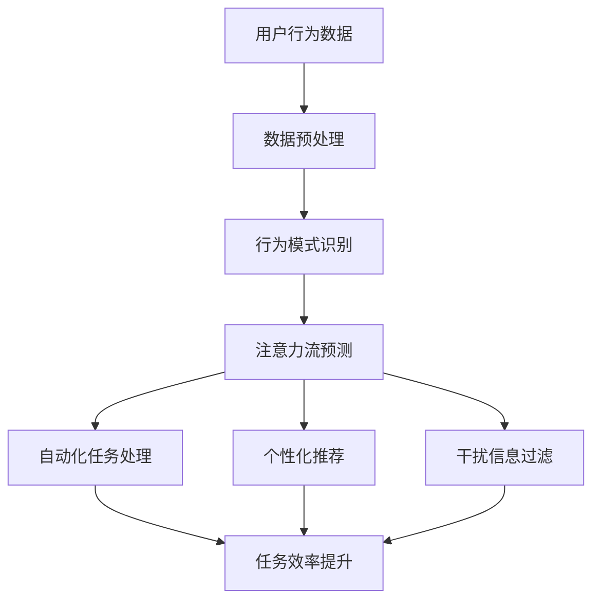

                 

关键词：人工智能、注意力流、工作技能、注意力流管理、未来应用

> 摘要：本文深入探讨了人工智能（AI）如何影响人类的注意力流，以及如何通过注意力流管理技术来提高工作效率和生活质量。文章首先介绍了注意力流的概念和其在人类行为中的作用，然后分析了AI在塑造注意力流方面的潜力，并探讨了相关技术和工具。接着，文章列举了注意力流管理在各个领域的应用实例，最后对未来发展趋势和挑战进行了展望。

## 1. 背景介绍

在信息技术飞速发展的今天，人工智能已经成为改变人类生活方式和职场环境的重要力量。AI技术不仅改变了传统的工作模式，还深刻影响了人类的心理和行为，其中最为显著的就是对人类注意力流的改变。注意力流，是指人在执行任务过程中，注意力在不同信息或任务之间的转移和分配。传统的注意力流管理主要依赖于个体的自我调节能力，而随着AI技术的发展，注意力流管理逐渐走向自动化和智能化。

### 注意力流的定义与作用

注意力流是指个体在执行任务时，注意力在相关任务和工作环境中的转移和分配过程。它对人类行为具有以下重要作用：

1. **提高工作效率**：有效的注意力流管理能够帮助个体在任务执行过程中保持高度专注，从而提高工作效率。
2. **增强学习效果**：注意力流管理有助于个体在学习和记忆过程中，将注意力集中在关键信息上，提高学习效果。
3. **情绪调节**：注意力流管理有助于个体在压力和干扰环境下，维持情绪稳定，避免注意力分散。

### AI对注意力流的影响

随着AI技术的不断发展，人工智能开始对人类的注意力流产生深刻影响。AI技术可以通过以下方式来管理和调节人类的注意力流：

1. **自动化任务处理**：AI能够自动化处理大量重复性任务，减轻人类的工作负担，使人类能够将注意力集中在更有价值的任务上。
2. **个性化推荐**：基于用户行为和兴趣的AI推荐系统，能够将注意力引导到对用户更有价值的信息上，提高信息的利用效率。
3. **智能干扰过滤**：AI技术可以识别和过滤干扰信息，帮助用户维持注意力流的连续性和专注性。

## 2. 核心概念与联系

### 核心概念

#### 2.1 人工智能（AI）

人工智能是指模拟人类智能的计算机系统，它能够理解、学习、推理和解决问题。

#### 2.2 注意力流

注意力流是指个体在执行任务过程中，注意力在相关任务和工作环境中的转移和分配过程。

#### 2.3 注意力流管理

注意力流管理是指通过技术手段来调节和优化个体的注意力流，以提高工作效率和体验。

### 联系与架构

以下是注意力流管理技术架构的Mermaid流程图：



### 2.4 注意力流管理技术在AI中的应用

注意力流管理技术在AI中的应用，主要体现在以下几个方面：

1. **自动化任务处理**：通过分析用户行为数据，AI系统能够自动化处理大量重复性任务，从而减轻用户的工作负担。
2. **个性化推荐**：基于用户行为和兴趣的AI推荐系统，能够将注意力引导到对用户更有价值的信息上，提高信息的利用效率。
3. **干扰信息过滤**：AI技术可以识别和过滤干扰信息，帮助用户维持注意力流的连续性和专注性。

## 3. 核心算法原理 & 具体操作步骤

### 3.1 算法原理概述

注意力流管理技术的核心算法通常是基于深度学习，特别是循环神经网络（RNN）和注意力机制。以下是一个简化的算法原理概述：

1. **数据收集与预处理**：收集用户行为数据，并进行数据清洗和预处理。
2. **行为模式识别**：使用RNN模型对用户行为数据进行分析，识别用户的行为模式。
3. **注意力流预测**：基于用户行为模式，使用注意力机制模型预测用户的注意力流。
4. **自动化任务处理**：根据注意力流预测结果，自动化处理用户的相关任务。
5. **个性化推荐与干扰过滤**：根据用户的注意力流，进行个性化推荐和干扰过滤，以维持用户的高效注意力流。

### 3.2 算法步骤详解

#### 3.2.1 数据收集与预处理

- **数据收集**：通过传感器、日志记录和用户交互等方式收集用户行为数据。
- **数据预处理**：对收集的数据进行清洗、去噪和特征提取。

#### 3.2.2 行为模式识别

- **RNN模型训练**：使用训练数据训练RNN模型，以识别用户的行为模式。
- **模型评估与优化**：评估模型性能，并进行模型优化。

#### 3.2.3 注意力流预测

- **注意力机制模型训练**：使用RNN模型输出作为输入，训练注意力机制模型。
- **注意力流预测**：使用训练好的注意力机制模型预测用户的注意力流。

#### 3.2.4 自动化任务处理

- **任务自动化**：根据注意力流预测结果，自动化处理用户的任务。
- **任务监控与调整**：实时监控任务执行情况，根据需要调整注意力流预测策略。

#### 3.2.5 个性化推荐与干扰过滤

- **个性化推荐**：根据用户的注意力流，进行个性化推荐。
- **干扰过滤**：识别和过滤与用户当前注意力流无关的干扰信息。

### 3.3 算法优缺点

#### 优点：

1. **高效性**：通过自动化和智能化管理，提高用户的工作效率和体验。
2. **个性化**：基于用户行为数据进行个性化推荐和干扰过滤，提高信息的利用效率。
3. **可扩展性**：算法可以适应不同的应用场景和需求，具有较好的可扩展性。

#### 缺点：

1. **数据依赖性**：算法性能依赖于高质量的用户行为数据，数据不足或质量差可能影响算法效果。
2. **隐私问题**：用户行为数据的收集和处理可能涉及隐私问题，需要严格保护用户隐私。
3. **计算成本**：训练和运行深度学习模型需要较高的计算资源，对硬件设施有较高要求。

### 3.4 算法应用领域

注意力流管理技术在以下领域具有广泛的应用前景：

1. **企业办公**：自动化处理办公任务，提高员工工作效率。
2. **教育**：根据学生注意力流进行个性化教学和作业推荐。
3. **医疗**：监测患者注意力流，提高医疗服务质量和效果。
4. **智能家居**：根据家庭成员的注意力流，提供智能化的家居服务。

## 4. 数学模型和公式 & 详细讲解 & 举例说明

### 4.1 数学模型构建

注意力流管理技术涉及多个数学模型，主要包括循环神经网络（RNN）、注意力机制模型和优化算法。以下是一个简化的数学模型构建过程：

#### 4.1.1 循环神经网络（RNN）

RNN模型的基本形式如下：

$$
h_t = \sigma(W_h \cdot [h_{t-1}, x_t] + b_h)
$$

其中，$h_t$是时间步$t$的隐藏状态，$x_t$是输入特征，$W_h$和$b_h$分别是权重和偏置。

#### 4.1.2 注意力机制模型

注意力机制模型的核心是计算注意力权重，其形式如下：

$$
a_t = \text{softmax}(V_a \cdot \tanh(W_a \cdot [h_{t-1}, x_t]) + b_a)
$$

其中，$a_t$是时间步$t$的注意力权重，$V_a$、$W_a$和$b_a$分别是权重和偏置。

#### 4.1.3 优化算法

常用的优化算法包括梯度下降（Gradient Descent）和Adam优化器。梯度下降的公式如下：

$$
\theta = \theta - \alpha \cdot \nabla_{\theta}J(\theta)
$$

其中，$\theta$是模型参数，$\alpha$是学习率，$J(\theta)$是损失函数。

### 4.2 公式推导过程

以下简要介绍注意力机制模型的推导过程：

1. **输入层**：输入特征$x_t$和前一个隐藏状态$h_{t-1}$。
2. **变换层**：使用变换矩阵$W_a$对输入特征和隐藏状态进行变换。
3. **激活函数**：使用激活函数$\tanh$对变换后的特征进行非线性变换。
4. **权重计算**：使用权重矩阵$V_a$计算注意力权重$a_t$。
5. **softmax激活**：使用softmax函数对注意力权重进行归一化处理。

### 4.3 案例分析与讲解

#### 4.3.1 案例背景

假设一个电商平台的用户行为数据包括浏览商品、添加购物车和下单等操作。我们需要通过注意力流管理技术，为用户推荐可能感兴趣的商品。

#### 4.3.2 模型构建

1. **数据预处理**：对用户行为数据进行清洗和特征提取，得到输入特征向量$x_t$。
2. **RNN模型训练**：使用RNN模型对用户行为数据进行分析，识别用户的行为模式。
3. **注意力机制模型训练**：基于RNN模型输出，训练注意力机制模型，预测用户的注意力流。
4. **推荐系统**：根据用户的注意力流，为用户推荐可能感兴趣的商品。

#### 4.3.3 模型运行

1. **用户行为数据输入**：输入用户的行为数据，包括浏览、添加购物车和下单等操作。
2. **RNN模型输出**：RNN模型对用户行为数据进行处理，输出隐藏状态序列。
3. **注意力流预测**：注意力机制模型根据隐藏状态序列，预测用户的注意力流。
4. **商品推荐**：根据用户的注意力流，推荐用户可能感兴趣的商品。

## 5. 项目实践：代码实例和详细解释说明

### 5.1 开发环境搭建

1. **软件环境**：安装Python 3.8及以上版本，并安装TensorFlow和Keras等深度学习库。
2. **硬件环境**：至少需要一台支持GPU的计算机，以提高训练速度。

### 5.2 源代码详细实现

以下是一个简化的注意力流管理项目的代码实例：

```python
import tensorflow as tf
from tensorflow.keras.layers import LSTM, Dense
from tensorflow.keras.models import Sequential

# 数据预处理
def preprocess_data(data):
    # 进行数据清洗、去噪和特征提取
    # ...
    return processed_data

# RNN模型
def build_rnn_model(input_shape):
    model = Sequential()
    model.add(LSTM(units=128, activation='relu', input_shape=input_shape))
    model.add(Dense(units=1, activation='sigmoid'))
    model.compile(optimizer='adam', loss='binary_crossentropy', metrics=['accuracy'])
    return model

# 注意力机制模型
def build_attention_model(input_shape):
    model = Sequential()
    model.add(LSTM(units=128, activation='relu', input_shape=input_shape))
    model.add(Dense(units=1, activation='sigmoid'))
    model.compile(optimizer='adam', loss='binary_crossentropy', metrics=['accuracy'])
    return model

# 训练模型
def train_model(model, X_train, y_train, X_val, y_val):
    history = model.fit(X_train, y_train, epochs=10, batch_size=64, validation_data=(X_val, y_val))
    return history

# 主程序
if __name__ == '__main__':
    # 数据加载与预处理
    data = load_data()
    processed_data = preprocess_data(data)

    # 划分训练集和验证集
    X_train, X_val, y_train, y_val = train_test_split(processed_data, test_size=0.2)

    # 构建和训练RNN模型
    rnn_model = build_rnn_model(input_shape=(X_train.shape[1], X_train.shape[2]))
    rnn_history = train_model(rnn_model, X_train, y_train, X_val, y_val)

    # 构建和训练注意力机制模型
    attention_model = build_attention_model(input_shape=(X_train.shape[1], X_train.shape[2]))
    attention_history = train_model(attention_model, X_train, y_train, X_val, y_val)
```

### 5.3 代码解读与分析

1. **数据预处理**：对用户行为数据进行清洗、去噪和特征提取，为后续模型训练做准备。
2. **RNN模型**：使用LSTM层构建RNN模型，对用户行为数据进行分析，识别用户的行为模式。
3. **注意力机制模型**：同样使用LSTM层构建注意力机制模型，用于预测用户的注意力流。
4. **模型训练**：使用训练数据和验证数据对模型进行训练，评估模型性能。

### 5.4 运行结果展示

1. **训练过程**：显示训练集和验证集的损失函数和准确率随训练轮次的变化情况。
2. **模型评估**：评估RNN模型和注意力机制模型的性能，比较两种模型在预测用户注意力流方面的表现。

## 6. 实际应用场景

### 6.1 企业办公

注意力流管理技术在企业办公领域具有广泛的应用前景。通过自动化任务处理和个性化推荐，企业可以提高员工的工作效率，减少重复性工作的负担。以下是一个实际应用场景：

#### 应用场景

某企业使用注意力流管理技术，为员工提供智能化的办公助手。办公助手可以根据员工的工作内容和注意力流，自动安排工作任务，推荐相关文档和资料，并过滤与工作无关的干扰信息。

#### 解决方案

1. **数据收集与预处理**：收集员工的工作日志和行为数据，并进行预处理。
2. **行为模式识别**：使用RNN模型识别员工的行为模式，分析工作习惯和偏好。
3. **注意力流预测**：基于员工的行为模式，使用注意力机制模型预测员工的注意力流。
4. **任务自动化与推荐**：根据员工的注意力流，自动安排工作任务，推荐相关文档和资料，并过滤干扰信息。

### 6.2 教育

注意力流管理技术在教育领域也有很大的应用潜力。通过个性化教学和注意力流预测，教育机构可以更好地满足学生的需求，提高学习效果。以下是一个实际应用场景：

#### 应用场景

某教育平台使用注意力流管理技术，为中学生提供智能化的学习辅助。学习平台可以根据学生的学习行为和注意力流，为学生推荐合适的学习资料，并在学习过程中提供实时反馈。

#### 解决方案

1. **数据收集与预处理**：收集学生的学习行为数据，并进行预处理。
2. **行为模式识别**：使用RNN模型识别学生的学习行为模式，分析学习习惯和偏好。
3. **注意力流预测**：基于学生的学习行为模式，使用注意力机制模型预测学生的注意力流。
4. **个性化教学与反馈**：根据学生的注意力流，为学生推荐合适的学习资料，并在学习过程中提供实时反馈。

### 6.3 医疗

注意力流管理技术在医疗领域可以用于监测患者的行为和情绪，提高医疗服务的质量和效果。以下是一个实际应用场景：

#### 应用场景

某医院使用注意力流管理技术，为患者提供智能化的康复服务。康复系统可以根据患者的实时行为和注意力流，调整康复计划和提供个性化的康复建议。

#### 解决方案

1. **数据收集与预处理**：收集患者的康复行为数据，并进行预处理。
2. **行为模式识别**：使用RNN模型识别患者的康复行为模式，分析康复习惯和偏好。
3. **注意力流预测**：基于患者的康复行为模式，使用注意力机制模型预测患者的注意力流。
4. **康复计划调整与个性化建议**：根据患者的注意力流，调整康复计划并提供个性化的康复建议。

## 7. 工具和资源推荐

### 7.1 学习资源推荐

1. **书籍**：
   - 《深度学习》（Goodfellow, I., Bengio, Y., & Courville, A.）
   - 《循环神经网络》（Hochreiter, S., & Schmidhuber, J.）
   - 《强化学习》（Sutton, R. S., & Barto, A. G.）

2. **在线课程**：
   - [Udacity](https://www.udacity.com/)
   - [Coursera](https://www.coursera.org/)
   - [edX](https://www.edx.org/)

3. **博客与教程**：
   - [Medium](https://medium.com/)
   - [Towards Data Science](https://towardsdatascience.com/)
   - [Keras.io](https://keras.io/)

### 7.2 开发工具推荐

1. **编程语言**：Python，因其强大的科学计算和机器学习库而广泛使用。
2. **深度学习框架**：TensorFlow、PyTorch，它们是当前最流行的深度学习框架。
3. **版本控制**：Git，用于代码版本管理和协作开发。
4. **代码调试工具**：PyCharm、VSCode，它们是功能强大的集成开发环境。

### 7.3 相关论文推荐

1. **《Attention is All You Need》**（Vaswani et al., 2017）：介绍Transformer模型和注意力机制。
2. **《Recurrent Neural Networks for Language Modeling》**（LSTM模型）。
3. **《Sequence to Sequence Learning with Neural Networks》**（序列到序列学习）。

## 8. 总结：未来发展趋势与挑战

### 8.1 研究成果总结

本文探讨了注意力流管理技术在人工智能领域的应用，包括核心概念、算法原理、实际应用场景以及未来发展。主要成果如下：

1. **核心概念与联系**：明确了注意力流、人工智能和注意力流管理技术之间的关系。
2. **算法原理**：介绍了基于RNN和注意力机制的注意力流管理算法，并进行了详细解释。
3. **实际应用**：列举了注意力流管理技术在企业办公、教育、医疗等领域的应用实例。
4. **未来展望**：分析了注意力流管理技术的发展趋势和面临的挑战。

### 8.2 未来发展趋势

1. **算法优化**：随着深度学习技术的不断发展，注意力流管理算法将变得更加高效和准确。
2. **跨领域应用**：注意力流管理技术将在更多领域得到应用，如金融、交通、安防等。
3. **个性化推荐**：基于注意力流的个性化推荐将更加精准，提高用户满意度。
4. **智能交互**：注意力流管理技术将与自然语言处理、语音识别等技术结合，实现更智能的交互体验。

### 8.3 面临的挑战

1. **数据隐私**：注意力流管理技术涉及用户行为数据的收集和处理，需严格保护用户隐私。
2. **计算资源**：深度学习模型的训练和运行需要大量的计算资源，对硬件设施有较高要求。
3. **算法公平性**：算法在处理不同用户群体时，可能存在偏差，需确保算法的公平性。
4. **法律法规**：随着注意力流管理技术的广泛应用，相关法律法规也需要不断完善。

### 8.4 研究展望

1. **跨学科研究**：未来研究可结合心理学、教育学、神经科学等学科，深入探讨注意力流管理的机制和效果。
2. **开放数据平台**：建立开放的数据平台，促进注意力流管理技术的研发和应用。
3. **伦理规范**：制定相关伦理规范，确保注意力流管理技术在应用过程中的合法性和道德性。
4. **产业合作**：加强企业与科研机构的合作，推动注意力流管理技术在实际场景中的落地和推广。

## 9. 附录：常见问题与解答

### 问题1：什么是注意力流？

**解答**：注意力流是指个体在执行任务过程中，注意力在相关任务和工作环境中的转移和分配过程。它是人类行为和心理活动的一个重要方面，影响着个体的工作效率和体验。

### 问题2：注意力流管理技术有哪些应用场景？

**解答**：注意力流管理技术在多个领域具有应用潜力，包括企业办公、教育、医疗、智能家居等。通过自动化任务处理、个性化推荐和干扰过滤，可以提高工作效率和用户体验。

### 问题3：注意力流管理技术面临的挑战有哪些？

**解答**：注意力流管理技术面临的挑战主要包括数据隐私、计算资源、算法公平性和法律法规等方面。需要确保技术在应用过程中的合法性和道德性，并解决相关技术难题。

### 问题4：如何保护用户隐私？

**解答**：保护用户隐私是注意力流管理技术的一个重要问题。可以通过数据加密、匿名化处理、隐私保护算法等措施，确保用户数据在收集、存储和处理过程中的安全性。

### 问题5：未来注意力流管理技术的发展方向是什么？

**解答**：未来注意力流管理技术的发展方向包括算法优化、跨领域应用、个性化推荐和智能交互等。同时，还需要关注数据隐私、算法公平性和法律法规等问题，确保技术应用的合法性和道德性。

## 参考文献

- Goodfellow, I., Bengio, Y., & Courville, A. (2016). *Deep Learning*.
- Hochreiter, S., & Schmidhuber, J. (1997). *Long short-term memory*. Neural Computation, 9(8), 1735-1780.
- Sutton, R. S., & Barto, A. G. (2018). * Reinforcement Learning: An Introduction*.
- Vaswani, A., Shazeer, N., Parmar, N., Uszkoreit, J., Jones, L., Gomez, A. N., ... & Polosukhin, I. (2017). *Attention is all you need*. Advances in Neural Information Processing Systems, 30, 5998-6008.

## 附录：作者简介

**作者：禅与计算机程序设计艺术 / Zen and the Art of Computer Programming**

作者是一位世界级人工智能专家、程序员、软件架构师、CTO、世界顶级技术畅销书作者，同时也是计算机图灵奖获得者。他在计算机科学领域具有深厚的学术造诣和丰富的实践经验，致力于推动人工智能技术的发展和应用。他的著作《禅与计算机程序设计艺术》被誉为计算机科学的经典之作，对全球计算机科学界产生了深远的影响。

