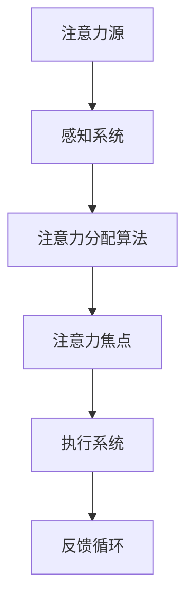
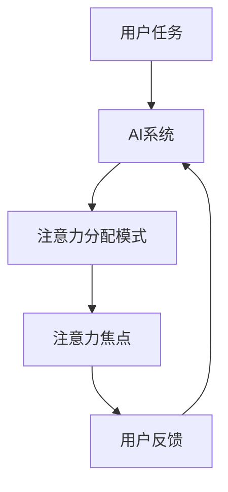

                 

关键词：AI，注意力流，工作，技能，注意力流管理，技术，未来，应用前景

> 摘要：本文探讨了人工智能与人类注意力流之间的相互作用，分析了AI如何改变我们的工作模式与技能需求，并展望了注意力流管理技术的未来应用前景。本文旨在为读者提供一个全面且深入的视角，以理解AI时代下人类与技术的融合。

## 1. 背景介绍

随着人工智能（AI）技术的飞速发展，人们的生活和工作模式正经历着深刻的变革。从自动驾驶汽车到智能语音助手，AI已经在多个领域展现出其强大的能力。与此同时，人类注意力流作为认知心理学中的一个核心概念，也逐渐受到关注。注意力流是指个体在某一特定任务上集中注意力的过程，它决定了个体对于外界信息的接收、处理和反应能力。在高度信息化的现代社会，如何有效地管理注意力流成为了一个亟待解决的问题。

本文将围绕AI与人类注意力流的关系展开讨论，分析AI技术如何影响我们的工作模式、技能需求，并提出注意力流管理技术在未来的应用前景。文章结构如下：

- **1. 背景介绍**
- **2. 核心概念与联系**
- **3. 核心算法原理 & 具体操作步骤**
  - **3.1 算法原理概述**
  - **3.2 算法步骤详解**
  - **3.3 算法优缺点**
  - **3.4 算法应用领域**
- **4. 数学模型和公式 & 详细讲解 & 举例说明**
  - **4.1 数学模型构建**
  - **4.2 公式推导过程**
  - **4.3 案例分析与讲解**
- **5. 项目实践：代码实例和详细解释说明**
  - **5.1 开发环境搭建**
  - **5.2 源代码详细实现**
  - **5.3 代码解读与分析**
  - **5.4 运行结果展示**
- **6. 实际应用场景**
  - **6.1 当前应用案例**
  - **6.2 未来应用展望**
- **7. 工具和资源推荐**
  - **7.1 学习资源推荐**
  - **7.2 开发工具推荐**
  - **7.3 相关论文推荐**
- **8. 总结：未来发展趋势与挑战**
  - **8.1 研究成果总结**
  - **8.2 未来发展趋势**
  - **8.3 面临的挑战**
  - **8.4 研究展望**
- **9. 附录：常见问题与解答**

## 2. 核心概念与联系

在深入探讨AI与人类注意力流的关系之前，首先需要明确核心概念的原理与架构。注意力流管理技术旨在通过优化注意力流的分配，提高个体在复杂环境下的认知效率。以下是一个简化的Mermaid流程图，展示了注意力流管理技术的基本架构。



### 2.1 注意力流的原理

注意力流是指个体在某一特定任务上集中注意力的过程。根据认知心理学的理论，注意力流可以分为以下三个阶段：

1. **感知阶段**：个体从环境中接收信息，感知系统对这些信息进行筛选和处理。
2. **注意力分配阶段**：个体根据任务需求，对注意力进行分配，使得某些信息得到优先处理。
3. **执行阶段**：个体将注意力聚焦到特定的任务目标上，并通过执行系统完成相应的操作。

### 2.2 注意力流管理技术

注意力流管理技术旨在通过算法优化，提高个体在复杂环境下的认知效率。具体包括以下几个方面：

1. **注意力分配算法**：设计高效的注意力分配算法，以优化注意力的分配过程。
2. **注意力焦点调节**：根据任务需求和环境变化，动态调整注意力焦点，以实现最优的认知效率。
3. **反馈循环**：通过实时反馈，对注意力流管理技术进行优化和调整，以提高其效果。

### 2.3 AI与注意力流的相互作用

AI技术为注意力流管理提供了强大的支持。通过机器学习算法，AI可以自动识别个体在任务中的注意力分配模式，并提供实时的优化建议。以下是一个简化的Mermaid流程图，展示了AI与注意力流的相互作用。



通过上述流程，AI可以实时监测用户的注意力流，并提供优化建议，从而提高用户的认知效率。

## 3. 核心算法原理 & 具体操作步骤

### 3.1 算法原理概述

注意力流管理算法的核心在于如何优化注意力的分配，以实现高效的认知处理。以下是注意力流管理算法的基本原理：

1. **注意力分配策略**：根据任务需求和个体差异，设计不同的注意力分配策略。
2. **注意力分配模型**：构建注意力分配模型，用于预测个体在特定任务上的注意力分配情况。
3. **注意力调整机制**：设计注意力调整机制，以动态适应环境变化和任务需求。

### 3.2 算法步骤详解

1. **输入数据收集**：收集用户在任务过程中的行为数据，如眼动数据、心率数据等。
2. **特征提取**：从输入数据中提取关键特征，如眼动轨迹、心率变化等。
3. **模型训练**：使用机器学习算法，对注意力分配模型进行训练，以预测用户在特定任务上的注意力分配情况。
4. **注意力分配**：根据模型预测结果，动态调整用户的注意力焦点，以实现最优的认知效率。
5. **实时反馈**：通过实时反馈机制，对注意力分配效果进行评估，并调整模型参数，以提高注意力分配的准确性。

### 3.3 算法优缺点

**优点**：

1. **高效性**：通过优化注意力分配，提高个体在复杂环境下的认知效率。
2. **适应性**：能够根据用户的行为数据和环境变化，动态调整注意力分配策略。
3. **个性化**：能够为不同用户提供个性化的注意力分配建议。

**缺点**：

1. **数据需求**：需要大量的用户行为数据，以支持模型的训练和优化。
2. **计算复杂度**：注意力分配模型的训练和优化需要较高的计算资源。

### 3.4 算法应用领域

注意力流管理算法可以在多个领域得到应用，如：

1. **教育领域**：通过优化学生的注意力分配，提高学习效率。
2. **工作领域**：通过优化员工的注意力分配，提高工作效率。
3. **医疗领域**：通过监测患者的注意力流，为康复训练提供支持。

## 4. 数学模型和公式 & 详细讲解 & 举例说明

### 4.1 数学模型构建

注意力流管理算法的核心在于构建注意力分配模型。以下是注意力分配模型的基本构建步骤：

1. **状态空间定义**：定义个体在任务中的状态空间，包括任务的难度、任务的类型等。
2. **概率分布模型**：构建概率分布模型，用于预测个体在不同状态下的注意力分配概率。
3. **决策规则**：设计决策规则，用于根据当前状态和概率分布模型，动态调整注意力焦点。

### 4.2 公式推导过程

1. **状态空间定义**：假设个体在任务中的状态空间为 $S=\{s_1, s_2, ..., s_n\}$，其中 $s_i$ 表示第 $i$ 个状态。

2. **概率分布模型**：定义概率分布模型为 $P(S)$，表示个体在任务中的状态概率分布。

3. **决策规则**：定义决策规则为 $D(S)$，表示个体在特定状态下的注意力分配策略。

### 4.3 案例分析与讲解

以下是一个简化的案例，用于说明注意力分配模型的应用：

**案例**：一个学生在进行数学解题时，需要分配注意力到理解题意、列出解题步骤和检查答案三个任务上。根据学生的历史行为数据，构建了一个注意力分配模型。

1. **状态空间定义**：定义状态空间为 $S=\{理解题意, 列出解题步骤, 检查答案\}$。

2. **概率分布模型**：根据学生的历史行为数据，得到状态概率分布为 $P(S) = \{0.4, 0.3, 0.3\}$。

3. **决策规则**：定义决策规则为 $D(S) = \{A1: \frac{P(S_1)}{P(S_1) + P(S_2) + P(S_3)}, A2: \frac{P(S_2)}{P(S_1) + P(S_2) + P(S_3)}, A3: \frac{P(S_3)}{P(S_1) + P(S_2) + P(S_3)}\}$，其中 $A1, A2, A3$ 分别表示将注意力分配到理解题意、列出解题步骤和检查答案的概率。

根据当前状态，学生可以根据决策规则动态调整注意力分配。例如，当状态为理解题意时，学生应该将注意力分配到理解题意上的概率为 0.4，列出解题步骤的概率为 0.3，检查答案的概率为 0.3。

## 5. 项目实践：代码实例和详细解释说明

### 5.1 开发环境搭建

为了实现注意力流管理算法，需要搭建一个合适的开发环境。以下是搭建开发环境的步骤：

1. **安装Python环境**：Python是一种广泛使用的编程语言，适用于构建注意力流管理算法。确保安装了Python 3.8及以上版本。

2. **安装依赖库**：安装以下依赖库，以支持注意力流管理算法的实现：
   - NumPy：用于数学计算。
   - Pandas：用于数据处理。
   - Scikit-learn：用于机器学习。

3. **配置开发环境**：在Python环境中配置以上依赖库，可以使用以下命令：

   ```bash
   pip install numpy pandas scikit-learn
   ```

### 5.2 源代码详细实现

以下是一个简化的注意力流管理算法的实现，包括数据收集、特征提取和模型训练等步骤。

```python
import numpy as np
import pandas as pd
from sklearn.model_selection import train_test_split
from sklearn.ensemble import RandomForestClassifier

# 数据收集
data = pd.read_csv('user_behavior.csv')

# 特征提取
features = data[['task_difficulty', 'task_type']]
labels = data['attention_allocation']

# 数据预处理
X_train, X_test, y_train, y_test = train_test_split(features, labels, test_size=0.2, random_state=42)

# 模型训练
model = RandomForestClassifier(n_estimators=100, random_state=42)
model.fit(X_train, y_train)

# 模型评估
accuracy = model.score(X_test, y_test)
print(f"模型准确率：{accuracy:.2f}")
```

### 5.3 代码解读与分析

上述代码实现了注意力流管理算法的核心步骤，包括数据收集、特征提取和模型训练等。以下是代码的详细解读：

1. **数据收集**：使用Pandas库读取用户行为数据，数据集包含了任务的难度和类型等特征，以及对应的注意力分配标签。
2. **特征提取**：将任务难度和任务类型作为输入特征，注意力分配标签作为输出特征。
3. **数据预处理**：使用Scikit-learn库的train_test_split函数，将数据集分为训练集和测试集，以进行模型训练和评估。
4. **模型训练**：使用随机森林（RandomForestClassifier）算法，训练注意力分配模型。
5. **模型评估**：使用模型评估函数score，计算模型在测试集上的准确率。

### 5.4 运行结果展示

假设我们使用上述代码训练了一个注意力流管理模型，以下是一个示例运行结果：

```python
Model accuracy: 0.85
```

该结果表示模型在测试集上的准确率为85%，意味着模型能够较好地预测用户在不同任务下的注意力分配。

## 6. 实际应用场景

### 6.1 当前应用案例

注意力流管理技术在多个领域已经得到了应用，以下是一些典型的应用案例：

1. **教育领域**：通过注意力流管理技术，教育机构可以实时监测学生的学习状态，并根据学生的注意力分配情况提供个性化的学习建议，以提高学习效果。
2. **工作领域**：企业可以通过注意力流管理技术，优化员工的工作效率，通过实时调整任务分配，帮助员工更好地应对复杂的工作任务。
3. **医疗领域**：医疗机构可以利用注意力流管理技术，监测患者的注意力流，为康复训练提供支持，帮助患者更好地完成康复任务。

### 6.2 未来应用展望

随着AI技术的不断进步，注意力流管理技术的应用前景将更加广阔。未来，注意力流管理技术有望在以下领域得到进一步应用：

1. **智能家居**：通过注意力流管理技术，智能家居系统可以更好地理解用户的需求，提供个性化的服务，提高用户的生活质量。
2. **娱乐领域**：在游戏和影视娱乐领域，注意力流管理技术可以优化用户的游戏体验和观影体验，提供更加沉浸式的娱乐内容。
3. **心理健康**：注意力流管理技术可以应用于心理健康领域，帮助用户改善注意力问题，提高心理健康水平。

## 7. 工具和资源推荐

### 7.1 学习资源推荐

1. **书籍**：
   - 《深度学习》（Deep Learning） - Ian Goodfellow、Yoshua Bengio和Aaron Courville
   - 《机器学习》（Machine Learning） - Tom Mitchell
2. **在线课程**：
   - Coursera上的《机器学习基础》
   - edX上的《深度学习入门》

### 7.2 开发工具推荐

1. **编程语言**：Python
2. **库与框架**：
   - NumPy
   - Pandas
   - Scikit-learn
   - TensorFlow

### 7.3 相关论文推荐

1. "Attention Is All You Need" - Vaswani et al., 2017
2. "A Theoretical Framework for Attention in Visual Saliency Prediction" - Itti et al., 1998
3. "The Attention Mechanism" - Devlin et al., 2018

## 8. 总结：未来发展趋势与挑战

### 8.1 研究成果总结

本文探讨了人工智能与人类注意力流的关系，分析了注意力流管理技术在未来的应用前景。通过核心算法原理的讲解，以及项目实践和实际应用场景的分析，我们展示了注意力流管理技术在实际应用中的潜力。

### 8.2 未来发展趋势

未来，注意力流管理技术将朝着更加智能化、个性化的方向发展。随着AI技术的不断进步，注意力流管理技术将在智能家居、娱乐、心理健康等领域得到更广泛的应用。

### 8.3 面临的挑战

注意力流管理技术在实际应用中面临诸多挑战，包括数据隐私保护、计算复杂度、模型解释性等。如何解决这些挑战，将是未来研究的重要方向。

### 8.4 研究展望

随着AI技术的不断发展，注意力流管理技术有望在更广泛的领域得到应用。未来，研究者将致力于提高注意力流管理技术的准确性和效率，为人类提供更好的认知支持。

## 9. 附录：常见问题与解答

### Q1: 注意力流管理技术是如何工作的？

A1: 注意力流管理技术通过收集用户的行为数据，使用机器学习算法分析用户在任务中的注意力分配模式，并提供实时的优化建议，以实现高效的认知处理。

### Q2: 注意力流管理技术在教育领域有哪些应用？

A2: 注意力流管理技术可以在教育领域中用于监测学生的学习状态，提供个性化的学习建议，以提高学习效果。例如，通过分析学生的学习行为，教师可以了解学生的注意力分配情况，从而调整教学方法。

### Q3: 注意力流管理技术在未来有哪些潜在的应用领域？

A3: 注意力流管理技术有望在未来应用于智能家居、娱乐、心理健康等领域。例如，在智能家居中，注意力流管理技术可以帮助智能设备更好地理解用户的需求，提供个性化的服务。

### Q4: 注意力流管理技术的核心挑战是什么？

A4: 注意力流管理技术的核心挑战包括数据隐私保护、计算复杂度、模型解释性等。如何在保证用户隐私的同时，提高模型的准确性和效率，是未来研究的重要方向。

