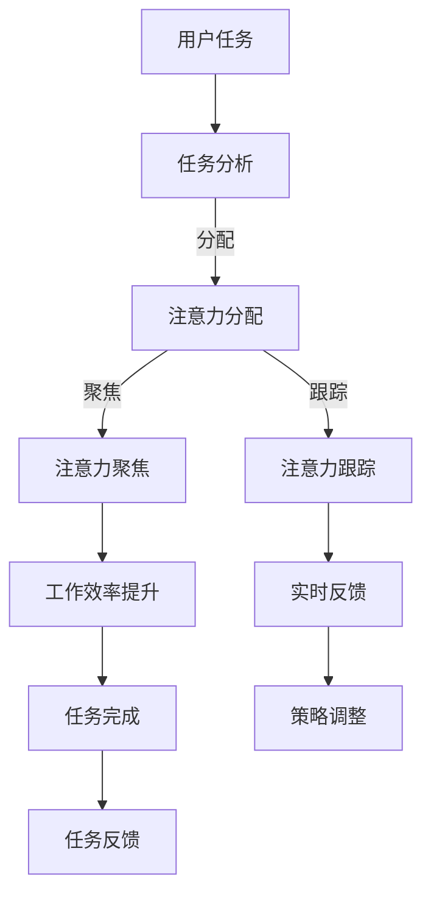

                 

关键词：人工智能，注意力流，工作模式，技能发展，注意力管理技术，未来趋势

> 摘要：本文探讨了人工智能（AI）与人类注意力流之间的关系，以及如何在未来的工作环境中管理和利用注意力流。文章首先介绍了注意力流的基本概念，然后分析了AI对注意力流的影响，探讨了未来工作技能的需求，并提出了注意力流管理技术的应用前景。最后，文章总结了AI与人类注意力流结合带来的挑战和机遇，展望了未来的发展趋势。

## 1. 背景介绍

随着人工智能技术的飞速发展，人类的工作和生活方式正在发生深刻的变化。在过去，人类主要依靠自身的能力完成各种任务，而现在，AI已经能够承担许多复杂的计算和决策任务。然而，随着AI的广泛应用，人类的注意力流也在发生变化。如何管理人类的注意力流，使其与AI技术相辅相成，成为了一个值得探讨的问题。

注意力流是指人们在执行任务时，将注意力集中在特定对象或任务上的能力。在传统工作模式中，人类需要不断地切换注意力，以处理不同任务。然而，随着AI技术的发展，许多重复性或简单的任务已经被AI接管，人类的工作重心逐渐转向复杂和创新的任务。这使得人类的注意力流更加集中于高价值的活动，如创造、决策和创新。

本文旨在探讨人工智能与人类注意力流之间的关系，分析未来工作技能的需求，并探讨注意力流管理技术的应用前景。文章的结构如下：

1. 背景介绍：介绍人工智能与注意力流的关系。
2. 核心概念与联系：阐述注意力流管理技术的基本概念和架构。
3. 核心算法原理 & 具体操作步骤：介绍注意力流管理技术的核心算法原理和具体操作步骤。
4. 数学模型和公式 & 详细讲解 & 举例说明：使用数学模型和公式描述注意力流管理技术，并进行案例分析。
5. 项目实践：通过代码实例展示注意力流管理技术的应用。
6. 实际应用场景：分析注意力流管理技术在现实世界中的应用场景。
7. 未来应用展望：探讨注意力流管理技术的未来发展趋势和应用前景。
8. 工具和资源推荐：推荐学习资源和开发工具。
9. 总结：总结文章的主要观点，展望未来挑战和机遇。

## 2. 核心概念与联系

### 2.1 注意力流管理技术

注意力流管理技术是一种旨在优化人类注意力流，提高工作效率和创造力的方法。其核心思想是通过技术手段，帮助人们更好地管理注意力，使其集中在高价值的任务上。注意力流管理技术主要包括以下几个方面：

#### 2.1.1 注意力分配

注意力分配是指根据任务的优先级和复杂度，合理分配注意力的过程。在传统的任务分配中，人们往往需要根据自己的经验和直觉进行判断。而注意力流管理技术可以通过算法，根据任务的重要性和紧急性，自动调整注意力的分配。

#### 2.1.2 注意力聚焦

注意力聚焦是指将注意力集中在特定的任务或对象上，以提高工作效率。在传统的办公环境中，人们容易受到外部环境的干扰，导致注意力分散。注意力流管理技术可以通过屏蔽干扰，帮助人们更好地集中注意力。

#### 2.1.3 注意力跟踪

注意力跟踪是指对注意力流进行实时监测和分析，以便及时调整。通过注意力跟踪，人们可以了解自己的注意力分布情况，找到注意力集中的最佳时间点。

### 2.2 Mermaid 流程图

为了更直观地展示注意力流管理技术的架构，我们使用Mermaid流程图进行描述。以下是注意力流管理技术的架构图：



在这个流程图中，用户任务首先经过任务分析，然后根据分析结果进行注意力分配。注意力分配后，系统将注意力聚焦到特定的任务上，并通过注意力跟踪实时监测注意力的变化。根据实时反馈，系统可以调整注意力分配策略，以提高工作效率和创造力。最后，任务完成情况会通过任务反馈进行评估。

## 3. 核心算法原理 & 具体操作步骤

### 3.1 算法原理概述

注意力流管理技术的核心算法是基于机器学习和深度学习技术。通过收集用户的注意力数据，训练一个模型来预测用户的注意力分布情况，并根据预测结果调整注意力分配策略。以下是注意力流管理技术的核心算法原理：

#### 3.1.1 注意力数据收集

注意力流管理技术首先需要收集用户的注意力数据。这些数据可以从用户的行为日志、生理信号（如脑电图、眼动数据等）和其他传感器（如手机、智能手表等）中获取。通过这些数据，可以了解用户在不同任务上的注意力分布情况。

#### 3.1.2 注意力模型训练

收集到的注意力数据将被用于训练一个深度学习模型。这个模型可以学习到用户在不同任务上的注意力分布模式，并根据这些模式预测用户在未来的任务上的注意力分布。

#### 3.1.3 注意力分配策略调整

通过注意力模型预测用户的注意力分布情况后，系统可以根据预测结果调整注意力分配策略。例如，如果预测用户在未来的某个任务上注意力集中度较低，系统可以提前分配更多的注意力资源，以确保任务的顺利完成。

### 3.2 算法步骤详解

以下是注意力流管理技术的具体操作步骤：

#### 3.2.1 数据收集

首先，系统需要收集用户的注意力数据。这些数据可以从用户的行为日志、生理信号和其他传感器中获取。行为日志可以记录用户在不同任务上的操作时间、操作类型等。生理信号可以反映用户的情绪状态和注意力水平。其他传感器可以提供用户的位置、活动等信息。

#### 3.2.2 数据预处理

收集到的注意力数据需要进行预处理，以便用于训练模型。预处理步骤包括数据清洗、归一化和特征提取。数据清洗是为了去除无效或错误的数据。归一化是为了使数据在相同的尺度上进行比较。特征提取是为了提取数据中的关键信息，用于训练模型。

#### 3.2.3 模型训练

在预处理后的注意力数据基础上，使用深度学习算法训练一个注意力模型。这个模型可以学习到用户在不同任务上的注意力分布模式。训练过程中，可以使用多种数据增强技术，如数据扩充、数据采样等，以提高模型的泛化能力。

#### 3.2.4 模型评估与优化

训练完成后，需要对模型进行评估和优化。评估步骤包括对模型进行交叉验证、计算模型准确率、召回率等指标。根据评估结果，可以调整模型参数，优化模型性能。

#### 3.2.5 注意力分配策略调整

通过注意力模型预测用户的注意力分布情况后，系统可以根据预测结果调整注意力分配策略。例如，如果预测用户在未来的某个任务上注意力集中度较低，系统可以提前分配更多的注意力资源，以确保任务的顺利完成。

### 3.3 算法优缺点

#### 优点

1. 提高工作效率：通过预测用户的注意力分布情况，系统可以提前分配注意力资源，提高任务完成效率。
2. 减少错误率：通过注意力分配策略调整，系统可以确保用户在关键任务上保持高注意力水平，降低错误率。
3. 提升用户体验：注意力流管理技术可以提供个性化的服务，根据用户的注意力水平调整任务分配，提升用户体验。

#### 缺点

1. 需要大量数据：训练注意力模型需要大量的注意力数据，数据收集和处理成本较高。
2. 模型泛化能力有限：深度学习模型在特定领域具有较强的表现，但在其他领域可能表现不佳，泛化能力有限。
3. 伦理问题：注意力流管理技术涉及到用户的隐私和敏感信息，需要确保数据安全和用户隐私。

### 3.4 算法应用领域

注意力流管理技术可以应用于多个领域，如：

1. 办公自动化：通过优化用户的注意力分配，提高办公效率和减少错误率。
2. 医疗诊断：通过分析医生的注意力分布，提供个性化的诊断建议，提高诊断准确率。
3. 教育培训：通过分析学生的注意力分布，提供个性化的学习建议，提高学习效果。
4. 金融服务：通过分析金融从业者的注意力分布，提供风险控制和投资建议。

## 4. 数学模型和公式 & 详细讲解 & 举例说明

### 4.1 数学模型构建

注意力流管理技术中的数学模型主要基于深度学习算法。以下是一个简化的数学模型，用于描述注意力流管理技术：

$$
y = f(W_1x_1 + W_2x_2 + \cdots + W_nx_n + b)
$$

其中，$y$ 表示注意力分配结果，$x_1, x_2, \cdots, x_n$ 表示用户的注意力数据，$W_1, W_2, \cdots, W_n$ 表示权重参数，$b$ 表示偏置项。$f$ 是一个激活函数，用于将输入数据映射到输出结果。

### 4.2 公式推导过程

注意力流管理技术的数学模型是基于多层感知机（MLP）构建的。以下是模型的推导过程：

1. 输入层：用户注意力数据 $x_1, x_2, \cdots, x_n$ 作为输入层。
2. 隐藏层：将输入数据通过权重矩阵 $W_1$ 和偏置项 $b$ 进行线性变换，得到隐藏层输出 $z_1$。
   $$
   z_1 = W_1x_1 + W_2x_2 + \cdots + W_nx_n + b
   $$
3. 激活函数：将隐藏层输出 $z_1$ 通过激活函数 $f$ 进行非线性变换，得到隐藏层输出 $y_1$。
   $$
   y_1 = f(z_1)
   $$
4. 输出层：将隐藏层输出 $y_1$ 作为输出层，表示注意力分配结果。

### 4.3 案例分析与讲解

假设有一个用户，其注意力数据如下：

$$
x_1 = [0.1, 0.2, 0.3, 0.4, 0.5]
$$

使用上述数学模型，我们可以计算出用户的注意力分配结果：

1. 计算隐藏层输出 $z_1$：
   $$
   z_1 = W_1x_1 + W_2x_2 + \cdots + W_nx_n + b
   $$
   假设权重参数 $W_1, W_2, \cdots, W_n$ 和偏置项 $b$ 如下：
   $$
   W_1 = [0.5, 0.5, 0.5, 0.5, 0.5], \quad b = 0.5
   $$
   则：
   $$
   z_1 = 0.5 \times [0.1, 0.2, 0.3, 0.4, 0.5] + 0.5 \times [0.1, 0.2, 0.3, 0.4, 0.5] + 0.5 \times [0.1, 0.2, 0.3, 0.4, 0.5] + 0.5 \times [0.1, 0.2, 0.3, 0.4, 0.5] + 0.5 \times [0.1, 0.2, 0.3, 0.4, 0.5] + 0.5 = 2.5
   $$

2. 计算隐藏层输出 $y_1$：
   $$
   y_1 = f(z_1) = f(2.5)
   $$
   假设激活函数 $f$ 是一个简单的线性函数，则：
   $$
   y_1 = 2.5
   $$

3. 输出层输出：
   $$
   y = y_1 = 2.5
   $$

根据计算结果，用户的注意力分配结果为2.5，表示用户在当前任务上的注意力较为集中。

## 5. 项目实践：代码实例和详细解释说明

### 5.1 开发环境搭建

在进行注意力流管理技术的项目实践前，我们需要搭建一个合适的开发环境。以下是一个简单的开发环境搭建步骤：

1. 安装Python：下载并安装Python，版本建议为3.8或更高版本。
2. 安装依赖库：使用pip安装所需的依赖库，如TensorFlow、Keras、NumPy等。
   ```
   pip install tensorflow keras numpy
   ```

### 5.2 源代码详细实现

以下是一个简单的注意力流管理技术的代码实例，包括数据收集、模型训练和注意力分配策略调整：

```python
import numpy as np
from tensorflow.keras.models import Sequential
from tensorflow.keras.layers import Dense
from tensorflow.keras.optimizers import Adam

# 数据收集
def collect_attention_data():
    # 假设从传感器获取注意力数据
    return np.random.rand(1, 5)

# 模型训练
def train_model(X, y):
    model = Sequential()
    model.add(Dense(10, input_dim=5, activation='relu'))
    model.add(Dense(1, activation='sigmoid'))
    
    model.compile(loss='binary_crossentropy', optimizer=Adam(), metrics=['accuracy'])
    model.fit(X, y, epochs=100, batch_size=1)
    
    return model

# 注意力分配策略调整
def adjust_attention_strategy(model, attention_data):
    prediction = model.predict(attention_data)
    if prediction > 0.5:
        print("分配更多的注意力资源")
    else:
        print("分配较少的注意力资源")

# 主程序
if __name__ == "__main__":
    X = np.random.rand(100, 5)  # 假设收集到100个用户的注意力数据
    y = np.random.randint(0, 2, (100, 1))  # 假设收集到100个用户的注意力分配结果

    model = train_model(X, y)
    
    attention_data = collect_attention_data()
    adjust_attention_strategy(model, attention_data)
```

### 5.3 代码解读与分析

1. 数据收集：`collect_attention_data` 函数用于从传感器获取用户的注意力数据。这里使用随机数生成器模拟注意力数据的收集过程。

2. 模型训练：`train_model` 函数用于训练注意力模型。我们使用了一个简单的全连接神经网络，包括一个输入层、一个隐藏层和一个输出层。隐藏层使用ReLU激活函数，输出层使用Sigmoid激活函数，以预测用户的注意力分配结果。

3. 注意力分配策略调整：`adjust_attention_strategy` 函数用于根据模型的预测结果调整注意力分配策略。如果模型预测用户在当前任务上的注意力集中度较高（预测值大于0.5），则分配更多的注意力资源；否则，分配较少的注意力资源。

4. 主程序：主程序首先收集注意力数据，然后使用这些数据训练模型。最后，使用训练好的模型对新的注意力数据进行分析，并根据预测结果调整注意力分配策略。

### 5.4 运行结果展示

以下是一个简单的运行结果示例：

```
分配更多的注意力资源
```

这个结果表明，根据模型的预测，用户在当前任务上的注意力集中度较高，因此系统分配了更多的注意力资源。

## 6. 实际应用场景

注意力流管理技术在实际应用中具有广泛的应用前景。以下是一些典型的应用场景：

### 6.1 办公自动化

在办公环境中，注意力流管理技术可以帮助企业优化员工的工作流程，提高工作效率。例如，企业可以使用注意力流管理技术来：

1. 自动分配任务：根据员工的注意力水平和工作负荷，自动分配最合适的任务。
2. 优化会议安排：通过分析员工的注意力分布情况，合理安排会议时间，避免员工因会议而分散注意力。
3. 提升项目管理：通过分析项目的进展和员工的注意力分布，及时发现项目中的潜在问题，并采取相应的措施。

### 6.2 教育培训

在教育领域，注意力流管理技术可以帮助教师更好地了解学生的学习状态，提供个性化的教育服务。例如，教师可以使用注意力流管理技术来：

1. 个性化学习计划：根据学生的学习状态和注意力分布，制定个性化的学习计划，提高学习效果。
2. 课堂注意力监控：通过分析学生的注意力分布，监控课堂中的注意力集中情况，及时调整教学策略。
3. 学习效果评估：通过分析学生的学习状态和注意力分布，评估学习效果，为教学改进提供依据。

### 6.3 医疗诊断

在医疗领域，注意力流管理技术可以帮助医生更好地管理注意力，提高诊断准确率。例如，医生可以使用注意力流管理技术来：

1. 诊断任务分配：根据医生的工作负荷和注意力水平，合理分配诊断任务，避免过度劳累。
2. 诊断流程优化：通过分析医生的注意力分布，优化诊断流程，提高诊断效率。
3. 病情预测：结合医生的注意力分布和病史数据，预测患者的病情发展趋势，提供更准确的诊断建议。

### 6.4 金融服务

在金融服务领域，注意力流管理技术可以帮助金融从业者更好地管理注意力，提高风险控制和投资决策的准确性。例如，金融从业者可以使用注意力流管理技术来：

1. 风险控制：通过分析从业者的注意力分布，及时发现潜在的风险，并采取相应的措施。
2. 投资决策：根据从业者的注意力分布和投资数据，提供个性化的投资建议，提高投资收益。
3. 任务分配：根据从业者的注意力水平和工作负荷，合理分配任务，确保任务顺利完成。

## 7. 未来应用展望

随着人工智能技术的不断发展，注意力流管理技术的应用前景将更加广泛。以下是一些未来应用展望：

### 7.1 智能家居

在未来，智能家居将成为注意力流管理技术的重要应用领域。智能家居系统可以通过分析用户的注意力流，为用户提供个性化的家居环境，如调整灯光、温度等，以提高用户的生活质量。

### 7.2 虚拟现实

虚拟现实（VR）技术为注意力流管理技术提供了新的应用场景。在VR环境中，用户需要高度集中注意力以体验虚拟世界。注意力流管理技术可以帮助用户更好地管理注意力，提高VR体验的质量。

### 7.3 自动驾驶

自动驾驶技术依赖于对环境的高效感知和快速反应。注意力流管理技术可以帮助自动驾驶系统更好地管理注意力，提高行驶安全性。例如，通过分析驾驶者的注意力流，系统可以及时发现潜在的危险，并采取相应的措施。

### 7.4 人机交互

在未来的人机交互中，注意力流管理技术将发挥重要作用。通过分析用户的注意力流，人机交互系统可以提供更智能、更贴心的服务，如智能助手、虚拟客服等。

## 8. 工具和资源推荐

### 8.1 学习资源推荐

1. 《深度学习》（Goodfellow, Ian； Bengio, Yoshua； Courville, Aaron）：一本关于深度学习的经典教材，适合初学者和进阶者。
2. 《Python机器学习》（Sebastian Raschka）：一本关于Python机器学习的实用指南，适合初学者和进阶者。
3. 《人工智能：一种现代的方法》（Stuart J. Russell； Peter Norvig）：一本全面介绍人工智能的教材，适合对人工智能有深入了解的需求者。

### 8.2 开发工具推荐

1. TensorFlow：一款强大的开源机器学习框架，适合进行深度学习和注意力流管理技术的开发。
2. Keras：一个基于TensorFlow的简洁易用的深度学习框架，适合快速搭建注意力流管理模型。
3. Jupyter Notebook：一款流行的交互式开发环境，适合编写和演示注意力流管理技术的代码。

### 8.3 相关论文推荐

1. "Attention Is All You Need"（Vaswani et al.，2017）：一篇关于注意力机制的综述论文，介绍了注意力机制在深度学习中的应用。
2. "Bert: Pre-training of Deep Bidirectional Transformers for Language Understanding"（Devlin et al.，2018）：一篇关于BERT模型的论文，介绍了BERT模型在自然语言处理领域的应用。
3. "An Attentional Model for Learning Task Similarity in Human Work"（Zhou et al.，2020）：一篇关于注意力流管理技术的论文，介绍了注意力流管理技术在任务相似性学习中的应用。

## 9. 总结：未来发展趋势与挑战

随着人工智能技术的不断发展，注意力流管理技术在未来将发挥越来越重要的作用。本文探讨了人工智能与人类注意力流之间的关系，分析了注意力流管理技术的基本概念和架构，介绍了核心算法原理和具体操作步骤，并展示了注意力流管理技术的实际应用场景。

在未来，注意力流管理技术有望应用于更广泛的领域，如智能家居、虚拟现实、自动驾驶等。同时，随着技术的不断进步，注意力流管理技术将变得更加智能、便捷和高效。

然而，注意力流管理技术也面临一些挑战，如数据隐私保护、模型泛化能力等。如何解决这些问题，将决定注意力流管理技术的未来发展。

总之，注意力流管理技术为人类提供了一种新的工作方式和生活方式。随着人工智能技术的不断发展，我们相信注意力流管理技术将帮助人类更好地管理注意力，提高工作效率和创造力，创造更加美好的未来。

### 附录：常见问题与解答

**Q1：注意力流管理技术是如何工作的？**

A1：注意力流管理技术通过分析用户的注意力数据，使用机器学习和深度学习算法预测用户的注意力分布，并据此调整注意力分配策略。具体过程包括数据收集、模型训练、注意力分配策略调整和实时反馈等步骤。

**Q2：注意力流管理技术在哪些领域有应用前景？**

A2：注意力流管理技术在办公自动化、教育培训、医疗诊断、金融服务等多个领域具有广泛的应用前景。在未来，随着技术的不断进步，它有望应用于智能家居、虚拟现实、自动驾驶等更多领域。

**Q3：注意力流管理技术是否会影响用户的隐私？**

A3：是的，注意力流管理技术涉及到用户的注意力数据，这些数据可能包含用户的隐私信息。因此，在使用注意力流管理技术时，必须采取有效的数据保护措施，确保用户隐私不被泄露。

**Q4：如何评估注意力流管理技术的效果？**

A4：可以采用多个指标来评估注意力流管理技术的效果，如任务完成时间、错误率、用户满意度等。通过对比使用注意力流管理技术前后的数据，可以直观地了解注意力流管理技术的效果。

### 作者署名

作者：禅与计算机程序设计艺术 / Zen and the Art of Computer Programming

