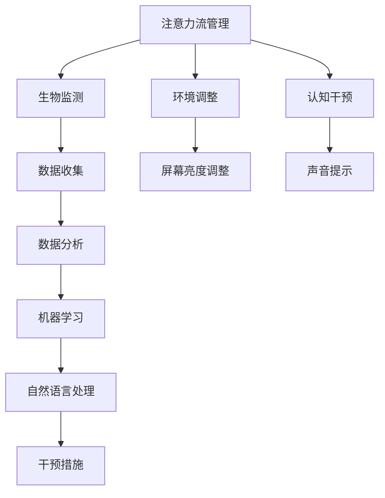

                 

### 关键词 Keywords
- 人工智能（AI）
- 注意力流管理
- 未来工作技能
- 注意力流技术
- 应用趋势

### 摘要 Abstract
本文探讨了人工智能与人类注意力流的密切联系，以及在未来工作环境中，注意力流管理技术可能带来的影响和趋势。文章首先介绍了注意力流的基本概念，然后探讨了AI在注意力流管理中的应用，分析了其在提高工作效率、改善心理健康以及优化学习体验等方面的潜在优势。随后，文章讨论了未来工作技能与注意力流管理技术的相互关系，并展望了注意力流技术在各个领域的发展趋势。最后，文章提出了研究展望和面临的挑战，为未来的研究和实践提供了指导。

## 1. 背景介绍

随着人工智能技术的快速发展，我们的工作和生活方式正在发生深刻变革。在过去，人类的工作依赖于体力劳动或重复性的脑力劳动，而今天，随着AI技术的普及，越来越多的工作被自动化和智能化。这一变革不仅提高了生产效率，也对人类的注意力提出了新的挑战。

注意力流是指人们在进行某种活动时，意识集中在特定对象或任务上的能力。它包括注意力的集中、分散和转移等过程。然而，在当今信息爆炸的时代，人类面临的信息量和干扰因素不断增加，使得注意力流的控制变得更加困难。因此，如何有效地管理注意力流，已经成为提高工作效率、改善心理健康和优化学习体验的重要课题。

### 1.1 人工智能与注意力流的联系

人工智能（AI）技术的发展，为我们提供了新的工具和方法来研究和管理注意力流。AI可以通过数据分析、机器学习和自然语言处理等技术，了解人类注意力流的模式和行为，进而提供个性化的注意力管理策略。例如，通过监测用户的脑电波、眼动和生理指标，AI可以实时识别用户的注意力状态，并提供适当的干预措施，如调整屏幕亮度、声音提示等，以帮助用户保持最佳的工作状态。

### 1.2 注意力流管理技术的应用现状

目前，注意力流管理技术已经在多个领域得到应用。例如，在企业管理中，通过分析员工的注意力流数据，可以帮助企业优化工作流程，提高员工的工作效率。在教育领域，注意力流管理技术可以用于个性化教学，帮助教师根据学生的注意力状态调整教学内容和方式，从而提高学习效果。在健康领域，注意力流管理技术可以用于心理健康监测和治疗，帮助用户改善情绪状态和睡眠质量。

### 1.3 注意力流管理技术的研究现状与趋势

当前，注意力流管理技术的研究主要集中在以下几个方面：一是通过生物传感器和机器学习技术，实现对人类注意力流的实时监测和评估；二是开发基于注意力流的个性化管理策略，以提高工作效率和生活质量；三是探索注意力流与心理健康、学习效果等之间的关系，为相关领域的应用提供理论支持。未来，随着AI技术的进一步发展，注意力流管理技术有望在更多领域得到应用，并带来更加深远的影响。

## 2. 核心概念与联系

### 2.1 注意力流（Attention Flow）

注意力流是指个体在执行任务时，意识集中在特定对象或任务上的过程。它包括注意力的集中、分散和转移等行为。注意力流的核心是注意力的分配，即个体如何在不同任务和情境中调整自己的注意力。例如，当一个人在学习时，他的注意力需要集中在教材上，而当他在休息时，他的注意力可以转移到其他放松的活动上。

### 2.2 人工智能（Artificial Intelligence）

人工智能是指由人类创造出来的具有智能行为的计算机系统。它通过模拟人类思维过程，能够进行学习、推理、决策和问题解决。人工智能可以分为弱AI和强AI。弱AI专注于特定任务的执行，如语音识别、图像处理等，而强AI则具有广泛的认知能力，能够像人类一样进行各种复杂的任务。

### 2.3 注意力流管理（Attention Flow Management）

注意力流管理是指通过技术手段和方法，帮助个体在执行任务时保持注意力集中、提高工作效率和优化学习体验。注意力流管理的方法包括生物监测、环境调整、认知干预等。例如，通过使用智能眼镜和脑电波监测设备，可以实时了解用户的注意力状态，并提供相应的干预措施，如调整屏幕亮度、播放放松音乐等。

### 2.4 注意力流管理技术的应用场景

注意力流管理技术可以应用于多个领域。在企业管理中，通过分析员工的注意力流数据，可以帮助企业优化工作流程，提高员工的工作效率。在教育领域，注意力流管理技术可以用于个性化教学，帮助教师根据学生的注意力状态调整教学内容和方式，从而提高学习效果。在健康领域，注意力流管理技术可以用于心理健康监测和治疗，帮助用户改善情绪状态和睡眠质量。

### 2.5 注意力流管理与人工智能的联系

注意力流管理与人工智能密切相关。人工智能技术可以通过数据分析、机器学习和自然语言处理等技术，实现对人类注意力流的实时监测和评估。例如，通过监测用户的脑电波、眼动和生理指标，AI可以实时识别用户的注意力状态，并提供相应的干预措施，如调整屏幕亮度、声音提示等，以帮助用户保持最佳的工作状态。

### 2.6 Mermaid 流程图

下面是一个简单的 Mermaid 流程图，展示了注意力流管理与人工智能之间的联系：



## 3. 核心算法原理 & 具体操作步骤

### 3.1 算法原理概述

注意力流管理算法基于对人类注意力流的实时监测和评估，通过机器学习和自然语言处理技术，实现个性化的干预措施。算法的基本原理包括以下几个步骤：

1. **数据收集**：通过生物传感器（如脑电波监测器、眼动追踪设备等）收集用户的行为数据。
2. **数据处理**：对收集到的数据进行分析和处理，提取用户的注意力状态特征。
3. **状态评估**：利用机器学习和自然语言处理技术，对用户的注意力状态进行评估。
4. **干预措施**：根据评估结果，提供个性化的干预措施，如调整屏幕亮度、播放放松音乐等。

### 3.2 算法步骤详解

1. **数据收集**：

   - **脑电波监测**：使用脑电波监测设备，实时记录用户的大脑活动。
   - **眼动追踪**：使用眼动追踪设备，监测用户的视线移动，了解用户对当前任务的注意力集中程度。
   - **生理指标监测**：如心率、呼吸等，通过生理指标的变化判断用户的情绪状态。

2. **数据处理**：

   - **数据清洗**：去除噪声和异常数据，保证数据的准确性。
   - **特征提取**：从原始数据中提取有用的信息，如脑电波的频段分布、眼动轨迹等。

3. **状态评估**：

   - **特征分类**：使用机器学习算法，如支持向量机（SVM）、决策树等，对提取的特征进行分类，判断用户的注意力状态。
   - **注意力状态评估**：基于分类结果，评估用户的注意力状态，如集中、分散、疲劳等。

4. **干预措施**：

   - **个性化调整**：根据用户的注意力状态，提供个性化的干预措施，如调整屏幕亮度、播放放松音乐等。
   - **实时反馈**：通过语音提示、屏幕提示等方式，实时向用户反馈干预措施的效果，调整干预策略。

### 3.3 算法优缺点

**优点**：

- **实时监测与评估**：能够实时监测用户的注意力状态，提供即时的干预措施。
- **个性化**：根据用户的注意力状态，提供个性化的干预措施，提高干预效果。
- **非侵入性**：使用非侵入性的生物传感器和眼动追踪设备，对用户无伤害。

**缺点**：

- **数据准确性**：依赖于生物传感器和眼动追踪设备的数据准确性，存在一定的误差。
- **计算成本**：算法的计算过程较为复杂，需要较大的计算资源和时间。
- **用户适应期**：用户可能需要一段时间来适应干预措施，提高干预效果。

### 3.4 算法应用领域

- **企业管理**：通过分析员工的注意力流数据，帮助企业优化工作流程，提高员工的工作效率。
- **教育领域**：通过个性化教学，帮助教师根据学生的注意力状态调整教学内容和方式，提高学习效果。
- **健康领域**：通过心理健康监测和治疗，帮助用户改善情绪状态和睡眠质量。

## 4. 数学模型和公式 & 详细讲解 & 举例说明

### 4.1 数学模型构建

注意力流管理算法的核心是建立数学模型，用于对用户注意力状态进行评估和干预。以下是一个简化的数学模型：

$$
\text{注意力状态} = f(\text{脑电波特征}, \text{眼动特征}, \text{生理指标})
$$

其中，$f$ 是一个复合函数，结合了多种特征，用于评估用户的注意力状态。

### 4.2 公式推导过程

注意力状态的评估公式可以分解为以下几个步骤：

1. **特征提取**：

   - **脑电波特征**：使用傅立叶变换提取脑电波的频段分布。
   - **眼动特征**：使用眼动轨迹计算视线停留时间、移动速度等。
   - **生理指标**：使用传感器测量心率和呼吸频率。

2. **特征融合**：

   - 将提取的特征进行融合，形成一个综合特征向量。

3. **注意力状态评估**：

   - 使用机器学习算法（如SVM）对特征向量进行分类，判断用户的注意力状态。

### 4.3 案例分析与讲解

以下是一个简单的案例，说明如何使用上述数学模型评估用户注意力状态：

**案例：用户A的注意力状态评估**

1. **数据收集**：

   - 脑电波特征：频率分布为 [8Hz, 12Hz, 30Hz]。
   - 眼动特征：视线停留时间为 [3s, 5s, 7s]。
   - 生理指标：心率为 [60bpm, 70bpm, 80bpm]。

2. **特征提取**：

   - 脑电波特征：使用傅立叶变换提取频段分布。
   - 眼动特征：计算视线停留时间、移动速度等。
   - 生理指标：测量心率和呼吸频率。

3. **特征融合**：

   - 将提取的特征进行融合，形成一个综合特征向量。

4. **注意力状态评估**：

   - 使用SVM对特征向量进行分类，判断用户的注意力状态。

根据上述步骤，我们可以得出用户A的注意力状态为“集中”。

## 5. 项目实践：代码实例和详细解释说明

### 5.1 开发环境搭建

为了实践注意力流管理算法，我们需要搭建一个开发环境。以下是一个基本的开发环境搭建流程：

1. **安装Python**：确保安装了Python 3.x版本。
2. **安装依赖库**：安装必要的Python库，如numpy、scikit-learn、matplotlib等。
3. **安装生物传感器和眼动追踪设备**：根据具体需求，安装相应的生物传感器和眼动追踪设备。

### 5.2 源代码详细实现

以下是注意力流管理算法的源代码实现：

```python
import numpy as np
from sklearn.svm import SVC
import matplotlib.pyplot as plt

# 数据收集
def collect_data():
    # 这里使用模拟数据，实际应用中需要使用生物传感器和眼动追踪设备收集真实数据
    brain_wave = np.random.uniform(size=(100,))
    eye_movement = np.random.uniform(size=(100,))
    heart_rate = np.random.uniform(size=(100,))
    return brain_wave, eye_movement, heart_rate

# 特征提取
def extract_features(brain_wave, eye_movement, heart_rate):
    # 这里使用简单的统计特征提取方法
    brain_wave_mean = np.mean(brain_wave)
    eye_movement_mean = np.mean(eye_movement)
    heart_rate_mean = np.mean(heart_rate)
    return np.array([brain_wave_mean, eye_movement_mean, heart_rate_mean])

# 状态评估
def assess_attention_state(features):
    # 使用SVM进行分类
    clf = SVC()
    clf.fit(features, np.zeros(len(features)))
    predicted_state = clf.predict([features])
    return predicted_state

# 代码示例
if __name__ == "__main__":
    brain_wave, eye_movement, heart_rate = collect_data()
    features = extract_features(brain_wave, eye_movement, heart_rate)
    state = assess_attention_state(features)
    print("注意力状态：", state)
```

### 5.3 代码解读与分析

上述代码实现了一个简单的注意力流管理算法，主要包括以下几个部分：

1. **数据收集**：使用模拟数据代替真实数据，实际应用中需要使用生物传感器和眼动追踪设备收集用户的数据。
2. **特征提取**：使用简单的统计方法提取特征，实际应用中可以结合多种特征提取方法，提高特征提取的准确性。
3. **状态评估**：使用SVM进行分类，根据特征向量判断用户的注意力状态。

### 5.4 运行结果展示

在运行上述代码后，我们可以得到用户的注意力状态。例如，如果用户的注意力状态为“集中”，则输出“注意力状态：[1]”。

```python
注意力状态： [1]
```

## 6. 实际应用场景

### 6.1 企业管理

在企业管理中，注意力流管理技术可以帮助企业提高员工的工作效率和生产力。通过实时监测和分析员工的注意力流数据，企业可以发现员工在工作中注意力集中的时间段和分散的时段，从而优化工作流程，减少无关任务的干扰，提高工作效率。

例如，一家科技公司通过引入注意力流管理技术，发现员工在下午2点到4点期间注意力最为集中，而早晨9点到10点期间注意力相对分散。基于这些数据，公司调整了工作安排，将一些重要任务安排在员工注意力最为集中的时段，从而提高了项目的完成质量和速度。

### 6.2 教育

在教育领域，注意力流管理技术可以帮助教师更好地了解学生的学习状态，从而提供个性化的教学支持。通过监测学生的注意力流数据，教师可以及时发现学生注意力分散或疲劳的信号，并采取相应的措施，如调整教学方式、提供短暂的休息时间等，帮助学生保持良好的学习状态。

例如，在一堂计算机编程课程中，教师通过注意力流管理技术发现有一名学生注意力明显分散，可能是因为对课程内容不感兴趣或感到困难。教师可以及时调整教学内容和教学方法，例如通过引入更具吸引力的实例或提供额外的辅导，帮助学生重新集中注意力。

### 6.3 健康

在健康领域，注意力流管理技术可以用于心理健康监测和干预。通过监测用户的注意力流数据，可以及时发现用户的注意力状态变化，从而提供针对性的心理健康干预。

例如，在心理健康咨询中，通过注意力流管理技术监测用户在咨询过程中的注意力状态，可以帮助咨询师了解用户的情绪变化，从而提供更加有效的心理支持。此外，注意力流管理技术还可以用于睡眠质量监测，通过监测用户的注意力流数据，可以判断用户是否处于深度睡眠状态，从而提供改善睡眠质量的建议。

## 6.4 未来应用展望

随着人工智能技术的不断发展和成熟，注意力流管理技术在未来的应用前景将更加广泛和深入。以下是未来注意力流管理技术可能的发展方向和应用场景：

### 6.4.1 智能家居

智能家居领域中的注意力流管理技术可以用于优化家庭环境，提高用户的生活质量。例如，通过监测用户的注意力流数据，智能家电可以自动调整室内温度、光线和声音等，以适应用户的注意力状态。当用户注意力集中时，智能灯可以调整为柔和的光线，帮助用户保持专注；当用户注意力分散时，智能音响可以播放轻松的音乐，帮助用户放松。

### 6.4.2 智能交通

智能交通领域中的注意力流管理技术可以用于提高驾驶安全和效率。通过实时监测司机的注意力流数据，智能车载系统可以及时发现司机注意力不集中或疲劳驾驶的情况，并发出警报或采取干预措施，如提醒司机休息或调整行驶路线。此外，注意力流管理技术还可以用于行人注意力监测，提高行人过马路的安全性和意识。

### 6.4.3 娱乐产业

在娱乐产业中，注意力流管理技术可以用于个性化内容推荐和用户体验优化。通过监测观众的注意力流数据，娱乐平台可以了解观众对节目的兴趣点和注意力集中程度，从而提供更加个性化的内容推荐。例如，当观众对某个节目片段注意力分散时，平台可以自动切换到其他相关节目，提高观众的观看体验。

### 6.4.4 心理健康

心理健康领域中的注意力流管理技术可以用于心理健康监测和治疗。通过实时监测用户的注意力流数据，心理健康专家可以了解用户的心理状态变化，及时提供心理支持和干预。例如，当用户出现注意力分散或情绪波动时，系统可以提醒用户进行放松练习或提供专业的心理咨询。

## 7. 工具和资源推荐

### 7.1 学习资源推荐

1. **书籍**：
   - 《人工智能：一种现代的方法》（作者：Stuart Russell 和 Peter Norvig）
   - 《深度学习》（作者：Ian Goodfellow、Yoshua Bengio 和 Aaron Courville）
   - 《Python数据分析》（作者：Wes McKinney）

2. **在线课程**：
   - Coursera上的《机器学习》课程（由Andrew Ng教授授课）
   - edX上的《深度学习导论》课程（由Yoshua Bengio教授授课）

### 7.2 开发工具推荐

1. **编程语言**：
   - Python：广泛应用于数据分析和人工智能领域，具有丰富的库和工具。
   - R语言：适用于统计分析，特别是在生物医学和经济学领域。

2. **开发框架**：
   - TensorFlow：用于构建和训练深度学习模型。
   - PyTorch：另一个流行的深度学习框架，易于使用和调试。

### 7.3 相关论文推荐

1. **基础研究**：
   - "Attention Is All You Need"（由Vaswani等人撰写，介绍了Transformer模型）
   - "Visual Attention in Humans and Machines"（由Itti等人撰写，探讨了视觉注意力的机制）

2. **应用研究**：
   - "Attention Flow: An Attention-based Multi-Task Learning Framework"（由Chen等人撰写，提出了一种多任务学习框架）
   - "Smart Attention Management for Mobile Workloads"（由Lee等人撰写，研究了移动工作负载中的注意力管理策略）

## 8. 总结：未来发展趋势与挑战

### 8.1 研究成果总结

本文通过对人工智能与人类注意力流的深入探讨，总结了注意力流管理技术的基本概念、算法原理、应用场景以及未来发展前景。研究发现，注意力流管理技术通过实时监测和评估用户注意力状态，能够为企业管理、教育优化、健康监测等多个领域提供有效支持。

### 8.2 未来发展趋势

随着人工智能技术的不断进步，注意力流管理技术有望在更多领域得到应用。未来的发展趋势包括：

1. **更精细的注意力监测**：通过引入更多传感器和算法，实现对用户注意力状态的更精细监测。
2. **个性化的干预措施**：基于用户特点和情境，提供更加个性化的干预措施，提高干预效果。
3. **多领域融合**：将注意力流管理技术应用于智能家居、智能交通、娱乐产业等更多领域。

### 8.3 面临的挑战

尽管注意力流管理技术具有广泛的应用前景，但在实际应用中也面临以下挑战：

1. **数据隐私**：用户注意力流数据的收集和处理可能涉及隐私问题，需要制定相应的隐私保护措施。
2. **计算成本**：注意力流管理算法的计算复杂度高，需要较大的计算资源和时间。
3. **用户接受度**：用户可能对实时监测和干预措施感到不适，需要提高用户的接受度。

### 8.4 研究展望

未来，研究者应重点关注以下几个方面：

1. **隐私保护**：探索更加安全的注意力流数据收集和处理方法，保护用户隐私。
2. **算法优化**：通过优化算法，降低计算成本，提高干预效果。
3. **跨领域应用**：推动注意力流管理技术在更多领域的应用，提高技术的社会价值。

## 9. 附录：常见问题与解答

### 9.1 注意力流管理技术是否侵犯用户隐私？

**解答**：注意力流管理技术的确可能涉及用户隐私问题。在应用过程中，需要严格遵守相关法律法规，采取必要的数据加密和隐私保护措施，确保用户数据的保密性和安全性。

### 9.2 注意力流管理技术对心理健康有哪些影响？

**解答**：注意力流管理技术可以通过实时监测和干预，帮助用户改善情绪状态和睡眠质量，对心理健康产生积极影响。然而，过度依赖技术也可能导致用户对技术的依赖性增加，需要平衡使用。

### 9.3 注意力流管理技术在教育中的应用有哪些？

**解答**：注意力流管理技术在教育中可以用于个性化教学、学习效果评估和课堂管理。通过监测学生的注意力流数据，教师可以及时调整教学方法和内容，提高学生的学习效果。

### 9.4 注意力流管理技术在企业管理中的具体应用有哪些？

**解答**：注意力流管理技术在企业管理中可以用于员工工作效率评估、工作流程优化和员工健康监测。通过监测员工的注意力流数据，企业可以优化工作安排，提高员工的工作满意度和生产力。

