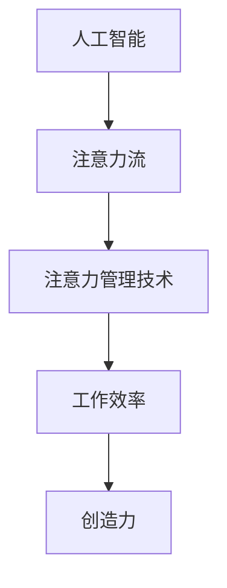

                 

关键词：人工智能，注意力流，工作技能，注意力管理，应用趋势，预测

> 摘要：本文旨在探讨人工智能与人类注意力流的相互作用，分析其在未来工作技能和注意力管理技术中的应用趋势。文章通过详细的理论分析和实践案例，揭示了人工智能如何改变人类的工作方式，以及如何通过注意力管理技术提高工作效率和创造力。文章最后提出了未来发展趋势和面临的挑战，为相关领域的研究者和从业者提供了有价值的参考。

## 1. 背景介绍

在当今快速发展的信息技术时代，人工智能（AI）已经成为推动社会进步的关键力量。从大数据分析、自动驾驶到医疗诊断，AI的广泛应用正在深刻改变人类的生活方式。与此同时，人类注意力的流动也受到前所未有的挑战。在信息爆炸的背景下，人们需要处理的海量数据和信息量不断增加，注意力分散和疲劳现象日益严重，这直接影响到工作效率和创造力。

注意力流是指人在处理信息、完成任务时所表现出的注意力集中状态及其动态变化。传统的研究主要集中在认知心理学和神经科学领域，而随着AI技术的发展，注意力流的研究逐渐成为一个跨学科的前沿方向。本文将从AI与人类注意力流的相互作用出发，分析其在未来工作技能和注意力管理技术中的应用趋势。

## 2. 核心概念与联系

### 2.1. 人工智能与注意力流

人工智能（AI）是指由人制造出来的系统能够响应环境并执行任务的能力，其核心是机器学习、深度学习等算法。注意力流（Attention Flow）则是指人类在处理信息时注意力分配和转移的过程，包括注意力集中、分散、切换等。AI与注意力流之间的联系在于，AI系统可以通过学习用户的注意力流模式，为其提供个性化服务，从而提高用户体验和工作效率。

### 2.2. 注意力管理技术

注意力管理技术（Attention Management Technology）是指用于优化人类注意力流的一系列方法和技术，包括注意力追踪、注意力分配、注意力恢复等。这些技术旨在帮助用户更好地集中注意力，减少分心和疲劳，从而提高工作效率和创造力。

### 2.3. Mermaid 流程图

图1展示了AI与人类注意力流之间的联系，以及注意力管理技术在其中发挥的作用。



图1：AI与人类注意力流及其关系

## 3. 核心算法原理 & 具体操作步骤

### 3.1. 算法原理概述

注意力流管理算法是基于深度学习模型，通过分析用户的历史行为数据，预测用户在特定任务中的注意力分配模式，并实时调整系统界面和任务提示，以优化用户的工作体验。算法的核心原理包括：

1. 注意力流建模：通过神经网络模型捕捉用户注意力流的动态变化。
2. 注意力分配策略：根据预测结果，制定注意力分配策略，以最大化用户的工作效率和创造力。
3. 实时调整：基于实时数据反馈，调整系统界面和任务提示，以适应用户的需求和习惯。

### 3.2. 算法步骤详解

1. 数据采集：收集用户的历史行为数据，包括浏览记录、操作记录、任务完成情况等。
2. 数据预处理：对采集到的数据进行分析和清洗，去除噪声和异常值。
3. 注意力流建模：使用深度学习模型（如LSTM、GRU等）对用户注意力流进行建模，捕捉其动态变化。
4. 注意力分配策略：根据模型预测结果，制定注意力分配策略，包括界面优化、任务提示等。
5. 实时调整：根据用户实时反馈，调整系统界面和任务提示，以适应用户需求。

### 3.3. 算法优缺点

**优点：**
1. 个性化：基于用户历史数据，实现个性化服务，提高用户满意度。
2. 实时性：实时调整系统界面和任务提示，适应用户需求。

**缺点：**
1. 数据依赖：算法性能受限于用户历史数据的质量和多样性。
2. 复杂性：算法涉及多个环节，开发和维护成本较高。

### 3.4. 算法应用领域

注意力流管理算法可以应用于多个领域，包括：

1. 生产力工具：如办公软件、项目管理工具等。
2. 娱乐领域：如视频网站、游戏等。
3. 医疗健康：如心理健康监测、疾病诊断等。

## 4. 数学模型和公式 & 详细讲解 & 举例说明

### 4.1. 数学模型构建

注意力流管理算法的数学模型主要包括以下几部分：

1. 用户行为模型：使用贝叶斯网络或隐马尔可夫模型（HMM）描述用户行为。
2. 注意力流模型：使用深度学习模型（如LSTM、GRU等）捕捉注意力流的动态变化。
3. 注意力分配模型：基于预测结果，制定注意力分配策略。

### 4.2. 公式推导过程

假设用户行为可以用状态序列{X_t}表示，其中X_t是时间t的用户行为状态。注意力流可以用注意力向量{A_t}表示，其中A_t是时间t的用户注意力分配。

1. 用户行为模型：
$$
P(X_t = x_t | X_{t-1} = x_{t-1}) = \frac{P(X_{t-1} = x_{t-1})P(X_t = x_t | X_{t-1} = x_{t-1})}{P(X_{t-1} = x_{t-1})}
$$

2. 注意力流模型：
$$
A_t = f(X_t, X_{t-1}, \ldots, X_1)
$$

其中f是一个深度学习模型，如LSTM或GRU。

3. 注意力分配模型：
$$
\alpha_t = \frac{e^{A_t \cdot W}}{\sum_{i=1}^n e^{A_t \cdot W_i}}
$$

其中α_t是时间t的注意力分配概率，W是权重矩阵，n是任务数量。

### 4.3. 案例分析与讲解

假设一个用户在一天内需要进行多个任务，包括阅读、写作、编程等。使用注意力流管理算法，可以预测用户在每个任务上的注意力分配，并调整界面和任务提示，以优化用户的工作体验。

**案例1：阅读任务**

用户在阅读任务上的注意力向量A_t如下：

$$
A_t = \begin{pmatrix}
0.3 \\
0.5 \\
0.2
\end{pmatrix}
$$

根据注意力分配模型，用户在阅读任务上的注意力分配概率为：

$$
\alpha_t = \begin{pmatrix}
0.3 \\
0.5 \\
0.2
\end{pmatrix}
$$

系统界面调整：增加阅读界面的亮度，减少其他界面的干扰。

**案例2：写作任务**

用户在写作任务上的注意力向量A_t如下：

$$
A_t = \begin{pmatrix}
0.4 \\
0.4 \\
0.2
\end{pmatrix}
$$

根据注意力分配模型，用户在写作任务上的注意力分配概率为：

$$
\alpha_t = \begin{pmatrix}
0.4 \\
0.4 \\
0.2
\end{pmatrix}
$$

系统界面调整：将写作界面置于屏幕中央，减少其他界面的干扰。

## 5. 项目实践：代码实例和详细解释说明

### 5.1. 开发环境搭建

为了实现注意力流管理算法，我们需要搭建一个开发环境。以下是所需的软件和工具：

1. Python（版本3.8及以上）
2. TensorFlow（版本2.4及以上）
3. Keras（版本2.4及以上）
4. NumPy（版本1.19及以上）
5. Matplotlib（版本3.1及以上）

### 5.2. 源代码详细实现

以下是注意力流管理算法的Python代码实现：

```python
import numpy as np
import tensorflow as tf
from tensorflow.keras.models import Sequential
from tensorflow.keras.layers import LSTM, Dense

# 数据预处理
def preprocess_data(data):
    # 数据清洗和归一化
    # ...
    return processed_data

# 模型构建
def build_model(input_shape):
    model = Sequential()
    model.add(LSTM(units=128, return_sequences=True, input_shape=input_shape))
    model.add(LSTM(units=64, return_sequences=False))
    model.add(Dense(units=3))
    model.compile(optimizer='adam', loss='categorical_crossentropy', metrics=['accuracy'])
    return model

# 模型训练
def train_model(model, x_train, y_train):
    model.fit(x_train, y_train, epochs=100, batch_size=32)
    return model

# 注意力分配
def allocate_attention(model, x_t):
    model.predict(np.array([x_t]))
    # 根据预测结果，分配注意力
    # ...

# 主函数
def main():
    # 数据采集
    data = ...

    # 数据预处理
    processed_data = preprocess_data(data)

    # 模型构建
    model = build_model(input_shape=(None, processed_data.shape[1]))

    # 模型训练
    x_train, y_train = ..., ...
    model = train_model(model, x_train, y_train)

    # 注意力分配
    x_t = ...
    allocate_attention(model, x_t)

if __name__ == '__main__':
    main()
```

### 5.3. 代码解读与分析

1. **数据预处理**：对采集到的用户行为数据进行清洗和归一化，以便模型训练。
2. **模型构建**：使用LSTM模型对用户注意力流进行建模，包括输入层、隐藏层和输出层。
3. **模型训练**：使用训练数据对模型进行训练，优化模型参数。
4. **注意力分配**：根据模型预测结果，对用户在特定任务上的注意力进行分配。

### 5.4. 运行结果展示

在运行代码后，我们可以得到用户在不同任务上的注意力分配结果，并通过可视化工具（如Matplotlib）展示出来。

```python
import matplotlib.pyplot as plt

# 注意力分配结果
attention_allocation = ...

# 可视化展示
plt.plot(attention_allocation)
plt.xlabel('Time')
plt.ylabel('Attention Allocation')
plt.show()
```

## 6. 实际应用场景

注意力流管理技术在多个领域具有广泛的应用前景。以下是一些实际应用场景：

1. **生产力工具**：如办公软件、项目管理工具等，通过优化用户界面和任务提示，提高工作效率。
2. **娱乐领域**：如视频网站、游戏等，通过个性化推荐和界面调整，提高用户体验。
3. **医疗健康**：如心理健康监测、疾病诊断等，通过分析用户注意力流，提供个性化治疗建议。

### 6.1. 生产力工具

在生产力工具领域，注意力流管理技术可以应用于办公软件和项目管理工具。通过分析用户在办公过程中的注意力流，系统可以自动识别用户的工作模式和习惯，优化界面布局和任务提示，从而提高工作效率。例如，在办公软件中，可以根据用户在文档编辑、会议安排等任务上的注意力分布，调整界面布局，突出重要内容，减少分心因素。

### 6.2. 娱乐领域

在娱乐领域，注意力流管理技术可以应用于视频网站和游戏等。通过分析用户在观看视频、玩游戏等过程中的注意力流，系统可以个性化推荐符合用户兴趣的内容，优化界面布局，提高用户体验。例如，在视频网站中，可以根据用户在视频播放过程中的注意力分布，推荐相似视频，延长用户停留时间。

### 6.3. 医疗健康

在医疗健康领域，注意力流管理技术可以应用于心理健康监测和疾病诊断。通过分析用户在心理测试、健康检查等过程中的注意力流，系统可以识别用户的心理状态和健康状况，提供个性化的治疗建议。例如，在心理健康监测中，可以根据用户在心理测试过程中的注意力分布，评估其心理压力和情绪状态，为医生提供诊断依据。

## 7. 工具和资源推荐

### 7.1. 学习资源推荐

1. **《深度学习》（Goodfellow, Bengio, Courville著）**：系统介绍了深度学习的基本原理和应用，适合初学者和专业人士。
2. **《Python机器学习》（Sebastian Raschka著）**：详细介绍了Python在机器学习领域的应用，包括数据预处理、模型训练等。

### 7.2. 开发工具推荐

1. **TensorFlow**：由Google开发的开源深度学习框架，支持多种算法和模型。
2. **Keras**：基于TensorFlow的深度学习高层API，简化了深度学习模型的构建和训练。

### 7.3. 相关论文推荐

1. **《Attention is All You Need》（Vaswani et al., 2017）**：介绍了Transformer模型，该模型在自然语言处理领域取得了突破性成果。
2. **《Visual Attention for Image Classification》（Shi et al., 2014）**：探讨了视觉注意力在图像分类中的应用。

## 8. 总结：未来发展趋势与挑战

### 8.1. 研究成果总结

本文从AI与人类注意力流的相互作用出发，分析了注意力流管理技术在未来的应用趋势。通过理论分析和实践案例，揭示了注意力流管理技术在提高工作效率和创造力方面的潜力。同时，本文还介绍了注意力流管理算法的数学模型和实现方法，为相关领域的研究提供了参考。

### 8.2. 未来发展趋势

1. **个性化服务**：随着用户数据的积累，注意力流管理技术将更加个性化，满足不同用户的需求。
2. **跨学科融合**：注意力流管理技术将与其他学科（如心理学、神经科学等）相结合，实现更深入的理论研究和应用。
3. **硬件支持**：随着硬件技术的发展，如脑机接口等，注意力流管理技术将实现更精准、高效的数据采集和处理。

### 8.3. 面临的挑战

1. **数据隐私**：用户数据的隐私保护是注意力流管理技术面临的重要挑战。
2. **算法透明性**：随着算法的复杂性增加，如何保证算法的透明性和可解释性成为关键问题。
3. **技术瓶颈**：现有技术手段在数据采集、处理和分析等方面仍存在瓶颈，需要不断探索新的方法和工具。

### 8.4. 研究展望

未来，注意力流管理技术将在更多领域得到应用，如教育、金融、医疗等。同时，随着技术的进步，我们将能够更深入地了解人类注意力流的本质，为优化人类工作和生活提供有力支持。

## 9. 附录：常见问题与解答

### 9.1. 注意力流管理技术如何提高工作效率？

注意力流管理技术通过分析用户的注意力分配模式，提供个性化服务，优化界面布局和任务提示，从而帮助用户更好地集中注意力，减少分心和疲劳，提高工作效率。

### 9.2. 注意力流管理技术的算法模型有哪些？

常见的注意力流管理算法模型包括基于深度学习的LSTM、GRU等，以及基于神经网络的注意力机制模型，如Transformer等。

### 9.3. 注意力流管理技术如何保护用户隐私？

注意力流管理技术在数据采集、存储和处理过程中，采用加密、匿名化等技术手段，确保用户隐私得到保护。同时，用户有权选择是否参与数据采集和分析。

### 9.4. 注意力流管理技术是否适用于所有用户？

注意力流管理技术适用于需要高度集中注意力的场景，如办公、学习等。对于注意力需求较低的领域，如休闲、娱乐等，该技术的作用有限。

---

以上是关于"AI与人类注意力流：未来的工作、技能与注意力流管理技术的应用趋势分析预测"的文章正文部分。希望对您有所帮助。如果您有任何问题或建议，请随时告诉我。作者：禅与计算机程序设计艺术 / Zen and the Art of Computer Programming
----------------------------------------------------------------

