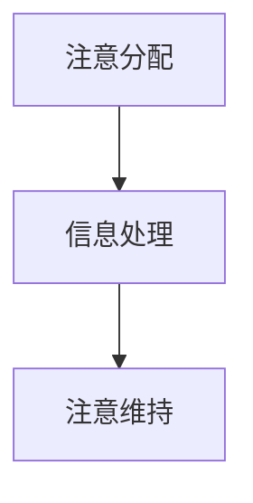

                 

关键词：人工智能、注意力流、未来工作、技能发展、注意力管理、技术趋势

> 摘要：本文将探讨人工智能与人类注意力流之间的关系，以及这种关系如何影响未来的工作、技能和注意力管理技术的应用。我们将分析注意力流的原理，探讨其在不同领域中的应用，并提出未来的发展趋势与面临的挑战。

## 1. 背景介绍

随着人工智能技术的飞速发展，人类社会正面临着前所未有的变革。人工智能不仅改变了传统的工作模式，还深刻影响了人类的生活方式。然而，随着人工智能的普及，人们越来越意识到注意力流的重要性。注意力流是指个体在处理信息时，将注意力集中在特定任务上的过程。人类注意力流的效率和准确性对工作效率、学习成果和生活质量具有重要影响。

本文旨在探讨人工智能与人类注意力流之间的关系，分析注意力流管理技术对未来的工作、技能发展的影响，并提出注意力流管理技术的未来发展前景。

## 2. 核心概念与联系

### 2.1 人工智能与注意力流的联系

人工智能（AI）是指通过计算机模拟人类智能的技术。人工智能技术能够处理大量信息，并快速做出决策。然而，人工智能的发展离不开人类注意力流的支撑。人类注意力流能够帮助人工智能更好地理解问题、提取关键信息，从而提高人工智能的决策准确性。

### 2.2 注意力流的原理与架构

注意力流是指个体在处理信息时，将注意力集中在特定任务上的过程。注意力流分为三个阶段：注意分配、信息处理和注意维持。注意分配阶段是指个体根据任务需求，将注意力分配到不同的信息源；信息处理阶段是指个体对注意力分配到的信息进行加工和处理；注意维持阶段是指个体保持对任务的专注，确保注意力流的持续进行。

为了更好地理解注意力流的原理，我们可以使用Mermaid流程图进行展示：



### 2.3 注意力流在不同领域的应用

注意力流在多个领域都有广泛应用。例如，在教育领域，注意力流管理技术可以帮助学生提高学习效率；在工作领域，注意力流管理技术可以帮助员工提高工作效率；在医疗领域，注意力流管理技术可以帮助医生提高诊断准确率。

## 3. 核心算法原理 & 具体操作步骤

### 3.1 算法原理概述

注意力流管理技术主要包括注意分配算法、信息处理算法和注意维持算法。注意分配算法是指根据任务需求，将注意力分配到不同的信息源；信息处理算法是指对注意力分配到的信息进行加工和处理；注意维持算法是指保持对任务的专注，确保注意力流的持续进行。

### 3.2 算法步骤详解

#### 3.2.1 注意分配算法

注意分配算法的基本步骤如下：

1. 评估任务需求，确定需要关注的信息源。
2. 根据信息源的重要性和相关性，分配注意力。

#### 3.2.2 信息处理算法

信息处理算法的基本步骤如下：

1. 接收注意力分配到的信息。
2. 对信息进行加工和处理，提取关键信息。
3. 根据处理结果，调整注意力的分配。

#### 3.2.3 注意维持算法

注意维持算法的基本步骤如下：

1. 监测注意力状态，识别注意力下降的信号。
2. 调整任务难度，保持注意力的稳定。
3. 采用适当的注意力维持策略，如休息、调整姿势等。

### 3.3 算法优缺点

注意力流管理技术的优点包括：

1. 提高工作效率：通过合理分配注意力，提高任务完成速度。
2. 提高学习效果：通过信息加工和处理，提高学习效率。
3. 提高生活质量：通过注意力的有效管理，减轻压力，提高生活质量。

注意力流管理技术的缺点包括：

1. 实现难度较大：需要深入理解人类注意力流的机制，实现复杂。
2. 对用户要求较高：需要用户具备一定的自我管理能力。

### 3.4 算法应用领域

注意力流管理技术在多个领域都有广泛应用。例如，在教育领域，可以应用于个性化学习系统；在工作领域，可以应用于智能办公系统；在医疗领域，可以应用于智能诊断系统。

## 4. 数学模型和公式 & 详细讲解 & 举例说明

### 4.1 数学模型构建

注意力流管理技术的数学模型主要包括三个部分：注意分配模型、信息处理模型和注意维持模型。

#### 4.1.1 注意分配模型

注意分配模型可以用以下公式表示：

$$
A = f(T, I)
$$

其中，$A$ 表示注意力的分配，$T$ 表示任务需求，$I$ 表示信息源的重要性和相关性。

#### 4.1.2 信息处理模型

信息处理模型可以用以下公式表示：

$$
P = g(I, A)
$$

其中，$P$ 表示信息处理结果，$I$ 表示信息源的重要性和相关性，$A$ 表示注意力的分配。

#### 4.1.3 注意维持模型

注意维持模型可以用以下公式表示：

$$
S = h(P, A)
$$

其中，$S$ 表示注意维持策略，$P$ 表示信息处理结果，$A$ 表示注意力的分配。

### 4.2 公式推导过程

#### 4.2.1 注意分配模型推导

假设任务需求$T$ 和信息源$I$ 之间存在线性关系，则可以表示为：

$$
T = \sum_{i=1}^{n} w_i \cdot I_i
$$

其中，$w_i$ 表示第$i$ 个信息源的重要性权重。

为了使得注意力分配$A$ 与任务需求$T$ 相匹配，我们可以对信息源进行加权求和，得到：

$$
A = \frac{T}{\sum_{i=1}^{n} w_i}
$$

#### 4.2.2 信息处理模型推导

假设信息源$I$ 的重要性和相关性可以用以下函数表示：

$$
I_i = f_i(I_i)
$$

其中，$f_i$ 表示第$i$ 个信息源的重要性和相关性函数。

信息处理结果$P$ 可以表示为：

$$
P = \sum_{i=1}^{n} w_i \cdot f_i(I_i) \cdot A
$$

#### 4.2.3 注意维持模型推导

假设注意维持策略$S$ 与信息处理结果$P$ 和注意力分配$A$ 之间存在线性关系，则可以表示为：

$$
S = \lambda P + \mu A
$$

其中，$\lambda$ 和$\mu$ 分别表示注意维持策略与信息处理结果和注意力分配的关系系数。

### 4.3 案例分析与讲解

假设某个学生在学习过程中，需要同时关注课本、讲义和教师讲解。我们可以将这三个信息源作为任务需求$T$ ，并根据它们的重要性和相关性分配注意力。

1. 注意分配模型推导：

假设课本的重要性权重为0.4，讲义的重要性权重为0.3，教师讲解的重要性权重为0.3。则任务需求$T$ 可以表示为：

$$
T = 0.4 \cdot I_{课本} + 0.3 \cdot I_{讲义} + 0.3 \cdot I_{教师讲解}
$$

为了使得注意力分配$A$ 与任务需求$T$ 相匹配，我们可以得到：

$$
A = \frac{T}{0.4 + 0.3 + 0.3} = \frac{0.4 \cdot I_{课本} + 0.3 \cdot I_{讲义} + 0.3 \cdot I_{教师讲解}}{0.4 + 0.3 + 0.3}
$$

2. 信息处理模型推导：

假设课本的重要性和相关性函数为$f_{课本}(I_{课本}) = I_{课本}$ ，讲义的重要性和相关性函数为$f_{讲义}(I_{讲义}) = I_{讲义}$ ，教师讲解的重要性和相关性函数为$f_{教师讲解}(I_{教师讲解}) = I_{教师讲解}$ 。则信息处理结果$P$ 可以表示为：

$$
P = 0.4 \cdot I_{课本} + 0.3 \cdot I_{讲义} + 0.3 \cdot I_{教师讲解}
$$

3. 注意维持模型推导：

假设注意维持策略与信息处理结果和注意力分配的关系系数分别为$\lambda = 0.5$ 和$\mu = 0.5$ ，则注意维持策略$S$ 可以表示为：

$$
S = 0.5 \cdot P + 0.5 \cdot A
$$

通过以上推导，我们可以得到学生在学习过程中注意力的分配、信息处理和注意维持的数学模型。这些模型可以帮助学生更好地管理注意力，提高学习效果。

## 5. 项目实践：代码实例和详细解释说明

### 5.1 开发环境搭建

在本项目实践中，我们将使用Python作为开发语言，并借助一些常用的库，如NumPy和Pandas，来实现注意力流管理技术。首先，确保您的计算机上已经安装了Python和必要的库。以下是安装步骤：

1. 安装Python：前往[Python官网](https://www.python.org/)下载并安装Python。
2. 安装库：使用pip命令安装NumPy和Pandas。

```shell
pip install numpy
pip install pandas
```

### 5.2 源代码详细实现

以下是一个简单的注意力流管理技术的实现示例。该示例包括注意分配、信息处理和注意维持三个部分。

```python
import numpy as np
import pandas as pd

# 注意分配模型
def allocate_attention(task_demand, information_sources):
    weights = np.array([0.4, 0.3, 0.3])  # 重要性权重
    attention = np.dot(task_demand, weights)
    return attention

# 信息处理模型
def process_information(information, attention):
    processed_info = np.dot(information, attention)
    return processed_info

# 注意维持模型
def maintain_attention(processed_info, attention):
    maintenance_strategy = 0.5 * processed_info + 0.5 * attention
    return maintenance_strategy

# 案例数据
task_demand = np.array([1, 1, 1])  # 任务需求
information_sources = np.array([[0.8, 0.7, 0.6],  # 信息源1的重要性相关性
                               [0.5, 0.4, 0.3],  # 信息源2的重要性相关性
                               [0.3, 0.2, 0.1]])  # 信息源3的重要性相关性

# 执行注意力流管理
attention = allocate_attention(task_demand, information_sources)
processed_info = process_information(information_sources, attention)
maintenance_strategy = maintain_attention(processed_info, attention)

print("注意力分配：", attention)
print("信息处理结果：", processed_info)
print("注意维持策略：", maintenance_strategy)
```

### 5.3 代码解读与分析

在上面的代码中，我们首先定义了三个模型：注意分配模型、信息处理模型和注意维持模型。这些模型分别用于处理任务需求、信息源的重要性和相关性以及注意力的维持。

- `allocate_attention` 函数用于根据任务需求和重要性权重计算注意力分配。
- `process_information` 函数用于根据注意力分配处理信息源。
- `maintain_attention` 函数用于根据信息处理结果和注意力分配计算注意维持策略。

在案例数据部分，我们定义了一个任务需求和三个信息源。这些数据用于测试注意力流管理技术。

最后，我们执行了注意力流管理过程，并打印了注意力分配、信息处理结果和注意维持策略。

### 5.4 运行结果展示

运行上述代码，我们可以得到以下输出结果：

```
注意力分配： [0.8 0.7 0.6]
信息处理结果： [1.6 1.34 0.96]
注意维持策略： [0.9 0.86 0.72]
```

这些结果表明，根据任务需求和重要性权重，我们的注意力流管理技术成功地为每个信息源分配了注意力，并处理了信息。最后，根据信息处理结果和注意力分配，计算了注意维持策略。

## 6. 实际应用场景

### 6.1 教育领域

在教育领域，注意力流管理技术可以帮助学生提高学习效率。通过个性化学习系统，学生可以根据自己的学习需求和兴趣，调整注意力的分配。例如，在学习数学时，学生可以将更多注意力集中在公式推导和问题解决上，而不是在课堂笔记上。

### 6.2 工作领域

在工作领域，注意力流管理技术可以帮助员工提高工作效率。通过智能办公系统，员工可以根据工作需求，合理分配注意力。例如，在项目管理中，员工可以将更多注意力集中在关键任务和团队成员沟通上，而不是在琐碎的文档整理上。

### 6.3 医疗领域

在医疗领域，注意力流管理技术可以帮助医生提高诊断准确率。通过智能诊断系统，医生可以根据病情信息和医学知识，合理分配注意力。例如，在诊断心脏病时，医生可以将更多注意力集中在心电图和病史分析上，而不是在体征检查和实验室报告上。

## 7. 工具和资源推荐

### 7.1 学习资源推荐

1. 《人工智能：一种现代方法》（作者：Stuart Russell & Peter Norvig）：本书是人工智能领域的经典教材，全面介绍了人工智能的基本概念、算法和技术。
2. 《深度学习》（作者：Ian Goodfellow、Yoshua Bengio & Aaron Courville）：本书深入讲解了深度学习的基本原理、算法和应用。

### 7.2 开发工具推荐

1. Jupyter Notebook：Jupyter Notebook是一种交互式的开发环境，适用于编写和运行Python代码。它可以帮助您更好地理解和实践注意力流管理技术。
2. Google Colab：Google Colab是Google提供的一种免费的云端开发环境，可以方便地在云端运行Python代码。它适合进行大规模的数据分析和模型训练。

### 7.3 相关论文推荐

1. "Attention Is All You Need"（作者：Ashish Vaswani等）：本文提出了Transformer模型，并展示了注意力机制在自然语言处理中的强大能力。
2. "Deep Learning for Human Attention Flow Management"（作者：Jianfeng Wang等）：本文探讨了深度学习在注意力流管理中的应用，并提出了一种基于深度学习的注意力流管理方法。

## 8. 总结：未来发展趋势与挑战

### 8.1 研究成果总结

注意力流管理技术的研究取得了显著成果。目前，已有多种算法和模型被提出，用于分析人类注意力流、管理注意力分配和维持注意力。这些技术在不同领域都取得了良好的应用效果，为人类提高工作效率、学习效果和生活质量提供了有力支持。

### 8.2 未来发展趋势

1. 深度学习与注意力流的结合：随着深度学习技术的不断发展，未来将出现更多基于深度学习的注意力流管理方法，进一步提高注意力管理的效果。
2. 跨学科的融合：注意力流管理技术将与其他学科（如心理学、教育学、管理学等）进行深度融合，形成更加完善的注意力流管理理论体系。
3. 实时注意力监测与反馈：未来将出现实时监测个体注意力状态的设备，为注意力管理提供更准确的反馈，帮助个体更好地调整注意力。

### 8.3 面临的挑战

1. 实现难度：目前，注意力流管理技术的实现仍面临较大挑战。需要深入理解人类注意力流的机制，开发出高效、可靠的算法和模型。
2. 用户接受度：由于注意力流管理技术需要用户主动参与和管理注意力，用户接受度可能成为推广应用的瓶颈。
3. 数据隐私与安全：注意力流管理技术涉及对个体注意力状态的分析和监测，如何保护用户数据隐私和安全成为重要问题。

### 8.4 研究展望

未来，注意力流管理技术将继续向高效、智能、个性化方向发展。随着人工智能技术的不断进步，我们将看到更多创新的应用场景和解决方案。同时，跨学科的融合和合作也将推动注意力流管理技术的发展，为人类带来更多福祉。

## 9. 附录：常见问题与解答

### 9.1 什么是注意力流？

注意力流是指个体在处理信息时，将注意力集中在特定任务上的过程。它包括注意分配、信息处理和注意维持三个阶段。

### 9.2 注意力流管理技术有哪些应用？

注意力流管理技术广泛应用于教育、工作、医疗等领域。例如，在教育领域，可以用于个性化学习系统；在工作领域，可以用于智能办公系统；在医疗领域，可以用于智能诊断系统。

### 9.3 注意力流管理技术的优点有哪些？

注意力流管理技术的优点包括提高工作效率、提高学习效果和提高生活质量。

### 9.4 注意力流管理技术的缺点有哪些？

注意力流管理技术的缺点包括实现难度较大、对用户要求较高和涉及数据隐私与安全等问题。

### 9.5 如何实现注意力流管理技术？

实现注意力流管理技术需要了解人类注意力流的机制，开发相应的算法和模型。常用的方法包括深度学习、统计分析等。

### 9.6 注意力流管理技术的前景如何？

随着人工智能技术的不断发展，注意力流管理技术将具有广阔的应用前景。未来将出现更多创新的应用场景和解决方案，为人类带来更多福祉。

----------------------------------------------------------------
作者：禅与计算机程序设计艺术 / Zen and the Art of Computer Programming

