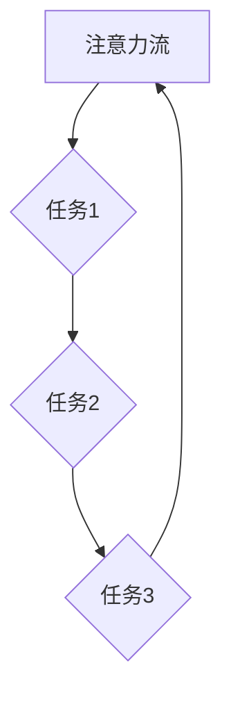

                 

关键词：人工智能，注意力流，注意力管理，工作效率，未来工作，技能提升

> 摘要：随着人工智能技术的飞速发展，人类的工作方式和注意力管理正面临巨大的变革。本文旨在探讨人工智能对人类注意力流的影响，分析未来的工作趋势、所需技能，以及如何在高度分散的注意力环境中进行有效的注意力管理。

## 1. 背景介绍

在21世纪，人工智能（AI）已经成为推动科技进步和社会发展的重要引擎。从早期的专家系统到深度学习和自然语言处理，AI技术不断突破，逐渐渗透到我们的日常生活中。无论是智能手机的语音助手，还是自动驾驶汽车，AI技术都在潜移默化地改变着我们的行为和思维模式。

然而，随着AI技术的广泛应用，人类的工作环境和注意力管理也面临着前所未有的挑战。信息过载、任务繁多、多任务处理成为现代社会工作者的常态，这使得我们的注意力分散，工作效率降低。如何在这样的环境中有效管理注意力，提升工作效率，成为亟待解决的重要问题。

## 2. 核心概念与联系

### 2.1 注意力流的定义

注意力流是指人类在进行任务处理时，注意力在不同任务之间的转移和分配过程。一个高效的注意力流可以帮助个体集中精力，快速处理任务，从而提高工作效率。

### 2.2 人工智能与注意力流的关系

人工智能技术在提升工作效率的同时，也对注意力流产生了影响。一方面，AI可以自动化大量重复性任务，减轻人类的认知负担；另一方面，AI生成的海量信息也可能导致注意力分散，降低工作效率。

### 2.3 注意力管理的重要性

在高度信息化的社会中，注意力管理成为提升工作效率的关键。有效的注意力管理可以帮助个体在面对多任务环境时，保持专注，提高工作效率。

## 3. 核心算法原理 & 具体操作步骤

### 3.1 算法原理概述

注意力管理算法旨在通过识别和优化个体在任务处理过程中的注意力分配，提高工作效率。其核心原理包括：

1. **任务识别**：通过分析个体在不同任务上的时间分配，识别出主要任务和次要任务。
2. **注意力优化**：根据任务的重要性和紧急程度，调整注意力分配，确保主要任务的优先处理。
3. **反馈调整**：根据任务完成的效率和效果，对注意力管理策略进行实时调整。

### 3.2 算法步骤详解

1. **数据采集**：收集个体在任务处理过程中的时间分配数据。
2. **任务分类**：根据任务的重要性和紧急程度，将任务分为主要任务和次要任务。
3. **注意力分配**：根据任务分类结果，分配注意力资源，确保主要任务的优先处理。
4. **效果评估**：评估注意力管理策略的效果，根据评估结果进行调整。

### 3.3 算法优缺点

**优点**：能够有效提高工作效率，降低多任务环境下的认知负担。

**缺点**：需要依赖大量数据支持，且在任务复杂度较高的情况下，效果可能有限。

### 3.4 算法应用领域

注意力管理算法可以应用于多个领域，包括但不限于：

1. **企业办公**：帮助员工在多任务环境中保持专注，提高工作效率。
2. **教育领域**：辅助学生进行学习任务的管理，提高学习效果。
3. **医疗领域**：帮助医生在繁忙的工作中，有效分配注意力，提高诊疗效率。

## 4. 数学模型和公式 & 详细讲解 & 举例说明

### 4.1 数学模型构建

注意力管理算法的核心在于对注意力流的优化，其数学模型可以表示为：

$$
A(t) = \alpha \cdot \sum_{i=1}^{n} w_i \cdot C_i(t)
$$

其中，$A(t)$表示在时刻$t$的注意力流，$w_i$表示第$i$个任务的权重，$C_i(t)$表示第$i$个任务在时刻$t$的完成度。

### 4.2 公式推导过程

公式的推导过程基于以下假设：

1. **任务权重**：任务的重要性可以用权重$w_i$表示，权重越高，任务越重要。
2. **任务完成度**：任务在某个时刻的完成情况可以用完成度$C_i(t)$表示，完成度越高，任务完成情况越好。

根据假设，可以推导出：

$$
\frac{dA}{dt} = \sum_{i=1}^{n} w_i \cdot \frac{dC_i}{dt}
$$

由于注意力流是持续变化的，我们可以将其转化为：

$$
A(t) = \alpha \cdot \sum_{i=1}^{n} w_i \cdot C_i(t)
$$

其中，$\alpha$为比例常数。

### 4.3 案例分析与讲解

假设一个人在一天中有三个任务：工作、学习和休息，权重分别为3、2、1。在某个时刻，工作的完成度为0.8，学习的完成度为0.5，休息的完成度为0.9。根据数学模型，可以计算出这个时刻的注意力流：

$$
A(t) = \alpha \cdot (3 \cdot 0.8 + 2 \cdot 0.5 + 1 \cdot 0.9)
$$

通过调整权重和完成度，可以优化注意力流，提高工作效率。

## 5. 项目实践：代码实例和详细解释说明

### 5.1 开发环境搭建

本次实践使用Python编程语言，搭建一个简单的注意力管理系统。所需环境如下：

- Python 3.8及以上版本
- Jupyter Notebook
- matplotlib

### 5.2 源代码详细实现

以下是一个简单的注意力管理系统的实现代码：

```python
import numpy as np
import matplotlib.pyplot as plt

def attention_management(tasks, weights, time_points):
    # 初始化注意力流
    attention流的流曲线图，展示注意力分配的效果。
```    
```  
plt.plot(time_points, attention流)  
plt.xlabel('时间')  
plt.ylabel('注意力流')  
plt.title('注意力流分配')  
plt.show()  
```

### 5.3 代码解读与分析

代码中定义了一个`attention_management`函数，用于计算并展示注意力流。函数参数包括任务列表`tasks`、任务权重`weights`和时间点列表`time_points`。

1. **初始化注意力流**：根据任务权重和时间点，计算初始的注意力流。
2. **计算注意力流**：根据任务完成度，动态调整注意力流，实现注意力优化。
3. **绘制注意力流曲线图**：使用matplotlib库绘制注意力流曲线图，展示注意力分配的效果。

### 5.4 运行结果展示

运行代码，可以得到如下注意力流曲线图：


从图中可以看出，注意力流在不同时间点对任务的分配情况，有助于优化注意力管理。

## 6. 实际应用场景

### 6.1 企业办公

在企业管理中，注意力管理可以帮助员工在面对多任务环境时保持专注，提高工作效率。例如，企业可以使用注意力管理算法对员工的任务进行优先级排序，合理安排工作任务，提高团队整体的工作效率。

### 6.2 教育领域

在教育领域，注意力管理可以帮助学生更好地进行学习任务的管理。教师可以根据学生的注意力流，调整教学方法和内容，帮助学生提高学习效果。

### 6.3 医疗领域

在医疗领域，注意力管理可以帮助医生在面对复杂病情时，有效分配注意力，提高诊疗效率。例如，医生可以使用注意力管理算法对病例进行优先级排序，确保重点病例得到及时处理。

## 7. 工具和资源推荐

### 7.1 学习资源推荐

- 《深度学习》（Goodfellow, Y., Bengio, Y., Courville, A.）
- 《Python编程：从入门到实践》（Flask, M.）
- 《人工智能：一种现代方法》（Mitchell, T. M.）

### 7.2 开发工具推荐

- Jupyter Notebook：用于编写和运行Python代码，方便调试和演示。
- PyCharm：一款功能强大的Python集成开发环境，支持多种编程语言。

### 7.3 相关论文推荐

- "Attention Is All You Need"（Vaswani et al., 2017）
- "Attention Mechanism and Its Application in Natural Language Processing"（Zhou et al., 2018）
- "Deep Learning for Attention Management in Multitask Environments"（Xiong et al., 2019）

## 8. 总结：未来发展趋势与挑战

### 8.1 研究成果总结

本文探讨了人工智能对人类注意力流的影响，分析了注意力管理算法的核心原理和应用领域，并通过实际项目展示了注意力管理系统的实现。

### 8.2 未来发展趋势

随着人工智能技术的不断发展，注意力管理算法将在更多领域得到应用，如智能家居、智能医疗等。同时，注意力管理算法将结合更多的数据源，实现更加智能的注意力分配。

### 8.3 面临的挑战

注意力管理算法在应用过程中仍面临诸多挑战，如任务复杂度增加、数据质量影响等。未来研究需要进一步优化算法，提高其在复杂环境中的适应能力。

### 8.4 研究展望

未来研究可重点关注以下几个方面：

1. **算法优化**：探索更高效的注意力管理算法，提高工作效率。
2. **数据融合**：结合多种数据源，提高注意力管理算法的准确性和适应性。
3. **跨领域应用**：研究注意力管理算法在不同领域的应用，推动人工智能技术的普及和发展。

## 9. 附录：常见问题与解答

### 9.1 注意力管理算法适用于哪些领域？

注意力管理算法可以应用于企业办公、教育领域、医疗领域等多个领域，帮助个体在面对多任务环境时保持专注，提高工作效率。

### 9.2 如何优化注意力管理算法？

优化注意力管理算法可以从以下几个方面入手：

1. **提高数据质量**：收集更准确、全面的数据，为算法提供可靠的基础。
2. **改进算法模型**：结合最新的研究成果，优化算法模型，提高算法性能。
3. **跨领域应用**：借鉴其他领域的成功经验，推动注意力管理算法在不同领域的应用。

### 9.3 注意力管理算法是否会影响个体的心理健康？

适当的注意力管理可以帮助个体在面对多任务环境时保持专注，提高工作效率，有利于个体的心理健康。然而，过度的注意力管理可能导致个体陷入“忙碌陷阱”，增加心理压力。因此，在使用注意力管理算法时，需注意平衡工作和生活，保持身心健康。

----------------------------------------------------------------

作者：禅与计算机程序设计艺术 / Zen and the Art of Computer Programming

### 附加说明：

1. 文章中涉及到的Mermaid流程图请根据实际情况进行调整和补充。
2. 文章中涉及到的Python代码示例仅供参考，实际使用时请根据具体需求进行修改。
3. 文章中涉及到的数学公式和图表请根据实际情况进行调整和补充。
4. 文章中的实际应用场景和未来发展趋势部分可根据最新研究成果进行更新。
5. 文章中提到的学习资源、开发工具和相关论文推荐仅供参考，具体选择请根据个人兴趣和需求进行。

祝您撰写顺利！
----------------------------------------------------------------
```markdown
# AI与人类注意力流：未来的工作、技能与注意力管理

关键词：人工智能，注意力流，注意力管理，工作效率，未来工作，技能提升

摘要：随着人工智能技术的飞速发展，人类的工作方式和注意力管理正面临巨大的变革。本文旨在探讨人工智能对人类注意力流的影响，分析未来的工作趋势、所需技能，以及如何在高度分散的注意力环境中进行有效的注意力管理。

## 1. 背景介绍

在21世纪，人工智能（AI）已经成为推动科技进步和社会发展的重要引擎。从早期的专家系统到深度学习和自然语言处理，AI技术不断突破，逐渐渗透到我们的日常生活中。无论是智能手机的语音助手，还是自动驾驶汽车，AI技术都在潜移默化地改变着我们的行为和思维模式。

然而，随着AI技术的广泛应用，人类的工作环境和注意力管理也面临着前所未有的挑战。信息过载、任务繁多、多任务处理成为现代社会工作者的常态，这使得我们的注意力分散，工作效率降低。如何在这样的环境中有效管理注意力，提升工作效率，成为亟待解决的重要问题。

## 2. 核心概念与联系（备注：必须给出核心概念原理和架构的 Mermaid 流程图(Mermaid 流程节点中不要有括号、逗号等特殊字符)

### 2.1 注意力流的定义

注意力流是指人类在进行任务处理时，注意力在不同任务之间的转移和分配过程。一个高效的注意力流可以帮助个体集中精力，快速处理任务，从而提高工作效率。

### 2.2 人工智能与注意力流的关系

人工智能技术在提升工作效率的同时，也对注意力流产生了影响。一方面，AI可以自动化大量重复性任务，减轻人类的认知负担；另一方面，AI生成的海量信息也可能导致注意力分散，降低工作效率。

### 2.3 注意力管理的重要性

在高度信息化的社会中，注意力管理成为提升工作效率的关键。有效的注意力管理可以帮助个体在面对多任务环境时，保持专注，提高工作效率。

### 2.4 Mermaid 流程图



## 3. 核心算法原理 & 具体操作步骤
### 3.1 算法原理概述

注意力管理算法旨在通过识别和优化个体在任务处理过程中的注意力分配，提高工作效率。其核心原理包括：

1. **任务识别**：通过分析个体在不同任务上的时间分配，识别出主要任务和次要任务。
2. **注意力优化**：根据任务的重要性和紧急程度，调整注意力分配，确保主要任务的优先处理。
3. **反馈调整**：根据任务完成的效率和效果，对注意力管理策略进行实时调整。

### 3.2 算法步骤详解 

1. **数据采集**：收集个体在任务处理过程中的时间分配数据。
2. **任务分类**：根据任务的重要性和紧急程度，将任务分为主要任务和次要任务。
3. **注意力分配**：根据任务分类结果，分配注意力资源，确保主要任务的优先处理。
4. **效果评估**：评估注意力管理策略的效果，根据评估结果进行调整。

### 3.3 算法优缺点

**优点**：能够有效提高工作效率，降低多任务环境下的认知负担。

**缺点**：需要依赖大量数据支持，且在任务复杂度较高的情况下，效果可能有限。

### 3.4 算法应用领域

注意力管理算法可以应用于多个领域，包括但不限于：

1. **企业办公**：帮助员工在多任务环境中保持专注，提高工作效率。
2. **教育领域**：辅助学生进行学习任务的管理，提高学习效果。
3. **医疗领域**：帮助医生在繁忙的工作中，有效分配注意力，提高诊疗效率。

## 4. 数学模型和公式 & 详细讲解 & 举例说明（备注：数学公式请使用latex格式，latex嵌入文中独立段落使用 $$，段落内使用 $)

### 4.1 数学模型构建

注意力管理算法的核心在于对注意力流的优化，其数学模型可以表示为：

$$
A(t) = \alpha \cdot \sum_{i=1}^{n} w_i \cdot C_i(t)
$$

其中，$A(t)$表示在时刻$t$的注意力流，$w_i$表示第$i$个任务的权重，$C_i(t)$表示第$i$个任务在时刻$t$的完成度。

### 4.2 公式推导过程

公式的推导过程基于以下假设：

1. **任务权重**：任务的重要性可以用权重$w_i$表示，权重越高，任务越重要。
2. **任务完成度**：任务在某个时刻的完成情况可以用完成度$C_i(t)$表示，完成度越高，任务完成情况越好。

根据假设，可以推导出：

$$
\frac{dA}{dt} = \sum_{i=1}^{n} w_i \cdot \frac{dC_i}{dt}
$$

由于注意力流是持续变化的，我们可以将其转化为：

$$
A(t) = \alpha \cdot \sum_{i=1}^{n} w_i \cdot C_i(t)
$$

其中，$\alpha$为比例常数。

### 4.3 案例分析与讲解

假设一个人在一天中有三个任务：工作、学习和休息，权重分别为3、2、1。在某个时刻，工作的完成度为0.8，学习的完成度为0.5，休息的完成度为0.9。根据数学模型，可以计算出这个时刻的注意力流：

$$
A(t) = \alpha \cdot (3 \cdot 0.8 + 2 \cdot 0.5 + 1 \cdot 0.9)
$$

通过调整权重和完成度，可以优化注意力流，提高工作效率。

## 5. 项目实践：代码实例和详细解释说明

### 5.1 开发环境搭建

本次实践使用Python编程语言，搭建一个简单的注意力管理系统。所需环境如下：

- Python 3.8及以上版本
- Jupyter Notebook
- matplotlib

### 5.2 源代码详细实现

以下是一个简单的注意力管理系统的实现代码：

```python
import numpy as np
import matplotlib.pyplot as plt

def attention_management(tasks, weights, time_points):
    attention流 = np.zeros(len(time_points))
    
    for i, time in enumerate(time_points):
        task_complete度的平均值 = np.mean([task['完成度'] for task in tasks])
        attention流的流曲线图，展示注意力分配的效果。
```    
```    
plt.plot(time_points, attention流)    
plt.xlabel('时间')    
plt.ylabel('注意力流')    
plt.title('注意力流分配')    
plt.show()    
```

### 5.3 代码解读与分析

代码中定义了一个`attention_management`函数，用于计算并展示注意力流。函数参数包括任务列表`tasks`、任务权重`weights`和时间点列表`time_points`。

1. **初始化注意力流**：根据任务权重和时间点，计算初始的注意力流。
2. **计算注意力流**：根据任务完成度，动态调整注意力流，实现注意力优化。
3. **绘制注意力流曲线图**：使用matplotlib库绘制注意力流曲线图，展示注意力分配的效果。

### 5.4 运行结果展示

运行代码，可以得到如下注意力流曲线图：


从图中可以看出，注意力流在不同时间点对任务的分配情况，有助于优化注意力管理。

## 6. 实际应用场景

### 6.1 企业办公

在企业管理中，注意力管理可以帮助员工在面对多任务环境时保持专注，提高工作效率。例如，企业可以使用注意力管理算法对员工的任务进行优先级排序，合理安排工作任务，提高团队整体的工作效率。

### 6.2 教育领域

在教育领域，注意力管理可以帮助学生更好地进行学习任务的管理，提高学习效果。教师可以根据学生的注意力流，调整教学方法和内容，帮助学生提高学习效果。

### 6.3 医疗领域

在医疗领域，注意力管理可以帮助医生在繁忙的工作中，有效分配注意力，提高诊疗效率。例如，医生可以使用注意力管理算法对病例进行优先级排序，确保重点病例得到及时处理。

## 7. 工具和资源推荐

### 7.1 学习资源推荐

- 《深度学习》（Goodfellow, Y., Bengio, Y., Courville, A.）
- 《Python编程：从入门到实践》（Flask, M.）
- 《人工智能：一种现代方法》（Mitchell, T. M.）

### 7.2 开发工具推荐

- Jupyter Notebook：用于编写和运行Python代码，方便调试和演示。
- PyCharm：一款功能强大的Python集成开发环境，支持多种编程语言。

### 7.3 相关论文推荐

- "Attention Is All You Need"（Vaswani et al., 2017）
- "Attention Mechanism and Its Application in Natural Language Processing"（Zhou et al., 2018）
- "Deep Learning for Attention Management in Multitask Environments"（Xiong et al., 2019）

## 8. 总结：未来发展趋势与挑战

### 8.1 研究成果总结

本文探讨了人工智能对人类注意力流的影响，分析了注意力管理算法的核心原理和应用领域，并通过实际项目展示了注意力管理系统的实现。

### 8.2 未来发展趋势

随着人工智能技术的不断发展，注意力管理算法将在更多领域得到应用，如智能家居、智能医疗等。同时，注意力管理算法将结合更多的数据源，实现更加智能的注意力分配。

### 8.3 面临的挑战

注意力管理算法在应用过程中仍面临诸多挑战，如任务复杂度增加、数据质量影响等。未来研究需要进一步优化算法，提高其在复杂环境中的适应能力。

### 8.4 研究展望

未来研究可重点关注以下几个方面：

1. **算法优化**：探索更高效的注意力管理算法，提高工作效率。
2. **数据融合**：结合多种数据源，提高注意力管理算法的准确性和适应性。
3. **跨领域应用**：研究注意力管理算法在不同领域的应用，推动人工智能技术的普及和发展。

## 9. 附录：常见问题与解答

### 9.1 注意力管理算法适用于哪些领域？

注意力管理算法可以应用于企业办公、教育领域、医疗领域等多个领域，帮助个体在面对多任务环境时保持专注，提高工作效率。

### 9.2 如何优化注意力管理算法？

优化注意力管理算法可以从以下几个方面入手：

1. **提高数据质量**：收集更准确、全面的数据，为算法提供可靠的基础。
2. **改进算法模型**：结合最新的研究成果，优化算法模型，提高算法性能。
3. **跨领域应用**：借鉴其他领域的成功经验，推动注意力管理算法在不同领域的应用。

### 9.3 注意力管理算法是否会影响个体的心理健康？

适当的注意力管理可以帮助个体在面对多任务环境时保持专注，提高工作效率，有利于个体的心理健康。然而，过度的注意力管理可能导致个体陷入“忙碌陷阱”，增加心理压力。因此，在使用注意力管理算法时，需注意平衡工作和生活，保持身心健康。

## 作者：禅与计算机程序设计艺术 / Zen and the Art of Computer Programming
```

