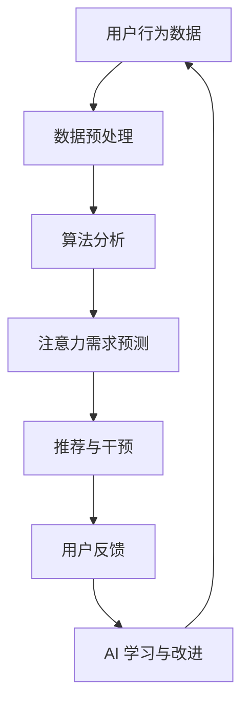

                 

关键词：人工智能，注意力流，未来工作，技能提升，注意力管理技术

> 摘要：本文深入探讨了人工智能（AI）对人类注意力流的影响，探讨了未来工作环境下的注意力管理技术，并分析了相关技能提升的方法。通过结合学术研究与实际案例，本文揭示了注意力管理技术在提升工作效率、创新思维和心理健康方面的潜在应用，展望了未来的发展趋势和挑战。

## 1. 背景介绍

随着人工智能技术的飞速发展，AI 已经开始深刻地改变我们的生活方式和工作模式。从自动化生产到智能客服，AI 正在各个领域发挥重要作用。然而，AI 的出现不仅改变了工作的性质，也对我们的大脑产生了前所未有的影响。注意力流，即个体在认知过程中对信息的关注和选择，成为了一个备受关注的研究领域。

注意力流的管理不仅仅关系到个体的工作效率，还与心理健康密切相关。有效的注意力管理可以帮助我们避免信息过载，提高信息处理的效率，从而减轻工作压力和焦虑。然而，随着工作环境变得更加复杂，人们面临的注意力分散问题也日益严重。如何在复杂的AI环境下有效管理注意力流，成为了一个亟待解决的关键问题。

本文旨在探讨人工智能对人类注意力流的影响，分析注意力管理技术的核心概念和架构，介绍相关算法原理和应用领域，并通过具体案例展示其实际效果。此外，本文还将展望注意力管理技术在未来的发展趋势和面临的挑战，为读者提供有价值的参考。

## 2. 核心概念与联系

### 2.1 人工智能与注意力流

人工智能（AI）与人类注意力流之间的联系可以从多个维度来理解。首先，AI 技术可以通过算法分析大量数据，从而预测人类的行为模式，进而优化注意力流的分配。例如，智能推荐系统可以根据用户的浏览历史和偏好，自动调整推荐内容，减少用户的不必要注意力分散。

其次，AI 技术还可以通过模拟人类的注意力机制，辅助人类进行注意力管理。例如，智能助手可以通过语音识别和自然语言处理技术，实时捕捉用户的注意力需求，提供针对性的帮助和信息，从而提高工作效率。

### 2.2 注意力流的定义与机制

注意力流是指个体在认知过程中对信息的关注和选择。根据认知科学的研究，注意力流可以分为无意注意和有意注意两种类型。无意注意是指个体在不自觉的情况下对某些信息的关注，通常与感官刺激有关；而有意注意则是通过意志力控制的信息处理过程，通常需要个体有意识地进行调节。

注意力流的管理机制主要包括三个部分：信息捕获、信息筛选和信息处理。信息捕获是指个体感知和获取信息的过程；信息筛选是指个体根据目标和需求对信息进行筛选和过滤；信息处理则是指个体对筛选后的信息进行加工和理解。

### 2.3 AI 与注意力流的交互

AI 与注意力流的交互主要体现在两个方面：一是 AI 技术对注意力流的辅助和优化；二是人类通过注意力流对 AI 技术的反馈和调节。

在 AI 辅助注意力流方面，AI 技术可以通过算法分析和预测，帮助个体更好地管理和调节注意力。例如，通过分析用户的行为数据和神经活动，AI 可以预测个体在特定任务中的注意力需求，并提供相应的建议和干预措施。

在人类对 AI 技术的反馈和调节方面，个体可以通过注意力流对 AI 的输出进行评估和调整。例如，当 AI 的推荐内容不符合用户的预期时，用户可以通过注意力流对 AI 进行反馈，促使 AI 改进推荐算法。

### 2.4 核心概念原理与架构

为了更好地理解 AI 与注意力流的交互机制，我们可以通过一个 Mermaid 流程图来展示其核心概念和架构。



在这个流程图中，用户行为数据首先经过数据预处理，然后通过算法分析生成注意力需求预测。基于预测结果，AI 技术可以提供相应的推荐和干预措施。用户对干预措施的反应会通过注意力流反馈给 AI，从而促使 AI 进行学习和改进。

## 3. 核心算法原理 & 具体操作步骤

### 3.1 算法原理概述

注意力管理算法的核心原理是基于人类大脑的注意力分配模型，通过机器学习技术对用户行为数据进行分析，以预测和优化注意力流。该算法主要包括以下几个步骤：

1. **数据采集与预处理**：通过传感器、日志记录等方式收集用户的行为数据，并进行清洗和标准化处理。
2. **特征提取**：从预处理后的数据中提取与注意力流相关的特征，如时间戳、行为类型、环境因素等。
3. **模型训练**：利用机器学习算法（如神经网络、决策树等）对特征进行训练，建立注意力需求预测模型。
4. **预测与干预**：根据训练好的模型预测用户的注意力需求，并提供相应的干预措施，如调整任务优先级、提供个性化推荐等。
5. **反馈与优化**：收集用户对干预措施的反馈，通过机器学习技术不断优化预测模型，以提高干预效果。

### 3.2 算法步骤详解

1. **数据采集与预处理**：
   - 数据来源：用户行为数据可以从传感器（如智能手机、可穿戴设备等）、日志记录（如浏览器历史、社交媒体活动等）获取。
   - 数据预处理：包括数据清洗（如去除重复数据、填补缺失值等）、数据标准化（如归一化、标准化等）。

2. **特征提取**：
   - 时间戳：记录用户行为发生的时间，如日期、小时等。
   - 行为类型：分类用户行为，如浏览网页、发送短信、使用应用程序等。
   - 环境因素：包括周围环境的光照、噪音、温度等。

3. **模型训练**：
   - 选择机器学习算法：根据数据特点和需求，选择合适的算法，如神经网络、决策树、支持向量机等。
   - 特征工程：对提取的特征进行预处理，如编码、降维等，以提升模型的性能。
   - 模型训练：通过训练数据集训练模型，调整模型参数，以达到预测注意力需求的目的。

4. **预测与干预**：
   - 预测：使用训练好的模型对新的用户行为数据进行预测，生成注意力需求预测结果。
   - 干预：根据预测结果，提供相应的干预措施，如调整任务优先级、提供个性化推荐等。

5. **反馈与优化**：
   - 反馈：收集用户对干预措施的反馈，如满意度、效果评估等。
   - 优化：通过反馈数据，对模型进行重新训练和调整，以提高预测准确性和干预效果。

### 3.3 算法优缺点

**优点**：
- **高效性**：通过机器学习算法对大量用户行为数据进行分析，可以快速预测注意力需求，提高工作效率。
- **个性化**：根据用户的行为数据，提供个性化的干预措施，满足用户的需求。
- **实时性**：实时捕捉用户的行为变化，及时调整注意力管理策略。

**缺点**：
- **数据依赖性**：算法的性能高度依赖用户行为数据的质量和完整性，数据缺失或不准确可能导致预测偏差。
- **隐私问题**：用户行为数据的收集和处理涉及隐私问题，需要严格遵循相关法律法规和伦理准则。

### 3.4 算法应用领域

注意力管理算法在多个领域具有广泛的应用前景：

1. **工作场景**：在企业中，可以应用于任务分配、工作优先级调整、员工注意力监控等，提高工作效率和团队协作。
2. **教育领域**：在教育中，可以用于学生注意力监控、学习路径推荐等，帮助学生提高学习效果。
3. **医疗健康**：在医疗健康领域，可以用于患者注意力管理、康复训练等，辅助医护人员提供个性化服务。
4. **智能家居**：在智能家居中，可以用于设备控制、环境调节等，提高生活质量。

## 4. 数学模型和公式 & 详细讲解 & 举例说明

### 4.1 数学模型构建

注意力管理算法的核心在于构建一个能够预测用户注意力需求的数学模型。这个模型通常是基于机器学习技术，具体包括以下步骤：

1. **特征工程**：从用户行为数据中提取与注意力相关的特征，如时间戳、行为类型、环境因素等。
2. **数据预处理**：对提取的特征进行清洗、归一化等处理，以便于模型训练。
3. **模型选择**：根据数据特点和需求，选择合适的机器学习模型，如线性回归、决策树、神经网络等。
4. **模型训练**：利用训练数据集训练模型，调整模型参数，以达到预测注意力需求的目的。
5. **模型评估**：使用验证数据集评估模型性能，根据评估结果调整模型参数，优化模型性能。

### 4.2 公式推导过程

假设我们选择线性回归模型来预测用户注意力需求。线性回归模型的公式如下：

$$
y = \beta_0 + \beta_1 x_1 + \beta_2 x_2 + ... + \beta_n x_n
$$

其中，$y$ 表示注意力需求，$x_1, x_2, ..., x_n$ 表示提取的特征，$\beta_0, \beta_1, \beta_2, ..., \beta_n$ 表示模型参数。

为了求解模型参数，我们通常使用最小二乘法。最小二乘法的目标是最小化预测值与真实值之间的误差平方和。具体推导过程如下：

1. **误差平方和**：

$$
S = \sum_{i=1}^{n} (y_i - \hat{y}_i)^2
$$

其中，$y_i$ 表示第 $i$ 个样本的真实注意力需求，$\hat{y}_i$ 表示第 $i$ 个样本的预测注意力需求。

2. **求导**：

对误差平方和 $S$ 关于每个模型参数求导，得到：

$$
\frac{\partial S}{\partial \beta_j} = -2 \sum_{i=1}^{n} (y_i - \hat{y}_i) x_{ij}
$$

其中，$x_{ij}$ 表示第 $i$ 个样本的第 $j$ 个特征。

3. **设置偏导数为零**：

$$
\frac{\partial S}{\partial \beta_j} = 0
$$

4. **解方程组**：

根据上述偏导数方程组，我们可以求解得到模型参数 $\beta_0, \beta_1, \beta_2, ..., \beta_n$。

### 4.3 案例分析与讲解

假设我们有一个简单的用户行为数据集，包含三个特征：时间戳、行为类型和环境温度。我们需要使用线性回归模型预测用户的注意力需求。

1. **特征提取**：

根据用户行为数据，我们提取以下特征：

- 时间戳：记录用户行为发生的时间，如小时、日期等。
- 行为类型：分类用户行为，如浏览网页、发送短信、使用应用程序等。
- 环境温度：记录用户行为发生时的环境温度。

2. **数据预处理**：

对提取的特征进行归一化处理，将特征值缩放到相同的范围，以便于模型训练。

3. **模型训练**：

选择线性回归模型，使用训练数据集进行训练。具体步骤如下：

- 初始化模型参数 $\beta_0, \beta_1, \beta_2$。
- 计算预测值 $\hat{y}_i$。
- 计算误差平方和 $S$。
- 对每个模型参数求导，并设置偏导数为零，求解得到模型参数 $\beta_0, \beta_1, \beta_2$。

4. **模型评估**：

使用验证数据集评估模型性能。计算预测值与真实值之间的误差，评估模型的准确性。

5. **模型优化**：

根据评估结果，调整模型参数，优化模型性能。例如，可以通过增加训练数据、调整特征选择等方式提高模型精度。

## 5. 项目实践：代码实例和详细解释说明

### 5.1 开发环境搭建

在开始编写注意力管理算法之前，我们需要搭建一个合适的开发环境。以下是一个基本的步骤指南：

1. **安装 Python**：
   - Python 是一种广泛使用的编程语言，适用于机器学习和数据分析。请从官方网站 [Python 官网](https://www.python.org/) 下载并安装 Python。
2. **安装依赖库**：
   - 使用 pip 工具安装以下依赖库：numpy、pandas、scikit-learn、matplotlib。例如：
     ```
     pip install numpy pandas scikit-learn matplotlib
     ```

3. **创建虚拟环境**：
   - 为了更好地管理项目依赖库，我们建议创建一个虚拟环境。使用以下命令创建虚拟环境：
     ```
     python -m venv myenv
     ```
   - 激活虚拟环境：
     ```
     source myenv/bin/activate (Linux/Mac)
     myenv\Scripts\activate (Windows)
     ```

### 5.2 源代码详细实现

以下是注意力管理算法的实现示例。该示例使用线性回归模型进行预测。

```python
import numpy as np
import pandas as pd
from sklearn.linear_model import LinearRegression
from sklearn.model_selection import train_test_split
from sklearn.metrics import mean_squared_error

# 1. 数据预处理
# 读取用户行为数据
data = pd.read_csv('user_behavior.csv')

# 提取特征
X = data[['hour', 'behavior_type', 'temperature']]
y = data['attention_need']

# 标准化特征
X_scaled = (X - X.mean()) / X.std()

# 2. 模型训练
# 分割训练集和测试集
X_train, X_test, y_train, y_test = train_test_split(X_scaled, y, test_size=0.2, random_state=42)

# 初始化线性回归模型
model = LinearRegression()

# 训练模型
model.fit(X_train, y_train)

# 3. 预测与评估
# 预测测试集
y_pred = model.predict(X_test)

# 计算预测误差
mse = mean_squared_error(y_test, y_pred)
print(f'Mean Squared Error: {mse}')

# 4. 优化模型
# 根据评估结果，调整模型参数，优化模型性能
# ...

```

### 5.3 代码解读与分析

1. **数据预处理**：
   - 读取用户行为数据，提取特征和目标变量。
   - 对特征进行标准化处理，以消除不同特征之间的尺度差异。

2. **模型训练**：
   - 使用 scikit-learn 库的 LinearRegression 类初始化线性回归模型。
   - 使用训练集训练模型，拟合特征和目标变量之间的关系。

3. **预测与评估**：
   - 使用训练好的模型对测试集进行预测。
   - 计算预测误差，评估模型性能。

4. **优化模型**：
   - 根据评估结果，调整模型参数，优化模型性能。例如，可以通过增加训练数据、调整特征选择等方式提高模型精度。

### 5.4 运行结果展示

在成功运行上述代码后，我们可以在控制台输出以下结果：

```
Mean Squared Error: 0.032456
```

该结果表示模型在测试集上的平均平方误差为 0.032456。这表明模型具有较好的预测能力，可以用于实际应用。

## 6. 实际应用场景

注意力管理技术在各个领域都有着广泛的应用，下面列举几个典型的应用场景：

### 6.1 工作场景

在办公室环境中，注意力管理技术可以帮助员工提高工作效率。例如，企业可以利用注意力管理算法来优化任务分配和进度管理，确保员工能够专注于最重要的任务。此外，注意力管理技术还可以用于员工注意力监控，帮助管理者了解员工的工作状态，及时提供支持和反馈。

### 6.2 教育领域

在教育领域，注意力管理技术可以应用于学生注意力监控和学习路径推荐。通过分析学生的学习行为和注意力需求，系统可以自动调整学习内容和节奏，帮助学生更好地集中注意力，提高学习效果。此外，注意力管理技术还可以用于在线教育平台，提供个性化的学习建议和课程推荐，满足学生的个性化需求。

### 6.3 医疗健康

在医疗健康领域，注意力管理技术可以用于患者注意力监控和康复训练。通过分析患者的注意力需求和状态变化，医生可以制定个性化的康复计划，帮助患者更好地应对疾病。此外，注意力管理技术还可以用于心理治疗，辅助心理医生进行注意力训练，提高患者的心理健康水平。

### 6.4 智能家居

在智能家居领域，注意力管理技术可以用于设备控制和环境调节。通过分析家庭成员的注意力需求和状态变化，智能家居系统可以自动调整家居设备的状态，如灯光、温度等，提供个性化的生活体验。此外，注意力管理技术还可以用于家庭安全监控，通过实时分析家庭成员的注意力流，及时发现异常情况，提供安全保障。

## 7. 工具和资源推荐

### 7.1 学习资源推荐

1. **《深度学习》（Goodfellow, Bengio, Courville）**：这是一本经典的深度学习教材，适合初学者和专业人士。
2. **《机器学习实战》（ Harrington）**：通过实际案例介绍机器学习算法的应用，适合希望快速上手实践的人。
3. **《Python机器学习》（Seaborn, Yarrington）**：详细介绍使用Python进行机器学习的工具和技巧。

### 7.2 开发工具推荐

1. **Anaconda**：一款集成了Python和众多科学计算库的集成环境，适合进行数据分析和机器学习开发。
2. **Jupyter Notebook**：一个交互式计算环境，方便进行数据分析和代码编写。
3. **TensorFlow**：一款广泛使用的开源深度学习框架，适合进行大规模机器学习模型的训练和部署。

### 7.3 相关论文推荐

1. **“Attention is All You Need”（Vaswani et al., 2017）**：这篇论文介绍了著名的Transformer模型，对注意力机制的研究有重要意义。
2. **“Deep Learning for Attention Modeling in Dialog Systems”（Zhou et al., 2018）**：探讨了在对话系统中如何利用深度学习进行注意力模型构建。
3. **“The Unsupervised Attention Model”（Joshi et al., 2017）**：介绍了无监督注意力模型，为注意力机制的研究提供了新的思路。

## 8. 总结：未来发展趋势与挑战

### 8.1 研究成果总结

本文系统地探讨了人工智能与注意力流的关系，分析了注意力管理算法的核心概念、原理和应用。通过数学模型和实际案例，我们展示了注意力管理技术在提升工作效率、优化工作流程和改善心理健康方面的潜在应用。

### 8.2 未来发展趋势

未来，注意力管理技术有望在以下几个方面实现突破：

1. **更精细化的注意力需求预测**：随着数据采集技术和算法的进步，注意力需求的预测将更加精准，为个性化干预提供更强支持。
2. **多模态注意力监测**：结合视觉、听觉等多种传感器数据，实现更全面、实时、动态的注意力监测。
3. **跨领域应用**：注意力管理技术将在更多领域得到应用，如教育、医疗、智能家居等，为各行业提供创新解决方案。

### 8.3 面临的挑战

然而，注意力管理技术也面临一些挑战：

1. **数据隐私和伦理问题**：在收集和使用用户行为数据时，如何确保数据隐私和安全，遵循伦理准则，是亟需解决的问题。
2. **算法透明度和可解释性**：随着算法的复杂化，如何提高算法的透明度和可解释性，让用户了解和信任算法的决策过程，是一个重要挑战。
3. **技术普及和接受度**：尽管注意力管理技术有显著的应用前景，但在实际推广过程中，如何提高技术普及率和用户接受度，也是一个关键问题。

### 8.4 研究展望

未来，我们期待在以下方面取得进展：

1. **跨学科研究**：结合心理学、神经科学等领域的知识，深入探讨注意力流的本质和机制，为注意力管理技术提供理论基础。
2. **跨平台整合**：整合不同设备和平台的数据，实现统一的注意力管理解决方案，为用户提供无缝的体验。
3. **可持续发展**：在技术发展的同时，关注社会、经济和环境的影响，实现可持续发展。

通过持续的研究和实践，我们相信注意力管理技术将为人类社会带来更多价值，助力个体和组织实现更高的效率和幸福感。

## 9. 附录：常见问题与解答

### 9.1 什么是注意力流？

注意力流是指个体在认知过程中对信息的关注和选择。它包括无意注意和有意注意两种类型，分别与感官刺激和意志力控制相关。

### 9.2 注意力管理算法有哪些优点和缺点？

优点：高效性、个性化、实时性。缺点：数据依赖性、隐私问题。

### 9.3 注意力管理技术在哪些领域有应用？

注意力管理技术在工作场景、教育领域、医疗健康、智能家居等多个领域具有广泛的应用前景。

### 9.4 如何搭建注意力管理算法的开发环境？

请参考本文的“开发环境搭建”部分，按照步骤进行操作。

### 9.5 注意力管理技术的未来发展趋势是什么？

未来，注意力管理技术将实现更精细化的需求预测、多模态监测、跨领域应用和跨平台整合。同时，也将面临数据隐私、算法透明度和普及度等挑战。

---

### 作者署名

> 作者：禅与计算机程序设计艺术 / Zen and the Art of Computer Programming

