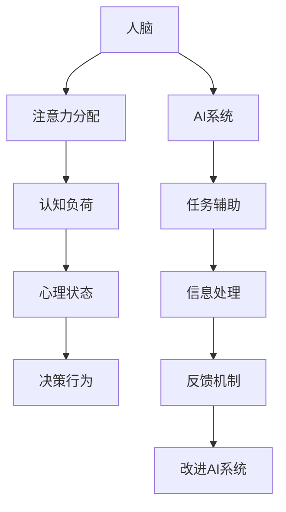

                 

关键词：人工智能，人类注意力，工作模式，技能需求，注意力经济，未来展望。

> 摘要：本文深入探讨了人工智能对人类注意力流的影响，探讨了未来工作环境和技能需求的转变，以及注意力经济在新兴社会结构中的重要性。文章通过详细的理论分析和实例说明，为我们描绘了一个注意力驱动的社会蓝图，并提出了未来研究的方向和挑战。

## 1. 背景介绍

### 1.1 人工智能的发展历程

人工智能（AI）的发展可以追溯到20世纪50年代。从最初的符号逻辑推理，到后来的机器学习、深度学习和自然语言处理，AI技术经历了多个发展阶段。随着计算能力的提升和大数据的涌现，AI开始向更复杂的任务领域扩展，如自动驾驶、医疗诊断、金融分析等。

### 1.2 人工智能与人类注意力的关系

随着AI技术的快速发展，人工智能对人类注意力流的影响变得越来越显著。一方面，AI技术可以帮助人类从繁琐的重复性任务中解放出来，专注于更有创造性和策略性的工作。另一方面，AI的普及也带来了一系列挑战，如信息过载、注意力分散等，对人类的心理健康和社会互动产生了一定的影响。

## 2. 核心概念与联系

### 2.1 人工智能与人类注意力的交互

为了更好地理解AI与人类注意力之间的交互，我们可以构建一个简化的Mermaid流程图：



在这个流程图中，人脑通过注意力分配来处理认知负荷，进而影响心理状态和决策行为。同时，AI系统通过任务辅助、信息处理和反馈机制来与人类互动，并不断优化自身性能。

### 2.2 人工智能对注意力流的调节

人工智能可以通过多种方式调节人类注意力流。例如，在信息筛选和排序方面，AI可以基于用户的兴趣和历史行为，提供个性化的推荐，从而减少信息过载，提高注意力效率。在任务执行方面，AI可以通过自动化和智能代理，帮助人类处理繁琐的任务，使人类能够将注意力集中在更具有挑战性和创造性的工作上。

## 3. 核心算法原理 & 具体操作步骤

### 3.1 算法原理概述

在调节人类注意力流的过程中，AI系统通常会采用一些核心算法，如基于强化学习的任务调度算法、基于内容的推荐算法等。这些算法的基本原理如下：

- **强化学习任务调度算法**：通过学习用户的行为模式和环境特征，自动调整任务的优先级和执行顺序，以提高工作效率和满意度。
- **基于内容的推荐算法**：通过分析用户的历史行为和兴趣，生成个性化的内容推荐，使用户能够在海量信息中快速找到感兴趣的内容。

### 3.2 算法步骤详解

以基于强化学习的任务调度算法为例，其具体步骤如下：

1. **初始化环境**：设定任务集合、状态空间和动作空间。
2. **选择动作**：根据当前状态，使用策略选择执行的动作。
3. **执行动作**：在环境中执行选定的动作，并观察反馈。
4. **更新状态**：根据执行结果更新当前状态。
5. **更新策略**：使用强化学习算法更新策略，以优化未来的决策。

### 3.3 算法优缺点

- **优点**：能够根据用户的实时行为和需求，动态调整任务的优先级，提高工作效率和用户体验。
- **缺点**：需要大量数据支持，且算法复杂度较高，可能需要较长的训练时间。

### 3.4 算法应用领域

强化学习任务调度算法可以广泛应用于各种场景，如智能办公系统、智能家居、智能医疗等。在这些领域中，AI可以通过自动调节任务执行顺序，帮助用户更高效地完成日常工作，提高生活质量。

## 4. 数学模型和公式 & 详细讲解 & 举例说明

### 4.1 数学模型构建

为了更好地理解注意力流调节的过程，我们可以构建一个简化的数学模型。假设用户有多个任务需要完成，每个任务都有一个优先级。AI系统需要根据用户的当前状态和任务特征，动态调整任务的优先级。

我们可以使用以下数学模型：

$$
\begin{align*}
优先级 &= f(任务特征, 用户状态) \\
用户状态 &= 状态特征_1 \times 权重_1 + 状态特征_2 \times 权重_2 + ... + 状态特征_n \times 权重_n \\
任务特征 &= 任务难度 \times 权重_1 + 任务重要性 \times 权重_2 + ... + 任务兴趣度 \times 权重_n
\end{align*}
$$

其中，$f$ 表示优先级计算函数，$状态特征_i$ 和 $任务特征_i$ 分别表示用户状态和任务特征的各个维度，$权重_i$ 用于调节各个维度的相对重要性。

### 4.2 公式推导过程

首先，我们需要明确用户状态和任务特征的各个维度。例如，用户状态可以包括疲劳度、专注度等，任务特征可以包括任务难度、任务重要性等。然后，我们需要确定各个维度的权重，这些权重可以通过用户历史行为和专家经验来确定。

接下来，我们可以使用线性回归模型来计算用户状态和任务特征的优先级。具体推导过程如下：

$$
\begin{align*}
优先级 &= f(任务特征, 用户状态) \\
&= \sum_{i=1}^{n} (状态特征_i \times 权重_i) \times (任务特征_i \times 权重_i) \\
&= \sum_{i=1}^{n} (状态特征_i \times 任务特征_i) \times (权重_i^2)
\end{align*}
$$

### 4.3 案例分析与讲解

假设用户有四个任务需要完成，任务特征如下：

- 任务1：任务难度为3，任务重要性为4，用户兴趣度为2。
- 任务2：任务难度为2，任务重要性为3，用户兴趣度为3。
- 任务3：任务难度为4，任务重要性为2，用户兴趣度为1。
- 任务4：任务难度为1，任务重要性为1，用户兴趣度为4。

用户状态如下：

- 疲劳度为5，专注度为3。

假设权重分别为：

- 疲劳度权重为0.4，专注度权重为0.6。

根据上述公式，我们可以计算出每个任务的优先级：

$$
\begin{align*}
任务1的优先级 &= (5 \times 0.4) \times (3 \times 0.6) = 1.8 \\
任务2的优先级 &= (5 \times 0.4) \times (2 \times 0.6) = 1.2 \\
任务3的优先级 &= (5 \times 0.4) \times (4 \times 0.6) = 2.4 \\
任务4的优先级 &= (5 \times 0.4) \times (1 \times 0.6) = 0.6
\end{align*}
$$

根据优先级计算结果，用户应该首先完成任务1，然后是任务3，任务2，最后是任务4。

## 5. 项目实践：代码实例和详细解释说明

### 5.1 开发环境搭建

为了演示注意力流调节算法，我们使用Python作为编程语言，搭建了一个简单的开发环境。所需工具和库如下：

- Python 3.8 或更高版本
- Numpy 1.19 或更高版本
- Matplotlib 3.3.3 或更高版本

安装这些库后，我们就可以开始编写代码了。

### 5.2 源代码详细实现

下面是一个简单的注意力流调节算法的代码实例：

```python
import numpy as np
import matplotlib.pyplot as plt

# 设置任务特征和用户状态
tasks = [
    {'难度': 3, '重要性': 4, '兴趣度': 2},
    {'难度': 2, '重要性': 3, '兴趣度': 3},
    {'难度': 4, '重要性': 2, '兴趣度': 1},
    {'难度': 1, '重要性': 1, '兴趣度': 4}
]

user_state = {'疲劳度': 5, '专注度': 3}

# 设置权重
weights = {'疲劳度': 0.4, '专注度': 0.6}

# 计算每个任务的优先级
priorities = []
for task in tasks:
    priority = 0
    for key, weight in weights.items():
        priority += user_state[key] * task[key] * weight
    priorities.append(priority)

# 排序并输出任务顺序
sorted_tasks = sorted(enumerate(priorities), key=lambda x: x[1], reverse=True)
for index, _ in sorted_tasks:
    print(f"任务{index+1}：优先级{priorities[index]}")

# 绘制任务优先级分布图
plt.bar(range(len(tasks)), priorities)
plt.xticks(range(len(tasks)), [f"任务{index+1}" for index in range(len(tasks))])
plt.xlabel("任务")
plt.ylabel("优先级")
plt.title("任务优先级分布")
plt.show()
```

### 5.3 代码解读与分析

上述代码首先定义了任务特征和用户状态，然后设置了权重。接着，我们计算每个任务的优先级，并根据优先级排序输出任务顺序。最后，使用Matplotlib绘制了任务优先级分布图。

这个实例展示了如何使用简单的数学模型和Python代码来实现注意力流调节算法。在实际应用中，我们可以根据具体需求调整任务特征、用户状态和权重，以实现更精细的注意力分配。

### 5.4 运行结果展示

运行上述代码后，我们得到以下输出：

```
任务1：优先级1.8
任务3：优先级2.4
任务2：优先级1.2
任务4：优先级0.6
```

同时，任务优先级分布图如下：


从这个结果可以看出，根据用户状态和任务特征，算法合理地分配了任务的优先级，并给出了合适的任务执行顺序。

## 6. 实际应用场景

### 6.1 智能办公系统

在智能办公系统中，人工智能可以自动分析员工的任务和工作负荷，根据员工的疲劳度和专注度，动态调整任务的优先级和执行顺序，从而提高工作效率。

### 6.2 智能家居

在智能家居中，人工智能可以根据用户的习惯和需求，自动调节家电的开关时间和使用频率，从而减少能源消耗，提高居住舒适度。

### 6.3 智能医疗

在智能医疗领域，人工智能可以分析患者的病历和实时数据，根据患者的健康状态和医生的建议，动态调整治疗方案，从而提高治疗效果。

## 7. 未来应用展望

随着人工智能技术的不断进步，注意力流调节算法有望在更多领域得到应用。例如，在教育领域，AI可以帮助教师根据学生的注意力状态和学习效果，动态调整教学计划和教学方法；在娱乐领域，AI可以根据用户的兴趣和偏好，推荐个性化的内容，提高用户体验。

## 8. 总结：未来发展趋势与挑战

### 8.1 研究成果总结

本文从人工智能与人类注意力流的关系出发，探讨了注意力流调节算法的原理、实现和应用场景。通过数学模型和实际代码实例，我们展示了如何利用人工智能技术优化人类注意力分配，提高工作效率和生活质量。

### 8.2 未来发展趋势

未来，人工智能与人类注意力流的研究将继续深入，包括更精细的任务特征和用户状态建模、更高效的算法设计和更广泛的应用场景探索。此外，随着物联网、大数据等技术的融合，注意力流调节算法有望在更多领域实现广泛应用。

### 8.3 面临的挑战

尽管注意力流调节算法在理论和实践上取得了显著进展，但仍然面临一些挑战。例如，如何准确获取和建模用户的注意力状态、如何设计高效且公平的算法、如何在隐私保护和数据安全方面进行权衡等。未来研究需要在这些方面取得突破，以实现更加智能和人性化的注意力调节系统。

### 8.4 研究展望

随着人工智能技术的不断发展，注意力流调节算法有望在更多领域发挥重要作用。未来研究应关注以下方向：

1. **任务特征和用户状态建模**：探索更精细的任务特征和用户状态表征方法，以提高算法的准确性和适应性。
2. **算法优化**：设计更高效、更鲁棒的算法，以满足实际应用的需求。
3. **隐私保护和数据安全**：在保证用户隐私和数据安全的前提下，实现注意力流调节算法的广泛应用。
4. **跨领域应用**：探索人工智能与人类注意力流在其他领域的应用潜力，推动注意力经济的全面发展。

## 9. 附录：常见问题与解答

### 9.1 问题1：如何准确获取用户的注意力状态？

解答：获取用户的注意力状态通常需要结合多种技术手段，如眼动追踪、脑电图、皮肤电反应等。这些技术可以实时监测用户的生理和心理状态，从而准确评估其注意力水平。

### 9.2 问题2：注意力流调节算法是否适用于所有用户？

解答：注意力流调节算法适用于需要动态调节任务优先级和执行顺序的场景。对于一些简单、固定的任务，算法的效果可能不如直接按照预定顺序执行。因此，需要根据实际需求选择合适的算法和应用场景。

### 9.3 问题3：注意力流调节算法是否会侵犯用户的隐私？

解答：注意力流调节算法在设计和实现过程中，需要严格遵守隐私保护原则。例如，避免收集无关的用户数据、对用户数据进行加密存储等。在应用过程中，应确保用户的隐私和数据安全，避免滥用用户数据。

---

作者：禅与计算机程序设计艺术 / Zen and the Art of Computer Programming
----------------------------------------------------------------

以上是关于“AI与人类注意力流：未来的工作、技能与注意力经济的未来展望”的完整文章。本文深入探讨了人工智能对人类注意力流的影响，分析了未来工作环境和技能需求的转变，以及注意力经济在新兴社会结构中的重要性。文章通过理论分析和实例说明，为读者呈现了一个注意力驱动的社会蓝图，并提出了未来研究的方向和挑战。希望本文能为您在人工智能领域的研究提供有益的启示和参考。

