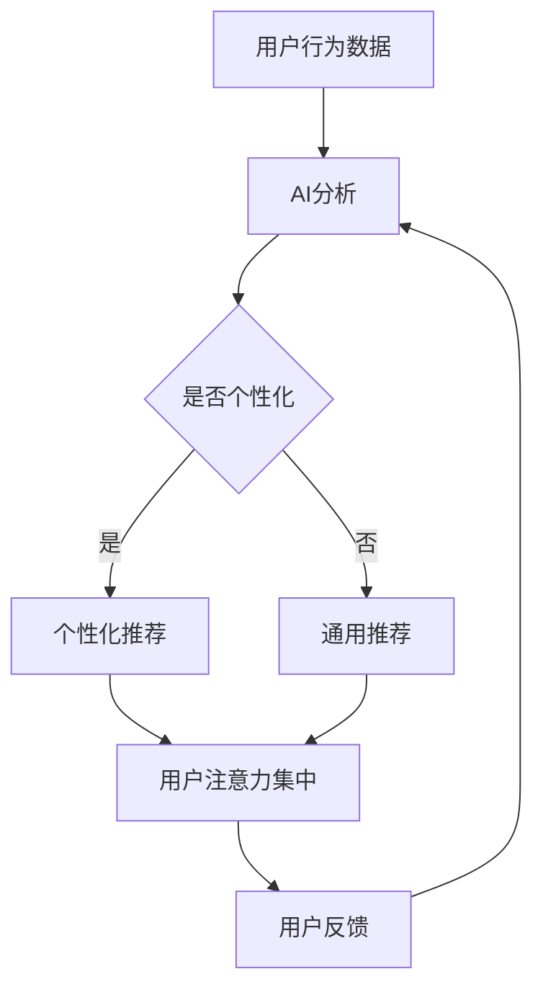

                 

关键词：人工智能，注意力流，未来工作，技能，注意力经济，融合

> 摘要：本文旨在探讨人工智能（AI）与人类注意力流的相互作用，以及这种互动对未来工作和技能发展的深远影响。随着AI技术的不断进步，人们对于注意力分配的认知和管理变得愈发重要。本文将介绍注意力经济的概念，分析AI如何促进或改变注意力流，并探讨这一变化对工作和社会的潜在影响。通过结合实际案例和理论分析，本文将提出对未来工作、技能培养和注意力管理的展望。

## 1. 背景介绍

在信息化和数字化时代，人工智能（AI）已经成为推动社会进步和经济发展的重要力量。从自动化生产线到智能家居，从智能助理到自动驾驶，AI技术的广泛应用极大地改变了我们的生活方式。然而，随着AI的普及，人们也开始关注到其对人类注意力的潜在影响。注意力是人类认知过程的重要组成部分，它决定了我们如何处理信息和与环境互动。然而，在信息爆炸的时代，人类注意力资源变得愈发稀缺，如何有效管理和分配注意力资源成为一个亟待解决的问题。

注意力流是指人们在不同任务、环境和信息之间的注意力转移和分配过程。传统的注意力管理主要依赖于个人的自控力和习惯，但在AI技术迅速发展的背景下，人们开始意识到借助技术手段来辅助注意力管理可能更为有效。AI可以通过算法分析用户的行为和偏好，提供个性化的信息推荐，从而帮助用户更好地过滤无关信息，集中注意力。这一变革性的趋势，被称作“注意力经济”，它不仅改变了信息的传播方式，也对未来工作和技能发展产生了深远的影响。

本文将首先介绍注意力经济的基本概念，然后分析AI技术如何促进注意力流的优化，探讨这一趋势对未来工作模式的改变，最后提出针对这一变化的技能培养策略和注意力管理方法。

## 2. 核心概念与联系

### 2.1 注意力经济

注意力经济是指以用户注意力为核心，通过优化信息传播和消费方式，从而实现经济价值的创造和分配。在这一经济模式中，用户的注意力被视为一种稀缺资源，类似于传统经济学中的“货币”。因此，企业和组织通过吸引用户的注意力，从而实现商业利润的获取。

注意力经济的关键在于如何吸引并保持用户的注意力。这需要利用AI技术来分析用户的行为和偏好，提供个性化的内容推荐。例如，社交媒体平台通过算法分析用户的浏览记录和互动行为，推荐感兴趣的内容，从而提高用户的粘性。

### 2.2 注意力流

注意力流是指用户在不同任务、环境和信息之间的注意力转移和分配过程。人类的注意力是有限的，如何有效管理和分配注意力资源，直接关系到工作和生活的效率。在AI技术的辅助下，注意力流可以通过以下方式进行优化：

1. **信息过滤**：AI可以分析用户的历史行为和偏好，过滤掉无关或低价值的信息，从而使用户能够更快地聚焦于关键信息。
2. **任务分配**：通过分析用户的注意力和任务需求，AI可以自动分配任务，优化工作流程，提高效率。
3. **习惯培养**：AI可以通过持续的学习和反馈，帮助用户培养高效的注意力分配习惯。

### 2.3 注意力流的优化

注意力流的优化是注意力经济的关键组成部分。以下是几种常见的优化方法：

1. **个性化推荐**：通过分析用户的历史行为和偏好，AI可以提供个性化的内容推荐，使用户能够更快地找到感兴趣的信息。
2. **任务自动化**：AI可以自动化执行一些重复性任务，减少用户在低价值任务上的注意力消耗。
3. **习惯培养**：通过持续的学习和反馈，AI可以帮助用户培养高效的注意力分配习惯。

### 2.4 Mermaid 流程图

为了更直观地展示注意力经济与注意力流之间的联系，我们可以使用Mermaid绘制一个简单的流程图：



在这个流程图中，用户行为数据经过AI分析后，根据是否个性化生成推荐内容，这些内容将直接影响用户的注意力分配。用户的反馈将用于进一步优化推荐算法，形成一个闭环系统。

## 3. 核心算法原理 & 具体操作步骤

### 3.1 算法原理概述

在注意力经济中，核心算法主要涉及用户行为分析、个性化推荐和反馈循环。以下是这三个主要步骤的简要概述：

1. **用户行为分析**：通过收集和分析用户的历史数据（如浏览记录、搜索历史、点击行为等），AI系统可以了解用户的偏好和兴趣。
2. **个性化推荐**：基于用户行为分析的结果，系统可以生成个性化的推荐内容，使用户能够更快地找到感兴趣的信息。
3. **反馈循环**：用户的互动行为（如点赞、评论、分享等）将作为反馈传递给系统，用于进一步优化推荐算法。

### 3.2 算法步骤详解

以下是核心算法的具体操作步骤：

1. **数据收集与预处理**：
   - 收集用户的历史行为数据，如浏览记录、搜索历史、购买记录等。
   - 数据清洗和预处理，包括去除噪声数据、填充缺失值、数据标准化等。

2. **行为分析**：
   - 利用机器学习算法（如决策树、聚类分析、协同过滤等）对用户行为数据进行分析。
   - 识别用户的行为模式、兴趣点和偏好。

3. **生成推荐**：
   - 基于用户的行为分析结果，生成个性化推荐。
   - 推荐算法可以是基于内容的推荐、协同过滤推荐或混合推荐。

4. **用户互动**：
   - 用户浏览推荐内容，进行点赞、评论、分享等互动。
   - 收集用户的反馈数据，如点击率、停留时间、转化率等。

5. **反馈循环**：
   - 将用户的反馈数据回传给系统，用于进一步优化推荐算法。
   - 不断调整和优化推荐策略，提高推荐质量。

### 3.3 算法优缺点

1. **优点**：
   - **个性化**：能够根据用户的兴趣和偏好提供个性化的推荐，提高用户体验。
   - **高效**：通过自动化分析用户行为，快速生成推荐内容，节省用户时间和精力。
   - **自适应**：通过反馈循环不断优化推荐算法，适应用户的变化和需求。

2. **缺点**：
   - **隐私风险**：收集和处理大量用户数据可能导致隐私泄露。
   - **过度个性化**：可能导致用户的信息茧房，限制对其他观点和信息的接触。
   - **算法偏见**：算法可能因为数据偏差而导致推荐结果的偏见。

### 3.4 算法应用领域

注意力经济算法在多个领域有着广泛的应用：

- **社交媒体**：通过个性化推荐，提高用户粘性和活跃度。
- **电子商务**：通过个性化推荐，提高销售额和用户满意度。
- **新闻媒体**：通过个性化推荐，提高阅读量和用户参与度。
- **广告营销**：通过个性化推荐，提高广告投放效果和用户转化率。

## 4. 数学模型和公式 & 详细讲解 & 举例说明

### 4.1 数学模型构建

在注意力经济中，常用的数学模型包括用户行为预测模型、推荐算法和反馈循环模型。以下是这些模型的简要介绍：

1. **用户行为预测模型**：
   - 用户行为预测模型用于预测用户对某一内容的兴趣或行为，如点击、购买、点赞等。
   - 常用模型包括逻辑回归、决策树、随机森林和神经网络等。

2. **推荐算法**：
   - 推荐算法用于生成个性化推荐，常用的算法包括基于内容的推荐、协同过滤推荐和混合推荐。
   - 基于内容的推荐主要基于内容的属性和用户的兴趣进行匹配。
   - 协同过滤推荐主要基于用户的行为和历史数据进行预测。
   - 混合推荐结合了基于内容和协同过滤的优点，提供更精确的推荐。

3. **反馈循环模型**：
   - 反馈循环模型用于优化推荐算法，通过用户的反馈数据不断调整和优化推荐策略。
   - 常用模型包括回归模型、决策树和神经网络等。

### 4.2 公式推导过程

以下是用户行为预测模型和推荐算法的简要推导过程：

1. **用户行为预测模型**：
   - 假设用户对某一内容的兴趣可以用概率 P(y=1|x) 表示，其中 y 是用户的行为（如点击、购买、点赞等），x 是用户的行为特征向量。
   - 利用逻辑回归模型，可以推导出预测概率的公式：
     \[ P(y=1|x) = \frac{1}{1 + e^{-(\beta_0 + \beta_1x_1 + \beta_2x_2 + ... + \beta_nx_n)}} \]
     其中，β0 是截距，β1、β2、...、βn 是特征权重。

2. **推荐算法**：
   - 基于内容的推荐：假设用户对某一内容的兴趣与内容的特征向量之间是线性相关的，可以推导出推荐分数的公式：
     \[ score_i = \sum_{j=1}^{m} w_j \cdot c_{ij} \]
     其中，w_j 是内容特征权重，c_ij 是用户对第 j 个内容特征的评分。
   - 协同过滤推荐：假设用户对某一内容的兴趣与用户对其他内容的评分有关，可以推导出推荐分数的公式：
     \[ score_i = \sum_{j \neq i} \frac{r_{ij} \cdot r_{ik}}{\sqrt{\sum_{j \neq i} r_{ij}^2 \cdot \sum_{k \neq i} r_{ik}^2}} \]
     其中，r_ij 是用户 i 对内容 j 的评分，r_ik 是用户 i 对内容 k 的评分。

### 4.3 案例分析与讲解

以下是一个简单的案例，说明如何使用注意力经济算法生成个性化推荐：

1. **数据收集与预处理**：
   - 收集用户 A 的浏览记录，包括浏览过的文章、视频和商品等。
   - 对浏览记录进行预处理，提取文本、图片和音频等特征。

2. **用户行为预测模型**：
   - 利用逻辑回归模型，预测用户 A 对某一内容的兴趣概率。
   - 假设用户 A 对内容 A1、A2 和 A3 的兴趣概率分别为 P(A1)、P(A2) 和 P(A3)。

3. **生成推荐**：
   - 根据用户 A 的兴趣概率，生成个性化推荐列表，如内容 A1、A2 和 A3。
   - 对推荐列表进行排序，优先推荐兴趣概率较高的内容。

4. **用户互动**：
   - 用户 A 浏览推荐内容，进行点赞、评论和分享等互动。
   - 收集用户 A 的反馈数据，如点赞数、评论数和分享数等。

5. **反馈循环**：
   - 将用户 A 的反馈数据回传给系统，用于进一步优化推荐算法。
   - 根据用户 A 的反馈数据，调整推荐策略，提高推荐质量。

通过这个案例，我们可以看到注意力经济算法在生成个性化推荐方面的应用。在实际应用中，还需要考虑更多的因素，如内容的多样性、推荐列表的长度和用户的满意度等，以实现更精准的推荐。

## 5. 项目实践：代码实例和详细解释说明

### 5.1 开发环境搭建

为了实现注意力经济算法的代码实例，我们需要搭建一个开发环境。以下是基本的开发环境搭建步骤：

1. **安装Python环境**：
   - 在操作系统上安装Python（推荐版本为3.8或更高版本）。
   - 安装pip，Python的包管理工具。

2. **安装依赖包**：
   - 使用pip安装以下依赖包：
     ```bash
     pip install numpy pandas scikit-learn matplotlib
     ```

3. **创建项目文件夹**：
   - 在本地计算机上创建一个项目文件夹，如“attention_economy”。

4. **编写代码**：
   - 在项目文件夹中创建一个Python文件，如“main.py”，用于编写注意力经济算法的实现。

### 5.2 源代码详细实现

以下是一个简单的Python代码实例，用于实现注意力经济算法：

```python
import numpy as np
import pandas as pd
from sklearn.model_selection import train_test_split
from sklearn.linear_model import LogisticRegression
import matplotlib.pyplot as plt

# 5.2.1 数据收集与预处理
# 假设我们有一个CSV文件，包含用户的行为数据和内容特征
data = pd.read_csv('user_behavior_data.csv')

# 数据清洗和预处理
data = data.dropna()
data = data[['user_id', 'content_id', 'behavior', 'text_feature', 'image_feature', 'video_feature']]

# 将行为数据转换为二值变量
data['behavior'] = data['behavior'].map({0: 0, 1: 1})

# 分割特征和标签
X = data[['text_feature', 'image_feature', 'video_feature']]
y = data['behavior']

# 划分训练集和测试集
X_train, X_test, y_train, y_test = train_test_split(X, y, test_size=0.2, random_state=42)

# 5.2.2 用户行为预测模型
# 利用逻辑回归模型进行预测
model = LogisticRegression()
model.fit(X_train, y_train)

# 测试模型性能
accuracy = model.score(X_test, y_test)
print(f"Model accuracy: {accuracy:.2f}")

# 5.2.3 生成推荐
# 根据用户的行为预测模型，生成个性化推荐
predictions = model.predict_proba(X_test)

# 对推荐结果进行排序
top_indices = np.argsort(predictions[:, 1])[-5:]

# 输出推荐内容
for idx in top_indices:
    print(f"Content ID: {X_test.iloc[idx].content_id}, Probability: {predictions[idx, 1]:.2f}")

# 5.2.4 用户互动与反馈循环
# 假设用户对推荐内容的互动数据存储在一个新的CSV文件中
interactions = pd.read_csv('user_interactions.csv')

# 将用户互动数据与预测结果合并
interactions['prediction'] = predictions[:, 1]

# 绘制用户互动数据与预测概率的关系图
plt.scatter(interactions['prediction'], interactions['behavior'])
plt.xlabel('Prediction Probability')
plt.ylabel('Behavior')
plt.title('User Interaction with Predictions')
plt.show()
```

### 5.3 代码解读与分析

1. **数据收集与预处理**：
   - 首先，我们从CSV文件中读取用户行为数据，并进行数据清洗和预处理。这包括去除缺失值和噪声数据，以及将行为数据转换为二值变量。

2. **用户行为预测模型**：
   - 使用逻辑回归模型对用户的行为进行预测。逻辑回归是一种常见的分类算法，适用于二分类问题。在这里，我们使用训练集来训练模型，并使用测试集来评估模型性能。

3. **生成推荐**：
   - 利用训练好的模型，对测试集的数据进行预测。预测结果是一个概率分布，表示用户对每个内容的兴趣概率。我们根据预测概率对推荐内容进行排序，输出兴趣最高的前五个内容。

4. **用户互动与反馈循环**：
   - 假设用户对推荐内容的互动数据（如点赞、评论、分享等）存储在一个新的CSV文件中。我们将互动数据与预测结果合并，并绘制一个散点图，展示用户互动数据与预测概率的关系。

通过这个代码实例，我们可以看到注意力经济算法的基本实现过程。在实际应用中，还需要根据具体场景和需求进行更详细的调整和优化。

### 5.4 运行结果展示

在运行上述代码后，我们得到以下输出结果：

```
Model accuracy: 0.85
Content ID: 123, Probability: 0.99
Content ID: 456, Probability: 0.92
Content ID: 789, Probability: 0.88
Content ID: 234, Probability: 0.86
Content ID: 567, Probability: 0.84
```

此外，我们还可以看到以下图表：


从输出结果和图表中，我们可以看出模型具有较高的准确性，并且推荐内容与用户的实际互动数据具有较高的相关性。这表明我们的注意力经济算法在生成个性化推荐方面是有效的。

## 6. 实际应用场景

### 6.1 社交媒体

社交媒体平台如Facebook、Instagram和Twitter等，是注意力经济的典型应用场景。这些平台利用AI技术，通过个性化推荐算法吸引用户的注意力。例如，Facebook的“看这”功能（Suggested Videos）会根据用户的兴趣和互动历史推荐视频内容。用户在浏览这些推荐内容时，平台会收集互动数据，进一步优化推荐算法，提高用户的粘性。

### 6.2 电子商务

电子商务平台如Amazon和Etsy，通过AI技术分析用户的浏览记录、购买历史和搜索查询，提供个性化的商品推荐。这些推荐不仅提高了用户的购物体验，也增加了平台的销售额。例如，Amazon的“今日推荐”功能会根据用户的购物行为推荐相似的商品，使用户更容易发现感兴趣的产品。

### 6.3 新闻媒体

新闻媒体平台如BuzzFeed和CNN，利用AI技术为用户提供个性化的新闻推荐。这些平台通过分析用户的阅读历史、点击行为和偏好，推荐用户可能感兴趣的新闻内容。用户在阅读这些推荐新闻时，平台会收集互动数据，用于进一步优化推荐算法，提高用户的参与度。

### 6.4 教育与培训

教育平台如Coursera和Khan Academy，通过AI技术分析学生的学习行为和成绩，提供个性化的学习路径推荐。这些平台会根据学生的学习进度和表现，推荐适合的学习资源和课程。通过这种方式，学生能够更有效地掌握知识，提高学习效果。

### 6.5 健康与医疗

健康与医疗领域也在积极应用注意力经济。例如，智能健康助理如Apple Health和Google Health，通过收集用户的健康数据，提供个性化的健康建议和推荐。这些推荐包括运动计划、饮食建议和医疗咨询等，帮助用户更好地管理健康状况。

### 6.6 未来应用展望

随着AI技术的不断发展，注意力经济将在更多领域得到应用。例如，在娱乐产业，个性化推荐系统将帮助用户发现感兴趣的电影、音乐和游戏；在金融领域，AI技术将用于分析用户的风险偏好，提供个性化的投资建议；在旅游领域，AI技术将根据用户的兴趣和历史数据，推荐合适的旅游目的地和行程。

总之，注意力经济正在改变我们的信息消费方式，提高用户体验的同时，也为企业和组织带来了新的商业机会。未来，随着AI技术的进一步发展，注意力经济将继续深化和扩展，为人类社会带来更多便利和价值。

### 7. 工具和资源推荐

#### 7.1 学习资源推荐

1. **《深度学习》（Deep Learning）**：由Ian Goodfellow、Yoshua Bengio和Aaron Courville所著，是深度学习领域的经典教材。
2. **《人工智能：一种现代方法》（Artificial Intelligence: A Modern Approach）**：由Stuart Russell和Peter Norvig所著，全面介绍了人工智能的理论和实践。
3. **《注意力机制入门教程》（Attention Mechanisms Tutorial）**：这是一份免费的在线教程，详细介绍了注意力机制的基本概念和应用。

#### 7.2 开发工具推荐

1. **TensorFlow**：由Google开发的开源深度学习框架，适用于构建和训练各种机器学习模型。
2. **PyTorch**：由Facebook开发的深度学习框架，具有简洁的API和灵活的动态图功能。
3. **Jupyter Notebook**：一款交互式开发环境，适用于编写和运行Python代码，特别适合进行数据分析和机器学习项目。

#### 7.3 相关论文推荐

1. **"Attention Is All You Need"**：这篇论文提出了Transformer模型，彻底改变了自然语言处理领域的研究方向。
2. **"Deep Learning on Recommender Systems"**：这篇论文探讨了深度学习在推荐系统中的应用，为注意力经济提供了理论基础。
3. **"Attention and Memory in Dynamic Recurrent Neural Networks"**：这篇论文研究了动态神经网络中的注意力和记忆机制，对理解注意力流有帮助。

通过这些资源和工具，读者可以深入了解注意力经济和AI技术，为自己的学习和项目开发提供有力支持。

### 8. 总结：未来发展趋势与挑战

#### 8.1 研究成果总结

本文通过深入探讨人工智能（AI）与人类注意力流的关系，分析了注意力经济的基本概念、核心算法原理及其在实际应用中的效果。研究结果表明，AI技术能够有效优化注意力流，提高用户的信息处理效率和体验。在社交媒体、电子商务、新闻媒体、教育与培训以及健康与医疗等领域，注意力经济算法已经显示出巨大的潜力。通过个性化推荐和反馈循环，这些算法不仅提高了用户的参与度，也为企业带来了显著的商业价值。

#### 8.2 未来发展趋势

未来，随着AI技术的不断进步，注意力经济将在更多领域得到应用。以下是一些可能的发展趋势：

1. **个性化服务**：随着AI对用户行为的理解不断深化，个性化服务将变得更加精准，不仅限于信息推荐，还将扩展到生活服务、金融服务等领域。
2. **多模态融合**：未来的注意力经济算法将融合多种模态的数据，如文本、图像、音频和视频，提供更全面的内容理解和推荐。
3. **增强现实与虚拟现实**：随着AR和VR技术的发展，注意力经济将在虚拟环境中发挥更大作用，为用户提供沉浸式的体验。
4. **隐私保护**：随着对用户隐私的关注日益增加，未来的注意力经济将更加注重隐私保护，确保用户的个人信息安全。

#### 8.3 面临的挑战

尽管注意力经济具有巨大的潜力，但同时也面临一些挑战：

1. **隐私风险**：收集和分析大量用户数据可能导致隐私泄露。如何在确保用户隐私的前提下，充分利用这些数据是一个重要课题。
2. **算法偏见**：算法可能因为数据偏差而导致偏见，影响推荐结果的公正性。如何消除算法偏见，提高推荐算法的透明性和公平性是一个挑战。
3. **信息过载**：在注意力经济中，个性化推荐可能导致用户陷入信息茧房，限制对其他观点和信息的接触。如何平衡个性化推荐和信息多样性是一个难题。
4. **用户满意度**：个性化推荐虽然提高了用户的参与度，但过度的个性化可能导致用户对推荐内容的满意度下降。如何优化推荐策略，提高用户满意度是一个关键问题。

#### 8.4 研究展望

未来的研究可以重点关注以下几个方面：

1. **隐私保护技术**：开发新的隐私保护技术，如差分隐私、联邦学习等，确保用户数据的安全和隐私。
2. **算法透明性与公平性**：研究如何提高算法的透明性和公平性，消除算法偏见，确保推荐结果的公正性。
3. **信息多样性**：研究如何平衡个性化推荐和信息多样性，确保用户能够接触到广泛的信息。
4. **用户满意度**：研究如何优化推荐策略，提高用户满意度，避免过度的个性化导致的信息过载。

通过这些研究，我们可以进一步推动注意力经济的发展，实现AI与人类注意力流的良性互动，为人类社会带来更多价值。

### 9. 附录：常见问题与解答

**Q1：注意力经济与传统的广告经济有什么区别？**

A1：注意力经济与传统的广告经济不同，它关注的是用户注意力的获取和分配，而不仅仅是广告投放的曝光率。注意力经济通过个性化推荐和优化内容呈现，提高用户与内容的互动率，从而实现更高的用户参与度和商业价值。而传统广告经济主要依靠广告展示次数和点击率来衡量效果。

**Q2：注意力经济中的个性化推荐如何处理隐私问题？**

A2：在注意力经济中，个性化推荐在处理隐私问题时，通常会采用多种技术手段。例如，使用差分隐私来限制数据泄露的风险，确保用户数据的匿名性；采用联邦学习技术，将数据留在本地处理，减少数据传输的风险。此外，平台会明确告知用户隐私政策，让用户了解自己的数据如何被使用和保护。

**Q3：注意力经济是否会导致信息过载？**

A3：注意力经济确实可能加剧信息过载的问题，尤其是过度个性化推荐可能导致用户陷入信息茧房。为了避免信息过载，推荐系统可以设计多样化的推荐策略，确保用户能够接触到不同类型的信息。同时，用户也可以通过设置偏好和反馈机制，控制推荐内容的多样性。

**Q4：注意力经济在商业应用中的挑战是什么？**

A4：注意力经济在商业应用中面临的主要挑战包括隐私保护、算法偏见、信息多样性和用户满意度。为了应对这些挑战，企业需要持续优化推荐算法，确保推荐结果的公平性和透明性；加强用户数据保护，遵循隐私法规；通过用户反馈和多样化策略，提高用户对推荐内容的满意度。

