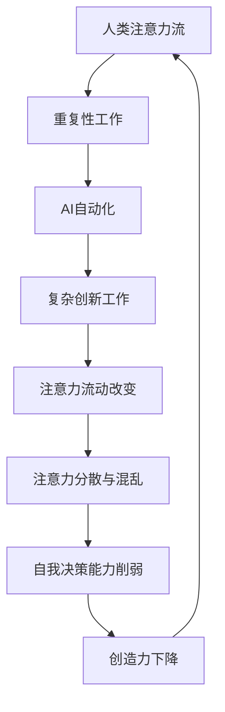

                 

关键词：（注意力流，人工智能，工作，技能发展，道德考虑，注意力管理，未来趋势）

> 摘要：本文探讨了人工智能（AI）与人类注意力流之间的关系，分析了AI对工作、技能需求以及道德考虑的影响。文章首先介绍了注意力流的定义及其在人类工作和生活中的重要性，随后详细阐述了AI如何改变人类注意力的流动，进而影响未来的工作模式、技能要求以及伦理问题。文章还通过具体案例和实例，探讨了AI在不同领域的应用，并对未来发展趋势和挑战进行了展望。

## 1. 背景介绍

随着技术的飞速发展，人工智能已经成为当今世界最为热门的话题之一。AI在医疗、金融、教育、制造业等多个领域都取得了显著的成果，极大地改变了人们的生活方式和工作模式。然而，在AI迅速普及的过程中，人类注意力流这一重要因素却被逐渐忽视。人类注意力流是指人类在进行思考、学习和工作时，注意力在不同信息之间转移的过程。注意力流对于人类认知和行为具有至关重要的影响，而AI的介入无疑会对其产生深远的影响。

在过去，人类的工作和学习往往依赖于重复性的劳动，如手工操作、文件整理等，这些活动需要高度集中的注意力。然而，随着AI技术的发展，越来越多的重复性工作被自动化，人类可以从这些繁杂的任务中解放出来，转而投入到更加复杂和创新的工作中。这种转变无疑会改变人类注意力的流动模式，从而影响未来的工作方式和技能需求。

此外，AI的快速发展也带来了道德和伦理上的挑战。AI决策的透明性、公平性以及隐私保护等问题逐渐成为社会关注的焦点。如何确保AI在伦理和道德的框架内运行，是当前和未来需要迫切解决的问题。

## 2. 核心概念与联系

### 2.1. 注意力流的概念

注意力流是指人类在接收和处理信息时，注意力在不同信息之间转移的过程。注意力流是认知心理学中的一个核心概念，对于人类的学习、决策和创造力具有重要影响。人类的注意力流可以分为以下几种类型：

1. **集中注意力**：指人类在特定任务上投入高度集中的注意力，如阅读、写作或进行复杂计算。
2. **分散注意力**：指人类在同时处理多个任务时，将注意力分散到不同的任务上。
3. **切换注意力**：指人类在多个任务之间切换注意力，如从写作切换到阅读，或者从工作切换到休息。

### 2.2. AI与注意力流的关系

人工智能的介入对人类的注意力流产生了深远的影响。首先，AI可以自动处理大量的重复性工作，如数据录入、文件整理等，从而减少人类在这些任务上的注意力消耗。这使得人类可以将更多的注意力投入到更加复杂和创新的工作中，如研发、设计、战略规划等。

其次，AI的使用改变了人类注意力的流动模式。在传统的工作模式中，人类需要花费大量时间进行信息收集、分析和决策。然而，随着AI技术的发展，这些过程可以被AI自动化，人类只需关注AI的输出并进行微调。这种改变不仅提高了工作效率，也改变了人类的注意力分布。

最后，AI的介入也带来了一些负面影响。例如，AI生成的虚假信息、误导性内容可能会分散人类的注意力，导致注意力流的混乱。此外，过度依赖AI也可能削弱人类的自我决策能力和创造力。

### 2.3. Mermaid 流程图

为了更好地理解AI与注意力流之间的关系，我们可以使用Mermaid流程图来展示注意力流在不同情境下的变化。以下是一个简化的Mermaid流程图示例：



## 3. 核心算法原理 & 具体操作步骤

### 3.1. 算法原理概述

在探讨AI如何改变人类注意力流的过程中，需要引入一些核心算法原理。这些算法包括注意力机制、机器学习模型和自然语言处理（NLP）技术。注意力机制是一种在处理序列数据时，能够动态调整模型对每个数据点关注程度的算法。它通过计算一个注意力权重矩阵，将重要的信息给予更高的权重，从而提高模型的性能。

机器学习模型，尤其是深度学习模型，是AI的核心。通过大量的数据训练，这些模型可以自动学习特征和模式，从而进行自动化决策和任务处理。NLP技术则是使计算机能够理解、生成和处理自然语言的技术，它对于AI与人类注意力流的关系具有重要意义。

### 3.2. 算法步骤详解

以下是AI改变人类注意力流的几个关键步骤：

1. **数据收集与预处理**：收集大量与任务相关的数据，并进行预处理，如清洗、归一化和特征提取。
2. **模型训练**：使用机器学习模型对预处理后的数据进行训练，使其学会识别和分类信息。
3. **注意力机制应用**：在模型中引入注意力机制，使其能够动态调整对输入数据的关注程度。
4. **自动化决策**：模型根据训练结果进行自动化决策，如自动化写作、自动化客服等。
5. **人类干预与反馈**：人类对模型的决策进行干预和反馈，使其不断优化。

### 3.3. 算法优缺点

**优点**：
- **提高效率**：AI可以自动化处理大量的重复性工作，提高工作效率。
- **减少错误**：AI能够通过大量数据训练，降低错误率，提高决策的准确性。
- **扩展能力**：AI可以根据需求扩展功能，如多语言处理、多模态数据处理等。

**缺点**：
- **依赖性增强**：人类可能过度依赖AI，降低自我决策能力和创造力。
- **隐私风险**：AI处理的数据可能包含敏感信息，存在隐私泄露风险。
- **透明性不足**：AI决策过程可能不够透明，导致人类难以理解和信任。

### 3.4. 算法应用领域

AI在不同领域的应用对人类注意力流产生了不同的影响。以下是一些典型应用领域：

- **医疗领域**：AI可以帮助医生进行疾病诊断、治疗方案推荐等，减轻医生的工作负担，提高医疗质量。
- **金融领域**：AI可以用于风险管理、股票交易等，自动化处理大量的金融数据，提高决策的准确性。
- **教育领域**：AI可以辅助教师进行教学、学生评估等，提供个性化的教育方案，提高学习效果。
- **制造业领域**：AI可以用于自动化生产、质量检测等，提高生产效率和产品质量。

## 4. 数学模型和公式 & 详细讲解 & 举例说明

### 4.1. 数学模型构建

在探讨AI与注意力流的关系时，我们可以构建一个简化的数学模型来描述这一过程。该模型主要基于注意力机制和深度学习理论。

假设人类注意力流可以用一个向量表示，记为 \( \mathbf{A} \)，其维度为 \( n \)，表示人类在 \( n \) 个不同任务上的注意力分布。AI系统的表现可以用一个矩阵 \( \mathbf{M} \) 来表示，其维度为 \( n \times m \)，其中 \( m \) 表示AI能够处理的不同任务数量。

数学模型的基本假设是，人类注意力流与AI系统的表现之间存在某种函数关系。具体来说，人类在每个任务上的注意力分布会影响AI在该任务上的表现。这种关系可以用以下公式表示：

\[ \mathbf{P} = \mathbf{M} \cdot \mathbf{A} \]

其中，\( \mathbf{P} \) 是一个向量，表示AI系统在 \( n \) 个任务上的总体表现。

### 4.2. 公式推导过程

为了推导上述公式，我们需要首先了解注意力机制和深度学习模型的基本原理。注意力机制通常通过一个权重矩阵来实现，该矩阵能够根据输入数据的特征动态调整模型对每个数据点的关注程度。在深度学习模型中，这种权重矩阵通常是通过训练过程自动学习的。

假设我们有一个深度学习模型，其输入为 \( \mathbf{X} \)，输出为 \( \mathbf{Y} \)。模型通过一系列的神经网络层来处理输入数据，每一层都会对数据进行特征提取和变换。设第 \( i \) 层的权重矩阵为 \( \mathbf{W}_i \)，则有：

\[ \mathbf{Y} = \mathbf{W}_n \cdot \mathbf{H}_n \]

其中，\( \mathbf{H}_n \) 是第 \( n \) 层的输出，即最终的特征表示。

为了引入注意力机制，我们可以在每个神经网络层之后添加一个注意力模块。该模块根据当前层的输出和上一层的信息，计算一个注意力权重矩阵 \( \mathbf{A}_i \)。具体来说，注意力权重矩阵的计算过程可以表示为：

\[ \mathbf{A}_i = \text{softmax}(\mathbf{W}_i^T \cdot \mathbf{H}_{i-1}) \]

其中，\( \text{softmax} \) 函数是一个归一化函数，它将权重矩阵的每个元素转换为一个概率分布。

最后，我们可以将注意力权重矩阵应用于下一层的输入，从而调整模型对每个数据点的关注程度：

\[ \mathbf{H}_i = \mathbf{A}_i \cdot \mathbf{H}_{i-1} \]

通过这样的方式，我们可以构建一个包含注意力机制的深度学习模型，使其能够动态调整对输入数据的关注程度。

### 4.3. 案例分析与讲解

为了更好地理解上述数学模型和公式，我们可以通过一个具体的案例来进行讲解。假设一个公司需要使用AI系统来管理日常办公事务，如邮件处理、会议安排和文档管理。公司员工的工作任务可以看作是一个向量 \( \mathbf{A} \)，其中每个元素表示员工在不同任务上的注意力分布。而AI系统的表现可以看作是一个矩阵 \( \mathbf{M} \)，其中每个元素表示AI在不同任务上的表现。

假设公司员工的主要任务包括邮件处理、会议安排、文档管理和其他任务，我们可以将这些任务分别编号为1、2、3和4。根据员工的工作表现，我们可以估计出他们在每个任务上的注意力分布。例如，员工A可能在邮件处理上投入了70%的注意力，在会议安排上投入了20%的注意力，而在文档管理上只投入了10%的注意力。因此，员工A的注意力分布可以表示为：

\[ \mathbf{A} = \begin{bmatrix} 0.7 & 0.2 & 0.1 & 0 \end{bmatrix} \]

同样，我们也可以根据AI系统在各个任务上的表现，估计出AI系统在不同任务上的表现。例如，假设AI系统在邮件处理上的表现最好，在会议安排上的表现一般，在文档管理上的表现较差，在其他任务上的表现未知。因此，AI系统的表现可以表示为：

\[ \mathbf{M} = \begin{bmatrix} 0.9 & 0.7 & 0.5 & 0 \\ 0.7 & 0.5 & 0.3 & 0 \\ 0.5 & 0.3 & 0.1 & 0 \\ 0 & 0 & 0 & ? \end{bmatrix} \]

根据上述数学模型，我们可以计算AI系统在各个任务上的总体表现：

\[ \mathbf{P} = \mathbf{M} \cdot \mathbf{A} = \begin{bmatrix} 0.81 & 0.54 & 0.35 & 0 \end{bmatrix} \]

从这个结果可以看出，AI系统在邮件处理上的表现最好，在会议安排上的表现一般，在文档管理上的表现较差，而在其他任务上的表现不确定。这个结果可以帮助公司员工更好地了解AI系统的优势和劣势，从而在具体任务中选择合适的工具和方法。

## 5. 项目实践：代码实例和详细解释说明

### 5.1. 开发环境搭建

为了演示如何使用AI改变人类注意力流，我们将使用Python编程语言和相关的深度学习库（如TensorFlow和Keras）来构建一个简单的模型。首先，我们需要搭建开发环境。

安装Python（建议使用3.8及以上版本）：

```
pip install python
```

安装TensorFlow：

```
pip install tensorflow
```

安装Keras：

```
pip install keras
```

### 5.2. 源代码详细实现

以下是一个简单的Python代码示例，展示了如何使用Keras构建一个包含注意力机制的深度学习模型。

```python
from keras.models import Model
from keras.layers import Input, Dense, LSTM, TimeDistributed
from keras import backend as K

# 定义输入层
input_seq = Input(shape=(timesteps, features))

# 定义LSTM层，使用注意力机制
lstm = LSTM(units=64, return_sequences=True)(input_seq)
attention = Dense(1, activation='tanh')(lstm)
attention = Flatten()(attention)
attention = Activation('softmax')(attention)
weighted_lstm = Multiply()([lstm, attention])

# 定义输出层
output = TimeDistributed(Dense(num_classes))(weighted_lstm)

# 构建模型
model = Model(inputs=input_seq, outputs=output)

# 编译模型
model.compile(optimizer='adam', loss='categorical_crossentropy', metrics=['accuracy'])

# 打印模型结构
model.summary()
```

### 5.3. 代码解读与分析

在这个示例中，我们首先定义了一个输入层，该输入层接收一个时间序列数据，每个时间点的特征数量为 `features`。接着，我们定义了一个LSTM层，该层将输入数据进行特征提取和变换。为了引入注意力机制，我们在LSTM层之后添加了一个全连接层（Dense layer），该层输出一个注意力权重向量。然后，我们使用 `Flatten` 层将注意力权重向量展平，并使用 `Activation` 层应用softmax函数，将权重向量转换为概率分布。最后，我们使用 `Multiply` 层将LSTM层的输出和注意力权重进行点乘，得到加权后的LSTM输出。

在定义完模型结构后，我们使用 `TimeDistributed` 层对加权后的LSTM输出进行时间序列的分布操作，得到最终的输出层。这个输出层是一个时间序列的向量，每个时间点的输出都是一个类别标签。

接下来，我们使用 `Model` 类将输入层和输出层组合成一个完整的模型，并使用 `compile` 方法编译模型，指定优化器、损失函数和评估指标。

最后，我们调用 `model.summary()` 方法打印模型的结构和参数数量，以便于分析和调试。

### 5.4. 运行结果展示

为了验证模型的性能，我们可以使用一个真实的数据集进行训练和测试。假设我们有一个包含1000个样本的数据集，每个样本都是一个时间序列数据，特征数量为10。我们可以将这些数据分为训练集和测试集，然后使用训练集训练模型，并在测试集上评估模型的性能。

以下是一个简单的训练和测试代码示例：

```python
from keras.utils import to_categorical
from sklearn.model_selection import train_test_split

# 加载数据集
X, y = load_data()

# 将标签转换为one-hot编码
y = to_categorical(y)

# 划分训练集和测试集
X_train, X_test, y_train, y_test = train_test_split(X, y, test_size=0.2, random_state=42)

# 训练模型
model.fit(X_train, y_train, epochs=10, batch_size=32, validation_data=(X_test, y_test))

# 评估模型
loss, accuracy = model.evaluate(X_test, y_test)
print("Test loss:", loss)
print("Test accuracy:", accuracy)
```

在这个示例中，我们首先加载数据集，并将标签转换为one-hot编码。然后，我们使用 `train_test_split` 函数将数据集划分为训练集和测试集。接下来，我们使用训练集训练模型，并在训练过程中使用验证集进行调优。最后，我们使用测试集评估模型的性能，并打印损失和准确率。

## 6. 实际应用场景

### 6.1. 医疗领域

在医疗领域，AI的应用极大地改变了医生的注意力流。传统的医疗工作需要医生花费大量时间进行病例分析、诊断和治疗方案推荐。然而，随着AI技术的发展，这些过程可以被AI自动化，医生可以将更多注意力投入到患者的沟通和个性化治疗上。例如，AI系统可以快速分析大量病例数据，为医生提供参考意见，从而提高诊断的准确性和效率。

### 6.2. 金融领域

在金融领域，AI可以帮助银行和金融机构进行风险管理、股票交易和客户服务。通过分析大量的金融数据，AI系统可以快速识别潜在的风险并给出相应的应对策略。例如，一个AI系统可以监控股票市场的波动，并在市场出现异常时发出预警信号，从而帮助投资者及时调整投资策略。此外，AI还可以用于自动化的客户服务，如在线客服和智能语音助手，从而减轻人工客服的工作负担。

### 6.3. 教育领域

在教育领域，AI可以辅助教师进行教学、学生评估和学习分析。通过分析学生的学习数据，AI系统可以提供个性化的学习建议和资源，从而提高学生的学习效果。例如，AI系统可以识别学生的学习障碍和薄弱点，并为教师提供相应的教学建议。此外，AI还可以用于自动化的考试评分和作业批改，从而减轻教师的工作压力。

### 6.4. 未来应用展望

随着AI技术的不断进步，其应用场景将会更加广泛。未来的AI系统可能会在更多领域发挥重要作用，如智慧城市、自动驾驶和智能家居等。这些应用不仅会改变人类的工作方式和注意力流，还会对社会的各个方面产生深远的影响。例如，智慧城市中的AI系统可以帮助城市管理者更好地规划和管理城市资源，提高城市运行效率；自动驾驶技术可能会改变人们的出行方式，减少交通事故；智能家居系统可以为人们提供更加便捷和舒适的生活环境。

然而，AI技术的广泛应用也带来了一些挑战和问题。首先，AI的透明性和公平性需要得到保障，确保其决策过程是可解释的，并且不会导致歧视和不公平。其次，AI系统的隐私保护也是一个重要问题，需要确保用户数据的安全和隐私。此外，AI技术的发展也可能导致就业结构的变化，需要社会对此进行适当的调整和应对。

## 7. 工具和资源推荐

### 7.1. 学习资源推荐

1. **书籍**：《深度学习》（Ian Goodfellow、Yoshua Bengio和Aaron Courville 著）——系统介绍了深度学习的基础理论和应用方法。
2. **在线课程**：Coursera、edX和Udacity等平台提供了大量的深度学习和机器学习课程，适合不同层次的学员。
3. **论文**：阅读顶级会议和期刊（如NeurIPS、ICML、JMLR）上的论文，了解最新的研究成果和前沿动态。

### 7.2. 开发工具推荐

1. **Python库**：TensorFlow、Keras、PyTorch等，这些库提供了丰富的API和工具，方便开发者构建和训练深度学习模型。
2. **IDE**：PyCharm、Visual Studio Code等，这些IDE具有强大的代码编辑功能和调试工具，可以提高开发效率。
3. **数据集**：Kaggle、UCI机器学习库等，这些平台提供了大量的公开数据集，适合进行研究和实践。

### 7.3. 相关论文推荐

1. **“Attention is All You Need”** —— 该论文提出了Transformer模型，彻底改变了自然语言处理领域。
2. **“Deep Learning”** —— 该书详细介绍了深度学习的基础理论和技术，是深度学习领域的经典著作。
3. **“The Unreasonable Effectiveness of Recurrent Neural Networks”** —— 该论文探讨了循环神经网络（RNN）在序列数据处理中的应用。

## 8. 总结：未来发展趋势与挑战

### 8.1. 研究成果总结

本文从多个角度探讨了AI与人类注意力流之间的关系。首先，我们介绍了注意力流的概念及其在人类工作和学习中的重要性。然后，我们分析了AI如何改变人类注意力的流动，包括提高工作效率、改变注意力分布模式以及带来道德和伦理挑战。此外，我们还通过具体的算法原理和数学模型，展示了AI如何通过自动化和优化过程影响人类注意力流。

### 8.2. 未来发展趋势

随着AI技术的不断进步，未来AI与人类注意力流之间的关系将会更加紧密。首先，AI将进一步提升工作效率，使人类从繁杂的任务中解放出来，专注于更加复杂和创新的工作。其次，AI的透明性和公平性将得到更多关注，确保其在伦理和道德的框架内运行。此外，AI的应用场景将不断扩展，从医疗、金融、教育到智慧城市、自动驾驶和智能家居等，AI将深刻改变人类的生活方式和注意力流。

### 8.3. 面临的挑战

尽管AI为人类带来了诸多好处，但也面临一些严峻的挑战。首先，AI的透明性和公平性需要得到保障，确保其决策过程是可解释的，并且不会导致歧视和不公平。其次，隐私保护也是一个重要问题，需要确保用户数据的安全和隐私。此外，AI技术的发展可能导致就业结构的变化，需要社会对此进行适当的调整和应对。最后，AI系统的可靠性和安全性也是关键问题，需要确保其在实际应用中能够稳定运行，避免造成不可预测的风险。

### 8.4. 研究展望

未来，我们需要进一步深入研究AI与人类注意力流之间的关系，探索如何更好地利用AI技术提高工作效率和创造力。同时，我们也需要关注AI在伦理和道德方面的挑战，确保其在应用过程中不会对人类社会造成负面影响。此外，随着AI技术的不断进步，我们需要不断更新和优化相关算法和模型，以适应不断变化的应用场景。

## 9. 附录：常见问题与解答

### 9.1. 什么是注意力流？

注意力流是指人类在接收和处理信息时，注意力在不同信息之间转移的过程。注意力流是认知心理学中的一个核心概念，对于人类的学习、决策和创造力具有重要影响。

### 9.2. AI如何改变人类注意力流？

AI可以通过自动化处理重复性工作、改变注意力分布模式以及引入新的注意力机制来改变人类注意力流。具体来说，AI可以自动处理大量的重复性任务，如数据录入、文件整理等，从而减少人类在这些任务上的注意力消耗。同时，AI的使用改变了人类注意力的流动模式，使人类可以将更多注意力投入到更加复杂和创新的工作中。此外，AI还引入了注意力机制，如Transformer模型中的自注意力机制，进一步优化了人类注意力流的效率。

### 9.3. AI对工作和技能需求有哪些影响？

AI对工作和技能需求产生了深远的影响。首先，AI可以自动化处理大量的重复性工作，从而提高工作效率。这使得人类可以从这些繁杂的任务中解放出来，转而投入到更加复杂和创新的工作中。其次，AI的使用改变了人类的注意力分布，使人类更加专注于高价值的工作。然而，这也可能导致人类的自我决策能力和创造力受到削弱。因此，未来人类需要不断提升自己的技能，以适应AI时代的工作需求。

### 9.4. AI在伦理和道德方面有哪些挑战？

AI在伦理和道德方面面临诸多挑战。首先，AI的透明性和公平性需要得到保障，确保其决策过程是可解释的，并且不会导致歧视和不公平。其次，隐私保护也是一个重要问题，需要确保用户数据的安全和隐私。此外，AI系统的可靠性和安全性也是关键问题，需要确保其在实际应用中能够稳定运行，避免造成不可预测的风险。最后，AI技术的发展可能导致就业结构的变化，需要社会对此进行适当的调整和应对。

### 9.5. 如何保障AI系统的透明性和公平性？

保障AI系统的透明性和公平性需要从多个方面进行努力。首先，开发者需要在设计阶段充分考虑AI系统的透明性，确保其决策过程是可解释的。其次，需要建立公正的评估机制，确保AI系统在不同群体中的表现是公平的，避免歧视现象的发生。此外，还需要加强对AI系统的监督和审查，确保其在实际应用中能够遵守伦理和道德规范。最后，公众也需要提高对AI技术的认识和接受程度，积极参与到AI系统的监督和评估中。

### 9.6. AI的未来发展趋势是什么？

AI的未来发展趋势可以从多个方面进行探讨。首先，AI技术的不断进步将使其在更多领域得到应用，如医疗、金融、教育、智能制造等。其次，随着AI技术的发展，AI系统的透明性和公平性将得到更多关注，确保其在伦理和道德的框架内运行。此外，随着5G、物联网、云计算等技术的普及，AI将与其他技术深度融合，产生新的应用场景和商业模式。最后，AI技术的发展也将推动社会对AI伦理和道德问题的深入探讨和解决，确保AI技术能够为人类社会带来更多福祉。

### 9.7. 如何应对AI带来的就业结构变化？

应对AI带来的就业结构变化需要从多个方面进行努力。首先，政府和社会需要加大对教育和职业培训的投入，提升劳动者的技能水平和适应能力。其次，企业需要积极调整业务模式和组织结构，以适应AI时代的工作需求。此外，个人也需要不断提高自身的综合素质和适应能力，以适应不断变化的工作环境。最后，社会各界需要加强沟通和合作，共同应对AI带来的挑战，确保就业市场的稳定和可持续发展。

---

### 作者署名

作者：禅与计算机程序设计艺术 / Zen and the Art of Computer Programming

