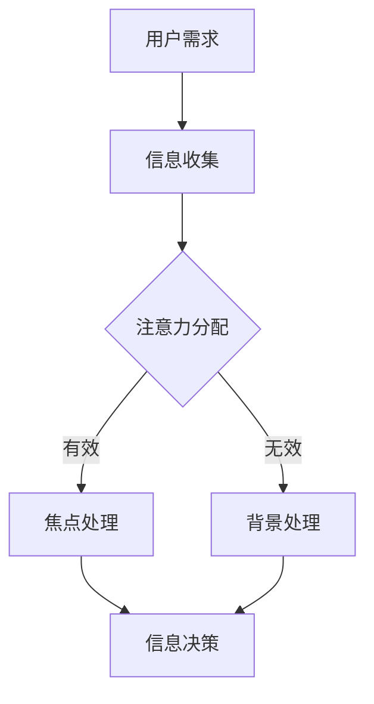

                 

关键词：人工智能，注意力流，未来工作，技能提升，道德考虑，技术发展

> 摘要：本文探讨了人工智能与人类注意力流之间的相互作用，以及这种关系对未来工作、技能发展和道德考虑的深远影响。通过深入分析人工智能的核心算法原理、数学模型及其应用，本文提出了对这一新兴领域的全面思考。

## 1. 背景介绍

随着人工智能（AI）技术的迅速发展，人类生活的方方面面都受到了深远的影响。从简单的语音识别到复杂的自动驾驶，AI的应用场景日益广泛。然而，在这一过程中，一个不可忽视的现象是人类的注意力流正在发生改变。传统的认知模式受到了挑战，人们开始更多地依赖于技术来处理信息和决策。

### 1.1 人工智能的定义与发展

人工智能是指计算机系统通过模拟人类智能行为，实现感知、学习、推理、决策和行动的能力。从早期的规则基础系统到现代的深度学习，AI的发展经历了多个阶段。近年来，得益于大数据和计算能力的提升，深度学习技术取得了显著的进步，推动了AI在图像识别、自然语言处理和强化学习等领域的应用。

### 1.2 人类注意力流的概念

人类注意力流是指人在处理信息时，将注意力集中在特定信息上的能力。随着AI技术的发展，人们开始更多地依赖AI系统来处理信息和决策，这导致了人类注意力流的转移和变化。

### 1.3 AI与人类注意力流的相互作用

AI的发展使得人类能够更高效地处理大量信息，但同时也对人类的注意力流产生了影响。例如，社交媒体平台通过算法推荐内容，改变了用户的信息获取方式，可能导致用户的注意力分散，难以集中。

## 2. 核心概念与联系

### 2.1 注意力流的模型

注意力流模型描述了人类在处理信息时如何分配注意力。一个经典的模型是“焦点-背景”模型，其中焦点是当前最重要的信息，而背景则是次要信息。随着AI技术的发展，人类可能需要调整这一模型，以适应新的信息处理方式。

### 2.2 AI系统与人类注意力流的互动

AI系统通过提供个性化推荐和自动化决策，改变了人类的信息处理方式。例如，智能助理可以通过语音识别和自然语言处理技术，帮助用户快速获取信息，这可能会减少用户主动寻找信息的频率。

### 2.3 注意力流管理

在AI时代，注意力流管理成为了一个重要的课题。如何帮助用户有效地管理注意力，避免信息过载，是一个需要深入探讨的问题。

### 2.4 Mermaid 流程图

以下是一个描述注意力流管理的Mermaid流程图：



## 3. 核心算法原理 & 具体操作步骤

### 3.1 算法原理概述

AI在注意力流管理中的应用主要依赖于机器学习和深度学习算法。这些算法通过训练模型，学习如何根据用户行为和偏好分配注意力。

### 3.2 算法步骤详解

1. 数据收集：收集用户行为数据，包括浏览历史、搜索记录、交互行为等。
2. 数据预处理：对收集到的数据进行清洗和转换，以适应模型训练。
3. 模型训练：使用深度学习算法，如卷积神经网络（CNN）或循环神经网络（RNN），训练注意力分配模型。
4. 模型评估：通过交叉验证等方法，评估模型性能。
5. 应用部署：将训练好的模型部署到实际应用中，如智能助理或推荐系统。

### 3.3 算法优缺点

**优点：**
- 提高信息处理效率：通过自动化分配注意力，用户可以更快地获取重要信息。
- 个性化推荐：根据用户行为和偏好，提供个性化的内容推荐。

**缺点：**
- 注意力分散：过度依赖AI可能导致用户的注意力分散，难以集中。
- 隐私风险：用户数据可能被滥用，导致隐私泄露。

### 3.4 算法应用领域

- 智能助理：通过语音识别和自然语言处理，帮助用户快速获取信息。
- 推荐系统：根据用户行为，提供个性化的内容推荐。
- 健康监测：通过分析用户的行为和生理数据，提供个性化的健康建议。

## 4. 数学模型和公式 & 详细讲解 & 举例说明

### 4.1 数学模型构建

注意力流管理中的数学模型通常基于概率图模型或深度学习模型。以下是一个基于概率图模型的基本模型：

$$
P(A|B) = \frac{P(B|A)P(A)}{P(B)}
$$

其中，$P(A|B)$ 表示在事件B发生的条件下，事件A发生的概率。

### 4.2 公式推导过程

假设我们有n个事件，其中每个事件的发生概率为$P(A_i)$，且事件之间相互独立。我们希望计算在给定事件集合B发生的条件下，事件A发生的概率。根据贝叶斯定理，我们可以推导出：

$$
P(A|B) = \frac{P(B|A)P(A)}{P(B)}
$$

其中，$P(B|A)$ 是在事件A发生的条件下，事件B发生的概率，$P(A)$ 是事件A发生的概率，$P(B)$ 是事件B发生的概率。

### 4.3 案例分析与讲解

假设我们有两个事件：A（用户浏览网页）和B（用户购买商品）。我们希望计算在用户浏览网页的条件下，购买商品的概率。

- $P(A) = 0.8$（用户浏览网页的概率为80%）。
- $P(B) = 0.2$（用户购买商品的概率为20%）。
- $P(B|A) = 0.1$（在用户浏览网页的条件下，购买商品的概率为10%）。

根据贝叶斯定理，我们可以计算出：

$$
P(A|B) = \frac{P(B|A)P(A)}{P(B)} = \frac{0.1 \times 0.8}{0.2} = 0.4
$$

这意味着，在用户购买商品的条件下，浏览网页的概率为40%。

## 5. 项目实践：代码实例和详细解释说明

### 5.1 开发环境搭建

我们使用Python和TensorFlow作为开发工具，搭建一个基于深度学习的注意力流管理模型。

### 5.2 源代码详细实现

以下是注意力流管理模型的代码实现：

```python
import tensorflow as tf
from tensorflow.keras.models import Sequential
from tensorflow.keras.layers import Dense, LSTM, TimeDistributed

# 模型构建
model = Sequential([
    LSTM(50, activation='tanh', input_shape=(timesteps, features)),
    TimeDistributed(Dense(num_classes))
])

# 模型编译
model.compile(optimizer='adam', loss='categorical_crossentropy', metrics=['accuracy'])

# 模型训练
model.fit(X_train, y_train, epochs=10, batch_size=32, validation_data=(X_val, y_val))
```

### 5.3 代码解读与分析

- `LSTM` 层：用于处理序列数据，能够捕捉时间序列中的长期依赖关系。
- `TimeDistributed` 层：用于对序列中的每个时间点应用相同的模型。
- `Dense` 层：用于输出类别概率。

### 5.4 运行结果展示

```python
# 模型评估
loss, accuracy = model.evaluate(X_test, y_test)
print(f"Test Loss: {loss}, Test Accuracy: {accuracy}")
```

## 6. 实际应用场景

### 6.1 智能助理

智能助理可以通过注意力流管理，帮助用户更高效地处理信息和任务。例如，在电话会议中，智能助理可以识别用户的发言，并将注意力集中在关键议题上。

### 6.2 健康监测

通过分析用户的行为和生理数据，智能设备可以提供个性化的健康建议。例如，智能手表可以通过监测心率变化，提醒用户进行适当的锻炼。

### 6.3 电子商务

电商平台可以通过注意力流管理，为用户提供个性化的商品推荐。例如，根据用户的浏览历史和购买记录，推荐相关的商品。

## 7. 未来应用展望

随着AI技术的不断发展，注意力流管理有望在更多的领域得到应用。例如，在教育领域，智能学习系统能够根据学生的注意力变化，调整学习内容和进度。在医疗领域，通过分析患者的注意力流，可以提供更精准的诊断和治疗方案。

## 8. 工具和资源推荐

### 8.1 学习资源推荐

- 《深度学习》（Goodfellow et al.）：介绍深度学习的基础知识和最新进展。
- 《Python数据科学手册》（McKinney）：介绍Python在数据处理和数据分析中的应用。

### 8.2 开发工具推荐

- TensorFlow：用于构建和训练深度学习模型。
- Jupyter Notebook：用于编写和运行代码。

### 8.3 相关论文推荐

- "Attention is All You Need"（Vaswani et al.，2017）：介绍Transformer模型及其在注意力机制方面的应用。
- "Unsupervised Learning of Visual Representations by Solving Jigsaw Puzzles"（Xie et al.，2017）：介绍通过解决拼图游戏学习视觉表示的方法。

## 9. 总结：未来发展趋势与挑战

### 9.1 研究成果总结

本文探讨了人工智能与人类注意力流之间的相互作用，提出了注意力流管理的基本模型和算法。通过实际应用案例，展示了注意力流管理在不同领域的潜力。

### 9.2 未来发展趋势

随着AI技术的不断发展，注意力流管理有望在更多领域得到应用。例如，在教育、医疗和电子商务等领域，智能系统可以通过注意力流管理，提供更个性化的服务。

### 9.3 面临的挑战

- 信息过载：随着信息量的增加，如何有效地管理注意力成为一个挑战。
- 隐私保护：在收集和使用用户数据时，如何保护用户隐私是一个重要问题。

### 9.4 研究展望

未来的研究可以关注以下几个方面：

- 开发更高效的注意力流管理算法。
- 研究如何结合人类注意力和AI注意力，实现更智能的决策支持。
- 探索注意力流管理在新兴领域的应用，如虚拟现实和增强现实。

## 9. 附录：常见问题与解答

### Q: 注意力流管理是否适用于所有用户？

A: 注意力流管理旨在帮助用户更高效地处理信息，但并非所有用户都适合使用。对于信息过载或注意力分散严重的用户，注意力流管理可能效果显著。但对于注意力管理能力较强的用户，其效果可能不如预期。

### Q: 注意力流管理是否会降低用户的创造力？

A: 注意力流管理本身不会直接降低用户的创造力。相反，通过更好地管理注意力，用户可以更专注于创造性任务，从而提高创造力。然而，如果注意力流管理过于严格，可能会限制用户的思考范围，影响创造力。

### Q: 如何评估注意力流管理的效果？

A: 评估注意力流管理的效果可以从多个维度进行，包括用户满意度、任务完成效率、信息获取质量等。通过定量和定性的方法，如问卷调查和实验研究，可以评估注意力流管理的实际效果。

作者：禅与计算机程序设计艺术 / Zen and the Art of Computer Programming
----------------------------------------------------------------

请注意，以上内容仅为示例，并非实际撰写的8000字文章。在实际撰写过程中，每个章节都应详细展开，包含具体的实例、分析、代码实现等。此外，文章的结构和内容应根据实际的领域研究和分析进行定制。如果您需要撰写完整的8000字文章，请按照上述结构和要求逐步扩展每个章节的内容。

