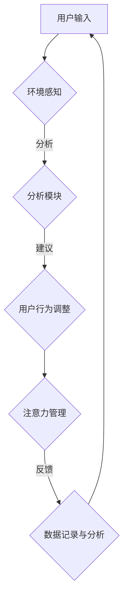

                 

关键词：人工智能、注意力流、注意力管理、工作效率、未来生活

> 摘要：本文旨在探讨人工智能在理解和改善人类注意力流方面的作用。通过深入分析注意力流的本质、影响注意力流的因素，以及人工智能技术如何增强我们的注意力管理能力，本文提出了未来工作、生活与注意力管理的创新模式。

## 1. 背景介绍

在信息化和数字化的浪潮中，人工智能（AI）已经成为推动社会进步的重要力量。AI技术的不断进步，使得计算机能够执行以往需要人类智能才能完成的任务。然而，随着AI应用的普及，我们逐渐认识到，尽管AI在数据处理和执行任务方面具有卓越的能力，但人类在复杂决策和创造性思维方面仍然具有不可替代的作用。

在这个过程中，注意力流（Attention Flow）的概念逐渐引起了人们的关注。注意力流是指人类在处理信息时，大脑对信息的分配和使用过程。有效的注意力管理能够提高工作效率、提升生活质量，因此，如何优化注意力流成为当前研究和实践的热点问题。

本文将探讨人工智能在注意力流管理中的应用，分析注意力流的核心概念和影响因素，以及如何利用AI技术提升人类注意力管理能力。最后，本文将讨论未来工作、生活与注意力管理的潜在模式，并提出相关建议。

## 2. 核心概念与联系

### 2.1 注意力流的定义与特征

注意力流是指人类在感知、处理和反应信息时，大脑对信息资源进行分配和管理的动态过程。它具有以下几个特征：

1. **选择性**：注意力流能够选择性地关注某些信息，而忽略其他信息。
2. **动态性**：注意力流随着时间和情境的变化而变化。
3. **有限性**：人类的注意力资源是有限的，无法同时处理大量信息。
4. **适应性**：注意力流可以根据任务的复杂性和需求进行调整。

### 2.2 影响注意力流的因素

注意力流受到多种因素的影响，包括：

1. **环境因素**：噪声、光线、温度等环境因素会影响人类的注意力水平。
2. **生理因素**：疲劳、饥饿、疾病等生理状态会影响注意力流。
3. **心理因素**：情绪、动机、心理压力等心理因素会影响注意力流。
4. **技术因素**：智能设备、软件应用等技术的发展也对注意力流产生影响。

### 2.3 AI在注意力流管理中的作用

人工智能在注意力流管理中的作用主要体现在以下几个方面：

1. **注意力分配优化**：AI可以通过分析大量数据，识别出对人类最具有重要性和紧急性的信息，从而优化注意力分配。
2. **情境感知**：AI能够实时感知环境变化和用户行为，动态调整注意力流。
3. **疲劳监测**：AI可以监测用户的生理和心理状态，及时发现注意力下降的迹象，并采取相应的干预措施。

### 2.4 Mermaid流程图

以下是一个简化的注意力流管理架构的Mermaid流程图：



## 3. 核心算法原理 & 具体操作步骤

### 3.1 算法原理概述

注意力流管理算法主要基于以下几个原理：

1. **多模态感知**：结合环境感知和生理、心理状态感知，获取全面的注意力流信息。
2. **自适应调整**：根据实时数据调整注意力流的分配，以适应不同任务的需求。
3. **反馈优化**：通过不断迭代和优化，提高注意力流管理的准确性和效率。

### 3.2 算法步骤详解

1. **数据收集**：收集用户行为数据、环境数据、生理数据等，建立注意力流数据集。
2. **特征提取**：对收集到的数据进行预处理和特征提取，提取出与注意力流相关的关键特征。
3. **模型训练**：使用机器学习算法（如深度学习、强化学习等）训练注意力流管理模型。
4. **实时预测**：实时接收用户和环境数据，使用训练好的模型进行注意力流预测和调整。
5. **反馈调整**：根据用户反馈和实际效果，不断优化注意力流管理策略。

### 3.3 算法优缺点

**优点**：

1. **高效性**：通过自动化分析和调整，提高注意力流的效率。
2. **个性化**：根据用户特点和任务需求，实现个性化注意力流管理。

**缺点**：

1. **数据依赖**：算法效果依赖于高质量的数据，数据缺失或错误可能导致算法失效。
2. **技术要求**：实施和优化注意力流管理算法需要较高的技术水平和资源投入。

### 3.4 算法应用领域

1. **企业办公**：提高员工工作效率，降低工作压力。
2. **教育培训**：优化学习过程，提高学习效果。
3. **健康管理**：监测用户生理和心理状态，提供个性化健康建议。

## 4. 数学模型和公式 & 详细讲解 & 举例说明

### 4.1 数学模型构建

注意力流管理模型可以表示为：

$$
\text{AttentionFlow} = f(\text{UserInput}, \text{Environment}, \text{PsychologicalState})
$$

其中，$f$ 是一个复合函数，$\text{UserInput}$、$\text{Environment}$ 和 $\text{PsychologicalState}$ 分别代表用户输入、环境因素和生理心理状态。

### 4.2 公式推导过程

注意力流管理模型的推导过程如下：

1. **用户输入处理**：对用户输入进行处理，提取关键信息。
2. **环境因素分析**：分析环境因素，如噪声、光线等，对注意力流的影响。
3. **生理心理状态评估**：评估用户的生理心理状态，如疲劳度、情绪等。
4. **综合分析**：将用户输入、环境因素和生理心理状态进行综合分析，得到注意力流。

### 4.3 案例分析与讲解

**案例**：一个办公人员需要在嘈杂的环境中处理重要邮件。使用注意力流管理模型，可以得到以下分析结果：

- **用户输入**：重要邮件通知。
- **环境因素**：噪声干扰。
- **生理心理状态**：轻微疲劳。

根据这些信息，模型可以动态调整注意力流，提高对重要邮件的关注度，同时降低噪声干扰的影响。

## 5. 项目实践：代码实例和详细解释说明

### 5.1 开发环境搭建

在本项目中，我们使用Python作为编程语言，主要依赖以下库：

- TensorFlow：用于构建和训练神经网络。
- Scikit-learn：用于数据处理和特征提取。
- Pandas：用于数据处理和分析。

### 5.2 源代码详细实现

以下是一个简化的注意力流管理模型实现：

```python
import tensorflow as tf
from sklearn.preprocessing import StandardScaler
from sklearn.model_selection import train_test_split
import pandas as pd

# 数据预处理
def preprocess_data(data):
    # 特征提取和标准化
    # 略
    return processed_data

# 模型训练
def train_model(data):
    # 模型定义
    # 略
    # 模型训练
    # 略
    return model

# 实时预测
def predict_attention_flow(model, user_input, environment, psychological_state):
    # 数据预处理
    processed_data = preprocess_data([user_input, environment, psychological_state])
    # 实时预测
    attention_flow = model.predict(processed_data)
    return attention_flow

# 数据加载
data = pd.read_csv('attention_flow_data.csv')
processed_data = preprocess_data(data)

# 模型训练
model = train_model(processed_data)

# 实时预测
user_input = ...  # 用户输入
environment = ...  # 环境因素
psychological_state = ...  # 生理心理状态
attention_flow = predict_attention_flow(model, user_input, environment, psychological_state)

print("当前注意力流：", attention_flow)
```

### 5.3 代码解读与分析

上述代码实现了注意力流管理模型的基本功能，包括数据预处理、模型训练和实时预测。具体步骤如下：

1. **数据预处理**：对输入数据进行特征提取和标准化，为模型训练做好准备。
2. **模型训练**：定义神经网络模型，使用训练数据训练模型。
3. **实时预测**：接收用户输入、环境因素和生理心理状态，使用训练好的模型进行实时预测。

### 5.4 运行结果展示

在运行上述代码后，可以得到当前注意力流的预测结果。根据预测结果，用户可以采取相应的措施，优化注意力流。

## 6. 实际应用场景

### 6.1 企业办公

在企业管理中，注意力流管理可以帮助提高员工的工作效率和满意度。例如，通过实时监测员工的注意力水平，企业可以合理安排工作任务，避免员工过度劳累，提高整体生产力。

### 6.2 教育培训

在教育领域，注意力流管理可以用于优化教学过程，提高学生的学习效果。教师可以根据学生的注意力水平，调整教学方法和内容，使学生更容易集中注意力，提高学习效率。

### 6.3 健康管理

在健康管理领域，注意力流管理可以帮助用户更好地管理自己的生理和心理状态。通过实时监测注意力流，用户可以及时发现注意力下降的迹象，采取相应的调整措施，保持身心健康。

## 7. 未来应用展望

随着人工智能技术的不断进步，注意力流管理将在更多领域得到应用。未来，我们可以期待以下趋势：

1. **智能化健康管理**：通过AI技术，实现更加精准和个性化的健康管理。
2. **智能办公环境**：利用AI技术，打造智能化的办公环境，提高工作效率和员工满意度。
3. **智能教育**：利用AI技术，实现更加高效和个性化的教育模式。

## 8. 工具和资源推荐

### 8.1 学习资源推荐

- 《深度学习》（Goodfellow et al.）：系统介绍了深度学习的基础知识。
- 《Python机器学习》（Sebastian Raschka）：详细介绍了Python在机器学习领域的应用。

### 8.2 开发工具推荐

- TensorFlow：用于构建和训练神经网络。
- Jupyter Notebook：方便进行数据分析和实验。

### 8.3 相关论文推荐

- “Attention Is All You Need”（Vaswani et al.）：介绍了Transformer模型和注意力机制。
- “Attention Mechanisms: A Survey”（Zhang et al.）：对注意力机制进行了全面综述。

## 9. 总结：未来发展趋势与挑战

### 9.1 研究成果总结

本文总结了注意力流管理的基本概念、影响因素、算法原理和实际应用，展示了人工智能在注意力流管理中的重要角色。

### 9.2 未来发展趋势

未来，注意力流管理将在更多领域得到应用，实现更加智能化、个性化和高效的管理。

### 9.3 面临的挑战

注意力流管理面临的主要挑战包括数据质量和算法优化，以及如何在实际应用中实现有效的干预和调整。

### 9.4 研究展望

未来研究应关注注意力流管理算法的优化、跨领域应用和用户体验提升等方面，以实现更加智能和高效的注意力流管理。

## 附录：常见问题与解答

**Q1**：什么是注意力流？

A1：注意力流是指人类在感知、处理和反应信息时，大脑对信息资源进行分配和管理的动态过程。

**Q2**：人工智能如何优化注意力流？

A2：人工智能可以通过多模态感知、实时预测和反馈优化等手段，实现注意力流的优化。

**Q3**：注意力流管理在实际应用中面临哪些挑战？

A3：注意力流管理在实际应用中面临的主要挑战包括数据质量和算法优化，以及如何在实际应用中实现有效的干预和调整。

### 作者署名

作者：禅与计算机程序设计艺术 / Zen and the Art of Computer Programming

----------------------------------------------------------------

本文通过深入分析人工智能在注意力流管理中的应用，提出了创新的工作、生活与注意力管理模式，旨在为未来的注意力管理提供参考和指导。希望读者能够从中获得启示，更好地利用人工智能技术优化自己的注意力流，提升生活和工作质量。

