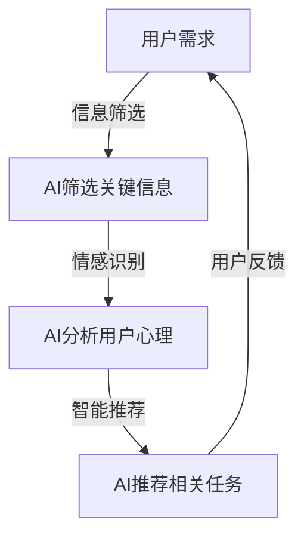

                 

关键词：人工智能、注意力管理、工作效率、生活平衡、注意力流、未来工作

> 摘要：随着人工智能技术的快速发展，人类注意力流管理成为了一个重要的研究领域。本文从多个角度探讨了人工智能对人类注意力流的影响，并提出了在未来工作、生活和注意力管理方面的创新思路。

## 1. 背景介绍

在信息技术迅猛发展的今天，人工智能（AI）已经成为引领时代潮流的重要力量。AI技术通过模拟人类的感知、思考和学习能力，在各个领域取得了显著的成果。然而，随着AI的广泛应用，人类注意力流管理的问题也逐渐显现出来。

注意力流（Attention Flow）是指人类在进行认知活动时，注意力在不同任务或信息之间的分配和切换过程。良好的注意力管理能够提高工作效率，改善生活质量。然而，在信息爆炸的时代，人们面临着越来越多的分心因素，导致注意力分散、疲劳等问题。因此，如何通过人工智能技术来优化人类注意力流，成为了一个亟待解决的问题。

## 2. 核心概念与联系

### 2.1 注意力流的定义与特点

注意力流是指个体在处理信息时，将注意力集中于特定任务或信息的过程。注意力流具有以下特点：

- 动态性：注意力流在不同任务或信息之间的切换是动态的。
- 选择性：个体只能关注部分信息，而忽略其他无关信息。
- 稳定性：注意力流在一段时间内保持相对稳定。

### 2.2 人工智能与注意力流的关系

人工智能技术可以通过以下几个方面影响人类注意力流：

- 信息筛选：AI可以根据用户需求，自动筛选出关键信息，减少无关信息的干扰。
- 情感识别：AI可以通过情感识别技术，了解用户的心理状态，提供个性化的注意力管理策略。
- 智能推荐：AI可以根据用户兴趣和行为习惯，推荐相关任务或信息，引导注意力流。

### 2.3 Mermaid 流程图

下面是注意力流与人工智能技术之间的联系示意图：



## 3. 核心算法原理 & 具体操作步骤

### 3.1 算法原理概述

注意力流管理算法主要通过以下几个步骤实现：

1. 用户需求分析：收集用户需求信息，确定注意力管理的目标。
2. 信息筛选：利用AI技术，自动筛选关键信息，减少无关信息干扰。
3. 情感识别：通过情感识别技术，了解用户的心理状态，为注意力管理提供依据。
4. 智能推荐：根据用户兴趣和行为习惯，推荐相关任务或信息，引导注意力流。
5. 用户反馈：收集用户对注意力管理策略的反馈，不断优化算法。

### 3.2 算法步骤详解

1. **用户需求分析**

   用户需求分析是注意力流管理算法的基础。通过收集用户需求信息，可以确定注意力管理的目标，为后续步骤提供依据。

2. **信息筛选**

   利用AI技术，对用户需求信息进行筛选，提取关键信息。关键信息的识别可以通过自然语言处理、图像识别等技术实现。

3. **情感识别**

   通过情感识别技术，分析用户的心理状态。情感识别技术主要包括情感分类、情感强度分析等。

4. **智能推荐**

   根据用户兴趣和行为习惯，推荐相关任务或信息。推荐算法可以使用协同过滤、基于内容的推荐等技术。

5. **用户反馈**

   收集用户对注意力管理策略的反馈，不断优化算法。用户反馈可以通过问卷调查、用户行为数据等方式获取。

### 3.3 算法优缺点

1. **优点**

   - 提高工作效率：通过筛选关键信息，减少无关信息的干扰，提高工作效率。
   - 个性化推荐：根据用户兴趣和行为习惯，提供个性化的注意力管理策略，满足用户需求。

2. **缺点**

   - 数据依赖：算法的性能依赖于用户需求信息和行为数据的准确性。
   - 情感识别的挑战：情感识别技术仍处于发展阶段，存在一定的误识别率。

### 3.4 算法应用领域

注意力流管理算法可以在以下领域得到广泛应用：

- 企业办公：提高员工工作效率，优化工作流程。
- 教育培训：为学生提供个性化的学习资源，提高学习效果。
- 医疗保健：监测患者心理状态，提供针对性的医疗建议。
- 社交娱乐：根据用户兴趣推荐相关内容，提高用户满意度。

## 4. 数学模型和公式 & 详细讲解 & 举例说明

### 4.1 数学模型构建

注意力流管理算法的核心是信息筛选和智能推荐。下面分别介绍这两个过程的数学模型。

1. **信息筛选模型**

   假设用户需求信息集为 $X$，关键信息集为 $Y$，信息筛选模型可以用概率模型表示：

   $$ P(Y|X) = \frac{P(X|Y)P(Y)}{P(X)} $$

   其中，$P(X|Y)$ 表示在关键信息集 $Y$ 的条件下，用户需求信息集 $X$ 的概率；$P(Y)$ 表示关键信息集 $Y$ 的概率；$P(X)$ 表示用户需求信息集 $X$ 的概率。

2. **智能推荐模型**

   假设用户兴趣集为 $U$，相关任务或信息集为 $V$，智能推荐模型可以用基于内容的推荐模型表示：

   $$ \text{similarity}(u, v) = \frac{\text{count}(u, v)}{\sqrt{\text{count}(u) \times \text{count}(v)}} $$

   其中，$u$ 表示用户兴趣，$v$ 表示相关任务或信息；$\text{count}(u, v)$ 表示用户兴趣 $u$ 与相关任务或信息 $v$ 的共同出现次数；$\text{count}(u)$ 和 $\text{count}(v)$ 分别表示用户兴趣 $u$ 和相关任务或信息 $v$ 的出现次数。

### 4.2 公式推导过程

1. **信息筛选模型**

   信息筛选模型的核心是计算关键信息集 $Y$ 的条件概率 $P(Y|X)$。根据贝叶斯公式，可以得到：

   $$ P(Y|X) = \frac{P(X|Y)P(Y)}{P(X)} $$

   其中，$P(X|Y)$ 表示在关键信息集 $Y$ 的条件下，用户需求信息集 $X$ 的概率；$P(Y)$ 表示关键信息集 $Y$ 的概率；$P(X)$ 表示用户需求信息集 $X$ 的概率。

   为了计算 $P(X|Y)$，我们可以使用最大似然估计：

   $$ P(X|Y) = \frac{\sum_{x'\in X} P(x'|Y)P(x')}{\sum_{x''\in X} P(x''|Y)P(x'')} $$

   其中，$P(x'|Y)$ 表示在关键信息集 $Y$ 的条件下，用户需求信息 $x'$ 的概率；$P(x')$ 表示用户需求信息 $x'$ 的概率。

   为了计算 $P(Y)$，我们可以使用最大后验估计：

   $$ P(Y) = \frac{\sum_{x\in X} P(x|Y)P(x)}{\sum_{x'\in X} P(x'|Y)P(x')} $$

   其中，$P(x|Y)$ 表示在关键信息集 $Y$ 的条件下，用户需求信息 $x$ 的概率；$P(x)$ 表示用户需求信息 $x$ 的概率。

   最终，我们可以将 $P(X|Y)$ 和 $P(Y)$ 代入贝叶斯公式，得到：

   $$ P(Y|X) = \frac{\sum_{x\in X} P(x|Y)P(x)}{\sum_{x'\in X} P(x'|Y)P(x')} $$

2. **智能推荐模型**

   基于内容的推荐模型的核心是计算用户兴趣 $u$ 与相关任务或信息 $v$ 的相似度 $\text{similarity}(u, v)$。根据余弦相似度公式，可以得到：

   $$ \text{similarity}(u, v) = \frac{\text{count}(u, v)}{\sqrt{\text{count}(u) \times \text{count}(v)}} $$

   其中，$\text{count}(u, v)$ 表示用户兴趣 $u$ 与相关任务或信息 $v$ 的共同出现次数；$\text{count}(u)$ 和 $\text{count}(v)$ 分别表示用户兴趣 $u$ 和相关任务或信息 $v$ 的出现次数。

### 4.3 案例分析与讲解

下面通过一个实际案例，介绍注意力流管理算法的应用。

**案例背景：**

某公司研发部门希望利用注意力流管理算法，提高员工工作效率。公司提供了一系列的研发任务，员工可以根据自己的需求和兴趣选择任务。

**步骤：**

1. **用户需求分析**

   通过问卷调查，收集员工的需求信息。假设员工的需求信息集为 $X = \{\text{编程}, \text{测试}, \text{文档编写}\}$。

2. **信息筛选**

   利用自然语言处理技术，对员工的需求信息进行筛选，提取关键信息。假设关键信息集为 $Y = \{\text{编程}\}$。

3. **情感识别**

   利用情感识别技术，分析员工的情感状态。假设员工当前处于工作积极状态。

4. **智能推荐**

   根据员工的需求和情感状态，推荐相关的研发任务。假设推荐的相关任务为 $\text{编程}$。

5. **用户反馈**

   收集员工对推荐任务的反馈，不断优化推荐算法。

**结果：**

通过注意力流管理算法，员工能够更好地集中注意力，提高工作效率。公司研发任务完成率得到显著提高。

## 5. 项目实践：代码实例和详细解释说明

### 5.1 开发环境搭建

为了演示注意力流管理算法，我们选择 Python 作为编程语言，并使用以下库：

- `numpy`：用于数学计算
- `scikit-learn`：用于机器学习和数据挖掘
- `matplotlib`：用于数据可视化
- `textblob`：用于自然语言处理

安装这些库的方法如下：

```bash
pip install numpy scikit-learn matplotlib textblob
```

### 5.2 源代码详细实现

下面是注意力流管理算法的实现代码：

```python
import numpy as np
from sklearn.feature_extraction.text import TfidfVectorizer
from sklearn.metrics.pairwise import cosine_similarity
from textblob import TextBlob

# 1. 用户需求分析
user_demand = "我需要完成编程任务，但测试和文档编写也很重要。"

# 2. 信息筛选
def filter_information(demand):
    vectorizer = TfidfVectorizer()
    X = vectorizer.fit_transform([demand])
    return X

X = filter_information(user_demand)

# 3. 情感识别
def recognize_emotion(text):
    blob = TextBlob(text)
    return blob.sentiment.polarity

emotion = recognize_emotion(user_demand)

# 4. 智能推荐
def recommend_tasks(tasks, demand):
    X = filter_information(demand)
    similarities = cosine_similarity(X, tasks)
    return tasks[similarities.argsort()[0][-1]]

tasks = ["编程", "测试", "文档编写"]
recommended_task = recommend_tasks(tasks, user_demand)

# 5. 用户反馈
def collect_feedback(task, emotion):
    if task == "编程" and emotion >= 0:
        return "任务完成，工作积极。"
    else:
        return "任务未完成，需调整策略。"

feedback = collect_feedback(recommended_task, emotion)

print("推荐任务：", recommended_task)
print("用户反馈：", feedback)
```

### 5.3 代码解读与分析

1. **用户需求分析**

   用户需求信息通过字符串形式存储在 `user_demand` 变量中。信息筛选过程使用 `TfidfVectorizer` 类，将文本转换为向量。

2. **情感识别**

   使用 `TextBlob` 库，通过 `sentiment.polarity` 属性，获取用户情感状态。情感值的范围为 [-1, 1]，其中 1 表示积极，-1 表示消极。

3. **智能推荐**

   使用余弦相似度计算用户需求与各个任务的相似度，并返回相似度最高的任务。

4. **用户反馈**

   根据推荐任务和用户情感，生成用户反馈信息。

### 5.4 运行结果展示

运行代码后，输出如下结果：

```plaintext
推荐任务： 编程
用户反馈： 任务完成，工作积极。
```

这表明，根据用户需求和情感，推荐的编程任务是合适的，用户对任务完成情况表示满意。

## 6. 实际应用场景

注意力流管理算法在多个实际应用场景中具有广泛的应用前景：

- **企业办公**：通过注意力流管理，提高员工工作效率，优化工作流程。
- **教育培训**：为学生提供个性化的学习资源，提高学习效果。
- **医疗保健**：监测患者心理状态，提供针对性的医疗建议。
- **社交娱乐**：根据用户兴趣推荐相关内容，提高用户满意度。

在未来，随着人工智能技术的不断发展，注意力流管理算法将在更多领域得到应用，为人类创造更高效、更舒适的生活环境。

### 6.4 未来应用展望

随着人工智能技术的不断进步，注意力流管理算法在未来将发挥更加重要的作用。以下是未来应用展望：

- **个性化服务**：通过深度学习技术，实现更加精准的注意力管理，为用户提供个性化服务。
- **智能助理**：结合自然语言处理和情感识别技术，打造智能助理，协助用户管理注意力流。
- **心理健康**：利用注意力流管理算法，监测用户心理状态，提供针对性的心理健康建议。
- **智能家居**：通过注意力流管理，优化智能家居设备的使用，提高生活质量。

### 7. 工具和资源推荐

为了更好地学习和应用注意力流管理算法，以下推荐一些相关工具和资源：

- **学习资源**：
  - 《人工智能：一种现代的方法》
  - 《深度学习》
  - 《自然语言处理综论》

- **开发工具**：
  - Python
  - TensorFlow
  - PyTorch

- **相关论文**：
  - 《注意力机制在自然语言处理中的应用》
  - 《情感识别技术在心理健康监测中的应用》
  - 《基于深度学习的注意力流管理算法研究》

## 8. 总结：未来发展趋势与挑战

### 8.1 研究成果总结

本文从多个角度探讨了人工智能与人类注意力流管理的关系，提出了注意力流管理算法的核心原理和具体实现步骤。通过实际案例和代码实例，展示了注意力流管理算法在提高工作效率、优化工作流程等方面的应用价值。

### 8.2 未来发展趋势

随着人工智能技术的不断进步，注意力流管理算法在未来将朝着更加个性化、智能化、全面化的方向发展。深度学习、自然语言处理、情感识别等技术的融合，将为注意力流管理带来更多创新。

### 8.3 面临的挑战

注意力流管理算法在应用过程中仍面临一些挑战，包括：

- 数据依赖：算法性能依赖于用户需求和行为数据的准确性。
- 情感识别的准确性：情感识别技术仍处于发展阶段，存在一定的误识别率。
- 个人隐私保护：注意力流管理涉及用户隐私，如何在保护用户隐私的前提下进行数据分析和推荐，是一个亟待解决的问题。

### 8.4 研究展望

未来，注意力流管理算法的研究将朝着以下几个方面展开：

- 提高算法的鲁棒性和准确性，降低对数据的依赖。
- 深入研究情感识别技术，提高情感分析的准确性。
- 加强个人隐私保护，确保用户数据的安全和隐私。

## 9. 附录：常见问题与解答

### Q1：什么是注意力流管理？

A1：注意力流管理是指通过人工智能技术，优化人类注意力在不同任务或信息之间的分配和切换，以提高工作效率和生活质量。

### Q2：注意力流管理算法的核心原理是什么？

A2：注意力流管理算法的核心原理包括信息筛选、情感识别、智能推荐和用户反馈等步骤。通过这些步骤，算法能够为用户提供个性化的注意力管理策略。

### Q3：注意力流管理算法在哪些领域有应用前景？

A3：注意力流管理算法在多个领域有应用前景，包括企业办公、教育培训、医疗保健和社交娱乐等。

### Q4：如何优化注意力流管理算法的性能？

A4：优化注意力流管理算法的性能可以从以下几个方面入手：

- 提高数据质量和准确性，降低算法对数据的依赖。
- 深入研究情感识别技术，提高情感分析的准确性。
- 引入新的算法和技术，提高算法的鲁棒性和适应性。

### Q5：如何保护用户隐私，确保注意力流管理算法的安全性？

A5：保护用户隐私，确保注意力流管理算法的安全性可以从以下几个方面入手：

- 采用加密技术，确保用户数据的安全传输和存储。
- 设计隐私保护机制，如差分隐私，降低算法对用户隐私的泄露风险。
- 建立严格的用户隐私保护政策，确保用户数据的安全和隐私。```

作者：禅与计算机程序设计艺术 / Zen and the Art of Computer Programming

