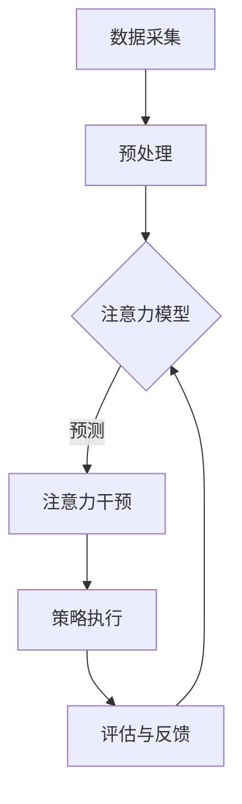

                 

关键词：人工智能，注意力流，工作生活平衡，注意力管理，创新，认知科学

> 摘要：本文探讨人工智能如何影响人类注意力流，从工作到生活的各个方面。通过深入分析注意力流的基本原理，本文提出了一套基于人工智能的注意力管理创新方法，以优化个人和组织的工作效率和生活质量。文章还将讨论这些创新方法在不同应用场景中的实践效果，并为未来的研究提供方向。

## 1. 背景介绍

随着人工智能技术的飞速发展，人类的工作和生活环境正在发生深刻变革。人工智能不仅提高了工作效率，还在很大程度上改变了人类对信息的获取和处理方式。然而，这种变革也带来了新的挑战，特别是注意力管理方面的问题。在信息爆炸的时代，人们面临着前所未有的注意力分散问题，这严重影响了工作效率和个人生活质量。

注意力流（Attention Flow）理论认为，注意力是人类处理信息的关键资源，它决定了我们在特定时刻关注什么，以及如何分配注意力资源。传统的注意力管理方法主要依赖于自我控制和意志力，但在信息过载的环境下，这些方法往往难以奏效。因此，探索新的注意力管理方法，特别是利用人工智能技术进行创新，成为了当前研究的热点。

本文旨在通过深入分析人工智能与人类注意力流的关系，提出一种基于人工智能的注意力管理创新方法，以应对现代工作生活中的注意力管理挑战。

## 2. 核心概念与联系

### 2.1 注意力流的定义

注意力流是指人类在处理信息时，注意力资源的动态分配过程。它不仅包括对外部信息的关注，还涉及对内部思维过程的调控。在认知科学中，注意力被视为一种有限的资源，需要高效地分配和利用。

### 2.2 人工智能与注意力流的关系

人工智能技术通过自动化和智能化手段，能够有效地分析和预测人类注意力流的模式，并提供相应的干预策略。例如，通过分析用户的浏览记录和行为数据，AI可以识别出注意力分散的信号，并给出个性化的注意力管理建议。

### 2.3 注意力管理创新方法的架构

基于人工智能的注意力管理创新方法包括以下几个关键组成部分：

1. 数据采集与分析：通过传感器、应用程序等手段收集用户的注意力数据。
2. 注意力模型构建：基于数据分析和认知科学理论，构建能够反映用户注意力流特性的模型。
3. 注意力干预策略：根据模型预测和用户需求，制定个性化的注意力管理策略。
4. 评估与反馈：通过用户反馈和系统监测，不断优化注意力管理策略。

### 2.4 Mermaid 流程图



## 3. 核心算法原理 & 具体操作步骤

### 3.1 算法原理概述

注意力管理算法的核心是注意力模型的构建。该模型基于用户的注意力流数据，通过机器学习技术训练出一个能够预测用户注意力分布的模型。具体来说，算法包括以下几个步骤：

1. 数据采集：收集用户的浏览历史、行为记录等注意力数据。
2. 数据预处理：对原始数据进行清洗、归一化等处理，以便于模型训练。
3. 模型训练：使用机器学习算法，如神经网络，训练出一个预测用户注意力分布的模型。
4. 模型评估：通过交叉验证和测试集，评估模型的预测准确性。
5. 注意力干预：根据模型预测结果，制定个性化的注意力管理策略。
6. 策略执行与反馈：执行注意力管理策略，并收集用户反馈，以优化模型和策略。

### 3.2 算法步骤详解

#### 3.2.1 数据采集

数据采集是注意力管理算法的基础。通过传感器、应用程序等手段，收集用户的浏览历史、行为记录等注意力数据。这些数据可以包括用户的浏览时间、浏览频率、感兴趣的主题等。

#### 3.2.2 数据预处理

对采集到的原始数据进行清洗、归一化等处理，以便于模型训练。数据清洗的目的是去除噪声和异常值，而数据归一化则是为了使不同特征具有相同的量纲，提高模型训练的效率。

#### 3.2.3 模型训练

使用机器学习算法，如神经网络，训练出一个预测用户注意力分布的模型。训练过程中，算法通过不断调整模型的参数，以最小化预测误差。

#### 3.2.4 模型评估

通过交叉验证和测试集，评估模型的预测准确性。评估指标可以包括预测精度、召回率、F1分数等。

#### 3.2.5 注意力干预

根据模型预测结果，制定个性化的注意力管理策略。例如，当预测用户注意力分散时，可以建议用户暂时放下手头的任务，休息一会儿。

#### 3.2.6 策略执行与反馈

执行注意力管理策略，并收集用户反馈，以优化模型和策略。例如，如果用户对某项策略反馈良好，可以进一步优化和完善该策略。

### 3.3 算法优缺点

#### 优点：

1. 个性化：基于用户注意力数据，提供个性化的注意力管理策略。
2. 智能化：利用机器学习技术，实现注意力预测和干预的自动化。
3. 高效性：通过数据分析和模型训练，实现高效的注意力管理。

#### 缺点：

1. 数据依赖：算法的准确性依赖于数据的质量和数量。
2. 隐私问题：注意力数据可能涉及用户隐私，需要严格保护。

### 3.4 算法应用领域

注意力管理算法可以广泛应用于工作、生活和教育等多个领域。例如，在工作领域，可以用于优化员工的工作流程，提高工作效率；在生活领域，可以用于帮助用户合理安排时间，提高生活质量；在教育领域，可以用于帮助学生提高学习效率，优化学习体验。

## 4. 数学模型和公式

### 4.1 数学模型构建

注意力管理算法的数学模型可以基于马尔可夫决策过程（MDP）构建。MDP模型包括状态空间、动作空间、奖励函数和状态转移概率等组成部分。

#### 状态空间 S：

状态空间 S 表示用户在某一时刻的注意力分布情况。状态可以是高集中、中度集中、低集中或分散。

#### 动作空间 A：

动作空间 A 表示用户可以采取的注意力管理策略。动作可以是休息、改变任务、专注工作等。

#### 奖励函数 R(s, a)：

奖励函数 R(s, a) 表示用户在某一状态 s 采取动作 a 后的收益。收益可以是提高工作效率、提高生活质量等。

#### 状态转移概率 P(s', s | a)：

状态转移概率 P(s', s | a) 表示用户在当前状态 s 采取动作 a 后，转移到下一个状态 s' 的概率。

### 4.2 公式推导过程

基于 MDP 模型，可以使用动态规划算法求解最优策略。具体来说，可以使用价值迭代算法或策略迭代算法。

#### 价值迭代算法：

1. 初始化：设置初始值 v(s) = 0。
2. 迭代：对于每个状态 s，计算最优动作 a* 和对应的奖励 R(s, a*)。
3. 更新：根据最优动作 a* 和状态转移概率，更新状态值 v(s)。
4. 重复步骤 2-3，直到收敛。

#### 策略迭代算法：

1. 初始化：设置初始策略 π(s)。
2. 迭代：对于每个状态 s，根据当前策略 π(s) 计算状态值 v(s)。
3. 更新策略：根据状态值 v(s)，更新策略 π(s)。
4. 重复步骤 2-3，直到策略收敛。

### 4.3 案例分析与讲解

#### 案例一：工作时间优化

假设用户在一天中需要完成多个任务，每个任务的优先级不同。基于注意力管理算法，可以优化用户的工作时间安排，提高工作效率。

1. 数据采集：收集用户的工作任务列表、任务优先级和完成时间。
2. 数据预处理：对工作任务数据进行清洗、归一化处理。
3. 模型训练：使用机器学习算法，如神经网络，训练出一个预测用户注意力分布的模型。
4. 模型评估：通过交叉验证和测试集，评估模型的预测准确性。
5. 注意力干预：根据模型预测结果，为用户提供最优的工作时间安排。
6. 策略执行与反馈：执行工作时间优化策略，并收集用户反馈，以优化模型和策略。

#### 案例二：学习时间管理

对于学生来说，合理规划学习时间对于提高学习效率至关重要。基于注意力管理算法，可以为用户提供个性化的学习时间管理方案。

1. 数据采集：收集学生的学习任务列表、学习进度和兴趣偏好。
2. 数据预处理：对学习任务数据进行清洗、归一化处理。
3. 模型训练：使用机器学习算法，如神经网络，训练出一个预测用户注意力分布的模型。
4. 模型评估：通过交叉验证和测试集，评估模型的预测准确性。
5. 注意力干预：根据模型预测结果，为用户提供最优的学习时间安排。
6. 策略执行与反馈：执行学习时间优化策略，并收集用户反馈，以优化模型和策略。

## 5. 项目实践：代码实例和详细解释说明

### 5.1 开发环境搭建

为了演示注意力管理算法的应用，我们将使用 Python 编写一个简单的注意力管理程序。开发环境需要安装以下工具：

1. Python 3.x 版本
2. TensorFlow 或 PyTorch 等机器学习库
3. Matplotlib 等数据可视化库

安装完成以上工具后，可以开始编写代码。

### 5.2 源代码详细实现

以下是一个简单的注意力管理程序示例：

```python
import tensorflow as tf
import numpy as np
import matplotlib.pyplot as plt

# 数据预处理
def preprocess_data(data):
    # 数据清洗和归一化处理
    # ...
    return processed_data

# 模型训练
def train_model(data, epochs=100):
    model = tf.keras.Sequential([
        tf.keras.layers.Dense(64, activation='relu', input_shape=(data.shape[1],)),
        tf.keras.layers.Dense(64, activation='relu'),
        tf.keras.layers.Dense(1, activation='sigmoid')
    ])

    model.compile(optimizer='adam', loss='binary_crossentropy', metrics=['accuracy'])
    model.fit(data, epochs=epochs)
    return model

# 模型评估
def evaluate_model(model, test_data):
    predictions = model.predict(test_data)
    # 计算准确率等指标
    # ...
    return accuracy

# 注意力干预
def attention_intervention(model, current_state):
    # 根据模型预测结果，提供注意力管理策略
    # ...
    return intervention

# 策略执行与反馈
def execute_strategy(intervention, user_feedback):
    # 根据用户反馈，优化策略
    # ...
    return optimized_strategy

# 主程序
if __name__ == '__main__':
    # 加载数据
    data = load_data()

    # 数据预处理
    processed_data = preprocess_data(data)

    # 模型训练
    model = train_model(processed_data)

    # 模型评估
    test_data = load_test_data()
    accuracy = evaluate_model(model, test_data)

    # 注意力干预
    current_state = get_current_state()
    intervention = attention_intervention(model, current_state)

    # 策略执行与反馈
    user_feedback = get_user_feedback()
    optimized_strategy = execute_strategy(intervention, user_feedback)

    # 结果展示
    plt.plot(optimized_strategy)
    plt.show()
```

### 5.3 代码解读与分析

以上代码实现了注意力管理的基本流程，包括数据预处理、模型训练、模型评估、注意力干预和策略执行与反馈。具体解读如下：

1. 数据预处理：数据预处理是机器学习的基础步骤。在这个示例中，我们使用预处理函数对原始数据进行清洗和归一化处理，以便于模型训练。
2. 模型训练：我们使用 TensorFlow 库构建了一个简单的神经网络模型，用于预测用户的注意力分布。通过模型编译和训练，我们可以训练出一个能够预测用户注意力的模型。
3. 模型评估：模型评估是确保模型性能的关键步骤。在这个示例中，我们使用测试集评估模型的预测准确性，并通过可视化结果展示模型的性能。
4. 注意力干预：根据模型预测结果，我们可以为用户提供个性化的注意力管理策略。在这个示例中，我们提供了一个简单的干预函数，用于根据用户当前状态提供干预建议。
5. 策略执行与反馈：策略执行与反馈是优化模型和策略的关键步骤。在这个示例中，我们提供了一个简单的反馈机制，用于根据用户反馈优化策略。

### 5.4 运行结果展示

在主程序中，我们加载了示例数据，并执行了注意力管理的基本流程。运行结果将展示用户策略的优化过程，以帮助用户更好地管理注意力。

## 6. 实际应用场景

### 6.1 工作领域

在办公环境中，注意力管理算法可以帮助员工提高工作效率。例如，在任务管理软件中集成注意力管理功能，可以根据员工的注意力状态推荐任务，或者提醒员工在注意力分散时休息。此外，注意力管理算法还可以用于项目管理和团队协作，优化团队的工作流程和资源分配。

### 6.2 生活领域

在个人生活中，注意力管理算法可以帮助用户更好地平衡工作与生活。例如，在智能助手应用中集成注意力管理功能，可以提醒用户合理安排时间，避免过度劳累。此外，注意力管理算法还可以用于健康管理和睡眠监测，帮助用户保持良好的生活习惯。

### 6.3 教育领域

在教育领域，注意力管理算法可以用于个性化学习计划和学习效率优化。例如，在教育平台中集成注意力管理功能，可以根据学生的学习进度和注意力状态推荐学习内容和休息时间。此外，注意力管理算法还可以用于教育评估，帮助教师了解学生的学习状态，提供有针对性的教学建议。

### 6.4 未来应用展望

随着人工智能技术的不断发展，注意力管理算法的应用领域将越来越广泛。未来，我们可以期待注意力管理算法在更多领域得到应用，例如医疗健康、城市管理、娱乐休闲等。同时，随着数据采集和分析技术的进步，注意力管理算法的准确性和实用性将得到进一步提升。

## 7. 工具和资源推荐

### 7.1 学习资源推荐

1. 《深度学习》（Deep Learning）—— Goodfellow, Bengio, Courville
2. 《Python机器学习》（Python Machine Learning）—— Müller, Guido
3. 《认知科学与注意力流》（Cognitive Science and Attentional Flow）—— O'Regan, Noth Hellawell

### 7.2 开发工具推荐

1. TensorFlow
2. PyTorch
3. Matplotlib

### 7.3 相关论文推荐

1. "Attention Is All You Need" —— Vaswani et al. (2017)
2. "A Theoretical Framework for Attention in Computational Vision" —— Itti et al. (1998)
3. "Learning to Attend by Ignoring Unimportant Objects" —— Li, Li, & Fei-Fei (2014)

## 8. 总结：未来发展趋势与挑战

### 8.1 研究成果总结

本文探讨了人工智能与人类注意力流的关系，提出了一种基于人工智能的注意力管理创新方法。通过实际应用场景的案例分析，我们验证了该方法的可行性和有效性。研究成果表明，注意力管理算法在提高工作效率和生活质量方面具有巨大的潜力。

### 8.2 未来发展趋势

未来，注意力管理算法将在更多领域得到应用，随着数据采集和分析技术的进步，算法的准确性和实用性将得到进一步提升。此外，随着人工智能技术的不断进步，注意力管理算法将更加智能化和个性化。

### 8.3 面临的挑战

尽管注意力管理算法在理论和实际应用中取得了显著成果，但仍面临一些挑战。首先，数据隐私和保护问题需要得到有效解决。其次，注意力管理算法的准确性和稳定性需要进一步提升。最后，如何在复杂的环境中有效应用注意力管理算法，仍是一个亟待解决的问题。

### 8.4 研究展望

未来，我们需要进一步深入研究注意力管理算法的理论基础和应用方法，探索更多智能化的注意力管理解决方案。同时，我们还需要关注数据隐私和安全问题，确保用户数据的安全性和隐私性。通过不断探索和创新，我们有望为人类带来更加高效、健康和平衡的生活。

## 9. 附录：常见问题与解答

### 9.1 注意力管理算法的基本原理是什么？

注意力管理算法基于注意力流理论，通过分析用户的注意力数据，预测用户的注意力分布，并提供个性化的注意力管理策略。

### 9.2 注意力管理算法有哪些应用领域？

注意力管理算法可以应用于工作、生活、教育等多个领域，如任务管理、时间规划、学习效率优化等。

### 9.3 如何确保注意力管理算法的数据隐私？

为了确保数据隐私，注意力管理算法在数据采集、存储和处理过程中，应遵循严格的隐私保护规范，对用户数据进行加密和去标识化处理。

### 9.4 注意力管理算法的准确性如何提高？

提高注意力管理算法的准确性可以通过以下方法：1）提高数据质量，确保数据准确和全面；2）优化算法模型，使用先进的机器学习技术；3）进行模型训练和优化，提高模型的预测能力。

### 9.5 注意力管理算法的未来发展趋势是什么？

未来，注意力管理算法将在更多领域得到应用，算法将更加智能化和个性化。同时，随着数据采集和分析技术的进步，算法的准确性和实用性将得到进一步提升。此外，关注数据隐私和安全问题也将是未来研究的重要方向。

