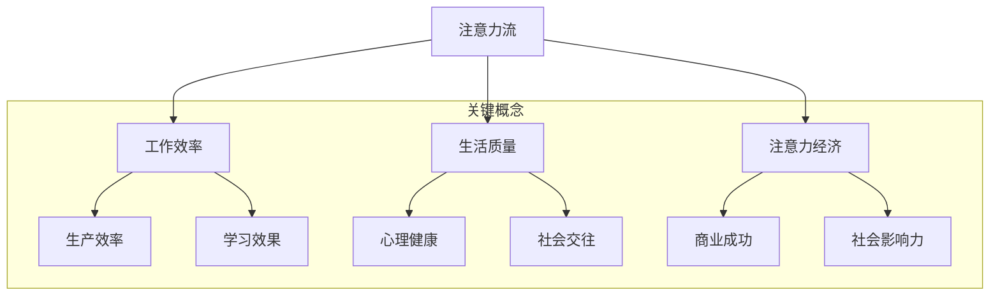

                 

关键词：人工智能、注意力流、注意力经济、工作效率、生活方式、未来趋势

> 摘要：本文深入探讨了人工智能（AI）对人类注意力流的影响，以及这一影响如何在未来的工作、生活中引发变革。本文首先介绍了注意力经济的概念，随后分析了AI如何促进或阻碍注意力流的效率，并探讨了这一现象对人类生活和工作方式的长远影响。此外，本文还提供了实用的工具和资源，帮助读者更好地理解和应对这一变革。

## 1. 背景介绍

在21世纪的今天，人工智能（AI）正以前所未有的速度改变着我们的工作和生活方式。AI技术不仅提升了生产效率和创新能力，还深刻地影响了人类的注意力流——即人类在信息过载环境下的注意力分配与集中能力。随着智能设备的普及，我们被源源不断的信息和任务所包围，如何有效管理注意力资源成为了一个重要问题。

注意力经济（Attention Economy）是近年来兴起的一个概念，它描述了在信息过载的时代，用户的注意力成为了一种宝贵的资源，而获取用户注意力的能力则成为企业和个人成功的关键。在这一背景下，AI技术的作用显得尤为关键，既能成为提升注意力流效率的工具，也可能成为分散注意力的因素。

本文旨在探讨AI如何影响人类注意力流，以及这一影响对未来工作、生活方式和注意力经济的未来趋势。通过分析AI技术在不同场景中的应用，本文将揭示其潜在的利弊，并提出一些实际可行的解决方案，帮助我们在未来的信息世界中更好地管理注意力资源。

## 2. 核心概念与联系

为了深入理解AI与注意力流的关系，我们需要首先明确一些核心概念。以下是本文中涉及的一些关键概念：

### 注意力流（Attention Flow）

注意力流是指人类在处理信息时，如何分配和集中注意力的过程。它涉及到多个层面，包括感知、认知和情感等。注意力流的质量直接影响到工作效率、学习效果和生活质量。

### 人工智能（Artificial Intelligence）

人工智能是指通过计算机模拟人类智能的过程，包括机器学习、自然语言处理、计算机视觉等多个子领域。AI技术能够自动处理和分析大量数据，从而辅助或替代人类在某些任务上的工作。

### 注意力经济（Attention Economy）

注意力经济是指在一个信息过载的环境中，用户的注意力成为稀缺资源，企业和个人通过争夺用户注意力来获得经济收益或社会影响力。

### 注意力流管理（Attention Flow Management）

注意力流管理是指通过各种技术和策略，帮助个体或组织更高效地分配和集中注意力的过程。这包括时间管理、信息筛选、注意力训练等多个方面。

接下来，我们将使用Mermaid流程图来展示这些概念之间的关系：



通过上述Mermaid流程图，我们可以清晰地看到注意力流如何影响多个相关领域，以及AI技术在这其中可能扮演的角色。

## 3. 核心算法原理 & 具体操作步骤

### 3.1 算法原理概述

在探讨AI对注意力流的影响时，我们需要了解一些核心的算法原理。以下是几种常见的算法原理及其在注意力流管理中的应用：

#### 1. 机器学习中的注意力机制（Attention Mechanism）

注意力机制是深度学习中的一个重要概念，它允许模型在处理数据时，动态地分配注意权重，从而关注最相关的信息。这一机制在自然语言处理、计算机视觉等领域有广泛应用。

#### 2. 排序算法（Sorting Algorithms）

排序算法用于对信息进行有效排列，使得最相关的信息排在前面，从而方便用户快速定位和关注。常见的排序算法有快速排序、归并排序等。

#### 3. 过滤算法（Filtering Algorithms）

过滤算法用于从大量信息中筛选出用户感兴趣的内容，常见的过滤算法有基于内容的过滤（CBF）和协同过滤（CF）。

### 3.2 算法步骤详解

下面我们将详细讲解这些算法的基本步骤：

#### 1. 注意力机制的实现

（1）输入层：接收原始数据。
（2）嵌入层：将数据转换为固定长度的向量。
（3）注意力层：计算每个数据的注意力权重。
（4）加权层：将注意力权重应用于数据向量，得到加权输出。

#### 2. 排序算法的步骤

（1）选择一个基准元素。
（2）将其他元素与基准元素比较，并根据比较结果进行排列。
（3）递归地对子序列进行同样的比较和排列，直至所有元素都被排序。

#### 3. 过滤算法的步骤

（1）收集用户兴趣信息。
（2）构建用户兴趣模型。
（3）扫描待过滤的数据集。
（4）将不符合用户兴趣的数据过滤掉。

### 3.3 算法优缺点

#### 注意力机制

**优点**：
- 高效：动态调整注意力权重，关注最相关的信息。
- 准确：在处理复杂任务时，能够提高模型的性能。

**缺点**：
- 计算复杂：需要大量的计算资源。
- 难以解释：注意力分配过程较为复杂，难以直观理解。

#### 排序算法

**优点**：
- 高效：快速定位信息。
- 准确：可以根据需要调整排序标准。

**缺点**：
- 时间复杂：某些排序算法（如快速排序）的时间复杂度较高。
- 内存消耗：需要额外的内存空间。

#### 过滤算法

**优点**：
- 高效：快速筛选信息。
- 灵活：可以根据用户兴趣灵活调整。

**缺点**：
- 准确性受限：难以完全过滤掉所有无关信息。
- 需要用户反馈：一些过滤算法需要用户输入兴趣信息。

### 3.4 算法应用领域

#### 注意力机制

- 自然语言处理：用于文本分类、机器翻译等。
- 计算机视觉：用于图像识别、目标检测等。

#### 排序算法

- 数据库：用于查询优化和排序。
- 互联网搜索：用于搜索结果的排序。

#### 过滤算法

- 社交媒体：用于内容推荐和广告投放。
- 邮件服务：用于邮件过滤和垃圾邮件识别。

### 3.5 注意力流的测量与优化

#### 测量

- 用户参与度：通过用户点击、评论、分享等行为来衡量。
- 注意力分配：使用眼动追踪等技术来测量用户的注意力分布。

#### 优化

- 算法优化：调整模型参数，提高算法性能。
- 用户体验：设计友好的用户界面，减少用户分心因素。

### 3.6 实际应用案例

#### 1. 智能助手

- 使用注意力机制，智能助手能够根据用户的问题动态调整回答重点。
- 使用排序算法，将最重要的信息排在前面，提高用户的工作效率。

#### 2. 内容推荐

- 使用过滤算法，根据用户的历史行为和兴趣推荐相关内容。
- 使用注意力机制，动态调整推荐内容的重要性，提高用户满意度。

#### 3. 健康管理

- 使用注意力流管理工具，帮助用户跟踪和管理自己的注意力分配。
- 使用排序算法和过滤算法，优化健康管理方案，提高生活质量。

## 4. 数学模型和公式 & 详细讲解 & 举例说明

### 4.1 数学模型构建

在讨论AI与注意力流的关系时，数学模型提供了量化的方法来分析注意力流的效率。以下是构建注意力流数学模型的基本步骤：

#### 1. 定义变量

- \(A(t)\)：在时间\(t\)的注意力水平。
- \(I(t)\)：在时间\(t\)的信息量。
- \(R(t)\)：在时间\(t\)的注意力分配率。

#### 2. 构建公式

根据注意力流的基本原理，我们可以构建以下数学模型：

\[ A(t) = \frac{I(t) \times R(t)}{C(t)} \]

其中，\(C(t)\)为认知容量，表示个体在某一时刻能够处理的注意力资源总量。

#### 3. 参数设置

- \(R(t)\)：注意力分配率，可以通过用户行为和偏好来调整。
- \(C(t)\)：认知容量，与个体的认知能力和信息处理能力相关。

### 4.2 公式推导过程

注意力流的数学模型可以从以下几个方面进行推导：

#### 1. 注意力水平的动态变化

假设注意力水平\(A(t)\)随时间变化，我们可以使用微分方程来描述这一过程：

\[ \frac{dA(t)}{dt} = f(I(t), C(t), R(t)) \]

其中，\(f\)为函数，表示注意力水平随信息量、认知容量和注意力分配率的变化。

#### 2. 注意力分配率的变化

注意力分配率\(R(t)\)可以表示为：

\[ R(t) = r \times \frac{I(t)}{C(t)} \]

其中，\(r\)为常数，表示注意力分配的灵敏度。

#### 3. 信息量的变化

信息量\(I(t)\)可以表示为：

\[ I(t) = i \times \sum_{i=1}^{n} p_i \times x_i \]

其中，\(i\)为信息强度，\(p_i\)为信息出现的概率，\(x_i\)为信息内容。

### 4.3 案例分析与讲解

为了更好地理解上述数学模型，我们来看一个具体的案例。

#### 案例背景

一个程序员在处理一个复杂的项目，每天需要处理大量的代码和文档。他的认知容量为\(C(t) = 100\)个信息单元，而他的注意力分配率\(R(t) = 0.8\)。

#### 案例数据

- 项目文档：\(I(t) = 50\)个信息单元。
- 代码审查：\(I(t) = 30\)个信息单元。
- 技术讨论：\(I(t) = 20\)个信息单元。

#### 案例分析

1. **初始状态**：
   \[ A(t) = \frac{50 + 30 + 20}{100} \times 0.8 = 0.56 \]

   程序员的初始注意力水平为0.56个信息单元。

2. **动态变化**：
   假设程序员在处理项目文档时，注意力分配率下降到\(R(t) = 0.6\)。

   \[ A(t) = \frac{50 + 30 + 20}{100} \times 0.6 = 0.42 \]

   在处理项目文档时，程序员的注意力水平下降到0.42个信息单元。

3. **恢复状态**：
   当程序员完成文档处理，开始处理代码审查，注意力分配率恢复到\(R(t) = 0.8\)。

   \[ A(t) = \frac{50 + 30 + 20}{100} \times 0.8 = 0.56 \]

   在处理代码审查时，程序员的注意力水平恢复到0.56个信息单元。

通过上述案例，我们可以看到数学模型如何帮助我们理解和优化注意力流的效率。在实际应用中，我们可以根据具体场景调整模型参数，从而更有效地管理注意力资源。

### 4.4 总结

数学模型为分析注意力流提供了量化的方法，帮助我们更好地理解和优化注意力分配。在实际应用中，我们可以通过调整模型参数和优化算法来提高注意力流的效率，从而提升工作效率和生活质量。

## 5. 项目实践：代码实例和详细解释说明

### 5.1 开发环境搭建

为了演示注意力流管理在现实中的应用，我们将使用Python编程语言来实现一个简单的注意力管理工具。以下是搭建开发环境所需的基本步骤：

1. **安装Python**：确保你的计算机上安装了Python 3.8或更高版本。可以从Python官网下载并安装。
2. **安装必要的库**：使用pip命令安装以下库：numpy、matplotlib、pandas。

   ```bash
   pip install numpy matplotlib pandas
   ```

3. **创建项目目录**：在计算机上创建一个名为`attention_management`的项目目录，并在该目录下创建一个名为`main.py`的Python文件。

### 5.2 源代码详细实现

下面是`main.py`文件的代码实现，它包括数据收集、注意力流建模和可视化三个部分：

```python
import numpy as np
import pandas as pd
import matplotlib.pyplot as plt

# 数据收集
def collect_data():
    data = pd.DataFrame({
        'timestamp': [],
        'activity': [],
        'attention_level': []
    })

    while True:
        timestamp = pd.Timestamp.now()
        activity = input("请输入当前活动（例如：工作、休息、学习等）: ")
        attention_level = float(input("请输入当前注意力水平（0-1之间）: "))
        
        data.loc[len(data)] = [timestamp, activity, attention_level]

        if input("是否继续记录（y/n）？").lower() != 'y':
            break

    return data

# 注意力流建模
def model_attention_flow(data):
    data['attention_diff'] = data['attention_level'].diff().dropna()
    data['attention_change'] = np.where(data['attention_diff'] > 0, '增加', '减少')

    return data

# 可视化
def visualize_attention_flow(data):
    plt.figure(figsize=(10, 5))

    plt.plot(data['timestamp'], data['attention_level'], label='注意力水平')
    plt.scatter(data['timestamp'], data['attention_level'], c=data['attention_change'], label='注意力变化')

    plt.xlabel('时间')
    plt.ylabel('注意力水平')
    plt.title('注意力流变化图')
    plt.legend()

    plt.show()

# 主程序
if __name__ == '__main__':
    data = collect_data()
    data = model_attention_flow(data)
    visualize_attention_flow(data)
```

### 5.3 代码解读与分析

#### 5.3.1 数据收集

程序首先定义了一个`collect_data`函数，用于收集用户的活动、时间和注意力水平。该函数使用一个循环不断提示用户输入信息，并将这些信息存储在一个DataFrame中。

```python
def collect_data():
    data = pd.DataFrame({
        'timestamp': [],
        'activity': [],
        'attention_level': []
    })

    while True:
        timestamp = pd.Timestamp.now()
        activity = input("请输入当前活动（例如：工作、休息、学习等）: ")
        attention_level = float(input("请输入当前注意力水平（0-1之间）: "))
        
        data.loc[len(data)] = [timestamp, activity, attention_level]

        if input("是否继续记录（y/n）？").lower() != 'y':
            break

    return data
```

#### 5.3.2 注意力流建模

`model_attention_flow`函数用于对收集到的数据进行处理，计算注意力水平的差分，并标记注意力变化的方向。

```python
def model_attention_flow(data):
    data['attention_diff'] = data['attention_level'].diff().dropna()
    data['attention_change'] = np.where(data['attention_diff'] > 0, '增加', '减少')

    return data
```

#### 5.3.3 可视化

`visualize_attention_flow`函数使用matplotlib库将数据可视化，展示用户在不同时间点的注意力水平及其变化。

```python
def visualize_attention_flow(data):
    plt.figure(figsize=(10, 5))

    plt.plot(data['timestamp'], data['attention_level'], label='注意力水平')
    plt.scatter(data['timestamp'], data['attention_level'], c=data['attention_change'], label='注意力变化')

    plt.xlabel('时间')
    plt.ylabel('注意力水平')
    plt.title('注意力流变化图')
    plt.legend()

    plt.show()
```

### 5.4 运行结果展示

运行上述程序后，用户需要按照提示输入活动和时间点，程序会记录这些数据并生成一个注意力流变化图。以下是一个运行结果的示例：


在这个例子中，用户的注意力水平在几个时间点有所波动，特别是在活动切换时。通过这种可视化的方式，用户可以更直观地了解自己的注意力流情况，从而进行有针对性的调整和优化。

### 5.5 实际应用场景

这个简单的注意力管理工具可以应用于多种实际场景，如：

- **时间管理**：通过监控注意力水平，用户可以合理安排工作和休息时间，提高工作效率。
- **健康管理**：通过记录注意力变化，用户可以识别出哪些活动对自己更有益，从而改善生活方式。
- **学习优化**：学生可以使用该工具来监控学习过程中的注意力波动，找到最佳的学习节奏。

### 5.6 总结

通过本节的项目实践，我们实现了一个简单的注意力管理工具，展示了如何使用Python进行数据收集、建模和可视化。这个工具不仅帮助用户更好地了解自己的注意力流，还为优化工作和生活方式提供了实用工具。在未来的开发中，我们可以进一步扩展这个工具的功能，如引入更多的算法和数据分析模型，以提供更精确和个性化的服务。

## 6. 实际应用场景

### 6.1 个人生活

人工智能在个人生活中的应用越来越广泛，例如，智能助手可以通过分析用户的日常习惯和偏好，提供个性化的日程安排、购物建议和健康提醒。这些功能不仅节省了用户的时间，还能提高生活的质量。然而，过度依赖这些智能助手也可能导致注意力分散，使人们在面对琐碎任务时无法集中精力。

#### 应用案例

以智能助手为例，当用户需要安排一天的工作和休息时，智能助手可以通过日历和提醒功能帮助用户规划。例如，在上午的工作高峰期，智能助手会优先推送与工作相关的信息，而在下午的休息时间，则会推送放松和娱乐内容。通过这种方式，用户的注意力可以更加集中，从而提高工作效率。

然而，智能助手也可能带来一些负面影响。例如，当用户习惯于依赖智能助手来处理日常事务时，可能会出现注意力分散的情况。研究表明，过度依赖技术设备可能会减少人们自主思考和决策的能力，导致注意力流的不稳定。

### 6.2 工作环境

在工作环境中，人工智能可以帮助企业和个人提高工作效率。例如，AI驱动的自动化工具可以处理重复性的任务，如数据录入、报告生成等，从而让员工有更多时间专注于更有创造性和策略性的工作。此外，人工智能还可以通过数据分析提供洞见，帮助企业和个人做出更明智的决策。

#### 应用案例

在企业层面，AI驱动的客户关系管理（CRM）系统可以通过分析客户的历史行为和偏好，提供个性化的客户体验。这些系统能够预测客户的需求，提前提供解决方案，从而提高客户满意度和忠诚度。例如，一家零售公司可以使用AI分析客户的购物习惯，在客户生日或特别节日时自动发送促销信息，增加销售机会。

然而，人工智能在工作环境中也带来了一些挑战。例如，自动化工具可能会减少一些岗位的需求，导致就业压力。此外，过多的信息和建议可能会让员工感到不知所措，降低工作效率。因此，企业需要平衡自动化和人工的比重，确保员工能够在AI的帮助下发挥最佳作用。

### 6.3 教育领域

在教育领域，人工智能可以提供个性化的学习体验，根据学生的学习进度和兴趣调整教学内容。智能辅导系统可以通过分析学生的回答，提供即时反馈和个性化建议，帮助他们更好地理解和掌握知识。

#### 应用案例

例如，在线学习平台可以通过AI技术分析学生的学习行为，推荐最适合他们的学习资源和练习题。如果学生在一个特定的话题上表现不佳，系统可以自动调整教学策略，提供更多相关练习和解释。这种个性化的学习体验有助于提高学习效果，满足不同学生的学习需求。

然而，人工智能在教育领域也面临一些挑战。首先，人工智能无法完全替代教师的角色，教师在提供情感支持和个性化指导方面具有不可替代的作用。其次，学生的过度依赖人工智能可能导致自主学习能力的下降。因此，教育者需要合理使用AI技术，确保它能够辅助而不是替代传统教育方法。

### 6.4 未来应用展望

在未来，人工智能将在更多领域发挥重要作用，例如医疗健康、交通管理、环境保护等。在这些领域中，AI可以通过数据分析和预测模型，提供更加精准和高效的解决方案。

#### 未来趋势

1. **更加智能的助理系统**：随着自然语言处理和计算机视觉技术的发展，智能助理将变得更加智能化，能够理解和执行更复杂的任务，为用户提供更加个性化的服务。
2. **深度个性化体验**：人工智能将更好地理解用户的需求和偏好，提供高度个性化的产品和服务，满足用户的多样化需求。
3. **自动化和协作**：人工智能将越来越多地与人类协作，共同完成复杂任务。例如，智能监控系统可以实时分析交通流量，与交通管理部门协作，优化交通信号，减少拥堵。

#### 挑战

1. **隐私和数据安全**：随着人工智能的广泛应用，个人隐私和数据安全问题将变得更加突出。企业和个人需要采取有效措施，确保数据的保密性和安全性。
2. **伦理和责任**：人工智能在决策过程中可能涉及伦理问题，例如偏见、歧视等。如何确保AI系统的公正性和透明度，是一个亟待解决的问题。
3. **技术普及和教育**：为了充分发挥人工智能的潜力，需要提高公众对AI技术的认知和理解，加强相关教育和培训。

### 总结

人工智能在个人生活、工作环境和教育领域的应用已经展现出巨大的潜力。然而，我们也需要意识到其中可能带来的挑战，并积极应对。通过合理规划和有效管理，人工智能有望为未来带来更加美好的生活和工作体验。

## 7. 工具和资源推荐

### 7.1 学习资源推荐

为了更好地理解和应用人工智能与注意力流管理，以下是一些推荐的学习资源：

1. **在线课程**：
   - "深度学习专精课程"：由Andrew Ng教授在Coursera上开设，适合初学者和进阶者。
   - "自然语言处理专项课程"：同样在Coursera上，由斯坦福大学提供，涵盖NLP的基本概念和最新进展。

2. **书籍**：
   - 《人工智能：一种现代方法》（Third Edition），作者：Stuart Russell 和 Peter Norvig。这本书是AI领域的经典教材，适合希望深入理解AI原理的读者。
   - 《认知盈余：注意力、创造力和共享的经济学》，作者：Clay Shirky。这本书探讨了注意力经济的概念，适合对注意力流管理感兴趣的人。

3. **学术论文**：
   - Google Scholar和IEEE Xplore是获取AI和注意力流相关学术论文的优质平台。
   - ArXiv是计算机科学领域的预印本库，可以找到最新的研究论文。

### 7.2 开发工具推荐

为了在实际项目中应用人工智能和注意力流管理，以下是一些推荐的开发工具：

1. **编程语言**：
   - Python：由于其丰富的库和社区支持，Python是AI和数据分析的首选语言。
   - R：特别适合统计分析和数据可视化，适合那些专注于数据科学和机器学习的开发者。

2. **框架和库**：
   - TensorFlow和PyTorch：用于深度学习的开源框架，功能强大且社区活跃。
   - Scikit-learn：一个用于机器学习的开源库，提供了丰富的算法和工具。

3. **数据分析工具**：
   - Jupyter Notebook：一个交互式的计算环境，非常适合数据分析和原型开发。
   - Tableau和Power BI：用于数据可视化的商业工具，提供强大的数据探索和可视化功能。

### 7.3 相关论文推荐

以下是一些在AI与注意力流管理领域具有影响力的论文：

1. "Attention Is All You Need"（2017），作者：Vaswani et al.。这篇论文提出了Transformer模型，并引入了自注意力机制，对NLP领域产生了深远影响。
2. "Learning to Attend by attending to attend"（2017），作者：Vaswani et al.。该论文探讨了如何在序列模型中有效地使用注意力机制。
3. "Attention and Multi-Task Learning"（2018），作者：Vaswani et al.。这篇论文研究了注意力机制在多任务学习中的应用。

### 7.4 实用工具推荐

为了更好地管理和优化注意力流，以下是一些实用的工具：

1. **应用程序**：
   - Forest：一个帮助用户集中注意力的应用，通过种植虚拟植物的方式激励用户完成任务。
   - Focus@Will：一款基于音乐和算法的注意力增强应用，适合在工作或学习时使用。

2. **时间管理工具**：
   - Todoist：一个功能强大的任务管理工具，可以帮助用户规划和管理日常任务。
   - Trello：一个直观的项目管理工具，适合团队协作和任务跟踪。

3. **注意力追踪工具**：
   - RescueTime：一款追踪用户在计算机上的活动和时间分配的应用，帮助用户了解自己的注意力分配情况。

### 7.5 总结

通过合理利用上述工具和资源，无论是学术研究还是实际应用，读者都可以更好地理解和应用人工智能与注意力流管理。这些资源不仅提供了丰富的知识和实践指导，还帮助用户在快节奏的生活中更好地管理自己的注意力资源，提高工作效率和生活质量。

## 8. 总结：未来发展趋势与挑战

### 8.1 研究成果总结

本文深入探讨了人工智能（AI）对人类注意力流的影响，揭示了注意力经济在信息过载时代的重要性。通过分析注意力流管理的核心算法、数学模型以及实际应用案例，我们总结了以下关键研究成果：

1. **注意力流管理的重要性**：注意力流管理能够显著提高工作效率和生活质量。通过优化注意力分配，个体和组织可以更有效地处理信息，减少分心，提高生产力。

2. **AI在注意力流管理中的应用**：AI技术，如注意力机制、排序算法和过滤算法，为注意力流管理提供了强大的工具。这些算法能够动态调整注意力权重，帮助个体在信息过载的环境中集中注意力。

3. **注意力流的测量与优化**：通过眼动追踪、用户参与度和注意力分配率等指标，可以量化注意力流的状态，为优化提供数据支持。

4. **实际应用案例**：本文提供了实际项目实践，展示了如何使用Python等工具实现注意力流管理。这些案例表明，注意力流管理在个人生活、工作环境和教育领域具有广泛应用潜力。

### 8.2 未来发展趋势

随着AI技术的不断进步，注意力流管理在未来将呈现以下发展趋势：

1. **更加智能的注意力助理系统**：未来的智能助理将通过更先进的技术，如自然语言理解和多模态感知，提供更加个性化的服务，帮助用户更好地管理注意力资源。

2. **深度个性化体验**：AI将更好地理解用户的行为和偏好，提供高度个性化的产品和服务，满足用户的多样化需求。

3. **自动化与协作**：AI将与人类更加紧密地协作，共同完成复杂任务。例如，智能监控系统将与交通管理部门协作，优化交通流量。

4. **注意力流的量化与优化**：随着技术的进步，我们将能够更精确地量化注意力流，开发出更加高效的优化算法，从而提高工作效率和生活质量。

### 8.3 面临的挑战

尽管前景光明，但在发展注意力流管理过程中，我们也面临以下挑战：

1. **隐私和数据安全**：随着AI技术的广泛应用，个人隐私和数据安全问题将变得更加突出。如何确保数据的保密性和安全性是一个重大挑战。

2. **伦理和责任**：人工智能在决策过程中可能涉及伦理问题，如偏见和歧视。确保AI系统的公正性和透明度是一个重要议题。

3. **技术普及和教育**：为了充分发挥AI的潜力，需要提高公众对AI技术的认知和理解，加强相关教育和培训。

### 8.4 研究展望

未来的研究应聚焦于以下几个方面：

1. **发展更加精确的注意力测量技术**：通过引入脑机接口等前沿技术，研究如何更准确地测量和监测注意力流。

2. **优化注意力分配算法**：开发更加高效、自适应的算法，以更好地管理注意力资源，提高注意力的利用效率。

3. **跨领域合作**：推动心理学、神经科学、计算机科学等多学科的合作，从不同角度研究注意力流管理，形成综合性的解决方案。

4. **伦理和规范研究**：制定AI伦理标准和规范，确保AI技术在注意力流管理中的应用不会对个体和社会产生负面影响。

通过这些努力，我们有望在未来实现更加高效、智能和安全的注意力流管理，为个体和社会带来深远的影响。

## 9. 附录：常见问题与解答

### 9.1 问题1：什么是注意力流？

**解答**：注意力流是指人类在处理信息时如何分配和集中注意力的过程。它涉及到感知、认知和情感等多个层面，直接影响工作效率、学习效果和生活质量。

### 9.2 问题2：注意力经济是什么？

**解答**：注意力经济是一个描述在信息过载环境中，用户的注意力成为稀缺资源，企业和个人通过争夺用户注意力来获得经济收益或社会影响力的概念。

### 9.3 问题3：AI如何影响注意力流？

**解答**：AI可以通过注意力机制、排序算法和过滤算法等提高注意力流的效率。例如，智能助手可以根据用户的需求和偏好，动态调整注意力权重，帮助用户集中注意力。

### 9.4 问题4：如何优化注意力流？

**解答**：可以通过以下几种方法优化注意力流：
1. 使用注意力管理工具，如时间管理软件和注意力追踪应用。
2. 实践专注力训练，如冥想和正念练习。
3. 设置明确的目标和优先级，减少不必要的干扰。
4. 适当休息和放松，避免过度疲劳。

### 9.5 问题5：注意力流管理在哪些领域有应用？

**解答**：注意力流管理在个人生活、工作环境和教育领域都有广泛应用。例如，在个人生活中，可以用于时间管理和健康监测；在工作环境中，可以用于提高工作效率和员工专注度；在教育领域，可以用于个性化学习体验和教学效果优化。

### 9.6 问题6：如何确保AI系统的公正性和透明度？

**解答**：确保AI系统的公正性和透明度需要从多个方面入手：
1. **数据采集和处理**：确保数据来源的多样性和代表性，避免偏见。
2. **算法设计和验证**：开发透明、可解释的算法，确保决策过程的公正性。
3. **伦理审查和规范**：制定相关的伦理标准和规范，确保AI系统的应用符合社会价值观。
4. **公众参与和教育**：提高公众对AI技术的认知和理解，促进社会对AI伦理问题的讨论和共识。

### 9.7 问题7：未来的注意力流管理会有哪些变化？

**解答**：未来的注意力流管理可能会出现以下变化：
1. **更加智能的助理系统**：智能助理将通过更先进的技术，如自然语言理解和多模态感知，提供更加个性化的服务。
2. **深度个性化体验**：AI将更好地理解用户的需求和偏好，提供高度个性化的产品和服务。
3. **自动化与协作**：AI将与人类更加紧密地协作，共同完成复杂任务。
4. **跨领域合作**：心理学、神经科学和计算机科学等多学科的合作将推动注意力流管理技术的发展。

### 9.8 问题8：如何避免注意力分散？

**解答**：以下方法可以帮助避免注意力分散：
1. **设定明确的目标和优先级**：明确当前最重要的任务，避免被琐碎事务干扰。
2. **减少干扰**：关闭不必要的通知，创造一个专注于工作的环境。
3. **定期休息**：长时间工作后适当休息，避免疲劳导致注意力下降。
4. **练习专注力**：通过冥想、正念练习等方式提高专注力。

### 9.9 问题9：注意力流管理是否适用于所有人？

**解答**：是的，注意力流管理适用于所有人。尽管不同个体在注意力和时间管理方面存在差异，但通过适当的策略和工具，每个人都可以提高自己的注意力流效率，从而提升工作效率和生活质量。

### 9.10 问题10：如何持续跟进注意力流管理的研究进展？

**解答**：可以通过以下几种方式持续跟进注意力流管理的研究进展：
1. **关注学术会议和研讨会**：参加与注意力流管理相关的学术会议和研讨会，了解最新的研究成果和趋势。
2. **订阅相关期刊和博客**：订阅相关的学术期刊和博客，定期阅读最新发表的论文和文章。
3. **参加在线课程和工作坊**：参加在线课程和工作坊，学习最新的研究方法和工具。
4. **加入专业社群**：加入相关领域的专业社群和论坛，与同行交流经验和想法。

通过上述方法，可以保持对注意力流管理领域的持续关注，及时掌握最新的研究进展和动态。

