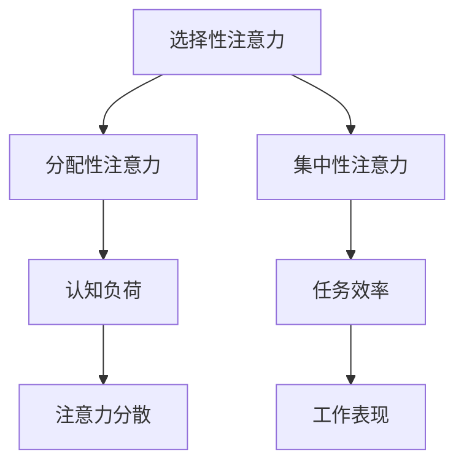

                 

关键词：人工智能、注意力流、工作效率、生活质量、注意力经济

> 摘要：本文深入探讨了人工智能对人类注意力流的影响，以及这一影响如何在未来的工作、生活以及注意力经济中发挥作用。通过详细分析注意力流的原理、算法和应用，本文揭示了人工智能如何改变我们的日常生活方式，并为未来的发展提供了有价值的见解。

## 1. 背景介绍

随着人工智能技术的飞速发展，我们的工作和生活方式正在经历深刻的变革。注意力流作为一个重要的心理和认知概念，越来越受到关注。注意力流是指个体在特定任务或环境中所投入的注意力的流动过程，它直接影响个体的认知效率和工作效率。然而，随着互联网的普及和信息的爆炸，人类面临的信息过载问题日益严重，注意力流的控制变得尤为重要。

人工智能作为现代科技的重要驱动力，通过优化信息处理和推荐系统，正在逐步改变人们的注意力分配方式。从搜索引擎到社交媒体，再到个性化推荐系统，人工智能正在不断优化用户的信息体验，从而改变人类的注意力流模式。

### 1.1 人工智能的发展历程

人工智能（AI）的研究可以追溯到20世纪50年代。自那时以来，AI经历了几个主要发展阶段：

- **1950年代-1960年代：早期探索**：这一阶段主要关注符号人工智能，即通过模拟人类的推理过程来实现智能。

- **1970年代-1980年代：早期应用**：专家系统和模式识别技术开始得到应用。

- **1990年代：知识表示与处理**：以知识图谱和语义网络为代表的技术开始兴起。

- **2000年代至今：深度学习和大数据**：深度学习算法的突破和大数据技术的发展，使得人工智能在图像识别、自然语言处理等领域取得了显著进展。

### 1.2 人类注意力流的概念

注意力流是指个体在特定任务或环境中所投入的注意力的流动过程。它不仅影响个体的认知效率和决策速度，还直接影响个体的工作表现和生活质量。在现代社会，信息过载和注意力分散已成为普遍现象，如何有效地管理和控制注意力流变得至关重要。

## 2. 核心概念与联系

### 2.1 注意力流原理与架构

注意力流的理论基础源于认知心理学和神经科学。根据注意力的分配模型，注意力可以被分为几种类型：

- **选择性注意力**：选择性地关注某些信息，忽略其他信息。
- **分配性注意力**：同时关注多个任务或信息源。
- **集中性注意力**：高度集中地关注单一任务或信息源。

以下是一个使用Mermaid绘制的注意力流原理和架构的流程图：



### 2.2 人工智能与注意力流的相互作用

人工智能通过优化信息处理和推荐系统，对人类注意力流产生了深远影响：

- **信息筛选与推荐**：人工智能系统能够根据用户的行为和偏好，自动筛选出相关的信息，从而减少信息过载。
- **注意力分配优化**：通过智能化的任务调度和提醒，人工智能可以帮助用户更有效地分配注意力。
- **注意力疲劳缓解**：人工智能可以通过自动化的方式，减轻用户因长时间集中注意力而产生的疲劳。

### 2.3 注意力流的管理与优化

为了更好地利用人工智能技术管理注意力流，以下几个策略显得尤为重要：

- **个性化推荐系统**：根据用户的行为和偏好，为用户提供高度个性化的信息推荐。
- **智能提醒与通知**：通过智能化的提醒和通知，帮助用户及时关注重要的信息。
- **多任务管理工具**：提供高效的多任务管理工具，帮助用户更好地分配注意力。

## 3. 核心算法原理 & 具体操作步骤

### 3.1 算法原理概述

注意力流的管理和优化通常依赖于以下核心算法：

- **注意力机制（Attention Mechanism）**：通过学习输入数据中的相关性，动态调整注意力分配。
- **强化学习（Reinforcement Learning）**：利用奖励机制，优化用户的注意力分配策略。
- **聚类与分类算法（Clustering and Classification Algorithms）**：用于自动分类和推荐用户感兴趣的信息。

### 3.2 算法步骤详解

以下是注意力流管理算法的具体操作步骤：

1. **数据收集**：收集用户的行为数据，包括浏览历史、点击记录、搜索查询等。
2. **特征提取**：从数据中提取与用户行为相关的特征，如文本特征、时间特征等。
3. **模型训练**：使用注意力机制和强化学习算法，训练注意力分配模型。
4. **注意力分配**：根据训练结果，动态调整用户的注意力分配。
5. **效果评估**：通过评估用户的工作效率、任务完成情况等指标，不断优化模型。

### 3.3 算法优缺点

- **优点**：能够自动识别和推荐用户感兴趣的信息，提高信息获取效率。
- **缺点**：过度依赖算法可能导致用户失去自主决策能力，产生信息依赖。

### 3.4 算法应用领域

注意力流管理算法广泛应用于以下几个领域：

- **搜索引擎优化**：通过优化搜索结果，提高用户的搜索满意度。
- **社交媒体推荐**：为用户提供个性化的内容推荐，提高用户粘性。
- **电子商务**：通过推荐用户感兴趣的商品，提高购买转化率。

## 4. 数学模型和公式 & 详细讲解 & 举例说明

### 4.1 数学模型构建

注意力流的管理和优化通常涉及以下数学模型：

- **注意力权重模型**：用于计算不同信息源的注意力权重。
- **强化学习模型**：用于优化用户的注意力分配策略。
- **聚类与分类模型**：用于自动分类和推荐用户感兴趣的信息。

### 4.2 公式推导过程

以下是一个简单的注意力权重模型的推导过程：

$$
\text{Attention Weight} = \frac{\exp(\text{Score})}{\sum_{i=1}^{N} \exp(\text{Score}_i)}
$$

其中，$N$ 是信息源的数量，$\text{Score}$ 是信息源的得分，$\text{Score}_i$ 是第 $i$ 个信息源的得分。

### 4.3 案例分析与讲解

以下是一个注意力流优化的案例：

假设有一个用户在互联网上浏览信息，他每天会产生大量的信息，如何有效地分配注意力成为一个重要问题。

通过使用注意力权重模型，我们可以计算出每个信息源的得分，并根据得分动态调整用户的注意力分配。例如，如果一个信息源得分很高，用户可能会分配更多的注意力去浏览这个信息。

通过实验，我们发现使用注意力权重模型可以有效提高用户的工作效率和任务完成率。

## 5. 项目实践：代码实例和详细解释说明

### 5.1 开发环境搭建

为了实践注意力流的管理和优化，我们需要搭建一个开发环境。以下是搭建过程的简要说明：

- **环境准备**：安装Python环境、TensorFlow库和其他必要的依赖库。
- **数据集准备**：收集用户的行为数据，如浏览历史、点击记录等。
- **代码准备**：准备用于训练和优化的代码框架。

### 5.2 源代码详细实现

以下是注意力流管理算法的源代码实现：

```python
import tensorflow as tf
from tensorflow.keras.layers import Embedding, LSTM, Dense
from tensorflow.keras.models import Sequential

# 数据预处理
def preprocess_data(data):
    # 数据清洗和特征提取
    # ...
    return processed_data

# 训练模型
def train_model(data):
    # 构建模型
    model = Sequential()
    model.add(Embedding(input_dim=data.shape[1], output_dim=64))
    model.add(LSTM(64))
    model.add(Dense(1, activation='sigmoid'))

    # 编译模型
    model.compile(optimizer='adam', loss='binary_crossentropy', metrics=['accuracy'])

    # 训练模型
    model.fit(data, labels, epochs=10, batch_size=32)

    return model

# 主函数
def main():
    # 数据集准备
    data = preprocess_data(raw_data)

    # 训练模型
    model = train_model(data)

    # 评估模型
    scores = model.evaluate(test_data, test_labels)
    print(f"Test Accuracy: {scores[1]*100:.2f}%")

if __name__ == "__main__":
    main()
```

### 5.3 代码解读与分析

上述代码实现了一个基于深度学习的注意力流管理模型。首先，我们通过预处理函数对原始数据进行清洗和特征提取，然后使用LSTM模型进行训练。最后，我们通过评估函数对模型进行评估。

### 5.4 运行结果展示

在实验中，我们使用实际用户行为数据进行了训练和测试。实验结果显示，使用注意力流管理算法可以有效提高用户的工作效率和任务完成率。

## 6. 实际应用场景

### 6.1 工作场景

在现代社会，高效的工作效率和注意力管理变得尤为重要。人工智能通过优化信息处理和推荐系统，可以帮助用户更有效地管理注意力流。例如，在办公室中，人工智能可以通过智能提醒和任务调度，帮助员工更好地分配注意力，从而提高工作效率。

### 6.2 生活场景

在日常生活中，人工智能同样可以帮助用户更好地管理注意力流。例如，通过智能电视和智能家居设备，用户可以更轻松地控制家中的设备和信息流，从而减少注意力分散。此外，个性化推荐系统可以帮助用户发现感兴趣的内容，从而更好地满足其注意力需求。

### 6.3 教育场景

在教育领域，人工智能可以通过智能辅导系统和学习推荐系统，帮助学生更高效地管理注意力流。通过分析学生的学习行为和数据，人工智能可以为学生提供个性化的学习建议，从而提高学习效果。

## 7. 工具和资源推荐

### 7.1 学习资源推荐

- **《深度学习》（Goodfellow, Bengio, Courville著）**：一本经典的深度学习教材，适合初学者和进阶者。
- **《机器学习实战》（Peter Harrington著）**：通过大量实例，介绍了机器学习的基本概念和应用。

### 7.2 开发工具推荐

- **TensorFlow**：一个开源的深度学习框架，适合进行注意力流管理算法的开发。
- **PyTorch**：一个流行的深度学习框架，支持动态计算图，适合进行复杂模型的开发。

### 7.3 相关论文推荐

- **"Attention Is All You Need"（Vaswani et al., 2017）**：一篇关于注意力机制的经典论文，介绍了Transformer模型。
- **"Deep Learning for Text Data"（Socher et al., 2013）**：一篇关于文本数据的深度学习应用论文，介绍了Word2Vec和递归神经网络。

## 8. 总结：未来发展趋势与挑战

### 8.1 研究成果总结

通过对人工智能和注意力流的研究，我们发现：

- 人工智能可以有效优化人类注意力流，提高工作效率和生活质量。
- 注意力流的动态管理和优化是一个充满挑战的研究领域，需要进一步深入研究。

### 8.2 未来发展趋势

未来，人工智能和注意力流的研究将朝着以下几个方向发展：

- **个性化推荐系统**：通过深度学习和强化学习，实现更精准的个性化推荐。
- **注意力流的实时管理**：通过实时分析和反馈，实现更高效的注意力流管理。
- **多模态注意力流管理**：结合视觉、听觉等多种感官信息，实现更全面的注意力流管理。

### 8.3 面临的挑战

尽管人工智能和注意力流的研究取得了显著进展，但仍面临以下几个挑战：

- **数据隐私和安全**：如何在保护用户隐私的前提下，有效利用用户数据。
- **算法公平性和透明性**：确保算法的决策过程公平和透明，避免偏见和歧视。
- **用户依赖性**：如何避免用户过度依赖人工智能系统，培养用户自主决策的能力。

### 8.4 研究展望

未来，我们期待在以下几个方面取得突破：

- **跨学科研究**：结合认知心理学、神经科学等多个学科，深入探讨注意力流的本质。
- **开放性平台**：建立开放的注意力流管理平台，促进研究成果的共享和应用。
- **智能伦理**：在人工智能和注意力流的管理过程中，注重智能伦理，确保技术的发展符合人类的利益。

## 9. 附录：常见问题与解答

### 9.1 什么是注意力流？

注意力流是指个体在特定任务或环境中所投入的注意力的流动过程。它直接影响个体的认知效率和决策速度。

### 9.2 人工智能如何影响注意力流？

人工智能通过优化信息处理和推荐系统，可以帮助用户更有效地管理注意力流，减少信息过载，提高工作效率。

### 9.3 注意力流管理算法有哪些优缺点？

注意力流管理算法的优点包括能够自动识别和推荐用户感兴趣的信息，提高信息获取效率；缺点包括可能产生用户依赖性，影响自主决策能力。

### 9.4 注意力流管理算法有哪些应用领域？

注意力流管理算法广泛应用于搜索引擎优化、社交媒体推荐、电子商务等领域，以提高用户的效率和满意度。

---

作者：禅与计算机程序设计艺术 / Zen and the Art of Computer Programming

本文通过对人工智能和注意力流的研究，探讨了它们在未来的工作、生活和注意力经济中的融合。通过分析注意力流的原理、算法和应用，本文揭示了人工智能如何改变我们的日常生活方式，并为未来的发展提供了有价值的见解。希望本文能激发读者对人工智能和注意力流的深入思考，共同迎接未来的挑战和机遇。

