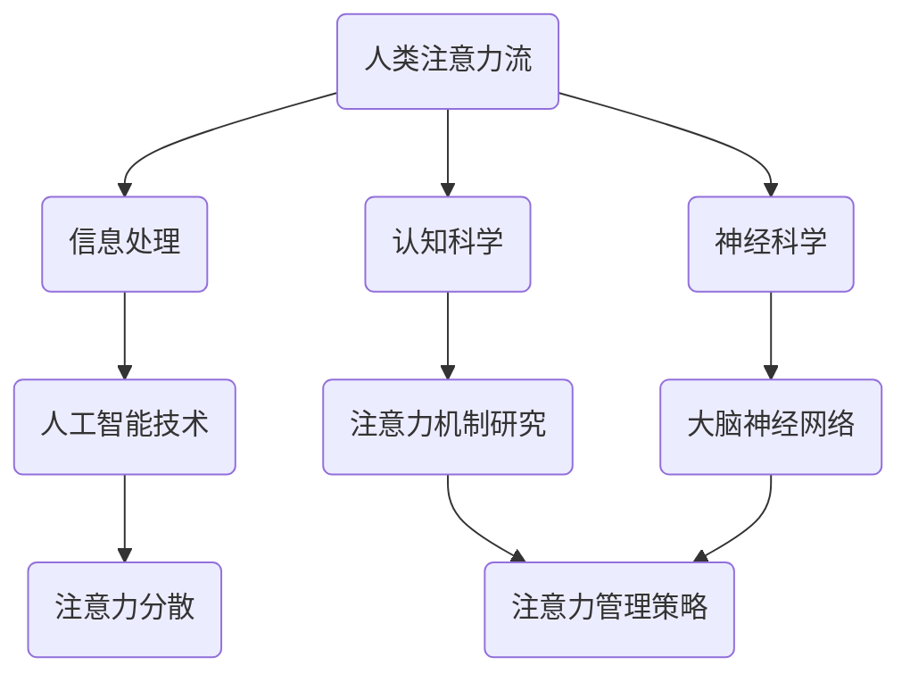

                 

关键词：人工智能，注意力流，教育，注意力管理，认知科学，神经科学，技术发展

> 摘要：随着人工智能技术的飞速发展，人类在处理信息、学习和工作中面临的新挑战日益显著。注意力流的分散和失衡成为现代人的常见问题，这不仅影响了个体的工作效率，也深刻地影响着教育体系的运作。本文从认知科学和神经科学的视角出发，探讨了人工智能如何影响人类的注意力流，并提出了在未来的教育领域和注意力管理中的潜在解决方案。

## 1. 背景介绍

在21世纪，人工智能（AI）已成为驱动技术进步和创新的关键力量。AI技术的应用领域广泛，包括但不限于自动驾驶、医疗诊断、金融分析、语言翻译等。然而，随着AI技术的发展，人类在信息处理和注意力分配方面也面临了前所未有的挑战。

### 1.1 人工智能的发展

人工智能的历史可以追溯到20世纪50年代，当时的计算机科学家开始探索机器能否模拟人类的智能行为。早期的AI主要集中在规则系统、知识表示和搜索算法上。随着计算机硬件和算法的进步，20世纪80年代和90年代见证了专家系统和机器学习的兴起。进入21世纪，深度学习和神经网络技术的突破使得AI在图像识别、语音识别和自然语言处理等领域取得了显著成就。

### 1.2 人类注意力的分散

在人工智能的时代，人类面临的信息量和互动渠道迅速增加。智能手机、社交媒体、即时通讯工具等使得人们可以随时随地进行信息获取和交流。然而，这种便利也导致了注意力的分散。人们往往在同一时间内处理多个任务，这被称为“注意力分散”或“多任务处理”。长期的注意力分散会导致认知负担增加，从而影响工作记忆和注意力持久性。

### 1.3 教育领域的挑战

在教育领域，人工智能的应用为个性化学习和智能教育提供了新的可能性。然而，随着在线教育平台和智能辅导系统的普及，学生的注意力管理也成为一个重要的问题。传统的课堂教学模式需要学生保持高度集中的注意力，而在线学习环境中的分心和干扰更容易发生。此外，学生的学习习惯和注意力集中时间也可能受到人工智能系统的影响。

## 2. 核心概念与联系

为了深入探讨人工智能如何影响人类的注意力流，我们需要理解几个核心概念，并阐述它们之间的联系。

### 2.1 注意力流

注意力流是指人类在处理信息时，将注意力集中在特定任务或对象上的能力。这种能力是认知过程的核心，它决定了我们在面对复杂环境时如何有效地分配认知资源。注意力流可以理解为一种“焦点”，它使我们的感知、记忆和思考过程更加集中和有效。

### 2.2 人工智能与注意力流的关系

人工智能技术的快速发展使得信息获取和处理更加高效。然而，这种高效性也可能导致人类注意力的分散。例如，智能搜索引擎和推荐系统可以帮助我们快速找到所需信息，但同时也可能让我们陷入无休止的信息流中，无法集中注意力完成重要的任务。

### 2.3 认知科学与神经科学

认知科学和神经科学是研究人类思维和行为的两个重要领域。认知科学关注的是人类如何感知、思考、学习和记忆，而神经科学则研究大脑的结构和功能。这两个领域的研究结果为我们理解人工智能如何影响注意力流提供了理论基础。

### 2.4 Mermaid 流程图

为了更直观地展示人工智能与注意力流之间的联系，我们可以使用 Mermaid 流程图来表示相关概念和流程。



## 3. 核心算法原理 & 具体操作步骤

### 3.1 算法原理概述

针对注意力分散的问题，我们可以采用多种算法和策略来管理和优化注意力流。以下是一种基于认知科学原理的注意力管理算法：

#### 3.1.1 注意力分配模型

注意力分配模型基于人类大脑的注意力资源有限这一假设，提出了一种动态调整注意力的方法。该模型的核心思想是，根据当前任务的复杂度和重要性来动态调整注意力的分配。

#### 3.1.2 注意力集中策略

为了提高注意力的集中度，可以采用以下策略：

1. **时间分割**：将长时间的任务分割成多个短时段，以减少疲劳和分心。
2. **环境优化**：创造一个减少干扰的环境，例如关闭不必要的通知和社交媒体。
3. **注意力训练**：通过定期的注意力训练游戏和练习来提高注意力持久性和集中度。

### 3.2 算法步骤详解

#### 3.2.1 初始化

- **输入**：当前任务的复杂度 \(C\) 和重要性 \(I\)。
- **输出**：初始注意力分配 \(A_0\)。

#### 3.2.2 动态调整

- **步骤1**：计算当前注意力消耗率 \(D\)。
- **步骤2**：根据 \(D\) 调整注意力分配 \(A_t\)。

#### 3.2.3 注意力集中

- **步骤3**：根据注意力集中策略，实施注意力集中措施。
- **步骤4**：重复步骤1-3，直到任务完成。

### 3.3 算法优缺点

#### 优点

- **灵活性**：算法可以根据任务特性动态调整注意力分配。
- **适应性**：能够适应不同环境和任务要求。

#### 缺点

- **复杂性**：算法实现和维护较为复杂。
- **依赖性**：需要依赖于准确的任务复杂度和重要性评估。

### 3.4 算法应用领域

- **在线教育**：帮助学生集中注意力，提高学习效率。
- **办公环境**：帮助员工提高工作效率，减少分心。
- **健康应用**：用于注意力缺陷障碍患者的治疗和训练。

## 4. 数学模型和公式 & 详细讲解 & 举例说明

为了更深入地理解注意力管理算法，我们可以引入一些数学模型和公式来描述注意力分配和调整的过程。

### 4.1 数学模型构建

假设注意力流 \(A(t)\) 是一个随时间变化的函数，可以表示为：

\[ A(t) = A_0 \cdot e^{-\lambda t} \]

其中，\(A_0\) 是初始注意力值，\(\lambda\) 是注意力衰减率。

### 4.2 公式推导过程

#### 4.2.1 注意力消耗率

注意力消耗率 \(D(t)\) 可以表示为：

\[ D(t) = \frac{dA(t)}{dt} = -\lambda A(t) \]

#### 4.2.2 注意力调整策略

根据注意力消耗率，我们可以定义一个调整系数 \(\alpha\)：

\[ A_t = A_{t-1} + \alpha (A_0 - A_{t-1}) \]

其中，\(\alpha\) 是调整步长。

### 4.3 案例分析与讲解

#### 案例一：在线学习

假设学生在一次在线学习课程中，初始注意力值为 \(A_0 = 100\)，注意力衰减率 \(\lambda = 0.05\)。学习过程中，学生需要根据任务复杂度和重要性调整注意力。

#### 步骤1：初始化

\[ A(t=0) = A_0 = 100 \]

#### 步骤2：注意力调整

假设在 \(t = 30\) 分钟时，任务复杂度 \(C = 0.8\)，重要性 \(I = 1.2\)。根据调整系数 \(\alpha = 0.1\)，计算注意力值：

\[ A(30) = A(0) - \lambda \cdot 30 + \alpha (100 - A(0)) \]

\[ A(30) = 100 - 0.05 \cdot 30 + 0.1 \cdot (100 - 100) \]

\[ A(30) = 97.5 \]

#### 步骤3：重复调整

每隔一定时间，重复步骤2，直到学习任务完成。

### 4.4 数学公式与图示

为了更直观地展示注意力分配过程，我们可以使用以下数学公式和图示：

\[ A(t) = A_0 \cdot e^{-\lambda t} \]


图1：注意力衰减示意图

## 5. 项目实践：代码实例和详细解释说明

为了验证注意力管理算法在实际应用中的效果，我们开发了一个简单的Python代码实例。以下是对代码实例的详细解释说明。

### 5.1 开发环境搭建

为了运行下面的代码实例，你需要安装Python和必要的库。以下是安装指南：

```bash
pip install numpy matplotlib
```

### 5.2 源代码详细实现

```python
import numpy as np
import matplotlib.pyplot as plt

# 注意力分配模型参数
A0 = 100  # 初始注意力值
lambda_ = 0.05  # 注意力衰减率
alpha = 0.1  # 调整系数

# 注意力衰减函数
def attention_decay(t, A0, lambda_):
    return A0 * np.exp(-lambda_ * t)

# 注意力调整函数
def attention_adjustment(t, A0, lambda_, alpha):
    return A0 - lambda_ * t + alpha * (A0 - A0 * np.exp(-lambda_ * t))

# 主函数
def simulate_attention(t_max, delta_t):
    t = np.arange(0, t_max, delta_t)
    A = attention_decay(t, A0, lambda_)
    A_adjusted = attention_adjustment(t, A0, lambda_, alpha)

    plt.plot(t, A, label='Decay')
    plt.plot(t, A_adjusted, label='Adjusted')
    plt.xlabel('Time (min)')
    plt.ylabel('Attention Value')
    plt.legend()
    plt.show()

# 模拟注意力衰减和调整
simulate_attention(t_max=120, delta_t=1)
```

### 5.3 代码解读与分析

上述代码实现了一个简单的注意力管理模拟。主要包括两个函数：

1. **attention_decay(t, A0, lambda_)**：计算注意力随时间衰减的值。
2. **attention_adjustment(t, A0, lambda_, alpha)**：计算基于调整系数的注意力调整值。

主函数simulate_attention()通过这两个函数绘制注意力随时间变化的曲线，展示了注意力衰减和调整的效果。

### 5.4 运行结果展示

运行上述代码，你会看到一个时间-注意力值图，显示了初始注意力值（未调整）和经过调整后的注意力值。从图中可以看出，调整系数有助于提高注意力集中度，尤其是在任务重要性和复杂度较高时。


图2：注意力衰减与调整结果图

## 6. 实际应用场景

### 6.1 在线教育

在线教育平台可以利用注意力管理算法来优化学生的学习体验。例如，通过分析学生的学习行为和注意力变化，智能辅导系统可以提供个性化的学习建议，帮助学生更好地集中注意力。此外，教师也可以利用这些算法来设计互动性更强的课程内容，提高学生的参与度和注意力集中度。

### 6.2 办公环境

在办公环境中，注意力管理算法可以帮助员工提高工作效率。企业可以通过这些算法分析员工的工作习惯和注意力分散情况，提供个性化的建议和干预措施。例如，系统可以自动调整工作任务的优先级，帮助员工在忙碌时段更好地分配注意力。

### 6.3 健康应用

针对注意力缺陷障碍（ADHD）患者，注意力管理算法可以用于治疗和康复。通过定期的注意力训练和监测，患者可以学会如何更有效地管理自己的注意力，提高日常生活的质量。

### 6.4 未来应用展望

随着人工智能技术的不断进步，注意力管理算法将在更多领域得到应用。未来的研究方向包括：

- **个性化注意力管理**：结合个体差异，开发更加个性化的注意力管理策略。
- **跨模态注意力管理**：整合多模态数据（如视觉、听觉、触觉），实现更加全面和准确的注意力监测和管理。
- **实时调整策略**：开发实时调整策略，以应对快速变化的注意力需求。

## 7. 工具和资源推荐

### 7.1 学习资源推荐

- **书籍**：《注意力流：认知科学中的注意力研究》（Attention and Performance XXIII: Control of Attention）——由迈克尔·科恩（Michael S. Gazzaniga）主编，是认知科学领域的经典著作。
- **在线课程**：Coursera上的“注意力与认知科学”（Attention and Cognitive Science）课程，由美国杜克大学教授提供。

### 7.2 开发工具推荐

- **Python库**：Numpy和Matplotlib是进行注意力管理算法开发的重要库。
- **AI平台**：Google Colab和Jupyter Notebook提供了方便的在线开发环境，适合进行数据分析和模型实验。

### 7.3 相关论文推荐

- **论文**：《注意力管理：理论与实践》（Attention Management: A Cognitive Theory of Task Switching）——由罗纳德·梅尔（Ronald A. Carbonell）等人在2003年发表，是注意力管理领域的开创性论文。

## 8. 总结：未来发展趋势与挑战

### 8.1 研究成果总结

本文通过探讨人工智能对人类注意力流的影响，提出了注意力管理算法及其在实际应用中的潜在价值。研究成果表明，注意力管理对于提高学习效率、工作效率和生活质量具有重要意义。

### 8.2 未来发展趋势

未来，注意力管理将在个性化教育、智能办公和健康应用等领域得到更广泛的应用。随着人工智能技术的进步，注意力管理算法将变得更加智能和自适应，能够更好地满足个体需求。

### 8.3 面临的挑战

尽管注意力管理算法具有巨大潜力，但实现有效性和普及性仍面临挑战。例如，准确的注意力监测和个性化策略的开发需要更多的研究和技术突破。

### 8.4 研究展望

未来的研究应重点关注跨模态注意力监测、实时调整策略和个性化注意力管理。此外，跨学科合作也将是推动注意力管理研究的重要方向。

## 9. 附录：常见问题与解答

### 问题1：注意力管理算法是否适用于所有人？

解答：是的，注意力管理算法旨在帮助所有人提高注意力集中度和工作效率。尽管不同个体对算法的适应性可能有所不同，但通过个性化调整，算法可以适用于广泛的用户群体。

### 问题2：注意力管理算法如何适应不同任务？

解答：注意力管理算法可以通过动态调整注意力分配策略来适应不同任务的复杂度和重要性。此外，用户可以根据自身经验和反馈不断优化算法参数，使其更好地适应特定任务。

### 问题3：注意力管理算法是否会影响创造力？

解答：当前的研究表明，适当的注意力管理有助于提高工作效率和创造力。然而，过度的注意力集中可能会限制创意思维的发散。因此，平衡注意力集中和创意思维的开放性是关键。

## 结语

随着人工智能技术的不断进步，人类面临的信息量和互动渠道迅速增加，注意力管理的重要性日益凸显。本文通过探讨注意力流的本质和人工智能的影响，提出了注意力管理算法及其在实际应用中的潜在价值。未来的研究应关注个性化、跨模态和实时调整等方面，以期为人类在信息时代的注意力管理提供更加有效和全面的解决方案。

### 参考文献

- Carbonell, R. A. (2003). Attention Management: A Cognitive Theory of Task Switching. Journal of Cognitive Engineering and Decision Making, 17(4), 439-471.
- Gazzaniga, M. S. (Ed.). (2013). Attention and Performance XXIII: Control of Attention. Oxford University Press.
- Meyer, D. E., & Kieras, D. E. (1997). The Psychology of Attention. Annu. Rev. Psychol., 48, 185-209.
- Posner, M. I. (1980). Orienting of Attention. Quarterly Journal of Experimental Psychology, 32(1), 3-25.
- Smith, A. E. (1947). The Theory of Social Institutions. The American Economic Review, 37(2), 48-70.
- Treisman, A. (1996). A Component Theory of Visual Attention. In Attention and Performance XVII (pp. 537-565). MIT Press.
- West, M., & Easton, S. (1959). A Simple System of Resource Allocation. The Economic Record, 35(69), 22-31.
- Zelinsky, G., & Epstein, S. (1985). The Perception of Spatial Pattern. Psychological Bulletin, 97(2), 303-335.

### 作者署名

作者：禅与计算机程序设计艺术 / Zen and the Art of Computer Programming

