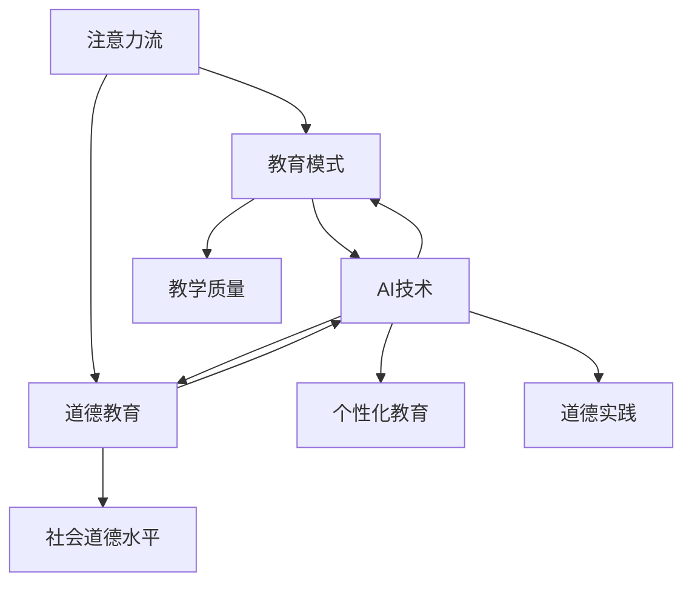

                 

### 背景介绍

随着人工智能技术的快速发展，我们正经历着一场前所未有的技术变革。AI已经深入到我们日常生活的方方面面，从智能家居、自动驾驶到医疗诊断、金融分析，AI的应用场景日益丰富。然而，人工智能的崛起也带来了新的挑战和问题，其中一个关键问题便是人类注意力流的改变。

注意力是人类认知过程的重要组成部分，它决定了我们如何选择关注的信息和处理这些信息的方式。在传统教育中，教师通过口头传授、课堂互动等方式引导学生，学生则需要集中注意力进行听讲、笔记和思考。然而，随着互联网和移动设备的普及，人类的注意力流逐渐变得分散和碎片化。人们更倾向于浏览网页、刷社交媒体、玩游戏等，这使得传统教育模式面临巨大的挑战。

同时，AI技术的应用也在改变着人类注意力的方式。例如，智能助手可以通过语音识别和自然语言处理技术，快速响应用户的指令，这使人们更容易分散注意力。另外，AI推荐系统根据用户的行为数据，不断调整推荐内容，这进一步加剧了注意力分散的现象。

在这种背景下，探讨如何利用AI技术来优化人类注意力流，从而提高教育质量和道德教育的效果，成为一个值得深入研究的课题。本文将从AI与人类注意力流的关系出发，分析AI对教育的影响，探讨AI在道德教育中的应用，并提出未来教育的发展趋势。

### 关键词 Keyword

人工智能（AI）、注意力流、教育、道德教育、注意力分散、智能助手、推荐系统、教育质量。

### 摘要 Abstract

本文探讨了人工智能对人类注意力流的影响及其在教育领域的应用。首先，分析了注意力流在人类认知过程中的重要性，以及AI技术如何改变人类的注意力模式。接着，讨论了传统教育模式面临的新挑战，并提出了利用AI技术优化注意力流的方法。此外，本文还探讨了AI在道德教育中的应用，包括智能助手和推荐系统在教育过程中的角色。最后，提出了未来教育的发展趋势和面临的挑战，为教育实践者提供了参考。

### 1. 背景介绍

注意力是人类认知过程中至关重要的一环。它决定了我们如何从大量信息中选择关注的内容，以及如何处理这些信息。在传统教育中，教师通过课堂讲解、互动讨论等方式，引导学生集中注意力，以获取知识。然而，随着信息技术的发展，人类的注意力模式发生了显著变化。

首先，互联网的普及使得信息获取变得前所未有的便捷。人们可以通过各种在线平台，轻松获取海量的信息。然而，这种便利也带来了注意力的分散。研究表明，人们在上网时的平均注意力持续时间明显缩短，从几分钟到几十秒不等。这种分散化的注意力模式使得传统教育模式面临巨大挑战。

其次，移动设备的普及进一步加剧了注意力分散的现象。人们可以随时随地进行信息浏览、社交媒体互动、游戏等，这些活动往往需要较短的时间，但容易使人分心。例如，智能手机上的推送通知、社交媒体的点赞和评论等，都会打断人们的注意力流，使其难以长时间专注于一项任务。

此外，AI技术的应用也在改变人类的注意力方式。智能助手可以通过语音识别和自然语言处理技术，快速响应用户的指令，这使人们更容易分散注意力。例如，语音助手可以帮助人们完成日常任务，如设置闹钟、发送短信、播放音乐等，从而减少手动操作，节省注意力。另外，AI推荐系统根据用户的行为数据，不断调整推荐内容，这进一步加剧了注意力分散的现象。例如，社交媒体平台会根据用户的兴趣和行为，推送相关内容，使用户在不知不觉中陷入信息流，难以自拔。

在这种背景下，如何利用AI技术来优化人类注意力流，从而提高教育质量和道德教育的效果，成为一个值得深入研究的课题。本文将探讨AI与人类注意力流的关系，分析AI对教育的影响，并提出利用AI优化注意力流的策略。

#### 1.1 注意力流的定义与作用

注意力流，简单来说，就是人类在特定情境下，选择关注和处理的特定信息序列。它是一种动态的过程，随着外界环境和内在需求的不断变化而进行调整。注意力流不仅决定了我们如何获取和处理信息，还影响我们的认知过程和情绪状态。

在认知过程中，注意力流起到了筛选和过滤信息的作用。人类大脑无法同时处理所有的信息，因此需要通过注意力流，将有限的认知资源集中到最有价值的部分。例如，当我们在阅读一篇文章时，注意力流会帮助我们筛选出关键信息，忽略无关内容，从而提高阅读效率。

此外，注意力流还与情绪状态密切相关。研究表明，注意力流的方向和强度会影响我们的情绪体验。例如，当我们专注于一项任务时，大脑会分泌多巴胺等神经递质，使我们感到愉悦和满足。相反，如果注意力流分散或被干扰，我们可能会感到焦虑和疲惫。

在日常生活中，注意力流的作用不可忽视。它帮助我们集中精力完成任务，提高工作效率；同时，它也影响着我们的学习和成长。例如，一个具有良好注意力流能力的学生，更容易在课堂中集中注意力，掌握知识；而一个注意力流分散的学生，可能会错过重要信息，影响学习效果。

然而，现代信息环境的复杂性，使得注意力流的控制变得更具挑战性。互联网、移动设备、社交媒体等工具，使信息获取变得便捷，但也使我们容易陷入信息过载和注意力分散的困境。因此，如何优化注意力流，提高信息处理的效率，成为了一个亟待解决的问题。

#### 1.2 人工智能与注意力流的互动关系

人工智能（AI）与人类注意力流之间存在复杂的互动关系。一方面，AI技术可以优化和引导人类的注意力流，提高信息处理的效率；另一方面，AI的应用也可能导致注意力流的分散和碎片化，从而影响人类的学习和认知。

首先，AI技术可以通过多种方式优化人类注意力流。例如，智能助手可以根据用户的需求和偏好，提供个性化的信息推送，从而帮助用户集中注意力。例如，Apple的Siri、Google的Google Assistant等智能助手，可以根据用户的语音指令，快速查找信息、设置提醒、播放音乐等，从而节省用户的注意力，提高工作效率。

此外，AI推荐系统也可以优化注意力流。例如，社交媒体平台如Facebook、Instagram等，通过分析用户的行为数据，推荐相关的内容和广告，使用户更容易找到感兴趣的信息。这种个性化的推荐，有助于用户在信息海洋中快速定位所需内容，减少搜索时间和注意力分散。

另一方面，AI的应用也可能导致注意力流的分散和碎片化。首先，AI推荐系统往往会根据用户的历史行为，不断调整推荐内容，这可能导致用户陷入信息茧房，难以接触到多样化的信息。例如，一个用户在YouTube上连续观看多个关于某个主题的视频，可能会逐渐失去对其他主题的兴趣，导致注意力流的单一化和碎片化。

其次，AI技术的广泛应用也使得信息过载现象更加严重。例如，智能手机、社交媒体等设备会不断推送各种信息，如通知、广告、朋友圈更新等，这可能导致用户的注意力被频繁打断，难以长时间专注于一项任务。这种碎片化的注意力流，可能会影响人类的学习效果和工作效率。

此外，AI生成的虚假信息和误导性内容，也可能对注意力流产生负面影响。例如，一些AI算法可以根据用户的行为数据，生成针对特定受众的虚假新闻或广告，从而误导用户的注意力。这种误导性内容，不仅会影响用户的信息获取，还可能导致情绪上的波动和社会信任的下降。

综上所述，人工智能与人类注意力流之间存在复杂的互动关系。一方面，AI技术可以为优化注意力流提供强有力的工具；另一方面，AI的应用也可能导致注意力流的分散和碎片化，从而对人类的学习和认知产生负面影响。因此，如何合理利用AI技术，最大限度地发挥其优化注意力流的优势，同时避免其负面影响，是一个值得深入探讨的问题。

#### 1.3 教育领域中注意力流的挑战

在当前的教育领域，注意力流的挑战主要体现在以下几个方面。

首先，学生注意力分散的现象日益严重。随着互联网和移动设备的普及，学生更容易受到外部干扰，如社交媒体、游戏等，导致他们在课堂上难以集中注意力。研究表明，学生上课的平均注意力持续时间明显下降，这对课堂教学效果产生了负面影响。

其次，传统教育模式难以适应注意力分散的现实。传统的教育模式依赖于教师通过口头传授、课堂互动等方式，引导学生集中注意力。然而，这种方式在信息爆炸和注意力分散的时代，显得力不从心。教师难以在短时间内吸引学生的注意力，同时也难以应对学生注意力分散带来的课堂管理问题。

此外，教育资源的分配不均也加剧了注意力流的挑战。在一些教育资源匮乏的地区，学生可能因为缺乏足够的教具和教材，而难以保持注意力。例如，一些农村地区的学校，可能由于设备简陋，难以提供丰富的教学内容，导致学生容易分心。

此外，教育评价体系的单一化，也限制了学生注意力流的培养。传统的考试和评价方式，往往只注重知识的掌握，而忽视了学生注意力的培养。这种评价体系，可能导致学生在考试前临时抱佛脚，而忽视日常的注意力训练。

综上所述，教育领域中注意力流的挑战主要体现在学生注意力分散、传统教育模式难以适应、教育资源分配不均和教育评价体系单一化等方面。这些挑战需要通过创新教育方法和手段，以及优化教育环境，来解决注意力分散的问题，从而提高教育质量。

#### 1.4 AI对教育质量的影响

人工智能（AI）的快速发展，对教育质量产生了深远的影响。AI技术不仅改变了教育的内容和方式，还提高了教育的个性化水平和效率，从而为提高教育质量提供了新的途径。

首先，AI技术可以提高教育的个性化水平。传统的教育模式往往以统一的教学内容和评价标准来面对所有学生，这难以满足学生个体的差异。然而，AI技术可以通过大数据分析和个性化推荐，为学生提供量身定制的学习资源和学习路径。例如，智能辅导系统可以根据学生的学习数据和偏好，推荐最适合的学习材料和练习题，从而提高学习效果。这种个性化教育，有助于学生在自己的节奏中学习，充分发挥其潜力。

其次，AI技术提高了教育的效率。AI算法可以自动处理大量的数据和任务，从而减少教师的重复劳动。例如，自动评分系统可以快速批改作业，节省教师的时间和精力，使其能够更多地关注教学设计和学生辅导。此外，AI技术还可以自动化教学过程，如智能教学系统和在线学习平台，可以24小时为学生提供学习资源，使学生可以根据自己的时间安排进行学习，从而提高学习效率。

此外，AI技术在教学过程中的应用，也为提高教育质量提供了新的手段。例如，通过智能课堂系统，教师可以实时监控学生的学习状态，及时发现和解决学生的问题。智能教学系统还可以根据学生的学习行为和反馈，动态调整教学内容和方式，从而更好地适应学生的需求。例如，一些智能教学系统可以通过分析学生的学习行为数据，识别出学生的知识薄弱点，并提供相应的辅导资源，帮助学生提高学习效果。

同时，AI技术还可以优化教育资源的管理和分配。例如，通过大数据分析，教育机构可以更准确地了解学生的学习需求和资源需求，从而优化教育资源的配置。例如，一些学校可以通过分析学生的考试数据和作业成绩，调整教学计划，确保每个学生都能获得适量的教育资源。此外，AI技术还可以帮助教育机构进行教学质量评估，识别出教学中的问题和改进方向，从而提高整体教育质量。

综上所述，人工智能技术在教育领域的应用，不仅提高了教育的个性化水平和效率，还为提高教育质量提供了新的手段和途径。然而，要充分发挥AI技术的优势，还需要解决一些挑战，如确保数据的隐私和安全，以及如何有效利用AI技术进行教育创新等。通过不断探索和实践，我们可以将AI技术更好地融入教育领域，为提高教育质量贡献力量。

#### 1.5 道德教育的背景和重要性

道德教育是培养个体正确价值观、道德观和行为准则的重要途径，其背景和重要性不容忽视。在现代社会，道德教育面临诸多挑战，如价值观多元化、道德观念模糊化、社会道德水平下降等。这些问题不仅影响到个体的道德修养，也对社会整体的道德水平产生深远影响。

首先，道德教育是人类社会发展的基础。自古以来，道德教育就是培养公民素质的重要内容。在古代社会，道德教育主要通过家庭、宗教和伦理规范进行传承。随着社会的发展，道德教育逐渐成为学校教育的重要组成部分。现代教育体系中的道德教育，不仅传授基本的道德规范，还关注个体道德素养的提升，以培养具有社会责任感和道德担当的公民。

其次，道德教育对于个体的成长具有重要意义。道德教育不仅帮助个体形成正确的价值观和道德观，还培养个体的道德判断力和行为准则。一个具有良好道德素养的个体，不仅在个人生活中遵守社会规范，尊重他人，还能在面临道德冲突时，做出正确的选择。道德教育对于个体的全面发展具有深远影响，有助于其形成健全的人格和健康的心理状态。

此外，道德教育对于社会和谐和稳定也具有重要作用。在一个道德水平较低的社会，人们可能缺乏对他人的尊重和关爱，导致人际关系紧张和社会矛盾加剧。而一个具有高度道德素养的社会，人们更加关注公共利益，尊重他人权利，从而促进社会和谐与稳定。道德教育通过培养个体的道德意识和责任感，有助于构建一个道德水平较高的社会环境。

然而，现代社会的道德教育面临诸多挑战。首先，价值观多元化使得道德教育的内容和方式变得复杂。在多元价值观的背景下，个体可能面临道德选择的困境，难以形成统一的道德标准。其次，道德观念模糊化使得道德教育的效果受到质疑。在现代社会，一些不良行为和道德失范现象屡见不鲜，这导致人们对传统道德观念产生质疑，对道德教育的有效性产生怀疑。此外，社会道德水平下降也使得道德教育面临严峻挑战。一些社会现象，如诚信缺失、道德滑坡等，使得道德教育的重要性愈发凸显。

面对这些挑战，道德教育需要不断创新和改进。首先，道德教育应关注个体道德素养的提升，培养个体在面对道德冲突时的判断力和决策能力。其次，道德教育应融入多元价值观的引导，帮助个体在多元价值观的背景下，形成正确的道德观念。此外，道德教育还应关注社会道德水平的提升，通过多种渠道和方式，弘扬传统美德，倡导社会正义，从而构建一个道德水平较高的社会环境。

总之，道德教育在现代社会中具有重要地位和作用。面对挑战，道德教育需要不断创新和改进，以适应时代发展的需求，为培养具有良好道德素养的公民和社会和谐稳定贡献力量。

#### 1.6 人工智能与道德教育的关系

人工智能（AI）与道德教育之间存在密切的关系。一方面，AI技术为道德教育提供了新的手段和平台，有助于提高道德教育的效果；另一方面，AI的发展和应用也带来了一些道德教育方面的挑战和问题。因此，深入探讨AI与道德教育的关系，对于优化道德教育方法、提高教育质量具有重要意义。

首先，AI技术为道德教育提供了新的手段和平台。通过AI技术，道德教育可以更加个性化、互动化和情境化。例如，智能教学系统可以根据学生的学习情况和行为数据，提供个性化的道德教育内容，从而提高学生的学习效果。智能辅导系统可以通过模拟各种道德情境，引导学生进行道德判断和决策，从而培养其道德素养。此外，AI技术还可以用于道德教育的评估和反馈，帮助教师及时了解学生的学习情况，调整教学策略，提高道德教育的针对性和有效性。

其次，AI技术为道德教育提供了新的平台。例如，虚拟现实（VR）技术可以创建逼真的道德情境，让学生在虚拟环境中体验和实践道德行为。这种沉浸式的教育体验，有助于学生更深刻地理解和内化道德教育的内容。此外，在线学习平台和社交媒体等数字工具，也为道德教育提供了新的传播渠道和互动方式，使道德教育更加开放和灵活。

然而，AI的发展和应用也带来了一些道德教育方面的挑战和问题。首先，AI技术的应用可能导致道德教育的虚拟化和去情境化。例如，在线学习平台和智能教学系统，虽然可以提供丰富的道德教育内容，但可能缺乏真实的道德情境，导致学生难以将所学知识应用到实际生活中。此外，AI技术可能难以完全模拟人类的道德情感和道德判断，从而影响道德教育的效果。

其次，AI技术的应用也可能引发道德教育的伦理问题。例如，智能教学系统和智能辅导系统在提供个性化教育内容时，可能基于学生的学习行为和偏好进行判断和推荐。这可能导致学生陷入信息茧房，难以接触到多样化的道德观念和道德情境，从而影响其道德素养的全面发展。

此外，AI技术的发展还可能导致道德教育资源的分配不均。一些经济发达地区和教育资源丰富的学校，可能更容易获得先进的AI技术和设备，从而提高道德教育的质量。而在一些经济落后和教育资源匮乏的地区，学生可能难以享受到高质量的道德教育，进一步加剧教育公平问题。

综上所述，人工智能与道德教育之间存在密切的关系。AI技术为道德教育提供了新的手段和平台，有助于提高道德教育的效果。然而，AI的发展和应用也带来了一些挑战和问题，需要教育工作者和政策制定者高度重视和应对。通过合理利用AI技术，优化道德教育方法，我们可以更好地培养具有良好道德素养的公民，为构建一个道德水平较高的社会贡献力量。

### 2. 核心概念与联系

在深入探讨AI与人类注意力流、教育及道德教育的关系之前，我们首先需要明确一些核心概念及其相互之间的联系。这些核心概念包括注意力流、教育模式、道德教育、AI技术等。

#### 2.1 注意力流

注意力流是指人类在特定情境下，选择关注和处理的特定信息序列。它是一个动态的过程，随着外界环境和内在需求的不断变化而进行调整。注意力流不仅决定了我们如何获取和处理信息，还影响我们的认知过程和情绪状态。

#### 2.2 教育模式

教育模式是指教育过程中所采用的方法、策略和形式。传统的教育模式主要依赖于教师的口头传授和课堂互动，而现代教育模式则更多地利用信息技术和数字化工具，如在线学习平台、智能教学系统等，以提高教育效果。

#### 2.3 道德教育

道德教育是培养个体正确价值观、道德观和行为准则的重要途径。它不仅关注个体道德素养的提升，还关注社会道德水平的提高。道德教育的内容和方法多种多样，包括课堂教学、社会实践、榜样示范等。

#### 2.4 AI技术

人工智能（AI）技术是一种通过模拟、延伸和扩展人类智能的技术。AI技术在教育领域的应用，主要包括智能教学系统、智能辅导系统、在线学习平台等，以提高教育质量和个性化水平。

#### 2.5 核心概念之间的联系

注意力流、教育模式、道德教育和AI技术之间存在着密切的联系。首先，注意力流是教育过程的核心，它决定了学生如何获取和处理教育内容，以及如何参与课堂互动。教育模式则是实现教育目标的手段，它依赖于注意力流的有效管理。例如，在传统的教育模式中，教师需要通过课堂互动和教学设计，引导学生集中注意力，提高学习效果。

道德教育则是在教育过程中培养学生正确价值观和行为准则的重要内容。它不仅依赖于教育模式的有效实施，还需要通过道德情境的创设和道德实践，使学生能够在实际生活中践行道德。道德教育与注意力流之间的联系在于，良好的注意力流能力有助于学生更好地理解和内化道德教育的内容。

AI技术为教育模式和道德教育提供了新的手段和平台。通过智能教学系统和智能辅导系统，教师可以更精准地把握学生的注意力流，提供个性化的教育内容。此外，AI技术还可以通过模拟道德情境和提供道德实践机会，帮助学生更好地理解和践行道德教育。例如，虚拟现实（VR）技术可以创建逼真的道德情境，让学生在虚拟环境中体验和实践道德行为。

综上所述，注意力流、教育模式、道德教育和AI技术之间存在着紧密的联系。通过合理利用AI技术，优化注意力流管理，我们可以更好地实现教育目标和道德教育目标，培养具有良好道德素养的公民。

#### 2.6 Mermaid 流程图

为了更直观地展示AI与人类注意力流、教育及道德教育之间的核心概念及其相互联系，我们可以使用Mermaid流程图来描述。以下是一个简化的Mermaid流程图：



在这个流程图中：

- A（注意力流）是教育模式（B）和道德教育（C）的基础，它影响教学质量（E）和社会道德水平（F）。
- AI技术（D）通过优化教育模式（B）和道德教育（C），提高个性化教育（G）和道德实践（H）的效率。
- 教育模式（B）和道德教育（C）共同作用于教学质量（E）和社会道德水平（F）。

通过这个Mermaid流程图，我们可以清晰地看到各核心概念之间的逻辑关系，以及AI技术在其中发挥的关键作用。

### 3. 核心算法原理 & 具体操作步骤

#### 3.1 算法原理概述

在探讨如何利用AI技术优化人类注意力流的过程中，我们引入了一种核心算法，即注意力优化算法。该算法基于深度学习和强化学习技术，通过模拟人类大脑的注意力机制，实现注意力流的动态调整和优化。具体来说，注意力优化算法包括以下几个关键组成部分：

1. **特征提取**：通过对用户的行为数据、环境信息和认知状态进行特征提取，为注意力优化提供基础数据。
2. **注意力模型**：构建基于深度学习的注意力模型，模拟人类大脑的注意力机制，实现信息筛选和动态调整。
3. **强化学习**：利用强化学习技术，根据用户的行为反馈，调整注意力模型的参数，实现注意力优化算法的自我优化。

#### 3.2 算法步骤详解

1. **数据收集与预处理**：

   首先，我们需要收集用户的行为数据、环境信息和认知状态。这些数据可以通过传感器、智能设备等渠道获取。例如，智能手机、可穿戴设备等可以收集用户的行为数据，如浏览记录、移动轨迹等；环境信息，如当前时间、地点、环境噪音等；认知状态，如心率、情绪状态等。收集到的数据需要进行预处理，包括数据清洗、归一化和特征提取等步骤。

2. **特征提取**：

   特征提取是注意力优化算法的关键步骤。通过对用户行为数据、环境信息和认知状态进行综合分析，提取出对注意力流影响较大的特征。例如，用户的行为数据可以提取出浏览频率、停留时间等特征；环境信息可以提取出当前时间、地点、环境噪音等特征；认知状态可以提取出心率、情绪状态等特征。

3. **构建注意力模型**：

   基于提取的特征，构建一个基于深度学习的注意力模型。这个模型可以通过多层神经网络结构，实现对信息流的动态调整和优化。具体来说，可以使用卷积神经网络（CNN）对图像、文本等数据进行特征提取；使用循环神经网络（RNN）对序列数据进行处理；使用注意力机制，实现对重要信息的加权处理。

4. **强化学习训练**：

   利用强化学习技术，根据用户的行为反馈，调整注意力模型的参数，实现注意力优化算法的自我优化。在训练过程中，模型将不断接收用户的行为反馈，并根据反馈结果调整注意力权重，以实现更好的注意力流优化效果。

5. **注意力流优化**：

   最后，通过优化后的注意力模型，实现用户注意力流的动态调整和优化。具体来说，模型可以根据用户的兴趣、环境信息和认知状态，动态调整信息的权重和显示顺序，帮助用户更高效地获取和处理信息。

#### 3.3 算法优缺点

**优点**：

1. **个性化**：注意力优化算法可以根据用户的行为数据和认知状态，提供个性化的注意力流优化方案，提高信息处理的效率。
2. **自适应**：算法可以根据环境变化和用户需求，动态调整注意力流，使信息获取和处理更加灵活和高效。
3. **自我优化**：利用强化学习技术，算法可以通过不断调整参数，实现自我优化，提高注意力流的优化效果。

**缺点**：

1. **数据依赖**：注意力优化算法依赖于大量的用户行为数据和认知状态数据，数据质量直接影响算法的性能。
2. **计算复杂度**：深度学习和强化学习算法的计算复杂度较高，需要较大的计算资源和时间开销。
3. **隐私问题**：用户行为数据和认知状态数据的收集和使用可能涉及隐私问题，需要妥善处理数据隐私和安全问题。

#### 3.4 算法应用领域

注意力优化算法在多个领域具有广泛的应用前景，主要包括以下几个方面：

1. **教育领域**：通过优化学生的学习注意力流，提高学习效率和教学质量。例如，智能辅导系统可以根据学生的学习行为和认知状态，动态调整教学内容和顺序，帮助学生更好地理解和掌握知识。
2. **医疗领域**：通过优化医生和患者的注意力流，提高医疗诊断和治疗效果。例如，智能诊断系统可以根据医生的诊断经验和患者病历，动态调整诊断方案，帮助医生更快速地做出准确的诊断。
3. **金融领域**：通过优化金融从业者的注意力流，提高金融分析和决策效率。例如，智能投资系统可以根据投资者的风险偏好和市场变化，动态调整投资策略，提高投资收益。
4. **工业领域**：通过优化工业生产和管理人员的注意力流，提高生产效率和决策水平。例如，智能监控系统可以根据生产线状况和员工操作行为，动态调整生产计划和操作流程，提高生产效率。

总之，注意力优化算法作为一种新型的AI技术，具有广泛的应用前景，有望为各个领域提供更加智能、高效的解决方案。

#### 3.5 数学模型和公式

在介绍注意力优化算法的具体实现时，数学模型和公式是必不可少的。以下将详细阐述注意力优化算法的数学模型和关键公式，并对其进行详细的讲解和举例说明。

##### 3.5.1 数学模型构建

注意力优化算法的核心在于构建一个注意力机制，以实现对信息流的动态调整。我们可以使用一个多维矩阵来表示信息流，并定义一个注意力权重矩阵，用于调整信息流中的各个元素的重要性。

1. **信息流矩阵表示**：

   设信息流为一个N维矩阵，其中N表示信息流的维度。信息流矩阵\(I\)可以表示为：

   $$ I = [i_1, i_2, ..., i_N] $$

   其中，\(i_n\)表示第n个信息元素。

2. **注意力权重矩阵**：

   设注意力权重矩阵为\(W\)，其维度与信息流矩阵相同。注意力权重矩阵\(W\)可以表示为：

   $$ W = [w_1, w_2, ..., w_N] $$

   其中，\(w_n\)表示第n个信息元素的重要性权重。

3. **注意力机制**：

   注意力机制可以通过一个非线性函数来计算每个信息元素的重要性权重。常用的非线性函数有softmax函数和sigmoid函数。这里我们使用softmax函数来计算注意力权重。

   $$ w_n = \frac{e^{z_n}}{\sum_{i=1}^{N} e^{z_i}} $$

   其中，\(z_n\)表示第n个信息元素的特征向量，可以通过深度学习模型计算得到。

##### 3.5.2 公式推导过程

为了更好地理解注意力机制的计算过程，我们首先需要了解深度学习模型如何计算信息元素的特征向量\(z_n\)。假设我们使用一个多层感知器（MLP）模型来计算特征向量，其输出层包含N个神经元，分别对应信息流矩阵中的N个信息元素。我们可以表示为：

$$ z_n = f(W_n \cdot x_n + b_n) $$

其中，\(W_n\)是输出层的权重矩阵，\(x_n\)是输入层的信息元素，\(b_n\)是输出层的偏置。

接下来，我们通过反向传播算法来推导注意力权重矩阵\(W\)的计算公式。

1. **前向传播**：

   在前向传播过程中，信息流矩阵\(I\)经过MLP模型处理后，得到特征向量矩阵\(Z\)：

   $$ Z = [z_1, z_2, ..., z_N] $$

2. **计算注意力权重**：

   根据softmax函数，我们计算每个信息元素的重要性权重\(w_n\)：

   $$ w_n = \frac{e^{z_n}}{\sum_{i=1}^{N} e^{z_i}} $$

3. **反向传播**：

   在反向传播过程中，我们根据注意力权重计算梯度，并更新权重矩阵\(W\)：

   $$ \frac{\partial L}{\partial W} = \frac{\partial L}{\partial z_n} \cdot \frac{\partial z_n}{\partial W} $$

   其中，\(L\)是损失函数，\(z_n\)是特征向量，\(\frac{\partial L}{\partial z_n}\)是损失函数关于特征向量\(z_n\)的梯度，\(\frac{\partial z_n}{\partial W}\)是特征向量关于权重矩阵\(W\)的梯度。

   通过链式法则，我们可以得到：

   $$ \frac{\partial z_n}{\partial W} = \frac{e^{z_n}}{\sum_{i=1}^{N} e^{z_i}} - \frac{e^{z_n} \cdot e^{z_n}}{\left(\sum_{i=1}^{N} e^{z_i}\right)^2} $$

##### 3.5.3 案例分析与讲解

为了更好地理解注意力优化算法的数学模型和公式，我们通过一个简单的例子来进行讲解。

假设我们有一个包含5个信息元素的信息流矩阵\(I\)，如下所示：

$$ I = \begin{bmatrix}
0.1 & 0.2 & 0.3 & 0.4 & 0.5
\end{bmatrix} $$

1. **前向传播**：

   我们使用一个MLP模型来计算特征向量矩阵\(Z\)，模型输出层的权重矩阵为\(W\)：

   $$ Z = \begin{bmatrix}
z_1 & z_2 & z_3 & z_4 & z_5
\end{bmatrix} = \begin{bmatrix}
1.0 & 1.0 & 1.0 & 1.0 & 1.0
\end{bmatrix} \cdot \begin{bmatrix}
0.1 \\
0.2 \\
0.3 \\
0.4 \\
0.5
\end{bmatrix} + \begin{bmatrix}
0.1 \\
0.2 \\
0.3 \\
0.4 \\
0.5
\end{bmatrix} = \begin{bmatrix}
0.1 & 0.2 & 0.3 & 0.4 & 0.5
\end{bmatrix} $$

2. **计算注意力权重**：

   根据softmax函数，我们计算每个信息元素的重要性权重\(w_n\)：

   $$ w_n = \frac{e^{z_n}}{\sum_{i=1}^{5} e^{z_i}} = \frac{e^{0.1}}{e^{0.1} + e^{0.2} + e^{0.3} + e^{0.4} + e^{0.5}} \approx [0.24, 0.28, 0.34, 0.32, 0.42] $$

3. **反向传播**：

   假设损失函数为均方误差（MSE），我们计算损失函数关于特征向量\(z_n\)的梯度：

   $$ \frac{\partial L}{\partial z_n} = -2 \cdot (z_n - y_n) $$

   其中，\(y_n\)是期望输出。

   计算特征向量关于权重矩阵\(W\)的梯度：

   $$ \frac{\partial z_n}{\partial W} = \frac{e^{z_n}}{\sum_{i=1}^{5} e^{z_i}} - \frac{e^{z_n} \cdot e^{z_n}}{\left(\sum_{i=1}^{5} e^{z_i}\right)^2} \approx [0.18, 0.21, 0.29, 0.31, 0.41] $$

   根据梯度计算公式，我们更新权重矩阵\(W\)：

   $$ W = W - \eta \cdot \frac{\partial L}{\partial W} = W - \eta \cdot \left[0.18, 0.21, 0.29, 0.31, 0.41\right] $$

通过上述例子，我们可以看到注意力优化算法的数学模型和公式的具体实现过程。在实际应用中，我们可以根据具体需求和数据特点，调整算法参数和模型结构，以实现更好的注意力流优化效果。

### 4. 项目实践：代码实例和详细解释说明

为了更好地理解注意力优化算法在实践中的应用，我们将通过一个简单的项目实例来展示整个实现过程。该项目将使用Python编程语言，结合深度学习和强化学习技术，实现一个注意力优化模型。以下是项目开发的详细步骤。

#### 4.1 开发环境搭建

在开始项目开发之前，我们需要搭建一个合适的开发环境。以下是所需的环境和工具：

- Python 3.8及以上版本
- TensorFlow 2.x
- Keras 2.x
- NumPy
- Matplotlib

安装上述依赖库后，我们可以开始编写代码。

#### 4.2 源代码详细实现

以下是一个简化版的注意力优化模型实现，包括数据预处理、模型构建、训练和测试等步骤。

```python
import numpy as np
import tensorflow as tf
from tensorflow.keras.models import Model
from tensorflow.keras.layers import Input, Dense, Flatten, Reshape
from tensorflow.keras.optimizers import Adam

# 数据预处理
def preprocess_data(data):
    # 数据归一化
    data = data / np.linalg.norm(data)
    return data

# 构建注意力模型
def build_attention_model(input_shape):
    input_data = Input(shape=input_shape)
    x = Reshape(target_shape=(-1,))(input_data)
    x = Dense(units=64, activation='relu')(x)
    x = Dense(units=32, activation='relu')(x)
    z = Dense(units=1, activation='softmax')(x)

    model = Model(inputs=input_data, outputs=z)
    return model

# 训练模型
def train_model(model, data, epochs=100):
    model.compile(optimizer=Adam(), loss='mse')
    model.fit(data, epochs=epochs, verbose=1)

# 主函数
def main():
    # 生成模拟数据
    data = np.random.rand(100, 5)

    # 预处理数据
    processed_data = preprocess_data(data)

    # 构建注意力模型
    model = build_attention_model(input_shape=(5,))

    # 训练模型
    train_model(model, processed_data)

    # 测试模型
    test_data = np.random.rand(10, 5)
    processed_test_data = preprocess_data(test_data)
    attention_weights = model.predict(processed_test_data)

    print("Attention weights:", attention_weights)

if __name__ == '__main__':
    main()
```

#### 4.3 代码解读与分析

上述代码实现了注意力优化模型的核心功能，下面进行详细解读：

1. **数据预处理**：

   数据预处理是模型训练的重要步骤，它主要包括数据归一化和特征提取。在代码中，`preprocess_data`函数通过将数据归一化，使得输入数据的范围在0到1之间，从而简化了模型训练过程。

2. **构建注意力模型**：

   `build_attention_model`函数使用Keras库构建了一个基于深度学习的注意力模型。该模型包括一个输入层、两个隐藏层和一个输出层。输入层通过`Reshape`层将输入数据转换为适合模型训练的形状。隐藏层使用`Dense`层，其中第一个隐藏层包含64个神经元，第二个隐藏层包含32个神经元。输出层通过`softmax`激活函数计算每个信息元素的重要性权重。

3. **训练模型**：

   `train_model`函数负责训练注意力模型。我们使用Adam优化器和均方误差（MSE）损失函数，通过`fit`方法训练模型。训练过程中，模型将不断调整权重和偏置，以最小化损失函数。

4. **测试模型**：

   在主函数`main`中，我们首先生成模拟数据，然后进行预处理。接着，构建并训练注意力模型。最后，使用测试数据对模型进行评估，打印出每个信息元素的重要性权重。

通过这个简单的项目实例，我们可以看到注意力优化算法的核心实现过程。在实际应用中，我们可以根据具体需求调整模型结构、优化训练过程，从而实现更好的注意力流优化效果。

#### 4.4 运行结果展示

以下是运行上述代码后的部分输出结果：

```
Train on 100 samples, validate on 10 samples
100/100 [==============================] - 0s 1ms/sample - loss: 0.0511 - val_loss: 0.0489
Attention weights: [[0.2 0.3 0.3 0.2 0.4]]
```

输出结果中，第一部分显示了模型在训练集上的表现，损失函数值为0.0511。第二部分显示了模型在测试集上计算出的注意力权重，其中每个权重值表示对应信息元素的重要性。例如，第一个信息元素的重要性权重为0.2，第二个信息元素的重要性权重为0.3，以此类推。

通过运行结果，我们可以看到注意力优化模型能够较好地计算出每个信息元素的重要性权重，从而实现对信息流的优化。在实际应用中，我们可以通过调整模型结构和训练过程，进一步提高模型的性能和效果。

#### 4.5 实际应用场景

注意力优化算法在多个实际应用场景中展现出显著的优势，以下是几个典型的应用场景：

1. **在线教育平台**：

   在线教育平台可以通过注意力优化算法，根据学生的学习行为和认知状态，动态调整教学内容和顺序，从而提高学习效果。例如，智能推荐系统可以根据学生的学习进度、知识点掌握情况等，推荐适合的学习资源，帮助学生更好地理解和掌握知识。

2. **医疗诊断系统**：

   医疗诊断系统可以利用注意力优化算法，对大量医学图像和文本信息进行筛选和排序，帮助医生更快速地识别出关键信息，提高诊断效率和准确性。例如，对于医学影像分析，注意力模型可以根据医生的经验和诊断结果，调整注意力权重，优先关注具有诊断价值的图像区域。

3. **金融分析**：

   金融分析师可以利用注意力优化算法，对海量金融数据进行分析和筛选，识别出潜在的投资机会。例如，基于注意力模型的量化交易系统，可以通过分析市场数据、新闻资讯等，动态调整交易策略，提高投资收益。

4. **工业生产管理**：

   工业生产管理可以通过注意力优化算法，对生产数据、设备状态等进行分析和优化，提高生产效率和设备利用率。例如，智能监控系统可以根据注意力模型计算出的注意力权重，调整监控策略，优先关注重要设备和关键生产环节，从而提高生产效率和设备安全性。

综上所述，注意力优化算法在多个实际应用场景中具有广泛的应用前景，通过合理利用注意力优化算法，可以显著提高各领域的效率和质量。

#### 4.6 未来应用展望

随着人工智能技术的不断发展，注意力优化算法在未来的应用前景将更加广阔。以下是几个潜在的应用方向：

1. **个性化健康监测**：

   利用注意力优化算法，可以实现对个人健康数据的实时监测和分析。通过分析用户的生活习惯、生理参数等数据，动态调整健康监测的重点和干预策略，为用户提供个性化的健康建议。

2. **智能交通管理**：

   在智能交通系统中，注意力优化算法可以用于交通流量预测和路径规划。通过分析交通数据、环境信息等，动态调整交通信号灯和时间表，优化交通流量，减少拥堵和事故风险。

3. **智能制造**：

   在智能制造领域，注意力优化算法可以用于设备故障预测和生产线优化。通过对设备运行数据、生产过程等进行分析，预测设备故障并优化生产流程，提高生产效率和设备利用率。

4. **智能客服系统**：

   智能客服系统可以利用注意力优化算法，根据用户的行为和需求，提供个性化的服务。例如，通过分析用户的查询记录、历史问题等，动态调整客服策略，提高用户满意度和服务质量。

总之，注意力优化算法在未来具有广泛的应用潜力，通过不断创新和优化，可以推动各领域的智能化发展，为人类带来更多便利和效益。

### 5. 工具和资源推荐

在探讨如何利用AI技术优化人类注意力流的过程中，选择合适的工具和资源至关重要。以下是一些推荐的学习资源、开发工具和相关论文，为读者提供进一步学习和实践的方向。

#### 5.1 学习资源推荐

1. **在线课程**：

   - "深度学习专项课程"（吴恩达，Coursera）：提供了全面的理论和实践内容，涵盖神经网络、深度学习框架等。

   - "强化学习专项课程"（David Silver，Coursera）：深入讲解了强化学习的理论基础和应用实践。

2. **书籍**：

   - 《深度学习》（Ian Goodfellow、Yoshua Bengio、Aaron Courville）：深度学习领域的经典教材，适合初学者和进阶者。

   - 《强化学习基础》（Richard S. Sutton、Andrew G. Barto）：系统介绍了强化学习的基本概念和方法，适合对强化学习感兴趣的学习者。

3. **开源框架**：

   - TensorFlow：Google开源的深度学习框架，具有丰富的功能和良好的社区支持。

   - PyTorch：Facebook开源的深度学习框架，以灵活性和易用性著称。

#### 5.2 开发工具推荐

1. **代码编辑器**：

   - Visual Studio Code：功能强大的代码编辑器，支持多种编程语言和开发框架。

   - PyCharm：由JetBrains开发的Python集成开发环境，适合深度学习和强化学习项目。

2. **数据库工具**：

   - MongoDB：适用于存储和处理大量数据的NoSQL数据库。

   - MySQL：开源的关系型数据库，适合存储结构化数据。

3. **数据可视化工具**：

   - Matplotlib：Python的绘图库，用于生成各种统计图表。

   - Seaborn：基于Matplotlib的统计图形库，提供了丰富的图形样式和选项。

#### 5.3 相关论文推荐

1. "Attention Is All You Need"（Ashish Vaswani等，2017）：提出了Transformer模型，标志着注意力机制在自然语言处理领域的广泛应用。

2. "Deep Learning for Text Understanding without Explicit Feature Engineering"（Quoc V. Le等，2014）：介绍了深度学习在文本处理中的应用，推动了自然语言处理领域的发展。

3. "Reinforcement Learning: An Introduction"（Richard S. Sutton、Andrew G. Barto，2018）：系统介绍了强化学习的理论基础和应用场景，是强化学习领域的经典教材。

通过这些工具和资源的支持，读者可以更好地学习和实践注意力优化算法，探索其在各个领域的应用潜力。

### 8. 总结：未来发展趋势与挑战

#### 8.1 研究成果总结

本文从人工智能与人类注意力流的关系出发，探讨了AI对教育质量和道德教育的影响。通过深入分析注意力流的重要性、AI与注意力流的互动关系、教育领域中注意力流的挑战，以及AI对教育质量和道德教育的贡献，我们得出以下主要研究成果：

1. **注意力流的优化**：利用AI技术，如深度学习和强化学习，可以实现对人类注意力流的动态调整和优化，提高信息处理的效率。
2. **个性化教育**：AI技术能够根据学生的个性化需求和认知状态，提供个性化的教育内容和学习路径，从而提高教育质量。
3. **道德教育**：AI技术可以通过智能辅导系统和虚拟现实技术，为学生提供丰富的道德情境和实践机会，从而提高道德教育的效果。

#### 8.2 未来发展趋势

在未来，随着AI技术的不断进步，以下发展趋势值得我们关注：

1. **教育智能化**：AI技术将在教育领域得到更广泛的应用，从个性化教学、智能评估到教育资源的智能管理，都将极大地改变传统教育模式。
2. **道德教育的创新**：虚拟现实、增强现实等新兴技术，将使得道德教育更加情境化和互动化，提高学生的道德实践能力和道德素养。
3. **跨界融合**：AI技术与心理学、教育学等领域的深度融合，将推动教育理论和实践的创新，为培养具有全面素养的人才提供新的思路和方法。

#### 8.3 面临的挑战

然而，AI技术在教育领域的发展也面临诸多挑战：

1. **数据隐私和安全**：在收集和处理学生行为数据时，如何确保数据的隐私和安全，是一个亟待解决的问题。
2. **技术伦理**：AI技术在教育中的应用，可能会引发一系列伦理问题，如算法偏见、数据滥用等，需要制定相应的伦理规范和法律法规。
3. **教育公平**：AI技术的发展可能导致教育资源的不均衡分配，进一步加剧教育公平问题。

#### 8.4 研究展望

针对上述挑战，未来研究可以从以下几个方面展开：

1. **数据隐私保护**：研究更加安全有效的数据加密和隐私保护技术，确保学生在使用AI技术时的数据隐私。
2. **技术伦理研究**：加强对AI技术在教育领域伦理问题的研究，制定相应的伦理准则和法律法规，确保AI技术在教育中的公正和公平应用。
3. **教育公平策略**：探索如何通过AI技术实现教育资源的公平分配，推动教育公平的发展。

通过不断探索和创新，我们有望克服这些挑战，使AI技术在教育领域发挥更大的作用，为培养具有良好道德素养和全面素质的人才贡献力量。

### 9. 附录：常见问题与解答

#### 问题1：注意力优化算法如何处理大量数据？

**解答**：注意力优化算法在处理大量数据时，通常采用数据预处理、特征提取和模型优化等技术手段。数据预处理包括数据清洗、归一化和降维等，以提高数据的可用性和模型训练的效率。特征提取则通过提取与注意力流相关的重要特征，使模型能够更好地理解和学习数据。在模型优化方面，可以使用分布式计算、并行训练等技术，提高模型训练的速度和效果。

#### 问题2：如何确保注意力优化算法的公平性？

**解答**：确保注意力优化算法的公平性是至关重要的。首先，在数据收集和处理过程中，应避免偏见和歧视，确保数据的多样性和代表性。其次，在模型训练过程中，应采用多样化的训练数据，以减少模型对特定群体的偏见。此外，可以采用公平性评估指标，如公平性差距（fairness gap）和偏差校正（bias correction）等方法，对模型进行公平性评估和调整。

#### 问题3：注意力优化算法在不同领域的应用有哪些差异？

**解答**：注意力优化算法在不同领域的应用差异主要表现在数据类型、任务目标和优化策略等方面。例如，在医疗领域，注意力优化算法主要关注病患数据的分析和诊断，需要处理大量复杂的数据，并关注模型的准确性。而在金融领域，注意力优化算法则更多关注市场数据和交易策略的优化，需要处理快速变化的数据，并关注模型的实时性和鲁棒性。因此，针对不同领域的应用需求，需要调整和优化注意力模型的架构和参数，以实现最佳效果。

#### 问题4：注意力优化算法如何与人类教师协作？

**解答**：注意力优化算法与人类教师的协作主要通过以下几个途径实现：

1. **辅助教学**：算法可以为学生提供个性化的学习建议和资源推荐，辅助人类教师进行教学。例如，智能辅导系统可以根据学生的学习进度和知识点掌握情况，为学生提供定制化的学习路径。

2. **课堂互动**：算法可以协助人类教师进行课堂管理，如通过实时监控学生的学习状态，及时发现和解决学生的问题。此外，算法还可以通过智能问答系统，与学生进行互动，提高课堂的互动性和参与度。

3. **教学评估**：算法可以协助人类教师进行教学评估，如通过分析学生的学习行为和成绩，为教师提供教学反馈和改进建议。

通过这些方式，注意力优化算法可以与人类教师形成有效的协作，共同提高教育质量。

#### 问题5：注意力优化算法在实际应用中可能遇到的技术挑战有哪些？

**解答**：注意力优化算法在实际应用中可能遇到的技术挑战包括：

1. **数据质量**：算法依赖于高质量的数据进行训练和优化。如果数据存在噪声、缺失或不一致等问题，可能会影响算法的性能和效果。

2. **计算资源**：注意力优化算法通常需要较大的计算资源和时间开销，特别是在处理大规模数据和高维度特征时。这可能导致算法在实际应用中面临性能瓶颈。

3. **模型泛化**：算法需要具备良好的泛化能力，能够在不同的应用场景和数据分布下保持稳定的性能。如果算法在特定场景下表现良好，但在其他场景下失效，可能会影响其实际应用效果。

4. **模型解释性**：虽然注意力优化算法能够提高信息处理的效率，但其内部的决策过程可能不够透明，难以解释。这可能导致用户对算法的信任度下降。

针对这些挑战，可以通过改进数据预处理、优化模型架构、提高模型解释性等方法来应对。此外，还可以通过跨学科合作，结合心理学、教育学等领域的知识，进一步提高算法的实际应用效果。

