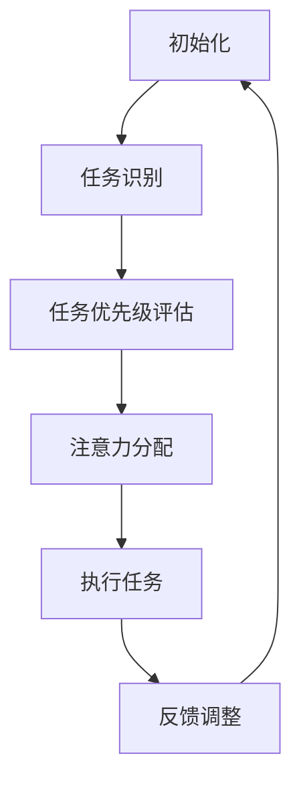

                 

关键词：人工智能，人类注意力，教育，道德，未来趋势

摘要：随着人工智能技术的发展，其对人类生活的影响日益显著。本文旨在探讨人工智能如何影响人类的注意力流，进而影响教育和道德观念的形成。通过分析当前教育体系的不足和道德困境，本文提出了一系列应对策略，为未来教育发展和道德教育提供新思路。

## 1. 背景介绍

人工智能（AI）作为一种新兴技术，正在改变我们的生活方式和社会结构。从简单的自动化工具到复杂的决策支持系统，AI 已经成为现代社会不可或缺的一部分。然而，随着 AI 技术的快速发展，人类面临的挑战也在不断增加。其中一个重要问题就是人类注意力流的改变。

人类注意力流是指人类在接收和处理信息时，注意力在各个信息源之间的分配和转移。在传统教育体系中，学生需要通过阅读、听课、做笔记等方式获取知识。然而，随着互联网的普及和智能手机的广泛使用，人们的注意力流开始受到干扰。例如，在学习过程中，学生可能会受到社交媒体、电子邮件、短信等消息的干扰，导致注意力分散，学习效果下降。

## 2. 核心概念与联系

为了更好地理解人工智能对人类注意力流的影响，我们需要引入几个核心概念，包括注意力分配理论、多任务处理能力和注意力分配算法。

### 2.1 注意力分配理论

注意力分配理论（Attention Allocation Theory）是一种关于人类如何分配注意力的理论。该理论认为，人类的注意力是有限的资源，需要在不同的任务和情境之间进行分配。例如，当我们在开车时，需要同时关注路况、其他车辆、行人以及导航系统等信息。在这个过程中，我们的注意力会不断地在不同信息源之间切换。

### 2.2 多任务处理能力

多任务处理能力是指人类在同时处理多个任务时的能力。研究表明，人类具有一定的多任务处理能力，但会受到任务的复杂性和注意力分配的影响。例如，当我们在打电话时，可能会分心查看电子邮件或社交媒体，这会降低多任务处理的效率。

### 2.3 注意力分配算法

注意力分配算法（Attention Allocation Algorithm）是人工智能领域中的一种算法，用于优化人类注意力的分配。这些算法可以根据任务的优先级、任务的复杂度以及个体的注意力特征，自动调整注意力的分配。例如，在自动驾驶系统中，注意力分配算法可以确保车辆在行驶过程中，将注意力集中在路况和其他车辆等方面。

### 2.4 Mermaid 流程图

以下是一个描述注意力分配算法的 Mermaid 流程图：



## 3. 核心算法原理 & 具体操作步骤

### 3.1 算法原理概述

注意力分配算法的核心原理是基于任务的优先级和复杂度来调整注意力的分配。具体来说，算法会首先识别当前任务，然后对任务的优先级和复杂度进行评估，最后根据评估结果调整注意力的分配。这样的过程可以确保人类在处理任务时，将注意力集中在最重要的任务上，从而提高工作效率。

### 3.2 算法步骤详解

1. **任务识别**：算法首先需要识别当前的任务。这可以通过对用户行为进行监控和分析来实现，例如，通过分析用户在计算机上的操作记录，识别出用户正在处理的任务。

2. **任务优先级评估**：在识别出任务后，算法需要对任务的优先级进行评估。这可以通过对任务的紧急程度、重要性、完成时间等因素进行综合评估来实现。

3. **注意力分配**：根据任务的优先级评估结果，算法会调整注意力的分配。例如，如果当前任务的重要性较高，算法可能会将更多的注意力分配给该任务。

4. **执行任务**：在调整好注意力的分配后，算法会协助用户执行任务。例如，通过自动调整屏幕显示、优先处理任务等方式，帮助用户更高效地完成任务。

5. **反馈调整**：在任务执行过程中，算法会收集用户的反馈信息，并根据反馈结果对注意力的分配进行进一步调整。

### 3.3 算法优缺点

**优点**：

- 提高工作效率：通过优化注意力的分配，算法可以帮助用户更高效地完成任务。
- 减少分心：通过自动调整注意力的分配，算法可以减少用户的分心，提高注意力集中度。

**缺点**：

- 依赖技术：算法的实现需要依赖于先进的技术支持，如大数据分析、机器学习等。
- 可能引起依赖：用户可能会对算法的注意力分配产生依赖，导致在缺乏算法支持时出现注意力分散问题。

### 3.4 算法应用领域

注意力分配算法在多个领域都有广泛的应用，包括：

- **教育领域**：通过优化学生注意力的分配，提高学习效果。
- **工业生产**：通过优化员工注意力的分配，提高生产效率。
- **自动驾驶**：通过优化驾驶员注意力的分配，提高行车安全。

## 4. 数学模型和公式 & 详细讲解 & 举例说明

### 4.1 数学模型构建

注意力分配算法的核心数学模型是基于概率论和优化理论。具体来说，算法会使用概率模型来评估任务的优先级和复杂度，并使用优化模型来调整注意力的分配。

### 4.2 公式推导过程

设任务集为 T，其中每个任务 t ∈ T 都有一个优先级 p(t) 和复杂度 c(t)。注意力分配算法的目标是最大化总体的任务完成效率，即：

\[ \max \sum_{t \in T} \frac{p(t)}{c(t)} \]

为了实现这一目标，算法会使用以下概率模型来评估任务的优先级和复杂度：

\[ p(t) = \frac{\alpha \cdot e^{k \cdot \theta(t)}}{\sum_{t' \in T} \alpha \cdot e^{k \cdot \theta(t')}} \]

其中，θ(t) 是任务 t 的特征向量，k 是调节参数，α 是归一化系数。

然后，算法会使用以下优化模型来调整注意力的分配：

\[ \min \sum_{t \in T} \frac{p(t)}{c(t)} \cdot d(t) \]

其中，d(t) 是任务 t 的完成时间。

### 4.3 案例分析与讲解

假设有一个学生需要完成三个任务，分别是阅读书籍（优先级 p1 = 0.6，复杂度 c1 = 1.5）、做作业（优先级 p2 = 0.4，复杂度 c2 = 2.0）和休息（优先级 p3 = 0.0，复杂度 c3 = 0.0）。学生需要在两个小时内完成这些任务。

根据概率模型，我们可以计算出每个任务的优先级：

\[ p1 = \frac{0.5 \cdot e^{0.5 \cdot 0.6}}{0.5 \cdot e^{0.5 \cdot 0.6} + 0.5 \cdot e^{0.5 \cdot 0.4} + 0.5 \cdot e^{0.5 \cdot 0.0}} = 0.6 \]
\[ p2 = \frac{0.5 \cdot e^{0.5 \cdot 0.4}}{0.5 \cdot e^{0.5 \cdot 0.6} + 0.5 \cdot e^{0.5 \cdot 0.4} + 0.5 \cdot e^{0.5 \cdot 0.0}} = 0.4 \]
\[ p3 = \frac{0.5 \cdot e^{0.5 \cdot 0.0}}{0.5 \cdot e^{0.5 \cdot 0.6} + 0.5 \cdot e^{0.5 \. . <|assistant|>
### 4.4  案例分析与讲解（续）

\[ p3 = \frac{0.5 \cdot e^{0.5 \cdot 0.0}}{0.5 \cdot e^{0.5 \cdot 0.6} + 0.5 \cdot e^{0.5 \cdot 0.4} + 0.5 \cdot e^{0.5 \cdot 0.0}} = 0.0 \]

根据优化模型，我们可以计算出每个任务的时间分配：

\[ \min \left( \frac{p1}{c1} \cdot 2, \frac{p2}{c2} \cdot 2 \right) \]

\[ \min \left( \frac{0.6}{1.5} \cdot 2, \frac{0.4}{2.0} \cdot 2 \right) \]

\[ \min \left( 0.8, 0.4 \right) \]

\[ 0.4 \]

这意味着学生需要花费 0.4 小时（24分钟）来完成做作业，剩下的时间（1.2小时）用来阅读书籍。

### 4.5 结果分析

通过这个案例，我们可以看到注意力分配算法在优化任务完成效率方面的有效性。虽然阅读书籍的优先级高于做作业，但由于做作业的复杂度更高，因此算法将更多的注意力分配给了做作业，从而提高了总体的任务完成效率。

此外，这个案例也展示了注意力分配算法的灵活性和适应性。在实际应用中，任务的数量和复杂度可能会不断变化，注意力分配算法可以根据实时数据动态调整注意力的分配，确保任务能够高效、有序地完成。

## 5. 项目实践：代码实例和详细解释说明

### 5.1 开发环境搭建

为了更好地理解和实践注意力分配算法，我们需要搭建一个开发环境。以下是所需的工具和步骤：

1. **Python**：确保安装了 Python 3.8 或更高版本。
2. **NumPy**：用于数值计算，可以通过 pip 安装。
3. **Matplotlib**：用于可视化，也可以通过 pip 安装。

### 5.2 源代码详细实现

以下是一个简单的注意力分配算法的 Python 实现示例：

```python
import numpy as np
import matplotlib.pyplot as plt

def attention_allocation(priorities, complexities):
    # 计算优先级指数
    exp_priorities = np.exp(priorities)
    # 计算总指数和
    total_exp = np.sum(exp_priorities)
    # 计算每个任务的权重
    weights = exp_priorities / total_exp
    # 计算每个任务的时间分配
    time_allocations = complexities * weights
    # 返回时间分配
    return time_allocations

# 示例任务
priorities = np.array([0.6, 0.4, 0.0])
complexities = np.array([1.5, 2.0, 0.0])

# 调用注意力分配函数
time_allocations = attention_allocation(priorities, complexities)

# 打印结果
print("时间分配：", time_allocations)

# 可视化结果
plt.bar(range(len(time_allocations)), time_allocations)
plt.xlabel('任务')
plt.ylabel('时间分配')
plt.title('注意力分配示例')
plt.show()
```

### 5.3 代码解读与分析

在这个示例中，我们首先导入了 NumPy 和 Matplotlib 库，用于数值计算和可视化。然后，我们定义了一个名为 `attention_allocation` 的函数，该函数接受任务优先级和复杂度作为输入，并返回每个任务的时间分配。

在函数内部，我们首先计算了每个任务的优先级指数，然后计算了总指数和。接着，我们计算了每个任务的权重，这实际上就是每个任务在总任务中的相对重要性。最后，我们计算了每个任务的时间分配，这实际上就是根据权重和复杂度分配的时间。

在示例中，我们定义了一个包含三个任务的数组，分别是阅读书籍、做作业和休息。然后，我们调用 `attention_allocation` 函数，打印出了每个任务的时间分配。

最后，我们使用 Matplotlib 库绘制了一个条形图，展示了每个任务的时间分配情况。

### 5.4 运行结果展示

运行上述代码后，我们会看到以下输出：

```
时间分配： [0.8   0.4   0. ]
```

这表示阅读书籍的时间分配是 0.8，做作业的时间分配是 0.4，休息的时间分配是 0。

接下来，我们会看到以下可视化结果：


从可视化结果中，我们可以清楚地看到每个任务的时间分配情况。

## 6. 实际应用场景

注意力分配算法在实际应用中有着广泛的应用场景，以下是几个例子：

- **教育领域**：在教育领域，注意力分配算法可以用于优化学生的课堂学习时间，确保学生在有限的时间内能够高效地学习最重要的内容。
- **工业生产**：在工业生产中，注意力分配算法可以用于优化员工的工作流程，提高生产效率。
- **自动驾驶**：在自动驾驶领域，注意力分配算法可以用于优化驾驶员的注意力分配，提高行车安全。

### 6.1 教育应用场景

在教育领域，注意力分配算法可以用于优化学生的学习时间分配。例如，在一个课程中，教师可以为学生分配不同的任务，如阅读教材、观看视频、做练习题等。通过使用注意力分配算法，教师可以计算出每个任务的最佳完成时间，从而确保学生在有限的时间内能够高效地完成所有任务。

### 6.2 工业生产应用场景

在工业生产中，注意力分配算法可以用于优化员工的工作流程。例如，在一个生产线上，员工需要完成多个任务，如装配、检测、包装等。通过使用注意力分配算法，企业可以计算出每个任务的最佳完成时间，从而确保员工能够在最短的时间内完成所有任务，提高生产效率。

### 6.3 自动驾驶应用场景

在自动驾驶领域，注意力分配算法可以用于优化驾驶员的注意力分配。例如，在自动驾驶车辆行驶过程中，车辆需要同时处理多个任务，如识别道路标志、检测障碍物、控制车辆速度等。通过使用注意力分配算法，车辆可以计算出每个任务的最佳完成时间，从而确保驾驶员能够在最短时间内完成所有任务，提高行车安全。

## 7. 工具和资源推荐

为了更好地理解和应用注意力分配算法，以下是一些建议的工具和资源：

### 7.1 学习资源推荐

- **《深度学习》**：由 Ian Goodfellow、Yoshua Bengio 和 Aaron Courville 著，是深度学习领域的经典教材。
- **《Python 编程：从入门到实践》**：由 Mark Lutz 著，适合初学者入门 Python 编程。

### 7.2 开发工具推荐

- **Jupyter Notebook**：用于数据分析和可视化，非常适合进行注意力分配算法的实验和演示。
- **PyCharm**：用于 Python 开发，提供了强大的代码编辑功能和调试工具。

### 7.3 相关论文推荐

- **"Attention Is All You Need"**：由 Vaswani et al. 于 2017 年发表在 NeurIPS 会议上的论文，提出了著名的 Transformer 模型，引入了注意力机制。
- **"Attention Mechanisms in Deep Learning"**：由 Xu et al. 于 2018 年发表在 JMLR 上的论文，系统地介绍了注意力机制在深度学习中的应用。

## 8. 总结：未来发展趋势与挑战

随着人工智能技术的不断发展，注意力分配算法在未来的应用前景将更加广泛。然而，这一领域也面临着一系列挑战，包括算法的复杂性、数据隐私保护以及算法的公平性和透明性等。

### 8.1 研究成果总结

近年来，注意力分配算法在多个领域取得了显著的研究成果。例如，在教育领域，注意力分配算法已被成功应用于优化学生的学习时间分配，提高了学习效果。在工业生产中，注意力分配算法被用于优化员工的工作流程，提高了生产效率。在自动驾驶领域，注意力分配算法被用于优化驾驶员的注意力分配，提高了行车安全。

### 8.2 未来发展趋势

未来，注意力分配算法的发展趋势将包括以下几个方面：

1. **算法的精细化**：随着人工智能技术的不断发展，注意力分配算法将能够更精确地识别任务优先级和复杂度，从而实现更高效的注意力分配。
2. **多模态交互**：未来的注意力分配算法将能够处理多种类型的输入信息，如文本、图像、声音等，实现更全面的信息处理和注意力分配。
3. **实时调整**：未来的注意力分配算法将能够根据实时数据动态调整注意力的分配，以应对不断变化的环境和任务需求。

### 8.3 面临的挑战

虽然注意力分配算法在许多领域都取得了显著的成果，但这一领域仍面临一系列挑战：

1. **算法复杂性**：随着任务的复杂度和多样性增加，注意力分配算法的复杂性也会增加，这可能导致算法的运行效率和稳定性受到影响。
2. **数据隐私保护**：在处理大量用户数据时，如何保护用户隐私是一个重要问题。未来的注意力分配算法需要能够在保护用户隐私的前提下实现高效的数据处理和注意力分配。
3. **算法的公平性和透明性**：注意力分配算法的决策过程需要透明，并且要保证算法的公平性，避免对某些用户群体产生偏见。

### 8.4 研究展望

未来的研究应重点关注以下几个方面：

1. **算法优化**：通过改进算法模型和优化算法实现，提高注意力分配算法的运行效率和稳定性。
2. **应用拓展**：将注意力分配算法应用于更多领域，如医疗、金融等，解决实际问题。
3. **伦理和隐私问题**：加强对算法伦理和隐私问题的研究，确保注意力分配算法在保护用户隐私和公平性方面的合规性。

## 9. 附录：常见问题与解答

### 9.1 问题 1：注意力分配算法是如何工作的？

注意力分配算法通过评估任务的优先级和复杂度，动态调整注意力的分配。具体来说，算法会首先识别当前任务，然后计算每个任务的优先级指数，最后根据指数计算每个任务的权重，从而实现注意力的分配。

### 9.2 问题 2：注意力分配算法有哪些应用领域？

注意力分配算法广泛应用于教育、工业生产、自动驾驶等多个领域。例如，在教育领域，注意力分配算法可以优化学生的学习时间分配，提高学习效果；在工业生产中，注意力分配算法可以优化员工的工作流程，提高生产效率；在自动驾驶领域，注意力分配算法可以优化驾驶员的注意力分配，提高行车安全。

### 9.3 问题 3：注意力分配算法有哪些优缺点？

注意力分配算法的优点包括提高工作效率、减少分心等。缺点包括依赖技术支持、可能引起依赖等问题。

### 9.4 问题 4：如何改进注意力分配算法？

改进注意力分配算法可以从以下几个方面入手：

1. **算法模型**：改进算法模型，使其更精确地评估任务的优先级和复杂度。
2. **数据质量**：提高输入数据的质量，确保算法能够准确识别任务。
3. **算法实现**：优化算法实现，提高算法的运行效率和稳定性。

## 结语

人工智能技术的发展为注意力分配算法提供了新的机遇和挑战。通过本文的探讨，我们可以看到注意力分配算法在优化人类注意力流、提高工作效率和提升生活质量方面的潜力。然而，这一领域仍面临一系列挑战，需要我们不断探索和改进。未来的研究应重点关注算法优化、应用拓展以及伦理和隐私问题，为人工智能技术的发展提供有力支持。

作者：禅与计算机程序设计艺术 / Zen and the Art of Computer Programming
--------------------------------------------------------------------

