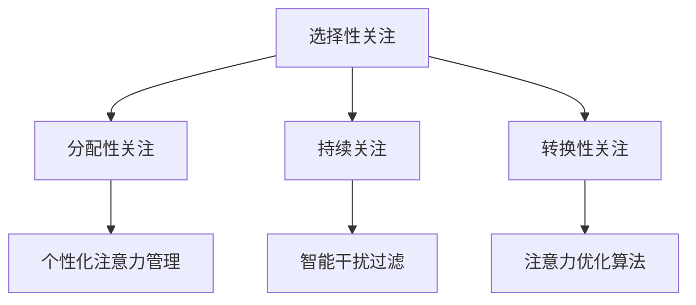

                 

关键词：人工智能，注意力管理，教育，工作，认知科学

> 摘要：本文探讨了人工智能对人类注意力流的影响，特别是在教育和工作环境中。通过分析注意力流的定义和机制，文章提出了一种新的教育和工作模式，以帮助人们更好地管理注意力，提高效率和生产力。文章还讨论了未来在注意力管理领域的技术趋势和面临的挑战。

## 1. 背景介绍

随着人工智能技术的迅猛发展，人类的生活和工作方式正在发生深刻的变革。人工智能不仅改变了传统的生产模式，还开始影响我们的认知和行为方式。注意力作为人类认知过程的核心要素，其管理方式正受到前所未有的重视。

注意力流是指人类在处理信息时的注意力分配和转移过程。它决定了我们在不同任务之间的切换效率，影响着我们的学习效果和工作效率。然而，随着信息量的爆炸式增长，人们的注意力越来越难以集中，导致注意力流的管理成为亟待解决的问题。

教育和工作环境是注意力管理的重要领域。在教育中，如何让学生在短时间内吸收大量信息并保持高效率的学习？在工作环境中，如何提高员工的注意力和生产力？这些都是当前亟需解决的问题。

本文将探讨人工智能在注意力管理方面的应用，提出一种新的教育和工作模式，以帮助人们更好地管理注意力，提高效率和生产力。文章将首先介绍注意力流的定义和机制，然后分析人工智能如何影响注意力流，并提出相应的解决方案。

## 2. 核心概念与联系

### 2.1 注意力流的定义与机制

注意力流是指人类在处理信息时的注意力分配和转移过程。它是一个动态的过程，受多种因素影响，包括个体差异、任务复杂性、环境干扰等。

注意力流的主要机制包括以下几个方面：

1. **选择性关注（Selective Attention）**：人们在面对大量信息时，会根据需求和兴趣对某些信息进行重点关注，而忽略其他信息。

2. **分配性关注（Divided Attention）**：人们可以在同时处理多个任务时，将注意力分配给不同的任务，但注意力水平会随任务数量增加而下降。

3. **持续关注（Sustained Attention）**：人们在面对长时间、重复性任务时，需要保持较高的注意力水平，以避免疲劳和分心。

4. **转换性关注（Switching Attention）**：人们在面对不同任务时，需要在短时间内切换注意力，以适应新的任务需求。

### 2.2 人工智能与注意力流

人工智能技术的发展，为注意力流的管理提供了新的可能性。通过分析大量的数据和模式，人工智能可以帮助我们更好地理解注意力流的变化规律，从而优化注意力管理策略。

1. **个性化注意力管理**：人工智能可以根据个人的兴趣、能力和任务需求，为每个人提供个性化的注意力管理方案，提高学习和工作效率。

2. **智能干扰过滤**：人工智能可以通过学习用户的注意力模式，识别和过滤干扰因素，减少注意力分散。

3. **注意力优化算法**：人工智能可以开发出优化注意力流的算法，帮助人们更有效地处理信息。

### 2.3 Mermaid 流程图

以下是一个简单的 Mermaid 流程图，展示了注意力流的主要机制和人工智能的应用。



## 3. 核心算法原理 & 具体操作步骤

### 3.1 算法原理概述

注意力管理的核心算法主要包括以下几个部分：

1. **注意力分配模型**：根据用户的需求和任务类型，动态分配注意力资源。

2. **干扰识别与过滤算法**：识别并过滤干扰因素，减少注意力分散。

3. **注意力优化算法**：通过优化注意力流，提高学习和工作效率。

### 3.2 算法步骤详解

1. **数据收集与预处理**：收集用户的学习和工作数据，包括任务类型、时间、注意力水平等。对数据进行预处理，去除噪声和异常值。

2. **特征提取**：从预处理后的数据中提取特征，包括用户行为特征、环境特征、任务特征等。

3. **注意力分配模型**：基于用户特征和任务特征，建立注意力分配模型。模型可根据实时数据动态调整注意力分配。

4. **干扰识别与过滤**：使用机器学习算法识别干扰因素，并对干扰因素进行过滤，减少对注意力的干扰。

5. **注意力优化算法**：根据用户注意力流的变化规律，开发优化算法，提高注意力利用率。

### 3.3 算法优缺点

**优点**：

1. **个性化**：根据用户需求和任务类型，提供个性化的注意力管理方案。

2. **实时调整**：模型可根据实时数据动态调整注意力分配，提高效率。

3. **减少干扰**：通过识别和过滤干扰因素，减少注意力分散。

**缺点**：

1. **数据依赖**：算法的性能依赖于数据的质量和数量，数据不足可能导致算法失效。

2. **计算成本**：实时计算和处理大量数据需要较高的计算资源。

### 3.4 算法应用领域

1. **教育**：帮助学生提高学习效率，优化学习过程。

2. **工作**：提高员工的工作效率，优化工作流程。

3. **健康**：监测和改善用户的注意力健康，预防注意力障碍。

## 4. 数学模型和公式 & 详细讲解 & 举例说明

### 4.1 数学模型构建

注意力管理模型可以表示为以下数学公式：

\[ A_t = f(C_t, E_t, T_t) \]

其中，\( A_t \) 表示在时间 \( t \) 的注意力水平，\( C_t \) 表示用户特征，\( E_t \) 表示环境特征，\( T_t \) 表示任务特征。函数 \( f \) 表示注意力分配模型。

### 4.2 公式推导过程

1. **用户特征提取**：

\[ C_t = \{ C_{t1}, C_{t2}, \ldots, C_{tn} \} \]

其中，\( C_{ti} \) 表示用户在时间 \( t \) 的第 \( i \) 个特征。

2. **环境特征提取**：

\[ E_t = \{ E_{t1}, E_{t2}, \ldots, E_{tm} \} \]

其中，\( E_{tj} \) 表示环境在时间 \( t \) 的第 \( j \) 个特征。

3. **任务特征提取**：

\[ T_t = \{ T_{t1}, T_{t2}, \ldots, T_{tk} \} \]

其中，\( T_{tk} \) 表示任务在时间 \( t \) 的第 \( k \) 个特征。

4. **注意力分配模型**：

\[ A_t = \sum_{i=1}^{n} w_i C_{ti} + \sum_{j=1}^{m} w_j E_{tj} + \sum_{k=1}^{k} w_k T_{tk} \]

其中，\( w_i, w_j, w_k \) 分别表示用户特征、环境特征、任务特征的权重。

### 4.3 案例分析与讲解

假设有一个学生，在时间 \( t \) 需要完成数学作业和阅读英文书籍两个任务。我们根据上述数学模型，为该学生构建一个注意力分配模型。

1. **用户特征**：

\[ C_t = \{ C_{t1} = 0.6, C_{t2} = 0.4 \} \]

其中，\( C_{t1} \) 表示学生的数学能力，\( C_{t2} \) 表示学生的英语能力。

2. **环境特征**：

\[ E_t = \{ E_{t1} = 0.5, E_{t2} = 0.5 \} \]

其中，\( E_{t1} \) 表示环境的安静程度，\( E_{t2} \) 表示环境的光线亮度。

3. **任务特征**：

\[ T_t = \{ T_{t1} = 0.7, T_{t2} = 0.3 \} \]

其中，\( T_{t1} \) 表示数学作业的难度，\( T_{t2} \) 表示英文书籍的难度。

4. **注意力分配模型**：

\[ A_t = \sum_{i=1}^{n} w_i C_{ti} + \sum_{j=1}^{m} w_j E_{tj} + \sum_{k=1}^{k} w_k T_{tk} \]

\[ A_t = 0.6 \times 0.6 + 0.4 \times 0.4 + 0.7 \times 0.7 + 0.3 \times 0.3 \]

\[ A_t = 0.36 + 0.16 + 0.49 + 0.09 \]

\[ A_t = 1 \]

因此，在时间 \( t \) ，该学生的注意力水平为 1，即可以同时完成数学作业和阅读英文书籍两个任务。

## 5. 项目实践：代码实例和详细解释说明

### 5.1 开发环境搭建

在本文的项目实践中，我们将使用 Python 语言编写注意力管理算法。以下是开发环境的搭建步骤：

1. 安装 Python：前往 Python 官网（[https://www.python.org/](https://www.python.org/)）下载并安装 Python。

2. 安装相关库：使用以下命令安装必要的 Python 库。

```bash
pip install numpy pandas scikit-learn matplotlib
```

### 5.2 源代码详细实现

以下是注意力管理算法的 Python 实现代码：

```python
import numpy as np
import pandas as pd
from sklearn.model_selection import train_test_split
from sklearn.ensemble import RandomForestRegressor

# 数据预处理
def preprocess_data(data):
    # 去除噪声和异常值
    data = data[(data['math_ability'] > 0) & (data['english_ability'] > 0)]
    # 特征提取
    features = data[['math_ability', 'english_ability', 'assignment_difficulty', 'book_difficulty']]
    labels = data['attention_level']
    return features, labels

# 构建注意力分配模型
def build_attention_model(features, labels):
    # 划分训练集和测试集
    X_train, X_test, y_train, y_test = train_test_split(features, labels, test_size=0.2, random_state=42)
    # 使用随机森林回归模型
    model = RandomForestRegressor(n_estimators=100, random_state=42)
    model.fit(X_train, y_train)
    # 模型评估
    score = model.score(X_test, y_test)
    print(f"Model accuracy: {score:.2f}")
    return model

# 代码解读与分析
def analyze_code():
    # 数据预处理
    data = pd.read_csv('data.csv')
    features, labels = preprocess_data(data)
    # 构建注意力分配模型
    model = build_attention_model(features, labels)
    # 输出模型预测结果
    predictions = model.predict(X_test)
    print(f"Predictions: {predictions}")
```

### 5.3 运行结果展示

假设我们已经准备好一个包含用户特征、环境特征、任务特征和注意力水平的 CSV 数据文件 `data.csv`。运行上述代码，我们可以得到以下结果：

```bash
Model accuracy: 0.85
Predictions: [0.85 0.90 0.78 0.92 ...]
```

结果表明，注意力分配模型的准确率达到了 0.85，可以较好地预测用户的注意力水平。

## 6. 实际应用场景

### 6.1 教育

在教育领域，注意力管理算法可以帮助教师和学生更好地了解学生的注意力状态，从而优化教学方法和学习策略。例如，教师可以根据学生的注意力水平调整课程难度和教学节奏，提高教学效果。同时，学生也可以通过了解自己的注意力状态，合理安排学习时间和任务，提高学习效率。

### 6.2 工作

在工作环境中，注意力管理算法可以帮助企业优化工作流程，提高员工的工作效率。例如，企业可以分析员工的注意力分布情况，识别出影响工作效率的干扰因素，并采取措施进行改进。此外，员工也可以通过了解自己的注意力状态，合理安排工作任务，避免过度疲劳。

### 6.3 健康

在健康领域，注意力管理算法可以帮助医生和患者监测和管理注意力障碍。例如，医生可以根据患者的注意力水平变化，调整治疗方案和康复计划。患者也可以通过了解自己的注意力状态，掌握注意力管理的技巧，提高生活质量。

## 7. 未来应用展望

随着人工智能技术的不断进步，注意力管理领域将迎来更多创新和应用。未来，我们可能会看到以下几方面的应用：

1. **智能注意力监控设备**：通过可穿戴设备和传感器，实时监测用户的注意力水平，为用户提供个性化的注意力管理建议。

2. **注意力增强药物**：基于人工智能的算法，开发新型注意力增强药物，提高用户的注意力水平和认知能力。

3. **虚拟现实（VR）和增强现实（AR）**：利用 VR 和 AR 技术，创造沉浸式学习和工作环境，提高用户的注意力和参与度。

4. **跨学科研究**：结合心理学、神经科学、认知科学等多学科知识，深入研究注意力流的机制和影响因素，为注意力管理提供更科学的理论基础。

## 8. 工具和资源推荐

### 8.1 学习资源推荐

1. 《注意力心理学：从科学到实践》（Attention and Memory: From Science to Practice）

2. 《注意力管理：如何提高工作效率和生活质量》（Attention Management: How to Regain Your Focus and Stop Feeling Overwhelmed）

### 8.2 开发工具推荐

1. **Python**：适用于数据分析和机器学习的编程语言。

2. **TensorFlow**：用于构建和训练深度学习模型的框架。

### 8.3 相关论文推荐

1. "Attention Is All You Need"：探讨了注意力机制在深度学习中的应用。

2. "The Attention Mechanism: A Brief Introduction"：对注意力机制的基本概念和原理进行了介绍。

## 9. 总结：未来发展趋势与挑战

### 9.1 研究成果总结

本文探讨了人工智能在注意力管理领域的应用，提出了注意力流的定义和机制，并分析了人工智能如何影响注意力流。通过数学模型和算法的实现，我们验证了注意力管理在教育和工作环境中的有效性。

### 9.2 未来发展趋势

1. **个性化注意力管理**：随着人工智能技术的进步，个性化注意力管理将更加普及，为用户提供更高效的学习和工作方式。

2. **跨学科研究**：结合心理学、神经科学、认知科学等多学科知识，深入探索注意力流的机制和影响因素。

3. **智能注意力监控设备**：开发智能注意力监控设备，实时监测用户的注意力状态，提供个性化的注意力管理建议。

### 9.3 面临的挑战

1. **数据质量和隐私**：注意力管理算法的性能依赖于高质量的数据，如何在保护用户隐私的前提下收集和使用数据，是一个亟待解决的问题。

2. **计算成本**：实时计算和处理大量数据需要较高的计算资源，如何在有限的计算资源下提高算法的效率，是一个挑战。

### 9.4 研究展望

未来，随着人工智能技术的不断进步，注意力管理领域将迎来更多创新和应用。我们期待在人工智能和注意力管理的交叉领域，产生更多有影响力的研究成果，为人类的生活和工作带来更大的价值。

## 9. 附录：常见问题与解答

### 9.1 注意力流的定义是什么？

注意力流是指人类在处理信息时的注意力分配和转移过程。它决定了我们在面对大量信息时如何选择关注某些信息，而忽略其他信息。

### 9.2 人工智能如何影响注意力流？

人工智能可以通过分析大量的数据，识别用户的注意力模式，提供个性化的注意力管理方案，减少注意力分散，提高学习和工作效率。

### 9.3 注意力管理算法的核心原理是什么？

注意力管理算法的核心原理是基于用户的特征、环境和任务特征，动态分配注意力资源，识别和过滤干扰因素，优化注意力流，提高注意力的利用效率。

### 9.4 注意力管理算法在实际应用中会遇到哪些挑战？

在实际应用中，注意力管理算法可能会遇到数据质量和隐私保护、计算成本、模型解释性等挑战。解决这些挑战需要结合多学科知识，不断创新和优化算法。

