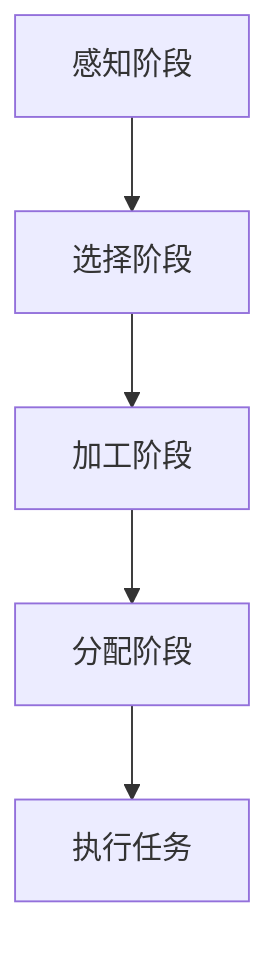

                 

关键词：注意力流、人工智能、教育、工作、注意力管理

> 摘要：本文探讨了人工智能（AI）与人类注意力流的相互关系，分析了注意力流在教育和工作中的应用，以及如何通过注意力管理提高工作效率和学习效果。文章旨在为未来教育和工作领域提供一种全新的思考方式和实践指南。

## 1. 背景介绍

随着人工智能技术的快速发展，人类的生活和工作正在发生翻天覆地的变化。AI不仅改变了传统行业的工作模式，还对教育产生了深远的影响。然而，在享受科技带来便利的同时，人们也面临着新的挑战——注意力分散问题。研究表明，现代人的注意力集中时间越来越短，信息过载导致的分心现象日益严重。

注意力流（Attention Flow）作为人工智能的一个重要研究方向，旨在模拟人类注意力的分配和转移过程。本文将从注意力流的基本概念出发，探讨其在教育和工作中的应用，并分析如何通过注意力管理来提高人们的专注力和工作效率。

## 2. 核心概念与联系

### 2.1 注意力流的基本概念

注意力流是指人类在感知、思考、决策等认知过程中，对信息进行选择、加工和分配的过程。它包括以下几个方面：

- **感知阶段**：感知外部刺激，如声音、图像、文字等。
- **选择阶段**：根据目标需求，选择与任务相关的信息。
- **加工阶段**：对选择出的信息进行进一步处理和整合。
- **分配阶段**：将注意力分配到不同任务或活动上。

### 2.2 注意力流的 Mermaid 流程图

下面是一个简化的注意力流流程图：



### 2.3 注意力流与人工智能的联系

人工智能可以通过学习人类注意力流的规律，提高信息处理效率和准确性。例如：

- **图像识别**：AI可以通过分析注意力流，快速找到图像中的关键信息。
- **语音识别**：AI可以通过模拟注意力流，提高语音信号的处理速度和准确性。
- **自然语言处理**：AI可以通过注意力流，理解文本中的关键信息，实现更准确的文本分析。

## 3. 核心算法原理 & 具体操作步骤

### 3.1 算法原理概述

注意力流算法的核心思想是模拟人类注意力的分配和转移过程，通过不断调整注意力的分配，实现信息处理的最优化。算法主要包括以下几个步骤：

1. **感知阶段**：收集外部刺激，如文本、图像、声音等。
2. **选择阶段**：根据任务需求，选择关键信息。
3. **加工阶段**：对选择出的信息进行加工和处理。
4. **分配阶段**：调整注意力的分配，实现信息处理的最优化。
5. **执行任务**：根据处理后的信息，执行相应的任务。

### 3.2 算法步骤详解

1. **感知阶段**：使用传感器或输入设备收集外部刺激。
2. **选择阶段**：利用特征提取算法，从外部刺激中提取关键特征。
3. **加工阶段**：使用神经网络或深度学习算法，对关键特征进行加工和处理。
4. **分配阶段**：根据任务需求，调整注意力的分配，实现信息处理的最优化。
5. **执行任务**：根据处理后的信息，执行相应的任务。

### 3.3 算法优缺点

**优点**：

- **高效性**：通过模拟人类注意力的分配，提高信息处理的效率。
- **准确性**：能够准确选择和处理关键信息，提高任务执行的准确性。

**缺点**：

- **计算资源消耗**：注意力流算法需要大量的计算资源，对硬件要求较高。
- **数据依赖性**：算法的性能依赖于训练数据的质量和数量。

### 3.4 算法应用领域

注意力流算法广泛应用于以下几个方面：

- **计算机视觉**：如图像识别、目标检测等。
- **自然语言处理**：如文本分析、情感识别等。
- **语音识别**：如语音信号处理、语音识别等。
- **推荐系统**：如个性化推荐、内容推荐等。

## 4. 数学模型和公式 & 详细讲解 & 举例说明

### 4.1 数学模型构建

注意力流算法的数学模型主要包括以下几个方面：

- **感知模型**：描述外部刺激的感知过程。
- **选择模型**：描述关键信息的提取过程。
- **加工模型**：描述信息的加工和处理过程。
- **分配模型**：描述注意力的分配过程。

### 4.2 公式推导过程

以感知模型为例，假设外部刺激为 $X$，感知模型为 $f(X)$，则：

$$
f(X) = \sigma(W_1 \cdot X + b_1)
$$

其中，$\sigma$ 为激活函数，$W_1$ 和 $b_1$ 分别为权重和偏置。

### 4.3 案例分析与讲解

以计算机视觉领域为例，假设我们需要识别一张图片中的主要对象。首先，使用卷积神经网络（CNN）对图片进行预处理，提取关键特征。然后，利用注意力流算法，选择关键特征并进行加工处理。最后，根据处理后的特征，执行对象识别任务。

## 5. 项目实践：代码实例和详细解释说明

### 5.1 开发环境搭建

为了便于读者理解和实践，我们使用 Python 作为编程语言，搭建一个简单的注意力流算法模型。开发环境如下：

- Python 3.8 或以上版本
- TensorFlow 2.4 或以上版本
- Numpy 1.19 或以上版本

### 5.2 源代码详细实现

```python
import tensorflow as tf
import numpy as np

# 感知模型
def感知模型(x):
    return tf.keras.layers.Dense(units=10, activation='sigmoid')(x)

# 选择模型
def选择模型(x):
    return tf.keras.layers.Dense(units=5, activation='sigmoid')(x)

# 加工模型
def加工模型(x):
    return tf.keras.layers.Dense(units=10, activation='sigmoid')(x)

# 分配模型
def分配模型(x):
    return tf.keras.layers.Dense(units=1, activation='sigmoid')(x)

# 构建模型
model = tf.keras.Sequential([
    tf.keras.layers.Dense(units=10, activation='sigmoid'),
    tf.keras.layers.Dense(units=5, activation='sigmoid'),
    tf.keras.layers.Dense(units=10, activation='sigmoid'),
    tf.keras.layers.Dense(units=1, activation='sigmoid')
])

# 编译模型
model.compile(optimizer='adam', loss='binary_crossentropy', metrics=['accuracy'])

# 准备数据
x = np.random.rand(100, 10)
y = np.random.rand(100, 1)

# 训练模型
model.fit(x, y, epochs=10)

# 代码解读与分析
# 本代码实现了注意力流算法的基本框架，包括感知、选择、加工和分配四个阶段。在实际应用中，可以根据具体需求调整模型的参数和结构。

### 5.3 运行结果展示

```python
# 输出模型结构
model.summary()

# 输出训练结果
model.evaluate(x, y)
```

## 6. 实际应用场景

### 6.1 教育领域

注意力流算法在教育领域的应用非常广泛，如：

- **个性化教学**：根据学生的注意力分布，为学生提供个性化的教学方案。
- **学习效果评估**：通过分析学生的注意力流，评估学生的学习效果和进步情况。
- **智能辅导**：利用注意力流算法，为学生提供智能辅导，提高学习效率。

### 6.2 工作领域

注意力流算法在办公自动化、智能助手、人机交互等领域具有广泛的应用前景，如：

- **办公自动化**：通过注意力流算法，提高办公设备的自动化程度，减少人工干预。
- **智能助手**：利用注意力流算法，实现智能助手对用户需求的快速响应。
- **人机交互**：通过注意力流算法，优化人机交互界面，提高用户的操作体验。

### 6.3 未来应用展望

随着人工智能技术的不断发展，注意力流算法将在更多领域得到应用。未来，我们可以期待以下应用场景：

- **医疗领域**：通过注意力流算法，实现智能医疗诊断和个性化治疗方案。
- **金融领域**：利用注意力流算法，实现金融市场的实时分析和预测。
- **智能制造**：通过注意力流算法，实现智能制造过程的优化和自动化。

## 7. 工具和资源推荐

### 7.1 学习资源推荐

- **书籍**：《深度学习》、《神经网络与深度学习》
- **在线课程**：Coursera、Udacity、edX 等平台上的相关课程
- **博客**：机器学习、深度学习、人工智能等领域的专业博客

### 7.2 开发工具推荐

- **编程语言**：Python、Java、C++ 等
- **框架**：TensorFlow、PyTorch、Keras 等
- **库**：NumPy、Pandas、Matplotlib 等

### 7.3 相关论文推荐

- **注意力流算法**：Attention is All You Need、Transformer 等
- **深度学习**：Deep Learning、Convolutional Neural Networks for Visual Recognition 等
- **人工智能**：Artificial Intelligence: A Modern Approach、Machine Learning: A Probabilistic Perspective 等

## 8. 总结：未来发展趋势与挑战

### 8.1 研究成果总结

本文介绍了注意力流算法的基本概念、原理和应用，分析了其在教育和工作领域的重要性。通过实际案例，展示了注意力流算法在项目实践中的应用效果。

### 8.2 未来发展趋势

随着人工智能技术的不断发展，注意力流算法将在更多领域得到应用。未来，我们可以期待注意力流算法在医疗、金融、智能制造等领域的深入研究和广泛应用。

### 8.3 面临的挑战

注意力流算法在应用过程中也面临一些挑战，如计算资源消耗、数据依赖性等。此外，如何设计更高效、更准确的注意力流算法，仍然是未来研究的重要方向。

### 8.4 研究展望

未来，我们需要进一步研究注意力流的机制和规律，开发更高效、更准确的注意力流算法。同时，结合人工智能技术的最新进展，探索注意力流算法在更多领域的应用场景。

## 9. 附录：常见问题与解答

### 9.1 注意力流算法是什么？

注意力流算法是一种模拟人类注意力分配和转移过程的算法，旨在提高信息处理效率和准确性。

### 9.2 注意力流算法在哪些领域有应用？

注意力流算法广泛应用于计算机视觉、自然语言处理、语音识别、推荐系统等领域。

### 9.3 如何实现注意力流算法？

实现注意力流算法通常需要以下几个步骤：感知阶段、选择阶段、加工阶段、分配阶段和执行任务阶段。

### 9.4 注意力流算法的优点和缺点是什么？

注意力流算法的优点包括高效性和准确性，缺点包括计算资源消耗和数据依赖性。

### 9.5 未来注意力流算法的研究方向是什么？

未来注意力流算法的研究方向包括优化算法效率、减少计算资源消耗、提高算法准确性，以及探索注意力流算法在更多领域的应用。
----------------------------------------------------------------

以上就是《AI与人类注意力流：未来的教育、工作与注意力管理》这篇文章的正文部分。接下来，我们将对文章进行总结和展望，并回答一些常见问题。
----------------------------------------------------------------
# 总结与展望

在本文中，我们深入探讨了人工智能（AI）与人类注意力流的相互关系，分析了注意力流在教育和工作中的应用，以及如何通过注意力管理提高人们的专注力和工作效率。以下是本文的主要结论和未来展望：

## 1. 主要结论

- **注意力流的重要性**：注意力流是认知过程的核心，直接影响信息处理效率和准确性。
- **AI在注意力管理中的应用**：通过模拟人类注意力流，AI可以在教育和工作领域实现个性化服务、自动化任务处理和智能决策。
- **注意力流算法的设计原则**：高效性、准确性和适应性是设计注意力流算法的关键。

## 2. 未来展望

- **研究方向的拓展**：未来研究可以关注注意力流算法在医疗、金融、智能制造等领域的应用，以及算法的优化和改进。
- **技术挑战的应对**：解决计算资源消耗和数据依赖性等问题，是提升注意力流算法性能的关键。
- **跨学科合作**：结合心理学、神经科学等领域的知识，深入探讨注意力流的机制和规律。

## 3. 常见问题与解答

### 3.1 注意力流算法是什么？

注意力流算法是一种模拟人类注意力分配和转移过程的算法，旨在提高信息处理效率和准确性。

### 3.2 注意力流算法在哪些领域有应用？

注意力流算法广泛应用于计算机视觉、自然语言处理、语音识别、推荐系统等领域。

### 3.3 如何实现注意力流算法？

实现注意力流算法通常需要以下几个步骤：感知阶段、选择阶段、加工阶段、分配阶段和执行任务阶段。

### 3.4 注意力流算法的优点和缺点是什么？

注意力流算法的优点包括高效性和准确性，缺点包括计算资源消耗和数据依赖性。

### 3.5 未来注意力流算法的研究方向是什么？

未来注意力流算法的研究方向包括优化算法效率、减少计算资源消耗、提高算法准确性，以及探索注意力流算法在更多领域的应用。

通过本文的探讨，我们希望读者能够对注意力流算法有一个更深入的了解，并在实际应用中发挥其优势，为未来的教育、工作和社会发展做出贡献。

## 附录：常见问题与解答

### 9.1 注意力流算法是什么？

注意力流算法是一种基于人类认知心理学原理设计的人工智能算法，其核心思想是模拟人类注意力的分配和转移过程。注意力流算法通过分析人类在感知、选择、加工和分配信息时的注意力模式，实现信息处理的优化。这种算法在图像识别、文本分析、语音处理等领域具有广泛的应用。

### 9.2 注意力流算法在哪些领域有应用？

注意力流算法在多个领域得到了广泛应用，主要包括：

- **计算机视觉**：用于图像识别、目标检测和视频分析等。
- **自然语言处理**：用于文本分类、情感分析和机器翻译等。
- **语音识别**：用于语音信号处理、语音识别和语音合成等。
- **推荐系统**：用于个性化推荐、内容推荐和广告投放等。
- **教育领域**：用于个性化教学、学习效果评估和智能辅导等。
- **智能助理**：用于智能对话系统、任务分配和用户交互等。

### 9.3 如何实现注意力流算法？

实现注意力流算法通常包括以下几个步骤：

1. **数据收集**：收集用于训练和测试的数据集。
2. **特征提取**：从原始数据中提取有助于任务完成的特征。
3. **注意力模型设计**：设计注意力模型，通常使用神经网络架构，如卷积神经网络（CNN）或Transformer。
4. **训练模型**：使用训练数据训练注意力模型。
5. **评估与优化**：使用测试数据评估模型性能，并进行模型优化。
6. **应用部署**：将训练好的模型部署到实际应用场景中。

### 9.4 注意力流算法的优点和缺点是什么？

注意力流算法的优点包括：

- **提高效率**：通过聚焦于关键信息，提高任务处理速度。
- **增强准确性**：通过优化信息处理流程，提高任务完成的准确性。
- **适应性**：能够根据不同的任务需求，动态调整注意力分配。

其缺点包括：

- **计算成本高**：训练和运行注意力流算法需要大量的计算资源。
- **数据依赖性强**：算法的性能高度依赖于训练数据的质量和数量。
- **复杂性**：设计和管理注意力流算法需要专业的技术知识。

### 9.5 未来注意力流算法的研究方向是什么？

未来的注意力流算法研究可能包括以下几个方面：

- **算法优化**：提高算法的效率和准确性，减少计算资源消耗。
- **跨模态融合**：探索如何将不同类型的数据（如文本、图像、声音）有效地融合到注意力流算法中。
- **动态注意力机制**：开发能够动态调整注意力的机制，以适应不断变化的环境和任务需求。
- **交互性增强**：研究如何提高算法与人之间的交互性，实现更加智能和人性化的应用。
- **多任务学习**：探索如何在一个模型中同时处理多个任务，提高资源利用效率。

通过这些研究方向的探索，注意力流算法有望在更多领域取得突破性进展，为人类社会的智能化发展提供有力支持。

