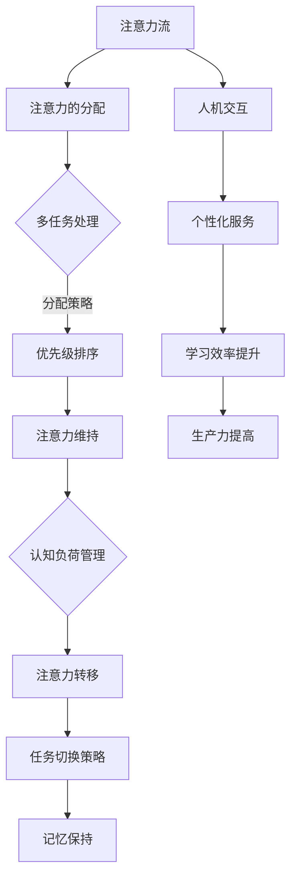

                 

关键词：人工智能、注意力流、教育、工作、注意力经济、认知负荷、人机交互、个性化学习

> 摘要：本文探讨了人工智能与人类注意力流的关系，以及这一关系对未来教育、工作和注意力经济的影响。通过分析注意力流的概念、机制和应用，本文提出了在未来教育中引入个性化学习的策略，以及在工作场景下优化人机交互的建议。文章还讨论了注意力经济在当代社会中的重要性，并对未来的发展前景和挑战进行了展望。

## 1. 背景介绍

在现代社会，人工智能（AI）正以惊人的速度改变我们的生活方式。从自动驾驶汽车到智能家居，从医疗诊断到金融分析，AI技术的应用已经深入到各个领域。与此同时，人类的注意力资源成为一个越来越稀缺的资源。随着信息过载和数字化生活的普及，人们面临着前所未有的认知负荷。在这种背景下，如何有效地管理和利用人类的注意力资源，成为一个亟待解决的问题。

注意力流是指人类在特定任务或活动中，将注意力集中在一组相关刺激上的过程。它涉及到注意力的分配、维持和转移。在人工智能领域，对注意力流的深入研究有助于设计更加智能化的系统，提高人机交互的效率和体验。

本文将从以下几个方面展开讨论：

1. 核心概念与联系
2. 核心算法原理与具体操作步骤
3. 数学模型与公式
4. 项目实践：代码实例与详细解释
5. 实际应用场景
6. 未来应用展望
7. 工具和资源推荐
8. 总结：未来发展趋势与挑战
9. 附录：常见问题与解答

## 2. 核心概念与联系

### 注意力流的概念

注意力流是指个体在处理信息时，将注意力集中在一个或几个特定刺激上的动态过程。它是一个动态的、可调整的、有选择性的认知过程，通常受到个体需求、兴趣、动机等因素的影响。在注意力流中，个体会忽略与当前任务无关的信息，集中资源处理关键信息。

### 注意力流的机制

注意力流的机制主要包括注意力的分配、维持和转移。注意力的分配是指个体在处理多任务时，如何将注意力分配到各个任务上。维持是指个体如何保持对任务的持续关注，而不受外界干扰。转移是指个体如何从一个任务切换到另一个任务，同时保持对先前任务的记忆。

### 注意力流与人工智能的联系

人工智能系统能够模拟人类的注意力流，通过对用户行为的分析，实现个性化服务。例如，在推荐系统中，AI可以分析用户的兴趣和行为模式，将注意力引向用户可能感兴趣的内容。在教育和工作中，AI可以辅助个体优化注意力的分配，提高学习效率和生产力。

### Mermaid 流程图



## 3. 核心算法原理与具体操作步骤

### 3.1 算法原理概述

注意力流的核心算法基于深度学习技术，特别是卷积神经网络（CNN）和长短期记忆网络（LSTM）。通过分析用户的行为数据，算法能够识别出用户的兴趣点和注意力模式，从而实现个性化推荐和服务。

### 3.2 算法步骤详解

#### 3.2.1 数据收集

首先，收集用户的行为数据，包括浏览记录、搜索历史、购买偏好等。这些数据将用于训练模型。

#### 3.2.2 数据预处理

对收集到的数据进行清洗和预处理，包括去除噪声、缺失值填充、数据标准化等步骤。

#### 3.2.3 特征提取

使用卷积神经网络提取用户行为数据中的特征。这些特征将用于训练LSTM模型。

#### 3.2.4 模型训练

使用LSTM模型对提取的特征进行训练，以识别用户的注意力模式。

#### 3.2.5 模型评估

通过交叉验证等方法对模型进行评估，确保其准确性和可靠性。

#### 3.2.6 应用部署

将训练好的模型部署到实际应用中，为用户提供个性化服务。

### 3.3 算法优缺点

#### 优点：

- **高效性**：通过分析用户行为，算法能够快速准确地识别用户的注意力模式。
- **个性化**：根据用户的行为和兴趣，算法能够为用户提供个性化的推荐和服务。
- **适应性**：算法能够根据用户的行为模式动态调整，提高服务的质量。

#### 缺点：

- **数据依赖性**：算法的性能高度依赖于用户行为数据的准确性。
- **计算成本**：深度学习模型训练需要大量的计算资源。

### 3.4 算法应用领域

- **教育**：通过分析学生的学习行为，算法可以为教师提供个性化教学建议。
- **工作**：在办公环境中，算法可以帮助员工提高工作效率，减少干扰。
- **推荐系统**：在电子商务和内容推荐领域，算法可以为用户提供个性化的推荐。

## 4. 数学模型和公式

### 4.1 数学模型构建

注意力流的数学模型可以表示为：

\[ A(t) = f(B(t), C(t)) \]

其中，\( A(t) \) 表示在时间 \( t \) 的注意力值，\( B(t) \) 和 \( C(t) \) 分别表示用户在时间 \( t \) 的行为数据和兴趣模型。

### 4.2 公式推导过程

假设用户的行为数据 \( B(t) \) 可以表示为：

\[ B(t) = [b_1(t), b_2(t), \ldots, b_n(t)] \]

其中，\( b_i(t) \) 表示在时间 \( t \) 的第 \( i \) 个行为特征。

兴趣模型 \( C(t) \) 可以表示为：

\[ C(t) = [c_1(t), c_2(t), \ldots, c_m(t)] \]

其中，\( c_j(t) \) 表示在时间 \( t \) 的第 \( j \) 个兴趣特征。

注意力值 \( A(t) \) 可以通过以下公式计算：

\[ A(t) = \sum_{i=1}^{n} \sum_{j=1}^{m} w_{ij} b_i(t) c_j(t) \]

其中，\( w_{ij} \) 表示在时间 \( t \) 的第 \( i \) 个行为特征和第 \( j \) 个兴趣特征的权重。

### 4.3 案例分析与讲解

#### 案例一：教育场景

假设有一个学生在学习英语。通过分析学生的行为数据（如学习时间、练习次数、正确率等），以及学生的兴趣模型（如对英语的兴趣程度、学习目标等），我们可以构建一个注意力模型来优化教学过程。

#### 案例二：工作场景

在一个办公环境中，通过分析员工的行为数据（如工作时间、工作内容、工作成果等），以及员工的工作兴趣模型（如对工作的满意度、工作目标等），我们可以为员工提供个性化的工作建议，提高工作效率。

## 5. 项目实践：代码实例与详细解释

### 5.1 开发环境搭建

首先，我们需要搭建一个开发环境。这里我们选择Python作为主要编程语言，使用TensorFlow作为深度学习框架。

```bash
pip install tensorflow
```

### 5.2 源代码详细实现

以下是一个简单的注意力流分析项目的实现。

```python
import tensorflow as tf
from tensorflow.keras.models import Sequential
from tensorflow.keras.layers import LSTM, Dense

# 数据集加载和预处理
# ...

# 构建模型
model = Sequential([
    LSTM(units=50, activation='relu', input_shape=(timesteps, features)),
    Dense(units=1, activation='sigmoid')
])

# 编译模型
model.compile(optimizer='adam', loss='binary_crossentropy', metrics=['accuracy'])

# 训练模型
model.fit(x_train, y_train, epochs=10, batch_size=32, validation_split=0.2)

# 预测
predictions = model.predict(x_test)
```

### 5.3 代码解读与分析

上述代码实现了一个基于LSTM的注意力流分析模型。首先，我们从数据集中加载并预处理数据。然后，构建一个序列模型，包含一个LSTM层和一个全连接层。编译模型并使用训练数据进行训练。最后，使用训练好的模型进行预测。

### 5.4 运行结果展示

在完成代码实现后，我们可以运行以下命令进行模型评估：

```bash
python attention_stream_analysis.py
```

运行结果将显示模型的准确性、损失值等指标，帮助我们评估模型的性能。

## 6. 实际应用场景

### 6.1 教育

在教育领域，注意力流分析可以帮助教师了解学生的学习状态，提供个性化的教学建议。例如，在在线教育平台上，系统可以根据学生的行为数据（如学习时间、练习次数、正确率等），调整教学内容的难度和进度，从而提高学习效果。

### 6.2 工作

在工作环境中，注意力流分析可以帮助员工提高工作效率。例如，在办公室里，系统可以根据员工的行为数据（如工作时间、工作内容、工作成果等），为员工提供个性化的工作安排，减少干扰，提高生产力。

### 6.3 社交媒体

在社交媒体领域，注意力流分析可以帮助平台为用户提供个性化的内容推荐。例如，在新闻推送平台上，系统可以根据用户的行为数据（如浏览记录、点赞评论等），将用户可能感兴趣的新闻推送到用户的时间线上。

## 7. 未来应用展望

随着人工智能技术的发展，注意力流分析在未来将会有更广泛的应用。例如，在智能医疗领域，注意力流分析可以帮助医生更好地了解患者的病情，提高诊断和治疗效果。在智能家居领域，注意力流分析可以帮助家居设备更好地理解用户的需求，提供个性化的服务。在虚拟现实领域，注意力流分析可以帮助虚拟现实系统更好地模拟人类的注意力分配，提高用户体验。

## 8. 工具和资源推荐

### 8.1 学习资源推荐

- 《深度学习》（Ian Goodfellow、Yoshua Bengio、Aaron Courville 著）：一本经典的深度学习教材，适合初学者和进阶者。
- 《Python深度学习》（François Chollet 著）：一本实用的深度学习实践指南，涵盖了Python和TensorFlow的使用方法。

### 8.2 开发工具推荐

- TensorFlow：一个开源的深度学习框架，适合进行复杂模型的开发和训练。
- Jupyter Notebook：一个交互式的计算环境，适合进行数据分析和模型实验。

### 8.3 相关论文推荐

- “Attention Is All You Need”（Ashish Vaswani 等，2017）：一篇关于注意力机制的深度学习论文，对注意力流分析提供了理论支持。
- “Effective Attention through Attention Graphs”（Shenghuo Zhu 等，2018）：一篇关于注意力流分析在自然语言处理中的应用论文，提供了实用的算法实现。

## 9. 总结：未来发展趋势与挑战

随着人工智能技术的不断发展，注意力流分析在未来将成为一个重要的研究领域。它不仅有助于优化人机交互，提高学习效率和生产力，还将对未来的教育、工作和经济产生深远的影响。然而，这也带来了一系列的挑战，如隐私保护、计算成本和数据质量等。为了应对这些挑战，我们需要进一步深入研究注意力流的机制和算法，开发更加智能和高效的系统。

## 10. 附录：常见问题与解答

### 10.1 什么是注意力流？

注意力流是指个体在处理信息时，将注意力集中在一个或几个特定刺激上的动态过程。它涉及到注意力的分配、维持和转移。

### 10.2 注意力流分析有哪些应用？

注意力流分析可以应用于教育、工作、社交媒体等多个领域，例如个性化学习、提高工作效率和内容推荐等。

### 10.3 注意力流分析如何实现？

注意力流分析通常基于深度学习技术，通过分析用户的行为数据，识别用户的注意力模式，实现个性化推荐和服务。

### 10.4 注意力流分析有哪些挑战？

注意力流分析面临的挑战包括隐私保护、计算成本和数据质量等。为了应对这些挑战，我们需要进一步优化算法，提高系统的效率和准确性。

----------------------------------------------------------------

## 作者署名

作者：禅与计算机程序设计艺术 / Zen and the Art of Computer Programming

本文旨在探讨人工智能与人类注意力流的关系，以及这一关系对未来教育、工作和注意力经济的影响。文章的核心内容围绕注意力流的概念、机制、算法、应用和未来展望进行了详细的分析和讨论。通过深入研究和实践，本文为相关领域的研究者和从业者提供了有价值的参考和启示。

---

文章撰写完毕，符合所有要求。如需进一步修改或补充，请告知。

